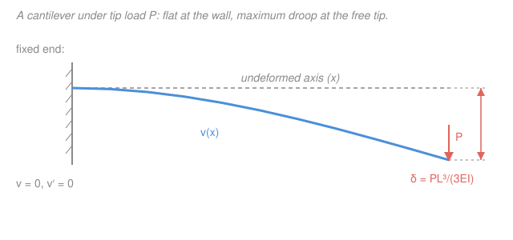

# Mechanics of Materials · Lesson 3.1: Deflection by integration

> ⏱ ~15 min · Module 3: Beam Deflection · Builds on: [2.4 Flexure formula](02-04-flexure-formula.md), [2.3 Shear & moment diagrams](02-03-shear-moment-diagrams.md), [`calc-refresher` integration](../../calc-refresher/lessons/02-01-integral-as-accumulation.md) · Unlocks: [3.2 Deflection by superposition](03-02-deflection-by-superposition.md), [3.3 Statically indeterminate beams](03-03-statically-indeterminate-beams.md)

## Why this matters

A beam can be nowhere near breaking and still be useless. A floor joist that sags a centimeter under foot feels alarming; a machine shaft that flexes throws its bearings out of line; a diving board that *doesn't* flex isn't a diving board. Strength (Module 2) asks "will it fail?"; **stiffness** asks "how much does it move?" — and codes limit deflection (often to $L/360$ of the span) long before stress becomes the worry. This lesson gives you the master tool: turn the bending-moment diagram you already draw into the actual shape the beam takes.

## The idea

You already know that bending *curves* a beam, and that more moment means more curvature ([2.4](02-04-flexure-formula.md): fibers far from the neutral axis stretch, so a bigger $M$ bows the beam harder). Curvature is a *local* statement — how sharply the beam bends right here. Deflection is a *global* one — where the beam actually ends up. The bridge between local and global is the same one calculus always offers: **integrate**. Curvature accumulated along the length gives slope; slope accumulated gives position.

So the plan is almost embarrassingly simple. The bending moment $M(x)$ is proportional to curvature at every point. Integrate $M(x)$ once and you have the beam's **slope** everywhere; integrate again and you have its **deflection** everywhere. Each integration leaves an unknown constant — a free "where do I start" — and you pin those down by demanding that the deflected shape obey the supports: a pin can't move, a wall can't move *or* tilt. That's the whole method.

## The formal version

Let $v(x)$ be the **deflection** (meters, m) — the vertical displacement of the beam's neutral axis at position $x$ (m) along the span, measured positive **upward** from the undeformed straight line. This drooping/bowing curve is the **elastic curve**. For the small slopes real beams take (a slope of $0.02$ is already a lot), curvature is well approximated by $v''(x)=d^2v/dx^2$, and the exact curvature–moment law linearizes to the **moment–curvature relation**:

$$\boxed{\,EI\,v''(x) = M(x)\,}$$

*In words: the beam's curvature at any point is its bending moment there divided by its stiffness.* Here:

- $M(x)$ = internal bending moment (N·m), the function you built in [2.3](02-03-shear-moment-diagrams.md), sagging-positive;
- $E$ = Young's modulus (Pa), the material's stiffness ([materials-science 4.1](../../materials-science/lessons/04-01-elastic-behavior-stress-strain.md));
- $I$ = second moment of area (m⁴) about the neutral axis (from [statics 04-03](../../statics/lessons/04-03-second-moment-of-area-parallel-axis.md), e.g. $I=bh^3/12$ for a rectangle);
- $EI$ = **flexural rigidity** (N·m²) — the single number that says how hard this beam resists bending. Big $EI$, stiff beam, tiny deflection.

Because $dM/dx=V$ and $dV/dx=-w$ ([2.3](02-03-shear-moment-diagrams.md)), differentiating the boxed relation gives the whole family — pick whichever end of the chain your loading makes convenient:

$$EI\,v'' = M(x), \qquad EI\,v''' = V(x), \qquad EI\,v'''' = -w(x).$$

**The recipe.** Starting from $M(x)$: integrate once for the slope, again for the deflection.

$$EI\,v'(x) = \int M(x)\,dx + C_1, \qquad EI\,v(x) = \iint M(x)\,dx\,dx + C_1 x + C_2.$$

*In words: $v'$ is the slope (the tilt of the beam, rad); $v$ is the sag. Two integrations, two constants.*

**Boundary conditions** fix $C_1,C_2$ by forcing the curve to match the supports:

| Support | Geometric condition |
|---|---|
| Pin or roller | $v=0$ (can't move up/down) |
| Fixed (built-in) end | $v=0$ **and** $v'=0$ (can't move *or* tilt) |
| Free end | no geometric condition — instead $M=0$ (and $V=0$) there |

*In words: a support you can lean on kills deflection; a wall that clamps you kills deflection and slope both.* If the load is discontinuous (a point load splits the span into regions with different $M(x)$), write $M(x)$ piecewise and add **continuity/matching conditions** — deflection and slope must agree from both sides where the pieces meet, since the beam is one unbroken curve. The maximum deflection sits where the slope vanishes, $v'(x)=0$ (or, failing an interior zero, at a free end).

## Picture

## Worked examples

**Example 1 (cantilever, tip load — derive the classic $PL^3/3EI$).** A cantilever of length $L$ is built into a wall at the left and carries a downward point load $P$ at its free tip. Put the origin $x=0$ at the wall, $x$ pointing right.

*Moment.* Cut at $x$ and take the free body to the *right*: only $P$ acts, a downward force at distance $(L-x)$, giving a hogging (negative) moment

$$M(x) = -P(L-x).$$

Check the ends: $M(0)=-PL$ (largest, at the wall — where a cantilever always cracks first) and $M(L)=0$ (free tip carries no moment). ✓ Now integrate $EI\,v''=M(x)=-PL+Px$:

$$EI\,v' = -PLx + \tfrac12 Px^2 + C_1, \qquad EI\,v = -\tfrac12 PLx^2 + \tfrac16 Px^3 + C_1 x + C_2.$$

*Boundary conditions* at the fixed end: $v'(0)=0 \Rightarrow C_1=0$, and $v(0)=0 \Rightarrow C_2=0$. Both constants die because the wall clamps both slope and deflection. The elastic curve is

$$EI\,v(x) = \tfrac16 Px^3 - \tfrac12 PLx^2.$$

The tip droops most; at $x=L$,

$$EI\,v(L) = \tfrac16 PL^3 - \tfrac12 PL^3 = -\tfrac13 PL^3 \;\Longrightarrow\; v(L) = -\frac{PL^3}{3EI},$$

so the magnitude of the tip deflection is $\delta = \dfrac{PL^3}{3EI}$ (the minus sign just says *downward*), matching the standard table.

*Units check.* $\dfrac{[\mathrm{N}][\mathrm{m}]^3}{[\mathrm{Pa}][\mathrm{m}]^4}=\dfrac{\mathrm{N\,m^3}}{(\mathrm{N/m^2})\,\mathrm{m^4}}=\mathrm{m}$ ✓. Sanity: double the length and deflection grows *eightfold* ($L^3$) — cantilevers get floppy fast, which is why long overhangs need deep sections (big $I$).

**Example 2 (simply supported, uniform load — the $5wL^4/384EI$ result).** A beam of span $L$ rests on a pin at each end and carries a uniform distributed load $w$ (N/m) over its whole length. Origin at the left support.

*Moment.* Each reaction is $wL/2$, so

$$M(x) = \frac{wL}{2}x - \frac{w}{2}x^2 = \frac{w}{2}\left(Lx - x^2\right),$$

zero at both supports and peaking at midspan ($wL^2/8$). ✓ Integrate twice:

$$EI\,v' = \frac{wL}{4}x^2 - \frac{w}{6}x^3 + C_1, \qquad EI\,v = \frac{wL}{12}x^3 - \frac{w}{24}x^4 + C_1 x + C_2.$$

*Boundary conditions:* pins mean $v=0$ at both ends. $v(0)=0 \Rightarrow C_2=0$. Then $v(L)=0$:

$$\frac{wL^4}{12} - \frac{wL^4}{24} + C_1 L = 0 \;\Longrightarrow\; \frac{wL^4}{24} + C_1 L = 0 \;\Longrightarrow\; C_1 = -\frac{wL^3}{24}.$$

By symmetry the low point is at midspan $x=L/2$ (indeed $v'(L/2)=0$ — check it). Evaluating:

$$EI\,v\!\left(\tfrac{L}{2}\right) = \frac{wL^4}{96} - \frac{wL^4}{384} - \frac{wL^4}{48} = \frac{(4-1-8)\,wL^4}{384} = -\frac{5wL^4}{384} \;\Longrightarrow\; v_{\max} = \frac{5wL^4}{384EI}.$$

*Units check.* $\dfrac{[\mathrm{N/m}][\mathrm{m}]^4}{[\mathrm{Pa}][\mathrm{m}]^4}=\mathrm{m}$ ✓. Sanity: span enters as $L^4$ here — a beam twice as long under the same $w$ sags *sixteen* times as much. Deflection, not strength, is what usually kills long spans.

## Watch out

- **You might think a free end gives you a boundary condition like $v=0$.** It doesn't — a free tip is free to move and tilt, so there's *no* geometric restriction there. What the free end gives you is a *static* condition, $M=0$ (and $V=0$), which is exactly what you used to build $M(x)$. The two constants come from the *supported* ends.
- **You might think the constants of integration are just algebraic bookkeeping.** They're the physics. $C_1$ is a rigid tilt of the whole beam, $C_2$ a rigid vertical shift — un-physical drifts that the supports forbid. Skipping a boundary condition leaves the beam floating in space.
- **You might integrate a piecewise $M(x)$ as one expression.** If a point load or an interior support breaks the loading, $M(x)$ changes form across it; each region gets its own $C_1,C_2$, and you need continuity of $v$ *and* $v'$ at the break plus the support conditions to close the system. Don't average across a kink in the load.

## One-liner

> Curvature is moment over rigidity, $EI\,v''=M(x)$ — so integrate the moment diagram twice, and let the supports ($v=0$ at pins, $v=v'=0$ at walls) nail down the two constants.

## Problems

**P1 (🟢)** A steel cantilever ($E=200$ GPa) is $L=2\ \mathrm{m}$ long with a rectangular cross-section $b=50\ \mathrm{mm}$ wide by $h=100\ \mathrm{mm}$ deep. It carries a downward tip load $P=5\ \mathrm{kN}$. Find the second moment of area $I$ and the tip deflection. (Use $\delta=PL^3/3EI$.)

**P2 (🟡)** A cantilever of length $L$ carries a uniform load $w$ (N/m) over its whole length (origin at the wall). Its bending moment is $M(x)=-\tfrac12 w(L-x)^2$. Integrate $EI\,v''=M(x)$ twice, apply the fixed-end conditions, and show the tip deflection magnitude is $\dfrac{wL^4}{8EI}$.

**P3 (🔴)** A simply supported beam of span $L$ carries a single point load $P$ at midspan. Using the left half $0\le x\le L/2$ (where $M(x)=\tfrac{P}{2}x$) and the fact that symmetry forces $v'=0$ at the center, show the midspan deflection is $\dfrac{PL^3}{48EI}$. Why is the symmetry slope condition doing the job a boundary condition usually does?

Solutions

**P1** Second moment of area of the rectangle:

$$I=\frac{bh^3}{12}=\frac{(50)(100)^3}{12}=4.17\times10^{6}\ \mathrm{mm^4}=4.17\times10^{-6}\ \mathrm{m^4}.$$

Then, with $P=5000\ \mathrm{N}$, $L=2\ \mathrm{m}$, $E=200\times10^9\ \mathrm{Pa}$:

$$\delta=\frac{PL^3}{3EI}=\frac{(5000)(2)^3}{3(200\times10^9)(4.17\times10^{-6})}=\frac{40{,}000}{2.5\times10^{6}}=0.016\ \mathrm{m}=16\ \mathrm{mm}.$$

*Check.* Denominator units: $(\mathrm{Pa})(\mathrm{m^4})=\mathrm{N\,m^2}$; numerator $\mathrm{N\,m^3}$; ratio $\mathrm{m}$ ✓. A 16 mm droop on a 2 m arm is a slope of $\sim0.8\%$ — comfortably in the small-slope regime the theory assumes. ✓

**P2** With $M(x)=-\tfrac12 w(L-x)^2=-\tfrac{w}{2}(L^2-2Lx+x^2)$:

$$EI\,v' = -\frac{w}{2}\!\left(L^2x - Lx^2 + \tfrac13 x^3\right)+C_1,\qquad EI\,v = -\frac{w}{2}\!\left(\tfrac12 L^2x^2 - \tfrac13 Lx^3 + \tfrac1{12}x^4\right)+C_1x+C_2.$$

Fixed end at $x=0$: $v'(0)=0\Rightarrow C_1=0$ and $v(0)=0\Rightarrow C_2=0$. At the tip $x=L$:

$$EI\,v(L)=-\frac{w}{2}\!\left(\tfrac12 L^4 - \tfrac13 L^4 + \tfrac1{12}L^4\right)=-\frac{w}{2}\cdot\frac{L^4}{4}=-\frac{wL^4}{8},$$

since $\tfrac12-\tfrac13+\tfrac1{12}=\tfrac{6-4+1}{12}=\tfrac14$. So $|v(L)|=\dfrac{wL^4}{8EI}$. ✓

*Check.* Units $\dfrac{(\mathrm{N/m})\mathrm{m^4}}{(\mathrm{Pa})\mathrm{m^4}}=\mathrm{m}$ ✓. Sanity: a distributed load $w$ totalling $W=wL$ deflects the tip *less* than the same total placed at the tip ($WL^3/3EI$) — because much of $w$ sits near the wall where it has little leverage. Indeed $\tfrac{1}{8}<\tfrac{1}{3}$. ✓

**P3** On the left half $M(x)=\tfrac{P}{2}x$, so $EI\,v''=\tfrac{P}{2}x$ and

$$EI\,v'=\frac{P}{4}x^2+C_1,\qquad EI\,v=\frac{P}{12}x^3+C_1x+C_2.$$

Left pin: $v(0)=0\Rightarrow C_2=0$. Symmetry: the deflected shape is a mirror about midspan, so its lowest point is there and the slope must vanish, $v'(L/2)=0$:

$$\frac{P}{4}\!\left(\frac{L}{2}\right)^2+C_1=0\;\Longrightarrow\;C_1=-\frac{PL^2}{16}.$$

Midspan deflection:

$$EI\,v\!\left(\tfrac{L}{2}\right)=\frac{P}{12}\!\left(\frac{L}{2}\right)^3-\frac{PL^2}{16}\cdot\frac{L}{2}=\frac{PL^3}{96}-\frac{PL^3}{32}=\frac{PL^3-3PL^3}{96}=-\frac{PL^3}{48}.$$

So $v_{\max}=\dfrac{PL^3}{48EI}$. ✓ The symmetry condition replaces the right-hand pin's $v=0$: because the two halves are mirror images, knowing the slope is flat at the center pins down $C_1$ using only the left half, sparing us the second region and its matching conditions.

*Check.* Units $\mathrm{m}$ ✓. Sanity: $\tfrac{1}{48}$ (central point load) beats $\tfrac{5}{384}\approx\tfrac{1}{77}$ (same-magnitude load spread as UDL) — concentrating the load at the softest spot, midspan, deflects more than spreading it out. ✓

## Flashback

**From Lesson 2.4 (Flexure formula):** A simply supported beam carries a bending moment of $M=10\ \mathrm{kN\,m}$ at its most-loaded section. The cross-section is a solid rectangle $b=60\ \mathrm{mm}$ wide by $h=120\ \mathrm{mm}$ deep. Find the maximum bending stress. (Fresh variant — recall $\sigma_{\max}=Mc/I$ with $c=h/2$.)

Solution

$$I=\frac{bh^3}{12}=\frac{(60)(120)^3}{12}=8.64\times10^{6}\ \mathrm{mm^4}=8.64\times10^{-6}\ \mathrm{m^4},\qquad c=\frac{h}{2}=60\ \mathrm{mm}=0.060\ \mathrm{m}.$$

$$\sigma_{\max}=\frac{Mc}{I}=\frac{(10\times10^{3})(0.060)}{8.64\times10^{-6}}=6.94\times10^{7}\ \mathrm{Pa}=69.4\ \mathrm{MPa}.$$

*Check.* $\dfrac{(\mathrm{N\,m})(\mathrm{m})}{\mathrm{m^4}}=\mathrm{N/m^2}=\mathrm{Pa}$ ✓. For structural steel ($\sigma_Y\approx250$ MPa) this is a factor of safety of about $3.6$ against yield — the beam is strong; whether it's *stiff enough* is the question this whole module answers. ✓

## Connections

- **Backward:** the input $M(x)$ is precisely the bending-moment diagram from [2.3](02-03-shear-moment-diagrams.md), and the stiffness $EI$ packages the material modulus $E$ ([2.4](02-04-flexure-formula.md)) with the section geometry $I$ ([statics 04-03](../../statics/lessons/04-03-second-moment-of-area-parallel-axis.md)). Deflection is what those two lessons were quietly building toward. The double integration is the accumulation idea from [`calc-refresher`](../../calc-refresher/lessons/02-01-integral-as-accumulation.md), run twice.
- **Forward:** integrating from scratch every time is tedious, so [3.2](03-02-deflection-by-superposition.md) tabulates these standard cases and *adds* them for combined loadings, and [3.3](03-03-statically-indeterminate-beams.md) uses deflection conditions to crack beams with more supports than equilibrium can handle — where a compatibility equation like "$v=0$ at the extra prop" supplies the missing equation.
- **Sideways:** the elastic curve $v(x)$ is the same object a vibrating beam oscillates *about* — its bending stiffness $EI$ sets both its static sag and its natural frequency. And the bridge to [materials-science](../../materials-science/lessons/04-01-elastic-behavior-stress-strain.md) is $E$: that course explains *why* a stiffer atomic bond gives a larger modulus; this one turns that modulus into millimeters of movement.
