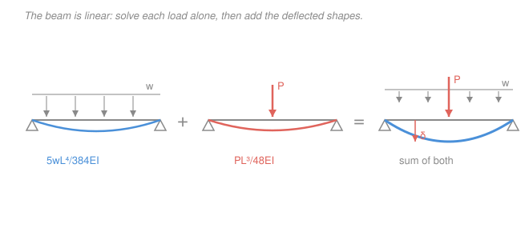

# Mechanics of Materials · Lesson 3.2: Deflection by superposition

> ⏱ ~15 min · Module 3: Beam deflection · Builds on: [3.1 Deflection by integration](03-01-deflection-by-integration.md) · Unlocks: [3.3 Statically indeterminate beams](03-03-statically-indeterminate-beams.md), Boss problem 3

## Why this matters

In [3.1](03-01-deflection-by-integration.md) you found beam deflections by integrating $EI\,v'' = M(x)$ twice and grinding through boundary conditions. It works, but it's slow — and real beams carry *several* loads at once (self-weight plus a point load plus a moment from a bolted connection). Re-integrating for every new combination is a waste. This lesson gives you the engineer's shortcut: **look each load up in a table and add the answers.** It's the single most-used deflection technique in practice, and it's the exact tool that cracks open **indeterminate beams** in [3.3](03-03-statically-indeterminate-beams.md) — where you'll superpose a real load and an unknown redundant reaction, then force their deflections to cancel.

## The idea

Here's the one fact that makes it all work: the beam equation is **linear**. Double every load and you double every deflection; there are no squared terms, no products of loads. Nothing about how load A bends the beam changes when load B shows up — each acts as if the other weren't there, and the two deflected shapes simply stack.

So instead of solving a fresh differential equation, you break a messy load into pieces you already know, read each piece's deflection off a **standard table**, and sum them. A cantilever with a tip load *and* a distributed load? That's "tip-load case" plus "distributed-load case," added. The hard part isn't calculus anymore — it's bookkeeping: getting the signs right and making sure each table entry is measured at the point you care about.

## The formal version

The elastic-curve equation and its load form (from [3.1](03-01-deflection-by-integration.md)) are

$$EI\,v''(x) = M(x), \qquad EI\,v''''(x) = -w(x),$$

where $v$ is the transverse deflection (m, **downward positive** here), $x$ the position along the beam (m), $E$ the elastic modulus (Pa), and $I$ the second moment of area (m$^4$). Because the left side is a linear operator on $v$ and the right side is additive in the loads, if load set 1 alone produces $v_1(x)$ and load set 2 alone produces $v_2(x)$, then together they produce

$$\boxed{\,v(x) = v_1(x) + v_2(x)\,}$$

*In words: deflections caused by different loads just add — and so do slopes $v'$, since differentiation is linear too.* This is the **principle of superposition**. It holds as long as the material stays linear-elastic (Hooke's law) and deflections stay small enough that $M(x)$ doesn't depend on the deflection itself — the standard beam assumptions.

**The standard table.** These are the tabulated results you superpose. All are for constant $EI$; $L$ is the span, $\delta$ a deflection (m), $\theta$ a slope (rad), and every value is the standard sign (in the direction of the load). Memorize the boxed shapes; the rest follow.

*Cantilever (fixed at left, free at right), quantities at the free tip:*

| Load | Tip deflection $\delta$ | Tip slope $\theta$ |
|---|---|---|
| End load $P$ | $\dfrac{PL^3}{3EI}$ | $\dfrac{PL^2}{2EI}$ |
| Uniform load $w$ (full span) | $\dfrac{wL^4}{8EI}$ | $\dfrac{wL^3}{6EI}$ |
| End moment $M$ (at tip) | $\dfrac{ML^2}{2EI}$ | $\dfrac{ML}{EI}$ |

*Simply supported (pin + roller), quantities at midspan / at the ends:*

| Load | Midspan deflection $\delta$ | End slope $\theta$ |
|---|---|---|
| Central load $P$ | $\dfrac{PL^3}{48EI}$ | $\dfrac{PL^2}{16EI}$ |
| Uniform load $w$ (full span) | $\dfrac{5wL^4}{384EI}$ | $\dfrac{wL^3}{24EI}$ |
| End moment $M$ (at one end) | $\dfrac{ML^2}{16EI}$ | $\dfrac{ML}{3EI}$ (near), $\dfrac{ML}{6EI}$ (far) |

*Off-center point load* $P$ at distance $a$ from the left support, $b = L - a$ from the right, with $a \ge b$ (load in the right half). The deflection **at midspan** is

$$\delta_{\text{mid}} = \frac{Pb\,(3L^2 - 4b^2)}{48EI}.$$

*In words: a load anywhere still has a clean midspan formula.* Check it against the table: at center $a=b=L/2$, this collapses to $PL^3/48EI$ — the central-load entry, as it must.

**Two bookkeeping rules.**
1. **Signs.** Pick down as positive and keep it. A load that pushes the beam down adds a positive $\delta$; an upward load (or an upward reaction, as in [3.3](03-03-statically-indeterminate-beams.md)) subtracts. Table values already carry the "in the load's direction" sign — you supply the plus or minus.
2. **Same point, same quantity.** You may only add contributions evaluated at the *same location*, and slopes add to slopes, deflections to deflections. Don't add a tip deflection to a midspan deflection and call it anything.

**Loads not in the table.** Rescale or split. A partial uniform load over half a span = full-span load minus the missing half (superpose a positive and a negative UDL). A triangular load ≈ sum of strips, each a point load $dP = w(x)\,dx$ integrated — but usually a fuller table entry exists; reach for algebra only when it must.

## Picture

## Worked examples

**Example 1 (cantilever: tip load + distributed load).** A steel cantilever of length $L = 2\ \mathrm{m}$ carries a downward tip load $P = 3\ \mathrm{kN}$ and a uniform load $w = 4\ \mathrm{kN/m}$ over its whole span. Take $EI = 4\times10^{6}\ \mathrm{N\,m^2}$. Find the tip deflection and tip slope.

Superpose the two cantilever entries:

$$\delta_{\text{tip}} = \underbrace{\frac{PL^3}{3EI}}_{\text{tip load}} + \underbrace{\frac{wL^4}{8EI}}_{\text{UDL}}.$$

Tip-load part: $\dfrac{PL^3}{3EI} = \dfrac{(3000)(2)^3}{3(4\times10^6)} = \dfrac{24{,}000}{12\times10^6} = 2.0\times10^{-3}\ \mathrm{m}.$

UDL part: $\dfrac{wL^4}{8EI} = \dfrac{(4000)(2)^4}{8(4\times10^6)} = \dfrac{64{,}000}{32\times10^6} = 2.0\times10^{-3}\ \mathrm{m}.$

$$\delta_{\text{tip}} = 2.0 + 2.0 = 4.0\ \mathrm{mm}\ (\text{down}).$$

Slopes add the same way:

$$\theta_{\text{tip}} = \frac{PL^2}{2EI} + \frac{wL^3}{6EI} = \frac{(3000)(4)}{2(4\times10^6)} + \frac{(4000)(8)}{6(4\times10^6)} = 1.5\times10^{-3} + 1.33\times10^{-3} = 2.83\times10^{-3}\ \mathrm{rad}.$$

*Check.* Units of $PL^3/EI$: $\mathrm{N\cdot m^3 / (N\,m^2)} = \mathrm{m}$ ✓; the slope is dimensionless (rad) ✓. Both contributions come out the same order, and $2.83\times10^{-3}\ \mathrm{rad} \approx 0.16^\circ$ — a small slope, consistent with small-deflection theory. ✓

**Example 2 (simply supported: off-center load + UDL).** A simply supported steel beam spans $L = 4\ \mathrm{m}$. It carries a uniform load $w = 5\ \mathrm{kN/m}$ over the full span and a point load $P = 10\ \mathrm{kN}$ located $2.5\ \mathrm{m}$ from the left support. Use $E = 200\ \mathrm{GPa}$ and $I = 40\times10^{6}\ \mathrm{mm^4}$. Find the **midspan** deflection.

First the stiffness, in SI. $I = 40\times10^{6}\ \mathrm{mm^4} = 40\times10^{-6}\ \mathrm{m^4}$, so

$$EI = (200\times10^9)(40\times10^{-6}) = 8\times10^{6}\ \mathrm{N\,m^2}.$$

*UDL contribution* (table entry, midspan):

$$\delta_w = \frac{5wL^4}{384EI} = \frac{5(5000)(4)^4}{384(8\times10^6)} = \frac{6.4\times10^{6}}{3.072\times10^{9}} = 2.08\times10^{-3}\ \mathrm{m}.$$

*Point-load contribution.* The load isn't central, so use the off-center midspan formula with $b$ = distance to the *nearer* support. From the left it's $2.5\ \mathrm{m}$, from the right $b = 4 - 2.5 = 1.5\ \mathrm{m}$; since $a = 2.5 \ge b = 1.5$, take $b = 1.5\ \mathrm{m}$:

$$\delta_P = \frac{Pb\,(3L^2 - 4b^2)}{48EI} = \frac{(10{,}000)(1.5)\big(3(4)^2 - 4(1.5)^2\big)}{48(8\times10^6)} = \frac{(10{,}000)(1.5)(48 - 9)}{3.84\times10^{8}} = \frac{585{,}000}{3.84\times10^{8}} = 1.52\times10^{-3}\ \mathrm{m}.$$

Superpose (both loads act downward, so both add):

$$\delta_{\text{mid}} = \delta_w + \delta_P = 2.08 + 1.52 = 3.60\ \mathrm{mm}\ (\text{down}).$$

*Check.* Units of each term: $\mathrm{N\cdot m^3/(N\,m^2)} = \mathrm{m}$ ✓. Sanity: had the point load sat at center, its part would be $PL^3/48EI = (10{,}000)(64)/(48\cdot8\times10^6) = 1.67\ \mathrm{mm}$ — slightly *more* than our $1.52\ \mathrm{mm}$, exactly as expected since an off-center load deflects the midpoint a bit less than a central one. ✓ Note this off-center load makes midspan deflection close to, but not equal to, the true maximum (which sits nearer the load) — superposition gives you the value *at the point you evaluate*, no more.

## Watch out

- **You might think you can add stresses or reactions this way and stop worrying about signs.** Superposition of *deflections* is real, but it's a signed sum: an upward force contributes a *negative* downward deflection. In [3.3](03-03-statically-indeterminate-beams.md) the whole method is "downward deflection from the load = upward deflection from the redundant reaction" — get one sign wrong and the beam appears to deflect the wrong way.
- **You might grab a table value measured at the wrong place.** The SS "$5wL^4/384EI$" is the *midspan* deflection; the cantilever "$wL^4/8EI$" is the *tip* deflection. You can only sum contributions at the *same* point. If one load's peak deflection is at $x = 1.8\ \mathrm{m}$ and another's is at midspan, you must evaluate *both* at the same $x$ before adding — the maxima generally don't line up.
- **You might forget superposition needs a linear system.** It fails the moment the material yields, or the deflections grow large enough that the axial load starts adding bending (beam-columns). Inside ordinary linear-elastic, small-deflection theory it's exact; outside it, it's not even approximate.

## One-liner

> Because the beam equation is linear, deflections from separate loads add — so look each load up in a table and sum them (watching signs and the point of evaluation) instead of re-integrating.

## Problems

**P1 (🟢)** A steel cantilever, $L = 2\ \mathrm{m}$, $EI = 8\times10^{6}\ \mathrm{N\,m^2}$, carries a downward tip load $P = 4\ \mathrm{kN}$ and a uniform load $w = 6\ \mathrm{kN/m}$ over its full length. Find the tip deflection, and say which load contributes more.

**P2 (🟡)** A simply supported beam spans $L = 6\ \mathrm{m}$ with $EI = 20\times10^{6}\ \mathrm{N\,m^2}$. It carries a central point load $P = 8\ \mathrm{kN}$ and a uniform load $w = 2\ \mathrm{kN/m}$ over the whole span. Find the midspan deflection by superposition.

**P3 (🔴)** A simply supported beam spans $L = 6\ \mathrm{m}$, $EI = 15\times10^{6}\ \mathrm{N\,m^2}$. It carries **two** equal downward point loads $P = 5\ \mathrm{kN}$, one $2\ \mathrm{m}$ from the left support and one $2\ \mathrm{m}$ from the right (symmetric). Find the midspan deflection. (Use the off-center formula for each load and superpose. Why is midspan the maximum here?)

Solutions

**P1** Superpose the two cantilever tip entries:

$$\frac{PL^3}{3EI} = \frac{(4000)(8)}{3(8\times10^6)} = \frac{32{,}000}{24\times10^6} = 1.33\times10^{-3}\ \mathrm{m} = 1.33\ \mathrm{mm},$$
$$\frac{wL^4}{8EI} = \frac{(6000)(16)}{8(8\times10^6)} = \frac{96{,}000}{64\times10^6} = 1.50\times10^{-3}\ \mathrm{m} = 1.50\ \mathrm{mm}.$$

$$\delta_{\text{tip}} = 1.33 + 1.50 = 2.83\ \mathrm{mm}\ (\text{down}).$$

The **uniform load** contributes more ($1.50$ vs $1.33\ \mathrm{mm}$). *Check.* Units $\mathrm{N\,m^3/(N\,m^2)} = \mathrm{m}$ ✓; result a few mm on a 2 m beam is a slope $\sim10^{-3}$, safely small. ✓

**P2** Central-load plus UDL, both at midspan:

$$\frac{PL^3}{48EI} = \frac{(8000)(216)}{48(20\times10^6)} = \frac{1.728\times10^{6}}{9.6\times10^{8}} = 1.80\times10^{-3}\ \mathrm{m},$$
$$\frac{5wL^4}{384EI} = \frac{5(2000)(1296)}{384(20\times10^6)} = \frac{1.296\times10^{7}}{7.68\times10^{9}} = 1.69\times10^{-3}\ \mathrm{m}.$$

$$\delta_{\text{mid}} = 1.80 + 1.69 = 3.49\ \mathrm{mm}\ (\text{down}).$$

*Check.* Both terms same order; $L^4 = 1296\ \mathrm{m^4}$, $L^3 = 216\ \mathrm{m^3}$ arithmetic verified. Units $\mathrm{m}$ ✓. ✓

**P3** For each load, $b$ = distance to the nearer support $= 2\ \mathrm{m}$ (each load's shorter segment). With $L = 6$: $3L^2 - 4b^2 = 3(36) - 4(4) = 108 - 16 = 92\ \mathrm{m^2}$. Each load's midspan contribution:

$$\delta_1 = \frac{Pb\,(3L^2 - 4b^2)}{48EI} = \frac{(5000)(2)(92)}{48(15\times10^6)} = \frac{920{,}000}{7.2\times10^{8}} = 1.28\times10^{-3}\ \mathrm{m}.$$

By symmetry the second load gives the same, so superpose:

$$\delta_{\text{mid}} = 2\,\delta_1 = 2(1.28) = 2.56\ \mathrm{mm}\ (\text{down}).$$

Midspan is the maximum because the loading is **symmetric** about the center: the deflected shape is symmetric, so its peak (zero slope) must sit at the axis of symmetry, i.e. midspan. *Check.* If instead the two loads merged at center ($2P = 10\ \mathrm{kN}$ central) the deflection would be $\tfrac{(10{,}000)(216)}{48(15\times10^6)} = 3.0\ \mathrm{mm}$; spreading the same total load outward toward the supports reduces it to $2.56\ \mathrm{mm}$, which is the right direction. ✓

## Flashback

**From Lesson 2.4 (The flexure formula):** A simply supported beam has a rectangular cross-section $b = 50\ \mathrm{mm}$ wide by $h = 100\ \mathrm{mm}$ deep. At the critical section the bending moment is $M = 12\ \mathrm{kN\,m}$. Find the maximum bending stress. (Fresh numbers — recompute from the section geometry.)

Solution

Maximum stress is at the extreme fiber: $\sigma_{\max} = \dfrac{Mc}{I} = \dfrac{M}{S}$, with section modulus $S = \dfrac{I}{c}$. For a rectangle, $I = \dfrac{bh^3}{12}$ and $c = h/2$, so $S = \dfrac{bh^2}{6}$:

$$S = \frac{(50)(100)^2}{6} = \frac{500{,}000}{6} = 8.33\times10^{4}\ \mathrm{mm^3}.$$

$$\sigma_{\max} = \frac{M}{S} = \frac{12\times10^{6}\ \mathrm{N\,mm}}{8.33\times10^{4}\ \mathrm{mm^3}} = 144\ \mathrm{N/mm^2} = 144\ \mathrm{MPa}.$$

*Check.* Keep units consistent: $M = 12\ \mathrm{kN\,m} = 12\times10^{6}\ \mathrm{N\,mm}$, and $1\ \mathrm{N/mm^2} = 1\ \mathrm{MPa}$ ✓. Cross-check via $Mc/I$: $I = \tfrac{(50)(100)^3}{12} = 4.17\times10^{6}\ \mathrm{mm^4}$, $c = 50\ \mathrm{mm}$, $\sigma = \tfrac{(12\times10^6)(50)}{4.17\times10^6} = 144\ \mathrm{MPa}$ ✓. Well under steel's $\sigma_Y \approx 250\ \mathrm{MPa}$, so the section is elastic — which is exactly the regime that makes today's superposition valid. ✓

## Connections

- **Backward:** every table entry in this lesson is a solved case of [3.1](03-01-deflection-by-integration.md)'s $EI\,v'' = M(x)$ — you're reusing integration results instead of redoing them. The $M(x)$ diagrams come from [2.3 shear and moment diagrams](02-03-shear-moment-diagrams.md) and [`statics` 04-02](../../statics/lessons/04-02-shear-bending-moment-diagrams.md); the $I$ you plug in comes from [`statics` 04-03 (second moment of area)](../../statics/lessons/04-03-second-moment-of-area-parallel-axis.md).
- **Forward:** [3.3 Statically indeterminate beams](03-03-statically-indeterminate-beams.md) is superposition with a twist — remove a redundant support, compute the deflection the real loads cause there, then find the reaction that pushes it back to zero. The signed bookkeeping you practiced here is the whole method. Boss problem 3 combines both.
- **Sideways:** superposition is the same linearity that let you add stress states in axial and thermal problems ([1.4 statically indeterminate axial](01-04-statically-indeterminate-axial.md)) — one linear governing equation, contributions that stack. And the linear-elastic limit that makes it valid is the material regime that [`materials-science` 04-01 (elastic behavior)](../../materials-science/lessons/04-01-elastic-behavior-stress-strain.md) explains from the atomic bond well; push past yield and superposition, like Hooke's law, stops holding.
