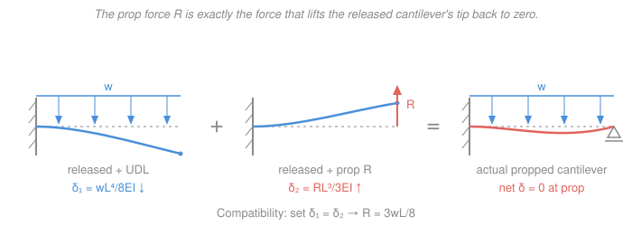

# Mechanics of Materials · Lesson 3.3: Statically indeterminate beams

> ⏱ ~15 min · Module 3: Beam Deflection · Builds on: [3.2 Deflection by superposition](03-02-deflection-by-superposition.md), [3.1 Deflection by integration](03-01-deflection-by-integration.md), [1.4 Statically indeterminate axial members](01-04-statically-indeterminate-axial.md) · Unlocks: Module 4 (stress transformation & combined loadings on real structures)

## Why this matters

Real beams are rarely just "pinned at both ends." A balcony joist is built into a wall *and* rests on a post; a bridge girder runs continuously over three or four piers; a fixed-fixed machine bed is bolted down at both ends. Every one of these has **more supports than statics can solve** — write down every equilibrium equation and you still have leftover unknowns. That extra support is not waste: it stiffens the beam, halves the deflection, and moves the peak moment off the middle. But to *design* the beam you must find those reactions, and equilibrium alone can't. The trick — the **force method** — is the same compatibility idea you used for two rods sharing a load in [1.4](01-04-statically-indeterminate-axial.md), now wearing a beam's clothes.

## The idea

A propped cantilever — fixed into a wall at one end, resting on a roller at the other — has three reactions (a wall force, a wall moment, and the prop force) but only two useful equilibrium equations for transverse loading (sum of vertical forces, sum of moments). One unknown too many. The beam is **statically indeterminate** to the first degree.

Here's the move. Pick one reaction you *don't* strictly need for stability — call it the **redundant** — and imagine deleting it. Now the beam is an ordinary determinate cantilever, the **released structure**, which you already know how to bend. Under the real load it sags at the spot where you deleted the support. But in reality that spot *can't* sag — the support holds it at zero. So the redundant reaction must be exactly the force that, acting alone on the released beam, pushes that point back up to zero. That "displacements must match reality" statement is the **compatibility condition**, and it's the extra equation you were missing. Solve it for the redundant, and now you have all reactions — the rest is ordinary statics.

The whole thing runs on superposition ([3.2](03-02-deflection-by-superposition.md)): total deflection at the support = (deflection from the applied load) + (deflection from the redundant) = 0.

## The formal version

**Degree of static indeterminacy.**

$$n = (\text{number of support reactions}) - (\text{number of independent equilibrium equations}).$$

*In words: count how many reaction unknowns you can't cover with equilibrium.* For a planar beam under transverse loads you get 2 useful equations ($\sum F_y = 0$, $\sum M = 0$). A propped cantilever has 3 reactions $\Rightarrow n=1$; a fixed–fixed beam has 4 $\Rightarrow n=2$; a beam continuous over three simple supports has 3 vertical reactions $\Rightarrow n=1$. You need $n$ redundants and $n$ compatibility equations.

**The force method (flexibility method), one redundant:**

1. **Choose a redundant** reaction $R$ and remove it, leaving a stable, determinate **released beam**.
2. Under the *actual applied load*, compute the deflection $\delta_0$ at the released point (from a standard case or [3.1](03-01-deflection-by-integration.md)/[3.2](03-02-deflection-by-superposition.md)).
3. Under a *unit* of the redundant alone, compute the deflection $\delta_R$ at that point. (This $\delta_R$ per unit force is the **flexibility** $f$.)
4. **Compatibility:** the real support permits no movement there, so the two contributions must cancel:

$$\delta_0 + (\text{sign})\,R\,f = 0 \qquad\Longrightarrow\qquad R = -\frac{\delta_0}{f}.$$

*In words: the redundant is whatever force is needed to erase the released beam's deflection at the support.* If the support settles by a known amount $\Delta$ instead of staying put, the right-hand side becomes $\Delta$, not $0$ — see P3.

5. Back out the remaining reactions from equilibrium, then build $V(x)$, $M(x)$ (using $\frac{dV}{dx}=-w$, $\frac{dM}{dx}=V$), and $v_{max}$ as for any determinate beam.

Standard released-beam deflections you'll reuse (all with $EI$ constant, sign = magnitude in the load's direction):

| Released cantilever, length $L$ | tip deflection |
|---|---|
| UDL $w$ over the span | $\dfrac{wL^4}{8EI}$ |
| point load $P$ at the tip | $\dfrac{PL^3}{3EI}$ |
| point load $P$ at distance $a$ from wall | tip: $\dfrac{Pa^2}{6EI}(3L-a)$ |

## Picture

## Worked examples

### Example 1 — BOSS PROBLEM 3: propped cantilever under a UDL

Fixed at $A$ ($x=0$), roller at $B$ ($x=L$), uniform load $w$ (N/m) over the whole span. $EI$ constant. Find all reactions, $M_{max}$, and $v_{max}$.

**Step 1 — pick the redundant.** Three reactions ($A$: vertical force + wall moment; $B$: prop force), two equations $\Rightarrow n=1$. Take the **prop reaction $R_B$** as redundant. Delete the roller: the released beam is a plain cantilever fixed at $A$, free at $B$.

**Step 2 — deflection at $B$ from the load.** Cantilever tip under UDL, downward:

$$\delta_0 = \frac{wL^4}{8EI}\ (\downarrow).$$

**Step 3 — deflection at $B$ from the redundant.** $R_B$ acts upward at the tip of the released cantilever:

$$\delta_R = \frac{R_B L^3}{3EI}\ (\uparrow).$$

**Step 4 — compatibility.** The roller holds $B$ at zero deflection, so up must cancel down:

$$\frac{wL^4}{8EI} = \frac{R_B L^3}{3EI} \qquad\Longrightarrow\qquad \boxed{R_B = \frac{3wL}{8}.}$$

Notice $EI$ cancels entirely — reactions in a *uniform* indeterminate beam don't depend on stiffness. (They *do* once the support settles or $EI$ varies along the span.)

**Step 5 — remaining reactions by equilibrium.**

$$\sum F_y = 0:\quad R_A + R_B = wL \;\Rightarrow\; R_A = wL - \tfrac{3}{8}wL = \frac{5wL}{8}.$$

Wall moment, taking moments about $A$ (the total load $wL$ acts at $x=L/2$):

$$M_A + R_B L - wL\cdot\frac{L}{2} = 0 \;\Rightarrow\; M_A = \frac{wL^2}{2} - \frac{3wL}{8}\,L = \frac{wL^2}{8}.$$

So the wall supplies a **hogging** couple of magnitude $wL^2/8$ (tension on the top fiber at the wall).

**Step 6 — internal $V$, $M$, and the peak moment.** Measuring $x$ from $A$:

$$V(x) = R_A - wx = \frac{5wL}{8} - wx, \qquad M(x) = -\frac{wL^2}{8} + \frac{5wL}{8}x - \frac{wx^2}{2}.$$

(The $-wL^2/8$ start value is the hogging wall moment; check $M(L)=0$ at the roller ✓.) Shear vanishes at $x^* = \tfrac{5}{8}L$, giving the largest *sagging* moment:

$$M\!\left(\tfrac{5L}{8}\right) = \frac{9wL^2}{128} \approx 0.0703\,wL^2.$$

Compare magnitudes: wall $= \tfrac{wL^2}{8}=0.125\,wL^2$ (hogging) beats the span peak $0.0703\,wL^2$ (sagging). The governing bending moment is at the **fixed end**:

$$\boxed{M_{max} = \frac{wL^2}{8}\ \text{(hogging, at the wall).}}$$

**Step 7 — maximum deflection.** Integrate $EI\,v'' = M(x)$ with $v(0)=v'(0)=0$:

$$EI\,v = -\frac{wL^2}{16}x^2 + \frac{5wL}{48}x^3 - \frac{w}{24}x^4.$$

Setting $v'=0$ (besides $x=0$) gives $8x^2 - 15Lx + 6L^2 = 0 \Rightarrow x = \tfrac{15-\sqrt{33}}{16}L \approx 0.5785L$. Plugging back:

$$\boxed{v_{max} \approx \frac{wL^4}{185\,EI}\ (\downarrow) \quad\text{at } x\approx 0.578L.}$$

**Units / sanity check.** Take steel $E=200$ GPa, $I = 30\times10^{6}\ \mathrm{mm^4}=3.0\times10^{-5}\ \mathrm{m^4}$, span $L=4$ m, $w = 10$ kN/m $=10^4$ N/m. Then $R_B = \tfrac{3(10^4)(4)}{8}=15$ kN, $R_A=25$ kN, $M_A=\tfrac{10^4\cdot16}{8}=20$ kN·m — reactions sum to $wL=40$ kN ✓. With $EI = 200\times10^9 \times 3.0\times10^{-5}=6.0\times10^{6}\ \mathrm{N\,m^2}$: $v_{max}=\tfrac{10^4\cdot 4^4}{185\cdot 6.0\times10^6}=2.3\times10^{-3}$ m $=2.3$ mm ($\downarrow$). Reassuringly, that's about **2/5** of the same beam's cantilever tip droop $\tfrac{wL^4}{8EI}=5.3$ mm — the prop earns its keep. Units: $\tfrac{(\mathrm{N/m})\,\mathrm{m^4}}{\mathrm{N\,m^2}}=\mathrm{m}$ ✓.

### Example 2 — fixed–fixed beam under a UDL (a two-redundant check via a table)

Both ends fully fixed, UDL $w$, span $L$. Four reactions ($R_A,R_B,M_A,M_B$), two equations $\Rightarrow n=2$. By symmetry $R_A=R_B=\tfrac{wL}{2}$ and $M_A=M_B\equiv M_0$, so really one unknown moment.

**Release both fixed ends into a simply supported beam**; the redundants are the two equal end moments $M_0$. Compatibility now enforces **zero slope** at each end (a wall can't rotate). Using standard simply-supported table values:

- SS beam under UDL: end slope $\theta_w = \dfrac{wL^3}{24EI}$ (ends rotate toward the sag).
- SS beam with equal end moments $M_0$: slope at each end $= \dfrac{M_0 L}{3EI} + \dfrac{M_0 L}{6EI} = \dfrac{M_0 L}{2EI}$ (rotating the opposite way).

Set the net end slope to zero:

$$\frac{wL^3}{24EI} = \frac{M_0 L}{2EI} \qquad\Longrightarrow\qquad M_0 = \frac{wL^2}{12}.$$

So each wall carries a hogging moment $\tfrac{wL^2}{12}$, the midspan (sagging) moment is $\tfrac{wL^2}{8}-\tfrac{wL^2}{12}=\tfrac{wL^2}{24}$, and the center deflection drops all the way to $v_{max}=\dfrac{wL^4}{384EI}$ — one-fifth of the simply-supported $\tfrac{5wL^4}{384EI}$. Locking both ends is the stiffest boundary condition there is.

*Sanity:* the fixed–fixed wall moment $\tfrac{wL^2}{12}$ is smaller than the propped cantilever's $\tfrac{wL^2}{8}$, because sharing the restraint between *two* fixed ends is gentler than dumping it all on one. ✓

## Watch out

- **You might think you can find the redundant from equilibrium if you're clever with the equations — you can't.** With more unknowns than independent equilibrium equations, *any* set of reactions that balances forces is possible; only the geometry of how much the beam actually bends singles out the true one. The missing equation is always **compatibility**, never another force balance.
- **You might think "deflection at the support = 0" is a trivial given.** It's the entire engine. The released beam genuinely *does* deflect there under the load; the redundant is defined as the force that cancels that deflection. Track the two directions carefully (load pushes down, prop pushes up) — a sign slip flips the reaction.
- **You might reach for the max moment at the load or midspan.** For a propped cantilever the peak is usually the **hogging moment at the fixed end** ($wL^2/8$), which exceeds the span's sagging peak ($9wL^2/128$). Always evaluate the wall — indeterminate beams put their biggest stresses at the stiff supports, not the middle.

## One-liner

> More supports than equilibrium can handle? Delete one, let the released beam deflect, and the redundant is exactly the force that pushes that point back to zero — equilibrium can't find it, geometry can.

## Problems

**P1 (🟢)** A propped cantilever (fixed at $A$, roller at $B$) spans $L = 4$ m under a UDL $w = 10$ kN/m. Using the boss-problem results, state $R_B$, $R_A$, and the wall moment $M_A$, and verify vertical equilibrium.

**P2 (🟡)** A propped cantilever (fixed at $A$, roller at the free end $B$, span $L$) carries a single point load $P$ at **midspan** ($x = L/2$). Take $R_B$ as the redundant. Using the released-cantilever tip deflection for an interior load, $\delta = \dfrac{Pa^2}{6EI}(3L-a)$ with $a=L/2$, find $R_B$ and $R_A$.

**P3 (🔴)** Return to the boss problem (propped cantilever, UDL $w$, span $L$), but now the roller at $B$ **settles downward** by a known amount $\Delta$ during loading. Redo the compatibility equation and find $R_B$. What settlement $\Delta$ would make the prop go slack ($R_B = 0$)? (This is the beam analogue of a loose support in [1.4](01-04-statically-indeterminate-axial.md).)

Solutions

**P1** Direct substitution into the boss results:

$$R_B = \frac{3wL}{8} = \frac{3(10)(4)}{8} = 15\ \mathrm{kN},\qquad R_A = \frac{5wL}{8} = \frac{5(10)(4)}{8} = 25\ \mathrm{kN},$$
$$M_A = \frac{wL^2}{8} = \frac{10(4)^2}{8} = 20\ \mathrm{kN\,m}\ \text{(hogging).}$$

*Check.* $R_A + R_B = 25 + 15 = 40\ \mathrm{kN} = wL = 10\times4$ ✓. Units: (kN/m)(m) = kN, (kN/m)(m²) = kN·m ✓.

**P2** Released beam = cantilever fixed at $A$, free at $B$. Deflection at the tip $B$ from the load $P$ at $a=L/2$:

$$\delta_0 = \frac{P a^2}{6EI}(3L - a) = \frac{P (L/2)^2}{6EI}\left(3L - \tfrac{L}{2}\right) = \frac{P\,\tfrac{L^2}{4}}{6EI}\cdot\frac{5L}{2} = \frac{5PL^3}{48EI}\ (\downarrow).$$

Deflection at $B$ from the redundant $R_B$ (upward tip load): $\delta_R = \dfrac{R_B L^3}{3EI}\ (\uparrow)$. Compatibility ($v_B = 0$):

$$\frac{5PL^3}{48EI} = \frac{R_B L^3}{3EI} \;\Longrightarrow\; R_B = \frac{3}{48}\cdot 5P = \frac{5P}{16}.$$

Then $R_A = P - R_B = P - \tfrac{5P}{16} = \dfrac{11P}{16}$.

*Check.* $R_A + R_B = \tfrac{11P}{16}+\tfrac{5P}{16} = P$ ✓, and $R_B < P/2$ — the prop carries less than half, since the fixed end also resists via its moment. This $\tfrac{5P}{16}$ is the textbook propped-cantilever central-load result. ✓

**P3** Superposition still gives (down from load) minus (up from prop), but the support now sits $\Delta$ lower, so the net downward deflection at $B$ equals $\Delta$ instead of $0$:

$$\frac{wL^4}{8EI} - \frac{R_B L^3}{3EI} = \Delta \;\Longrightarrow\; R_B = \frac{3EI}{L^3}\left(\frac{wL^4}{8EI} - \Delta\right) = \frac{3wL}{8} - \frac{3EI\,\Delta}{L^3}.$$

Settlement *relieves* the prop: it takes less because it no longer has to lift the beam all the way back to the original line. The prop goes slack when $R_B = 0$:

$$\frac{3wL}{8} = \frac{3EI\,\Delta}{L^3} \;\Longrightarrow\; \Delta = \frac{wL^4}{8EI}.$$

*Check.* That critical $\Delta$ is exactly the released cantilever's free tip droop under $w$ — if the support drops by the amount the beam would sag anyway, the beam never touches it and the prop is idle. Perfectly consistent. Units: $\tfrac{(\mathrm{N\,m^2})(\mathrm m)}{\mathrm{m^3}}=\mathrm N$ ✓. ✓

## Flashback

**From Lesson 3.2 (Deflection by superposition):** A steel cantilever ($E = 200$ GPa, $I = 40\times10^{6}\ \mathrm{mm^4}$, length $L = 2$ m) carries **both** a point load $P = 5$ kN at its free tip **and** a UDL $w = 3$ kN/m over its whole length. Find the tip deflection by superposition.

Solution

Superpose the two standard cantilever cases (both deflect the tip downward, so add magnitudes):

$$\delta_{tip} = \underbrace{\frac{PL^3}{3EI}}_{\text{tip load}} + \underbrace{\frac{wL^4}{8EI}}_{\text{UDL}}.$$

Convert to SI: $I = 40\times10^{6}\ \mathrm{mm^4} = 4.0\times10^{-5}\ \mathrm{m^4}$, so $EI = (200\times10^9)(4.0\times10^{-5}) = 8.0\times10^{6}\ \mathrm{N\,m^2}$. With $P=5000$ N, $w=3000$ N/m, $L=2$ m:

$$\frac{PL^3}{3EI} = \frac{5000\,(8)}{3(8.0\times10^6)} = 1.67\times10^{-3}\ \mathrm{m},\qquad \frac{wL^4}{8EI} = \frac{3000\,(16)}{8(8.0\times10^6)} = 0.75\times10^{-3}\ \mathrm{m}.$$

$$\delta_{tip} = 1.67 + 0.75 = 2.42\ \mathrm{mm}\ (\downarrow).$$

*Check.* Superposition is legal because the beam is linear-elastic (small deflections) — the loads don't interfere. Units: $\tfrac{(\mathrm N)(\mathrm{m^3})}{\mathrm{N\,m^2}}=\mathrm m$ ✓, and $2.4$ mm over a 2 m span is $\approx L/830$, a sensible service deflection. ✓

## Connections

- **Backward:** this is the beam version of [1.4 Statically indeterminate axial members](01-04-statically-indeterminate-axial.md) — same recipe (release a redundant, write a compatibility equation, solve), only the compatibility variable is a *deflection/slope* from [3.1](03-01-deflection-by-integration.md)/[3.2](03-02-deflection-by-superposition.md) instead of an elongation $PL/AE$. The superposition of standard cases is [3.2](03-02-deflection-by-superposition.md) doing the heavy lifting; and the released-beam reactions and $V$–$M$ diagrams are pure [`statics` 04-02](../../statics/lessons/04-02-shear-bending-moment-diagrams.md) applied through equilibrium of supports ([`statics` 01-05](../../statics/lessons/01-05-rigid-body-equilibrium-supports.md)).
- **Forward:** once you have $M_{max}$ and the reactions, Module 4 turns them into stresses — the flexure stress $\sigma=-My/I$ at the critical section, combined with any axial or shear load, then transformed to principal stresses and checked against a yield criterion. Indeterminate analysis is what *supplies* the $M$ that everything downstream consumes.
- **Sideways (materials science):** this lesson computes the stresses that *arrive* at a section; [`materials-science` 04-04](../../materials-science/lessons/04-04-failure-fracture-fatigue-creep.md) explains what the material *does* when they reach yield or fatigue limits. The engineer's loop is: indeterminate analysis → peak stress here → compare to the material's capacity there.
