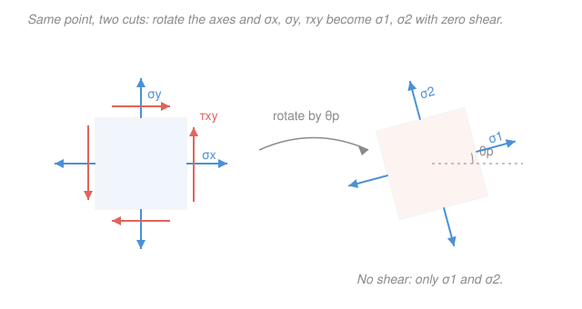

# Mechanics of Materials · Lesson 4.1: Plane stress transformation

> ⏱ ~15 min · Module 4: Stress transformation & failure · Builds on: [1.1 Normal & shear stress](01-01-normal-shear-stress.md), [2.4 Flexure formula](02-04-flexure-formula.md), [2.1 Torsion of circular shafts](02-01-torsion-circular-shafts.md) · Unlocks: [4.2 Mohr's circle](04-02-mohrs-circle.md), [4.3 Combined loadings](04-03-combined-loadings.md), [4.5 Yield & failure criteria](04-05-yield-failure-criteria.md)

## Why this matters

You have spent three modules computing stresses on the *natural* cuts: axial $\sigma=P/A$ on a cross-section, bending $\sigma=-My/I$ on a horizontal fiber, torsional $\tau=Tr/J$ on the shaft face. But a part does not care which axes you drew — it fails on the plane where the loading is *worst*, and that plane is almost never the one you happened to compute on. A ductile steel shaft yields on the plane of maximum **shear**; a brittle cast-iron shaft cracks on the plane of maximum **normal** stress — and under torsion those planes sit at $45^\circ$ to the axis, which is exactly why a piece of chalk twisted in your fingers snaps along a helix. Stress transformation is the tool that takes the stresses you *can* compute and finds the worst-case stresses on *every* orientation. It is the gateway to Mohr's circle, combined loading, and the yield criteria that decide whether a design survives.

## The idea

Picture a tiny square cut out of a loaded part — a **plane-stress element**. Its faces carry a normal push/pull $\sigma_x,\sigma_y$ and a shear smear $\tau_{xy}$. Now imagine slicing the *same point* with a knife held at a different angle. The material there is unchanged, but the new faces expose a different mix of normal and shear: rotate toward the pull and you see more normal stress and less shear; rotate away and the balance flips. The stress *state* at the point is one physical thing; the three numbers $(\sigma_x,\sigma_y,\tau_{xy})$ are just its shadow on the axes you chose.

So the natural question is: over all possible cut angles, which orientation gives the **largest normal stress**, and which gives the **largest shear**? There is a special pair of perpendicular cuts — the **principal planes** — on which the shear vanishes entirely and the normal stress hits its maximum and minimum. Those extreme normal stresses are the **principal stresses** $\sigma_1$ (biggest) and $\sigma_2$ (smallest). And the planes of worst shear sit exactly $45^\circ$ away from them. Find those, and you know the two ways this point can fail.

## The formal version

Take an element with known $\sigma_x,\sigma_y$ (normal stresses, MPa) and $\tau_{xy}$ (shear, MPa). Rotate the axes by angle $\theta$ (**counterclockwise positive**) to new axes $x',y'$. Summing forces on a wedge-shaped slice gives the **transformation equations**:

$$\sigma_{x'}=\frac{\sigma_x+\sigma_y}{2}+\frac{\sigma_x-\sigma_y}{2}\cos 2\theta+\tau_{xy}\sin 2\theta,$$

$$\tau_{x'y'}=-\frac{\sigma_x-\sigma_y}{2}\sin 2\theta+\tau_{xy}\cos 2\theta.$$

*In words: the normal stress on a tilted face is the average of $\sigma_x,\sigma_y$, plus a wobble that swings with the doubled angle $2\theta$; the shear is what is left over from that same swing.* (Sign convention: a positive $\tau_{xy}$ on the $+x$ face points in the $+y$ direction. $\sigma_{y'}$ comes from the first equation with $\theta\to\theta+90^\circ$.)

**Principal stresses.** Setting $\tau_{x'y'}=0$ picks out the orientation where shear disappears; the normal stresses there are the extreme values

$$\boxed{\;\sigma_{1,2}=\frac{\sigma_x+\sigma_y}{2}\pm\sqrt{\left(\frac{\sigma_x-\sigma_y}{2}\right)^2+\tau_{xy}^2}\;}$$

on planes oriented at

$$\tan 2\theta_p=\frac{2\tau_{xy}}{\sigma_x-\sigma_y}.$$

*In words: the max and min normal stresses are the average $\pm$ a radius built from the half-difference and the shear; they act on planes carrying zero shear.* The two roots $\theta_p$ are $90^\circ$ apart — one carries $\sigma_1$, the other $\sigma_2$.

**Maximum in-plane shear.** The largest shear is that same radius,

$$\tau_{\max}=\sqrt{\left(\frac{\sigma_x-\sigma_y}{2}\right)^2+\tau_{xy}^2}=\frac{\sigma_1-\sigma_2}{2},$$

and it acts on planes $45^\circ$ from the principal ones. On those max-shear planes the normal stress is *not* zero — it equals the average $\sigma_{\text{avg}}=\frac{\sigma_x+\sigma_y}{2}$ on both faces.

**Invariant.** Adding the two principal stresses,

$$\sigma_x+\sigma_y=\sigma_1+\sigma_2=\text{constant}.$$

*In words: rotating the axes reshuffles how stress is split between normal and shear, but the sum of the two normal stresses never changes* — a handy check on every calculation.

## Picture

## Worked examples

**Example 1 (find the worst-case axes).** An element carries $\sigma_x=80\ \mathrm{MPa}$, $\sigma_y=-20\ \mathrm{MPa}$ (compression), $\tau_{xy}=30\ \mathrm{MPa}$. Find $\sigma_{1,2}$, $\tau_{\max}$, and $\theta_p$.

Center and radius first:

$$\sigma_{\text{avg}}=\frac{80+(-20)}{2}=30\ \mathrm{MPa},\qquad R=\sqrt{\left(\frac{80-(-20)}{2}\right)^2+30^2}=\sqrt{50^2+30^2}=\sqrt{3400}=58.3\ \mathrm{MPa}.$$

Then

$$\sigma_1=30+58.3=88.3\ \mathrm{MPa},\qquad \sigma_2=30-58.3=-28.3\ \mathrm{MPa},\qquad \tau_{\max}=R=58.3\ \mathrm{MPa}.$$

Orientation:

$$\tan 2\theta_p=\frac{2(30)}{80-(-20)}=\frac{60}{100}=0.6\;\Rightarrow\;2\theta_p=31.0^\circ\;\Rightarrow\;\theta_p=15.5^\circ.$$

Because $\sigma_x>\sigma_y$, this $\theta_p=15.5^\circ$ is the plane of $\sigma_1$ (the other principal plane, carrying $\sigma_2$, is at $105.5^\circ$). *Check:* invariant $\sigma_1+\sigma_2=88.3-28.3=60=\sigma_x+\sigma_y$ ✓, and every quantity is in MPa ✓.

**Example 2 (uniaxial + shear — the shaft surface).** A point on the surface of a shaft under combined bending and torsion sees $\sigma_x=\sigma$, $\sigma_y=0$, $\tau_{xy}=\tau$ (bending gives the axial $\sigma$, torsion gives $\tau$). What are the principal stresses in terms of $\sigma$ and $\tau$?

$$\sigma_{\text{avg}}=\frac{\sigma+0}{2}=\frac{\sigma}{2},\qquad R=\sqrt{\left(\frac{\sigma}{2}\right)^2+\tau^2},$$

so

$$\boxed{\;\sigma_{1,2}=\frac{\sigma}{2}\pm\sqrt{\left(\frac{\sigma}{2}\right)^2+\tau^2}\;},\qquad \tau_{\max}=\sqrt{\left(\frac{\sigma}{2}\right)^2+\tau^2}.$$

This little formula is the whole reason Module 4 exists: it converts a shaft's bending stress and torsional shear — which you already know how to compute — into the max/min stresses that a failure criterion actually needs. You will meet it again as the "combined loading" workhorse in [4.3](04-03-combined-loadings.md). *Check:* if $\tau=0$ it collapses to $\sigma_1=\sigma,\ \sigma_2=0$ (pure tension) ✓; if $\sigma=0$ it gives $\sigma_{1,2}=\pm\tau$ (pure shear) ✓.

## Watch out

- **You might think you plug $\theta$ into the transformation equations; actually it is $2\theta$.** Everything swings at *double* the physical angle — that is why the principal planes and the max-shear planes end up $45^\circ$ apart (a $90^\circ$ gap in $2\theta$), and why the two principal planes are $90^\circ$ apart in the real element (a $180^\circ$ gap in $2\theta$). Forgetting the factor of 2 is the single most common error here.
- **You might think the max-shear planes are stress-free in the normal direction; actually they carry $\sigma_{\text{avg}}$.** Only the *principal* planes have zero shear. The max-shear planes still feel the average normal stress on both faces — miss that and you will mis-size a ductile part.
- **You might read $\theta_p$ as automatically belonging to $\sigma_1$; actually $\tan 2\theta_p$ gives two answers $90^\circ$ apart, one for each principal stress.** Decide which is which by substituting back into $\sigma_{x'}$, or lean on the rule that when $\sigma_x>\sigma_y$ the angle nearer the $x$-axis carries the larger principal stress. Mohr's circle in [4.2](04-02-mohrs-circle.md) makes this bookkeeping automatic.

## One-liner

> Spin the cut and the stresses reshuffle at $2\theta$: the average $\pm R$ are the principal stresses (zero shear), $R$ itself is the max shear ($45^\circ$ away), and $\sigma_x+\sigma_y$ never changes.

## Problems

**P1 (🟢)** An element has $\sigma_x=60\ \mathrm{MPa}$, $\sigma_y=20\ \mathrm{MPa}$, $\tau_{xy}=20\ \mathrm{MPa}$. Find the principal stresses $\sigma_{1,2}$, the maximum in-plane shear $\tau_{\max}$, and the principal angle $\theta_p$.

**P2 (🟡)** A point is in **pure shear**: $\sigma_x=\sigma_y=0$, $\tau_{xy}=40\ \mathrm{MPa}$ (this is the surface stress state of a shaft in pure torsion, from [2.1](02-01-torsion-circular-shafts.md)). Find the principal stresses and the angle $\theta_p$. Use your answer to explain why a brittle shaft (e.g. cast iron or chalk) twisted to failure cracks along a $45^\circ$ helix rather than straight across.

**P3 (🔴)** For the element $\sigma_x=100\ \mathrm{MPa}$, $\sigma_y=40\ \mathrm{MPa}$, $\tau_{xy}=30\ \mathrm{MPa}$, find $\tau_{\max}$ and the orientation $\theta_s$ of the max-shear plane, and state the normal stress acting on that plane. (Then note: a ductile steel with $\sigma_Y=250\ \mathrm{MPa}$ yields by Tresca when $\tau_{\max}=\sigma_Y/2$ — is this point safe?)

Solutions

**P1** Average and radius:

$$\sigma_{\text{avg}}=\frac{60+20}{2}=40\ \mathrm{MPa},\qquad R=\sqrt{\left(\frac{60-20}{2}\right)^2+20^2}=\sqrt{20^2+20^2}=\sqrt{800}=28.3\ \mathrm{MPa}.$$

So

$$\sigma_1=40+28.3=68.3\ \mathrm{MPa},\qquad \sigma_2=40-28.3=11.7\ \mathrm{MPa},\qquad \tau_{\max}=28.3\ \mathrm{MPa}.$$

Orientation:

$$\tan 2\theta_p=\frac{2(20)}{60-20}=\frac{40}{40}=1\;\Rightarrow\;2\theta_p=45^\circ\;\Rightarrow\;\theta_p=22.5^\circ\ (\text{plane of }\sigma_1,\text{ since }\sigma_x>\sigma_y).$$

*Check:* $\sigma_1+\sigma_2=68.3+11.7=80=\sigma_x+\sigma_y$ ✓. Both principal stresses are positive (biaxial tension), consistent with a positive average and $R<\sigma_{\text{avg}}$. Units MPa throughout ✓.

**P2** With $\sigma_x=\sigma_y=0$: $\sigma_{\text{avg}}=0$ and $R=\sqrt{0+40^2}=40\ \mathrm{MPa}$, so

$$\sigma_1=+40\ \mathrm{MPa},\qquad \sigma_2=-40\ \mathrm{MPa}.$$

Orientation: $\tan 2\theta_p=\dfrac{2(40)}{0}\to\infty\Rightarrow 2\theta_p=90^\circ\Rightarrow\theta_p=45^\circ$. So pure shear is *equivalent* to a $+40$ MPa tension and a $-40$ MPa compression acting on planes at $45^\circ$. A brittle material fails on the plane of maximum **tension** ($\sigma_1$), which here is the $45^\circ$ plane — and because the shaft's shear wraps circumferentially, that plane of maximum tension spirals down the shaft as a helix. Hence the classic $45^\circ$ helical fracture of chalk or cast iron in torsion.

*Check:* $\sigma_1+\sigma_2=0=\sigma_x+\sigma_y$ ✓; $\tau_{\max}=R=40\ \mathrm{MPa}$ equals the applied $\tau_{xy}$, exactly right since in pure shear the given axes *already* carry the maximum shear ✓.

**P3** Radius:

$$R=\sqrt{\left(\frac{100-40}{2}\right)^2+30^2}=\sqrt{30^2+30^2}=\sqrt{1800}=42.4\ \mathrm{MPa}=\tau_{\max}.$$

The max-shear planes sit $45^\circ$ from the principal planes. Principal angle: $\tan 2\theta_p=\frac{2(30)}{100-40}=1\Rightarrow\theta_p=22.5^\circ$, so

$$\theta_s=\theta_p-45^\circ=-22.5^\circ\quad(\text{equivalently } 67.5^\circ).$$

Normal stress on that plane is the average:

$$\sigma_{\text{avg}}=\frac{100+40}{2}=70\ \mathrm{MPa}\ \text{on both max-shear faces.}$$

Safety: Tresca yields when $\tau_{\max}=\sigma_Y/2=125\ \mathrm{MPa}$. Here $\tau_{\max}=42.4\ \mathrm{MPa}\ll 125\ \mathrm{MPa}$, so the point is safe — factor of safety $\approx 125/42.4\approx 2.9$.

*Check:* $\sigma_1=70+42.4=112.4$, $\sigma_2=70-42.4=27.6$; sum $=140=\sigma_x+\sigma_y$ ✓. Max-shear planes $45^\circ$ from principal ✓, and the residual normal stress equals the center as required ✓.

## Flashback

**From Lesson 2.1 (Torsion of circular shafts):** A solid steel shaft of diameter $d=40\ \mathrm{mm}$ transmits a torque $T=1.2\ \mathrm{kN\cdot m}$. Find the maximum shear stress on its surface. (This $\tau$ is exactly the $\tau_{xy}$ you would feed into today's transformation for the shaft-surface state.)

Solution

Polar second moment for a solid circular section, with $d=0.040\ \mathrm{m}$:

$$J=\frac{\pi d^4}{32}=\frac{\pi (0.040)^4}{32}=\frac{\pi (2.56\times10^{-6})}{32}=2.51\times10^{-7}\ \mathrm{m^4}.$$

Max shear is at the outer radius $r=d/2=0.020\ \mathrm{m}$:

$$\tau_{\max}=\frac{Tr}{J}=\frac{(1200\ \mathrm{N\cdot m})(0.020\ \mathrm{m})}{2.51\times10^{-7}\ \mathrm{m^4}}=9.55\times10^{7}\ \mathrm{Pa}=95.5\ \mathrm{MPa}.$$

*Check:* units $\frac{\mathrm{N\cdot m}\cdot\mathrm{m}}{\mathrm{m^4}}=\mathrm{N/m^2}=\mathrm{Pa}$ ✓; $95.5$ MPa is a reasonable working stress for steel ($\sigma_Y\approx250$ MPa), well below yield ✓. In pure torsion this surface point has $\sigma_x=\sigma_y=0,\ \tau_{xy}=95.5\ \mathrm{MPa}$, so by today's Example-2/P2 logic its principal stresses are $\pm95.5\ \mathrm{MPa}$ at $45^\circ$.

## Connections

- **Backward:** the inputs to transformation are the stresses from earlier modules — axial and bending $\sigma$ from [1.1](01-01-normal-shear-stress.md) and [2.4](02-04-flexure-formula.md), torsional $\tau$ from [2.1](02-01-torsion-circular-shafts.md). Transformation does not compute new stresses; it re-expresses the ones you have on rotated cuts.
- **Forward:** [4.2 Mohr's circle](04-02-mohrs-circle.md) turns every equation here into a single circle of radius $R$ centered at $\sigma_{\text{avg}}$ — a picture that makes principal stresses, $\tau_{\max}$, and the $2\theta$ bookkeeping visual instead of algebraic. [4.3 Combined loadings](04-03-combined-loadings.md) uses Example 2's shaft state directly, and [4.5 Yield & failure criteria](04-05-yield-failure-criteria.md) feeds $\sigma_1,\sigma_2$ into Tresca and von Mises.
- **Sideways (materials science):** transformation tells you *where* the worst stress acts; [`materials-science` 4.2 (plastic deformation & Schmid's law)](../../materials-science/lessons/04-02-plastic-deformation-schmid.md) explains *why* the metal yields there — dislocations gliding on the plane of maximum resolved shear. This course computes the stress that reaches yield; that course explains the mechanism of yielding itself.
