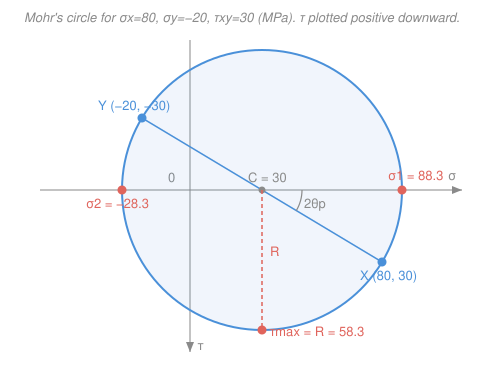

# Mechanics of Materials · Lesson 4.2: Mohr's circle

> ⏱ ~15 min · Module 4: Stress transformation & failure · Builds on: [4.1 Plane stress transformation](04-01-plane-stress-transformation.md) · Unlocks: [4.3 Combined loadings](04-03-combined-loadings.md), [4.5 Yield & failure criteria](04-05-yield-failure-criteria.md)

## Why this matters

In [4.1](04-01-plane-stress-transformation.md) you turned a stress state on rotated planes with three trig-heavy formulas, and to find principal stresses and max shear you plugged into three more. It works, but it's bookkeeping — easy to drop a sign, hard to *see*. Mohr's circle is the same physics drawn as a picture: **one circle that holds every rotated plane at once**. Principal stresses, maximum shear, the angles to reach them — you read them straight off the geometry. Engineers who do this daily rarely touch the formulas; they sketch the circle. And the circle is what makes the failure criteria in [4.5](04-05-yield-failure-criteria.md) click: yielding is the moment the circle gets too big.

## The idea

Look again at the transformation equations from 4.1. As you spin the cutting plane through an angle $\theta$, the pair (normal stress $\sigma_{x'}$, shear stress $\tau_{x'y'}$) doesn't wander randomly — it **runs around a circle**. Every orientation of the plane is one point on that circle; rotate the plane and the point rides around the rim.

Once you know it's a circle, everything falls out of where the point sits. The circle is centered on the $\sigma$-axis (average stress, no shear there horizontally). The points where it crosses the axis — shear equals zero — are the **principal stresses**. The top and bottom, farthest from the axis, are the **maximum shear** planes. And one beautiful fact ties the drawing to the metal: **a physical rotation of $\theta$ in the body is a rotation of $2\theta$ on the circle**, in the same direction. Spin your element 45°, walk 90° around the circle. That factor of two is why principal and max-shear planes always sit 45° apart in the body — they're 90° apart on the circle.

## The formal version

Rearrange 4.1's equations by moving the average to the left:

$$\sigma_{x'} - \underbrace{\tfrac{\sigma_x+\sigma_y}{2}}_{C} = \tfrac{\sigma_x-\sigma_y}{2}\cos 2\theta + \tau_{xy}\sin 2\theta,\qquad \tau_{x'y'} = -\tfrac{\sigma_x-\sigma_y}{2}\sin 2\theta + \tau_{xy}\cos 2\theta.$$

Square both and add. The cross terms cancel and $\cos^2+\sin^2=1$, leaving

$$\boxed{\ (\sigma_{x'}-C)^2 + \tau_{x'y'}^2 = R^2\ }, \qquad C = \frac{\sigma_x+\sigma_y}{2},\quad R=\sqrt{\left(\frac{\sigma_x-\sigma_y}{2}\right)^2 + \tau_{xy}^2}.$$

*In words: in the $(\sigma,\tau)$ plane, the stress state traces a circle of radius $R$ centered at $(C,0)$ on the $\sigma$-axis.* Here $C$ is the **center** (MPa) — the average normal stress, always on the axis — and $R$ is the **radius** (MPa). Every symbol carries units of stress (MPa).

Read the whole failure-relevant story off the geometry:

- **Principal stresses** — where the circle crosses the $\sigma$-axis, so $\tau=0$: $\ \sigma_{1,2} = C \pm R.$ These are the largest and smallest normal stresses, on planes with no shear.
- **Maximum in-plane shear** — the top/bottom of the circle: $\ \tau_{\max} = R.$ On those planes the normal stress is $C$ (not zero — a trap).
- **Angles**: the diameter from the center to the plotted point makes angle $2\theta$ with the axis. So $\tan 2\theta_p = \dfrac{2\tau_{xy}}{\sigma_x-\sigma_y}$ (angle to reach a principal plane), and the max-shear planes sit a quarter-turn away on the circle — $90^\circ$ there, hence **$45^\circ$ in the body**.

**Construction (do this every time).** Plot two points using your given stresses, with the convention that $\tau$ is positive *downward*:

1. Point $X = (\sigma_x,\ \tau_{xy})$ — the state on the face whose normal is $x$.
2. Point $Y = (\sigma_y,\ -\tau_{xy})$ — the perpendicular face. (Its shear is the equal-and-opposite complement.)
3. $X$ and $Y$ are ends of a **diameter**; where it crosses the axis is $C$. Draw the circle through them — its radius is $R$.

*Why $\tau$ downward?* With that choice, when you rotate the element counterclockwise by $\theta$, the point $X$ moves counterclockwise by $2\theta$ on the circle — the **same sense**, no sign gymnastics. (Plot $\tau$ upward and the circle spins the opposite way; still correct, just easier to confuse.)

**The 3D footnote (matters in [4.5](04-05-yield-failure-criteria.md)).** Plane stress is really 3D with a third principal stress $\sigma_3 = 0$ (nothing pushes out of plane). There are actually *three* Mohr's circles, one per pair of principals. The **absolute** maximum shear is the radius of the biggest of them, $\tau_{\text{abs max}} = \tfrac{1}{2}(\sigma_{\max}-\sigma_{\min})$ over all three of $\{\sigma_1,\sigma_2,0\}$. When $\sigma_1$ and $\sigma_2$ have **opposite signs**, $\sigma_3=0$ sits between them and the in-plane circle *is* the biggest — $\tau_{\text{abs max}}=R$. But when both are the **same sign** (e.g. a pressure vessel, both tensile), the zero becomes the extreme, and $\tau_{\text{abs max}} = \tfrac{1}{2}\sigma_{\max} > R$. Flag it now; we cash it in for yield.

## Picture

## Worked examples

**Example 1 (the 4.1 state, done by circle).** Take $\sigma_x = 80$ MPa, $\sigma_y = -20$ MPa, $\tau_{xy} = 30$ MPa — the exact state we ground through with formulas in 4.1.

Center and radius:

$$C = \frac{80 + (-20)}{2} = 30\ \mathrm{MPa}, \qquad R = \sqrt{\left(\frac{80-(-20)}{2}\right)^2 + 30^2} = \sqrt{50^2 + 30^2} = \sqrt{3400} = 58.3\ \mathrm{MPa}.$$

Now just read the circle:

$$\sigma_1 = C + R = 30 + 58.3 = 88.3\ \mathrm{MPa}, \qquad \sigma_2 = C - R = 30 - 58.3 = -28.3\ \mathrm{MPa}, \qquad \tau_{\max} = R = 58.3\ \mathrm{MPa}.$$

Angle to the principal plane, from the diameter:

$$\tan 2\theta_p = \frac{2\tau_{xy}}{\sigma_x - \sigma_y} = \frac{2(30)}{80-(-20)} = \frac{60}{100} = 0.6 \ \Rightarrow\ 2\theta_p = 31.0^\circ \ \Rightarrow\ \theta_p = 15.5^\circ.$$

Point $X=(80,30)$ sits below the axis (in the $\tau$-down convention); rotating it up to $\sigma_1$ on the axis is $31^\circ$ counterclockwise on the circle, i.e. **rotate the element $15.5^\circ$ counterclockwise** to land on the principal directions. Every number matches 4.1 — same physics, extracted by picture instead of by plug-in.

*Check.* Invariant: $\sigma_1+\sigma_2 = 88.3-28.3 = 60 = \sigma_x+\sigma_y$ ✓. Since $\sigma_1,\sigma_2$ have opposite signs, $\sigma_3=0$ lies between them, so $\tau_{\text{abs max}}=R=58.3$ MPa (the in-plane circle wins). Units MPa throughout ✓.

**Example 2 (pure shear — why torsion snaps at 45°).** A shaft in pure torsion puts its surface in **pure shear**: $\sigma_x = \sigma_y = 0$, $\tau_{xy} = \tau$. Then

$$C = 0, \qquad R = \sqrt{0 + \tau^2} = \tau, \qquad \sigma_1 = +\tau, \quad \sigma_2 = -\tau.$$

The circle is centered at the origin. Its axis crossings are $\pm\tau$: **the principal stresses are pure tension and pure compression of equal size.** And $\tan 2\theta_p = 2\tau/0 = \infty \Rightarrow 2\theta_p = 90^\circ \Rightarrow \theta_p = 45^\circ$: the tension acts on a plane at $45^\circ$ to the shaft axis.

Now the payoff. A **brittle** material (cast iron, chalk, a stick of blackboard chalk) fails when *tensile* stress pulls it apart. The maximum tension $\sigma_1 = \tau$ lives on that $45^\circ$ plane — so the crack opens perpendicular to it and spirals around the shaft as a **$45^\circ$ helix**. Twist a piece of chalk until it breaks: the fracture is a clean helical surface, not a flat transverse cut. A **ductile** material instead yields on the plane of maximum *shear* (the shaft cross-section, $\tau_{\max}=\tau$ at $\theta=0$) and fails flat. Same stress state, two failure faces — the circle shows you both.

*Check.* $\sigma_1+\sigma_2 = \tau - \tau = 0 = \sigma_x+\sigma_y$ ✓. Opposite signs, so $\tau_{\text{abs max}} = R = \tau$ ✓.

## Watch out

- **You might think the top of the circle is a stress-free shear plane, like the principal planes are shear-free.** Not so: at $\tau_{\max}$ the normal stress isn't zero, it's $C$ (the average). Only the axis crossings have zero shear. Max-shear planes still carry normal stress.
- **You might read the body angle straight off the circle.** The circle runs in $2\theta$: an angle you measure on the circle is *twice* the physical rotation. Halve it before you orient the element. This is the single most common Mohr error.
- **You might trust $\tau_{\max}=R$ as the worst shear in the part.** In plane stress it's only the worst *in-plane* shear. If $\sigma_1$ and $\sigma_2$ share a sign, the out-of-plane circle (through $\sigma_3=0$) is larger and the *absolute* max shear is bigger — the case that governs [4.5](04-05-yield-failure-criteria.md)'s Tresca criterion.

## One-liner

> Every rotated plane is one point on a circle centered at $C=\tfrac{\sigma_x+\sigma_y}{2}$ with radius $R=\sqrt{(\tfrac{\sigma_x-\sigma_y}{2})^2+\tau_{xy}^2}$; principals are $C\pm R$, max shear is $R$, and body angles double on the rim.

## Problems

**P1 (🟢)** A plane-stress state is $\sigma_x = -40$ MPa, $\sigma_y = 60$ MPa, $\tau_{xy} = -50$ MPa. Find the center $C$, radius $R$, the two principal stresses, and the maximum in-plane shear stress.

**P2 (🟡)** An element's principal stresses are $\sigma_1 = 120$ MPa and $\sigma_2 = 40$ MPa (both tensile; the principal planes are shear-free). Using Mohr's circle, find the normal and shear stresses on a plane rotated $30^\circ$ in the body from the $\sigma_1$ direction. Then state $\tau_{\text{abs max}}$ and explain why it isn't $R$.

**P3 (🔴)** A point on a shaft carries bending *and* torsion: $\sigma_x = \sigma$, $\sigma_y = 0$, $\tau_{xy} = \tau$ (symbols, not numbers). Write $C$, $R$, and the principal stresses in terms of $\sigma$ and $\tau$. This is the state you'll meet in [4.3](04-03-combined-loadings.md); note what $R$ has to stay below to avoid yield.

Solutions

**P1** Center and radius:

$$C = \frac{-40+60}{2} = 10\ \mathrm{MPa}, \qquad R = \sqrt{\left(\frac{-40-60}{2}\right)^2 + (-50)^2} = \sqrt{(-50)^2 + 50^2} = \sqrt{5000} = 70.7\ \mathrm{MPa}.$$

Then

$$\sigma_1 = C + R = 80.7\ \mathrm{MPa}, \qquad \sigma_2 = C - R = -60.7\ \mathrm{MPa}, \qquad \tau_{\max} = R = 70.7\ \mathrm{MPa}.$$

*Check.* $\sigma_1+\sigma_2 = 80.7-60.7 = 20 = \sigma_x+\sigma_y$ ✓. Opposite signs $\Rightarrow \sigma_3=0$ sits between them, so $\tau_{\text{abs max}}=R=70.7$ MPa. Units MPa ✓.

**P2** From the principals: $C = \tfrac{120+40}{2} = 80$ MPa, $R = \tfrac{120-40}{2} = 40$ MPa. The $\sigma_1$ point is on the axis at the right end of the circle (angle $0$). A physical rotation of $30^\circ$ is $2\theta = 60^\circ$ on the circle, measured from that point:

$$\sigma_{x'} = C + R\cos 60^\circ = 80 + 40(0.5) = 100\ \mathrm{MPa}, \qquad \sigma_{y'} = C - R\cos 60^\circ = 80 - 20 = 60\ \mathrm{MPa},$$
$$|\tau_{x'y'}| = R\sin 60^\circ = 40(0.866) = 34.6\ \mathrm{MPa}.$$

Both principals are positive, so the third principal $\sigma_3 = 0$ is the smallest of $\{120,40,0\}$. The governing circle runs from $0$ to $120$:

$$\tau_{\text{abs max}} = \tfrac{1}{2}(\sigma_{\max}-\sigma_{\min}) = \tfrac{1}{2}(120-0) = 60\ \mathrm{MPa} > R = 40\ \mathrm{MPa}.$$

It isn't $R$ because the largest shear lives on an *out-of-plane* plane (the circle through $\sigma_1$ and $\sigma_3=0$), which the in-plane circle never sees.

*Check.* $\sigma_{x'}+\sigma_{y'} = 100+60 = 160 = \sigma_1+\sigma_2$ ✓ (the trace is invariant). Units MPa ✓.

**P3** Center, radius, principals:

$$C = \frac{\sigma+0}{2} = \frac{\sigma}{2}, \qquad R = \sqrt{\left(\frac{\sigma-0}{2}\right)^2 + \tau^2} = \sqrt{\left(\frac{\sigma}{2}\right)^2 + \tau^2},$$
$$\sigma_{1,2} = \frac{\sigma}{2} \pm \sqrt{\left(\frac{\sigma}{2}\right)^2 + \tau^2}, \qquad \tau_{\max} = R = \sqrt{\left(\frac{\sigma}{2}\right)^2 + \tau^2}.$$

*What $R$ must stay below.* By the Tresca (max-shear) yield criterion in [4.5](04-05-yield-failure-criteria.md), the material yields when the maximum shear reaches $\sigma_Y/2$. Here (with $\sigma_1>0>\sigma_2$, so the in-plane circle governs) that means $R = \sqrt{(\sigma/2)^2+\tau^2} \le \sigma_Y/2$, i.e. $\sqrt{\sigma^2 + 4\tau^2} \le \sigma_Y$ — the combined bending-and-torsion design check.

*Check.* Set $\tau=0$: $R=\sigma/2$, $\sigma_1=\sigma$, $\sigma_2=0$ — pure uniaxial tension, correct. Set $\sigma=0$: $R=\tau$, $\sigma_{1,2}=\pm\tau$ — pure shear (Example 2), correct. ✓

## Flashback

**From Lesson 4.1 (Plane stress transformation):** A state has $\sigma_x = 70$ MPa, $\sigma_y = 10$ MPa, $\tau_{xy} = -24$ MPa. Using the transformation **formulas** (not the circle), find the principal stresses and the maximum in-plane shear.

Solution

$$\sigma_{1,2} = \frac{\sigma_x+\sigma_y}{2} \pm \sqrt{\left(\frac{\sigma_x-\sigma_y}{2}\right)^2 + \tau_{xy}^2} = 40 \pm \sqrt{30^2 + (-24)^2} = 40 \pm \sqrt{900+576} = 40 \pm 38.4\ \mathrm{MPa}.$$

So $\sigma_1 = 78.4$ MPa, $\sigma_2 = 1.6$ MPa, and $\tau_{\max} = \sqrt{30^2+24^2} = 38.4$ MPa.

*Check.* $\sigma_1+\sigma_2 = 80 = \sigma_x+\sigma_y$ ✓. Note both principals are **positive**, so by this lesson's 3D footnote the absolute max shear uses $\sigma_3=0$: $\tau_{\text{abs max}} = \tfrac{1}{2}(78.4-0) = 39.2$ MPa, slightly above the in-plane $38.4$ MPa — exactly the same-sign case to watch for. Units MPa ✓.

## Connections

- **Backward:** this is [4.1](04-01-plane-stress-transformation.md)'s three transformation equations, repackaged — $C$, $R$, $\sigma_{1,2}=C\pm R$, and $\tau_{\max}=R$ are the *same* quantities you computed there, now read off a picture. Example 2's pure-shear state is the surface stress of a torsion shaft from [2.1](02-01-torsion-circular-shafts.md).
- **Forward:** [4.3 Combined loadings](04-03-combined-loadings.md) builds the $(\sigma_x,\tau_{xy})$ state from axial + bending + torsion acting together (P3 is a preview), then draws exactly this circle. [4.5 Yield & failure criteria](04-05-yield-failure-criteria.md) reads yielding off the circle: Tresca caps $\tau_{\text{abs max}}$ at $\sigma_Y/2$ (why the 3D footnote matters), von Mises caps the radius a different way.
- **Sideways ([materials-science](../../materials-science/syllabus.md)):** this lesson computes the stresses that *reach* failure; [materials-science 04-02](../../materials-science/lessons/04-02-plastic-deformation-schmid.md) explains *why* the metal yields on the max-shear plane — dislocations glide under resolved shear stress (Schmid's law), the microscopic reason ductile shafts fail flat while brittle ones spiral at $45^\circ$.
