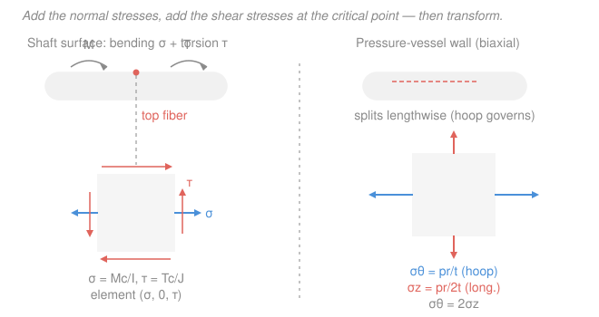

# Mechanics of Materials · Lesson 4.3: Combined loadings

> ⏱ ~15 min · Module 4: Stress transformation & failure · Builds on: [1.1 Normal & shear stress](01-01-normal-shear-stress.md), [2.1 Torsion of circular shafts](02-01-torsion-circular-shafts.md), [2.4 Flexure formula](02-04-flexure-formula.md), [2.5 Transverse shear](02-05-transverse-shear-stress.md), [4.1 Plane-stress transformation](04-01-plane-stress-transformation.md), [4.2 Mohr's circle](04-02-mohrs-circle.md) · Unlocks: [4.5 Yield & failure criteria](04-05-yield-failure-criteria.md)

## Why this matters

Nothing in the real world is politely loaded one way at a time. A drive shaft twists *and* sags under its own weight. A propeller shaft carries torque *and* thrust. A pressurized pipe with a valve hanging off it has hoop stress *and* bending *and* torsion, all at once. You already know each stress formula in isolation — this lesson is the assembly step: pile them onto **one point**, read off the plane-stress state $(\sigma_x, \tau_{xy})$ there, and hand it to the transformation machinery of [4.1](04-01-plane-stress-transformation.md)/[4.2](04-02-mohrs-circle.md) to find the true worst-case stress. That combined worst case is exactly what a yield check ([4.5](04-05-yield-failure-criteria.md)) compares against — and it's the whole of **Boss Problem 4**.

## The idea

Here's the one liberating fact: **stresses at a point superpose.** As long as the material stays elastic and deformations stay small (so geometry doesn't change appreciably under load), every load source contributes its own stress *independently*, and you just add them up. There's no interaction term, no cross-coupling — a torque doesn't change what a bending moment does to the fibers, it only adds its own shear on top.

So the recipe is almost mechanical:

1. **Pick a critical point** on the cross-section — the spot where the total stress is worst.
2. At that point, compute each stress from its own formula: axial $\sigma = P/A$, bending $\sigma = Mc/I$, torsion $\tau = Tc/J$, transverse shear $\tau = VQ/It$.
3. **Add the normal stresses to each other; add the shear stresses to each other.** They live on the same little element as $\sigma_x$ (along the member's axis) and $\tau_{xy}$.
4. Now it's a plain plane-stress problem — **transform** it to get $\sigma_1$, $\sigma_2$, and $\tau_{\max}$.

The only real skill is step 1. Adding numbers is easy; knowing *where* to add them is the engineering. Normal stresses and shear stresses don't peak at the same place, so you often have to check two or three candidate points and take the worst.

## The formal version

**The four contributors** (each acting on a cut whose normal is the member's axis $z$, so all normal stresses are axial-direction $\sigma$, and all these shears are $\tau$ on that face):

$$\sigma_{\text{axial}}=\frac{P}{A},\qquad \sigma_{\text{bend}}=\frac{Mc}{I},\qquad \tau_{\text{tor}}=\frac{Tc}{J},\qquad \tau_{\text{shear}}=\frac{VQ}{It}.$$

- $P$ = internal axial force (N), $A$ = area (mm²); tension $+$, compression $-$.
- $M$ = bending moment (N·mm), $c$ = distance from neutral axis to the fiber (mm), $I$ = second moment of area (mm⁴). Use $\sigma=-My/I$ for signs; at the extreme fiber the magnitude is $Mc/I$.
- $T$ = torque (N·mm), $J = \tfrac{\pi d^4}{32}$ for a solid circular shaft (mm⁴), $c$ = outer radius.
- $V$ = transverse shear force (N), $Q$ = first moment of the area beyond the point (mm³), $t$ = width there (mm).

**The combined state.** At the chosen point, sum like with like:

$$\boxed{\;\sigma_x=\sigma_{\text{axial}}\pm\sigma_{\text{bend}},\qquad \tau_{xy}=\tau_{\text{tor}}\pm\tau_{\text{shear}}\;}$$

*In words: total normal stress is the axial plus/minus the bending part; total shear is the torsional plus/minus the transverse-shear part — signs depending on whether they reinforce or oppose at that point.* Usually $\sigma_y=0$ (nothing stresses the cross-section transversely), so the element is $(\sigma_x,\,0,\,\tau_{xy})$. Feed it straight into the [4.1](04-01-plane-stress-transformation.md) results:

$$\sigma_{1,2}=\frac{\sigma_x}{2}\pm\sqrt{\left(\frac{\sigma_x}{2}\right)^2+\tau_{xy}^2},\qquad \tau_{\max}=\sqrt{\left(\frac{\sigma_x}{2}\right)^2+\tau_{xy}^2}.$$

**Choosing the critical point** — the two rules that cover most shafts and beams:

- **Bending peaks at the extreme fiber**, where transverse shear is *zero* (and vice versa: $\tau_{VQ/It}$ peaks at the neutral axis, where bending $\sigma$ is zero). So at the top/bottom fiber you keep $\sigma_{\text{bend}}$ and drop $\tau_{\text{shear}}$ — a big simplification. On slender members transverse shear is small anyway; it matters mainly for short, stubby beams.
- **On a round shaft under bending + torsion**, torsional shear $\tau=Tc/J$ is the *same all around* the outer surface, but bending $\sigma=Mc/I$ is largest (tension one side, compression the other) at the top and bottom fibers. So the worst point is the **outer surface, top or bottom**, carrying the full $(\sigma_{\text{bend}},\,0,\,\tau_{\text{tor}})$.

**Thin-walled pressure vessel — combined by geometry, not by loads.** A cylinder of inner radius $r$ and wall thickness $t \ll r$ under internal pressure $p$ develops two normal stresses at once:

$$\sigma_\theta=\frac{pr}{t}\ \ (\text{hoop}),\qquad \sigma_z=\frac{pr}{2t}\ \ (\text{longitudinal}).$$

*In words: the wall is pulled twice as hard around the belly (hoop) as along the length.* The factor of two is why a hot-dog splits down its side, not across its ends, and why over-pressured pipes rupture with a **lengthwise** crack — the hoop stress is what tears the seam. This is already a **principal** biaxial state ($\tau=0$ on these faces, so $\sigma_1=\sigma_\theta$, $\sigma_2=\sigma_z$) unless something *else* — a torque, the vessel's own weight, a thrust — adds shear or extra normal stress, in which case you superpose those on $\sigma_z$ and $\tau_{xy}$ and transform as usual. (Radial stress through the thin wall is $\sim p$, tiny next to $pr/t$, so we take $\sigma_3\approx 0$.)

## Picture

## Worked examples

**Example 1 (Boss-Problem-4 setup — solid shaft, bending + torsion).** A solid steel shaft of diameter $d=50\ \mathrm{mm}$ carries a bending moment $M=1.5\ \mathrm{kN\cdot m}$ and a torque $T=2.0\ \mathrm{kN\cdot m}$ at a section. Find the stress state at the critical fiber and its principal stresses and maximum shear.

Critical point: outer surface, top fiber ($c=d/2=25$ mm), where bending is maximal and transverse shear is zero. Use the tidy solid-shaft shortcuts $\sigma=32M/\pi d^3$ and $\tau=16T/\pi d^3$ (from $I=\pi d^4/64$, $J=\pi d^4/32$). With $d^3=1.25\times10^{5}\ \mathrm{mm^3}$, so $\pi d^3 = 3.927\times10^{5}\ \mathrm{mm^3}$:

$$\sigma=\frac{32M}{\pi d^3}=\frac{32(1.5\times10^{6})}{3.927\times10^{5}}=122.2\ \mathrm{MPa},\qquad \tau=\frac{16T}{\pi d^3}=\frac{16(2.0\times10^{6})}{3.927\times10^{5}}=81.5\ \mathrm{MPa}.$$

The element is $(\sigma,\,0,\,\tau)=(122.2,\,0,\,81.5)\ \mathrm{MPa}$. Transform:

$$\sigma_{1,2}=\frac{\sigma}{2}\pm\sqrt{\left(\frac{\sigma}{2}\right)^2+\tau^2}=61.1\pm\sqrt{61.1^2+81.5^2}=61.1\pm101.9\ \mathrm{MPa}.$$

$$\sigma_1=163.0\ \mathrm{MPa},\qquad \sigma_2=-40.8\ \mathrm{MPa},\qquad \tau_{\max}=101.9\ \mathrm{MPa}.$$

*Check.* Units: N·mm / mm³ = N/mm² = MPa ✓. Sanity: a pure-bending fiber would see only 122 MPa, but the added torsion pushes the true peak normal stress to 163 MPa and creates a 102 MPa shear — ignoring the torque would badly under-predict failure. This $(\sigma,\tau)$ pair is exactly what a von Mises or Tresca check consumes in [4.5](04-05-yield-failure-criteria.md).

**Example 2 (pressure vessel — the biaxial state for a yield check).** A cylindrical tank has inner radius $r=0.5\ \mathrm{m}=500\ \mathrm{mm}$, wall thickness $t=10\ \mathrm{mm}$, internal pressure $p=2\ \mathrm{MPa}$. Find the stress state in the wall.

$$\sigma_\theta=\frac{pr}{t}=\frac{2\times500}{10}=100\ \mathrm{MPa},\qquad \sigma_z=\frac{pr}{2t}=\frac{2\times500}{2\times10}=50\ \mathrm{MPa}.$$

No shear acts on these faces, so the state is already principal: $\sigma_1=100$, $\sigma_2=50$, $\sigma_3\approx0\ \mathrm{MPa}$. The in-plane maximum shear is $\tau_{\max}^{\text{in-plane}}=(\sigma_1-\sigma_2)/2=25\ \mathrm{MPa}$ — **but** the true (absolute) maximum shear uses the largest and smallest of all three principals, including $\sigma_3=0$:

$$\tau_{\max}^{\text{abs}}=\frac{\sigma_1-\sigma_3}{2}=\frac{100-0}{2}=50\ \mathrm{MPa}.$$

*Check.* Units: MPa·(mm/mm) = MPa ✓. Ratio check: $\sigma_\theta/\sigma_z=2$ exactly, as it must for a cylinder — hoop is twice longitudinal. The pair $(\sigma_1,\sigma_2,\sigma_3)=(100,50,0)$ MPa is the biaxial state we'll drop into von Mises in [4.5](04-05-yield-failure-criteria.md); note the absolute $\tau_{\max}$ is double the in-plane one, a classic trap when the third principal is zero.

## Watch out

- **You might add stresses that live on different faces.** Only stresses on the *same* element face and in the *same* direction superpose. Axial and bending are both normal stresses along the member axis, so they add to $\sigma_x$. Torsion and transverse shear are both shears on the axial face, so they add to $\tau_{xy}$. You cannot add a $\sigma$ to a $\tau$ — that's what transformation is *for*.
- **You might sum the peaks of bending and transverse shear at the same point — they don't coincide.** Bending $\sigma$ is largest at the extreme fiber where $\tau_{VQ/It}=0$; transverse shear is largest at the neutral axis where $\sigma_{\text{bend}}=0$. Evaluate the combined state at *each* candidate point and take the worst; don't manufacture a phantom point that has both maxima at once.
- **You might report the in-plane $\tau_{\max}$ when the absolute one is bigger.** When both in-plane principals have the same sign (e.g. the pressure vessel: $+100$ and $+50$), the out-of-plane principal $\sigma_3=0$ becomes the extreme value, and $\tau_{\max}^{\text{abs}}=(\sigma_{\max}-\sigma_{\min})/2$ uses it. Tresca yielding cares about the *absolute* max shear — always include $\sigma_3$.

## One-liner

> Superpose each load's stress at one chosen critical point — normals with normals, shears with shears — to build the element $(\sigma_x,\tau_{xy})$, then transform: combining loads is just addition plus a Mohr's circle.

## Problems

**P1 (🟢)** A solid circular shaft, $d=40\ \mathrm{mm}$, carries axial tension $P=30\ \mathrm{kN}$ and torque $T=0.4\ \mathrm{kN\cdot m}$. At the outer surface, find $\sigma$ (axial) and $\tau$ (torsion), write the stress element $(\sigma,0,\tau)$, and find the principal stresses and $\tau_{\max}$.

**P2 (🟡)** A cylindrical pressure vessel has $r=0.6\ \mathrm{m}$, $t=12\ \mathrm{mm}$, internal pressure $p=1.5\ \mathrm{MPa}$. A torque applied to the vessel adds a wall shear stress $\tau=20\ \mathrm{MPa}$. Find the wall's stress element $(\sigma_x,\sigma_y,\tau_{xy})$ and its in-plane principal stresses. (Take $\sigma_x=\sigma_z$ longitudinal, $\sigma_y=\sigma_\theta$ hoop.)

**P3 (🔴, optional)** A solid round signpost, $d=80\ \mathrm{mm}$, is loaded at one section by a bending moment $M=6\ \mathrm{kN\cdot m}$ (wind), a torque $T=4\ \mathrm{kN\cdot m}$ (offset sign), and an axial compression $P=10\ \mathrm{kN}$ (weight). At the *compression* extreme fiber, superpose the three stresses into $(\sigma,0,\tau)$ and find $\tau_{\max}$. Comment on how much the axial term matters.

Solutions

**P1** Area $A=\pi d^2/4=\pi(40)^2/4=1256.6\ \mathrm{mm^2}$. Axial (tension, $+$):

$$\sigma=\frac{P}{A}=\frac{30{,}000}{1256.6}=23.9\ \mathrm{MPa}.$$

Torsion, with $\pi d^3=\pi(40)^3=2.011\times10^{5}\ \mathrm{mm^3}$:

$$\tau=\frac{16T}{\pi d^3}=\frac{16(0.4\times10^{6})}{2.011\times10^{5}}=31.8\ \mathrm{MPa}.$$

Element $(\sigma,0,\tau)=(23.9,\,0,\,31.8)\ \mathrm{MPa}$. Transform:

$$\sigma_{1,2}=\frac{23.9}{2}\pm\sqrt{\left(\frac{23.9}{2}\right)^2+31.8^2}=11.9\pm\sqrt{142.6+1013.2}=11.9\pm34.0\ \mathrm{MPa},$$

$$\sigma_1=45.9\ \mathrm{MPa},\qquad \sigma_2=-22.1\ \mathrm{MPa},\qquad \tau_{\max}=34.0\ \mathrm{MPa}.$$

*Check.* Units MPa throughout ✓. Because axial ($24$ MPa) is modest next to torsion ($32$ MPa), the shear dominates and $\sigma_2$ comes out compressive even though the axial load is pure tension — the twist, not the pull, sets the peak shear.

**P2** Hoop and longitudinal:

$$\sigma_\theta=\frac{pr}{t}=\frac{1.5\times600}{12}=75\ \mathrm{MPa},\qquad \sigma_z=\frac{pr}{2t}=\frac{1.5\times600}{2\times12}=37.5\ \mathrm{MPa}.$$

Element (longitudinal as $\sigma_x$, hoop as $\sigma_y$): $(\sigma_x,\sigma_y,\tau_{xy})=(37.5,\,75,\,20)\ \mathrm{MPa}$. Center and radius:

$$C=\frac{37.5+75}{2}=56.25\ \mathrm{MPa},\qquad R=\sqrt{\left(\frac{37.5-75}{2}\right)^2+20^2}=\sqrt{18.75^2+20^2}=27.4\ \mathrm{MPa}.$$

$$\sigma_1=C+R=83.7\ \mathrm{MPa},\qquad \sigma_2=C-R=28.9\ \mathrm{MPa}\quad(\tau_{\max}^{\text{in-plane}}=R=27.4\ \mathrm{MPa}).$$

*Check.* Units MPa ✓. The torque's shear rotates the principal axes off the hoop/longitudinal directions and lifts $\sigma_1$ from $75$ to $83.7$ MPa. Both in-plane principals are positive, so the absolute max shear would use $\sigma_3=0$: $\tau_{\max}^{\text{abs}}=83.7/2=41.9$ MPa — bigger than the in-plane value, the same trap as Example 2.

**P3** With $d=80\ \mathrm{mm}$: $A=\pi(80)^2/4=5026.5\ \mathrm{mm^2}$, $\pi d^3=\pi(80)^3=1.608\times10^{6}\ \mathrm{mm^3}$.

Bending (magnitude at extreme fiber) and torsion:

$$\sigma_{\text{bend}}=\frac{32M}{\pi d^3}=\frac{32(6\times10^{6})}{1.608\times10^{6}}=119.4\ \mathrm{MPa},\qquad \tau=\frac{16T}{\pi d^3}=\frac{16(4\times10^{6})}{1.608\times10^{6}}=39.8\ \mathrm{MPa}.$$

Axial (compression, $-$):

$$\sigma_{\text{axial}}=-\frac{P}{A}=-\frac{10{,}000}{5026.5}=-2.0\ \mathrm{MPa}.$$

At the compression fiber the bending compression and axial compression reinforce:

$$\sigma=-(119.4+2.0)=-121.4\ \mathrm{MPa},\qquad \tau=39.8\ \mathrm{MPa}.$$

Transform:

$$\sigma_{1,2}=\frac{-121.4}{2}\pm\sqrt{\left(\frac{-121.4}{2}\right)^2+39.8^2}=-60.7\pm\sqrt{3684+1584}=-60.7\pm72.6\ \mathrm{MPa},$$

$$\sigma_1=11.9\ \mathrm{MPa},\qquad \sigma_2=-133.3\ \mathrm{MPa},\qquad \tau_{\max}=72.6\ \mathrm{MPa}.$$

*Check.* Units MPa ✓. The axial term contributes only $2.0$ of the $121.4$ MPa normal stress — under 2% — a good reminder that on a bending-dominated member the self-weight axial stress is often negligible, but you confirm that by computing it, not by assuming it. Bending and torsion are what govern.

## Flashback

**From Lesson 4.2 (Mohr's circle):** A plane-stress element has $\sigma_x=80\ \mathrm{MPa}$, $\sigma_y=-20\ \mathrm{MPa}$, $\tau_{xy}=30\ \mathrm{MPa}$. Using Mohr's circle, find the principal stresses, the maximum in-plane shear, and the orientation $\theta_p$ of the principal axes.

Solution

Center and radius:

$$C=\frac{\sigma_x+\sigma_y}{2}=\frac{80+(-20)}{2}=30\ \mathrm{MPa},\qquad R=\sqrt{\left(\frac{\sigma_x-\sigma_y}{2}\right)^2+\tau_{xy}^2}=\sqrt{50^2+30^2}=\sqrt{3400}=58.3\ \mathrm{MPa}.$$

Principals and max shear:

$$\sigma_1=C+R=88.3\ \mathrm{MPa},\qquad \sigma_2=C-R=-28.3\ \mathrm{MPa},\qquad \tau_{\max}=R=58.3\ \mathrm{MPa}.$$

Orientation:

$$\tan 2\theta_p=\frac{2\tau_{xy}}{\sigma_x-\sigma_y}=\frac{2(30)}{80-(-20)}=\frac{60}{100}=0.6\ \Rightarrow\ 2\theta_p=31.0^\circ,\ \ \theta_p=15.5^\circ.$$

*Check.* Units MPa ✓. Invariant check: $\sigma_1+\sigma_2=88.3+(-28.3)=60=\sigma_x+\sigma_y$ ✓ (the sum of normal stresses is preserved under rotation). This is precisely the machinery Example 1 and the problems feed their combined $(\sigma_x,\tau_{xy})$ into.

## Connections

- **Backward:** every ingredient is a formula you already own — axial $P/A$ from [1.1](01-01-normal-shear-stress.md), torsional $Tc/J$ from [2.1](02-01-torsion-circular-shafts.md), bending $Mc/I$ from [2.4](02-04-flexure-formula.md), transverse shear $VQ/It$ from [2.5](02-05-transverse-shear-stress.md) (which needs $I$ from [`statics` 4.3](../../statics/lessons/04-03-second-moment-of-area-parallel-axis.md)). This lesson only *adds* them and reruns the transformation of [4.1](04-01-plane-stress-transformation.md)/[4.2](04-02-mohrs-circle.md).
- **Forward:** [4.5 Yield & failure criteria](04-05-yield-failure-criteria.md) takes the combined $(\sigma_1,\sigma_2,\sigma_3)$ from here and asks whether the material yields — Tresca uses $\tau_{\max}$, von Mises uses $\sqrt{\sigma^2+3\tau^2}$ for the bending+torsion shaft. This is the last modeling step before **Boss Problem 4**, which is Example 1 carried all the way to a factor of safety.
- **Sideways (materials science):** we compute the stress state that *reaches* the material; [`materials-science` 4.4](../../materials-science/lessons/04-04-failure-fracture-fatigue-creep.md) explains *why* a pressure vessel tears along its length — the hoop stress $\sigma_\theta=pr/t$ (twice longitudinal) drives a crack that opens on the plane perpendicular to it, i.e. a seam running along the axis.
