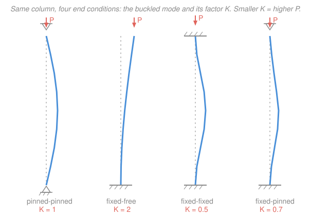

# Mechanics of Materials · Lesson 4.4: Column buckling

> ⏱ ~15 min · Module 4: Stress Transformation & Failure · Builds on: [2.4 Flexure formula](02-04-flexure-formula.md), [1.2 Strain and the tension test](01-02-strain-tension-test.md), [`statics` 04-03 Second moment of area](../../statics/lessons/04-03-second-moment-of-area-parallel-axis.md) · Unlocks: [4.5 Yield / failure criteria](04-05-yield-failure-criteria.md)

## Why this matters

Push down hard on a plastic ruler stood on its end and it doesn't crush — it suddenly bows out sideways and snaps. That sideways collapse, **buckling**, happens at a load that can be a small fraction of the load the material could actually withstand in pure compression. It is the failure mode of scaffolding poles, aircraft stringers, engine connecting rods, and the legs of every table you've ever leaned on. And it's a *different animal* from everything else in this course so far: it doesn't depend on how strong the material is, only on how **stiff** and how **slender** the member is. A column of high-strength steel and one of mild steel buckle at the *exact same load*. Get this wrong and you design a member against crushing that fails at a quarter of the load by folding sideways.

## The idea

Every compression member is imperfect — a hair off-straight, the load a whisker off-center. That tiny bow creates a bending moment $P \times v$ (load times sideways deflection $v$), which bends the column *more*, which grows the moment, which bends it more still. Two effects fight: the axial load wants to amplify the bow, the column's bending stiffness $EI$ wants to straighten it back.

At low load, stiffness wins — nudge the column sideways and it springs back straight. There is a special load, the **critical load** $P_{cr}$, where the two exactly balance: the column is content to sit bowed at *any* small amplitude. Push past it and amplification wins outright — the deflection runs away and the column collapses. Nothing yielded, nothing cracked. The *geometry* went unstable. This is why buckling is called a **stability failure**, not a strength failure: it's the compression cousin of a pencil balanced on its tip.

Two consequences fall straight out of that tug-of-war, before any algebra:

- A column always folds about its **weakest** bending axis — the one with the smallest $I$. (Stand on a yardstick: it bows across the thin dimension, never the wide one.)
- How the ends are held matters enormously. Clamp both ends and the column can't rotate there, so it bows in a tighter shape and resists far more than the same column with floppy pinned ends.

## The formal version

Take a pinned-pinned column carrying axial load $P$ (newtons, N), deflected sideways by $v(x)$ (mm) at height $x$. The internal bending moment at any cut is $M = -Pv$, and the beam-curvature law from [3.1](03-01-deflection-by-integration.md) says $EI\,v'' = M$. So

$$EI\,v'' = -Pv \qquad\Longrightarrow\qquad v'' + k^2 v = 0, \qquad k^2 \equiv \frac{P}{EI},$$

with $E$ the elastic modulus (MPa, from [1.2](01-02-strain-tension-test.md)) and $I$ the second moment of area (mm⁴). *In words: the same equation as a mass on a spring — a shape that curves back on itself.* Its solution is $v = A\sin kx + B\cos kx$. The pinned ends force $v(0)=0$ (so $B=0$) and $v(L)=0$, giving $A\sin kL = 0$. The trivial answer $A=0$ is the straight column; a *buckled* shape needs $\sin kL = 0$, i.e.

$$kL = n\pi, \quad n = 1, 2, 3, \dots$$

This is an **eigenvalue problem**: only special loads permit a bowed shape. The lowest one ($n=1$) is the one you hit first as you crank up $P$:

$$\boxed{\,P_{cr} = \frac{\pi^2 EI}{(KL)^2}\,}\qquad \text{(Euler buckling load)}$$

with the buckled shape a half-sine, $v = A\sin(\pi x/L)$. *In words: the load at which a slender column first goes unstable rises with stiffness $EI$ and falls with the square of its length.* Here $I$ is the **smallest** second moment of the section (weak axis governs).

**Effective length $KL$.** The pinned-pinned derivation gives $KL = L$. Other end conditions change the buckled shape, and $K$ (the **effective-length factor**) rescales $L$ to the length of the equivalent pinned-pinned half-sine:

| End conditions | $K$ | Effect vs. pinned-pinned |
|---|---|---|
| Pinned–pinned | $1.0$ | reference |
| Fixed–free (cantilever) | $2.0$ | $\tfrac14 \times$ the load |
| Fixed–fixed | $0.5$ | $4 \times$ the load |
| Fixed–pinned | $0.7$ | $\approx 2 \times$ the load |

Since $P_{cr} \propto 1/(KL)^2$, halving the effective length quadruples the capacity. Clamping ends is the cheapest way to buy buckling strength.

**Slenderness and critical stress.** Divide $P_{cr}$ by area $A$ (mm²) and substitute $I = Ar^2$, where $r = \sqrt{I/A}$ is the **radius of gyration** (mm) — the section's "spread" about the bending axis:

$$\sigma_{cr} = \frac{P_{cr}}{A} = \frac{\pi^2 E}{(KL/r)^2}.$$

The single number $KL/r$ is the **slenderness ratio** — big means long and thin, small means short and stubby. *In words: the stress a column buckles at depends only on $E$ and slenderness, nothing else about the material.*

**When Euler is valid.** The derivation assumed the material stays elastic. Euler is only honest while $\sigma_{cr} < \sigma_Y$ (the yield stress). Setting them equal gives the **transition slenderness**

$$\left(\frac{KL}{r}\right)_{\!c} = \pi\sqrt{\frac{E}{\sigma_Y}}.$$

- **Slender** ($KL/r > (KL/r)_c$): buckles elastically at $P_{cr}$ — Euler applies.
- **Stocky** ($KL/r < (KL/r)_c$): reaches $\sigma_Y$ and yields/crushes first — Euler *overpredicts* and must not be used.

For structural steel ($E = 200$ GPa, $\sigma_Y = 250$ MPa), $(KL/r)_c = \pi\sqrt{200000/250} \approx 89$.

## Picture

## Worked examples

**Example 1 (does buckling or crushing govern?).** A pinned-pinned steel column, $L = 3\ \mathrm{m}$, least second moment $I = 4\times10^6\ \mathrm{mm^4}$, area $A = 5000\ \mathrm{mm^2}$, $E = 200\ \mathrm{GPa} = 200\times10^3\ \mathrm{N/mm^2}$, $\sigma_Y = 250\ \mathrm{MPa}$. With $K = 1$, $KL = 3000\ \mathrm{mm}$:

$$P_{cr} = \frac{\pi^2 EI}{(KL)^2} = \frac{\pi^2 (200\times10^3)(4\times10^6)}{(3000)^2} = \frac{7.896\times10^{12}}{9\times10^6} \approx 8.77\times10^5\ \mathrm{N} = 877\ \mathrm{kN}.$$

Compare to the **squash load** (pure crushing at yield): $P_Y = \sigma_Y A = 250 \times 5000 = 1.25\times10^6\ \mathrm{N} = 1250\ \mathrm{kN}$.

Since $877 < 1250\ \mathrm{kN}$, the column **buckles before it can yield** — buckling governs, at 70% of the crushing load. Sanity via slenderness: $r = \sqrt{I/A} = \sqrt{4\times10^6/5000} = \sqrt{800} = 28.3\ \mathrm{mm}$, so $KL/r = 3000/28.3 = 106 > 89$ — slender, Euler valid. And $\sigma_{cr} = P_{cr}/A = 877000/5000 = 175\ \mathrm{MPa} < 250\ \mathrm{MPa}$ ✓. *Units:* $\mathrm{(N/mm^2)(mm^4)/mm^2 = N}$ ✓.

**Example 2 (fixing the ends — and its limit).** Clamp both ends of the *same* column, $K = 0.5$. The $1/(KL)^2$ scaling gives, directly,

$$P_{cr}' = \frac{\pi^2 EI}{(0.5\,L)^2} = \frac{1}{0.5^2}\,P_{cr} = 4 \times 877 = 3509\ \mathrm{kN}.$$

Four times the load, for free, just by clamping. **But check validity before you trust it.** Now $KL = 1500\ \mathrm{mm}$, so $KL/r = 1500/28.3 = 53 < 89$ — the column is now **stocky**. The Euler stress would be $\sigma_{cr}' = 4 \times 175 = 702\ \mathrm{MPa}$, far above $\sigma_Y = 250\ \mathrm{MPa}$: impossible, the steel yields long before that. So the fixed-fixed column's real capacity is the squash load $P_Y = 1250\ \mathrm{kN}$, not $3509\ \mathrm{kN}$.

The lesson: stiffening the ends moved this column *out of the Euler regime entirely*. The $4\times$ rule is real, but only while the member stays slender — once $KL/r$ drops below the transition, yield takes over and caps the gain.

## Watch out

- **You might think a stronger steel lets a slender column carry more.** It doesn't. $P_{cr}$ contains $E$ and $I$ but **not** $\sigma_Y$. Every steel — mild or high-strength — has essentially the same $E \approx 200$ GPa, so paying for high-strength steel buys a slender column *zero* extra buckling capacity. Strength only helps once the member is stocky enough to yield instead of buckle. (Contrast material failure — fracture, fatigue, creep, in [`materials-science` 4.4](../../materials-science/lessons/04-04-failure-fracture-fatigue-creep.md) — which *does* turn on $\sigma_Y$ and toughness. Buckling is geometric; those are material.)
- **You might use the largest $I$ (the strong axis).** Use the **smallest**. The column folds about whichever axis it's floppiest on, so a wide-flange section buckles about its weak axis unless bracing prevents it.
- **You might apply Euler to a short, stubby column.** Below the transition slenderness Euler badly *over*predicts — a stocky column crushes/yields at $\sigma_Y A$, which is *less* than the Euler formula's fantasy value. Always check $\sigma_{cr} < \sigma_Y$ before quoting $P_{cr}$.

## One-liner

> A slender column fails by folding sideways at $P_{cr} = \pi^2 EI/(KL)^2$ — a stiffness-and-geometry limit set by $E$, the *smallest* $I$, and the end fixity $K$, with the material's strength nowhere in sight.

## Problems

**P1 (🟢)** A pinned-pinned aluminum column ($E = 70\ \mathrm{GPa}$), length $L = 2\ \mathrm{m}$, is a solid circular rod of diameter $d = 50\ \mathrm{mm}$. Compute its second moment $I = \pi d^4/64$ and its Euler buckling load $P_{cr}$ ($K = 1$).

**P2 (🟡)** The column of P1 now has both ends fixed ($K = 0.5$). Find the new $P_{cr}$ and its slenderness ratio $KL/r$ (for a solid circle $r = d/4$). Confirm Euler still applies given aluminum's transition slenderness $(KL/r)_c \approx 54$.

**P3 (🔴)** A pinned-pinned steel W-column ($E = 200\ \mathrm{GPa}$, $\sigma_Y = 250\ \mathrm{MPa}$) has $A = 6000\ \mathrm{mm^2}$ and unequal second moments $I_x = 45\times10^6\ \mathrm{mm^4}$, $I_y = 15\times10^6\ \mathrm{mm^4}$; length $L = 6\ \mathrm{m}$. Which axis buckles? Find $P_{cr}$, verify Euler is valid, and give the factor of safety against buckling if the applied load is $300\ \mathrm{kN}$.

Solutions

**P1** Second moment of a solid circle:

$$I = \frac{\pi d^4}{64} = \frac{\pi (50)^4}{64} = \frac{\pi (6.25\times10^6)}{64} \approx 3.07\times10^5\ \mathrm{mm^4}.$$

With $E = 70\times10^3\ \mathrm{N/mm^2}$, $KL = 2000\ \mathrm{mm}$:

$$P_{cr} = \frac{\pi^2 EI}{(KL)^2} = \frac{\pi^2 (70\times10^3)(3.07\times10^5)}{(2000)^2} = \frac{2.12\times10^{11}}{4\times10^6} \approx 5.30\times10^4\ \mathrm{N} = 53\ \mathrm{kN}.$$

*Check.* $r = d/4 = 12.5\ \mathrm{mm}$, $KL/r = 2000/12.5 = 160$ — extremely slender, so buckling dominates. Units $\mathrm{(N/mm^2)(mm^4)/mm^2 = N}$ ✓.

**P2** Same $I$, but $K = 0.5$ so $KL = 1000\ \mathrm{mm}$. Because $P_{cr} \propto 1/(KL)^2$, halving $KL$ quadruples the load:

$$P_{cr}' = 4 \times 53 = 212\ \mathrm{kN}.$$

Slenderness: $KL/r = 1000/12.5 = 80$. Since $80 > 54$, the column is still slender and Euler holds. (Quick confirm: $\sigma_{cr} = P_{cr}'/A$ with $A = \pi d^2/4 = 1963\ \mathrm{mm^2}$ gives $212000/1963 = 108\ \mathrm{MPa}$, well below aluminum's yield.) ✓

**P3** A column buckles about its **weak axis** — the one with the smallest $I$ — so use $I_{\min} = I_y = 15\times10^6\ \mathrm{mm^4}$ (it bows the $y$-way):

$$P_{cr} = \frac{\pi^2 EI_y}{(KL)^2} = \frac{\pi^2 (200\times10^3)(15\times10^6)}{(6000)^2} = \frac{2.961\times10^{13}}{3.6\times10^7} \approx 8.22\times10^5\ \mathrm{N} = 822\ \mathrm{kN}.$$

Validity: $r = \sqrt{I_y/A} = \sqrt{15\times10^6/6000} = \sqrt{2500} = 50\ \mathrm{mm}$, so $KL/r = 6000/50 = 120 > 89$ — slender, Euler valid ($\sigma_{cr} = 822000/6000 = 137\ \mathrm{MPa} < 250$ ✓). Factor of safety:

$$FS = \frac{P_{cr}}{P_{\text{applied}}} = \frac{822}{300} \approx 2.7.$$

*Check.* Had we mistakenly used the strong axis $I_x = 45\times10^6$, we'd have predicted $3\times$ the load — dangerously unconservative. Weak axis always governs (absent bracing). ✓

## Flashback

**From Lesson 2.4 (Flexure formula):** A beam with a solid rectangular cross-section $b = 30\ \mathrm{mm}$ wide by $h = 60\ \mathrm{mm}$ tall carries a bending moment $M = 1.5\ \mathrm{kN\cdot m}$ about its strong (horizontal) axis. Find the maximum bending stress.

Solution

Second moment of a rectangle about its centroidal axis, and the extreme-fibre distance $c = h/2$:

$$I = \frac{bh^3}{12} = \frac{30 (60)^3}{12} = \frac{30 \times 2.16\times10^5}{12} = 5.4\times10^5\ \mathrm{mm^4}, \qquad c = 30\ \mathrm{mm}.$$

Flexure formula (magnitude), with $M = 1.5\ \mathrm{kN\cdot m} = 1.5\times10^6\ \mathrm{N\cdot mm}$:

$$\sigma_{\max} = \frac{Mc}{I} = \frac{(1.5\times10^6)(30)}{5.4\times10^5} = 83.3\ \mathrm{MPa}.$$

*Check.* Units $\mathrm{(N\cdot mm)(mm)/mm^4 = N/mm^2 = MPa}$ ✓. This is the same $I$ that governs buckling — but here it sets bending *stress*, whereas in $P_{cr}$ it sets *stiffness against instability*. One geometric quantity, two roles. ✓

## Connections

- **Backward:** the governing equation is [3.1](03-01-deflection-by-integration.md)'s $EI\,v'' = M$ run as an eigenvalue problem, and the weak-axis $I$ comes straight from [`statics` 04-03](../../statics/lessons/04-03-second-moment-of-area-parallel-axis.md); the modulus $E$ is the tension-test slope from [1.2](01-02-strain-tension-test.md). Buckling reuses every tool from bending — it just asks a stability question instead of a stress one.
- **Forward:** [4.5 Yield / failure criteria](04-05-yield-failure-criteria.md) is the *other* way a compression member dies — reaching $\sigma_Y$. Real column design takes the **lower** of the two, buckling ($P_{cr}$) versus yielding ($\sigma_Y A$), with the transition slenderness marking the crossover we found in Example 2.
- **Sideways:** buckling is a purely geometric/stiffness failure, distinct from the *material* failure modes — fracture, fatigue, creep — in [`materials-science` 4.4](../../materials-science/lessons/04-04-failure-fracture-fatigue-creep.md). That course explains *why* a material yields (dislocations, defects); this one computes the stresses and the instabilities that get you there. A member can be nowhere near its material limit and still collapse by buckling.
