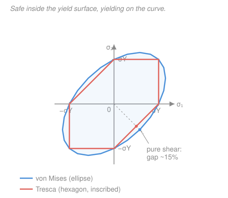

# Mechanics of Materials · Lesson 4.5: Yield and failure criteria

> ⏱ ~15 min · Module 4: Stress transformation, combined loading, and stability · Builds on: [4.1 Plane stress transformation](04-01-plane-stress-transformation.md), [4.2 Mohr's circle](04-02-mohrs-circle.md), [4.3 Combined loadings](04-03-combined-loadings.md), [1.2 Strain and the tension test](01-02-strain-tension-test.md) · Unlocks: the course's final verdict — go or no-go

## Why this matters

Everything so far ends at a stress *state* — a little block with $\sigma_x$, $\sigma_y$, and $\tau_{xy}$ on its faces, or its principal stresses $\sigma_1, \sigma_2, \sigma_3$. But your material was never tested that way. The lab pulls a bar in one direction and reports a single number, the yield stress $\sigma_Y$. So you're stuck with a mismatch: a **three-number stress state** on your part versus a **one-number strength** from the handbook. A yield criterion is the bridge. It collapses the whole multiaxial state into a single **equivalent stress** $\sigma_{eq}$ you can compare against $\sigma_Y$ — and gives you the verdict this entire course has been building toward. This is the last lesson because it's the punchline: *does the part live?*

## The idea

Here's the puzzle. Push on a block from all three sides equally — deep-sea pressure — and even enormous stresses won't make a ductile metal yield; it just gets slightly smaller. Yet a modest *twist* will. So it can't be the size of the stresses that triggers yield. It's the **shear** — the tendency of one plane of atoms to *slide* over another. Squeeze equally on all sides and there's no plane with a net sliding push, so nothing gives. That physical fact — metals yield by shear-driven slip of crystal planes — is the subject of [`materials-science` 4.2](../../materials-science/lessons/04-02-plastic-deformation-schmid.md); *that* course explains **why** dislocations glide when the shear on a slip plane gets high enough. **This** lesson does the complementary job: given a messy multiaxial state, it predicts **when** the shear reaches the threshold.

Two classic rules do it, and they differ only in *how* they measure "how much shear." **Tresca** watches the single biggest shear stress anywhere in the block and says: yield when it hits the same shear the tension test reached at yield. Simple, and slightly pessimistic. **von Mises** says one plane isn't the whole story — add up the shear-type (distortion) energy stored on *all* planes, and yield when that total matches the tension test's. It fits real ductile-metal data better. They mostly agree; where they don't, Tresca is always the more cautious of the two.

## The formal version

Order the three principal stresses so that $\sigma_1 \ge \sigma_2 \ge \sigma_3$ (all in MPa). **For a plane-stress state the third principal stress is not optional — the out-of-plane direction carries $\sigma_z = 0$, and that zero must be included in the ranking.** This is the single most common mistake in the whole topic.

**Tresca (maximum-shear) criterion.** The largest shear stress in the block is $\tau_{max} = (\sigma_1 - \sigma_3)/2$ (the radius of the *biggest* Mohr's circle, [4.2](04-02-mohrs-circle.md)). The tension test at yield has $\sigma_1 = \sigma_Y$, $\sigma_2 = \sigma_3 = 0$, so its max shear is $\sigma_Y/2$. Yield when the two match:

$$\boxed{\;\tau_{max} = \frac{\sigma_Y}{2} \quad\Longleftrightarrow\quad \sigma_1 - \sigma_3 = \sigma_Y\;}$$

*In words: yield the moment the biggest shear in your part equals the biggest shear the bar felt when it yielded.* The Tresca equivalent stress is $\sigma_{eq}^{\text{T}} = \sigma_1 - \sigma_3$.

**von Mises (distortion-energy) criterion.** Yield when the equivalent stress

$$\sigma_{vm} = \sqrt{\tfrac{1}{2}\big[(\sigma_1-\sigma_2)^2 + (\sigma_2-\sigma_3)^2 + (\sigma_3-\sigma_1)^2\big]}$$

reaches $\sigma_Y$. *In words: yield when the combined distortion (shape-changing, not volume-changing) energy equals the tension test's at yield.* Two shortcuts you'll use constantly:

- **Plane stress** ($\sigma_3 = 0$, in-plane principals $\sigma_1, \sigma_2$): $\;\sigma_{vm} = \sqrt{\sigma_1^2 - \sigma_1\sigma_2 + \sigma_2^2}$.
- **Element with only normal $\sigma$ and shear $\tau$** (the bending-plus-torsion point of a shaft, straight from [4.3](04-03-combined-loadings.md), no need to find principals first): $\;\sigma_{vm} = \sqrt{\sigma^2 + 3\tau^2}$.

**Factor of safety.** Whichever criterion you pick, the margin is

$$\boxed{\;FS = \frac{\sigma_Y}{\sigma_{eq}}\;}$$

$FS > 1$ means safe, $FS = 1$ means right at yield, $FS < 1$ means already yielded. Since Tresca's $\sigma_{eq}$ is never smaller than von Mises's, **Tresca always reports the lower (more conservative) $FS$.**

## Picture

Plot every plane-stress state as a point $(\sigma_1, \sigma_2)$. Each criterion draws a boundary: safe inside, yielding on the curve. **von Mises is an ellipse; Tresca is a hexagon inscribed inside it**, touching at six points (pure tension, pure compression, and equal biaxial states — where the two agree exactly). Between those points the hexagon pulls *inside* the ellipse, so Tresca predicts yield a little sooner. The gap is widest along the **pure-shear diagonal** ($\sigma_2 = -\sigma_1$), where von Mises allows about **15% more** stress before yielding ($2/\sqrt{3} = 1.155$). That single fact — hexagon inside ellipse, farthest apart at pure shear — is the whole disagreement in one image.

## Worked examples

**Example 1 (Boss Problem 4 close-out — the drive shaft verdict).** In [4.3](04-03-combined-loadings.md) a shaft's critical surface point came out to combined bending and torsion: $\sigma = 100$ MPa (bending, one direction only) and $\tau = 50$ MPa (torsion). The steel has $\sigma_Y = 250$ MPa. Is the shaft safe, and by how much on each criterion?

*Principal stresses* (state is $\sigma_x = 100$, $\sigma_y = 0$, $\tau_{xy} = 50$; [4.1](04-01-plane-stress-transformation.md)):

$$\sigma_{1,2} = \frac{100+0}{2} \pm \sqrt{\left(\frac{100-0}{2}\right)^2 + 50^2} = 50 \pm \sqrt{50^2 + 50^2} = 50 \pm 70.7.$$

So $\sigma_1 = 120.7$ MPa, the in-plane pair's other value is $-20.7$ MPa, and out-of-plane $\sigma_z = 0$. Ranked: $\sigma_1 = 120.7,\ \sigma_2 = 0,\ \sigma_3 = -20.7$ MPa.

*Tresca:* $\ \sigma_{eq}^{\text{T}} = \sigma_1 - \sigma_3 = 120.7 - (-20.7) = 141.4$ MPa, so

$$FS_{\text{T}} = \frac{\sigma_Y}{\sigma_1 - \sigma_3} = \frac{250}{141.4} = 1.77.$$

*von Mises:* use the shaft shortcut directly — $\sigma_{vm} = \sqrt{\sigma^2 + 3\tau^2} = \sqrt{100^2 + 3(50)^2} = \sqrt{17500} = 132.3$ MPa, so

$$FS_{vm} = \frac{250}{132.3} = 1.89.$$

Both say safe. Tresca is the stricter judge (1.77 vs 1.89). **Why they disagree here:** the state has a hefty shear component, and shear is exactly where the hexagon sits inside the ellipse. Tresca cares only about the *biggest* Mohr circle ($\sigma_1 - \sigma_3$) and ignores that $\sigma_2$ sits in the middle; von Mises blends all three and, near shear, tolerates about 7% more before it flags yield — hence the higher $FS$.

*Check.* $\sqrt{\sigma^2+3\tau^2}$ should match the principal formula: $\sqrt{120.7^2 - (120.7)(-20.7) + (-20.7)^2} = \sqrt{14570 + 2499 + 428} = \sqrt{17497} = 132.3$ MPa ✓. Units all MPa ✓. And $132.3 < 141.4$, so $FS_{vm} > FS_{\text{T}}$, as it must be. ✓

**Example 2 (pressure-vessel biaxial state — the maximum disagreement).** A point in a vessel wall is in biaxial tension: $\sigma_1 = 100$ MPa, $\sigma_2 = 50$ MPa, $\sigma_3 = 0$. Compare the two equivalent stresses.

*Tresca:* rank them — $100 \ge 50 \ge 0$ — so $\sigma_{eq}^{\text{T}} = \sigma_1 - \sigma_3 = 100 - 0 = 100$ MPa. (Note the trap: **not** $\sigma_1 - \sigma_2 = 50$. The zero is the minimum, and it governs.)

*von Mises:* $\ \sigma_{vm} = \sqrt{\sigma_1^2 - \sigma_1\sigma_2 + \sigma_2^2} = \sqrt{100^2 - (100)(50) + 50^2} = \sqrt{7500} = 86.6$ MPa.

Tresca calls the demand $100$ MPa, von Mises only $86.6$ MPa — Tresca is $100/86.6 = 1.155\times$ more severe, a **15.5% gap**. That's the *largest* the two ever differ. The reason: subtract the average stress $50$ from each principal and this state becomes $(+50, 0, -50)$ — **pure shear in disguise**, sitting right on the pure-shear diagonal of the picture where the hexagon and ellipse are farthest apart. If $\sigma_Y = 250$ MPa, Tresca gives $FS = 2.50$ and von Mises $FS = 2.89$.

*Check.* Both in MPa ✓. The gap ratio $1.155 = 2/\sqrt{3}$ ✓ — the theoretical maximum, confirming this state is worst-case for the disagreement. Sanity: both $FS > 1$, and design codes that mandate Tresca simply choose to bank that extra ~15% as conservatism. ✓

## Watch out

- **You might drop the out-of-plane $\sigma_3 = 0$ in a plane-stress Tresca check — but it often *is* the minimum.** Whenever both in-plane principals are positive (like Example 2), the true $\sigma_3$ is the zero, and $\sigma_1 - \sigma_3 = \sigma_1$, not $\sigma_1 - \sigma_2$. Always rank all three, zero included, before subtracting.
- **You might think the two criteria are wildly different — they never differ by more than ~15%.** They agree exactly at pure tension, pure compression, and equal biaxial loading, and reach their widest gap ($2/\sqrt3$) only at pure shear. If your two answers differ by a factor of two, you made an arithmetic error, not a "criterion choice."
- **You might treat these as fracture predictors — they predict *yield* (onset of permanent deformation) in *ductile* metals.** Brittle materials (cast iron, concrete, glass) fail by a different mechanism and need a different criterion (e.g. maximum-normal-stress). Tresca and von Mises are the ductile-yield tools; see [`materials-science` 4.4](../../materials-science/lessons/04-04-failure-fracture-fatigue-creep.md) for the brittle and fatigue stories.

## One-liner

> Collapse any stress state to one number — Tresca $\sigma_1 - \sigma_3$ or von Mises $\sqrt{\sigma_1^2 - \sigma_1\sigma_2 + \sigma_2^2}$ — divide it into $\sigma_Y$ for the factor of safety, and remember the hexagon lives inside the ellipse, closest at tension and farthest apart (~15%) at pure shear.

## Problems

**P1 (🟢)** A ductile steel part ($\sigma_Y = 300$ MPa) is at a plane-stress point with principal stresses $\sigma_1 = 140$ MPa and $\sigma_2 = 60$ MPa (and $\sigma_3 = 0$). Find the factor of safety by both the Tresca and von Mises criteria.

**P2 (🟡)** A solid shaft's surface point is in pure torsion: $\sigma = 0$, $\tau = 90$ MPa, with $\sigma_Y = 250$ MPa. Using the shaft shortcut for von Mises and the principal stresses for Tresca, find both factors of safety, and state which is more conservative and by what ratio.

**P3 (🔴)** A steel element ($\sigma_Y = 250$ MPa) carries $\sigma = 120$ MPa with a torsional shear $\tau$. Using the von Mises criterion, find the largest $\tau$ the element can carry before it just yields ($FS = 1$).

Solutions

**P1** Rank the principals with the out-of-plane zero: $\sigma_1 = 140 \ge \sigma_2 = 60 \ge \sigma_3 = 0$.

*Tresca:* $\sigma_{eq}^{\text{T}} = \sigma_1 - \sigma_3 = 140 - 0 = 140$ MPa, so $FS_{\text{T}} = 300/140 = 2.14$. (Not $140-60$ — the zero is the minimum.)

*von Mises:* $\sigma_{vm} = \sqrt{140^2 - (140)(60) + 60^2} = \sqrt{19600 - 8400 + 3600} = \sqrt{14800} = 121.7$ MPa, so $FS_{vm} = 300/121.7 = 2.47$.

*Check.* Units MPa ✓. $FS_{vm} > FS_{\text{T}}$ ✓ (von Mises always the more generous). Both comfortably above 1. ✓

**P2** Pure shear: $\sigma_x = \sigma_y = 0$, $\tau_{xy} = 90$. Principals $\sigma_{1,2} = 0 \pm \sqrt{0 + 90^2} = \pm 90$, so $\sigma_1 = 90$, $\sigma_2 = 0$ (out-of-plane), $\sigma_3 = -90$ MPa.

*Tresca:* $\sigma_{eq}^{\text{T}} = \sigma_1 - \sigma_3 = 90 - (-90) = 180$ MPa, so $FS_{\text{T}} = 250/180 = 1.39$.

*von Mises:* shortcut $\sigma_{vm} = \sqrt{0 + 3(90)^2} = 90\sqrt3 = 155.9$ MPa, so $FS_{vm} = 250/155.9 = 1.60$.

Tresca is more conservative, by ratio $1.60/1.39 = 155.9/... $ — cleaner from the equivalent stresses: $180/155.9 = 1.155 = 2/\sqrt3$.

*Check.* Pure shear is the maximum-disagreement case, so the ratio landing exactly on $2/\sqrt3 = 1.155$ (≈15.5%) confirms the arithmetic. ✓

**P3** von Mises at yield ($FS = 1$) means $\sigma_{vm} = \sigma_Y$. Use the normal-plus-shear shortcut:

$$\sqrt{\sigma^2 + 3\tau^2} = \sigma_Y \;\Longrightarrow\; \sigma^2 + 3\tau^2 = \sigma_Y^2 \;\Longrightarrow\; \tau = \sqrt{\frac{\sigma_Y^2 - \sigma^2}{3}}.$$

$$\tau = \sqrt{\frac{250^2 - 120^2}{3}} = \sqrt{\frac{62500 - 14400}{3}} = \sqrt{\frac{48100}{3}} = \sqrt{16033} = 126.6\ \mathrm{MPa}.$$

*Check.* Units MPa ✓. Sanity: with $\sigma = 0$ this would give $\tau = \sigma_Y/\sqrt3 = 144.3$ MPa (the pure-shear yield), and adding a normal stress of 120 MPa eats into the available shear, dropping it to 126.6 MPa — the right direction. ✓

## Flashback

**From Lesson 4.3 (Combined loadings):** A shaft's surface point carries a bending stress $\sigma = 80$ MPa and a torsional shear $\tau = 30$ MPa. Find the principal stresses and the maximum in-plane shear stress. (Fresh variant — you'll recognize this as the setup a yield check needs.)

Solution

State: $\sigma_x = 80$, $\sigma_y = 0$, $\tau_{xy} = 30$ MPa. Center and radius (Mohr, [4.2](04-02-mohrs-circle.md)):

$$C = \frac{\sigma_x + \sigma_y}{2} = 40\ \mathrm{MPa}, \qquad R = \sqrt{\left(\frac{80-0}{2}\right)^2 + 30^2} = \sqrt{40^2 + 30^2} = \sqrt{2500} = 50\ \mathrm{MPa}.$$

$$\sigma_1 = C + R = 90\ \mathrm{MPa}, \qquad \sigma_2 = C - R = -10\ \mathrm{MPa}, \qquad \tau_{max}^{\text{in-plane}} = R = 50\ \mathrm{MPa}.$$

*Check.* Units MPa ✓. The 3-4-5 triangle ($40, 30, 50$) makes $R = 50$ exact. Note one principal is tensile and one compressive, so including $\sigma_3 = 0$ wouldn't change the *absolute* max shear here — $(\sigma_1 - \sigma_2)/2 = 50$ already spans the full range. Feed $\sigma_1 = 90$, $\sigma_3 = -10$ into Tresca and you'd get $\sigma_{eq}^{\text{T}} = 100$ MPa — exactly the kind of number this lesson turns into a verdict. ✓

## Connections

- **Backward:** the principal stresses and $\tau_{max}$ come straight from [4.1](04-01-plane-stress-transformation.md)/[4.2](04-02-mohrs-circle.md), and the combined $\sigma$-and-$\tau$ states you feed in are the output of [4.3](04-03-combined-loadings.md). The strength $\sigma_Y$ itself is the tension-test number from [1.2](01-02-strain-tension-test.md) — this lesson is where that lone lab measurement finally gets used against a real multiaxial state.
- **Forward (course end):** this is the go/no-go verdict the whole course was built to deliver. Every stress you learned to compute — axial, torsional, bending, combined — funnels into a $\sigma_{eq}$ and a factor of safety. Next steps beyond this course (plasticity, fatigue, fracture mechanics) refine *what happens after* $FS$ drops to 1.
- **Sideways (materials science):** the division of labor is exact. [`materials-science` 4.2](../../materials-science/lessons/04-02-plastic-deformation-schmid.md) explains **why** metals yield by shear — dislocations gliding on slip planes once the resolved shear stress is high enough (Schmid's law) — which is the physical reason both criteria are built on shear, and why Tresca's "maximum shear" picture is so intuitive. This course computes **when** a given multiaxial state reaches that threshold. Demand ($\sigma_{eq}$) meets supply ($\sigma_Y$), and safe design keeps demand below it.
