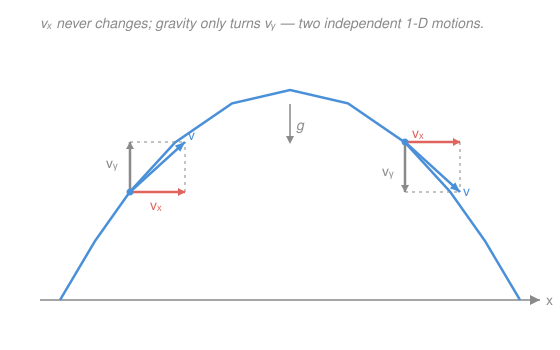

# Newtonian Mechanics · Lesson 1.1: Kinematics

> ⏱ ~15 min · Module 1: Kinematics and Newton's laws · Builds on: [`calc-refresher`](../../calc-refresher/syllabus.md) · Unlocks: 1.2 (Newton's laws)

## Why this matters

Before you can explain *why* things move (that's Newton's laws, next lesson), you need a clean language for *how* they move. That language is calculus wearing a physics hat: position, velocity, and acceleration are just a function and its first two derivatives. Get this reflex — differentiate to go "down," integrate to come back "up" — and projectiles, orbits, and oscillations all become the same story told with different forces.

## The idea

Watch a thrown ball. Its **position** is where it is; its **velocity** is how fast that position is changing (and in what direction); its **acceleration** is how fast the *velocity* is changing. Each one is the rate of change of the one before it — velocity is the derivative of position, acceleration the derivative of velocity. Motion *is* calculus.

Two ideas do almost all the work in this lesson:

- **Down and back up.** Going *down* the chain is differentiation ($\mathbf r \to \mathbf v \to \mathbf a$); coming *back up* is integration, and each integration leaves behind a constant fixed by an initial condition (where it started, how fast). If you know the acceleration and the starting state, you know the entire motion.
- **Axes are independent.** A vector splits into components that don't talk to each other. A projectile is really *two* one-dimensional problems — constant-velocity horizontal, constant-acceleration vertical — glued together only by sharing the same clock. Solve each axis alone, then read them off at the same time $t$.

## The formal version

Let $\mathbf r(t)$ be the **position vector** (units: m) — the arrow from the origin to the object at time $t$ (units: s). Then

$$\mathbf v(t) = \frac{d\mathbf r}{dt}, \qquad \mathbf a(t) = \frac{d\mathbf v}{dt} = \frac{d^2\mathbf r}{dt^2}.$$

Here $\mathbf v$ is **velocity** (m/s) and $\mathbf a$ is **acceleration** (m/s²). *In words: velocity is the rate position changes; acceleration is the rate velocity changes.* This is exactly the [derivative-as-sensitivity](../../calc-refresher/lessons/01-01-derivative-as-sensitivity.md) idea — how much the output moves per tick of the input — applied twice.

Reverse the arrows by integrating (the [integral as accumulation](../../calc-refresher/lessons/02-01-integral-as-accumulation.md)):

$$\mathbf v(t) = \mathbf v_0 + \int_0^t \mathbf a\,dt', \qquad \mathbf r(t) = \mathbf r_0 + \int_0^t \mathbf v\,dt',$$

where $\mathbf r_0, \mathbf v_0$ are the position and velocity at $t=0$. *In words: accumulate acceleration to rebuild velocity, accumulate velocity to rebuild position; the starting values are the integration constants.*

**Constant acceleration.** When $\mathbf a = \text{const}$ (a falling body, $a = g$), those integrals are trivial and collapse, one component at a time, into the three **kinematic equations**:

$$v = v_0 + at, \qquad x = x_0 + v_0 t + \tfrac12 a t^2, \qquad v^2 = v_0^2 + 2a\,\Delta x.$$

*In words: the first is "velocity grows linearly"; the second is that integrated once more; the third is the same facts with time eliminated, for when you don't care about $t$.* The first two are literally $\int a\,dt$ and $\int v\,dt$ — nothing new, just the accumulation formulas written out for a constant integrand. (Here $\Delta x = x - x_0$, in m.) These hold **only** when $a$ is constant; the moment the force varies, go back to the integrals.

## Picture

The blue velocity arrow is always tangent to the path. Its red horizontal piece $v_x$ is the *same length* at both points — nothing pushes it sideways. Only the gray vertical piece $v_y$ changes: gravity bleeds it away on the rise, then rebuilds it pointing down on the fall. Two motions, one clock.

## Worked examples

**Example 1 (mechanical — pure vertical, constant $g$).** A stone is dropped ($v_0 = 0$) from rest and falls for $t = 3$ s. Take downward as positive, $a = g = 9.8\ \mathrm{m/s^2}$. How far, how fast?

$$v = v_0 + gt = 0 + 9.8(3) = 29.4\ \mathrm{m/s}, \qquad x = \tfrac12 g t^2 = \tfrac12(9.8)(9) = 44.1\ \mathrm{m}.$$

Straight substitution into the first two kinematic equations — the definition in action.

**Example 2 (why you'd care — the two axes, run in parallel).** A ball rolls off a table of height $h = 1.25$ m with horizontal speed $v_0 = 4\ \mathrm{m/s}$. Where does it land? The insight: **the horizontal and vertical motions are independent and share only $t$.**

*Vertical* (constant acceleration, starts with zero vertical speed): $\;h = \tfrac12 g t^2 \Rightarrow t = \sqrt{2h/g} = \sqrt{2(1.25)/9.8} = 0.505$ s.

*Horizontal* (constant velocity, $a_x = 0$): $\;x = v_0 t = 4 \times 0.505 = 2.02$ m.

The fall time is set by the height *alone* — a ball dropped straight down and one fired horizontally hit the floor at the same instant. That decoupling is the whole trick of projectile motion, and it's why the figure's $v_x$ never budges.

## Watch out

- You might think acceleration points the way you're moving. It points the way your *velocity is changing* — at the top of a throw, velocity is momentarily zero but acceleration is still a full $g$ downward. Zero velocity does not mean zero acceleration.
- You might think a faster horizontal launch keeps a projectile airborne longer. It doesn't: hang time is governed by the *vertical* problem only. Horizontal speed changes *where* it lands, never *when*.
- You might reach for $v = v_0 + at$ when the acceleration isn't constant. Those three equations are a special case, not a definition. If $a$ varies with time or position, retreat to $\mathbf v = \mathbf v_0 + \int \mathbf a\,dt$.

## One-liner

> Position, velocity, acceleration are a function and its two derivatives — and a projectile is just constant-velocity sideways bolted to constant-$g$ downward, sharing one clock.

## Problems

**P1 (🟢)** A ball is thrown straight up from the ground at $v_0 = 20\ \mathrm{m/s}$ ($g = 9.8\ \mathrm{m/s^2}$). Find (a) the maximum height it reaches and (b) the total time until it returns to the thrower's hand.

**P2 (🟡)** A projectile is launched from the ground at $30\ \mathrm{m/s}$ at $40^\circ$ above the horizontal. Find its maximum height and its horizontal range. (Decompose into components; use $g = 9.8\ \mathrm{m/s^2}$.)

**P3 (🔴, optional)** Derive the third kinematic equation $v^2 = v_0^2 + 2a\,\Delta x$ from the other two — $v = v_0 + at$ and $\Delta x = v_0 t + \tfrac12 a t^2$ — by eliminating $t$.

Solutions

**P1** Take up as positive, so $a = -g = -9.8\ \mathrm{m/s^2}$.

(a) At the top, $v = 0$. Use $v^2 = v_0^2 + 2a\,\Delta x$ (no time needed):
$$0 = 20^2 + 2(-9.8)\,h \;\Rightarrow\; h = \frac{400}{19.6} = 20.4\ \mathrm{m}.$$

(b) Time to the top from $v = v_0 + at$: $\;0 = 20 - 9.8\,t_\text{up} \Rightarrow t_\text{up} = 20/9.8 = 2.04$ s. By symmetry the fall takes the same, so total $t = 2 t_\text{up} = 4.08$ s.

*Sanity check:* units — $h = \frac{(\mathrm{m/s})^2}{\mathrm{m/s^2}} = \mathrm{m}$ ✓, $t = \frac{\mathrm{m/s}}{\mathrm{m/s^2}} = \mathrm{s}$ ✓. Limiting case: throw twice as fast and $h$ quadruples (it scales as $v_0^2$) while hang time only doubles — the familiar "goes way higher but not much longer" feel. ✓

**P2** Decompose the launch: $v_{0x} = 30\cos 40^\circ = 30(0.766) = 22.98\ \mathrm{m/s}$, $\;v_{0y} = 30\sin 40^\circ = 30(0.643) = 19.28\ \mathrm{m/s}$.

*Max height* (vertical, $v_y = 0$ at top): $\;h = \dfrac{v_{0y}^2}{2g} = \dfrac{19.28^2}{2(9.8)} = \dfrac{371.7}{19.6} = 19.0\ \mathrm{m}.$

*Range:* time of flight $t = \dfrac{2 v_{0y}}{g} = \dfrac{2(19.28)}{9.8} = 3.93\ \mathrm{s}$, then horizontally $R = v_{0x}\,t = 22.98 \times 3.93 = 90.4\ \mathrm{m}.$

(Equivalently $R = \frac{v_0^2 \sin 2\theta}{g} = \frac{900\sin 80^\circ}{9.8} = \frac{900(0.985)}{9.8} = 90.4$ m.)

*Sanity check:* units — height $\frac{(\mathrm{m/s})^2}{\mathrm{m/s^2}} = \mathrm{m}$ ✓, range $(\mathrm{m/s})(\mathrm{s}) = \mathrm{m}$ ✓. Limiting case: at $\theta = 45^\circ$ the formula gives the *max* range $900/9.8 = 91.8$ m; our $40^\circ$ falls just short at $90.4$ m, exactly as it should. ✓

**P3** From the first equation, solve for time: $\;t = \dfrac{v - v_0}{a}$. Substitute into $\Delta x = v_0 t + \tfrac12 a t^2$:
$$\Delta x = v_0\!\left(\frac{v-v_0}{a}\right) + \frac{1}{2}a\left(\frac{v-v_0}{a}\right)^2 = \frac{v_0(v-v_0)}{a} + \frac{(v-v_0)^2}{2a}.$$
Put over $2a$ and factor $(v - v_0)$:
$$\Delta x = \frac{2v_0(v-v_0) + (v-v_0)^2}{2a} = \frac{(v-v_0)\big[2v_0 + (v - v_0)\big]}{2a} = \frac{(v-v_0)(v+v_0)}{2a} = \frac{v^2 - v_0^2}{2a}.$$
Multiply through: $\;2a\,\Delta x = v^2 - v_0^2$, i.e. $v^2 = v_0^2 + 2a\,\Delta x$. ∎

*Sanity check:* every term carries units of velocity² ($\mathrm{m^2/s^2}$), since $a\,\Delta x = (\mathrm{m/s^2})(\mathrm{m}) = \mathrm{m^2/s^2}$ ✓. And setting $a = 0$ gives $v = v_0$ — no acceleration, no speed change. ✓

## Connections

- **Backward:** velocity and acceleration are the [derivative-as-sensitivity](../../calc-refresher/lessons/01-01-derivative-as-sensitivity.md) applied once and twice; rebuilding motion from acceleration is [integration as accumulation](../../calc-refresher/lessons/02-01-integral-as-accumulation.md) with initial conditions as the constants.
- **Forward:** [1.2 (Newton's laws)](01-02-newtons-laws.md) supplies the $\mathbf a$ that this lesson took as given — force *determines* acceleration, and everything here then runs the motion forward. The independent-axes habit returns for circular motion in [1.3](01-03-applying-newtons-laws.md).
- **Sideways:** the "differentiate down, integrate back up" ladder is the same one economics climbs from marginal cost to total cost, and the same second-order structure ($\ddot x$ set by a force) becomes the ODE of oscillation in [3.1](03-01-simple-harmonic-motion.md).
