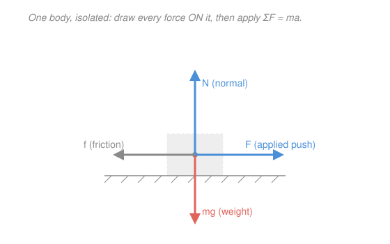

# Newtonian Mechanics · Lesson 1.2: Newton's laws and free-body diagrams

> ⏱ ~15 min · Module 1: Kinematics and Newton's laws · Builds on: [1.1 Kinematics](01-01-kinematics.md) · Unlocks: 1.3 (applying Newton's laws)

## Why this matters

[1.1](01-01-kinematics.md) taught you to *describe* motion — position, velocity, acceleration — but never said what *causes* it. Newton's answer is one equation, $\sum\mathbf F = m\mathbf a$, and it is the entire engine of classical mechanics: energy, momentum, oscillations, orbits are all consequences of it. The catch is that a physics problem doesn't arrive as an equation — it arrives as a *picture* (a block on a ramp, a mass on a rope). The free-body diagram is the discipline that converts that picture into $\sum\mathbf F = m\mathbf a$ reliably, every time. Master this and the rest of Module 1 is bookkeeping.

## The idea

Aristotle thought a moving thing needs a continuous push to keep going. Newton's first law says the opposite: left alone, an object keeps doing exactly what it was doing — at rest stays at rest, moving stays moving in a straight line at constant speed. Motion is the natural state; **change** in motion is what demands a cause, and that cause is force.

How much change? The second law: acceleration is proportional to the total force and inversely proportional to mass. Push twice as hard, accelerate twice as fast; load twice the mass, accelerate half as fast. Mass is precisely the "reluctance to accelerate."

The third law is the one that trips people: every push has an equal and opposite push back — but **on a different object**. When you lean on a wall, the wall leans back on you with exactly the same force. Because the two forces of a pair act on two *different* bodies, they never cancel each other on any single body — a fact that's easy to garble and worth pinning down.

The tool that makes all this usable is the **free-body diagram (FBD)**: mentally cut one object out of the scene, and draw every force acting *on it* as an arrow. Nothing else — not the forces it exerts on other things, not the scenery. Then read the arrows off as a sum and set it equal to $m\mathbf a$.

## The formal version

Let $\mathbf F$ denote a force (a vector, units **newtons**, $\mathrm{N} = \mathrm{kg}\cdot\mathrm{m/s^2}$), $m$ the object's mass (kilograms, kg), $\mathbf a$ its acceleration ($\mathrm{m/s^2}$), and $\mathbf v$ its velocity ($\mathrm{m/s}$).

**First law (inertia).** If $\sum\mathbf F = \mathbf 0$, then $\mathbf v$ is constant.
*In words:* zero net force means no change in velocity — steady straight-line motion, or rest. This holds only in an **inertial frame**: a reference frame that is itself not accelerating. (In an accelerating frame — a braking car — objects seem to lurch with no force behind it; those frames need correction terms we set aside.)

**Second law (the master equation).**
$$\sum \mathbf F = m\mathbf a.$$
*In words:* the vector sum of **all** forces on a body equals its mass times its acceleration. It's a vector equation, so it splits into one scalar equation per axis: $\sum F_x = m a_x$, $\sum F_y = m a_y$. The first law is just the special case $\mathbf a = \mathbf 0$.

**Third law (action–reaction).** If body A exerts force $\mathbf F_{A\to B}$ on body B, then
$$\mathbf F_{B\to A} = -\,\mathbf F_{A\to B}.$$
*In words:* forces come in equal-and-opposite pairs, and the two members act on **different bodies**. The pair never appears together in one FBD, so it never self-cancels.

**Mass vs. weight.** Mass $m$ is an intrinsic amount of matter. **Weight** is the gravitational *force* on that mass near Earth's surface:
$$W = mg, \qquad g = 9.8\ \mathrm{m/s^2}\ (\text{downward}).$$
*In words:* a 5 kg mass is 5 kg on the Moon too, but weighs less there because $g$ is smaller. Weight is a force (N); mass is not.

**The FBD recipe.** (1) Isolate one body. (2) Draw every force acting *on* it as a labeled arrow — typically **weight** $mg$ (down), **normal** $N$ (surface push, perpendicular to the surface), **tension** $T$ (along a rope, pulling away), **friction** $f$ (along the surface, opposing sliding), plus any applied push. (3) Choose axes. (4) Write $\sum F_x = ma_x$ and $\sum F_y = ma_y$ and solve.

## Picture

The block is cut out of its scene. Four forces act **on it**: weight $mg$ pulling down, the surface's normal push $N$ up, an applied push $F$, and friction $f$ opposing the slide. The applied force $F$ pushes the *surface* and the *hand* pushes too — but those act on other bodies, so they're absent here. That selectivity is the whole skill.

## Worked examples

**Example 1 (mechanical — reading a diagram into equations).** The block above has mass $m = 2$ kg. The applied push is $F = 12$ N, friction is $f = 4$ N, and the block stays on the table. Find its horizontal acceleration and the normal force.

Vertical: the block doesn't leave the table, so $a_y = 0$. Then $\sum F_y = N - mg = 0 \Rightarrow N = mg = 2(9.8) = 19.6\ \mathrm{N}$.
Horizontal: $\sum F_x = F - f = ma_x \Rightarrow 12 - 4 = 2a_x \Rightarrow a_x = 4\ \mathrm{m/s^2}$.
The FBD did all the work: each axis became one line of algebra.

**Example 2 (why you'd care — a scale in an elevator).** You stand on a bathroom scale in an elevator; the scale reads the normal force $N$ it pushes up on you with. At rest it reads your true weight $mg$. Now the elevator accelerates **upward** at $a$. Your FBD has two vertical forces: $N$ up, $mg$ down, and net acceleration $a$ upward:
$$\sum F_y = N - mg = ma \quad\Rightarrow\quad N = m(g + a).$$
The scale reads *more* than your weight — your "apparent weight." Accelerate downward ($a<0$) and it reads less; in free fall ($a=-g$) it reads zero, which is weightlessness. Same $\sum\mathbf F = m\mathbf a$, now answering a question you can feel in your stomach.

## Watch out

- You might think the normal force is *always* equal to $mg$. It equals $mg$ only when there's no vertical acceleration and no other vertical force. On a ramp, or in an accelerating elevator, or when you also push down on the object, $N \neq mg$ — always get it from $\sum F_y = ma_y$, never by reflex.
- You might think an action–reaction pair can cancel out. It can't: the two forces act on *different bodies*, so they never both appear in one FBD. The book on a table is balanced because its weight (Earth on book) and the normal force (table on book) — two forces on the *same* body — happen to sum to zero. Those two are **not** a third-law pair; the reaction to the book's weight is the book pulling *Earth* upward.
- You might sneak in a force that isn't there — "the force of motion" pushing a coasting object forward. There's no such force. A puck sliding on frictionless ice has only gravity and normal force (which cancel); it coasts by the *first law*, not by any forward push.

## One-liner

> A free-body diagram is a machine that converts a picture into $\sum\mathbf F = m\mathbf a$: isolate one body, draw only the forces acting on it, then read the arrows off axis by axis.

## Problems

**P1 (🟢)** A 5 kg package sits on the floor of an elevator that is accelerating **upward** at $2\ \mathrm{m/s^2}$. Draw the FBD and find the normal force the floor exerts on the package. How does it compare to the package's weight?

**P2 (🟡)** A book rests on a table. (a) Identify the third-law action–reaction pair that involves the *contact* between book and table, naming which body each force acts on. (b) The book is in equilibrium, so *some* pair of forces on it sums to zero — is that the same pair as in (a)? Explain why or why not.

**P3 (🔴, optional)** Two blocks sit in contact on a frictionless floor: $m_1 = 2$ kg on the left, $m_2 = 3$ kg on its right. You push the left block with a horizontal force $F = 10$ N, so both accelerate together to the right. Find (a) their common acceleration and (b) the contact force between the blocks. Then check what happens if instead you push $m_2$ from the right with the same $F$.

Solutions

**P1** FBD of the package: normal force $N$ up, weight $mg$ down. It moves with the elevator, so $a_y = +2\ \mathrm{m/s^2}$ (upward). Apply $\sum F_y = ma_y$:
$$N - mg = ma \quad\Rightarrow\quad N = m(g+a) = 5(9.8 + 2) = 5(11.8) = 59\ \mathrm{N}.$$
Its weight is $mg = 5(9.8) = 49\ \mathrm{N}$, so the floor pushes with $59\ \mathrm{N} > 49\ \mathrm{N}$ — the package presses down harder while accelerating up (apparent weight).
*Sanity check:* set $a = 0$ and $N = mg = 49\ \mathrm{N}$, the resting value — correct. Bigger upward $a$ gives bigger $N$, matching the elevator-lurch feeling. Units: $\mathrm{kg}\cdot\mathrm{m/s^2} = \mathrm N$. ✓

**P2** (a) The contact pair: the **table pushes up on the book** (normal force, acting *on the book*) and the **book pushes down on the table** (acting *on the table*). Equal magnitude, opposite direction, on two different bodies — a genuine third-law pair.
(b) **No, not the same pair.** The book's equilibrium comes from the two forces acting *on the book*: the table's normal push up, and Earth's gravity (weight) pulling it down. Those sum to zero because they're both on the same body. The (a) pair can't be responsible — one of its members (book-on-table) doesn't even act on the book. The reaction partner of the book's weight is the *book pulling Earth upward*, which acts on Earth, not the book.
*Sanity check:* a correctly identified third-law pair always has its two arrows on two different free-body diagrams; two forces that cancel in one FBD are never a third-law pair. Both statements hold here. ✓

**P3** Treat the two blocks as one system of mass $m_1 + m_2 = 5$ kg. The only horizontal force on the system is $F$:
$$a = \frac{F}{m_1 + m_2} = \frac{10}{5} = 2\ \mathrm{m/s^2}.$$
(b) Now isolate $m_2$ alone. The only horizontal force on it is the contact push $C$ from $m_1$:
$$C = m_2\,a = 3(2) = 6\ \mathrm{N}.$$
If instead you push $m_2$ from the right, the contact force must accelerate $m_1$: $C' = m_1 a = 2(2) = 4\ \mathrm{N}$ — *different*, because the contact force only has to move whatever block is on the far side of the contact.
*Sanity check:* isolate $m_1$ in the original case: $F - C = m_1 a \Rightarrow 10 - 6 = 4 = 2(2)$. ✓ Limiting cases: if $m_2 \to 0$ then $C \to 0$ (nothing to push); if $m_1 \to 0$ then $C \to F$ (all the force is transmitted). Units: $\mathrm{kg}\cdot\mathrm{m/s^2} = \mathrm N$. ✓

## Connections

- **Backward:** the $\mathbf a$ in $\sum\mathbf F = m\mathbf a$ is exactly the acceleration vector from [1.1 Kinematics](01-01-kinematics.md) — Newton's laws supply the $\mathbf a$, then kinematics integrates it into motion.
- **Forward:** [1.3 Applying Newton's laws](01-03-applying-newtons-laws.md) runs this FBD recipe on inclines, friction, tension, and circular motion — every hard case is the same four steps. Energy ([2.1](02-01-work-energy.md)) and momentum ([2.3](02-03-momentum-collisions.md)) are shortcuts *derived from* $\sum\mathbf F = m\mathbf a$ to avoid solving it directly.
- **Sideways (math):** $\sum\mathbf F = m\mathbf a$ is a second-order ODE in position, $m\ddot{\mathbf x} = \mathbf F$ — the same object `ode-refresher` solves. Simple harmonic motion ([3.1](03-01-simple-harmonic-motion.md)) is literally this equation with $F = -kx$. And the whole force-bookkeeping framework here is what `analytical-mechanics` later replaces with a single energy function (the Lagrangian), trading vectors and FBDs for one scalar.
