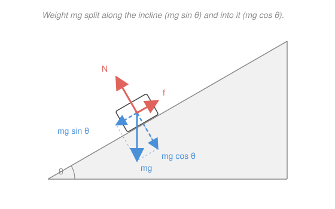

# Newtonian Mechanics · Lesson 1.3: Applying Newton's laws

> ⏱ ~15 min · Module 1: Kinematics and Newton's laws · Builds on: [1.2 Newton's laws and free-body diagrams](01-02-newtons-laws.md) · Unlocks: Module 2 (energy and momentum)

## Why this matters

Lesson 1.2 gave you the machine — draw the forces, write $\sum\mathbf{F} = m\mathbf{a}$. This lesson is where it earns its keep: ramps, pulleys, dragged crates, cars on curves, a pendulum swept into a cone. Every one is the *same* three-step move (choose axes, write Newton's second law per body, solve the system), and the entire art is **choosing coordinates so the algebra collapses**. Get that habit and the rest of mechanics stops being a wall of special cases.

## The idea

Two tricks do almost all the work.

**Tilt your axes to match the motion.** A block on a ramp doesn't move horizontally or vertically — it slides *along the ramp*. So don't use horizontal/vertical axes; use one axis **along the slope** and one **perpendicular to it**. Then the motion is purely along one axis (easy) and the surface holds the block on the other (zero acceleration there). The only price is that gravity, which pointed conveniently straight down, now has to be split into two slanted pieces — one sliding you down the slope, one pressing you into it.

**Centripetal is a direction, not a force.** When something moves in a circle at steady speed, it is still accelerating — its velocity keeps *turning*, and turning points the acceleration straight at the center, with size $v^2/r$. So "centripetal force" is not a new force to add to your diagram; it's just the name for whatever real forces (tension, friction, gravity) happen to be pointing inward. You draw the real forces as always, then set their inward sum equal to $mv^2/r$.

Everything else — friction, tension, connected masses — is bookkeeping on top of "one free-body diagram per object, one Newton's law per axis."

## The formal version

Throughout, $m$ = mass (kg), $g = 9.8\ \mathrm{m/s^2}$ = gravitational field strength, $\theta$ = incline angle, and forces are in newtons (N).

**Inclined plane.** With axes along and perpendicular to a slope of angle $\theta$, the weight $mg$ (straight down) splits into

$$mg\sin\theta \ \text{(down the slope)}, \qquad mg\cos\theta \ \text{(into the surface)}.$$

The surface pushes back with a **normal force** $N$ perpendicular to itself. With no acceleration off the surface, the perpendicular axis gives $N = mg\cos\theta$. *In words: on a ramp, gravity's pull splits into a sliding part and a pressing part, and the normal force only has to cancel the pressing part — so it's less than $mg$.*

**Friction** acts along the surface, opposing relative sliding:

$$f_k = \mu_k N \ \text{(kinetic, while sliding)}, \qquad f_s \le \mu_s N \ \text{(static, before it slips)},$$

where $\mu_k, \mu_s$ are the (dimensionless) kinetic and static coefficients. *In words: once it's sliding, friction is a fixed $\mu_k N$ against the motion; before it slides, static friction supplies exactly enough to hold still — anything up to its ceiling $\mu_s N$.*

**Tension.** An ideal (massless) string over an ideal (massless, frictionless) pulley has **one tension $T$ throughout**, and the pulley just redirects it. *In words: the string pulls each end with the same $T$; the pulley only changes its direction.*

**Connected masses.** Bodies linked by an inextensible string share **one acceleration magnitude** $a$. Draw a separate free-body diagram for each body, write $\sum\mathbf{F}=m\mathbf{a}$ for each, and solve the equations together — $T$ and $a$ are the unknowns. *In words: one string, one $a$; one diagram per body; solve the simultaneous equations.*

**Uniform circular motion.** Steady speed $v$ around radius $r$ gives a **centripetal acceleration**

$$a_c = \frac{v^2}{r} \quad \text{toward the center}, \qquad \text{so} \qquad \sum F_{\text{toward center}} = \frac{mv^2}{r}.$$

*In words: pick "toward the center" as your axis and set the net inward force equal to $mv^2/r$ — the real forces provide it; there is no extra outward force.*

## Picture

The whole method in one image: choose axes along/perpendicular to the slope, resolve $mg$ into $mg\sin\theta$ and $mg\cos\theta$, and read off $N = mg\cos\theta$ perpendicular, $mg\sin\theta$ versus $f$ along.

## Worked examples

**Example 1 (connected masses on an incline — the module's boss setup, frictionless first).** A block $m_1 = 2\ \mathrm{kg}$ rests on a frictionless $\theta = 30^\circ$ incline, tied by a string over a pulley at the top to a hanging block $m_2 = 3\ \mathrm{kg}$. Find the acceleration and the tension.

Guess $m_2$ wins, so $m_1$ slides *up* the incline and $m_2$ descends. One FBD each, one shared $a$.

- $m_1$, along the incline (up-slope positive): the string pulls up-slope with $T$, gravity pulls down-slope with $m_1 g\sin\theta$:
$$T - m_1 g\sin\theta = m_1 a.$$
- $m_2$, vertical (down positive, since it descends): gravity $m_2 g$ down, string $T$ up:
$$m_2 g - T = m_2 a.$$

Add the two (the $T$'s cancel — that's why the system method works):

$$m_2 g - m_1 g\sin\theta = (m_1 + m_2)\,a \;\Rightarrow\; a = \frac{g(m_2 - m_1\sin\theta)}{m_1 + m_2} = \frac{9.8\,(3 - 2\cdot 0.5)}{5} = 3.92\ \mathrm{m/s^2}.$$

Back-substitute: $T = m_2(g - a) = 3(9.8 - 3.92) = 17.6\ \mathrm{N}$ (check with $m_1$: $T = m_1(a + g\sin\theta) = 2(3.92 + 4.9) = 17.6\ \mathrm{N}$ ✓). *Add friction on the incline and this is exactly Boss problem 1 — Problem 2 below adds it.*

**Example 2 (uniform circular motion — the application).** A car of mass $m$ rounds a flat, unbanked curve of radius $r = 50\ \mathrm{m}$; the tire–road static coefficient is $\mu_s = 0.80$. What's the fastest it can go without skidding?

The only horizontal force is **static friction**, and here it points *toward the center* — it's the sole supplier of the centripetal acceleration. Setting the inward force to $mv^2/r$:

$$f_s = \frac{mv^2}{r}, \qquad f_s \le \mu_s N = \mu_s mg.$$

The car is on the verge of skidding when friction hits its ceiling, $f_s = \mu_s mg$:

$$\frac{mv_{\max}^2}{r} = \mu_s mg \;\Rightarrow\; v_{\max} = \sqrt{\mu_s g r} = \sqrt{0.80\cdot 9.8\cdot 50} = 19.8\ \mathrm{m/s} \approx 71\ \mathrm{km/h}.$$

The mass cancels — a loaded truck and an empty one skid at the same speed. More grip or a wider curve lets you go faster; both live under the square root, so quadrupling the radius only doubles the safe speed.

## Watch out

- You might think the normal force always equals $mg$. It doesn't: on an incline $N = mg\cos\theta < mg$, in an accelerating elevator $N = m(g\pm a)$, and a vertical push changes it too. $N$ is whatever the surface must supply to stop penetration — solve for it, never assume it.
- You might think friction is always $\mu N$. Only **kinetic** friction is. **Static** friction is a range, $f_s \le \mu_s N$: it supplies exactly what's needed to prevent sliding, up to a ceiling, then the object breaks loose. Plugging $\mu_s N$ in before you've checked that it's slipping is the classic error.
- You might think you should add a centrifugal or "centripetal" force pointing outward on your FBD. Never, in an inertial frame. Draw only real forces (tension, gravity, normal, friction); "centripetal" just labels their inward *sum*, which equals $mv^2/r$.

## One-liner

> Tilt the axes to the motion, write $\mathbf{F}=m\mathbf{a}$ on each body, and treat $N$, $f$, and $T$ as unknowns you solve for — "centripetal" is a direction the net force points, not a force you add.

## Problems

**P1 (🟢)** A block is released from rest on a **frictionless** $30^\circ$ incline. Find its acceleration down the slope. (Does the answer depend on the block's mass?)

**P2 (🟡)** A $4\ \mathrm{kg}$ block is given a downhill shove on a $25^\circ$ incline with kinetic friction coefficient $\mu_k = 0.30$. While it slides down, find its acceleration. (Watch the direction of friction.)

**P3 (🔴, optional)** A **conical pendulum**: a bob on a string of length $L = 1.5\ \mathrm{m}$ swings in a horizontal circle so the string makes a constant angle $\phi = 30^\circ$ with the vertical. Find the bob's speed $v$ and the period $P$ of one revolution. (Two axes: vertical and horizontal-toward-center. The radius of the circle is $r = L\sin\phi$.)

Solutions

**P1** Axes along/perpendicular to the slope. Perpendicular: $N = mg\cos\theta$ (no motion off the surface). Along the slope, the only force is $mg\sin\theta$:

$$mg\sin\theta = ma \;\Rightarrow\; a = g\sin\theta = 9.8\sin 30^\circ = 9.8\cdot 0.5 = 4.9\ \mathrm{m/s^2}.$$

The mass cancels — acceleration is independent of $m$.

*Sanity check:* $\theta\to 0$ (flat) gives $a\to 0$, and $\theta\to 90^\circ$ (vertical drop) gives $a\to g$ — free fall. Both correct, so the $\sin\theta$ is in the right place. ✓

**P2** It's already sliding, so kinetic friction $f_k = \mu_k N$ acts *up* the slope (opposing the downhill motion). Perpendicular axis: $N = mg\cos\theta$. Along the slope (down-slope positive):

$$mg\sin\theta - \mu_k mg\cos\theta = ma \;\Rightarrow\; a = g(\sin\theta - \mu_k\cos\theta).$$

$$a = 9.8\,(\sin 25^\circ - 0.30\cos 25^\circ) = 9.8\,(0.4226 - 0.30\cdot 0.9063) = 9.8\cdot 0.1507 = 1.48\ \mathrm{m/s^2} \ \text{down the slope}.$$

The $4\ \mathrm{kg}$ never entered — mass cancels again.

*Sanity check:* set $\mu_k = 0$ and you recover $g\sin 25^\circ = 4.14\ \mathrm{m/s^2}$, the frictionless value from P1's formula; friction shaves it down, as it must. And since $\sin\theta > \mu_k\cos\theta$ (i.e. $\tan 25^\circ = 0.47 > 0.30$), $a>0$ — it really does keep speeding up downhill rather than decelerating. ✓

**P3** Let $T$ be the string tension. Two axes.

- Vertical (no vertical motion): $T\cos\phi = mg$.
- Horizontal, toward the center: the inward component of tension supplies the centripetal force, with $r = L\sin\phi$:
$$T\sin\phi = \frac{mv^2}{r} = m\,\omega^2 r = m\,\omega^2 L\sin\phi \;\Rightarrow\; T = m\,\omega^2 L.$$

Substitute $T = m\omega^2 L$ into the vertical equation: $m\omega^2 L\cos\phi = mg$, so

$$\omega^2 = \frac{g}{L\cos\phi} = \frac{9.8}{1.5\cos 30^\circ} = \frac{9.8}{1.299} = 7.54\ \mathrm{s^{-2}} \;\Rightarrow\; \omega = 2.75\ \mathrm{rad/s}.$$

Then $r = L\sin\phi = 1.5\cdot 0.5 = 0.75\ \mathrm{m}$, so

$$v = \omega r = 2.75\cdot 0.75 = 2.06\ \mathrm{m/s}, \qquad P = \frac{2\pi}{\omega} = 2\pi\sqrt{\frac{L\cos\phi}{g}} = 2.29\ \mathrm{s}.$$

*Sanity check:* as $\phi\to 0$ the cone flattens to a tiny swing and $P\to 2\pi\sqrt{L/g}$ — exactly the small-angle pendulum period you'll meet in [3.1 Simple harmonic motion](03-01-simple-harmonic-motion.md). Units: $\sqrt{\mathrm{m}/(\mathrm{m/s^2})} = \sqrt{\mathrm{s^2}} = \mathrm{s}$ ✓. As $\phi\to 90^\circ$, $\cos\phi\to 0$ and $P\to 0$ — you'd need to whirl infinitely fast to hold the string horizontal, which matches intuition (tension could never provide the needed upward pull). ✓

## Flashback

**From Lesson 1.2 (Newton's laws and free-body diagrams):** A $70\ \mathrm{kg}$ person stands on a bathroom scale inside an elevator that accelerates **upward** at $2.0\ \mathrm{m/s^2}$. The scale reads the normal force it pushes up with. What does it read, and how does that compare to their true weight?

Solution

One body, one FBD: gravity $mg$ down, normal force $N$ (the scale reading) up. Take up as positive; the acceleration is $a = +2.0\ \mathrm{m/s^2}$:

$$N - mg = ma \;\Rightarrow\; N = m(g + a) = 70\,(9.8 + 2.0) = 70\cdot 11.8 = 826\ \mathrm{N}.$$

Their true weight is $mg = 70\cdot 9.8 = 686\ \mathrm{N}$, so the scale over-reads by $140\ \mathrm{N}$ — you feel heavier while accelerating upward.

*Sanity check:* set $a = 0$ and $N = mg = 686\ \mathrm{N}$ (scale reads true weight, as in a still elevator); set $a = -g$ (free fall) and $N = 0$ (weightless). Both limits are right, so the sign of $a$ is doing the correct work. ✓

## Connections

- **Backward:** every setup here is [1.2](01-02-newtons-laws.md)'s "draw the forces, write $\sum\mathbf{F}=m\mathbf{a}$" — this lesson only adds the coordinate-choosing craft (tilt to the slope, aim at the center) and three force models ($N$, friction, tension).
- **Forward:** [2.1 Work and kinetic energy](02-01-work-energy.md) will re-solve inclines *without* resolving forces — energy sidesteps the geometry. The circular-motion axis reappears as the whole framework of [4.1 Rotational dynamics](04-01-rotational-dynamics.md) and powers circular orbits in [5.1 Gravitation and Kepler's laws](05-01-gravitation-kepler.md); the conical pendulum's period is a first taste of [3.1 Simple harmonic motion](03-01-simple-harmonic-motion.md).
- **Sideways:** the connected-mass "one string, one acceleration, solve the system" move is the physical cousin of a *constraint* — the same idea that, formalized as a constraint equation, becomes the Lagrange multiplier machinery in `analytical-mechanics` and constrained optimization in `micro-refresher`.
