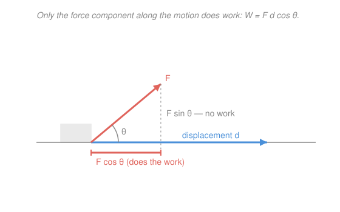

# Newtonian Mechanics · Lesson 2.1: Work and kinetic energy

> ⏱ ~15 min · Module 2: Energy and momentum · Builds on: [1.3 Applying Newton's laws](01-03-applying-newtons-laws.md) · Unlocks: 2.2 (potential energy and conservation)

## Why this matters

$\mathbf F = m\mathbf a$ tells you the motion at every instant — but tracking a force moment by moment and integrating the trajectory is often brutal. Energy is the shortcut: tally the **work** poured in, read the **speed** out, and skip the timeline entirely. Braking distance, roller-coaster speeds, the escape velocity you met in [calc 2.3](../../calc-refresher/lessons/02-03-improper-integrals-and-models.md) — all fall out of one scalar equation. And it costs nothing new: the whole thing is $\mathbf F = m\mathbf a$ integrated over the path.

## The idea

Work is **force paid over distance**. Pushing a stalled car, what wears you out isn't the force alone or the distance alone — it's force *times* distance, the expenditure. That expenditure doesn't evaporate: it becomes the car's motion. Work is the currency you spend; **kinetic energy** is the motion you buy.

Two refinements make it exact. First, only the part of your push *aligned with the motion* counts — shove sideways on the car and it doesn't speed up at all. Second, if the force changes as you go (a spring pushes back harder the more you stretch it), you can't just multiply once; you add up force-times-tiny-distance along the way — an integral, exactly the accumulation move from [calc 2.1](../../calc-refresher/lessons/02-01-integral-as-accumulation.md).

## The formal version

**Work, constant force.** For a constant force $\mathbf F$ through a straight displacement $\mathbf d$,

$$W = \mathbf F \cdot \mathbf d = Fd\cos\theta.$$

Here $F$ is the force magnitude (newtons, N), $d$ the distance moved (meters, m), $\theta$ the angle between force and displacement, and $W$ the work in **joules** ($1\ \mathrm{J} = 1\ \mathrm{N\cdot m}$). *In words:* only the component along the motion, $F\cos\theta$, does work — a perpendicular force ($\theta = 90^\circ$, $\cos\theta = 0$) does none.

**Work, variable force / curved path.** In general work is the line integral

$$W = \int \mathbf F \cdot d\mathbf r,$$

which in 1D collapses to $W = \int F(x)\,dx$ — the **area under the force-vs-position curve**. *In words:* slice the path into steps too short for $F$ to change, multiply force by step, and sum.

**Kinetic energy.** $K = \tfrac12 m v^2$, in joules, with mass $m$ (kg) and speed $v$ (m/s). *In words:* the energy stored in motion — quadratic in speed, so doubling $v$ quadruples $K$.

**Work–energy theorem.** The *net* work from all forces equals the change in kinetic energy:

$$W_{\text{net}} = \Delta K = \tfrac12 m v_f^2 - \tfrac12 m v_i^2.$$

*In words:* net work in, speed change out. It's just $\mathbf F = m\mathbf a$ integrated over the path. Derivation (1D): using the chain-rule identity $a\,dx = v\,dv$ (since $a = \frac{dv}{dt} = \frac{dv}{dx}\frac{dx}{dt} = v\frac{dv}{dx}$),

$$W_{\text{net}} = \int F\,dx = \int m a\,dx = \int_{v_i}^{v_f} m v\,dv = \tfrac12 m v_f^2 - \tfrac12 m v_i^2. $$

**Power.** The *rate* of doing work,

$$P = \frac{dW}{dt} = \mathbf F \cdot \mathbf v,$$

in **watts** ($1\ \mathrm{W} = 1\ \mathrm{J/s}$). *In words:* force times the speed it's applied at. Concretely, a $100\ \mathrm{kW}$ engine pushing a car at a steady $25\ \mathrm{m/s}$ delivers a driving force of $P/v = 4000\ \mathrm{N}$.

## Picture

## Worked examples

**Example 1 (mechanical — the definition in action).** A rope pulls a sled with $F = 20\ \mathrm{N}$ at $\theta = 37^\circ$ above the horizontal, over a horizontal displacement $d = 3\ \mathrm{m}$. The work is

$$W = Fd\cos\theta = 20 \times 3 \times \cos 37^\circ = 60 \times 0.80 = 48\ \mathrm{J}.$$

The vertical part of the pull, $F\sin 37^\circ$, is perpendicular to the motion and contributes nothing — it only lightens the sled on the ground.

**Example 2 (why you'd care — the theorem shortcuts a force).** A $1000\ \mathrm{kg}$ car at $v_i = 20\ \mathrm{m/s}$ brakes to a stop. Its kinetic energy is $K = \tfrac12(1000)(20)^2 = 2.0\times 10^5\ \mathrm{J}$. The brakes must remove all of it, so $W_{\text{brake}} = \Delta K = 0 - 2.0\times10^5 = -2.0\times 10^5\ \mathrm{J}$ (negative — force opposes motion). If they apply a constant force over stopping distance $d$, then $Fd = 2.0\times10^5\ \mathrm{J}$; a $40\ \mathrm{m}$ stop needs $F = 5000\ \mathrm{N}$. Notice we never touched time or acceleration. And because $K \propto v^2$, doubling the speed *quadruples* the stopping distance — the reason speed limits bite.

## Watch out

- You might think all of a force does work. Only the component **along the displacement** does: carrying a suitcase horizontally, the upward force you exert does *zero* work, because it's perpendicular to the motion.
- You might think work is always positive. Its **sign** is the sign of $\cos\theta$: friction and braking ($\theta = 180^\circ$) do *negative* work, draining kinetic energy. In the work–energy theorem you must add works *with their signs*.
- You might think a changing force lets you use $W = Fd$ with an "average". For a spring, $F$ isn't constant, so you integrate: $\int_0^x kx'\,dx' = \tfrac12 kx^2$, not $kx\cdot x$. (It happens to equal force-at-the-average-stretch here only because $F$ is linear.)

## One-liner

> Work is force paid along the motion, $W=\int\mathbf F\cdot d\mathbf r$; the net of it becomes kinetic energy, $W_{\text{net}}=\Delta K$ — the whole of $\mathbf F=m\mathbf a$, integrated over the path.

## Problems

**P1 (🟢)** A $10\ \mathrm{N}$ force drags a box $5\ \mathrm{m}$ across a floor, directed at $60^\circ$ to the direction of motion. (a) How much work does the force do? (b) If this is the *net* work on the box and it starts from rest with mass $2\ \mathrm{kg}$, what speed does it reach?

**P2 (🟡)** A spring obeys Hooke's law $F(x) = kx$ with $k = 200\ \mathrm{N/m}$ ($x$ = stretch from natural length). How much work must you do to stretch it from $0$ to $x = 0.10\ \mathrm{m}$? (The force varies — set up the integral.)

**P3 (🔴)** A $2\ \mathrm{kg}$ block is released from rest and slides $L = 4\ \mathrm{m}$ down a $30^\circ$ incline with kinetic friction $\mu_k = 0.20$. Use the work–energy theorem — gravity does positive work, friction negative — to find its speed at the bottom. Take $g = 9.8\ \mathrm{m/s^2}$.

Solutions

**P1** (a) $W = Fd\cos\theta = 10 \times 5 \times \cos 60^\circ = 50 \times 0.5 = 25\ \mathrm{J}$.
(b) Work–energy with $v_i = 0$: $W_{\text{net}} = \tfrac12 m v_f^2$, so $25 = \tfrac12(2)v_f^2 = v_f^2$, giving $v_f = 5\ \mathrm{m/s}$.
*Check:* units $\mathrm{N\cdot m = J}$ ✓; $\tfrac12(2)(5)^2 = 25\ \mathrm{J}$ matches the work. ✓

**P2** The force isn't constant, so integrate it over the stretch — the area under $F(x)=kx$:

$$W = \int_0^{0.10} kx\,dx = \tfrac12 k x^2 \Big|_0^{0.10} = \tfrac12 (200)(0.10)^2 = \tfrac12(200)(0.01) = 1\ \mathrm{J}.$$

*Check:* units $\mathrm{(N/m)\cdot m^2 = N\cdot m = J}$ ✓; the triangle under the line has area $\tfrac12 \times \text{base} \times \text{height} = \tfrac12(0.10)(20) = 1\ \mathrm{J}$, since $F(0.10) = 20\ \mathrm{N}$. ✓

**P3** Two forces do work over the $4\ \mathrm{m}$ slide.
Gravity: its along-incline component is $mg\sin\theta$, doing positive work
$$W_g = mg\sin\theta \cdot L = 2(9.8)(0.5)(4) = 39.2\ \mathrm{J}.$$
Friction: the normal force is $N = mg\cos\theta = 2(9.8)(0.866) = 16.97\ \mathrm{N}$, so $f = \mu_k N = 0.20(16.97) = 3.39\ \mathrm{N}$, opposing motion:
$$W_f = -fL = -3.39(4) = -13.6\ \mathrm{J}.$$
Net work (add with signs): $W_{\text{net}} = 39.2 - 13.6 = 25.6\ \mathrm{J}$. From rest, $W_{\text{net}} = \tfrac12 m v^2$:
$$25.6 = \tfrac12(2)v^2 = v^2 \;\Rightarrow\; v = \sqrt{25.6} \approx 5.1\ \mathrm{m/s}.$$
*Check:* signs are right — gravity feeds energy in, friction drains it, and $W_g > |W_f|$ so the block speeds up (positive $v$). A frictionless slide would give $v=\sqrt{2\times39.2/2}=\sqrt{39.2}\approx6.3\ \mathrm{m/s}$, faster, as expected. ✓

## Flashback

**From Lesson 1.3 (Applying Newton's laws):** A $5\ \mathrm{kg}$ block rests on a $30^\circ$ incline with $\mu_s = 0.50$ and $\mu_k = 0.40$. Does it start to slide? If so, find its acceleration down the incline. ($g = 9.8\ \mathrm{m/s^2}$.)

Solution

*Will it slide?* Compare the driving component of gravity to the maximum static friction. It slides iff $mg\sin\theta > \mu_s\, mg\cos\theta$, i.e. $\tan\theta > \mu_s$. Here $\tan 30^\circ = 0.577 > 0.50$ — **yes, it slides**.

*Acceleration:* once moving, use kinetic friction. Along the incline, $ma = mg\sin\theta - \mu_k mg\cos\theta$, so
$$a = g(\sin\theta - \mu_k\cos\theta) = 9.8\big(0.5 - 0.40 \times 0.866\big) = 9.8(0.5 - 0.346) = 1.5\ \mathrm{m/s^2}.$$

*Check:* $a > 0$ (consistent with "it slides"), and dropping $\mu_k$ to $0$ would give $g\sin30^\circ = 4.9\ \mathrm{m/s^2}$, the frictionless value — friction correctly shaves it down. ✓ (This is pure $\mathbf F = m\mathbf a$; Problem 3 above re-solves this same geometry with *energy* instead — two roads to the incline.)

## Connections

- **Backward:** the work integral $\int F\,dx$ is [calc 2.1](../../calc-refresher/lessons/02-01-integral-as-accumulation.md)'s accumulation applied to force, and the forces you learned to isolate in [1.3](01-03-applying-newtons-laws.md) are exactly the ones that now do (signed) work.
- **Forward:** [2.2](02-02-potential-energy-conservation.md) notices that some forces (gravity, springs) *store* their work as potential energy you can withdraw later — turning the work–energy theorem into energy *conservation*, the sharpest shortcut in the course.
- **Sideways (calc):** the escape-velocity result in [calc 2.3](../../calc-refresher/lessons/02-03-improper-integrals-and-models.md) was this exact idea — a force integrated over distance is work — with an infinite upper limit; and $W=\int\mathbf F\cdot d\mathbf r$ is a *line integral*, the object multivariable calculus and the analytical-mechanics track build on.
