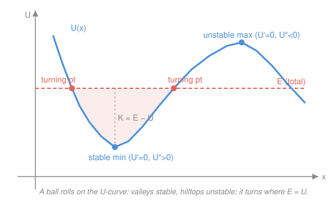

# Newtonian Mechanics · Lesson 2.2: Potential energy and conservation

> ⏱ ~15 min · Module 2: Energy and momentum · Builds on: [2.1 Work and kinetic energy](02-01-work-energy.md) · Unlocks: 2.3 (momentum and collisions)

## Why this matters

In [2.1](02-01-work-energy.md) you computed work as a force integral and cashed it into kinetic energy. But for gravity or a spring you shouldn't have to integrate every time — the work only depends on where you start and stop, so you can bank it as a number attached to *position*. That number is **potential energy**, and once you have it you can answer "how fast is it going *there*?" without ever touching $\mathbf F = m\mathbf a$. The payoff is a single conserved quantity and a landscape you can *read*: the whole qualitative story of a motion — where it speeds up, where it stops, whether it's stable — is visible in one curve.

## The idea

Energy sloshes back and forth between two forms. Lift a ball: you spend work, and it's not lost — it's stored, ready to be handed back as speed when the ball falls. Kinetic energy $K$ is the currency of *motion*; potential energy $U$ is the same wealth *stored in position*. Their sum stays fixed, so every joule the ball gains in speed is a joule it gave up in height.

This only works because gravity is a **conservative** force: the work it does getting from A to B doesn't care about the path — straight down, or a loopy detour, same answer. Path-independence is exactly the license to define a bank balance $U$ that depends on position alone. (Friction fails this test: drag a crate in a circle back to start and friction has stolen energy every inch — there's no consistent "friction potential" to point to.)

The picture to hold: $U(x)$ is a **landscape**, and the object is a ball rolling on it. Valleys are where it wants to rest, hills are what it must climb, and it can only reach as high as its energy budget allows — then it rolls back.

## The formal version

**Conservative force ⟹ a potential exists.** A force is conservative when the work it does between two points is path-independent (equivalently, zero around any closed loop). Then there is a scalar **potential energy** $U$ (units: joules, J) with

$$\mathbf F = -\nabla U, \qquad \text{in 1D}\quad F = -\frac{dU}{dx}.$$

In words: the force points *downhill* on the $U$-landscape, and its strength is the steepness of the slope. The minus sign is the whole physics — things are pushed toward *lower* potential energy.

Two you must know cold:

$$U_{\text{grav}} = mgh, \qquad U_{\text{spring}} = \tfrac{1}{2}kx^2,$$

where $m$ is mass (kg), $g = 9.8\ \mathrm{m/s^2}$, $h$ is height (m), $k$ is the spring constant (N/m), and $x$ is displacement from the spring's natural length (m). Check the signs: $-\frac{d}{dh}(mgh) = -mg$ (gravity pulls down) and $-\frac{d}{dx}(\tfrac12 kx^2) = -kx$ (Hooke's law, restoring). 

**Conservation of mechanical energy.** Define total mechanical energy $E = K + U$ with $K = \tfrac12 mv^2$ (J) and $v$ the speed (m/s). If *only conservative forces* do work,

$$E = K + U = \text{constant}.$$

In words: trade freely between $K$ and $U$, but the sum never changes — so $K_1 + U_1 = K_2 + U_2$ links any two instants without solving for the motion in between.

**Non-conservative forces leak.** If friction, drag, or a push is also acting,

$$\Delta(K + U) = W_{\text{nc}},$$

the work done by the non-conservative forces. In words: mechanical energy isn't destroyed, it's *converted* — friction drains it into heat, so $W_{\text{nc}} < 0$ and $E$ drops.

**Reading the curve $U(x)$.** Because $F = -dU/dx$:

- **Equilibria** are where $F = 0$, i.e. $U'(x) = 0$ — the flat spots. A **minimum** ($U'' > 0$) is **stable** (nudge it and the slope pushes it back); a **maximum** ($U'' < 0$) is **unstable** (nudge it and the slope shoves it away). This *is* the calculus second-derivative test — equilibria are critical points, stability is concavity ([calc 1.4](../../calc-refresher/lessons/01-04-optimization.md)).
- **Turning points** are where the energy line meets the curve: $E = U(x)$, so $K = 0$ — the object momentarily stops and reverses. Between two turning points it's trapped, oscillating.

## Picture

The gap between the energy line $E$ and the curve $U$ is the kinetic energy $K$ — widest at the valley floor (fastest there), pinched to zero at the turning points (stopped there). The ball shown is trapped in the left well: its energy sits below the barrier top, so it can't get over the hill.

## Worked examples

**Example 1 (mechanical — falling ball).** A ball of mass $m$ is released from rest at height $h$. Speed at the ground? At the top $K_1 = 0$, $U_1 = mgh$; at the bottom $U_2 = 0$, $K_2 = \tfrac12 mv^2$. Conservation:

$$0 + mgh = \tfrac12 mv^2 + 0 \;\Longrightarrow\; v = \sqrt{2gh}.$$

The mass cancels — every object falls to the same speed from a given height. Notice this reproduces the kinematics result $v^2 = 2gh$ without ever mentioning time or acceleration: that's the shortcut energy buys you.

**Example 2 (why you'd care — a spring launcher onto a ramp).** A spring of constant $k$ is compressed a distance $d$ and released, launching a block of mass $m$ up a frictionless ramp. How high does it rise? All the stored spring energy becomes gravitational energy at the top (where the block momentarily stops, $K = 0$):

$$\tfrac12 k d^2 = mgh \;\Longrightarrow\; h = \frac{kd^2}{2mg}.$$

Three energy *forms*, one bank balance: spring $\to$ kinetic $\to$ gravitational, and we skipped the kinetic middleman entirely because only the endpoints matter. The ramp angle never entered — energy doesn't care about the path, only the height climbed. (Add friction and you'd subtract $W_{\text{nc}} = f \cdot \ell$ over the ramp length $\ell$; the block wouldn't reach as high.)

## Watch out

- You might think potential energy has an absolute value, but only *differences* matter — you pick where $U = 0$ (the floor, the tabletop, the spring's natural length). Choose the zero to kill a term, then be consistent for both instants.
- You might drop the minus sign in $F = -dU/dx$. It's not decoration: force points toward *lower* $U$. A positive slope (uphill to the right) means a force pointing *left*. Get it wrong and stable/unstable flip.
- You might think a turning point is an equilibrium — it isn't. At a turning point $K = 0$ but the force is generally *nonzero* (the slope isn't flat), so the object doesn't stay: it reverses. Equilibrium needs $U' = 0$; turning needs $E = U$. Different conditions.

## One-liner

> Mechanical energy $K + U$ is a constant you can spend on speed or bank in position — and the $U$-curve is a landscape whose valleys are stable rest, hills are barriers, and $E = U$ crossings are where motion turns around.

## Problems

**P1 (🟢)** A 2 kg ball is dropped from rest at a height of 5 m. Using energy conservation, find its speed just before it hits the ground. Does the answer depend on the 2 kg?

**P2 (🟡)** A spring with $k = 800\ \mathrm{N/m}$ is compressed by $d = 0.10$ m and used to launch a block of mass $m = 0.50$ kg up a frictionless ramp. Find the maximum vertical height the block reaches.

**P3 (🔴, optional)** A particle moves in one dimension with potential energy $U(x) = x^4 - 4x^2$ (joules, $x$ in meters). (a) Find all equilibria and classify each as stable or unstable using $U'$ and $U''$. (b) A particle sits in the right-hand well with total energy $E = -3$ J. Find its two turning points. (Connect your $U'=0$ / $U''$ reasoning to the second-derivative test from [calc 1.4](../../calc-refresher/lessons/01-04-optimization.md).)

Solutions

**P1** Top: $K_1 = 0$, $U_1 = mgh$. Ground (take $U = 0$ there): $U_2 = 0$, $K_2 = \tfrac12 mv^2$. Conservation:

$$mgh = \tfrac12 mv^2 \;\Longrightarrow\; v = \sqrt{2gh} = \sqrt{2(9.8)(5)} = \sqrt{98} \approx 9.9\ \mathrm{m/s}.$$

The mass cancels, so the answer does **not** depend on the 2 kg. Check: units $\sqrt{(\mathrm{m/s^2})(\mathrm{m})} = \sqrt{\mathrm{m^2/s^2}} = \mathrm{m/s}$. ✓ And energy balance: $U_1 = (2)(9.8)(5) = 98$ J $= K_2 = \tfrac12(2)(9.9)^2 \approx 98$ J. ✓

**P2** All spring energy converts to gravitational energy at the top, where $K = 0$:

$$\tfrac12 k d^2 = mgh \;\Longrightarrow\; h = \frac{kd^2}{2mg} = \frac{(800)(0.10)^2}{2(0.50)(9.8)} = \frac{8.0}{9.8} \approx 0.82\ \mathrm{m}.$$

Check: stored energy $\tfrac12(800)(0.10)^2 = 4.0$ J; gravitational energy at top $mgh = (0.50)(9.8)(0.82) \approx 4.0$ J. Balances. ✓ Units: $\frac{(\mathrm{N/m})(\mathrm m^2)}{(\mathrm{kg})(\mathrm{m/s^2})} = \frac{\mathrm{N\,m}}{\mathrm N} = \mathrm m$. ✓

**P3** (a) $U'(x) = 4x^3 - 8x = 4x(x^2 - 2) = 0 \Rightarrow x = 0,\ \pm\sqrt{2}$. Second derivative $U''(x) = 12x^2 - 8$:
- $x = 0$: $U'' = -8 < 0$ → **unstable maximum**, $U(0) = 0$.
- $x = \pm\sqrt{2}$: $U'' = 12(2) - 8 = 16 > 0$ → **stable minima**, $U(\pm\sqrt2) = 4 - 8 = -4$ J.

This is precisely the second-derivative test: critical points where $U' = 0$, classified by the sign of $U''$ (concave up = valley = stable). A symmetric double well with a barrier at the origin.

(b) Turning points solve $E = U(x)$: $x^4 - 4x^2 = -3$. Let $u = x^2$: $u^2 - 4u + 3 = 0 \Rightarrow (u-1)(u-3) = 0 \Rightarrow u = 1$ or $u = 3$, so $x = \pm 1, \pm\sqrt{3}$. A particle in the **right well** (around $x = +\sqrt2 \approx 1.41$) oscillates between the two positive roots:

$$x = 1\ \mathrm{m} \quad\text{and}\quad x = \sqrt{3} \approx 1.73\ \mathrm{m}.$$

Check: $U(1) = 1 - 4 = -3$ ✓ and $U(\sqrt3) = 9 - 12 = -3$ ✓ — both equal $E = -3$ J, so $K = 0$ at each, exactly a turning point. Since $E = -3 < 0 = U(0)$, the particle can't clear the central barrier — it stays trapped on the right, just as the curve predicts. ✓

## Flashback

**From Lesson 2.1 (Work and kinetic energy):** A 3.0 kg box, initially at rest on a horizontal floor, is pushed by a constant horizontal force of 20 N over a distance of 5.0 m. Friction opposes the motion with a constant force of 8.0 N. Use the work–energy theorem to find the box's final speed.

Solution

The work–energy theorem says $W_{\text{net}} = \Delta K$. Net horizontal force is applied minus friction, $20 - 8 = 12$ N, over $d = 5.0$ m:

$$W_{\text{net}} = (20 - 8)(5.0) = 60\ \mathrm{J} = \tfrac12 m v^2 - 0.$$

So $v = \sqrt{\dfrac{2 W_{\text{net}}}{m}} = \sqrt{\dfrac{2(60)}{3.0}} = \sqrt{40} \approx 6.3\ \mathrm{m/s}.$

Check: $\tfrac12(3.0)(6.3)^2 \approx 60$ J, matching the net work. ✓ (Note the friction term $-8 \times 5 = -40$ J is exactly the $W_{\text{nc}}$ that would drain mechanical energy in this lesson's ledger — the two viewpoints agree.)

## Connections

- **Backward:** potential energy is [2.1](02-01-work-energy.md)'s work integral banked as a function of position — legal only because conservative forces are path-independent. The turning-point and stability analysis is [calc 1.4](../../calc-refresher/lessons/01-04-optimization.md)'s critical points and second-derivative test wearing a physics costume.
- **Forward:** [2.3](02-03-momentum-collisions.md) adds the *other* conserved quantity, momentum; the module's ballistic-pendulum boss problem needs both — momentum through the collision, then energy ($K \to U_{\text{grav}}$) through the swing. In [3.1](03-01-simple-harmonic-motion.md) the spring potential $\tfrac12 kx^2$ becomes the engine of simple harmonic motion, and [5.2](05-02-orbits-effective-potential.md) reads orbits off an *effective* potential curve — the same landscape trick with an added angular-momentum term.
- **Sideways (calc/econ):** "force is minus the gradient of a potential" is the same move as a firm climbing a profit surface or a system settling into a potential well — equilibrium at $\nabla(\text{something}) = 0$, stability from concavity, appears anywhere there's an optimization landscape.
