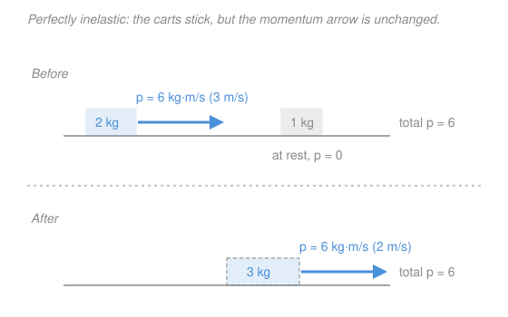

# Newtonian Mechanics · Lesson 2.3: Momentum, impulse, and collisions

> ⏱ ~15 min · Module 2: Energy and momentum · Builds on: [2.2 Potential energy and conservation](02-02-potential-energy-conservation.md), [1.2 Newton's laws and free-body diagrams](01-02-newtons-laws.md) · Unlocks: Module 3 (oscillations)

## Why this matters

Two cars crash, a bullet buries itself in a block, a rocket spits out gas and lurches forward. In every one of these the forces are enormous, messy, and last only a heartbeat — writing down $\mathbf F = m\mathbf a$ moment by moment is hopeless. Momentum is the shortcut: a single bookkeeping quantity that the whole system must conserve, no matter how violent the interaction inside. Where [2.2](02-02-potential-energy-conservation.md) gave you *energy* as a conserved scalar, this lesson gives you *momentum* as a conserved vector — and the two together crack the ballistic pendulum (Boss problem 2).

## The idea

Think of momentum as **quantity of motion** — how much "oomph" a moving thing carries, counting both how heavy it is and how fast it goes. A loaded truck at walking pace and a bullet in flight can carry the same oomph for very different reasons.

The one fact that makes it powerful: **oomph can only be transferred, never created or destroyed.** When two carts collide, whatever momentum one loses the other gains — because [Newton's third law](01-02-newtons-laws.md) says they push on each other with equal and opposite forces for exactly the same duration. Those internal pushes cancel in the pair's total. So the *total* momentum of an isolated system is fixed, before, during, and after the bang. You don't need to know a single thing about the horrible force between them.

Momentum's partner is **impulse**: force applied *over time*. A gentle push for a long while and a sharp jolt for an instant can change your motion by the same amount — that equal amount is the impulse, and it equals the change in momentum. This is why airbags work: same momentum change to stop you, but spread over more time, so a far smaller force.

## The formal version

**Momentum.** For a particle of mass $m$ moving with velocity $\mathbf v$,

$$\mathbf p = m\mathbf v.$$

In words: momentum is mass times velocity — a **vector**, pointing where the motion points. Units: $\mathrm{kg\cdot m/s}$.

**Newton's second law, restated.** The truest form of N2 is

$$\mathbf F = \frac{d\mathbf p}{dt}.$$

In words: force is the *rate at which momentum changes*. For constant mass this is just $\mathbf F = m\,d\mathbf v/dt = m\mathbf a$, but the momentum form also handles systems that shed or gain mass (rockets).

**Impulse.** Integrate that over the time the force acts:

$$\mathbf J = \int_{t_i}^{t_f} \mathbf F\,dt = \Delta\mathbf p = \mathbf p_f - \mathbf p_i.$$

In words: the impulse — force accumulated over time — equals the total change in momentum. Units: $\mathrm{N\cdot s}$, which is the same as $\mathrm{kg\cdot m/s}$ (check: $\mathrm{N\cdot s} = \tfrac{\mathrm{kg\cdot m}}{\mathrm s^2}\cdot \mathrm s = \mathrm{kg\cdot m/s}$). When the force is complicated, its *average* value does the job: $\mathbf J = \bar{\mathbf F}\,\Delta t$.

**Conservation of momentum.** If the net *external* force on a system is zero, then

$$\mathbf p_{\text{total}} = \sum_i m_i\mathbf v_i = \text{constant}.$$

In words: with nothing pushing from outside, the total momentum never changes — internal forces (the collision itself) cancel in pairs by N3.

**Collisions.** Momentum is conserved in *every* collision. Kinetic energy is not:

- **Elastic** — kinetic energy *also* conserved (ideal, no lasting deformation): $\tfrac12\sum m_i v_i^2$ is the same before and after.
- **Inelastic** — only momentum conserved; some KE becomes heat/sound/deformation.
- **Perfectly inelastic** — the objects stick and move as one; the *maximum* KE is lost consistent with momentum conservation.

**Center of mass.** The point $\displaystyle \mathbf R = \frac{\sum_i m_i \mathbf r_i}{\sum_i m_i}$ moves as if all the mass sat there and every external force acted there: $\mathbf F_{\text{ext}} = M\mathbf a_{\text{cm}}$. In words: the collision can be chaos internally, yet the center of mass just cruises along undisturbed.

## Picture

## Worked examples

**Example 1 (mechanical — impulse changes momentum).** A $0.15\ \mathrm{kg}$ ball moving right at $8\ \mathrm{m/s}$ is struck and leaves moving left at $12\ \mathrm{m/s}$. Take rightward as positive.

$$\Delta p = m v_f - m v_i = 0.15(-12) - 0.15(8) = -1.8 - 1.2 = -3.0\ \mathrm{kg\cdot m/s}.$$

The impulse is $3.0\ \mathrm{N\cdot s}$ directed *left*. Note the sign matters: because velocity reversed, the momentum change ($3.0$) is bigger than either momentum alone — you had to first kill the rightward motion, then build leftward motion. If the bat was in contact for $\Delta t = 0.005\ \mathrm s$, the average force was $\bar F = \Delta p/\Delta t = 3.0/0.005 = 600\ \mathrm N$ (leftward).

**Example 2 (why you'd care — where the energy goes).** A $1000\ \mathrm{kg}$ car at $20\ \mathrm{m/s}$ rear-ends a stationary $1000\ \mathrm{kg}$ car; they lock bumpers. Common final velocity from momentum conservation:

$$(1000)(20) = (2000)\,v_f \;\Rightarrow\; v_f = 10\ \mathrm{m/s}.$$

Kinetic energy before: $\tfrac12(1000)(20)^2 = 2.0\times 10^5\ \mathrm J$. After: $\tfrac12(2000)(10)^2 = 1.0\times 10^5\ \mathrm J$. **Half the KE vanished** — into crumpled metal, heat, and noise — yet momentum balanced perfectly. This is the whole point: momentum is the reliable invariant in a crash; kinetic energy is not. (Energy isn't destroyed globally, of course — it left the "motion" account for the "deformation" account, exactly the kind of transfer [2.2](02-02-potential-energy-conservation.md) tracked.)

## Watch out

- You might think a collision that conserves momentum must conserve kinetic energy too. **Momentum is always conserved; kinetic energy only in elastic collisions.** The two conservation laws are independent — that's precisely why the ballistic pendulum needs *both*, applied to different phases.
- You might treat momentum as a number and add magnitudes. It's a **vector** — a head-on approach means the two momenta have opposite signs and partly cancel. Always fix a positive direction first (Example 1).
- You might think impulse depends only on the force. It's force *times duration*: $\mathbf J = \bar{\mathbf F}\,\Delta t$. Doubling the contact time halves the force for the same $\Delta\mathbf p$ — the entire logic of airbags, crumple zones, and bending your knees on landing.

## One-liner

> In any collision total momentum is conserved because internal forces cancel by Newton's third law — kinetic energy only survives if the collision is elastic.

## Problems

**P1 (🟢)** A $2\ \mathrm{kg}$ cart rolls at $3\ \mathrm{m/s}$ into a stationary $1\ \mathrm{kg}$ cart and they stick together (perfectly inelastic). Find their common final velocity and the kinetic energy lost in the collision.

**P2 (🟡)** A $0.15\ \mathrm{kg}$ ball hits a wall moving at $20\ \mathrm{m/s}$ and rebounds at $15\ \mathrm{m/s}$ straight back. (a) Find the impulse the wall delivers to the ball. (b) If the contact lasts $0.015\ \mathrm s$, find the average force.

**P3 (🔴, optional — Boss-2 preview)** A ballistic pendulum: a $0.010\ \mathrm{kg}$ bullet embeds in a $1.99\ \mathrm{kg}$ block hanging from a string. After impact the block-plus-bullet swings up to a height $h = 0.15\ \mathrm m$. Find the bullet's speed just before impact. State which quantity is conserved in the collision phase and which in the swing phase, and why they differ. (Use $g = 9.8\ \mathrm{m/s^2}$.)

Solutions

**P1** Momentum conservation (rightward positive), with the two carts sticking so they share one final velocity $v_f$:

$$(2)(3) + (1)(0) = (2+1)\,v_f \;\Rightarrow\; 6 = 3v_f \;\Rightarrow\; v_f = 2\ \mathrm{m/s}.$$

Kinetic energy before: $\tfrac12(2)(3)^2 = 9\ \mathrm J$. After: $\tfrac12(3)(2)^2 = 6\ \mathrm J$. Lost: $9 - 6 = 3\ \mathrm J$ (to deformation/heat — it's inelastic).

Check: total momentum after $= 3\times 2 = 6\ \mathrm{kg\cdot m/s}$, equal to the $6$ before. ✓

**P2** Take the *outgoing* (rebound) direction as positive, so the incoming velocity is $-20\ \mathrm{m/s}$ and the outgoing is $+15\ \mathrm{m/s}$.

(a) $J = \Delta p = m(v_f - v_i) = 0.15\big(15 - (-20)\big) = 0.15(35) = 5.25\ \mathrm{N\cdot s}$, directed away from the wall.

(b) $\bar F = \dfrac{J}{\Delta t} = \dfrac{5.25}{0.015} = 350\ \mathrm N$.

Check: units $\mathrm{N\cdot s} = \mathrm{kg\cdot m/s}$, and $0.15\times 35 = 5.25$; force $350\ \mathrm N \times 0.015\ \mathrm s = 5.25\ \mathrm{N\cdot s}$ back. ✓

**P3** Two phases, two different conservation laws — this is the crux.

*Collision phase (momentum conserved, KE not — it's perfectly inelastic).* Let $m = 0.010\ \mathrm{kg}$, $M = 1.99\ \mathrm{kg}$, $v$ the bullet's speed, $V$ the speed of the combined mass right after embedding:

$$m v = (m+M)V \;\Rightarrow\; V = \frac{m}{m+M}\,v = \frac{0.010}{2.00}\,v.$$

*Swing phase (mechanical energy conserved — the string tension does no work, no more sudden deformation).* All the KE just after impact becomes gravitational PE at height $h$:

$$\tfrac12(m+M)V^2 = (m+M)g h \;\Rightarrow\; V = \sqrt{2gh} = \sqrt{2(9.8)(0.15)} = \sqrt{2.94} = 1.715\ \mathrm{m/s}.$$

Back-substitute:

$$v = \frac{m+M}{m}\,V = \frac{2.00}{0.010}\,(1.715) = 200 \times 1.715 \approx 343\ \mathrm{m/s}.$$

Why the split: in the collision the bullet's KE is largely spent shattering into the block (heat/deformation), so KE is *not* conserved — only momentum is. In the gentle swing nothing deforms and gravity is conservative, so *energy* is conserved but momentum is *not* (the string exerts an external force). Using energy for the collision, or momentum for the swing, is the classic wrong turn.

Check: momentum just after impact $= (m+M)V = 2.00\times 1.715 = 3.43\ \mathrm{kg\cdot m/s}$; bullet's initial momentum $= 0.010\times 343 = 3.43\ \mathrm{kg\cdot m/s}$. ✓

## Flashback

**From Lesson 2.2 (Potential energy and conservation):** A $0.5\ \mathrm{kg}$ cart is released from rest on a frictionless track and drops a vertical height of $1.2\ \mathrm m$. Find its speed at the bottom, then find how high it climbs on an identical up-ramp on the far side.

Solution

No friction, so mechanical energy is conserved: the PE lost on the way down becomes KE. With $g = 9.8\ \mathrm{m/s^2}$,

$$mgh = \tfrac12 m v^2 \;\Rightarrow\; v = \sqrt{2gh} = \sqrt{2(9.8)(1.2)} = \sqrt{23.52} \approx 4.85\ \mathrm{m/s}.$$

Climbing the far ramp, that KE converts back to PE. Setting $\tfrac12 m v^2 = mgh'$ gives $h' = h = 1.2\ \mathrm m$ — the cart rises to exactly its starting height, its turning point where KE $= 0$. (Mass cancels throughout; the height is all that matters.)

Check: $mgh = 0.5(9.8)(1.2) = 5.88\ \mathrm J$ and $\tfrac12 m v^2 = 0.5(0.5)(23.52) = 5.88\ \mathrm J$. ✓

## Connections

- **Backward:** conservation of momentum *is* [Newton's third law](01-02-newtons-laws.md) integrated over time — equal-and-opposite forces mean equal-and-opposite impulses, which cancel in the total. And the KE bookkeeping in every collision is the same "which account did the energy move to" question from [2.2](02-02-potential-energy-conservation.md).
- **Forward:** Boss problem 2 (the ballistic pendulum) is P3 in full — momentum for the bang, energy for the swing. The center-of-mass idea returns in Module 4 as the pivot for [angular momentum](04-02-angular-momentum.md), the rotational analogue of everything here ($\mathbf p \to \mathbf L$, $\mathbf F \to \boldsymbol\tau$).
- **Sideways (calculus):** impulse $\mathbf J = \int \mathbf F\,dt$ is the [work integral's](02-01-work-energy.md) twin — work accumulates force over *distance*, impulse accumulates force over *time*. Same "density → total" slicing move you met in `calc-refresher`; here the running total is momentum instead of area.
