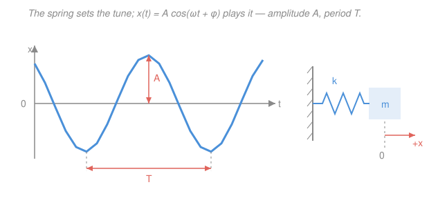

# Newtonian Mechanics · Lesson 3.1: Simple harmonic motion

> ⏱ ~15 min · Module 3: Oscillations · Builds on: [2.2 Potential energy and conservation](02-02-potential-energy-conservation.md), [`ode-refresher` 2.1](../../ode-refresher/lessons/02-01-second-order-constant-coefficient.md) · Unlocks: 3.2 (damped and driven oscillations)

## Why this matters

Pull almost anything slightly off its resting point — a mass on a spring, a pendulum, an atom in a crystal, a bond price near its mean — and it swings back, overshoots, and repeats. That single motion, **simple harmonic motion (SHM)**, is the most reused pattern in physics, and the reason is deep: *every* smooth potential energy well looks like a parabola near its bottom, so *every* small oscillation is SHM to first approximation. Master one spring and you've modeled a thousand systems. And underneath it is an equation you already solved in [`ode-refresher` 2.1](../../ode-refresher/lessons/02-01-second-order-constant-coefficient.md) — SHM *is* the complex-roots case of that quadratic, wearing a physics uniform.

## The idea

What makes something oscillate? One ingredient: a force that always points *back toward home* and grows with how far you've strayed. Stretch a spring twice as far, it pulls back twice as hard. That's a **linear restoring force**. Because the pull is strongest when you're farthest out, the mass gets yanked back, builds speed, and shoots *past* equilibrium — where the force now reverses and brakes it. It can't just settle; it trades position for speed and back again, forever (until friction, which is [3.2](03-02-damped-driven-oscillations.md)'s job).

The genius is that this back-and-forth traces out a **cosine curve in time**. Not approximately — exactly. And the tempo of that cosine depends only on two things: how *stiff* the restoring force is (spring constant) and how *heavy* the thing is (mass). Stiffer springs and lighter masses ring faster. Crucially, it does **not** depend on how far you pulled it — a big swing and a tiny swing take the *same time*. That amplitude-independence (isochronism) is what makes pendulum clocks keep time.

## The formal version

**Hooke's law.** A spring stretched a displacement $x$ (in meters, measured from equilibrium) pulls back with force

$$F = -kx,$$

where $k$ (newtons per meter, N/m) is the **spring constant** — the stiffness. *In words: force is proportional to displacement and points opposite to it* (the minus sign is the "restoring" part).

Feed this into Newton's second law, $F = m\ddot x$, with $m$ the mass (kg) and $\ddot x = d^2x/dt^2$ the acceleration:

$$m\ddot x = -kx \qquad\Longrightarrow\qquad \ddot x + \omega^2 x = 0, \qquad \omega \equiv \sqrt{\tfrac{k}{m}}.$$

*In words: acceleration is proportional to displacement and opposite in sign.* This is **exactly** the constant-coefficient equation $y'' + \omega^2 y = 0$ from [`ode-refresher` 2.1](../../ode-refresher/lessons/02-01-second-order-constant-coefficient.md) — characteristic roots $r = \pm i\omega$, the purely-imaginary (undamped complex) case. Its general solution is

$$\boxed{\,x(t) = A\cos(\omega t + \phi)\,}$$

with three quantities you read off the motion:

- **Amplitude** $A$ (m): the farthest displacement — the height of the cosine. Set by how far you pulled.
- **Angular frequency** $\omega$ (radians per second, rad/s): the tempo, $\omega = \sqrt{k/m}$. Set by the *system*, not by you.
- **Phase** $\phi$ (rad): where in the cycle you started at $t = 0$. Set by the initial conditions.

From $\omega$ come the two everyday timing numbers:

$$T = \frac{2\pi}{\omega} \quad (\text{period, seconds}), \qquad f = \frac{1}{T} = \frac{\omega}{2\pi} \quad (\text{frequency, hertz, Hz}).$$

*In words: the period is the time for one full swing; the frequency is swings per second.* Note $A$ appears in **none** of these — that's isochronism, falling straight out of the math.

**The simple pendulum.** A mass on a string of length $L$ (m), displaced by angle $\theta$ (rad), feels a restoring tangential force $F = -mg\sin\theta$. That's *not* linear — but for small swings we Taylor-truncate $\sin\theta \approx \theta$ (the first term of $\sin\theta = \theta - \theta^3/6 + \cdots$), giving $m L\ddot\theta = -mg\theta$, i.e. $\ddot\theta + \omega^2\theta = 0$ with

$$\omega = \sqrt{\frac{g}{L}}, \qquad T = 2\pi\sqrt{\frac{L}{g}},$$

using $g = 9.8\ \mathrm{m/s^2}$. *In words: for small angles a pendulum is a spring in disguise, with $k/m$ replaced by $g/L$.* The mass cancels — pendula of any weight keep the same time.

**Energy in SHM.** With a conservative spring the potential energy is $U = \tfrac12 kx^2$ (see [2.2](02-02-potential-energy-conservation.md)) and the kinetic energy is $K = \tfrac12 m v^2$, where $v = \dot x$. Substituting $x = A\cos(\omega t + \phi)$ and $v = -A\omega\sin(\omega t + \phi)$ and using $m\omega^2 = k$:

$$E = \tfrac12 kx^2 + \tfrac12 m v^2 = \tfrac12 kA^2 = \text{constant.}$$

*In words: energy sloshes back and forth between spring (potential) and motion (kinetic), but the total stays pinned at $\tfrac12 kA^2$* — all potential at the turning points ($v = 0$), all kinetic at equilibrium ($x = 0$).

## Picture

## Worked examples

**Example 1 (mechanical — read off the numbers).** A 0.5 kg mass on a spring with $k = 200$ N/m is pulled 0.1 m and released. Then

$$\omega = \sqrt{\frac{k}{m}} = \sqrt{\frac{200}{0.5}} = \sqrt{400} = 20\ \mathrm{rad/s}, \qquad T = \frac{2\pi}{20} \approx 0.31\ \mathrm{s}.$$

The mass is fastest at equilibrium, where all the energy is kinetic: $\tfrac12 m v_{\max}^2 = \tfrac12 kA^2$, so $v_{\max} = A\omega = 0.1 \times 20 = 2\ \mathrm{m/s}$. Everything about the timing came from $k$ and $m$ alone.

**Example 2 (why you'd care — the universal well).** Why does SHM show up *everywhere*? Take any smooth potential $U(x)$ with a minimum at $x_0$. Taylor-expand about it:

$$U(x) \approx U(x_0) + \underbrace{U'(x_0)}_{=\,0}(x - x_0) + \tfrac12 U''(x_0)(x - x_0)^2 + \cdots$$

The linear term vanishes (it's a minimum), so *to leading order every well is a parabola* $\tfrac12 U''(x_0)(x-x_0)^2$ — a spring with effective stiffness $k_{\text{eff}} = U''(x_0)$. So any object jiggling near a stable equilibrium ([2.2](02-02-potential-energy-conservation.md)'s "stable = potential curves upward") oscillates with $\omega = \sqrt{U''(x_0)/m}$. That's why the same $\cos(\omega t + \phi)$ describes a vibrating molecule, a swaying bridge, and a mass on a spring.

## Watch out

- **You might think a bigger pull means a longer period.** It doesn't — $A$ is nowhere in $T = 2\pi/\omega$. A wider swing just moves *faster* to cover more ground in the same time. (This breaks only when the pendulum's angle gets large and $\sin\theta \approx \theta$ fails.)
- **You might confuse $\omega$ and $f$.** They differ by $2\pi$: $\omega$ is in rad/s, $f$ is in cycles/s (Hz). Plug $\omega$, not $f$, into $\cos(\omega t + \phi)$.
- **You might forget the minus sign in Hooke's law.** Without it the equation is $\ddot x = +\omega^2 x$, whose solutions are *exponentials* ($e^{\pm\omega t}$) that run away — that's a push-away force, an unstable equilibrium, not an oscillation. The restoring sign is the whole game.

## One-liner

> A linear restoring force gives $\ddot x + \omega^2 x = 0$, whose solution $A\cos(\omega t + \phi)$ rings at $\omega = \sqrt{k/m}$ — stiffness over inertia — regardless of how hard you pull.

## Problems

**P1 (🟢)** A 0.5 kg mass sits on a spring with $k = 200$ N/m and oscillates with amplitude 0.1 m. Find the angular frequency $\omega$, the period $T$, and the maximum speed.

**P2 (🟡)** A simple pendulum has length $L = 1$ m. Find its period for small swings (use $g = 9.8\ \mathrm{m/s^2}$). If you doubled the amplitude of the swing (keeping it small), what happens to the period, and why?

**P3 (🔴)** In SHM with amplitude $A$, at what displacement $x$ is the kinetic energy equal to the potential energy?

Solutions

**P1** With $m = 0.5$ kg and $k = 200$ N/m:

$$\omega = \sqrt{\frac{k}{m}} = \sqrt{\frac{200}{0.5}} = \sqrt{400} = 20\ \mathrm{rad/s}, \qquad T = \frac{2\pi}{\omega} = \frac{2\pi}{20} \approx 0.31\ \mathrm{s}.$$

Max speed occurs at equilibrium, where all energy is kinetic. From $\tfrac12 m v_{\max}^2 = \tfrac12 kA^2$, or directly $v_{\max} = A\omega$:

$$v_{\max} = A\omega = 0.1 \times 20 = 2\ \mathrm{m/s}.$$

*Check.* Units: $\sqrt{(\mathrm{N/m})/\mathrm{kg}} = \sqrt{(\mathrm{kg\,s^{-2}})/\mathrm{kg}} = \sqrt{\mathrm{s^{-2}}} = \mathrm{s^{-1}}$ ✓ (rad is dimensionless). And $A\omega = \mathrm{m}\cdot\mathrm{s^{-1}}$ ✓.

**P2** The mass never enters; use $\omega = \sqrt{g/L}$:

$$\omega = \sqrt{\frac{9.8}{1}} \approx 3.13\ \mathrm{rad/s}, \qquad T = \frac{2\pi}{\omega} = 2\pi\sqrt{\frac{L}{g}} = 2\pi\sqrt{\frac{1}{9.8}} \approx 2.0\ \mathrm{s}.$$

Doubling the amplitude does **nothing** to the period — SHM is isochronous, because $A$ does not appear in $T = 2\pi\sqrt{L/g}$. The wider swing simply moves faster. (Caveat: this holds only while the small-angle truncation $\sin\theta \approx \theta$ is valid; at large angles the true period grows slightly with amplitude.)

*Check.* Units: $\sqrt{\mathrm{m}/(\mathrm{m/s^2})} = \sqrt{\mathrm{s^2}} = \mathrm{s}$ ✓. Limiting sense: a longer string (bigger $L$) gives a slower clock, matching everyday pendula. ✓

**P3** Total energy is fixed at $E = \tfrac12 kA^2$, split as $U = \tfrac12 kx^2$ and $K = E - U$. Setting $K = U$ means each is half the total:

$$U = \tfrac12 E \;\Longrightarrow\; \tfrac12 kx^2 = \tfrac12\left(\tfrac12 kA^2\right) \;\Longrightarrow\; x^2 = \tfrac12 A^2 \;\Longrightarrow\; x = \frac{A}{\sqrt2} \approx 0.707\,A.$$

*Check.* Equivalently set $K = U$ directly: $\tfrac12 k(A^2 - x^2) = \tfrac12 kx^2 \Rightarrow A^2 = 2x^2$, same answer. Sanity: $A/\sqrt2$ lies between $0$ (all kinetic) and $A$ (all potential), as it must. ✓

## Flashback

**From Lesson 2.2 (Potential energy and conservation):** A 2 kg block is released from rest at the top of a frictionless ramp of height 1.5 m. Using energy conservation, find its speed at the bottom. (Fresh variant — no spring involved.)

Solution

No friction, so mechanical energy is conserved: gravitational potential converts entirely to kinetic. Taking the bottom as the reference height,

$$mgh = \tfrac12 m v^2 \;\Longrightarrow\; v = \sqrt{2gh} = \sqrt{2 \times 9.8 \times 1.5} = \sqrt{29.4} \approx 5.4\ \mathrm{m/s}.$$

*Check.* The mass cancels (a bowling ball and a marble reach the bottom equally fast), and units are $\sqrt{(\mathrm{m/s^2})\cdot\mathrm{m}} = \mathrm{m/s}$ ✓. This is the same energy bookkeeping SHM uses — only here the potential is gravitational ($mgh$) rather than elastic ($\tfrac12 kx^2$). ✓

## Connections

- **Backward:** the restoring force comes from [2.2](02-02-potential-energy-conservation.md)'s stable equilibrium — a potential curving *upward* — and Example 2 shows every such well is a spring near its bottom. The energy split $\tfrac12 kx^2 \leftrightarrow \tfrac12 mv^2$ is conservation of energy from that same lesson.
- **Forward:** [3.2 Damped and driven oscillations](03-02-damped-driven-oscillations.md) adds friction ($-b\dot x$) and a push ($F_0\cos\Omega t$), turning $\ddot x + \omega^2 x = 0$ into the full damped-driven equation — where $\omega$ becomes the *natural* frequency and resonance appears when you drive near it.
- **Sideways (ODEs):** this lesson *is* the purely-imaginary-roots case of [`ode-refresher` 2.1](../../ode-refresher/lessons/02-01-second-order-constant-coefficient.md): $r = \pm i\omega$, no real part, so no decay — a ring that never dies. Adding damping in 3.2 gives roots with a negative real part, exactly that lesson's decaying-oscillation case.
