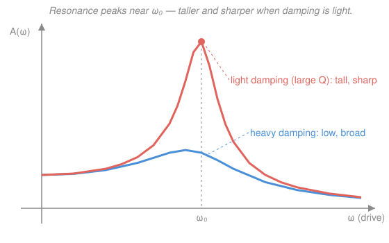

# Newtonian Mechanics · Lesson 3.2: Damped and driven oscillations

> ⏱ ~15 min · Module 3: Oscillations · Builds on: [3.1 Simple harmonic motion](03-01-simple-harmonic-motion.md), [`ode-refresher` 2.2](../../ode-refresher/lessons/02-02-oscillations-damping.md) · Unlocks: Module 4 (rotation)

## Why this matters

The frictionless spring of [3.1](03-01-simple-harmonic-motion.md) never stops — a fiction no real oscillator obeys. Add drag and the ringing dies; add a periodic push and it can grow catastrophically. This lesson is where the idealized oscillator meets reality: why a car doesn't bounce forever, why a wine glass shatters at one pitch, why the Tacoma Narrows bridge tore itself apart, and how MRI and radio tuning both live or die by one number. It's also the *physics* underneath the ODEs you already solved in [`ode-refresher` 2.2](../../ode-refresher/lessons/02-02-oscillations-damping.md) and [2.3](../../ode-refresher/lessons/02-03-forcing-resonance.md) — same equations, now with masses and forces attached.

## The idea

An oscillator is an energy account. The spring shuttles energy between kinetic and potential; that's the eternal ringing of SHM. Two new effects change the balance:

- **Damping bleeds energy out.** A drag force (air, oil, internal friction) opposes the motion and drains a little kinetic energy every swing. Left alone, the oscillation decays. How much drag decides *how* it decays: a little and it rings down inside a shrinking envelope (**underdamped**); a lot and it just oozes back to rest without a single overshoot (**overdamped**); the knife-edge between is the fastest possible no-overshoot return (**critically damped**).
- **Driving pumps energy in.** Push the mass periodically and you feed energy back. If you push *in rhythm* with the oscillator's own swing — shove forward exactly when it's already moving forward — every push lands in phase and energy piles up. The amplitude climbs to a huge steady value. That's **resonance**: not brute force, but *timing*. A child on a swing gets high not by one hard shove but by many small ones timed to the swing.

The whole lesson is those two ideas quantified: a decay rate $\gamma$ for the leak, and a resonance peak for the pump.

## The formal version

**The damped oscillator.** Add a drag force $-b\dot x$ (proportional to velocity, opposing it) to Hooke's law. Newton's law $m\ddot x = -kx - b\dot x$ becomes

$$m\ddot x + b\dot x + kx = 0.$$

*In words:* mass times acceleration equals the spring's restoring pull $-kx$ minus the drag $-b\dot x$. Here $x$ is displacement from equilibrium (m), $m$ is mass (kg), $k$ is the spring constant (N/m), and $b$ is the damping coefficient (N·s/m, i.e. force per unit velocity). Divide by $m$ and name two rates:

$$\ddot x + 2\gamma\dot x + \omega_0^2 x = 0,\qquad \omega_0 = \sqrt{\tfrac{k}{m}}\ \ (\text{natural frequency}),\quad \gamma = \tfrac{b}{2m}\ \ (\text{damping rate}).$$

Both $\omega_0$ and $\gamma$ have units of rad/s (per second). $\omega_0$ is the rate it *would* ring at with no drag; $\gamma$ is how fast energy leaks.

**The three regimes** (this is [`ode-refresher` 2.2](../../ode-refresher/lessons/02-02-oscillations-damping.md)'s discriminant story, now physical). The characteristic roots are $r = -\gamma \pm \sqrt{\gamma^2 - \omega_0^2}$, and the sign of $\gamma^2 - \omega_0^2$ decides the motion:

| Condition | Regime | Motion |
|---|---|---|
| $\gamma < \omega_0$ | **underdamped** | decaying ring: $x = A\,e^{-\gamma t}\cos(\omega_d t - \phi)$ |
| $\gamma = \omega_0$ | **critically damped** | fastest no-overshoot return: $x=(C_1+C_2 t)e^{-\gamma t}$ |
| $\gamma > \omega_0$ | **overdamped** | slow non-oscillatory crawl: $x=C_1e^{r_1 t}+C_2e^{r_2 t}$ |

The underdamped ring happens at the **damped frequency**

$$\omega_d = \sqrt{\omega_0^2 - \gamma^2} < \omega_0,$$

always slower than the free rate — drag doesn't just shrink swings, it lengthens them. As $\gamma\to 0$ this returns $\omega_d\to\omega_0$ and $e^{-\gamma t}\to 1$: pure SHM, exactly [3.1](03-01-simple-harmonic-motion.md).

**The quality factor.** Package the leak into one dimensionless number:

$$Q = \frac{\omega_0}{2\gamma}.$$

*In words:* $Q$ measures how good the oscillator is at ringing. Two readings, both worth memorizing: (1) roughly $Q/\pi$ oscillations pass before the amplitude decays to $1/e$ of its start — so **high $Q$ means it rings a long time**; (2) $Q$ is the **sharpness of the resonance peak** below. A tuning fork has $Q\sim 10^3$; a quartz crystal $\sim 10^5$; a shock absorber, by design, $Q < 1$ (it shouldn't ring at all).

**The driven oscillator.** Now push with a periodic force $F_0\cos\omega t$ (amplitude $F_0$ in N, drive frequency $\omega$ in rad/s):

$$m\ddot x + b\dot x + kx = F_0\cos\omega t.$$

After the transient dies (the homogeneous decay above), a **steady state** survives — the mass oscillating at the *driver's* frequency $\omega$, not its own $\omega_0$ — with amplitude

$$A(\omega) = \frac{F_0/m}{\sqrt{(\omega_0^2-\omega^2)^2 + (2\gamma\omega)^2}}.$$

*In words:* the denominator is smallest — so $A$ is largest — when $\omega$ sits near $\omega_0$. That tall response is **resonance**. The exact peak is at

$$\omega_\text{res} = \sqrt{\omega_0^2 - 2\gamma^2},$$

just below $\omega_0$, and for light damping ($\gamma \ll \omega_0$) it's $\approx \omega_0$ with peak height $\approx Q\cdot F_0/k$. Smaller $\gamma$ (bigger $Q$) makes the peak **taller and narrower** — see the Picture.

## Picture

## Worked examples

**Example 1 (mechanical — classify and find the ring rate).** A 2 kg mass on a $k=50$ N/m spring sits in oil giving $b=12$ N·s/m. Then $\omega_0 = \sqrt{50/2} = 5$ rad/s and $\gamma = b/(2m) = 12/4 = 3$ rad/s. Since $\gamma = 3 < 5 = \omega_0$, it's **underdamped**, ringing at

$$\omega_d = \sqrt{\omega_0^2 - \gamma^2} = \sqrt{25 - 9} = 4\ \text{rad/s},$$

inside a decaying $e^{-3t}$ envelope. (Crank the oil to $b=20$: $\gamma=5=\omega_0$, critically damped — the ring vanishes.)

**Example 2 (why you'd care — resonance sharpness).** A quartz tuning fork has $\omega_0 = 2\pi(440) \approx 2765$ rad/s and a very light damping $\gamma = 1.4$ rad/s. Its quality factor is $Q = \omega_0/(2\gamma) \approx 2765/2.8 \approx 990$. Two consequences at once: struck once, it rings for about $Q/\pi \approx 315$ cycles before fading to $1/e$ (why it holds a clean pitch); and driven, it responds enormously in a frequency band only about $\omega_0/Q \approx 3$ rad/s wide (why it picks out exactly its note and ignores the rest). One number, $Q$, sets both the ring-down and the selectivity — the same fact that lets an RLC radio front-end tune a single station.

## Watch out

- You might think the resonance peak sits exactly at $\omega_0$. On a damped system it's slightly *below*, at $\omega_\text{res}=\sqrt{\omega_0^2-2\gamma^2}$; only in the light-damping limit is $\omega_\text{res}\approx\omega_0$. (And note $\omega_\text{res} < \omega_d < \omega_0$ — three "frequencies", all different.)
- You might think more damping always returns the system to rest faster. Past critical it doesn't: an **overdamped** system has one slow-decaying root that lingers, so it's *slower* than critical. Critical damping is the sweet spot — the design target for car suspensions and meter needles.
- You might think the steady-state oscillation happens at the natural frequency $\omega_0$. It happens at the **driving** frequency $\omega$ — the driver wins. $\omega_0$ only sets *where the response is biggest*, not how fast it wiggles.

## One-liner

> Damping ($\gamma$) bleeds the ring down over about $Q/\pi$ cycles; driving in rhythm pumps it up into a resonance peak near $\omega_0$ — tall and sharp exactly when $Q$ is large.

## Problems

**P1 (🟢)** A 0.5 kg mass on a $k=8$ N/m spring feels a drag $b=1$ N·s/m. Find $\omega_0$ and $\gamma$, classify the damping, and (if underdamped) find $\omega_d$.

**P2 (🟡)** A lightly damped oscillator has $\omega_0 = 100$ rad/s and damping rate $\gamma = 0.5$ rad/s. Find its quality factor $Q$, and estimate how many full oscillations it completes before the amplitude falls to $1/e$ of its initial value.

**P3 (🔴, Boss-3 style)** A 1 kg mass on a $k=100$ N/m spring sits in a viscous medium with $b=6$ N·s/m and is driven by $F_0\cos\omega t$. Find the natural frequency $\omega_0$, classify the damping, and find the driving frequency $\omega_\text{res}$ that maximizes the steady-state amplitude. By how much does $\omega_\text{res}$ fall short of $\omega_0$, and what would it be if the medium were removed ($\gamma\to 0$)?

Solutions

**P1** $\omega_0 = \sqrt{k/m} = \sqrt{8/0.5} = \sqrt{16} = 4$ rad/s. Damping rate $\gamma = b/(2m) = 1/(2\cdot 0.5) = 1$ rad/s. Since $\gamma = 1 < 4 = \omega_0$, it's **underdamped**. The ring rate is

$$\omega_d = \sqrt{\omega_0^2 - \gamma^2} = \sqrt{16 - 1} = \sqrt{15} \approx 3.87\ \text{rad/s}.$$

*Check:* units — $\sqrt{(\text{N/m})/\text{kg}} = \sqrt{(\text{kg/s}^2)/\text{kg}} = 1/\text{s}$ ✓, and $b/(2m)$ is $(\text{N·s/m})/\text{kg} = (\text{kg/s})/\text{kg} = 1/\text{s}$ ✓. And $\omega_d < \omega_0$ as required. ✓

**P2** Quality factor:

$$Q = \frac{\omega_0}{2\gamma} = \frac{100}{2(0.5)} = \frac{100}{1} = 100.$$

The amplitude envelope is $e^{-\gamma t}$, which reaches $1/e$ when $\gamma t = 1$, i.e. $t = 1/\gamma = 2$ s. In that time, at essentially the free rate (lightly damped, so $\omega_d\approx\omega_0=100$ rad/s), the period is $T = 2\pi/\omega_0 = 2\pi/100 \approx 0.0628$ s, so the number of cycles is

$$N = \frac{t}{T} = \frac{2}{0.0628} \approx 31.8 \approx 32\ \text{cycles}.$$

*Check:* this should equal $Q/\pi = 100/\pi \approx 31.8$ ✓ — confirming the rule "high $Q$ ⇒ about $Q/\pi$ rings before decaying to $1/e$."

**P3** $\omega_0 = \sqrt{k/m} = \sqrt{100/1} = 10$ rad/s. Damping rate $\gamma = b/(2m) = 6/2 = 3$ rad/s. Since $\gamma = 3 < 10 = \omega_0$, it's **underdamped**. The steady-state amplitude $A(\omega)=\dfrac{F_0/m}{\sqrt{(\omega_0^2-\omega^2)^2+(2\gamma\omega)^2}}$ is largest where the denominator is smallest; setting the derivative of $(\omega_0^2-\omega^2)^2 + 4\gamma^2\omega^2$ with respect to $\omega^2$ to zero gives $\omega^2 = \omega_0^2 - 2\gamma^2$, so

$$\omega_\text{res} = \sqrt{\omega_0^2 - 2\gamma^2} = \sqrt{100 - 2(9)} = \sqrt{82} \approx 9.06\ \text{rad/s}.$$

It falls short of $\omega_0 = 10$ by about $0.94$ rad/s (roughly 9%). Remove the medium ($\gamma\to 0$): $\omega_\text{res} = \sqrt{\omega_0^2 - 0} = \omega_0 = 10$ rad/s — the peak climbs to $\omega_0$ (and its height $\to\infty$), recovering the undamped resonance of [`ode-refresher` 2.3](../../ode-refresher/lessons/02-03-forcing-resonance.md).

*Check:* the ordering $\omega_\text{res} = \sqrt{82} \approx 9.06 < \omega_d = \sqrt{100-9} = \sqrt{91}\approx 9.54 < \omega_0 = 10$ holds, as it must for any damped driven oscillator ✓; and the $\gamma\to 0$ limit returns SHM's $\omega_0$ ✓.

## Flashback

**From Lesson 3.1 (Simple harmonic motion):** A 0.25 kg mass on a spring oscillates as pure SHM with $x(t) = 0.10\cos(8t)$ (SI units, so $x$ in m and $t$ in s). Find the spring constant $k$, the period $T$, and the maximum speed of the mass.

Solution

Reading off the motion, the angular frequency is $\omega_0 = 8$ rad/s and amplitude $A = 0.10$ m. Since $\omega_0 = \sqrt{k/m}$,

$$k = m\omega_0^2 = 0.25 \times 8^2 = 0.25 \times 64 = 16\ \text{N/m}.$$

Period $T = 2\pi/\omega_0 = 2\pi/8 = \pi/4 \approx 0.785$ s. Maximum speed is the amplitude of $\dot x = -A\omega_0\sin(8t)$:

$$v_\text{max} = A\omega_0 = 0.10 \times 8 = 0.8\ \text{m/s}.$$

*Check:* units — $k = \text{kg}\cdot(1/\text{s})^2 = \text{kg/s}^2 = \text{N/m}$ ✓; $v_\text{max} = \text{m}\cdot(1/\text{s}) = \text{m/s}$ ✓. And energy is consistent: $\tfrac12 k A^2 = \tfrac12(16)(0.01) = 0.08$ J equals $\tfrac12 m v_\text{max}^2 = \tfrac12(0.25)(0.64) = 0.08$ J ✓ — potential at the turning point equals kinetic at the center.

## Connections

- **Backward:** set $\gamma = 0$ (no drag) and this whole lesson collapses to [3.1](03-01-simple-harmonic-motion.md) — SHM is the undamped, undriven special case, and $\omega_0$ is the frequency it rings at. The energy bookkeeping is [2.2 (potential energy and conservation)](02-02-potential-energy-conservation.md): damping is where mechanical energy stops being conserved and leaks to heat.
- **Forward:** Module 4 rotates the entire framework — a physical pendulum, a torsional oscillator, and a balance wheel obey this same equation with torque, moment of inertia, and angular displacement in place of force, mass, and $x$.
- **Sideways (physics ↔ math ↔ engineering):** this is the mechanical face of [`ode-refresher` 2.2](../../ode-refresher/lessons/02-02-oscillations-damping.md) (the damping regimes as the characteristic discriminant) and [2.3](../../ode-refresher/lessons/02-03-forcing-resonance.md) (the resonance amplitude curve $A(\omega)$). The identical equation runs a series RLC circuit ($m\leftrightarrow L$, $b\leftrightarrow R$, $k\leftrightarrow 1/C$), where $Q$ sets a radio's selectivity — and the runaway resonance here is the same math that felled the Tacoma Narrows bridge.
