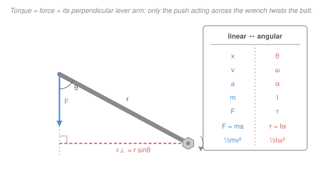

# Newtonian Mechanics · Lesson 4.1: Rotational dynamics

> ⏱ ~15 min · Module 4: Rotation · Builds on: [1.1 Kinematics](01-01-kinematics.md), [2.3 Momentum, impulse, and collisions](02-03-momentum-collisions.md) · Unlocks: 4.2 (angular momentum and rolling)

## Why this matters

Everything you built for straight-line motion — a position, its two derivatives, $\mathbf F = m\mathbf a$, kinetic energy — has an exact twin for *spinning*. A wheel, a flywheel, a door on its hinges, a planet on its axis: none of them translate, yet they obey a law with the identical shape. The good news is that you don't relearn mechanics; you **relabel** it. This lesson builds the dictionary, and once you have it, rolling, gyroscopes, and orbital angular momentum (next lesson, and again in gravitation) all read as the same sentences you already know.

## The idea

Push a merry-go-round. *Where* you push matters as much as *how hard*: shove near the center and nothing happens; the same force at the rim spins it easily. So the rotational stand-in for force isn't force alone — it's force **times its leverage**, the distance from the axis at which it acts. That product is **torque**.

And spinning things resist being sped up, just like heavy things resist being pushed — but the resistance depends on *where the mass sits*, not just how much there is. Mass far from the axis is dead weight to a spin; mass hugging the axis barely counts. The rotational stand-in for mass is therefore **moment of inertia** — mass weighted by how far out it lives.

Put those two together and Newton's second law reappears wearing rotational clothes: **torque = moment of inertia × angular acceleration**. Same law, new nouns. The whole lesson is one move — take every linear quantity and ask "what's its rotational twin?"

## The formal version

**Rotational kinematics.** Describe a rigid body's orientation by an angle $\theta$ (units: radians, rad). Its rates of change are the **angular velocity** and **angular acceleration**:

$$\omega = \frac{d\theta}{dt}\ (\mathrm{rad/s}), \qquad \alpha = \frac{d\omega}{dt} = \frac{d^2\theta}{dt^2}\ (\mathrm{rad/s^2}).$$

*In words: $\omega$ is how fast it's turning, $\alpha$ is how fast that turning speeds up.* This is [1.1](01-01-kinematics.md)'s $\mathbf r \to \mathbf v \to \mathbf a$ ladder with the labels swapped — same calculus. So when $\alpha$ is **constant**, the constant-acceleration equations carry over verbatim:

$$\omega = \omega_0 + \alpha t, \qquad \theta = \theta_0 + \omega_0 t + \tfrac12\alpha t^2, \qquad \omega^2 = \omega_0^2 + 2\alpha\,\Delta\theta.$$

**The linear ↔ angular bridge.** A point a distance $r$ (m) from the axis moves along a circle, and its linear speed and tangential acceleration are

$$v = r\omega, \qquad a_t = r\alpha.$$

*In words: multiply an angular quantity by the radius to get the linear quantity of a point on the rim.* This one relation stitches the spinning body to the ordinary motion of any point on it.

**Torque.** For a force $\mathbf F$ (N) applied at position $\mathbf r$ from the axis, the **torque** is

$$\tau = rF\sin\theta = r_\perp F \qquad (\mathrm{N\cdot m}),$$

where $\theta$ is the angle between $\mathbf r$ and $\mathbf F$, and $r_\perp = r\sin\theta$ is the **perpendicular lever arm** — the closest distance from the axis to the force's line of action. *In words: torque is force scaled by its leverage; only the part of the force acting across the arm ($F\sin\theta$) twists, the part along the arm just pulls on the axle.* Push straight in ($\theta = 0$) and $\tau = 0$; push perpendicular ($\theta = 90^\circ$) and you get the full $rF$.

**Moment of inertia.** The rotational analogue of mass, for a body made of point masses $m_i$ at distances $r_i$ from the axis:

$$I = \sum_i m_i r_i^2 \qquad (\mathrm{kg\cdot m^2}).$$

*In words: add up each bit of mass times the square of its distance from the axis — mass far out counts much more, because of the $r^2$.* The same axis-dependence you'd expect: spin a body about a different line and $I$ changes. A few standard results (memorize these four):

| body (axis through center) | $I$ |
|---|---|
| point mass, radius $r$ | $mr^2$ |
| solid disk / cylinder, radius $R$ | $\tfrac12 MR^2$ |
| thin rod, length $L$, about its center | $\tfrac{1}{12}ML^2$ |
| solid sphere, radius $R$ | $\tfrac25 MR^2$ |

**Newton's second law for rotation.** Sum the torques about the axis:

$$\tau_{\text{net}} = I\alpha.$$

*In words: the twisting effort you supply equals the rotational inertia times the angular pickup — $\mathbf F = m\mathbf a$ with every symbol promoted to its rotational twin.* And the energy of a spin is the twin of $\tfrac12 mv^2$:

$$K_{\text{rot}} = \tfrac12 I\omega^2 \qquad (\mathrm{J}).$$

## Picture

The bolt is the axis. The force $F$ acts at the tip of the handle, a distance $r$ out, but what actually turns the bolt is the *perpendicular* lever arm $r_\perp = r\sin\theta$ — drop a perpendicular from the axis to the force's line of action and that length, times $F$, is the torque. Slide your hand toward the bolt ($r_\perp$ shrinks) and the same grip does less; push along the handle ($\theta \to 0$) and it does nothing. The inset is the whole lesson in one column: read any linear law, swap each symbol for its neighbor, and you have the rotational law.

## Worked examples

**Example 1 (mechanical — torque makes a disk spin).** A tangential force $F = 12\ \mathrm N$ is applied at the rim of a solid disk of mass $M = 3\ \mathrm{kg}$, radius $R = 0.40\ \mathrm m$, free to rotate about its center. Find the angular acceleration.

The force is tangent, so $\theta = 90^\circ$ and $\tau = RF = 0.40 \times 12 = 4.8\ \mathrm{N\cdot m}$. The disk's inertia is $I = \tfrac12 MR^2 = \tfrac12(3)(0.40)^2 = 0.24\ \mathrm{kg\cdot m^2}$. Then

$$\alpha = \frac{\tau}{I} = \frac{4.8}{0.24} = 20\ \mathrm{rad/s^2}.$$

Straight substitution into $\tau = I\alpha$ — the definition in action. Symbolically $\alpha = RF/(\tfrac12 MR^2) = 2F/(MR)$: push harder or use a lighter, smaller disk and it spins up faster.

**Example 2 (why you'd care — a falling mass turns a pulley).** A block of mass $m$ hangs from a string wrapped around a pulley modeled as a solid disk of mass $M$, radius $R$. Released from rest, how fast does the block accelerate? This is the rotational cousin of a connected-mass problem: the block *translates*, the pulley *rotates*, and the string couples them.

The one bridge that links the two motions: the string doesn't slip, so the rim's tangential acceleration equals the block's, $a = R\alpha$.

*Block* (Newton's second law, taking down as positive, $T$ = string tension):
$$mg - T = ma.$$
*Pulley* (rotational second law; only $T$ exerts a torque, at the rim):
$$\tau = TR = I\alpha = \tfrac12 MR^2 \cdot \frac{a}{R} = \tfrac12 MRa \;\Rightarrow\; T = \tfrac12 Ma.$$
Substitute the tension back:
$$mg - \tfrac12 Ma = ma \;\Rightarrow\; a = \frac{mg}{m + \tfrac12 M}.$$

Notice the pulley's mass adds to the inertia as $\tfrac12 M$ — its *rotational* resistance, felt by the block as extra sluggishness. If the pulley were massless ($M \to 0$) you'd recover free fall $a = g$, exactly as an ideal-string problem assumes. The disk's $\tfrac12$ is the moment of inertia leaking into a linear answer — the two worlds are genuinely coupled.

## Watch out

- You might think torque is just force. It's force *with leverage* — the same $F$ gives more torque farther from the axis, and **zero** torque if it points straight at (or away from) the axis. Always ask for the perpendicular lever arm, not just the force.
- You might think moment of inertia is a fixed property of an object like its mass. It depends on the **axis**: a rod spun about its center has $I = \tfrac{1}{12}ML^2$, but about its end it's $\tfrac13 ML^2$ — four times larger. State the axis before you quote an $I$.
- You might carry over $v = r\omega$ and forget the units live in **radians**. These bridge formulas and the kinematic equations only work with $\theta$ in radians (and $\omega$ in rad/s); degrees or revolutions must be converted first ($1\ \text{rev} = 2\pi\ \text{rad}$).

## One-liner

> Every linear law has a rotational twin — swap $F\to\tau=r_\perp F$, $m\to I=\sum m_i r_i^2$, $a\to\alpha$ — and $\mathbf F=m\mathbf a$ becomes $\tau=I\alpha$: torque is force with leverage, inertia is mass with reach.

## Problems

**P1 (🟢)** A solid disk of mass $M = 4\ \mathrm{kg}$ and radius $R = 0.25\ \mathrm m$ spins freely about its center. A rope wrapped around the rim is pulled with a constant tangential force $F = 15\ \mathrm N$. Find the disk's angular acceleration $\alpha$.

**P2 (🟡)** A bucket of mass $m = 1.5\ \mathrm{kg}$ hangs from a rope wound around a cylindrical pulley (solid disk) of mass $M = 4\ \mathrm{kg}$, radius $R = 0.20\ \mathrm m$. Released from rest, find the bucket's downward acceleration $a$ and the rope tension $T$. Use $g = 9.8\ \mathrm{m/s^2}$.

**P3 (🔴, optional)** A motor applies a constant torque $\tau = 20\ \mathrm{N\cdot m}$ to a flywheel (solid disk, $M = 50\ \mathrm{kg}$, $R = 0.40\ \mathrm m$), starting from rest.
(a) How many revolutions does it take to reach $600\ \mathrm{rpm}$?
(b) Check your answer a second way, using the rotational work $\tau\,\Delta\theta$ and the kinetic energy $\tfrac12 I\omega^2$.

Solutions

**P1** Tangential force at the rim, so $\theta = 90^\circ$ and $\tau = RF = 0.25 \times 15 = 3.75\ \mathrm{N\cdot m}$. Disk inertia $I = \tfrac12 MR^2 = \tfrac12(4)(0.25)^2 = \tfrac12(4)(0.0625) = 0.125\ \mathrm{kg\cdot m^2}$. Then
$$\alpha = \frac{\tau}{I} = \frac{3.75}{0.125} = 30\ \mathrm{rad/s^2}.$$
*Check:* symbolically $\alpha = 2F/(MR) = 2(15)/(4 \times 0.25) = 30/1 = 30\ \mathrm{rad/s^2}$ ✓, and units $\tfrac{\mathrm{N\cdot m}}{\mathrm{kg\cdot m^2}} = \tfrac{\mathrm{kg\cdot m^2/s^2}}{\mathrm{kg\cdot m^2}} = \mathrm{s^{-2}} = \mathrm{rad/s^2}$ ✓.

**P2** Couple a translating block to a rotating disk through the no-slip bridge $a = R\alpha$.

*Bucket* (down positive): $\;mg - T = ma$.
*Pulley:* $\;TR = I\alpha = \tfrac12 MR^2\cdot\dfrac{a}{R} = \tfrac12 MRa \Rightarrow T = \tfrac12 Ma.$

Substitute: $\;mg - \tfrac12 Ma = ma \Rightarrow a = \dfrac{mg}{m + \tfrac12 M} = \dfrac{1.5 \times 9.8}{1.5 + 2} = \dfrac{14.7}{3.5} = 4.2\ \mathrm{m/s^2}.$

Then $T = \tfrac12 Ma = \tfrac12(4)(4.2) = 8.4\ \mathrm N.$

*Check:* back-substitute into the bucket equation: $mg - T = 14.7 - 8.4 = 6.3\ \mathrm N$ and $ma = 1.5 \times 4.2 = 6.3\ \mathrm N$ ✓. Sanity: $a = 4.2 < g$, as it must be — the pulley's inertia holds the bucket back. ✓

**P3** (a) Inertia $I = \tfrac12 MR^2 = \tfrac12(50)(0.40)^2 = \tfrac12(50)(0.16) = 4\ \mathrm{kg\cdot m^2}$. Angular acceleration $\alpha = \tau/I = 20/4 = 5\ \mathrm{rad/s^2}$. Convert the target speed: $\omega = 600\ \mathrm{rpm} = 600 \times \tfrac{2\pi}{60} = 62.83\ \mathrm{rad/s}$. Use the rotational time-free equation (the twin of $v^2 = v_0^2 + 2a\,\Delta x$) from rest:
$$\omega^2 = 2\alpha\,\Delta\theta \Rightarrow \Delta\theta = \frac{\omega^2}{2\alpha} = \frac{62.83^2}{2(5)} = \frac{3947.8}{10} = 394.8\ \mathrm{rad}.$$
Revolutions: $\Delta\theta/(2\pi) = 394.8/6.283 = 62.8\ \text{rev}.$

(b) Rotational work by the constant torque: $W = \tau\,\Delta\theta = 20 \times 394.8 = 7896\ \mathrm J$. Kinetic energy gained: $\tfrac12 I\omega^2 = \tfrac12(4)(62.83)^2 = 2 \times 3947.8 = 7896\ \mathrm J$. They match ✓ — the work–energy theorem holds in rotational form ($\tau\,\Delta\theta = \Delta K_{\text{rot}}$), exactly mirroring $F\,\Delta x = \Delta K$ from [2.1](02-01-work-energy.md). ✓

## Flashback

**From Lesson 1.1 (Kinematics):** A grinding wheel is spinning at $\omega_0 = 30\ \mathrm{rad/s}$ when the motor cuts out; friction brings it to rest with constant angular deceleration in $6.0\ \mathrm s$. Find the angular acceleration $\alpha$ and the number of revolutions it turns before stopping. (These are 1.1's kinematic equations wearing rotational labels — same moves, new symbols.)

Solution

Constant $\alpha$, so use the rotational twins of the kinematic equations. From $\omega = \omega_0 + \alpha t$ with $\omega = 0$:
$$\alpha = \frac{0 - \omega_0}{t} = \frac{-30}{6.0} = -5.0\ \mathrm{rad/s^2}.$$
Angle turned, from $\Delta\theta = \omega_0 t + \tfrac12\alpha t^2$:
$$\Delta\theta = 30(6.0) + \tfrac12(-5.0)(6.0)^2 = 180 - 90 = 90\ \mathrm{rad}.$$
Revolutions: $90/(2\pi) = 14.3\ \text{rev}.$

*Check:* the time-free equation $\omega^2 = \omega_0^2 + 2\alpha\,\Delta\theta$ gives $0 = 30^2 + 2(-5)\Delta\theta \Rightarrow \Delta\theta = 900/10 = 90\ \mathrm{rad}$ ✓ — same answer, the rotational analogue of P3 in [1.1](01-01-kinematics.md). ✓

## Connections

- **Backward:** this is [1.1](01-01-kinematics.md)'s kinematics and Newton's second law with every symbol promoted to its rotational twin; the "differentiate down, integrate up" ladder and the constant-acceleration equations transfer untouched. Torque as the rotational analogue of force parallels how impulse and momentum reframed force in [2.3](02-03-momentum-collisions.md).
- **Forward:** [4.2 (angular momentum and rolling)](04-02-angular-momentum.md) promotes momentum $\mathbf p = m\mathbf v$ to angular momentum $L = I\omega$, with $\tau = dL/dt$ the twin of $\mathbf F = d\mathbf p/dt$ — and uses $K_{\text{rot}} = \tfrac12 I\omega^2$ to solve the rolling-cylinder boss problem.
- **Sideways:** the $\tau = I\alpha$ / $\tfrac12 I\omega^2$ pair is what `analytical-mechanics` regenerates from a Lagrangian, where the moment of inertia appears as the coefficient of $\tfrac12\dot\theta^2$ — the same "generalized mass" idea, derived rather than assembled.
