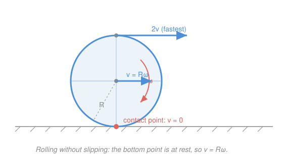

# Newtonian Mechanics · Lesson 4.2: Angular momentum and rolling

> ⏱ ~15 min · Module 4: Rotation · Builds on: [4.1 Rotational dynamics](04-01-rotational-dynamics.md) · Unlocks: Module 5 (gravitation and central forces)

## Why this matters

Everything you learned about linear momentum has a rotational twin, and the twin is often the *only* handle on a problem. Why does a figure skater speed up when she pulls her arms in? Why does a planet sweep out equal areas in equal times (Kepler's second law — coming in Module 5)? Why does a solid ball beat a hoop down a ramp every single time, regardless of their masses? All three are one conserved quantity — **angular momentum** — plus one geometric constraint — **rolling without slipping**. Master these and you can solve rotation problems without ever touching a torque equation.

## The idea

Linear momentum $p=mv$ is "quantity of straight-line motion," and it's conserved when no outside force pushes. Angular momentum is the exact analogue for spinning: "quantity of rotational motion," conserved when no outside *torque* twists.

Here's the payoff picture. Angular momentum is (rotational inertia) × (spin rate). If you can shrink your rotational inertia *without* any external torque, the spin rate has to shoot up to keep the product fixed. That's the skater: arms out, she's a slow wide spinner; arms in, she's compact — same angular momentum, so she whirls faster. Nothing pushed her around; she just rearranged her own mass.

The second idea is a constraint, not a law. A wheel that **rolls without slipping** has its contact point momentarily glued to the ground — zero velocity there. That single fact locks the wheel's travel speed to its spin rate: $v = R\omega$. And it forces the wheel's energy to *split* between moving forward and spinning, with the split decided entirely by the wheel's shape. A hoop, with all its mass far from the axis, hoards energy in spin and rolls down lazily; a solid sphere keeps most of its energy in forward motion and wins the race.

## The formal version

**Angular momentum, two faces.** For a single particle,

$$\mathbf L = \mathbf r \times \mathbf p = \mathbf r \times m\mathbf v.$$

In words: swing the momentum vector around a chosen origin; $\mathbf r$ is the position from that origin (m), $\mathbf p = m\mathbf v$ is the linear momentum (kg·m/s), and the cross product measures how much of that motion "circulates." For a **rigid body** spinning about a fixed axis this collapses to the clean scalar

$$L = I\omega,$$

where $I$ is the moment of inertia about that axis (kg·m², from [4.1](04-01-rotational-dynamics.md)) and $\omega$ is the angular velocity (rad/s). **Units of $L$: kg·m²/s.**

**Rotational Newton's second law.** Just as $\mathbf F = d\mathbf p/dt$,

$$\boldsymbol\tau_{\text{net}} = \frac{d\mathbf L}{dt}.$$

In words: net external torque $\boldsymbol\tau$ (N·m) is the *rate of change* of angular momentum. This is the parent of $\tau = I\alpha$ (differentiate $L=I\omega$ at fixed $I$).

**Conservation of angular momentum.** If $\boldsymbol\tau_{\text{net}} = 0$, then $\mathbf L$ is constant:

$$I_1\omega_1 = I_2\omega_2.$$

In words: with no external twist, shrinking $I$ raises $\omega$ in exact proportion. This is the skater, and it is the rotational partner of the momentum conservation you used for collisions in [2.3](02-03-momentum-collisions.md) — same logic ("no external agent → the total is frozen"), different quantity.

**Rolling without slipping.** The contact point is instantaneously at rest, which ties translation to rotation:

$$v_{\text{cm}} = R\omega, \qquad a_{\text{cm}} = R\alpha.$$

In words: one turn of a radius-$R$ wheel advances it exactly one circumference, so travel speed and spin rate can't be chosen independently.

**Kinetic energy of a rolling body.** Total KE is forward motion plus spin:

$$K = \underbrace{\tfrac12 M v_{\text{cm}}^2}_{\text{translational}} + \underbrace{\tfrac12 I \omega^2}_{\text{rotational}}.$$

In words: a rolling object stores energy two ways at once, and the moment of inertia $I$ sets how the budget divides.

## Picture

## Worked examples

**Example 1 (mechanical — the skater).** A skater spins at $\omega_1 = 2.0$ rad/s with arms out, moment of inertia $I_1 = 3.6$ kg·m². She pulls in to $I_2 = 1.2$ kg·m². No external torque acts about her vertical axis (the ice is nearly frictionless), so $L$ is conserved:

$$\omega_2 = \frac{I_1\omega_1}{I_2} = \frac{(3.6)(2.0)}{1.2} = 6.0\ \text{rad/s}.$$

She triples her spin rate. Note her kinetic energy *rose*: $K_1 = \tfrac12(3.6)(2.0)^2 = 7.2$ J while $K_2 = \tfrac12(1.2)(6.0)^2 = 21.6$ J. That extra 14.4 J didn't come from nowhere — her muscles did work dragging her arms inward against the outward pull. **Conserved momentum does not mean conserved energy.**

**Example 2 (why you'd care — rolling energy split).** A solid cylinder ($I=\tfrac12 MR^2$) is released from rest at height $h$ on a ramp and rolls without slipping to the bottom. How fast is it going? Energy conservation ([2.2](02-02-potential-energy-conservation.md)), with $\omega = v/R$:

$$Mgh = \tfrac12 M v^2 + \tfrac12\Big(\tfrac12 MR^2\Big)\Big(\tfrac{v}{R}\Big)^2 = \tfrac12 M v^2 + \tfrac14 M v^2 = \tfrac34 M v^2.$$

So $v = \sqrt{\tfrac{4}{3}gh}$ — *slower* than a frictionless block sliding down the same drop, which arrives at $\sqrt{2gh}$. The difference is the one-third of the gravitational energy that got locked into spin. The mass $M$ and radius $R$ cancelled: only the *shape factor* $I/MR^2 = \tfrac12$ mattered.

## Watch out

- You might think angular momentum is conserved because energy is. They're independent: the skater conserves $L$ while her $K$ jumps. Momentum-type conservation follows from *no external torque*; energy conservation follows from *no non-conservative work*. Check them separately.
- You might think $v = R\omega$ always holds for a wheel. It holds only *without slipping*. A tire spinning on ice ($v < R\omega$) or skidding locked ($v > R\omega$) breaks the link — then friction is doing work and energy isn't cleanly conserved.
- You might think a heavier or bigger ball wins the roll-down race. Neither $M$ nor $R$ appears in the final speed — only the dimensionless shape factor $I/MR^2$ does. A marble and a bowling ball tie.

## One-liner

> Angular momentum $L=I\omega$ is frozen when nothing twists you — pull your mass in and you spin faster — and for a rolling body the shape's $I$ alone decides how gravity's energy splits between racing forward and spinning in place.

## Problems

**P1 (🟢)** A student sits on a frictionless rotating stool holding weights out, with moment of inertia $I_1 = 5.0$ kg·m², turning at $\omega_1 = 1.5$ rad/s. He pulls the weights in to $I_2 = 2.0$ kg·m². Find his new angular velocity $\omega_2$, and state whether his rotational kinetic energy went up, down, or stayed the same (with a number).

**P2 (🟡, Boss problem 4)** A solid cylinder ($I=\tfrac12 MR^2$) rolls without slipping from rest down an incline of angle $\theta = 30^\circ$ and slope length $L = 2.0$ m. (a) Show the acceleration of its center is $a = \tfrac23 g\sin\theta$ and compute it. (b) Find its speed at the bottom. (c) Compare to the speed of a frictionless block that just slides down the same incline. Use $g = 9.8\ \mathrm{m/s^2}$.

**P3 (🔴, optional)** A hoop ($I = MR^2$), a solid disk ($I=\tfrac12 MR^2$), and a solid sphere ($I=\tfrac25 MR^2$) are released together from the same height on a ramp and roll without slipping. Derive the finishing speed in terms of the shape factor $c = I/MR^2$, then rank the three. Does mass or radius change the order?

Solutions

**P1** No external torque on the stool, so angular momentum is conserved:

$$I_1\omega_1 = I_2\omega_2 \implies \omega_2 = \frac{(5.0)(1.5)}{2.0} = 3.75\ \text{rad/s}.$$

Rotational KE: $K_1 = \tfrac12(5.0)(1.5)^2 = 5.625$ J, $K_2 = \tfrac12(2.0)(3.75)^2 = 14.06$ J. It **went up** by about 8.4 J — his arms did that work pulling the weights inward.

Check: $L_1 = (5.0)(1.5) = 7.5$ kg·m²/s, $L_2 = (2.0)(3.75) = 7.5$ kg·m²/s. ✓

**P2** (a) Energy from rest, dropping height $h = L\sin\theta$, with $\omega = v/R$:

$$MgL\sin\theta = \tfrac12 Mv^2 + \tfrac12\Big(\tfrac12 MR^2\Big)\frac{v^2}{R^2} = \tfrac34 Mv^2 \implies v^2 = \tfrac43 gL\sin\theta.$$

Starting from rest under constant acceleration, $v^2 = 2aL$, so $2aL = \tfrac43 gL\sin\theta$, giving

$$a = \tfrac23 g\sin\theta = \tfrac23(9.8)(0.5) = 3.27\ \mathrm{m/s^2}.$$

(b) $v = \sqrt{2aL} = \sqrt{2(3.27)(2.0)} = \sqrt{13.1} = 3.62\ \text{m/s}$ (equivalently $\sqrt{\tfrac43 gL\sin\theta}$).

(c) A frictionless slide has $a = g\sin\theta = 4.9\ \mathrm{m/s^2}$ and arrives at $v = \sqrt{2gh} = \sqrt{2(9.8)(1.0)} = 4.43$ m/s. The cylinder is slower — exactly $\sqrt{2/3}$ of the slide speed — because one-third of gravity's energy went into spin instead of forward motion.

Check units: $\tfrac23 g\sin\theta$ has units of $g$, i.e. m/s². ✓ And $3.27 < 4.9$, so rolling loses the race to sliding, as expected. ✓

**P3** Energy conservation with $I = cMR^2$ and $\omega = v/R$:

$$Mgh = \tfrac12 Mv^2 + \tfrac12(cMR^2)\frac{v^2}{R^2} = \tfrac12 Mv^2(1+c) \implies v = \sqrt{\frac{2gh}{1+c}}.$$

Smaller $c$ → larger $v$. The shape factors are $c_{\text{sphere}} = \tfrac25 = 0.40$, $c_{\text{disk}} = \tfrac12 = 0.50$, $c_{\text{hoop}} = 1$. So the finishing order is **sphere first, disk second, hoop last** — the sphere keeps the largest share of its energy in forward motion. Since $M$ and $R$ cancelled, mass and radius do **not** change the order: a tiny marble and a boulder-sized sphere cross the line together.

Check: with $c=0$ (a frictionless slider, no spin) the formula gives $v=\sqrt{2gh}$, the plain free-fall-on-a-ramp answer — the correct limit. ✓

## Flashback

**From Lesson 4.1 (Rotational dynamics):** A grindstone is a uniform solid disk of mass $M = 8.0$ kg and radius $R = 0.20$ m, free to spin about its center ($I = \tfrac12 MR^2$). A sharpening tool presses tangentially at the rim with force $F = 15$ N. Find the angular acceleration $\alpha$, and the time to reach $\omega = 30$ rad/s from rest.

Solution

Torque about the axis is force times lever arm: $\tau = FR = (15)(0.20) = 3.0$ N·m. The moment of inertia is $I = \tfrac12(8.0)(0.20)^2 = 0.16$ kg·m². Then $\tau = I\alpha$ gives

$$\alpha = \frac{\tau}{I} = \frac{3.0}{0.16} = 18.75\ \mathrm{rad/s^2}.$$

From rest at constant $\alpha$: $t = \omega/\alpha = 30/18.75 = 1.6$ s.

Check units: $\alpha = \tau/I$ has units $\frac{\text{N·m}}{\text{kg·m}^2} = \frac{\text{kg·m}^2/\text{s}^2}{\text{kg·m}^2} = \text{s}^{-2}$, i.e. rad/s². ✓

## Connections

- **Backward:** $\tau = dL/dt$ is [4.1](04-01-rotational-dynamics.md)'s $\tau = I\alpha$ set free — differentiate $L = I\omega$ and, when $I$ can change, the skater term appears. Conservation of $L$ mirrors the momentum conservation of [2.3](02-03-momentum-collisions.md) beat for beat.
- **Forward:** for a planet, gravity always points at the sun, so it exerts *zero torque about the sun* — angular momentum is conserved, and that single fact **is** Kepler's second law (equal areas in equal times), coming in [5.1](05-01-gravitation-kepler.md). The conserved $L$ also becomes the barrier term in the effective potential of [5.2](05-02-orbits-effective-potential.md), the reason a bound orbit can't fall into the center.
- **Sideways (linear ∥ angular):** the whole dictionary — $p \leftrightarrow L$, $m \leftrightarrow I$, $F \leftrightarrow \tau$, $v \leftrightarrow \omega$ — is one idea in two costumes. Anything you proved for straight-line motion in Modules 1–2 has a rotational echo you now know how to write.
