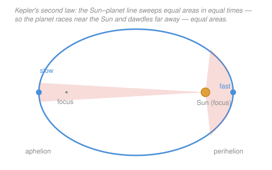

# Newtonian Mechanics · Lesson 5.1: Gravitation and Kepler's laws

> ⏱ ~15 min · Module 5: Gravitation and central forces · Builds on: [2.2 Potential energy and conservation](02-02-potential-energy-conservation.md), [1.3 Applying Newton's laws](01-03-applying-newtons-laws.md) · Unlocks: 5.2 (orbits and effective potential)

## Why this matters

Newton's real triumph wasn't $\sum\mathbf F = m\mathbf a$ — it was showing that the *same* force pulling an apple down also holds the Moon in its orbit, and that this one law reproduces Kepler's three empirical laws of planetary motion that had taken decades of naked-eye astronomy to extract. That unification is the template for all of physics. And the machinery is stuff you already own: an orbit is [1.3](01-03-applying-newtons-laws.md)'s circular motion with gravity as the centripetal force, gravitational energy is [2.2](02-02-potential-energy-conservation.md)'s conservation law with a new potential, and the escape-velocity calculation is literally the improper integral you did in [calc 2.3](../../calc-refresher/lessons/02-03-improper-integrals-and-models.md). This lesson assembles them into the physics of the solar system.

## The idea

Why doesn't the Moon fall down? It does — constantly. It's just moving sideways fast enough that by the time it "falls" a bit, the curved Earth has fallen away beneath it, and it misses. **An orbit is perpetual falling that keeps missing the ground.** Gravity doesn't need to do anything exotic to make a closed orbit; it just has to bend a fast-enough sideways motion into a curve that closes on itself.

That reframes the whole problem. For a circular orbit, gravity is simply supplying the centripetal force that [1.3](01-03-applying-newtons-laws.md) says any circular motion requires — nothing more. Set "the gravity you have" equal to "the centripetal force you need," and out drops the orbital speed. Push that one line a little further and **Kepler's third law** — that a planet's period squared is proportional to its orbital radius cubed — falls straight out of $F = ma$. No new physics; just algebra on a force you already know.

Kepler's other two laws describe the shape and pacing of real (elliptical) orbits: orbits are ellipses with the Sun at one focus, and a planet sweeps out equal areas in equal times — racing when close to the Sun, crawling when far. That second one is secretly a conservation law you'll recognize.

## The formal version

**Newton's law of universal gravitation.** Any two point masses attract along the line joining them:
$$F = \frac{GMm}{r^2}.$$
Here $M$ and $m$ are the two masses (kilograms, kg), $r$ is the distance between their centers (meters, m), $F$ is the attractive force (newtons, N), and $G = 6.67\times10^{-11}\ \mathrm{N\,m^2/kg^2}$ is the universal gravitational constant. *In words:* gravity is **attractive** and falls off as the inverse square of distance — double the separation, quarter the pull.

**Gravitational potential energy.** How much work must you do against gravity to drag a mass $m$ from distance $r$ all the way out to infinity? It's the force integrated over the climb — exactly the improper integral from [calc 2.3](../../calc-refresher/lessons/02-03-improper-integrals-and-models.md):
$$W_{r\to\infty} = \int_r^\infty \frac{GMm}{r'^2}\,dr' = GMm\left[-\frac{1}{r'}\right]_r^\infty = \frac{GMm}{r},$$
finite because gravity is a $1/r^2$ (a $p=2$) tail. Choosing $U=0$ at infinity, the potential energy at distance $r$ is minus that work already stored:
$$\boxed{U(r) = -\frac{GMm}{r}.}$$
*In words:* $U$ is **zero at infinity and negative everywhere else** — a bound mass sits in a well, and you must pay energy to climb out. ($U$ is in joules, J.)

**Circular orbits.** For a circular orbit of radius $r$ and speed $v$, gravity *is* the centripetal force $mv^2/r$ from [1.3](01-03-applying-newtons-laws.md):
$$\frac{GMm}{r^2} = \frac{mv^2}{r} \quad\Longrightarrow\quad v = \sqrt{\frac{GM}{r}}.$$
*In words:* the orbital speed is fixed by the radius alone — the orbiting mass $m$ cancels, so a feather and a satellite orbit at the same radius with the same speed.

**Kepler's third law.** The period is the circumference over the speed, $T = 2\pi r / v$. Substitute $v=\sqrt{GM/r}$ and square:
$$T = \frac{2\pi r}{\sqrt{GM/r}} = 2\pi\sqrt{\frac{r^3}{GM}} \quad\Longrightarrow\quad \boxed{T^2 = \frac{4\pi^2}{GM}\,r^3.}$$
*In words:* **period squared is proportional to radius cubed**, and the proportionality constant depends only on the central mass $M$ — so every satellite of the same body obeys the same $T^2/r^3$. (For real ellipses, $r$ becomes the semi-major axis $a$; same law.)

**Kepler's first and second laws (qualitative).**
- **First:** bound orbits are **ellipses with the central body at one focus** (a circle is the special zero-eccentricity case). We derive this in [5.2](05-02-orbits-effective-potential.md).
- **Second:** the line from the Sun to the planet **sweeps equal areas in equal times**. This is nothing but **conservation of angular momentum** (from [4.2](04-02-angular-momentum.md)): with gravity always pointing at the Sun, it exerts zero torque about the Sun, so $L$ is constant — and the area swept per unit time is exactly $L/2m$.

**Escape velocity.** The minimum surface launch speed to coast to infinity and *just* arrive with zero speed. By energy conservation ([2.2](02-02-potential-energy-conservation.md)), set total energy at the surface (radius $R$) equal to zero (the value at infinity, where both $U$ and kinetic energy vanish):
$$\tfrac{1}{2}mv_{\text{esc}}^2 - \frac{GMm}{R} = 0 \quad\Longrightarrow\quad \boxed{v_{\text{esc}} = \sqrt{\frac{2GM}{R}}.}$$
*In words:* give the mass exactly enough kinetic energy to fill in its potential well; it's independent of $m$, and it's $\sqrt 2$ times the circular orbital speed at the surface.

## Picture

The planet traces an ellipse with the Sun at one focus (the other focus is empty). The two shaded wedges have **equal area**, so the planet sweeps each in the *same* time. Near the Sun (perihelion) that area is short and fat, so the planet must cover a wide angle fast; far away (aphelion) it's long and thin, so the planet crawls. Equal areas, equal times — angular momentum conserved.

## Worked examples

**Example 1 (mechanical — an orbit is one line of algebra).** A satellite orbits Earth at radius $r = 7.0\times10^6$ m. Take $GM_\oplus = 3.98\times10^{14}\ \mathrm{m^3/s^2}$. Find its speed and period.

Speed straight from the circular-orbit condition:
$$v = \sqrt{\frac{GM_\oplus}{r}} = \sqrt{\frac{3.98\times10^{14}}{7.0\times10^6}} = \sqrt{5.69\times10^{7}} = 7.54\times10^3\ \mathrm{m/s} \approx 7.5\ \mathrm{km/s}.$$
Period is one lap at that speed:
$$T = \frac{2\pi r}{v} = \frac{2\pi (7.0\times10^6)}{7.54\times10^3} = 5.83\times10^3\ \mathrm{s} \approx 97\ \text{min}.$$
That $\approx$ 90-minute low-Earth-orbit period is the famous number: the ISS laps the planet about 16 times a day. Order of magnitude confirmed.

**Example 2 (why you'd care — escape velocity, the calc 2.3 integral cashed in).** With what speed must you launch from Earth's surface to leave for good? Use $GM_\oplus = 3.98\times10^{14}\ \mathrm{m^3/s^2}$, $R_\oplus = 6.37\times10^6$ m:
$$v_{\text{esc}} = \sqrt{\frac{2GM_\oplus}{R_\oplus}} = \sqrt{\frac{2(3.98\times10^{14})}{6.37\times10^6}} = \sqrt{1.25\times10^{8}} = 1.12\times10^4\ \mathrm{m/s} \approx 11.2\ \text{km/s}.$$
Identical to the escape velocity you computed in [calc 2.3](../../calc-refresher/lessons/02-03-improper-integrals-and-models.md) via $\sqrt{2gR}$ — because $GM_\oplus/R_\oplus^2 = g$, so $2GM_\oplus/R_\oplus = 2gR_\oplus$. Same physics, two uniforms: the finiteness of the $1/r^2$ work integral is *why* a finite launch speed suffices at all.

## Watch out

- You might think $U = -GMm/r$ is negative "because we made a sign error." No — negative is the whole point: $U=0$ is the free, infinitely-separated state, so any *bound* configuration has $U<0$. The depth $|U|$ is the energy you'd have to add to break free.
- You might think a heavier satellite needs to orbit faster or slower. It doesn't — $m$ cancels in $v=\sqrt{GM/r}$ and in $T^2 = 4\pi^2 r^3/GM$. Orbital speed and period depend on the *central* mass $M$ and the radius, never on the orbiting mass.
- You might read Kepler's third law with the wrong variable as the cube. It's (period)$^2 \propto$ (radius)$^3$, **not** the reverse. A planet twice as far out has a period $2^{3/2}\approx 2.83$ times longer, not twice.
- Escape velocity is a *speed*, not a direction or a force. Any direction (not into the ground) works, because energy is a scalar — the $\sqrt{2GM/R}$ only cares about how much kinetic energy you start with.

## One-liner

> An orbit is perpetual falling: set gravity equal to the centripetal force it supplies and Kepler's $T^2 = \frac{4\pi^2}{GM}r^3$ drops straight out of $F=ma$ — while $U=-\frac{GMm}{r}$ and $v_{\text{esc}}=\sqrt{2GM/R}$ come from the same energy bookkeeping as everything since Module 2.

## Problems

**P1 (🟢)** A satellite orbits Earth in a circle of radius $r = 8.0\times10^6$ m. Using $GM_\oplus = 3.98\times10^{14}\ \mathrm{m^3/s^2}$, find (a) its orbital speed and (b) its period in minutes. Is the period longer or shorter than the $\sim$90-min low-Earth-orbit value, and does that make sense?

**P2 (🟡)** Starting from $F = ma$ for a circular orbit, derive Kepler's third law $T^2 = \frac{4\pi^2}{GM}r^3$ from scratch. Then use it *without any numbers for $G$ or $M$*: Mars orbits the Sun at $1.52$ times Earth's orbital radius. How long is a Martian year, in Earth years?

**P3 (🔴)** A **geostationary** satellite has a period of exactly one day, $T = 24\ \text{h}$, so it hovers over a fixed spot on the equator. Using $GM_\oplus = 3.98\times10^{14}\ \mathrm{m^3/s^2}$, find its orbital radius. (Solve Kepler's third law for $r$.) Compare to Earth's radius $R_\oplus = 6.37\times10^6$ m — how many Earth-radii up is it?

Solutions

**P1** (a) Orbital speed from the circular-orbit condition:
$$v = \sqrt{\frac{GM_\oplus}{r}} = \sqrt{\frac{3.98\times10^{14}}{8.0\times10^6}} = \sqrt{4.975\times10^{7}} = 7.05\times10^3\ \mathrm{m/s} \approx 7.1\ \mathrm{km/s}.$$
(b) Period:
$$T = \frac{2\pi r}{v} = \frac{2\pi(8.0\times10^6)}{7.05\times10^3} = \frac{5.027\times10^7}{7.05\times10^3} = 7.13\times10^3\ \mathrm{s} = 119\ \text{min}\approx 2.0\ \text{h}.$$
Longer than $\sim$90 min, as it should be: this orbit is at a larger radius ($8.0$ vs $\sim6.7\times10^6$ m for LEO), and Kepler III says bigger radius means longer period.
*Check:* units of $v$: $\sqrt{\mathrm{m^3/s^2}\,/\,\mathrm{m}} = \sqrt{\mathrm{m^2/s^2}} = \mathrm{m/s}$. ✓ And $7.1$ km/s is a hair below the Example-1 LEO speed ($7.5$ km/s) — higher orbits are slower, consistent. ✓

**P2** *Derivation.* For a circular orbit, gravity supplies the centripetal force:
$$\frac{GMm}{r^2} = \frac{mv^2}{r} \;\Rightarrow\; v^2 = \frac{GM}{r}.$$
The period is one circumference per speed, $T = 2\pi r/v$, so $T^2 = 4\pi^2 r^2/v^2$. Substitute $v^2 = GM/r$:
$$T^2 = \frac{4\pi^2 r^2}{GM/r} = \frac{4\pi^2}{GM}\,r^3. \qquad\checkmark$$
*Mars.* Both planets orbit the *same* Sun, so $\frac{4\pi^2}{GM}$ is identical for both and cancels in a ratio:
$$\frac{T_{\text{Mars}}^2}{T_{\text{Earth}}^2} = \frac{r_{\text{Mars}}^3}{r_{\text{Earth}}^3} = (1.52)^3 = 3.51.$$
So $T_{\text{Mars}} = \sqrt{3.51}\;T_{\text{Earth}} = 1.87\ \text{Earth years}.$
*Check:* the real Martian year is $1.88$ Earth years — spot on, and it came out with no $G$, no $M$, no unit conversions, just a ratio. ✓

**P3** Solve Kepler's third law for $r$:
$$r^3 = \frac{GM_\oplus\,T^2}{4\pi^2}.$$
Convert the period: $T = 24\ \text{h} = 86{,}400\ \text{s}$, so $T^2 = 7.465\times10^{9}\ \mathrm{s^2}$. Then
$$r^3 = \frac{(3.98\times10^{14})(7.465\times10^{9})}{4\pi^2} = \frac{2.971\times10^{24}}{39.48} = 7.53\times10^{22}\ \mathrm{m^3},$$
$$r = (7.53\times10^{22})^{1/3} = 4.22\times10^{7}\ \mathrm{m} \approx 42{,}000\ \text{km}.$$
In Earth-radii: $r/R_\oplus = 4.22\times10^7 / 6.37\times10^6 = 6.6$, so the satellite sits about $6.6$ Earth-radii from Earth's center (roughly $5.6$ radii, or $\sim36{,}000$ km, above the surface).
*Check:* the accepted geostationary radius is $42{,}164$ km — agreement to better than $1\%$. (The tiny excess is because a sidereal day is $86{,}164$ s, slightly less than $24$ h.) Order of magnitude: it should be well above LEO ($r\sim7\times10^6$ m) since a 24-h period is far longer than 90 min — and it is, by a factor of $\sim6$. ✓

## Flashback

**From Lesson 2.2 (Potential energy and conservation):** A roller-coaster car is released from rest at the top of a frictionless track, at height $h_1 = 20$ m above the ground. Ignoring friction and air resistance, what is its speed as it passes a point $h_2 = 5$ m above the ground?

Solution

With no friction, mechanical energy is conserved: $\tfrac12 m v_1^2 + mgh_1 = \tfrac12 m v_2^2 + mgh_2$. It starts from rest ($v_1 = 0$), and $m$ cancels:
$$gh_1 = \tfrac12 v_2^2 + gh_2 \;\Rightarrow\; v_2 = \sqrt{2g(h_1 - h_2)} = \sqrt{2(9.8)(20-5)} = \sqrt{294} = 17.1\ \mathrm{m/s}.$$
Only the *drop* $h_1 - h_2 = 15$ m matters, not the path — that path-independence is what makes gravity a conservative force.
*Check:* units $\sqrt{(\mathrm{m/s^2})(\mathrm m)} = \mathrm{m/s}$. ✓ If it had fallen all the way to the ground ($h_2=0$) the speed would be $\sqrt{2(9.8)(20)} = 19.8$ m/s — faster, as expected for a longer drop. ✓

## Connections

- **Backward:** the circular-orbit condition is [1.3](01-03-applying-newtons-laws.md)'s centripetal force $mv^2/r$ with gravity plugged in for the force; escape velocity is [2.2](02-02-potential-energy-conservation.md)'s energy conservation with $U=-GMm/r$; Kepler's second law is [4.2](04-02-angular-momentum.md)'s angular-momentum conservation in disguise. Nothing here is new physics — it's Modules 1, 2, and 4 aimed at the sky.
- **Forward:** [5.2](05-02-orbits-effective-potential.md) combines energy and angular momentum into the *effective potential*, which explains why bound orbits have both a closest and a farthest approach (perihelion and aphelion) and derives Kepler's first law — that the orbits are ellipses.
- **Sideways (calculus):** $U = -GMm/r$ and escape velocity are the physics half of [calc 2.3](../../calc-refresher/lessons/02-03-improper-integrals-and-models.md)'s escape-energy integral — a convergent improper integral is exactly a finite potential well, and both say the same thing: a $1/r^2$ force is weak enough at large $r$ that escaping costs only finite energy.
