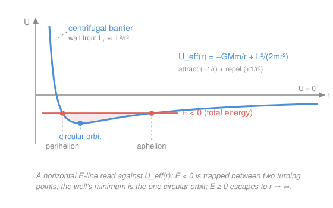

# Newtonian Mechanics · Lesson 5.2: Orbits and the effective potential

> ⏱ ~15 min · Module 5: Gravitation and central forces · Builds on: [5.1 Gravitation and Kepler's laws](05-01-gravitation-kepler.md), [4.2 Angular momentum and rolling](04-02-angular-momentum.md) · Unlocks: analytical-mechanics, relativity (course complete)

## Why this matters

[5.1](05-01-gravitation-kepler.md) gave you circular orbits and Kepler's laws, but the sky is full of ellipses, comets on hairpin flybys, and probes flung out of the solar system entirely. What decides which one you get? Remarkably, two numbers: the total energy $E$ and the angular momentum $L$. The trick that unlocks this is to collapse the two-dimensional orbit into a **one-dimensional** problem — the in-and-out motion of the radius $r$ — governed by a single curve, the *effective potential*. Once you can draw that curve and lay a horizontal energy line across it, you read off the entire orbit: bound or unbound, its closest and farthest approach, whether it's a circle. It's the potential-energy-curve skill from [2.2](02-02-potential-energy-conservation.md), promoted to run the solar system — and the natural doorway into `analytical-mechanics`.

## The idea

A planet feels a force pointing straight at the Sun — a **central force**. Two consequences fall out immediately. First, a force with no sideways component exerts no torque about the Sun, so **angular momentum is conserved** (this is [4.2](04-02-angular-momentum.md)'s law, now doing real work): the orbit stays flat in a plane, and the planet sweeps area at a fixed rate. Second — and this is the payoff — because $L$ is locked, the planet's *angular* motion is completely determined by wherever its radius happens to be. That leaves only one thing still free to move: $r$ itself.

So picture the planet not as a dot circling in 2-D, but as a bead sliding on a wire that runs radially in and out. The bead sits in a landscape — a valley wall — and its energy is a horizontal line. Where the line meets the wall, the bead stops and turns around; between two such walls it rolls back and forth. That valley is the **effective potential** $U_{\text{eff}}(r)$, and it has two pieces. Far out, real gravity pulls the bead *inward* (downhill toward the Sun). But close in, a wall rises up and shoves it *back out* — the **centrifugal barrier**. That wall isn't a new force; it's the planet's own sideways speed, which conservation of $L$ forces to blow up as $r$ shrinks. That barrier is exactly why a planet with any angular momentum never falls into the Sun, no matter how hard gravity pulls.

## The formal version

Let $G = 6.674\times10^{-11}\ \mathrm{N\,m^2/kg^2}$ be the gravitational constant, $M$ the central mass (kg), $m$ the orbiting mass (kg), $r$ the separation (m), $\theta$ the angular position (rad), and dots time derivatives. Angular momentum about the center is

$$L = m r^2 \dot\theta \quad (\mathrm{kg\,m^2/s}), \qquad L = \text{constant (central force)}.$$

*In words:* spin the planet fast when it's close, slow when it's far — $r^2\dot\theta$ stays fixed. The total energy is kinetic plus gravitational potential, and in polar coordinates the speed splits into a radial part $\dot r$ and a tangential part $r\dot\theta$:

$$E = \tfrac12 m\big(\dot r^2 + r^2\dot\theta^2\big) - \frac{GMm}{r}.$$

Now use $L$ to evict $\dot\theta$: from $L = mr^2\dot\theta$ we get $r^2\dot\theta^2 = L^2/(m^2 r^2)$, so $\tfrac12 m\, r^2\dot\theta^2 = L^2/(2mr^2)$. Substituting,

$$\boxed{\,E = \tfrac12 m\dot r^2 + U_{\text{eff}}(r), \qquad U_{\text{eff}}(r) = -\frac{GMm}{r} + \frac{L^2}{2mr^2}\,}$$

*In words:* the full 2-D problem is now a **1-D** particle of "position" $r$ moving in the potential $U_{\text{eff}}$, energy conserved. The first term $-GMm/r$ is honest gravitational attraction (a well, deep near the center). The second term $+L^2/(2mr^2)$ is the **centrifugal barrier**: positive, and blowing up faster as $r\to0$, so it always wins at small $r$ and walls the particle off from the origin.

**Turning points.** Radial motion stops where $\dot r = 0$, i.e. where

$$E = U_{\text{eff}}(r).$$

*In words:* the closest and farthest radii are exactly where the horizontal energy line crosses the $U_{\text{eff}}$ curve — identical to reading turning points off the plain potential curve in [2.2](02-02-potential-energy-conservation.md). The whole orbit's radial range is trapped between them.

**Orbit type from the sign of $E$** (with $U_{\text{eff}}\to 0^-$ as $r\to\infty$):

| Energy | Turning points | Orbit |
|---|---|---|
| $E = U_{\text{eff,min}}$ | one radius (both coincide) | **circle** |
| $U_{\text{eff,min}} < E < 0$ | two ($r_{\min}$, $r_{\max}$) | **ellipse** (bound) |
| $E = 0$ | one (perihelion only) | **parabola** (escapes) |
| $E > 0$ | one (perihelion only) | **hyperbola** (flyby) |

*In words:* $E<0$ can't reach $r=\infty$, so it's **bound** and bounces between two radii; $E\ge0$ has enough energy to climb out to infinity, so it swings in once and leaves forever. A **circular** orbit sits right at the bottom of the well, $dU_{\text{eff}}/dr = 0$, where there's no radial motion at all.

## Picture

## Worked examples

**Example 1 (mechanical — the well's minimum *is* the circular orbit).** Find the radius where $U_{\text{eff}}$ bottoms out, and show it reproduces [5.1](05-01-gravitation-kepler.md)'s circular-orbit force balance. Differentiate and set to zero:

$$\frac{dU_{\text{eff}}}{dr} = \frac{GMm}{r^2} - \frac{L^2}{mr^3} = 0 \;\;\Rightarrow\;\; \frac{GMm}{r^2} = \frac{L^2}{mr^3} \;\;\Rightarrow\;\; r_c = \frac{L^2}{GMm^2}.$$

Now read the balance condition. With $L = mr v$ (angular momentum of a tangential speed $v$), the right side is $L^2/(mr^3) = m^2r^2v^2/(mr^3) = mv^2/r$. So the condition is

$$\frac{GMm}{r^2} = \frac{mv^2}{r},$$

which is exactly "gravity supplies the centripetal force" — the equation you solved circular orbits with in 5.1. The minimum of $U_{\text{eff}}$ and Newton's $\mathbf F = m\mathbf a$ circular orbit are the same statement, reached two different ways.

**Example 2 (why you'd care — perihelion and aphelion as two roots).** Work in a unit system where $GMm = 1$ and $L^2/(2m) = 1$, and take a bound energy $E = -0.16$. Turning points solve $E = U_{\text{eff}}(r)$; multiply through by $r^2$:

$$E r^2 + GMm\, r - \frac{L^2}{2m} = 0 \;\;\Rightarrow\;\; -0.16\,r^2 + r - 1 = 0.$$

The quadratic gives $r = \dfrac{1 \pm \sqrt{1 - 0.64}}{0.32} = \dfrac{1 \pm 0.6}{0.32}$, so $r_{\text{peri}} = 1.25$ and $r_{\text{aph}} = 5.0$ — the two crossings you see in the figure. Their sum is $r_{\text{peri}} + r_{\text{aph}} = 6.25 = -GMm/E = -1/(-0.16)$, which (next problem) is the ellipse's $2a$. One quadratic, and the orbit's inner and outer edges drop out.

## Watch out

- You might think the centrifugal barrier is a real outward force pushing the planet away from the Sun. It isn't — there's only gravity, pulling in. The barrier is the planet's *tangential inertia* (its sideways motion, fixed by $L$) reappearing inside the radial equation. Call it "fictitious" bookkeeping that happens to be exactly right.
- You might think $E<0$ means something exotic. It's only measured relative to the convention $U(\infty)=0$: negative just means "not enough energy to coast out to infinity," i.e. bound. Escape is the break-even line $E=0$, matching the escape-velocity calculation from [calc-refresher 2.3](../../calc-refresher/lessons/02-03-improper-integrals-and-models.md).
- You might think every central force has stable circular orbits. The $1/r^2$ force does because $U_{\text{eff}}$ has a genuine *minimum* ($d^2U_{\text{eff}}/dr^2 > 0$ at $r_c$). An attraction falling off faster than $1/r^3$ makes the barrier lose — no minimum, no stable orbit — which is why the inverse-square law is special.

## One-liner

> Freeze the angular motion with conserved $L$, and a planet becomes a bead in the 1-D valley $U_{\text{eff}}(r)$: lay its energy line across the valley and the orbit — bound or free, its perihelion and aphelion — is wherever the line meets the wall.

## Problems

**P1 (🟢)** The effective-potential curve in the figure has minimum value $U_{\text{eff,min}} = -0.25$ (same units as Example 2). For each total energy, say how many radial turning points the orbit has, whether it is bound, and name the orbit shape: (a) $E = -0.25$, (b) $E = -0.10$, (c) $E = 0$, (d) $E = +0.20$.

**P2 (🟡)** Starting from $U_{\text{eff}}(r) = -\dfrac{GMm}{r} + \dfrac{L^2}{2mr^2}$, find the circular-orbit radius $r_c$ by minimizing, and confirm it is a *stable* minimum (not a maximum) by checking the second derivative. Then verify that $r_c = L^2/(GMm^2)$ has units of length.

**P3 (🔴, Boss-5)** Use the effective potential to explain why a bound orbit ($E<0$) must have *both* a closest approach and a farthest approach — never just one. Then, treating the turning points as the two roots of $E = U_{\text{eff}}(r)$, show that the total energy of an elliptical orbit is

$$E = -\frac{GMm}{2a},$$

where $2a = r_{\text{peri}} + r_{\text{aph}}$ is the major axis.

Solutions

**P1** Read the horizontal line $E$ against the curve (minimum at $-0.25$, rising to a barrier on the left, approaching $0^-$ on the right).

- (a) $E = -0.25 = U_{\text{eff,min}}$: the line just touches the bottom of the well — the two turning points merge into **one** radius. Bound. **Circular orbit.**
- (b) $E = -0.10$, with $-0.25 < E < 0$: the line cuts the well at **two** radii. Bound. **Ellipse.**
- (c) $E = 0$: the line lies along the $r$-axis; it meets the curve once (a perihelion) but the curve only *approaches* $0$ as $r\to\infty$, so the outer "turning point" is at infinity — **one** finite turning point. Not bound. **Parabola** (marginal escape).
- (d) $E = +0.20 > 0$: the line sits above the whole right side, crossing only the inner barrier — **one** turning point. Not bound. **Hyperbola** (flyby).

*Check:* bound $\iff E<0 \iff$ two finite turning points; the boundary $E=0$ is escape; $E>0$ is unbound — exactly the sign-of-$E$ table. ✓

**P2** Minimize: $\dfrac{dU_{\text{eff}}}{dr} = \dfrac{GMm}{r^2} - \dfrac{L^2}{mr^3} = 0 \Rightarrow GMm\, r = \dfrac{L^2}{m} \Rightarrow r_c = \dfrac{L^2}{GMm^2}.$

Second derivative:

$$\frac{d^2U_{\text{eff}}}{dr^2} = -\frac{2GMm}{r^3} + \frac{3L^2}{mr^4}.$$

Evaluate at $r_c$ by substituting $L^2 = GMm^2 r_c$:

$$\frac{d^2U_{\text{eff}}}{dr^2}\Big|_{r_c} = -\frac{2GMm}{r_c^3} + \frac{3(GMm^2 r_c)}{m r_c^4} = -\frac{2GMm}{r_c^3} + \frac{3GMm}{r_c^3} = +\frac{GMm}{r_c^3} > 0.$$

Positive, so it's a genuine minimum — the circular orbit is **stable** (a small nudge in $r$ oscillates rather than runs away).

*Units:* $[L] = \mathrm{kg\,m^2/s}$, so $[L^2] = \mathrm{kg^2 m^4/s^2}$. And $[GMm^2] = (\mathrm{m^3\,kg^{-1}s^{-2}})(\mathrm{kg})(\mathrm{kg^2}) = \mathrm{kg^2 m^3/s^2}$. Ratio: $\dfrac{\mathrm{kg^2 m^4/s^2}}{\mathrm{kg^2 m^3/s^2}} = \mathrm{m}$. ✓ A length, as an orbital radius must be.

**P3** *Both approaches.* At a radial turning point $\dot r = 0$, so $E = U_{\text{eff}}(r)$ and the radial kinetic energy $\tfrac12 m\dot r^2 = E - U_{\text{eff}}(r)$ must be $\ge 0$ everywhere the planet actually goes — the planet lives only where the energy line sits *above* the curve. For $E<0$, the line is below the $r\to\infty$ tail (which approaches $0$), so the planet cannot reach large $r$: there is an outer wall (aphelion). The centrifugal barrier is an inner wall it cannot pass either (perihelion). Trapped between an inner and an outer wall, the radius oscillates — **two** turning points, a closest *and* a farthest approach. (Contrast $E\ge0$: the outer wall disappears, leaving a single perihelion and an escape to infinity.)

*Energy of the ellipse.* The turning points solve $E = -\dfrac{GMm}{r} + \dfrac{L^2}{2mr^2}$. Multiply by $r^2$ and rearrange into a quadratic in $r$:

$$E\,r^2 + GMm\, r - \frac{L^2}{2m} = 0.$$

For $E<0$ this has two positive roots $r_{\text{peri}}, r_{\text{aph}}$. By Vieta's formula the sum of the roots is $-\,(\text{linear coeff})/(\text{quadratic coeff})$:

$$r_{\text{peri}} + r_{\text{aph}} = -\frac{GMm}{E}.$$

The major axis of an ellipse is $2a = r_{\text{peri}} + r_{\text{aph}}$, so $2a = -GMm/E$, which rearranges to

$$E = -\frac{GMm}{2a}.$$

*Check:* $a>0$ and $GMm>0$ force $E<0$ — bound, as required, and $E$ depends only on the size $a$, not the shape, matching Kepler's third law $T^2 \propto a^3$ from [5.1](05-01-gravitation-kepler.md). Against Example 2 ($GMm=1$, $E=-0.16$): $2a = -1/(-0.16) = 6.25 = 1.25 + 5.0 = r_{\text{peri}} + r_{\text{aph}}$. ✓

## Flashback

**From Lesson 5.1 (Gravitation and Kepler's laws):** A satellite is in a circular orbit of radius $r$ around Earth with period $T$. Mission control raises it to a new circular orbit of radius $4r$. By what factor does its orbital period change?

Solution

Kepler's third law for circular orbits comes from gravity supplying the centripetal force, $\dfrac{GM_\oplus m}{r^2} = \dfrac{m v^2}{r}$ with $v = 2\pi r/T$. Solving gives $T^2 = \dfrac{4\pi^2}{GM_\oplus}\,r^3$, i.e. $T \propto r^{3/2}$. Scaling $r \to 4r$:

$$\frac{T_{\text{new}}}{T} = \left(\frac{4r}{r}\right)^{3/2} = 4^{3/2} = 8.$$

The period grows by a factor of **8**.

*Check:* $4^{3/2} = (\sqrt4)^3 = 2^3 = 8$, and a higher orbit should be slower (longer period) — consistent. ✓

## Connections

- **Backward:** this is [2.2](02-02-potential-energy-conservation.md)'s "read the potential curve for turning points and equilibria" applied verbatim — only the curve is now $U_{\text{eff}}$, and its equilibrium (the minimum) is a circular orbit. The conserved $L$ that builds the barrier is [4.2](04-02-angular-momentum.md)'s angular momentum, and the well's minimum reproduces [5.1](05-01-gravitation-kepler.md)'s circular-orbit force balance.
- **Forward:** reducing a 2-D problem to a 1-D effective potential by using a conserved quantity to eliminate a coordinate is the signature move of `analytical-mechanics` — there the conserved $L$ is a "cyclic-coordinate momentum" and $U_{\text{eff}}$ falls straight out of the Lagrangian. General relativity then adds one more term to this same $U_{\text{eff}}$, and that single correction predicts Mercury's perihelion precession and the innermost stable orbit of a black hole.
- **Sideways (math):** the escape threshold $E=0$ is the finite-vs-infinite dichotomy of [calc-refresher 2.3](../../calc-refresher/lessons/02-03-improper-integrals-and-models.md) — a $1/r^2$ force has a convergent work-to-infinity integral, so escape costs only finite energy, and $E\ge0$ pays it. Reading orbit shape off $U_{\text{eff}}$ is the same graphical calculus (find critical points, classify with the second derivative) that governs every optimization problem.
