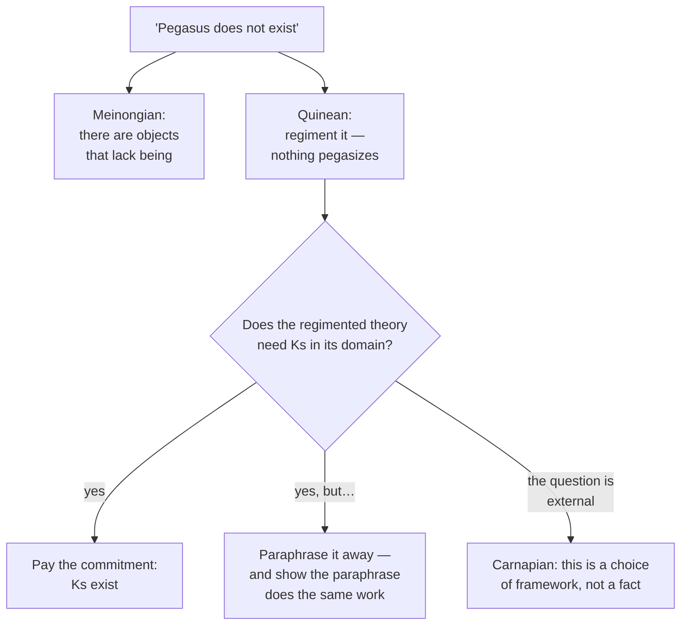

# Metaphysics · Lesson 1.1: Existence and ontological commitment

> ⏱ ~15 min · Module 1: What there is · Builds on: nothing — this is the first lesson · Unlocks: [1.2 Abstract objects](01-02-abstract-objects.md)

## Why this matters

Metaphysics opens with a question that sounds unanswerable: what is there? Quine's contribution was to make it tractable — not by settling what exists, but by fixing a **method** for reading an inventory off a theory, so that two people who disagree can at least locate where. Every later dispute in this course runs through that method. Whether numbers exist, whether there are universals, whether there are temporal parts or possible worlds: each is a fight about what some theory quantifies over, and whether the commitment can be paraphrased away.

## The idea

Start with the trap. Someone says, "Pegasus does not exist." If the sentence is about Pegasus, there has to be something for it to be about — so denying Pegasus's existence seems to presuppose it. The medievals felt this; Meinong answered it by admitting a realm of objects that have no being but can still be spoken of.

Quine's reply is that the sentence was never about a thing at all. Rewrite it as: *nothing pegasizes* — there is no x such that x is a winged horse captured by Bellerophon. Now nothing is presupposed. The apparent commitment came from the grammar of names, and regimenting the sentence into quantifiers dissolves it.

That gives the criterion. **A theory is committed to whatever must be in the range of its variables for the theory to be true.** Not what it mentions, not what its names seem to pick out — what its *quantifiers* must range over. Or, in the slogan: **to be is to be the value of a bound variable.**

So an ontological dispute has exactly two honest moves: accept the commitment, or **paraphrase** the sentence into one that does without it and does the same work. The second move is the engine of this whole module.

## The argument

**Quine's criterion.** A theory T is ontologically committed to entities of kind K if and only if some sentence of T, regimented into first-order logic, cannot be true unless the domain of quantification contains a K.

In words: put your theory in the form "there is an x such that…", and look at what the x's have to be.

**The two responses to a commitment you dislike:**

> **Option 1 — pay it.** Accept that the entities exist. The cost is ontological: your inventory grows.
> **Option 2 — paraphrase.** Produce a sentence that does the same explanatory and inferential work without quantifying over them. The cost is that the paraphrase must actually work — it must preserve the original's truth conditions and its role in inference, and it must not smuggle the entity back in under another name.

A paraphrase is not a synonym and does not have to feel natural. "There are three chairs in the room" paraphrases into a sentence quantifying only over chairs, not over the number three. But "the number of quark generations is odd" resists: the arithmetic is doing work no chair-talk reproduces. Where paraphrase strains is exactly where the interesting disputes live, which is [1.2](01-02-abstract-objects.md)'s subject.

**Carnap's challenge, and why the criterion does not settle everything.** Carnap distinguished questions asked *inside* a framework of discourse — "is there a prime between 8 and 12?" — from questions asked *about* the framework: "are there really numbers at all?" Internal questions have answers by the framework's own rules. External questions, he argued, are not factual at all; they are practical questions about whether to adopt the framework.

Quine rejected the sharp line — he held that our theories form one web, with no clean seam between adopting a framework and asserting what is in it. **Whether the seam exists is a live dispute**, and it decides whether the rest of this course is a series of substantive questions or a series of practical ones. The course proceeds as if the questions are substantive, and flags where a Carnapian would object.

## Map of positions

## Worked examples

**Example 1 (mechanical — reading commitment off a sentence).** "There are three ways to solve this equation, and one of them is elegant."

Regiment it. The quantifier ranges over *ways* — and the second clause predicates something of one of them, so the ways have to be in the domain for the sentence to be true. By the criterion, the speaker is committed to ways.

Now try to paraphrase: "Three methods solve it" replaces ways with methods, which is a synonym, not a paraphrase — the commitment travels. Try instead: "this equation can be solved by substitution, by factoring, and by completing the square, and the third is elegant." Now the quantification is over procedures already in the inventory, and "elegant" attaches to a named one. Whether that counts as doing the same work is the real question; if you want to say two people found *the same way*, you may need the ways back.

**Example 2 (why you'd care — a commitment that will not paraphrase away).** A physicist writes: "Numbers are a useful fiction — a bookkeeping device, nothing more. Still, the number of quark generations is odd, which is why the symmetry works out."

The first sentence denies the commitment; the second makes it. "The number of quark generations is odd" cannot be true unless there is a number that is odd — the predicate attaches to a number, not to quarks. A nominalist has to supply a paraphrase, and the natural one — "there are exactly three quark generations" — is available here, since "three" can be written out in pure logic (there are x, y, z, pairwise distinct, each a generation, and any generation is one of them). That paraphrase kills *this* commitment.

But "odd" was doing further work — it was a step in an argument about symmetry, and the argument used arithmetic. This is the **indispensability** point that [1.2](01-02-abstract-objects.md) develops: the question is never whether one sentence can be rewritten, but whether the entities can be eliminated from the whole theory without losing what the theory does. The physicist's position is not yet incoherent, but it has a debt.

## Watch out

- **Commitment is not a matter of what a theory mentions.** A theory can name Pegasus and be committed to nothing; a theory can avoid the word "number" and be committed to numbers.
- **A paraphrase must earn its keep.** Producing a sentence that avoids the quantifier is easy; producing one that supports the same inferences is not. Always ask what the original was *doing*.
- **You might think the criterion tells you what exists.** It tells you what a theory *says* exists. Choosing the theory is a separate matter, and Quine's own answer — go with our best overall science — is itself contested.
- **"Exists" and "is real" can come apart in some traditions.** The Meinongian distinguishes being from existence; a neo-Aristotelian may distinguish modes of being. Quine's criterion assumes one univocal existential quantifier, and that assumption is itself a position, not a neutral starting point.

## One-liner

> To be is to be the value of a bound variable — so an ontological dispute is a dispute about what your best theory has to quantify over, once you can no longer paraphrase it away.

## Problems

**P1 (🟢) *(Exegetical.)*** For each sentence, say what Quine's criterion commits the speaker to, and give a paraphrase that avoids the commitment if one is available. One or two sentences each.

(a) "There are several properties that all electrons share."
(b) "Sherlock Holmes is more famous than any real detective."
(c) "There is a gap in the argument on page four."

**P2 (🟡) *(Exegetical (a) · Evaluative (b).)*** An invented passage from a popular-science column:

> "Talk of 'species' is a convenience — nature contains organisms, not kinds. Of course, the average number of species lost per decade has tripled since 1970, and three species on this island are found nowhere else, which is why the conservation case is overwhelming."

(a) Identify each quantifier the passage needs and say which of them the opening sentence disowns. (b) Can the commitments be paraphrased away without weakening the conservation argument? 150 words or fewer, any verdict, provided you say what work the quantification was doing.

**P3 (🔴, optional) *(Evaluative.)*** A Carnapian says the question "are there numbers?" is not factual: inside arithmetic the answer is trivially yes, and outside it the question is only whether to adopt arithmetic, which is a practical choice. In 150 words, state the strongest Quinean reply, and say what the dispute between them turns on. Any verdict; the crux is what is graded.

Solutions

**P1** *(Exegetical — strict.)*

**Must hit, strict:**
- (a) Commitment to **properties** (universals or their surrogates): the quantifier ranges over things electrons share. Paraphrase attempt: "all electrons are negatively charged, have spin one-half, and…" — a list of predications quantifying only over electrons. Note the cost: you can no longer say "several," so the generalization over properties is lost, which is precisely [1.3](01-03-universals-the-realists-case.md)'s problem.
- (b) **No commitment to Holmes.** Regiment as Quine does: nothing Holmesizes. But the comparison to real detectives is doing work — the natural paraphrase quantifies over *stories* or over people's beliefs ("more people have heard of Holmes than of any real detective"), which is available and cheap.
- (c) Commitment to a **gap** — an absence, quantified over as though it were a thing. Paraphrase: "the argument on page four does not establish its conclusion, because no premise connects X to Y." Easy, and it shows the criterion catching a commitment nobody wanted.

**Wrong turns:** saying (b) commits the speaker to Holmes because the name appears — the criterion reads quantifiers, not names; treating a synonym swap in (a) ("several features") as a paraphrase.

**Model answer:** as above.

---

**P2** *(a) exegetical — strict; (b) evaluative — any verdict.*

**Must hit, strict (a):** three quantifications — over **organisms** (kept), over **species** ("three species on this island," "species lost"), and over **numbers** (the average number, tripled). The opening sentence disowns species; it says nothing about numbers, which the passage also needs.

**Must hit, any verdict (b):** state what the quantification is doing — the conservation argument needs *counting* of kinds and a *rate of change*, so any paraphrase must preserve both. Name a candidate paraphrase (e.g. quantify over organisms plus a similarity relation, or treat species talk as a device for grouping) and say what it costs. Either verdict passes if the work is named.

**Wrong turns:** answering (b) by asserting that species are or are not real, which is not what was asked; ignoring the numerical commitment because the passage's disclaimer only mentioned species.

**Model answer (b), one of several:** The species commitment can in principle be paraphrased — "three groups of organisms on this island resemble each other more than any of them resembles anything elsewhere" — but the paraphrase has to be doing the counting, and once you count groups you are quantifying over groups. The rate claim is worse: "tripled since 1970" needs a ratio of two counts, so numbers are harder to shed than kinds. The conservation argument survives either way, since it needs only that the organisms and their distributions are real, but the column's confident "nature contains organisms, not kinds" is not free.

---

**P3** *(Evaluative — any verdict; the crux is what is graded.)*

**Must hit:** state the Quinean reply — there is no principled seam between adopting a framework and asserting what it contains, because our theories form one web tested as a whole, so "are there numbers?" is a question about our best total theory and is as factual as any other; then name the crux. The crux is whether the internal/external distinction can be drawn in a principled way — equivalently, whether there is a neutral standpoint from which to ask the external question at all.

**Wrong turns:** restating each side without locating the crux; treating the dispute as verbal without applying the test for a verbal dispute (`philosophical-method` 3.2) — if you claim it is verbal, you have to show the parties agree on every non-linguistic fact, which is exactly what Quine denies.

**Model answer, one of several:** The Quinean grants the internal/external contrast as a matter of emphasis but denies it marks a difference in kind. Frameworks are not chosen before inquiry and then filled in; they are parts of a theory that faces experience as a whole, and the pragmatic considerations Carnap calls practical — simplicity, strength, fit — are the same ones we use to choose any theory. So the external question is the ordinary question of which total theory to accept. The crux: whether a framework can be adopted without asserting anything, which Carnap needs and Quine denies. Someone who thinks the choice of a language is one thing and belief about the world another will find Carnap's line stable; someone who thinks language choice already encodes commitments will not.

## Connections

- **Forward:** [1.2](01-02-abstract-objects.md) runs the criterion on the hardest case, numbers, where paraphrase is most strained; [1.3](01-03-universals-the-realists-case.md) and [1.4](01-04-nominalism-and-tropes.md) do the same for properties.
- **Sideways:** the quantifiers themselves belong to [`mathematical-logic`](../../mathematical-logic/syllabus.md) (2.1–2.3), which this course uses informally; whether "exists" means one thing everywhere is taken up in `philosophy-of-language-and-logic`.
- **Method:** the paraphrase move is a distinction drawn to dissolve a dispute — [`philosophical-method`](../../philosophical-method/syllabus.md) 3.2 — and P3 turns on that lesson's test for a verbal dispute.
