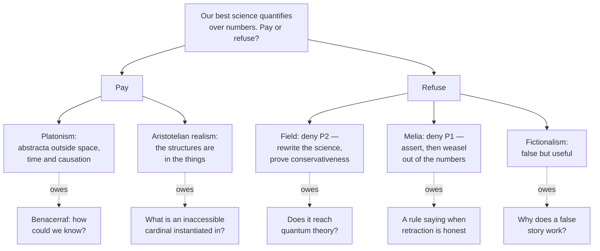

# Metaphysics · Lesson 1.2: Abstract objects

> ⏱ ~15 min · Module 1: What there is · Builds on: [1.1 Existence and ontological commitment](01-01-existence-and-ontological-commitment.md) · Unlocks: [1.3 Universals: the realist's case](01-03-universals-the-realists-case.md)

## Why this matters

[1.1](01-01-existence-and-ontological-commitment.md) left a physicist holding a debt: he called numbers a useful fiction and then reasoned with them. Here is the bill. Numbers are the test case for Quine's criterion because the stakes are highest there — our best physical theories are written in mathematics, so if quantifying over something obliges you to believe in it, physics obliges you to believe in numbers. And numbers, unlike quarks, are nowhere and do nothing. That combination — indispensable to our best knowledge, yet causally cut off from us — is the sharpest problem in ontology, and the four moves invented to escape it (reformulate, weasel, fictionalize, relocate) recur for universals, possible worlds and properties all through this course.

## The idea

First, what is an "abstract object"? Nobody has a clean definition; there are two working criteria, and they disagree at the edges.

**The location criterion.** A concrete thing occupies a region of space and time; an abstract thing does not. The Eiffel Tower is in Paris; the number 7 is not in Paris, or anywhere.

**The causal criterion.** A concrete thing can cause and be caused; an abstract thing is causally inert. Kick the Tower and something happens; nothing you can do to the number 7 makes any difference to it, and it makes none to you.

Each criterion has awkward cases, and they are not the same cases.

- **The equator** is a circle on the Earth's surface, so location says concrete; it has no mass and does no work, so causation says abstract.
- **God**, in classical theism, is not in space or time but is the cause of everything — location says abstract, causation emphatically says not.
- **The Ruy Lopez**, the chess opening itself rather than any game of it, is unlocated; but it was invented in the sixteenth century and it demonstrably makes players do things. An abstract object with a date of birth strains both criteria.

That the line is blurry is not a technicality to be cleaned up later. Most of the positions below work by *moving the line* — by arguing that the entities science needs are not abstract in the sense that makes them problematic.

## The argument

### A. The Quine–Putnam indispensability argument

> **P1.** We ought to be ontologically committed to all and only the entities that are indispensable to our best scientific theories.
> **P2.** Mathematical entities are indispensable to our best scientific theories.
> **∴ C.** We ought to be ontologically committed to mathematical entities.

In words: take your best physics, write it out honestly, and believe in whatever it cannot do without — and it cannot do without numbers.

P1 is not arbitrary. It rests on two theses Quine defended independently: **naturalism**, that science and not some prior philosophy is the measure of what there is; and **confirmational holism**, that theories face evidence as wholes, so an experiment confirming general relativity confirms the whole package, differential geometry included. You cannot, on this view, believe the physics and disbelieve its mathematics — they were confirmed together.

Notice the shape: this is [1.1](01-01-existence-and-ontological-commitment.md)'s criterion plus a premise about *which* theory to run it on. Anyone who wants out must deny P1, deny P2, or accept a conclusion about abstract objects.

**Denying P2 — Field's nominalism.** Hartry Field (*Science Without Numbers*, 1980) took the hard road: show mathematics is dispensable by doing the science without it. Two separate deliverables are required.

1. *Reformulation.* Produce versions of scientific theories quantifying only over concrete things. Field's specimen was Newtonian gravitational theory, rebuilt over spacetime points and regions using comparative relations (betweenness, congruence) instead of real-valued coordinates, in the style of Hilbert's synthetic geometry.
2. *Conservativeness.* Prove that adding mathematics to a nominalistic theory yields no nominalistic conclusions it did not already have. If that holds, mathematics is a shortcut rather than a source: useful without being true.

The open question is scaling. One nineteenth-century theory is not the whole of science, and quantum mechanics, whose states live in a space of functions, is the standing challenge.

**Denying P1 — Melia's weaseling.** Joseph Melia's reply does no rewriting at all. He grants that mathematics is indispensable *as a way of representing* the concrete world, and denies that asserting a theory commits you to everything it quantifies over. We routinely say something and then retract part of it — "everything the guidebook says is true, except the bit about the ghost" — without offering any replacement text. The nominalist, he says, may assert physics in full and then withhold the mathematical part. Quine's two honest moves become three, and the third needs no paraphrase. What Melia owes is a rule: when is a retraction legitimate rather than a way of having your theory and denying it too?

### B. Benacerraf's dilemma

Accept the conclusion instead and the second argument comes due. Paul Benacerraf ("Mathematical Truth", 1973) argued that two things we want from an account of mathematics pull apart.

> **P1.** An account of mathematical *truth* should give mathematical sentences the same kind of semantics as ordinary ones — "there are three perfect numbers less than 500" treated like "there are three cities older than Rome", so its truth requires objects that satisfy it.
> **P2.** An account of mathematical *knowledge* must connect the knower to what makes the belief true; Benacerraf's version required a causal relation.
> **P3.** Abstract objects stand in no causal relations.
> **∴ C.** No account satisfies both: the semantics that makes mathematics true makes its knowledge inexplicable, and the epistemologies that explain the knowledge (formalist, conventionalist) stop treating mathematics as true of anything.

In words: the story that makes mathematics *true* and the story that makes it *knowable* cannot be the same story.

The causal theory of knowledge in P2 has few defenders now, but the dilemma survives its loss. Field restated the challenge without causation: explain why mathematicians' beliefs *reliably covary* with the mathematical facts. If nothing about the numbers makes any difference to anything, the correlation looks like luck — and knowledge that depends on luck is in trouble.

**Fictionalism** takes the dilemma as decisive. Mathematical sentences are not true; they are true-in-a-story, as "Holmes lived in Baker Street" is. The fictionalist uses exactly the mathematics everyone else uses and declines to believe it — *revolutionary* fictionalism (Field's own position) says mathematics as practised should be reinterpreted; *hermeneutic* fictionalism says it was never assertoric to begin with. The debt is applicability: if the story is false, why does it work so well?

**The neo-Aristotelian option** attacks P3 instead, by relocating the objects. On an Aristotelian realism about mathematics (Bigelow, Franklin), numbers and structures are not in a Platonic heaven but *in things*: ratios, symmetries and quantities are properties of physical aggregates and arrangements, instantiated wherever exemplified. If the structures are in the things, we meet them as we meet anything else, and the access problem does not arise. What the view owes is the top of mathematics — transfinite cardinals and infinite-dimensional spaces have nothing actual to be in — and its options there are P3's subject below, and [1.3](01-03-universals-the-realists-case.md)'s.

## Map of positions

## Worked examples

**Example 1 (mechanical — running the criteria).** Take the hole in a piece of cheese.

Location: the hole is *right there*; you can point at it and measure it. Concrete. Causation: a hole is an absence, and absences do not push things around — the work is done by the cheese around it. Abstract.

Watch what that does to the ontology. If holes are concrete, they are strange concreta, made of nothing and moving when the cheese moves. If abstract, then "there are three holes in this slice" quantifies over abstracta in a sentence about lunch. The Quinean reply from [1.1](01-01-existence-and-ontological-commitment.md) is to paraphrase: "this slice is triply perforated" — a predicate of the cheese, which plainly does the same work. Hold onto that pattern. Where paraphrase is easy, the classification question is idle; numbers are interesting precisely because it is not.

**Example 2 (why you'd care — the physicist's bill).** Return to [1.1](01-01-existence-and-ontological-commitment.md)'s physicist, who called numbers a bookkeeping device and then said the number of quark generations is odd. The paraphrase available there killed the easy commitment: "three" can be written with numerically definite quantifiers, in pure logic, over generations themselves. He got off cheaply.

Now push on the symmetry argument the "odd" was a step in, and the commitments multiply. The Standard Model's gauge group is SU(3) × SU(2) × U(1); the matter fields fall into *representations* of that group; the anomalies that would ruin the theory's consistency cancel within each generation, which is a constraint on the hypercharges — rational numbers required to sum to zero. None of this is countable-off-the-fingers arithmetic. It quantifies over groups, over representations of groups, and over real- and complex-valued fields on a manifold.

So the physicist must choose, and the choice is exactly the split above. **Field's road:** produce a nominalistic surrogate for representation theory and prove the mathematics conservative over it. Honest, and far harder than the Newtonian case Field actually did. **Melia's road:** assert the Standard Model entire, then say "and I do not believe in the groups" — no rewriting, but he owes an account of what that retraction means when the group theory is what carried the inference. **The Aristotelian road:** deny the groups are abstract in the damaging sense — a symmetry is a feature of how physical things behave under transformation, so SU(3) is instantiated in the world rather than looked up in a heaven. Cheap on epistemology, expensive elsewhere, since the same physics uses mathematics with no plausible instantiation at all.

What is *not* open to him is the thing he did in 1.1: use the machinery, call it a fiction, and offer no story about why the fiction constrains reality.

## Watch out

- **Abstract does not mean mental, vague, or general.** A number is abstract and perfectly determinate; a thought is mental and concrete; a trope is a particular that some count as abstract; an immanent universal is fully general and, its defenders say, located. Keep the criteria doing the work, not the connotations of the word.
- **There are two Benacerraf problems.** The 1973 access problem is the one above. The other ("What Numbers Could Not Be", 1965) argues that no particular set-theoretic identification of the numbers is privileged, which motivates *structuralism* — a different debate, routinely confused with this one.
- **The access problem does not stand or fall with the causal theory of knowledge.** Rejecting that theory is easy and does not dissolve Field's reliability version: you still owe an explanation of the covariance.
- **Indispensability is a claim about the whole theory, not a sentence.** Paraphrasing away one occurrence, as with Example 2's "three", settles nothing. Conversely, Penelope Maddy pressed the naturalist premise from inside: scientists freely quantify over frictionless planes and infinite populations without believing in them, so practice may not sustain P1's "all and only".
- **Platonism about numbers is not the same dispute as realism about universals.** They are allies sharing arguments, but either is holdable without the other — which is why [1.3](01-03-universals-the-realists-case.md) starts over rather than continuing here.

## One-liner

> Our best science cannot be stated without numbers, and numbers cannot touch us — so either believe in something you could never make contact with, find a way to say the science without it, or explain why a false story about nothing keeps getting the world right.

## Problems

**P1 (🟢) *(Exegetical.)*** For each item, say what the **location** criterion and the **causal** criterion each deliver, and where they come apart. One or two sentences each.

(a) The set whose only member is the Eiffel Tower.
(b) A shadow cast on a wall.
(c) The Ruy Lopez — the chess opening itself, not any game in which it is played.

**P2 (🟡) *(Exegetical (a) · Evaluative (b).)*** Field and Melia both reject the conclusion of the indispensability argument.

(a) Say which numbered premise each attacks, and state precisely what each still owes as a result.
(b) Name the crux between Melia and the Quinean — the single claim one of them must give up — and say what would count as evidence for or against it. 150 words or fewer, any verdict.

**P3 (🔴, optional) *(Evaluative.)*** A neo-Aristotelian claims the access problem dissolves: mathematical structures are instantiated in physical things, so knowing them is no stranger than knowing that this table is rectangular. In 150 words or fewer, state the strongest objection to that claim and the best reply available to the Aristotelian, and say what the reply costs. Any verdict.

Solutions

**P1** *(Exegetical — strict.)*

**Must hit, strict:**
- (a) **Location:** no clean answer, and that is the point — the singleton is plausibly *where* its member is, or nowhere at all; either way it began when the Tower was built, so "outside time" fails. **Causal:** inert — nothing happens to the set when the Tower rusts, though the set would not exist without it. Verdict: standardly abstract, but it is an *impure* set, dependent on a concrete thing, and the dependence is what makes the location criterion stumble.
- (b) **Location:** the shadow is on the wall, at a place, at a time — concrete. **Causal:** an absence of light does nothing; the causing is done by the object and the lamp. The criteria come apart exactly as with the equator and the hole.
- (c) **Location:** nowhere — the opening is a type, and only its tokens (particular games) are located. **Causal:** it appears to have effects (it was invented, it wins games, books are written about it), which a causally inert object should not have. Either causal talk here is loose talk about tokens and about people's beliefs, or a created, efficacious abstract object is being admitted.

**Wrong turns:** answering "abstract" or "concrete" without saying which criterion delivered it; treating (b) as concrete because the wall is; missing the type/token distinction in (c).

---

**P2** *(a) exegetical — strict; (b) evaluative — any verdict.*

**Must hit, strict (a):**
- **Field attacks P2** (indispensability). He owes two separate things: nominalistic reformulations of actual scientific theories, quantifying only over concrete items (his specimen: Newtonian gravitation over spacetime points and regions with comparative relations), *and* a conservativeness result showing that adding mathematics generates no new nominalistic conclusions. Naming only one of the two is incomplete. The outstanding worry is scaling to quantum theory.
- **Melia attacks P1** — specifically the step from "the theory indispensably quantifies over Ks" to "you are committed to Ks". He grants indispensability, so he owes no paraphrase and no rewriting; what he owes is a principled account of when asserting-then-retracting is legitimate, one that does not license retracting any inconvenient commitment whatever.

**Must hit, any verdict (b):** identify the crux as whether there is a *third* honest move beyond [1.1](01-01-existence-and-ontological-commitment.md)'s pay-or-paraphrase — that is, whether one can assert a theory and withhold part of its content without supplying a replacement. Then say what bears on it: the Quinean wants a rule distinguishing legitimate weaseling from arbitrary denial; Melia points to ordinary discourse where retraction is understood and no paraphrase is available. Either verdict passes if both the crux and the kind of evidence are named.

**Wrong turns:** saying Field and Melia attack the same premise (their whole difference is that one does the work and the other declines to); treating weaseling as just a paraphrase with extra steps — the point of the move is that no paraphrase is offered; calling the dispute merely verbal without applying [`philosophical-method`](../../philosophical-method/syllabus.md) 3.2's test.

**Model answer (b), one of several:** The crux is whether assertion can be partial without a replacement text. Quine's criterion reads commitment off what the accepted theory quantifies over, and allows only two exits: pay or paraphrase. Melia adds a third — assert the whole theory, then withdraw the mathematical part — and denies that withdrawal requires producing a substitute. What would move the dispute is a rule: cases from ordinary discourse where a speaker is understood to retract a component with no paraphrase available, versus a demonstration that every such case does admit a paraphrase on inspection, in which case Melia's move collapses into Field's harder programme. If no rule can be given, the Quinean will say weaseling is a licence to disbelieve anything one dislikes; if one can, indispensability loses its grip without any rewriting of physics.

---

**P3** *(Evaluative — any verdict; the moves are graded.)*

**Must hit, any verdict:**
- **The objection, stated precisely:** mathematics extends far past anything actual. Transfinite cardinals, infinite-dimensional function spaces, and structures requiring more objects than the universe contains have no physical instantiation, so on an instantiation-only view either those parts of mathematics are untrue, or uninstantiated structures must be admitted — and uninstantiated structures are abstract objects again, with the access problem back.
- **A reply, and its cost.** Any one of: (i) ground the surplus in *possible* instantiation, in real potencies rather than in a Platonic realm (points forward to powers-based modality, 3.2) — cost: the modality must itself be grounded in something actual, or the problem has only moved; (ii) accept fictionalism about the unreachable parts while keeping realism about applied mathematics — cost: concedes that the fictionalist's account of applicability works, which weakens the motive for realism anywhere; (iii) treat the extensions as products of abstraction by the mind from instantiated structure — cost: mathematical truth becomes partly mind-dependent, which is exactly what Benacerraf's P1 (uniform semantics) was protecting against.
- **Say which criterion is being moved.** The Aristotelian is attacking P3 of the dilemma by denying that the objects are causally isolated, not by solving the epistemology of isolated objects.

**Wrong turns:** treating the view as the claim that numbers are physical objects (it says structures and quantities are *properties of* physical things); asserting that abstracta do or do not exist instead of stating the objection and the reply; answering the 1965 identification problem instead of the 1973 access problem.

**Model answer, one of several:** The objection is surplus. If a structure exists only where instantiated, then a cardinal larger than the number of things there are is instantiated nowhere, and set theory is either false above some level or quietly readmits uninstantiated structures — at which point the access problem returns untouched, since an uninstantiated structure is causally isolated by definition. The strongest reply grounds the surplus modally: the structures are possible arrangements, and possibility is grounded in the powers of actual things rather than in a separate realm. That keeps the epistemology honest for applied mathematics, where we do meet ratios and symmetries in things. It costs a theory of modality that does not itself smuggle abstracta back in, which is a live question rather than a settled one — and it leaves higher set theory looking more like a formal extension than a description.

## Connections

- **Forward:** [1.3](01-03-universals-the-realists-case.md) takes the transcendent-vs-immanent choice made here for numbers and runs it for properties, where the Aristotelian option is at its strongest; [1.4](01-04-nominalism-and-tropes.md) is Field's move again, in a different domain — do without the entities and pay in complexity. The powers-based grounding of possibility that P3's best reply needs is [3.2](03-02-what-possible-worlds-are.md), and grounding as a relation is [2.4](02-04-essence-and-grounding.md).
- **Sideways:** the a priori, and whether mathematical knowledge could be it, is [`epistemology`](../../epistemology/syllabus.md) 4.1; the reliability demand behind Field's version of the access problem is the same one pressed against externalist accounts of knowledge there (2.4). Confirmational holism and the status of idealizations in scientific practice belong to [`philosophy-of-science`](../../philosophy-of-science/syllabus.md). The set theory and the formal notions of conservativeness and interpretability are [`mathematical-logic`](../../mathematical-logic/syllabus.md); this course uses them informally, and structuralism and the foundational programmes (logicism, intuitionism) are not taught anywhere in the library.
- **Method:** P2 is a find-the-crux problem, and the test for whether a dispute is merely verbal is [`philosophical-method`](../../philosophical-method/syllabus.md) 3.2.
