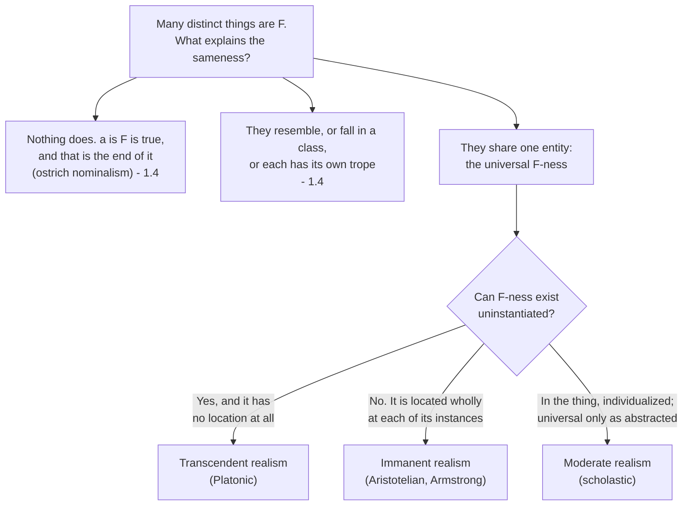

# Metaphysics · Lesson 1.3: Universals: the realist's case

> ⏱ ~15 min · Module 1: What there is · Builds on: [1.2 Abstract objects](01-02-abstract-objects.md) · Unlocks: [1.4 Nominalism and tropes](01-04-nominalism-and-tropes.md)

## Why this matters

[1.1](01-01-existence-and-ontological-commitment.md) caught a commitment nobody asked for: "there are several properties that all electrons share" quantifies over properties, and the obvious paraphrase — just list the predications — throws away the generalization. This lesson is about whether that commitment should be paid. The question looks technical and isn't: what you say about properties decides what you can say about laws of nature (4.3), about what makes a thing the kind of thing it is (2.4), about resemblance, and about which of the endlessly many ways of grouping things are the ways nature is actually carved. Realism is the view that there is one entity many things can literally share. Getting clear on what that would have to be is most of the work.

## The idea

Two electrons are both negatively charged. A tomato and a fire truck are both red. Start from the flattest possible observation: **things come in samenesses.** Not just any old grouping — some groupings support prediction, licence induction, and show up in laws, and others don't.

The realist's claim is that the sameness is *literal identity*, not close similarity. When you say two electrons are alike in charge, you are not saying that electron 1 has one thing and electron 2 has another thing very like it. You are saying there is **one** thing, charge, and both of them have it. That one thing is a **universal**: an entity that is one, but is had by many.

The nominalist's claim is that this is a grammatical illusion, and that "electron 1 is negatively charged" is a complete truth needing no shared entity underneath. Everything in this lesson and the next is a working-out of that disagreement.

Two pieces of vocabulary, used throughout. A **particular** is an individual — this electron, that tomato — and the standard mark of a particular is that it is in one place at a time. A universal is by contrast **repeatable**: the very same entity turns up again in the next instance. "Wholly present in each of its instances" is the realist's own phrase for this, and it is where the trouble starts.

## The argument

**The one-over-many argument.** The name is Plato's problem, in its modern statement.

> **P1.** *a*, *b* and *c* are numerically distinct particulars, and each of them is F.
> In words: three different things, one predicate true of all three.
>
> **P2.** That they are all F is an objective fact about them, not an artefact of how we happen to classify. They are genuinely alike in a respect.
> In words: the sameness is out in the world, not in our vocabulary.
>
> **P3.** Genuine sameness in a respect requires that there be some one thing the three of them share.
> In words: if they are literally alike, there is literally a something they have in common.
>
> **∴ C.** There is an entity, F-ness, numerically one, had by each of *a*, *b* and *c*. It is a universal.

Notice how much of the dispute is already visible in the premises. The **predicate nominalist** presses on P2: what makes them all F is just that one predicate applies to all three, and there is nothing further to explain. The **trope theorist** ([1.4](01-04-nominalism-and-tropes.md)) grants P2 and rejects the word "one" in P3 — each electron has its own charge, a particularized property, and the charges resemble exactly. The **"ostrich" nominalist** rejects the explanatory demand itself: "*a* is F" is true, *a* is its own truthmaker, and no further entity is owed. So the argument's real load is carried by P3, and by whether P2 states a genuine explanandum at all.

**Split one: can a universal exist uninstantiated, and where is it?** Grant the conclusion and you still face two questions, and the answers divide realists more sharply than realism divides them from nominalism.

The **transcendent** (Platonic) realist says universals exist independently of their instances. There could have been a universal that nothing ever instantiated — a shade no object has ever worn, a shape nothing has ever had. And universals have no spatiotemporal location at all; they are abstract in the sense of [1.2](01-02-abstract-objects.md). Particulars *participate in* them. The gains are real: uninstantiated properties are free, and which universals exist doesn't hostage itself to contingent physics. The costs are the ones 1.2 already priced — participation is an unexplained primitive, and causally inert abstracta raise the access problem.

The **immanent** (Aristotelian) realist, of whom D. M. Armstrong is the standard contemporary defender, says the opposite on both counts. The **Principle of Instantiation**: no universal exists unless something has it. There are no unrealized universals waiting in a further realm, because there is no further realm — universals exist *in* their instances, in the world, and a universal is located exactly where its instances are. That buys a great deal: universals are in spacetime, they are what causal powers and laws are stated over, and no access problem arises because you meet charge by meeting a charged thing.

A third position, **moderate realism**, is the scholastic refinement and is worth keeping separate: what exists in the thing is its nature, individualized in that thing; universality proper is contributed by the mind's abstraction from many such individuals. So the nature is real and in the world, but the *one-in-many* is post-abstraction. It is a genuine middle, not a hedge — it accepts the realist's explanandum while denying that anything numerically one is spread across instances.

**And the hard part: wholly present in each.** Take the immanent realist's location claim seriously. Charge is at this electron and also at that one, a metre away. Not part of it here and part of it there — *all* of it, in both places. Ordinary things manage multiple location by having parts in each place: a road is in two towns because a piece of it is in each. A universal has no such parts to distribute. So immanent realism says a single entity is entirely present in many separated places at once, which is exactly what we ordinarily take to be impossible.

The realist's reply is that the impossibility is a truth about *particulars*, and universals are advertised from the start as a different category of entity — to insist they obey the spatial rules for particulars is to assume the thing at issue. Whether that is an answer or a label is the live question. Plato ran the objection first, in the *Parmenides*, as a dilemma: does a participating thing get the **whole** of the Form or a **part** of it? Socrates answers with an analogy about a day, present in many places at once and still one; Parmenides substitutes a sail. **That passage is Module 1's boss problem and this lesson deliberately stops here** — the close reading is worth much more done cold.

**Split two: sparse or abundant?** Independent of the first, and more consequential than it looks.

On an **abundant** conception, there is a property for every predicate, or for every set of possible particulars. *Is grue*, *is within five miles of a cow or made of gold*, *is a proton or a teacup* — all properties, all equally properties. This is a perfectly good notion, and semantics needs something like it: every meaningful predicate wants a semantic value.

On a **sparse** conception, properties answer to the real joints. There are only as many as are needed to ground objective resemblance, causal powers and laws; disjunctive and negative concoctions are not among them. Armstrong's version adds a sharp methodological consequence: **which universals there are is an a posteriori question, and physics answers it, not philosophy.** You cannot read universals off a dictionary. Whether charge is a universal is settled by whether it is an irreducible feature the laws quantify over — and if physics reduces it, the universal goes.

The sparse conception is the one doing scientific work, and the argument for that is simple. Two things are *duplicates* only if they share their sparse properties; sharing abundant ones is trivial, since any two things fall into indefinitely many shared sets. Laws relate sparse properties; no law mentions *grue*. Induction projects sparse properties; projecting abundant ones gives you Goodman's problem immediately. David Lewis pressed this point hard under the heading of **natural properties**: whatever your ontology, you need a distinction between the elite properties and the rest, because duplication, intrinsicness, lawhood and the projectibility of predicates all presuppose it. Lewis's own view was that you could buy the distinction by adopting universals, or take naturalness as a primitive and stay a nominalist — but you cannot do without it. That is a rare thing in this course: a point both camps concede.

**Bradley's regress, the standing objection.** F. H. Bradley's problem is aimed at any view that builds a fact out of constituents. Suppose *a* instantiates F-ness. That is not two things lying side by side; something unites them. Call it the relation of instantiation, I. But now *a*, F-ness and I are three things, and they too must be united — by I₂, relating I to its relata. Then I₃. The unity is never achieved, because every glue needs glue.

The standard replies, none of them free:

1. **Instantiation is not a further relation but a non-relational tie.** It is what makes a fact a fact rather than a list, so it is not a constituent standing alongside the others, and the regress never starts. The charge against this is that "non-relational tie" names the problem rather than solving it.
2. **States of affairs are basic** (Armstrong's route). *A*'s being F is itself an entity, and *a* and F-ness are abstractions *from* it, not ingredients assembled *into* it. Unity is prior to the parts, so no glue is needed. The cost is a fundamental category of entity that cannot be analysed further.
3. **The regress is benign.** It generates further *truths* but no further *entities*: once you have *a* being F, everything the regress supplies supervenes on it, and what supervenes is no addition of being. The cost is having to make "no addition of being" do real work.

Note where the regress bites. It attacks constituent structure, not realism specifically — a trope theorist who says a thing is a bundle of tropes held together by compresence faces the same question about compresence. Nobody escapes it by going nominalist, which is why [1.4](01-04-nominalism-and-tropes.md) meets it again.

**The nominalist's opening, and why it is not free.** The natural alternative to a shared entity is **resemblance**: *a* and *b* are both F not because they share something but because they are alike. The realist's standing reply is that this relocates the problem rather than solving it. Things do not resemble *simpliciter*; they resemble **in a respect**, and a respect looks exactly like a property. Worse, resemblance is itself something many pairs share — if *a*-and-*b* resemble and *c*-and-*d* resemble, we have a new one-over-many about resemblance. The nominalist has answers, and they are the substance of [1.4](01-04-nominalism-and-tropes.md); the point here is only that "they're just similar" is a theory with bills to pay, not a way of declining the question.

## Map of positions

The second question cuts across the first, and mixing them up is the most common error here:

| Question | Transcendent | Immanent | What turns on it |
|---|---|---|---|
| Uninstantiated universals? | Yes | No (Principle of Instantiation) | Whether laws can cover unrealized values |
| Where is a universal? | Nowhere — outside space and time | Wholly at each instance | The multiple-location worry; causal relevance |
| **Sparse or abundant?** | **Either** | **Either** | Duplication, lawhood, induction, naturalness |

## Worked examples

**Example 1 (mechanical — running the analysis on a clean case).** Two electrons, each with charge −1.

The realist analysis: there is one universal, *having charge −1*, and each electron instantiates it. The truthmaker for "electron 1 is negatively charged" is a state of affairs with two constituents, the particular and the universal. What makes the two electrons *duplicates* is that they instantiate the very same universals, which is why physics can treat them as interchangeable.

Now apply the sparse test, which is where the work happens. Is *having charge −1* a universal? On Armstrong's method that is not a question you settle by noticing the predicate exists; you settle it by asking whether charge is an irreducible feature that the laws quantify over. Current physics says roughly yes, so a sparse realist provisionally admits it — and would withdraw it if charge turned out to be reducible to something more basic. Contrast the abundant conception, which has already handed you *is an electron or is a teacup* and *is negatively charged and not observed on a Tuesday* for free. Those have semantic values; no law mentions them; nothing is a duplicate of anything in virtue of them. That contrast is the whole case for sparseness in one line.

**Example 2 (a hard case — where the two realisms come apart).** Newton's law of gravitation assigns a force to *every* pair of mass values, including pairs no two objects in the history of the universe ever had. Take one such pair: two masses, precisely specified, never jointly realized.

The transcendent realist has no trouble. Those mass universals exist whether or not anything instantiates them, so the law relates real entities across its whole range, and "if two masses of those values were separated by that distance, the force would be this" is made true by relations among universals that are simply there.

The immanent realist is squeezed by his own Principle of Instantiation. If no universal exists uninstantiated, then there is no such universal as *having exactly that mass*, and the law appears to quantify over something that does not exist. The available moves are real but each costs: treat the law as a relation among **determinables** (*mass* as such, *distance* as such), which are instantiated, with determinate values falling under them; or accept that laws have an irreducibly counterfactual reach that outruns the universals actually present; or weaken the Principle of Instantiation to cover anything instantiated at some time, which helps with the past and not with the never-realized. Armstrong took the problem of functional laws seriously and worked on exactly this pressure point; whether any of the repairs succeeds is disputed.

The example is worth holding onto because it shows the shape of most arguments in this area. Immanent realism buys its naturalism by giving up uninstantiated universals, and then has to pay for that where science reaches beyond the actual. Transcendent realism keeps the reach and pays at the access point instead. Neither is obviously the better bargain, and the bargain is the argument.

## Watch out

- **"Wholly present in each" is not a picture, and it is not sloppy talk.** It is the doctrine. If you find yourself imagining the universal as a very thin thing smeared across its instances, you have turned it into a particular with parts, which is the horn of Parmenides' dilemma the realist must refuse.
- **Transcendent vs immanent is not the same question as sparse vs abundant.** You can be a transcendent realist with a sparse inventory or an immanent realist with an abundant one. The first question is about the *status* of universals; the second is about *how many there are*.
- **Realism does not follow from the fact that we use general terms.** Predicates are cheap. The argument needs P2 — that the sameness is objective — and that is precisely what the predicate nominalist denies.
- **The one-over-many is not the only way to motivate universals, and Armstrong himself moved.** The framing many contemporary realists prefer is a truthmaker question: what in the world makes "*a* is F" true, given that *a* alone does not settle it? The two framings can come apart, and an objection that lands on one may miss the other.
- **Do not treat Bradley's regress as an anti-realist weapon.** It is a problem about how any complex fact holds together, and nominalists who build things out of parts inherit it.

## One-liner

> Realism says the sameness of many things is the numerical identity of one thing they all have — after which the whole argument is about where that one thing is, whether it needs an instance, how many of them there are, and what holds it to what has it.

## Problems

**P1 (🟢) *(Exegetical.)*** For each claim, say which position it commits you to — transcendent realism, immanent realism, or neither because it belongs to the sparse/abundant question instead. One sentence each.

(a) "Had the universe contained no charged thing at all, charge would still have existed."
(b) "Charge is at this electron and at that one, entirely, at the same moment."
(c) "There is a property of being either a proton or a teacup."

**P2 (🟡) *(Exegetical (a) · Evaluative (b).)*** (a) Set out Bradley's regress in numbered steps, beginning from "*a* instantiates F-ness," and name the single assumption that generates it. (b) Pick **one** of the three standard replies (non-relational tie, states of affairs as basic, benign regress), state it precisely, and say what it costs — what you have to accept as unanalysed or unexplained in order to use it. 150 words or fewer for (b); any verdict on whether the cost is worth paying.

**P3 (🔴, optional) *(Exegetical, then evaluative.)*** An ostrich nominalist says: "'This electron is negatively charged' is true. The electron is all the truthmaker it needs. There is no further question." (a) Name the numbered premise of the one-over-many argument this denies, and state the denial in the ostrich's own best words. (b) Say what would count as showing the ostrich is wrong to deny it — not that realism is true, but what kind of consideration could move someone from that position. 150 words or fewer for both parts together; any verdict, the crux is what is graded.

Solutions

**P1** *(Exegetical — strict.)*

**Must hit, strict:**
- (a) **Transcendent realism.** This is the denial of the Principle of Instantiation: an uninstantiated universal. An immanent realist must say that in that world there is no such universal.
- (b) **Immanent realism.** Locating a universal wholly at each of its instances is the immanent realist's position; the transcendent realist denies universals have any spatiotemporal location, so he rejects the claim as a category mistake rather than as false.
- (c) **Neither — this is the sparse/abundant question.** An abundant conception grants a property for every predicate, including disjunctive ones; a sparse conception refuses this one. Both a transcendent and an immanent realist can go either way, so the claim does not discriminate between them.

**Wrong turns:** calling (c) "transcendent" because the property is strange or uninstantiated-sounding — something could instantiate it (a proton does), and the issue is disjunctiveness, not instantiation; reading (b) as something a transcendent realist merely *disagrees* with, rather than as a claim whose presupposition he denies.

**Model answer:** as above.

---

**P2** *(a) exegetical — strict; (b) evaluative — any verdict.*

**Must hit, strict (a):** the regress in steps, roughly —
1. *a* is F. This is not the bare co-presence of *a* and F-ness; they are united.
2. What unites them is a relation, instantiation (I).
3. But now *a*, F-ness and I are three items, and I must be related to its relata; call that I₂.
4. I₂ requires I₃, and so on without end.
5. The unity is never secured, so the fact is never constituted.

The generating assumption, stated any of these ways: **that whatever relates two things is itself a further entity standing alongside them, which therefore needs relating in turn** — equivalently, that every relational truth requires a relational constituent of the fact.

**Must hit, any verdict (b):** state the chosen reply precisely, then name its cost. Non-relational tie: instantiation is what makes a fact a fact and is not a further constituent — cost: an unanalysed tie whose non-relational status is asserted rather than shown, and the worry that the name does the work. States of affairs basic: the state of affairs is prior to its constituents, which are abstractions from it — cost: a primitive category, and the tension in calling *a* and F-ness constituents of something they do not compose. Benign regress: the further steps add truths, not entities, because they supervene — cost: the claim that supervenient entities are "no addition of being" must be defended, not assumed, and it proves a lot if true.

**Wrong turns:** presenting the regress as an objection to universals specifically — it attacks constituent structure, and tropes plus compresence face it too; stopping at "and so on forever" without saying *why* that is bad (the point is not infinity as such but that the unity is never achieved); answering (b) by declaring the reply successful without naming a cost, which is the one thing the part asks for.

**Model answer (b), one of several:** Take states of affairs as basic. The claim is that *a*'s being F is a single entity, and that *a* and F-ness are recovered from it by abstraction rather than combined into it; there is nothing to glue because there was never a pile of separate constituents. The regress cannot start, since it needs the pile. The cost is a category taken as fundamental and unanalysable, and a strained use of "constituent" — the parts of a state of affairs do not compose it the way parts ordinarily compose wholes, and that difference is exactly what is doing the work, so it had better be more than a stipulation. I think the price is fair given that every rival must take *something* as primitive; someone who thinks primitives should be intelligible independently will disagree.

---

**P3** *(a) exegetical — strict; (b) evaluative — the crux is what is graded.*

**Must hit, strict (a):** the ostrich denies **P3** — that objective sameness requires a shared entity. Many will also say he denies the explanatory demand carried by **P2**, and that is acceptable if stated carefully: the ostrich need not say the sameness is subjective, only that "*a* is F" needs no truthmaker beyond *a*. In his own best words: the predicate "is negatively charged" is true of the electron; predication is primitive; asking what *further thing* makes it true assumes without argument that every true predication reports a relation to an entity. Quine's criterion supports him — the sentence quantifies over the electron and over nothing else, so no commitment to charge has been incurred.

**Must hit, any verdict (b):** name the kind of consideration that bears, not a verdict. Acceptable: show a job that only a shared entity does, so that refusing the question has a cost elsewhere — laws as relations between properties (4.3), the duplication and naturalness distinction Lewis argued nobody can do without, the projectibility of some predicates and not others. Or: show that the ostrich's own theory quantifies over properties somewhere he cannot paraphrase away, which is [1.1](01-01-existence-and-ontological-commitment.md)'s test applied to his total theory rather than to one sentence. Saying "the sameness is obvious" is not a consideration; it is the thing at issue.

**Wrong turns:** arguing that the ostrich is refuted because we plainly do talk about properties — he agrees we do, and denies that the talk commits us; treating the position as a form of anti-realism about the electron's being charged, which it is not (the ostrich affirms it, and only refuses to analyse it).

**Model answer, one of several:** (a) He denies P3. The denial: predication is primitive, "*a* is F" is made true by *a*, and the demand for a shared entity smuggles in the assumption that every predicate names something. (b) What moves the dispute is not a direct refutation but a bill coming due elsewhere. The ostrich owes an account of why some predicates support induction and figure in laws while others do not, and of what duplication amounts to. If the best account of those uses quantification over properties that no paraphrase removes from his *total* theory, then by his own Quinean lights he is committed after all. If he can supply a primitive naturalness ranking over predicates instead, he is not — which is close to Lewis's position, and shows the crux is whether naturalness can be primitive without being a property.

## Flashback

**(🟡) *(Exegetical.)*** Retrieval from [1.1](01-01-existence-and-ontological-commitment.md). Apply Quine's criterion to this pair of sentences:

> "Two of these roads run in the same direction, and that direction is due north. The direction the surveyors recommended is one that no road in the county actually runs in."

(a) What is the speaker committed to? (b) Give a paraphrase that avoids the commitment, and say what the second sentence does to it. 150 words or fewer.

Solution

**Flashback** *(Exegetical — strict.)*

**Must hit, strict:**
- (a) Commitment to **directions**. The quantifiers range over them: "the same direction" is a thing two roads both have, "that direction" has a predicate attached ("is due north"), and the second sentence quantifies over a direction and says no road has it. Not a commitment to roads only.
- (b) The standard paraphrase kills the first sentence: "these two roads are **parallel**, and both point north" — parallelism is a relation between roads, so the quantification is over roads alone and directions drop out. The second sentence resists exactly this move: there is **no road** for the recommended direction to be parallel to, so a relation among actual roads has nothing to relate. Escape routes, each with a cost: quantify over *possible* roads (modal commitment, Module 3); use angles or bearings (numbers, so the commitment moves to [1.2](01-02-abstract-objects.md)'s ground rather than vanishing); or accept directions.

**Wrong turns:** treating "direction" as eliminated by a synonym such as "heading" or "bearing" — a synonym swap is not a paraphrase, as 1.1 insists; missing that the second sentence is the hard one, and reporting the parallelism paraphrase as a clean success.

**Model answer:** The speaker is committed to directions: both sentences quantify over them and predicate things of them. The first paraphrases away cleanly — say the two roads are parallel and both point north, and only roads are quantified over. The second does not, because the recommended direction is uninstantiated: no road runs in it, so there is nothing for a road-to-road relation to hold between. To avoid the commitment you must quantify over possible roads, or over numerical bearings, and either way something abstract or modal comes back. The commitment can be moved; it has not obviously been removed.

*(Notice what the second sentence is: an uninstantiated repeatable. It is the same pressure point the Principle of Instantiation faces in this lesson's Example 2 — which is not a coincidence.)*

## Connections

- **Backward:** [1.1](01-01-existence-and-ontological-commitment.md) supplied the criterion that turns "there are properties electrons share" into a commitment, and the paraphrase move the nominalist will need in 1.4; [1.2](01-02-abstract-objects.md) supplied the access problem that transcendent universals inherit intact, since they are abstracta with the same causal inertness numbers have.
- **Forward:** [1.4](01-04-nominalism-and-tropes.md) develops the resemblance option, Goodman's difficulties for it, ostrich nominalism, and tropes — and meets Bradley's regress again in trope form. **Boss problem 1** close-reads Plato's *Parmenides* on whether a thing shares in the whole of a Form or a part, with Socrates' day and Parmenides' sail. This lesson set the dilemma up on purpose and stopped; do not look the passage up before you attempt it.
- **Sideways:** 2.1 asks what *has* the properties, where bundle theory tries to build particulars out of universals alone; 2.4 asks which of a thing's properties are essential to it; 4.3 is where sparse universals earn their keep, in the account of laws as relations of necessitation between properties; 3.2's ersatz possible worlds are built out of properties, so what you say here constrains what you can build there.
- **Across courses:** whether general terms pick out entities at all is also a question in `philosophy-of-language-and-logic`; the historical reconstruction of Plato's Forms and Aristotle's reply belongs to `ancient-medieval-philosophy`, which this course deliberately leaves to it.
