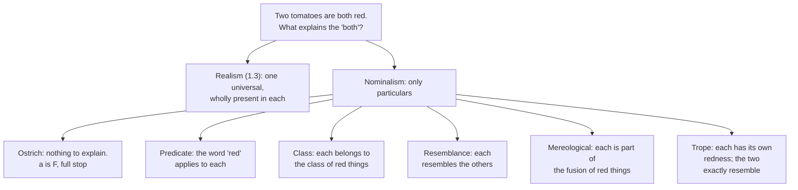

# Metaphysics · Lesson 1.4: Nominalism and tropes

> ⏱ ~15 min · Module 1: What there is · Builds on: [1.3 Universals: the realist's case](01-03-universals-the-realists-case.md) · Unlocks: [2.1 Substance and accident](02-01-substance-and-accident.md)

## Why this matters

[1.3](01-03-universals-the-realists-case.md) left you with a bill. Two tomatoes are both red; the realist explains the "both" by one entity wholly present in each, and pays for it with an item that breaks the ordinary rules about location. This lesson is the other half of the ledger: six attempts to explain the same "both" without universals, and what each one costs. The payoff is not a winner. It is a habit — every account of properties takes *something* as primitive and unexplained, and the honest comparison is between primitives, not between one view that explains and another that doesn't. You will need that habit again for substance ([2.1](02-01-substance-and-accident.md)), for grounding ([2.4](02-04-essence-and-grounding.md)), and for laws (4.3).

## The idea

**Nominalism**, in the sense at issue here, is the denial that there are universals. There is no single entity *redness* shared by the tomatoes; there are just the tomatoes, and whatever else is particular. (The word has a second use — denying that there are *abstract objects* at all, the subject of [1.2](01-02-abstract-objects.md). Keep them apart: most nominalists about universals are happily committed to classes, which are abstract. The historical root of both is Ockham, read as a historical figure in [`ancient-medieval-philosophy`](../../ancient-medieval-philosophy/syllabus.md).)

Every nominalism has the same shape. Find something already in the inventory — words, classes, a resemblance relation, a fusion — and let it do the work universals were doing. The recurring failure is that the substitute turns out to be either *too coarse* (it can't tell two properties apart) or *too late* (it presupposes the very fact it was meant to explain). Trope theory, the last position here, is different in kind: it doesn't replace properties with something else, it keeps properties and makes them **particular**.

## The argument

Each position is stated as a biconditional for "a is F," followed by its bill.

**1. Ostrich nominalism.** *a is F, and that is the end of it.* There is no analysis, because there is no question. "The tomato is red" is made true by the tomato; demanding a further entity to explain the predication is a bad demand, not an unmet one.

In words: refuse the one-over-many problem rather than answer it. Armstrong aimed the label "ostrich" at Quine and Devitt; Devitt took the charge up and defended the refusal, arguing the problem is manufactured by an appetite for analysis that nothing justifies. **The bill:** predication is primitive and unanalysable, and the similarity between the two tomatoes gets no account at all. Whether that is a cost or a saving is exactly what is in dispute.

**2. Predicate nominalism.** *a is F if and only if the predicate "F" applies to a.*

In words: what the tomatoes have in common is a word. **The bill — the cart before the horse.** The explanation runs backwards: "red" applies to the tomato *because* the tomato is red, not the other way round. Two supporting symptoms. First, tomatoes were red before there were predicates, and would be red if every language died out tonight — so the truth of "a is F" cannot depend on a word's existing. Second, "applies" is itself a predicate, so the analysis needs the relation of application to hold between a word and a thing, and that relation now wants an analysis of its own.

**3. Class nominalism.** *F-ness is the class of F things; a is F if and only if a belongs to it.*

In words: redness is the set of all red things. This is the tidiest nominalism and it has two classic problems.

> **Coextension.** As things actually stand, every creature with a heart is a creature with a kidney and conversely. The class of cordates *is* the class of renates — one class, so on this analysis one property. But having a heart and having a kidney are plainly two properties. *Lewis's repair:* let the classes contain possible individuals, not just actual ones; in some world there is a cordate with no kidney, so the classes come apart. That works for accidental coextension and fails for necessary coextension — being trilateral and being triangular share a class in every world, and stay distinct.
>
> **Explanatory order, again.** Membership in the class of red things *follows from* being red; it does not constitute it. The tomato is not red because it is a member of a set. And with no restriction, every arbitrary class is a property, including the class containing this tomato, the number 4 and Tuesday. Lewis's answer — only the **natural** classes are properties — is the position [1.3](01-03-universals-the-realists-case.md) introduced, and it buys the restriction by taking naturalness as primitive.

**4. Resemblance nominalism.** *F-ness is a class of things that resemble one another; a is F if and only if a resembles the members.* Resemblance is primitive and takes no "respect" — you may not say "resembles in respect of redness," because respects are the things being analysed.

In words: what the tomatoes share is not a thing, it is a relation between them. The natural construction defines a property as a **maximal** class of things every two of which resemble (Carnap's "similarity circles" in the *Aufbau*, 1928). Goodman's two difficulties, raised in *The Structure of Appearance* (1951), are the sharpest objections in this lesson. State them exactly:

> **The imperfect community difficulty.** A class is an *imperfect community* when every two of its members resemble one another, yet **no property is common to all** of them. Pairwise resemblance is cheap: a and b can share colour, b and c shape, a and c material, with nothing running through all three. Such a class satisfies the definition, so the construction counts a spurious property alongside the real ones — and it has no resources to tell which is which, since "they share something" is what it was building.
>
> **The companionship difficulty.** Property G is *companioned* by F when the class of G-things is a **proper subclass** of the class of F-things: every G is an F, not every F is a G. Then the G-class is not maximal — every G thing resembles every F thing, so you can always enlarge the G-class up to the F-class while keeping every pair resembling. The maximal class picks out F and **loses G entirely.** Every crimson thing is red and not conversely; crimson gets swallowed.

**Rodriguez-Pereyra's defence.** *Resemblance Nominalism* (2002) is the serious modern attempt to pay both bills. Against imperfect community the strategy is to strengthen the resemblance condition so that it constrains not only members but **pairs** of members: the spurious class passes the pairwise test and fails the higher one. Against companionship he lets the classes contain merely possible objects as well as actual ones, following Lewis's modal realism ([3.2](03-02-what-possible-worlds-are.md)) — if the inclusion is accidental, some possible G-that-is-not-F breaks it. The price is on the table: nominalism about universals is bought with realism about possible worlds, and inclusions that hold in every world, like crimson inside red, are not broken by any of them.

**5. Mereological nominalism.** *F-ness is the mereological fusion of all F things; a is F if and only if a is part of that fusion.*

In words: redness is one scattered object, made of all the red things. **The bill:** parthood is too coarse to be property-membership. Arbitrary parts of the red fusion — a tomato's colourless interior cells, a half-tomato-half-fire-engine chunk — are parts and are not red. And distinct properties can share a fusion: the fusion of all cats is the fusion of all cat-parts, so being a cat and being a cat-part collapse. The view is usually presented as a cautionary case rather than a live option.

**6. Trope theory.** *Properties are real and particular.* This tomato's redness is a **trope**: an entity as fully particular as the tomato, not shared with anything, not repeatable. That tomato has its own redness, numerically distinct, however exactly alike the two are. D. C. Williams introduced them as "abstract particulars" ("On the Elements of Being," 1953); Keith Campbell developed the system (*Abstract Particulars*, 1990).

Two jobs, two mechanisms:

> **The one over many.** The tomatoes share no entity. What is true is that this redness **exactly resembles** that one, and what answers to the word "redness" is the class of all tropes exactly resembling these. Resemblance classes of tropes do the work universals did.
>
> **The substance.** An ordinary object is a **bundle** of compresent tropes — this redness, this roundness, this mass, all located together. (Alternatively tropes inhere in a substratum; the bundle-versus-substratum question is [2.1](02-01-substance-and-accident.md)'s.)

Why this is regarded as the strong nominalism: **Goodman's two difficulties cannot arise.** Both exploit the fact that ordinary objects resemble along many dimensions at once. A trope has only one character, so "resembles" needs no respect; exact resemblance among tropes is an equivalence relation, its classes do not overlap and do not nest, so there is no imperfect community to form and no companion to swallow anything.

**The bill.** Three items. (i) Exact resemblance is primitive — and if it is a genuine relation holding of every pair in a class, the realist replies that a primitive relation which sorts all tropes into non-overlapping kinds is a universal in disguise. The trope theorist answers that resemblance is internal, fixed by the tropes themselves and no addition to being; whether that answer works is a live question. (ii) Compresence is primitive, and if it is a relation binding the bundle, it needs binding to what it binds — **Bradley's regress**, set out in [1.3](01-03-universals-the-realists-case.md): if a's being F requires a tie R between a and F, the tie must be tied, and so on without end. Every view here halts the regress somewhere (the realist by a non-relational tie, the ostrich by refusing the first step); the trope theorist halts it by taking compresence as a primitive, non-relational fact. (iii) The inventory is large: one trope per property-instance, so as many rednesses as there are red things.

## Map of positions

The scorecard. Read the last two columns together — the invoice is the point.

| View | "a is F" holds because… | Primitive | Hardest bill |
|---|---|---|---|
| Ostrich nominalism | a is F | predication | no account of similarity at all |
| Predicate nominalism | "F" applies to a | the applying of words | order of explanation; properties depend on language |
| Class nominalism | a is in the class of F's | classes (and, for Lewis, naturalness) | coextensive properties collapse; membership follows from the property |
| Resemblance nominalism | a resembles the others | resemblance | imperfect community; companionship |
| Mereological nominalism | a is part of the F-fusion | fusions | parts of an F need not be F; distinct properties, one fusion |
| Trope theory | a has an F-trope | exact resemblance, compresence | is exact resemblance a universal in disguise? Bradley's regress; a very large inventory |
| Immanent realism (1.3) | the universal F is in a | instantiation | one thing wholly in many places; Bradley's regress |

## Worked examples

**Example 1 (mechanical — running the resemblance construction on a small world).** Four fabrics, with everything true of them listed:

| | pattern | material | colour |
|---|---|---|---|
| **a** | striped | cotton | blue |
| **b** | striped | silk | red |
| **c** | plain | silk | blue |
| **d** | plain | wool | blue |

Resemblance is sharing at least one entry. Now find the maximal classes — classes in which every two members resemble, and to which nothing further can be added.

Try {a, b, c}: a–b share striped, b–c share silk, a–c share blue. Every pair resembles. Can d join? d and b have nothing in common, so no. **Maximal.** But look at the rows: *no entry is common to all three.* The construction has produced a property that nothing has. That is the imperfect community, built in four lines.

Try {a, c, d}: a–c and a–d share blue, c–d share plain and blue. Can b join? No (b and d share nothing). **Maximal**, and this one is genuine: it is exactly the blue things.

Now count the casualties. *Plain* is true of c and d only — but a can be added to {c, d} (a is blue, like both), so the plain-class is not maximal and plain is lost inside blue. That is companionship: every plain fabric here is blue, and nothing is left to mark the difference. Run the same check on *striped*, *silk*, *cotton* and *wool* and every one of them is swallowed too. Out of a four-object world the construction delivers exactly two properties, one of which is a fake and the other of which is blue.

Watch what tropes do to the same world. There are twelve tropes, one per cell. This fabric's blueness exactly resembles that one and nothing else; blue's class is the four blueness tropes in the third column; plain's class is c's and d's plainness tropes, and no amount of blue can get into it, because a plainness trope does not exactly resemble a blueness trope. The columns never merge, so neither difficulty can start. That is the whole case for tropes in one table — and it is bought with twelve entities where the realist had three.

**Example 2 (a hard case — where tropes strain).** Take one fabric and ask two ordinary questions.

*First: it is blue, and it is also coloured.* Its blueness trope handles "blue." What handles "coloured"? Three options, each costing something. A second trope, a colouredness, compresent with the blueness — but then the fabric has two colour-tropes where there looked to be one fact, and the relation between them needs saying. Or: no colouredness trope, and "coloured" is true in virtue of the blueness trope belonging to a *broader*, inexact resemblance class. But inexact resemblance comes in degrees and holds along more than one dimension at once, which is precisely the setting Goodman's difficulties live in — the determinable level reintroduces the problem the determinate level escaped. Or: deny that determinables are genuine properties needing truthmakers. That is a real position, and it is a commitment, not a free move.

*Second: what makes this bundle one fabric?* Compresence. But if compresence is a relation holding among the tropes, then either it is itself a trope — a compresence trope, which now needs to be compresent with the others, and Bradley's regress is running — or it is a primitive, non-relational fact about the bundle, which stops the regress by declaring it stopped. The realist's non-relational tie between a particular and its universal has exactly the same structure and exactly the same defence. Neither side gets to call the other's stopping point arbitrary without indicting its own, which is the sense in which this dispute is a comparison of primitives.

## Watch out

- **"Abstract particular" does not mean [1.2](01-02-abstract-objects.md)'s "abstract."** Williams's sense is *considered apart* — a trope is one aspect of a thing taken by itself. A trope is in space and time and enters causal relations; the tomato's redness is where the tomato is. Nothing about tropes commits you to non-spatiotemporal entities.
- **Nominalism about universals is not nominalism about abstracta.** Class and resemblance nominalism quantify over classes, and by [1.1](01-01-existence-and-ontological-commitment.md)'s criterion that is a live commitment. A philosopher can flee universals and land on sets.
- **Coextension and companionship are different failures.** Coextension: two properties, *one* class (cordates and renates). Companionship: two properties, one class properly *inside* the other (crimson and red). The first defeats class nominalism; the second defeats the maximal-class version of resemblance nominalism.
- **An imperfect community is not a class whose members fail to resemble.** Every pair in it resembles; that is the trap. What fails is the jump from "every two share something" to "all share something."
- **Tropes do not dissolve the one over many; they relocate it.** The question "why do these two count as the same property?" becomes "why do these two tropes exactly resemble?" The trope theorist's answer — that the resemblance is internal, fixed by the tropes and no further entity — is an answer, and the realist disputes it.
- **"That view takes X as primitive" is not yet an objection.** Read the scorecard's last two columns: every row has a primitive. The objection has to be that *this* primitive is worse — less intelligible, less independently motivated, or doing more work than it can bear.

## One-liner

> Take away universals and the explanatory work has to go somewhere — into words, classes, resemblance, fusions, or particular qualities — and each destination charges a different primitive.

## Problems

**P1 (🟢) *(Exegetical.)*** "This sapphire and that one are *exactly the same shade*."

(a) Give predicate nominalism's, class nominalism's and trope theory's analysis of the italicized sameness — one sentence each. (b) For each, name the one objection from this lesson that bites hardest *on this case*, in a clause. (c) Suppose that in this world every sapphire is blue and some blue things are not sapphires. Name which of Goodman's two difficulties that sets up for the resemblance nominalist, and say which property the maximal-class construction loses.

**P2 (🟡) *(Exegetical (a) · Evaluative (b).)*** An invented note from a museum catalogue:

> "There is no such thing as the Baroque over and above the works we file under it. A painting is Baroque because that is the heading our catalogue puts it under — the heading came first and the style is nothing but the set of works carrying it. Which is why it is a plain confusion to ask whether two catalogues that file exactly the same paintings have picked out two different styles. They have not."

(a) Two distinct nominalisms are run together here. Name each, quote the clause that carries it, and name the standard objection each walks into. (b) Can the curator keep the last sentence while allowing that the Baroque might have contained different paintings than it does? 150 words or fewer, any verdict, provided you say what the concession costs.

**P3 (🔴, optional) *(Evaluative.)*** The trope theorist says exact resemblance is primitive: these two rednesses just do exactly resemble, and no further entity explains it. The immanent realist says a primitive relation that sorts every trope in the world into non-overlapping kinds is a universal wearing a disguise. In 150 words, name the single premise one side must deny, and say what argument or consideration would actually move someone off it. Any verdict; the crux is what is graded.

Solutions

**P1** *(Exegetical — strict.)*

**Must hit, strict (a):**
- **Predicate nominalism:** the same colour predicate applies to both — there is a word true of each, and the sameness is nothing further.
- **Class nominalism:** both belong to one class, the class of things of that shade; sameness of shade is joint membership.
- **Trope theory:** each sapphire has its own, numerically distinct blueness trope, and the two tropes **exactly resemble**; the shade is the class of tropes exactly resembling these.

**Must hit, strict (b)** — one per view, and it must be the case-specific bite, not a generic complaint:
- **Predicate:** the order of explanation, sharpened here — we have far fewer colour words than discriminable shades, so two sapphires can be exactly the same shade with no predicate marking it, and one predicate covers many shades. The sameness outruns the vocabulary, so it cannot consist in the vocabulary.
- **Class:** **coextension.** If exactly the sapphires and nothing else have that shade, then being that shade and being a sapphire share one class and so, on this analysis, are one property. (Membership also follows from the shade rather than constituting it.)
- **Trope:** exact resemblance is taken as primitive; the realist replies that a primitive relation sorting every trope into non-overlapping kinds is a universal in disguise. Accepting "a very large inventory" also passes.

**Must hit, strict (c):** **companionship** — the sapphires are a *proper subclass* of the blue things. Every sapphire resembles every blue thing (they are all blue), so the sapphire class is never maximal; it can always be enlarged to the blue class with every pair still resembling. The construction keeps **blue** and loses **being a sapphire**.

**Wrong turns:** answering (c) with "imperfect community" because there are several respects in play — the test is proper inclusion of one class in another, not multiplicity of respects; calling (c) a coextension problem, which needs the *same* class, not a subclass; giving the trope theorist's objection as "tropes are abstract objects," which confuses Williams's sense of abstract with [1.2](01-02-abstract-objects.md)'s.

**Model answer:** as above.

---

**P2** *(a) exegetical — strict; (b) evaluative — any verdict.*

**Must hit, strict (a):**
- **Predicate nominalism** — "a painting is Baroque because that is the heading our catalogue puts it under," reinforced by "the heading came first." Objection: the order of explanation is reversed (the catalogue files it under that heading because it is Baroque), and it makes the style depend on the existence of catalogues, so no painting was Baroque before anyone classified one.
- **Class nominalism** — "the style is nothing but the set of works carrying it," which is what licenses the last sentence. Objection: **coextension.** Two properties can share one class, so sameness of membership does not establish sameness of style; if the two catalogues sorted on different criteria that happen to agree on every actual painting, they have picked out two things.

**Must hit, any verdict (b):** notice the tension — allowing that the Baroque might have had different members means the style is *not* the actual class, since a class has its members essentially. Name the available repair (identify the style with a class of possible works, Lewis's move) and price it: it commits the curator to merely possible paintings, and it still will not separate two styles that coincide in every possible world. Either verdict passes if the concession's cost is named.

**Wrong turns:** arguing about whether the Baroque is a real period, which is not what was asked; treating the two nominalisms as one view because both are "anti-realist"; answering (b) by saying the curator is simply wrong, without identifying which of the two claims has to go.

**Model answer (b), one of several:** Not as stated. The last sentence is true only if a style *is* the actual set of works; but a set is individuated by its members, so on that identification the Baroque could not have contained one more painting — and the curator wants to allow that it could. The standard repair replaces the actual set with a set of possible works, which does break the tie between the two catalogues, since they would diverge on some merely possible painting. The cost is an ontology of possible paintings, which is a far heavier commitment than the deflationary opening sentence advertised, and it still leaves necessarily coextensive classifications indistinguishable. The catalogue's confident "they have not" is the part that has to be withdrawn.

---

**P3** *(Evaluative — any verdict; the crux is what is graded.)*

**Must hit:** identify the premise, not just the two conclusions. The crux is whether **exact resemblance is an internal relation** — whether it is fixed by the natures of the two tropes alone, so that positing the tropes is already positing the resemblance and no further entity is added. The trope theorist affirms it; the realist must deny it, holding that a relation which partitions all tropes into non-overlapping, world-wide kinds is an addition to being and so a universal by another name. Then say what would move someone: an argument that internal relations really are no addition to being (the trope theorist's route, which generalizes — the realist uses the same principle elsewhere), or an argument that primitive resemblance cannot be internal because the tropes' "natures" are exactly what was supposed to need explaining (the realist's route).

**Wrong turns:** naming the crux as "whether universals exist," which is the conclusion, not the premise; claiming the dispute is merely verbal without applying the test for a verbal dispute from [`philosophical-method`](../../philosophical-method/syllabus.md) 3.2 — you would have to show the two agree on every non-linguistic fact, and they do not agree about whether anything is wholly present in many places; counting the primitive itself as the objection (both sides have one — see the scorecard).

**Model answer, one of several:** The premise is that exact resemblance among tropes is internal — grounded wholly in the relata, so that once the two rednesses exist nothing further need exist for them to resemble. Deny it and the resemblance is a genuine repeatable entity, which is the realist's universal. What would move a trope theorist: showing that the "nature" of a trope which grounds its resemblances is either a further property of the trope (regress) or unexplained (a primitive doing the work a universal did). What would move a realist: showing that internal relations are ontologically free across the board, so refusing the free lunch here is special pleading. Notice neither side can win by pointing at the other's primitive; the argument has to be about which primitive is more intelligible and less overworked.

## Flashback

**From Lesson 1.2 (Abstract objects):** The class nominalist identifies redness with the class of red things — and by both of 1.2's marks a class is abstract, wherever its members are.

(a) The access worry was raised against numbers. State it as it applies to *this* theory, in one sentence, and say what is awkward about its landing here of all places. (b) Could a **fictionalist** about classes be a class nominalist about properties? 150 words or fewer for both parts.

Solution

**Must hit, strict (a):** the worry transposes without modification — if classes are causally inert and outside space and time, nothing connects them to our beliefs, so the reliability of what we think about which class a thing falls into goes unexplained. What is awkward is the destination: the motive for leaving universals was partly that a repeatable entity with no ordinary location is hard to know about, and the class nominalist has landed on an entity with exactly that profile. One trade is defensible and must be argued for, not assumed — the class nominalist owes a reason why classes are epistemically cheaper than universals.

**Must hit, any verdict (b):** state the fictionalist move precisely — class talk is useful and strictly false, the way talk about a novel's characters is — and then find the collision. Class nominalism needs the class to **exist** for "the tomato is red" to be true, so if class talk is fiction then so is every property ascription. Name the two exits: bite it (property talk is fiction, which is a far stronger and more expensive position than the view advertised), or give truth conditions for "a is F" that do not quantify over classes — at which point the view has stopped being class nominalism. Either verdict passes if the collision and one exit are named.

**Wrong turns:** treating the access worry as the complaint that classes cannot be seen, rather than that nothing links them to our beliefs; answering (b) with "fictionalism is fine, classes are just a way of speaking," which restates the position instead of pricing it; concluding that class nominalism is therefore refuted — the argument shows a debt, and 1.2's Field showed that debts of this shape are sometimes payable.

## Connections

- **Backward:** [1.3](01-03-universals-the-realists-case.md) posed the one-over-many and paid for the answer with a strange entity; this lesson prices the alternatives. [1.1](01-01-existence-and-ontological-commitment.md)'s criterion is what reads the commitment to classes off class nominalism, and the paraphrase move is what each nominalism is attempting on a grand scale.
- **Forward:** the bundle theory of substance in [2.1](02-01-substance-and-accident.md) is trope theory's answer to what an ordinary object is, set against substratum and hylomorphic rivals; Bradley's regress recurs there and in [2.4](02-04-essence-and-grounding.md), where "in virtue of" becomes the object of study rather than a tool. Rodriguez-Pereyra's use of possible objects is cashed out in [3.2](03-02-what-possible-worlds-are.md), and whether properties are powers is 4.3.
- **Sideways:** classes and their membership relation belong to [`mathematical-logic`](../../mathematical-logic/syllabus.md) (3.1); Ockham's nominalism in its own setting belongs to [`ancient-medieval-philosophy`](../../ancient-medieval-philosophy/syllabus.md). Whether the trope-versus-universal dispute is substantive or verbal is tested by [`philosophical-method`](../../philosophical-method/syllabus.md) 3.2.
