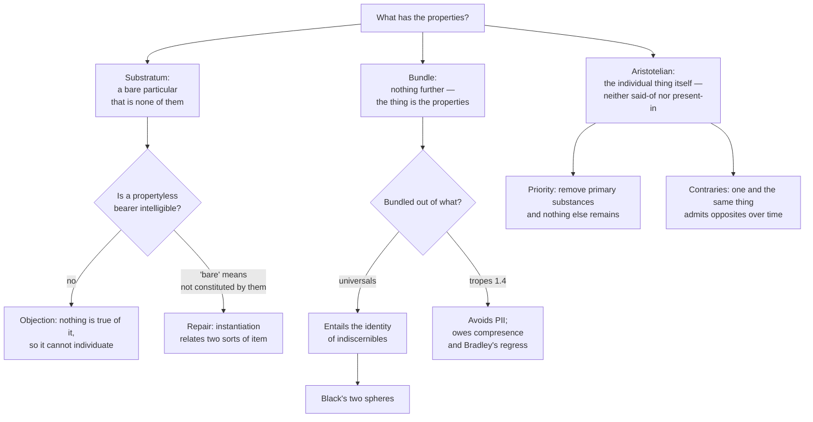

# Metaphysics · Lesson 2.1: Substance and accident

> ⏱ ~15 min · Module 2: Substance, change, and essence · Builds on: [1.4 Nominalism and tropes](01-04-nominalism-and-tropes.md) · Unlocks: [2.2 Change, act and potency](02-02-change-act-and-potency.md)

## Why this matters

Module 1 asked what properties are. This module asks the other half of the question, and it is the half everything downstream needs: **what has them?** Change requires something that changes and stays itself ([2.2](02-02-change-act-and-potency.md)). Composition requires something composed ([2.3](02-03-hylomorphism-and-composition.md)). Essence requires something with an essence ([2.4](02-04-essence-and-grounding.md)). Persistence requires a persister ([5.4](05-04-endurance-perdurance-and-stages.md)), and "what a person is" ([6.5](06-05-what-a-person-is.md)) has been answered for fifteen centuries with the phrase *an individual substance of a rational nature*. If there are no substances, every one of those questions has to be re-asked from scratch — which is exactly what the Humean and the Quinean think should happen.

## The idea

Put an apple on the table. It is red, round, sweet, one pound, cold from the fridge. Now strip the properties away in thought, one at a time. When the last one goes, is anything left?

Three answers, and they exhaust the field:

1. **Something is left, and it is the apple** — an individual thing that exists in its own right, with the redness and the coldness existing *in* it and not the other way round. This is Aristotle's **primary substance**, and the redness is an **accident**.
2. **Something is left, and it is a bare bearer** — a propertyless *something* that holds the properties together without being any of them. This is the **substratum**, and Locke's blunt name for it is the one everybody remembers.
3. **Nothing is left** — the apple *was* the properties, bundled. Take them away and you have taken away the apple. This is **bundle theory**.

Two warnings before we start. First, **"accident" here has nothing to do with chance.** An accident is a way a thing is that does not exist on its own: the apple's redness is an accident even if the apple could not possibly have been any other colour. Second, do not let grammar decide. "The apple is red" has a subject and a predicate, which makes it *look* as though reality contains a bearer plus a borne. But [1.1](01-01-existence-and-ontological-commitment.md) taught the discipline of not reading ontology off surface grammar, and the bundle theorist's whole claim is that the subject position is a grammatical artefact.

## Source

Aristotle, *Categories*, chapters 2 and 5 (Oxford translation, E. M. Edghill). Two tests do the work, and they are independent of each other.

The first is being **said of** a subject — what we would call predication that says *what a thing is*. "Man" is said of the individual man. The second is being **present in** a subject, and Aristotle defines it narrowly so that it means dependence, not location:

> "By being 'present in a subject' I do not mean present as parts are present in a whole, but being incapable of existence apart from the said subject."

Cross the two tests and you get four cells:

| | **Said of** a subject | **Not said of** a subject |
|---|---|---|
| **Present in** a subject | *knowledge* — said of grammar, present in the soul | *this particular piece of grammatical knowledge*, *this particular whiteness* — an individual accident |
| **Not present in** a subject | *man*, *horse* — the species and genus, what Aristotle calls **secondary substance** | **primary substance**: the individual man, the individual horse |

Then the definition, from chapter 5:

> "Substance, in the truest and primary and most definite sense of the word, is that which is neither predicable of a subject nor present in a subject; for instance, the individual man or horse."

Note what the definition is doing: it picks out primary substance **negatively**, by what it is *not* — not said of anything, not in anything. That is a claim about ontological independence, and Aristotle immediately draws the priority conclusion from it: everything else is either said of a primary substance or present in one, so if the primary substances were removed, nothing else would be left to exist.

One more line, because it is the hinge into [2.2](02-02-change-act-and-potency.md):

> "The most distinctive mark of substance appears to be that, while remaining numerically one and the same, it is capable of admitting contrary qualities."

A colour cannot be both white and black. A person can be pale in winter and tanned in summer, and it is the *same* person — one and the same thing, holding contraries at different times. Accidents cannot do this; they are simply replaced. So the thing that survives the swap is a different kind of item from the things swapped.

## The argument

### Position A — Aristotelian substance

**The position.** A **primary substance** is an individual that is neither said of a subject nor present in a subject. An **accident** is an entity whose whole mode of being is to be *in* such an individual: it cannot exist apart from it. Primary substances are therefore ontologically prior — nothing else would exist if they did not.

*In words:* the apple exists flat out; its redness exists only as the apple's redness, the way a dent exists only as some fender's dent.

**The argument for priority (from *Categories* 5):**

> **P1.** Everything other than a primary substance is either said of a primary substance or present in one.
> **P2.** Whatever is present in a subject is incapable of existing apart from that subject.
> **P3.** Whatever is said of a subject is nothing apart from the subjects it is said of.
> **∴ C.** If there were no primary substances, there would be nothing else either — so primary substances are the basic existents.

The vulnerable premise is **P1**. A Platonist ([1.3](01-03-universals-the-realists-case.md)) denies it outright: Forms are said of things without depending on them. A contemporary Humean denies it differently — the mosaic is built from local qualitative facts, and "individual thing" is a coarse pattern in it, not a floor.

**The argument from change (the contraries test):**

> **P1.** One and the same thing can be pale at one time and tanned at another.
> **P2.** Nothing can be pale-and-tanned; the pallor does not become the tan, it is replaced.
> **P3.** So the bearer of the contraries is numerically distinct from either contrary.
> **∴ C.** There are subjects of change that are not themselves properties.

### Position B — Substratum, or the bare particular

**The position.** A concrete thing is a **bare particular** plus the properties it instantiates. The bare particular is the bearer; it is what makes *this* thing numerically distinct from a qualitative duplicate; and it is "bare" in that none of its properties are constituents of it and none are essential to it.

*In words:* there is a pincushion and there are pins. The pincushion is not itself a pin, which is precisely why it can hold any pins you like.

Locke reached this by a different road — he was asking what our *idea* of substance amounts to, and found it empty. Anyone who examines his own notion of substance in general, he says in the *Essay* (II.xxiii.2), finds he has

> "no other idea of it at all, but only a supposition of he knows not what support of such qualities which are capable of producing simple ideas in us."

And he mocks the position he is stating: it is like the man who said the world rests on an elephant, and the elephant on a tortoise, and when pressed about the tortoise could say only "something, he knew not what." The Latin *substantia* means standing-under, Locke notes, which is a picture rather than an explanation.

**The objection.** A propertyless bearer is unintelligible. If the substratum has no properties, then nothing is true of it; if nothing is true of it, there is no fact about which substratum is which, and it cannot even do the job of distinguishing duplicates. Worse, "is a bare particular" and "supports the redness" look like properties, so the doctrine seems to refute itself on the first line.

**The reply that keeps the position alive.** Defenders answer that "bare" was never meant as "unpropertied." A bare particular *instantiates* many properties; what it lacks is properties as *constituents*, and what it lacks essentially is any of them in particular. On that reading the self-refutation charge misfires, and the position is simply the claim that instantiation is a relation between two different sorts of item. Whether anything is left of the unintelligibility objection after that repair is the live dispute — the critic's residual complaint is that "instantiates" is now doing all the explanatory work and has itself been explained by nothing.

### Position C — Bundle theory

**The position.** A concrete thing just is a bundle of properties held together by a primitive relation, usually called **compresence**. There is no bearer in addition to the borne. Hume's treatment of the self is the classic instance: look inward for the self that has the perceptions and you find only the perceptions.

*In words:* a chord is not a fourth thing holding three notes together. It is the three notes sounding at once.

**The fork that matters, and it comes straight from [1.4](01-04-nominalism-and-tropes.md):**

- **Bundle of universals.** The constituents are repeatable entities. Then two exactly similar things have *all the same constituents*, and a bundle is individuated by its constituents — so they are one bundle, not two.
- **Bundle of tropes.** The constituents are particularized properties: this apple's redness is numerically distinct from that apple's redness even if they are exactly similar. Two duplicates are then two bundles of two distinct sets of tropes, and the problem below never arises.

So the fork is not cosmetic. The universals version *entails* the **identity of indiscernibles** (PII):

$$\forall F\,(Fx \leftrightarrow Fy) \rightarrow x = y$$

*In words:* if x and y share every property, x and y are the same thing. The trope version does not entail it — but it inherits [1.4](01-04-nominalism-and-tropes.md)'s bill instead, since compresence is now a relation tying particulars into a unit, and asking what ties the relation to its terms restarts Bradley's regress.

**The counterexample: Black's two spheres.** Black's argument (in *Mind*, 1952) asks you to imagine a universe containing nothing but two iron spheres, exactly alike in size, composition, temperature and everything else, two miles apart, in a perfectly symmetrical arrangement. Two things, indiscernible. If the case is possible, PII is false, and bundle-of-universals theory is false with it.

**The four standard replies, with their costs:**

| Reply | The move | What it costs |
|---|---|---|
| Deny the possibility | The symmetric world only *seems* conceivable; describing it smuggles in a standpoint | Owes an account of why this conceiving fails, which is [3.1](03-01-kinds-of-necessity.md)'s problem |
| Add relational properties | "Being two miles from a sphere" distinguishes them | It does not: by symmetry each satisfies exactly the same relational descriptions |
| Add positions or haecceities | Each sphere has a primitive thisness among its properties | A thisness is a bare particular wearing a property's clothing; the theory has conceded the bearer |
| One bundle, twice over | There is a single bundle, wholly present in two places — the same move immanent realists make for universals | Multiple location, and the cost of saying the "two" spheres are one entity |
| Go trope | Switch the constituents to tropes; PII is not entailed | Compresence, and Bradley's regress |

### Why the neo-Aristotelian keeps substance

Three reasons, and each one is contested in the same breath:

1. **Substances are the basic units of being.** Everything else — accidents, events, boundaries, holes — is parasitic on them. *The reply:* the Quinean says basicness is read off our best theory's quantifiers, and physics quantifies over fields and values, not over apples; the Humean says the mosaic of local qualities is the floor and substances are patterns in it.
2. **A substance has a nature that unifies it.** An apple is *one* thing, not a heap of co-located qualities, and the unity comes from what it is, not from a relation added to its parts. This is what the compresence relation has to reproduce and what [2.3](02-03-hylomorphism-and-composition.md) will cash out as form. *The reply:* "unity by nature" may be redescription rather than explanation, and the bundle theorist can ask what compresence lacks that a nature supplies.
3. **A substance is what persists through change.** The contraries test. Something has to be the same through the swap of accidents, and a bundle whose constituents have changed is a different bundle. *The reply:* the four-dimensionalist replaces persistence with a sequence of stages ([5.4](05-04-endurance-perdurance-and-stages.md)), so the persisting subject is not needed after all.

Reason 3 is the one [2.2](02-02-change-act-and-potency.md) cannot do without: the analysis of change into substrate, form and privation presupposes that there is a subject on both sides of the change.

## Map of positions

## Worked examples

**Example 1 (mechanical — running the two *Categories* tests).** Classify each item. The procedure is fixed: ask "is it said of anything?" then, separately, "is it incapable of existing apart from something?"

- **This oak in the courtyard.** Not said of anything — nothing is "an oak-in-the-courtyard" the way the individual man is a man. Not present in anything: pull it up and it still exists. Both tests negative → **primary substance**.
- **Oak.** Said of this oak (and of every other). Not present in any of them, since being an oak is not a way some subject is but *what* it is. → **secondary substance**.
- **The particular shade of green in this leaf.** Not said of anything: no other green *is* this green. But it cannot exist apart from the leaf. → an **individual accident**.
- **Colour.** Said of green, which is said of this leaf. Also present in bodies, since colour requires something coloured. → both tests positive, the top-left cell.
- **Being three metres tall.** Said of this oak and of many others; cannot exist apart from a tall thing. → top-left again.

Now the item that shows the tests are genuinely independent: **rationality**, taken as what makes a human a human. It is said of individual humans. Is it *present in* them — incapable of existing apart? Aristotle treats differentiae with the substances rather than the accidents, because a differentia tells you what a thing is rather than how it is. That the two tests can pull apart here is a hint that the present-in/said-of distinction is not yet the essential/accidental distinction of [2.4](02-04-essence-and-grounding.md). Keep them separate: **present-in is about dependence; essential is about modality.**

**Example 2 (a hard case — where every view strains).** Take an electron. It has no parts, and its intrinsic properties — charge, rest mass, spin magnitude — are exactly the same for every electron in the universe. There is no "this one's slightly heavier."

- **Bundle of universals** is in immediate trouble. If the electron is its bundle of intrinsic universals, then any two electrons share all their constituents and are one electron. The world contains many. The bundle theorist must reach for position or relational structure to do the individuating — the same move that failed against Black's spheres, and for the same reason whenever the arrangement is symmetric.
- **Bare particular** handles it effortlessly, which is its standing selling point: the electrons differ *numerically*, full stop, and their qualitative identity is no obstacle. The price is the bearer nobody can say anything about.
- **Aristotelian substance** also handles it, and has a further question to answer: is an electron a *substance* — an individual with a nature of its own — or a mode of an underlying field, which would make it an accident of something else? That is not a rhetorical question; it is a real one, and how it is answered is the frontier where this vocabulary meets physics.

Two cautions, because physics is being cited, not derived. Identical fermions cannot occupy the same quantum state (the Pauli exclusion principle), which is often read as physics *enforcing* PII; bosons face no such restriction and can be piled into one state, which is read as physics *refuting* it. But whether quantum particles have well-defined individual identities at all is itself disputed, and the dispute belongs to `philosophy-of-physics`. The honest report: the case is a live test of the three positions, and no side gets a free win from it.

## Watch out

- **"Accident" does not mean "accidental."** It means a way of being that depends on a subject. The technical sense here is the *present-in* relation, not "could have been otherwise."
- **Present-in is not spatial.** Aristotle rules that out in the definition. A wheel is a part of a car, not an accident of it; the car's colour is an accident and is nowhere in particular.
- **Secondary substance is not a fourth position.** Species and genera are called substances by courtesy, because they say what a primary substance is. They are not extra bearers standing behind the individual.
- **"Bare particular" does not mean "particular with no properties."** Read the repair above before you attack the position; the self-refutation objection only touches the crude version, and no defender holds it.
- **Bundle theory is not refuted by "but a bundle isn't a thing."** That assumes what is at issue. The real objections are PII and the unity of the bundle — use those.
- **Do not run substratum together with matter.** The substratum is a bearer of *properties*; prime matter, in [2.3](02-03-hylomorphism-and-composition.md), is a principle standing under *substantial form*. They occupy similar-looking slots in two different theories, and conflating them makes hylomorphism look like a spelling variant of the bare-particular view, which it is not.
- **Substance is not stuff.** "A substance that dissolves in water" is chemistry's usage. Here a substance is an individual thing, and bronze is not one.

## One-liner

> Aristotle's substance is an individual that nothing else is said of and nothing else holds up; the substratum theorist keeps the bearer but empties it; the bundle theorist keeps the properties and throws the bearer away — and each then owes an account of what the other two got for free.

## Problems

**P1 (🟢) *(Exegetical.)*** Using the *Categories* tests, place each of the following in one of the four cells, and say in one clause which test decided it.

(a) Socrates.
(b) The particular limp Socrates has after the battle.
(c) Courage.
(d) Animal.

**P2 (🟡) *(Exegetical (a) · Evaluative (b).)*** (a) Explain in two or three sentences why bundle theory *built out of universals* entails the identity of indiscernibles, and why the trope version does not. (b) Black's two-sphere world is offered as a counterexample. Choose one bundle-theorist reply, state it precisely, and say what it costs the theory. 150 words or fewer for (b); any verdict on whether the reply succeeds.

**P3 (🔴, optional) *(Exegetical (a) · Evaluative (b).)*** An invented paragraph from a science magazine's gemmology column:

> "A gemstone is not some mysterious thing that *has* a colour and a hardness. It is the colour, the hardness, the lattice — nothing over and above them. Which is why a lab-grown diamond matching a natural one in lattice, impurity profile and every measurable property is not merely equivalent to it. It is, quite literally, the same stone."

(a) Name the theory of substance the first sentence commits the writer to, and identify the exact step at which the last sentence goes wrong — or is forced. (b) What would the writer have to add to keep the first sentence and drop the last, and does the substratum theorist get that addition for free? 150 words or fewer for (b).

Solutions

**P1** *(Exegetical — strict.)*

**Must hit, strict:**
- (a) **Primary substance.** Neither said of a subject (nothing is "a Socrates") nor present in one. Both tests negative.
- (b) **Individual accident** (present-in, not said-of). Not said of anything — this limp is *this* limp, not a kind. But incapable of existing apart from Socrates, which is the decisive test.
- (c) **Said-of and present-in** (the top-left cell). Said of individual courageous people or of their acts; present in them, since courage cannot exist unattached.
- (d) **Secondary substance.** Said of Socrates (and of the individual horse); not present in him, because being an animal is what he is, not a way he is.

**Wrong turns:** calling (b) a secondary substance because limping is a general phenomenon — the item specified was *this* limp, and the said-of test is about whether the item is predicated of subjects, not whether a similar item could be; putting (c) with substance because courage is a virtue and virtues sound dignified — the present-in test settles it.

**Model answer:** as above.

---

**P2** *(a) exegetical — strict; (b) evaluative — any verdict.*

**Must hit, strict (a):** universals are repeatable, so two exactly similar things have numerically the same constituents; a bundle is individuated by its constituents, so same constituents means same bundle; therefore indiscernibility entails identity. Tropes are particulars, so this apple's redness and that apple's redness are two entities however similar; the two bundles differ in constituents, and PII is not entailed.

**Must hit, any verdict (b):** state one reply precisely — deny the world's possibility; add relational properties; add positions or haecceities; one bundle multiply located; or switch to tropes — **and** name its cost. A reply stated without its cost does not pass. If the relational reply is chosen, the answer must engage the symmetry point: in a perfectly symmetric world each sphere satisfies the same relational descriptions, so relations do not discriminate.

**Wrong turns:** answering (b) by asserting that the two-sphere world simply *is* or *is not* possible without saying what the theory then owes; treating haecceities as a cheap fix without noticing that a primitive thisness is a bare particular relabelled — which concedes Position B's central claim.

**Model answer (b), one of several:** Take the multiple-location reply: there is one bundle of universals, wholly present at both locations, and the appearance of two spheres is the appearance of one entity twice over. It has a respectable pedigree, since the immanent realist already says exactly this about universals themselves, so no new machinery is introduced. The cost is steep in two places. First, it makes counting a matter of how many *bundles* there are rather than how many things there appear to be, and we now have no independent grip on the count. Second, it generalizes: any pair of duplicates anywhere is one thing multiply located, which is a claim about ordinary duplicates, not just exotic worlds. Whether that is a bullet worth biting is where the argument actually lives.

---

**P3** *(a) exegetical — strict; (b) evaluative — any verdict.*

**Must hit, strict (a):** the first sentence is **bundle theory** — the stone is nothing over and above its properties. The last sentence slides from **qualitative** identity (exact similarity in every property) to **numerical** identity (being one and the same stone). That slide is exactly PII, and the point to make is that the passage does not merely commit the fallacy by carelessness: given the first sentence in its bundle-of-universals form, the conclusion is *forced*. The writer has not made a mistake so much as followed the position to a place that is obviously false, since two diamonds in two vaults are two.

**Must hit, any verdict (b):** name the addition that blocks the slide — tropes (each stone's hardness is its own), or positions/haecceities, or spatiotemporal location as a constituent of the bundle — and say what the addition does to "nothing over and above them." Then assess the substratum theorist's position: the bearer does give numerical distinctness without extra machinery, so in that narrow sense yes, it is free; but it is not free overall, since it buys the result with an item nothing can be said about. Either verdict passes if both sides of that trade are stated.

**Wrong turns:** diagnosing the passage as a plain equivocation and stopping — that misses that the bundle-of-universals view *entails* the conclusion, which is the whole interest of the case; claiming that adding spatial location is obviously enough, without noticing that this makes location a property in the bundle and raises whether two stones could be perfect duplicates in a symmetric universe (Black again).

**Model answer (b), one of several:** The cheapest fix is to switch the constituents to tropes: the lab stone's hardness and the natural stone's hardness are two exactly similar particulars, so the bundles differ in constituents and the stones are two. "Nothing over and above the properties" survives intact, which is why trope bundle theory is the more popular version. The cost transfers to compresence: the bundle now needs a relation binding particulars into a unit, and asking what binds the relation to its terms reopens Bradley's regress. The substratum theorist gets numerical distinctness more directly — the bearers are two, and no qualitative fact is needed to make it so. But that is not free. It is paid for with an item that has no qualitative profile at all, so the theory trades a regress for a bearer that cannot be characterized. Neither is a bargain; they are different bills.

## Flashback

**From Lesson 1.3 (universals: the realist's case).** A reaction vessel in Osaka and another in Lima are both running catalytic reactions. A chemist says: "Those two reactions have the very same feature — both are catalytic."

(a) State the one-over-many problem this generates, in one sentence, as a question rather than as a position. (b) Give the transcendent realist's answer and the immanent realist's answer, and say which of the two the worry about one entity being wholly present in two places at once is aimed at, and why. (c) Today's lesson said that an accident is *present in* a substance, and the immanent realist says a universal is *in* the things that have it. Are these the same "in"? One or two sentences. 150 words or fewer in total.

Solution

*(a)–(b) exegetical — strict; (c) exegetical — strict.*

**Must hit, strict (a):** the question is what makes it true that two numerically distinct things are *the same* in some respect — what, if anything, one thing has to be for two things to share it. Stated as a question, not as "there are universals."

**Must hit, strict (b):**
- **Transcendent (Platonic) realism:** the shared feature is a Form existing independently of the two reactions, outside space and time; the reactions participate in it.
- **Immanent (Aristotelian) realism:** the universal exists only in its instances, and is wholly present in each — there is no catalyticity apart from the catalytic things.
- The **multiple-location worry** targets the **immanent** view, because only it puts the universal *in* space, at each instance. A transcendent Form is not located anywhere, so being in two places at once is not a difficulty it has; its difficulties are elsewhere (how a spaceless Form relates to its instances, and the dilemma about sharing the whole or a part).

**Must hit, strict (c):** **no**, and the reason is in this lesson's *Categories* passage: Aristotle explicitly denies that "present in" means located in, defining it instead as *incapable of existing apart from*. The immanent realist's "in" is about location and instantiation; Aristotle's is about dependence. Credit an answer that adds the wrinkle that the two "in"s do coincide for individual accidents, which are both dependent on and found in their subjects — provided it keeps the notions distinct.

**Wrong turns:** aiming the multiple-location worry at the transcendent view because Forms sound stranger; answering (a) with "there are universals," which states a position rather than the problem the position answers; assuming the two "in"s are the same because the word is.

## Connections

- **Backward:** [1.4](01-04-nominalism-and-tropes.md) supplied the fork that decides whether bundle theory faces Black's spheres at all — this lesson is where the choice between universals and tropes stops being about properties and starts being about things. [1.1](01-01-existence-and-ontological-commitment.md) supplied the discipline of not reading a bearer off the subject position of a sentence.
- **Forward:** [2.2](02-02-change-act-and-potency.md) needs the contraries test — the subject that survives the swap of accidents is what makes change intelligible rather than annihilation-plus-creation. [2.3](02-03-hylomorphism-and-composition.md) asks what a substance is *made of* and gives the third answer to this lesson's question, matter and form, which is why the substratum must not be confused with prime matter. [2.4](02-04-essence-and-grounding.md) separates the dependence question from the modal one. [5.3](05-03-coincidence-and-the-ship-of-theseus.md)–[5.4](05-04-endurance-perdurance-and-stages.md) test whether a persisting subject is needed at all, and [6.5](06-05-what-a-person-is.md) applies the whole apparatus to us, via Boethius's definition of a person as an individual substance of a rational nature.
- **Sideways:** Locke's substratum is read historically in [`modern-philosophy`](../../modern-philosophy/syllabus.md) 2.3; here it is a live option. The systematic Thomist use of substance and accident belongs to [`thomistic-synthesis`](../../thomistic-synthesis/syllabus.md), and the historical reading of the *Categories* to [`ancient-medieval-philosophy`](../../ancient-medieval-philosophy/syllabus.md). This vocabulary is also the vocabulary in which the doctrine of transubstantiation is stated, which [`sacraments-and-liturgy`](../../sacraments-and-liturgy/syllabus.md) owns and this course does not teach. The quantum individuality question in Example 2 belongs to `philosophy-of-physics`.
- **Method:** P3 is a diagnose problem in the sense of [`philosophical-method`](../../philosophical-method/syllabus.md) 3.2 — the passage's error is not a slip but a distinction it never drew, between qualitative and numerical identity.
