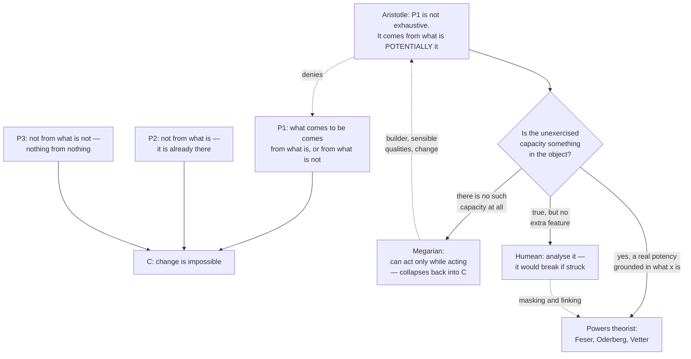

# Metaphysics · Lesson 2.2: Change, act and potency

> ⏱ ~15 min · Module 2: Substance, change, and essence · Builds on: [2.1 Substance and accident](02-01-substance-and-accident.md) · Unlocks: [2.3 Hylomorphism and composition](02-03-hylomorphism-and-composition.md)

## Why this matters

[2.1](02-01-substance-and-accident.md) gave you a subject that has properties. Now that subject changes, and the moment you look hard at change it stops being obvious that it is possible at all. Parmenides gave the argument, and it is a good one: you cannot get rid of it by pointing at a moving hand.

Aristotle's answer to it — that there is a third thing between being and not-being, called **potency** — is the single most load-bearing piece of machinery in the neo-Aristotelian tradition. Hylomorphism ([2.3](02-03-hylomorphism-and-composition.md)) is act and potency applied to matter and form. Essence and existence ([2.5](02-05-essence-and-existence.md)) is act and potency applied to what a thing is and that it is. Powers-based modality ([3.2](03-02-what-possible-worlds-are.md)) grounds possibility in potencies. Ordered causal series ([4.4](04-04-ordered-causal-series.md)) are series of actualizers. `thomistic-synthesis` assumes all of it. So this lesson has to leave you able to *use* the distinction on a case you have not seen, not merely recognize the words.

The rival tradition is here too. A Humean thinks the world is a mosaic of actual, categorical states, and that "potency" names a pattern in the mosaic rather than a feature of any object in it. That dispute runs through the whole course.

## The idea

Parmenides' problem, in one breath: for something to come to be, it must come from somewhere. It cannot come from what already is — that is already there, so it did not come to be. And it cannot come from what is not, because nothing comes from nothing. There is no third option. So nothing comes to be, and change is an illusion.

Aristotle's move is to deny that there is no third option, by catching an equivocation on "is." Look at a lump of bronze about to be cast. Is the statue there? *Actually*, no — right now there is a lump. *Simply not there at all*, the way a square circle is not there? Also no, because this bronze is exactly the sort of thing a statue gets made out of, and the wine in the next room is not. The bronze is **potentially** a statue: not nothing, not yet a statue.

So the statue comes to be from what is potentially a statue. Nothing comes from nothing, and nothing here came from nothing.

That is the whole trick, and everything else is bookkeeping. **Act** is the way a thing actually is. **Potency** is a real feature of a thing in virtue of which it can come to be, or do, what it is not yet doing. Three categories, not two: actually F, potentially F, and not even potentially F.

The third category is what keeps "potency" from being a free lunch. A supersaturated solution is potentially a crystal — the potency is grounded in what the solution actually is, its concentration and chemistry, and that is why seeding it works and seeding tap water does not. A person asleep is potentially a reader of Greek if she has learned Greek, and is not if she has not. Potencies are not idle labels for whatever we can imagine; they are located in things and limited by what those things actually are.

## Source

Aristotle, *Metaphysics* IX.3 (Ross's Oxford translation), stating the position he is about to attack:

> "There are some who say, as the Megaric school does, that a thing can act only when it is acting, and when it is not acting it cannot act, e.g. that he who is not building cannot build, but only he who is building, when he is building; and so in all other cases."

The Megarians — a school associated with Euclides of Megara — denied unexercised potency. Not "we cannot tell whether the sleeping builder can build," but: there is no such capacity while he sleeps. This is the sharpest test case in the lesson, and we return to it below.

## The argument

**Parmenides' argument, reconstructed.**

> **P1.** Whatever comes to be comes to be either from what is or from what is not.
> **P2.** It cannot come to be from what is — what already is does not come to be.
> **P3.** It cannot come to be from what is not — nothing comes from nothing.
> **∴ C.** Nothing comes to be. Change is impossible.

In words: the two ingredients you could start from are both ruled out, so there is no starting anything.

**Aristotle's reply: P1 is not exhaustive.** "Is" is being used in one sense in P1 and another in P2. What comes to be comes to be from what *is potentially* it and *is not actually* it. That is a fourth option the disjunction missed, and it satisfies both P2 and P3: the bronze is not already a statue, so P2 does not apply; the bronze is something rather than nothing, so P3 does not apply.

Alongside it, *Physics* I.7 gives the three principles any change needs: a **substrate** that persists, a **form** it acquires, and a **privation** — its lacking that form beforehand. Privation is not a fourth thing in the world; it is the substrate's not-yet, and it is why change has a direction.

**Act and potency, stated.** For a subject x and a determination F:

> x is **in act** with respect to F when x is actually F.
> x is **in potency** to F when x is not actually F but has, in virtue of what it actually is, a real capacity to be or become F.

Two kinds of potency are worth separating. **Passive potency** is a capacity to be changed — the wax can be melted. **Active potency**, or power, is a capacity to change something else — the flame can melt. [4.3](04-03-powers-dispositions-and-laws.md) is the contemporary theory of the second.

Aristotle's definition of change itself follows (*Physics* III.1): change is the actualization of a potency *precisely as* a potency. In words: motion is not the starting state and not the finished state but the in-between, the being-actualized itself — the water at 60 degrees on its way to boiling is neither cold nor boiling but *heating*.

**Act and potency are relative, not absolute.** *De Anima* II.1 draws the distinction that makes this usable: someone who has learned Greek but is asleep is in **first act** with respect to Greek — she really has the knowledge, which the illiterate does not — and simultaneously in **potency** with respect to reading, which is **second act**. Nothing is simply "a potency"; a thing is in potency *to* something, and the same state can be an act relative to what produced it and a potency relative to what it enables.

**Accidental and substantial change.** This is where [2.1](02-01-substance-and-accident.md) is needed.

- In **accidental change**, the substance persists and an accident is replaced: Socrates pale becomes Socrates tanned. The substrate is the substance itself.
- In **substantial change**, the substance itself ceases and a new one comes to be: a log burns to ash and smoke. The substrate cannot be the substance, because the substance is what went away — so something more basic must persist. That something is what [2.3](02-03-hylomorphism-and-composition.md) calls **matter**, and the pair transfers directly: matter is the potency, form is the act that makes it a thing of some kind. Pressing the question to a substrate with no form of its own — pure potency — is the argument for prime matter, which 2.3 weighs.

Notice the pressure this puts on 2.1's rivals. [2.1](02-01-substance-and-accident.md) already listed persistence through contraries among the marks of substance; here is the bill. Accidental change requires a subject that is numerically the same before and after while its properties differ, and a bundle theorist, for whom a thing just *is* its properties, cannot have that for free: change a property and you have a different bundle. The standard repairs are to index bundles to times and add a relation tying them into one history, or to accept that strictly nothing survives. Neither is absurd, but both are costs. A four-dimensionalist takes the second route cheerfully: what we call surviving change is a relation among successive stages, not a subject enduring through them. That road leads to [5.4](05-04-endurance-perdurance-and-stages.md).

**The principle of motion.** Now the premise that later arguments actually use. Stated carefully:

> Nothing is moved from potency to act with respect to F except by something already in act with respect to F. Equivalently: nothing can be both in potency to F and in act with respect to F at the same time and in the same respect, so nothing actualizes its own potency in that same respect.

In words: a thing cannot give itself what it does not have. Aquinas states it compactly at *Summa Theologiae* I q.2 a.3 and builds an argument on it; that argument belongs to [`philosophy-of-religion`](../../philosophy-of-religion/syllabus.md) and `thomistic-synthesis`, and is not run here. What we need is the premise, stated precisely enough to be attacked.

Three clarifications carry most of the weight:

1. **"In the same respect" is doing real work.** Self-movers are not counterexamples when the self is composite: Aristotle analyses an animal's self-motion as one part actualizing another (*Physics* VIII.5). The principle forbids a thing's being actualizer and actualized in the very same respect, not a thing's having parts that move each other.
2. **The actualizer need not be earlier.** The principle is about dependence, not temporal order; the hand and the moving stick are simultaneous. That is [4.4](04-04-ordered-causal-series.md)'s subject.
3. **It is not the principle of sufficient reason and not determinism.** It does not say everything has a cause, and it does not say causes necessitate their effects. Conflating it with either is the most common error in both directions — it makes the principle look refuted by any indeterminism, and it makes it look like it proves far more than it says.

**Where critics push, and the reply.** Two live pressure points, stated at strength:

*Self-organizing systems.* A convection cell forms in heated oil; a protein folds into its native shape with nothing directing it; an embryo develops. Nothing outside seems to be doing the actualizing. The neo-Aristotelian reply (Feser, Oderberg) is that these are composite systems under maintained boundary conditions: parts actualize parts, and the energy gradient, solvent or temperature difference is an actual condition without which nothing happens. The critic's counter-reply is that if this much can be absorbed, the principle risks becoming unfalsifiable — any apparent self-actualization can be redescribed as part-on-part.

*Quantum indeterminacy.* An excited atom decays with no determining external trigger; nothing in the prior state fixes when. The reply (Feser most explicitly; Koons argues more strongly that quantum mechanics is congenial to a hylomorphic reading) distinguishes an **actual cause** from a **determining cause**: the atom's actual, unstable configuration is a real power directed toward decay, and the principle demands only that the actualization trace to something already actual, not that it be necessitated. The counter-reply is the one to take seriously: if a power can fire without any further actual condition settling that it fires now, the principle has been weakened, and the arguments downstream that need a strong reading may not get one. This course does not adjudicate that.

**The Humean alternative.** The Humean does not deny that glasses break. He denies that "this glass can shatter" reports a further feature of the glass, over and above its actual molecular structure and the world's regularities. The standard analysis is conditional: *x is fragile* means *x would break if struck*. Note what this is and is not. It is not Megarianism — it grants that the unstruck glass is fragile. It is a claim about the **truthmaker**: what makes the capacity-ascription true is a counterfactual, not a power residing in the object. That is the crux of the whole dispute, and the standard trouble for the analysis — masked and finked dispositions — is taken up in [4.3](04-03-powers-dispositions-and-laws.md) and in this module's boss problem.

**Back to the Megarians.** Their view is the sharpest test because it isolates exactly the claim everything rests on: that there are unexercised potencies. Aristotle's three objections, in outline:

- *The builder.* On the Megarian view no one is a builder except while building, so a craftsman loses the art the moment he stops and regains it the moment he starts — having learned nothing in between. Acquired skills do not work like that.
- *Sensible qualities.* If nothing has the capacity to be seen or tasted unless it is being seen or tasted, then nothing is cold or sweet or visible while unperceived, and the Megarian has become a Protagorean about all perceptible qualities.
- *Change itself.* If what is not now happening cannot happen, then the seated man can never stand. The Megarian abolishes coming-to-be — which lands him back at Parmenides' conclusion by a different road.

## Argument map

## Worked examples

**Example 1 (mechanical — running the analysis on a clean case).** A pan of water at 20 degrees is set on a lit burner and reaches 100 degrees.

Work it in order. **Subject:** this water. **Act, before:** actually 20 degrees, actually liquid. **Privation:** not hot. **Potency actualized:** the water's real capacity to be hot — grounded in what it actually is, which is why this works on water and not on a brick at the same temperature in the same time. **Actualizer:** the flame, which is *already actually* hot; it has in act what the water has only in potency. **Kind of change:** accidental — the water is the same water at 100 degrees, so temperature is an accident it gains and loses.

Two things to notice. First, the same water is simultaneously in potency to other things — being frozen, being electrolysed — and nothing in the water alone selects which gets actualized; that requires an actualizer with the relevant act. Second, push the case: keep heating and the liquid becomes steam. Whether *that* is a further accidental change or a substantial one is a real question the hylomorphist must answer, and it is [2.3](02-03-hylomorphism-and-composition.md)'s to answer. The vocabulary does not settle it for you.

**Example 2 (why you'd care — a hard case where the machinery strains).** A single excited atom drops to its ground state and emits a photon. No one struck it. Nothing in its prior state fixed that it would happen at this instant rather than a microsecond later.

Run the analysis anyway. The atom is in potency to the ground state; it is actually in an unstable excited configuration. The neo-Aristotelian says the actualizer is already available: the atom's own actual configuration, together with its interaction with the electromagnetic field, is a genuine power directed at just this transition, which is why *this* atom decays and a ground-state one does not. The principle asks for an actual cause; it got one. Indeterminism removes necessitation, not actuality.

Now the pressure. The critic grants all that and asks what the principle is still forbidding. If a power may fire with no further actual condition settling that it fires now, then a thing's passing from potency to act is traceable to its own actual nature and nothing else — which is close to what "nothing moves itself" was supposed to rule out. The Aristotelian replies that the excited state was itself produced by something actual, and that the principle governs each actualization in the chain rather than demanding a determining trigger for each. Whether that leaves the principle strong enough for the regress arguments in [4.4](04-04-ordered-causal-series.md) is exactly what a critic disputes, and the lesson does not decide it. What you should take away is where the disagreement lives: not in whether atoms decay, but in what an "actual cause" has to do.

## Watch out

- **Potency is not mere logical possibility.** "Possibly F" is cheap and costs nothing. A potency is located in a thing and limited by what that thing actually is. Erase the difference and powers-based modality in [3.2](03-02-what-possible-worlds-are.md) becomes a relabelling instead of a position.
- **Potency is not a small quantity of act hiding inside.** The statue is not in the bronze in miniature, and the oak is not a tiny oak in the acorn. Potency is a relation to a form the thing does not have.
- **"Nothing moves itself" is narrower than it sounds.** It is not "everything has a cause" (that is the PSR — [3.3](03-03-brute-facts-and-necessary-existence.md)) and not "every event is necessitated" (that is determinism — [6.1](06-01-determinism-and-the-consequence-argument.md)). Stating it as either of those is an exegetical error, and it is the mistake that drives most bad exchanges about quantum mechanics.
- **The Humean is not a Megarian.** He grants that the unstruck glass is fragile. He denies that its fragility is a further ingredient of the glass. Attacking him as though he denied unexercised capacities attacks nobody.
- **Do not assume the accidental/substantial line is obvious.** Whether water boiling, iron rusting or an animal dying is a substantial change is contested inside the Aristotelian camp, and a mereological nihilist denies that there were ever substances to change. The distinction is a framework, not a verdict machine.

## One-liner

> Change is possible because "not yet a statue" and "nothing at all" are different states — and the whole neo-Aristotelian edifice rests on whether that difference names something real in the bronze or only something true about it.

## Problems

**P1 (🟢) *(Exegetical.)*** For each case, name the subject, the potency being actualized, what is in act and doing the actualizing, and say whether the change is accidental or substantial. One or two sentences each.

(a) A cold iron bar is left in a forge and glows red.
(b) A woman who learned Greek years ago wakes, opens Homer, and reads.
(c) A lump of sodium is dropped into water and is consumed, leaving sodium hydroxide and hydrogen.

**P2 (🟡) *(Exegetical (a) · Evaluative (b).)*** An invented passage from an essay on careers:

> "There is no such thing as unrealized talent. A person who never writes a novel is not a novelist with an unexpressed gift; 'talent' is just the name we give afterwards to what someone turned out to do. Which is why the only honest measure of a company is shipped product. Potential is a story we tell about a résumé."

(a) Name the metaphysical thesis the passage is committed to, say which classical position it reproduces, and say which of Aristotle's three objections in *Metaphysics* IX.3 bears on it most directly. (b) The writer retreats: "I only meant we have no reliable evidence of unexercised talent." Is that retreat available to him without giving up his conclusion? 150 words or fewer; any verdict, provided you say what the retreat changes about what is being claimed.

**P3 (🔴, optional) *(Exegetical (a) · Evaluative (b).)*** (a) State the principle that nothing is moved from potency to act except by something already in act, including the "same respect" qualifier, and explain in one sentence why an animal moving itself is not a counterexample on Aristotle's own account. (b) A critic offers a folding protein: an unfolded chain, in plain solvent, arrives at its native shape with nothing outside arranging it. Does this violate the principle? 150 words or fewer. Any verdict, provided you say what the Aristotelian must claim about the case and what that claim costs.

Solutions

**P1** *(Exegetical — strict.)*

**Must hit, strict:**
- (a) Subject: the iron bar. Potency: to being hot and luminous. Actualizer: the fire, already actually hot. **Accidental** — the same bar persists; temperature and colour are accidents.
- (b) Subject: the woman. Potency: to *reading*, i.e. second act. Crucially she was already in **first act** with respect to knowing Greek — she has the knowledge while asleep — so what is actualized is the exercise, not the knowledge. Actualizer: herself as agent, plus the opened text; nothing new is learned. **Accidental.** This is the case the Megarian must deny outright.
- (c) Subject: strictly, the sodium and water — and they do not survive. **Substantial:** the sodium ceases to be and new substances come to be. So the substrate cannot be either original substance, which is why the hylomorphist posits matter as what persists. Actualizer: each reactant is in act with respect to what it does to the other.

**Wrong turns:** calling (b) substantial because the woman "becomes a reader" — reading is something she does, not a new kind of thing she is; calling (c) accidental because the atoms persist, which answers a different question (atoms persisting is exactly what a critic of substantial change presses, but the sodium does not persist); leaving out the actualizer in (a) and saying the bar "heats up," which describes the change without analysing it.

**Model answer:** as above.

---

**P2** *(a) exegetical — strict; (b) evaluative — any verdict.*

**Must hit, strict (a):** the thesis is the **denial of unexercised potency** — a capacity exists only while exercised. That is **Megarianism**, transposed from building to writing. The objection that bears most directly is Aristotle's first: the craftsman who is not now building would have to lose and regain the art instantaneously, having learned nothing in between. The parallel: on the writer's view a novelist acquires the gift at the first sentence and loses it on finishing, which is not how skill is acquired, retained or lost.

**Must hit, any verdict (b):** say what the retreat changes — it converts a metaphysical claim (there is no such capacity) into an epistemic one (we cannot detect it). Then test whether the conclusion survives the swap. "Potential is a story we tell" and "the only honest measure is shipped product" are two different claims; the second can be defended epistemically, the first cannot. Either verdict passes if the shift in what is claimed is named.

**Wrong turns:** treating the passage as merely rhetorical and declining to name a thesis — the archetype asks what commitment is doing the work; arguing about whether talent exists as a psychological matter, which is not what was asked; saying the retreat fails simply because the original claim was false, without showing what the weaker claim can and cannot support.

**Model answer (b), one of several:** The retreat is available, but it buys a much smaller conclusion. The epistemic claim — unexercised capacity is hard to verify, so track record is the best available evidence — is defensible and gives him his hiring advice. It does not give him the first sentence. If unexercised talent is merely undetectable, then the person who never wrote may still have had the gift, and "talent is just the name we give afterwards" is false. He can keep either the metaphysics or the modest practical conclusion; the essay's force came from running them together, so the retreat costs him the essay's thesis while saving its advice.

---

**P3** *(a) exegetical — strict; (b) evaluative — any verdict.*

**Must hit, strict (a):** nothing passes from potency to act with respect to F except through something already in act with respect to F; nothing is both in potency to F and in act regarding F *at the same time and in the same respect*, so nothing actualizes itself in that same respect. The animal is not a counterexample because the qualifier permits one part to actualize another — Aristotle's own analysis of animal self-motion in *Physics* VIII.5 — so the animal is a self-mover as a whole and not in the same respect.

**Must hit, any verdict (b):** state what the Aristotelian must say — the folding chain is composite, so residues, solvent and thermal environment are parts and conditions already in act, and the native state's actualization traces to them; nothing whole-on-whole in the same respect is happening. Then name the cost, which is the honest half of the answer: the more redescription is permitted, the harder it becomes to say what would count as a violation. A good answer either defends the redescription as principled (composites really do have parts, and the boundary conditions really are needed) or presses the unfalsifiability worry — and notes that the interesting case would be a genuine simple, which is where the quantum version of the objection bites.

**Wrong turns:** claiming the protein does violate the principle because "nothing external acts," which ignores the solvent and thermal conditions the folding actually requires; claiming it obviously does not, with no statement of what the Aristotelian has had to absorb; sliding into determinism — the principle does not require that the folding pathway be necessitated, so citing stochastic folding is not yet an objection.

**Model answer (b), one of several:** No violation, but not for free. Folding is not a simple actualizing itself: it is a composite whose parts have actual electrostatic and hydrophobic properties, in a solvent at a temperature, and remove any of those and nothing folds. Every step is one actual thing acting on another, so the same-respect clause is never breached. The cost is that this redescription is always available for any macroscopic system, so the principle does no work at the level where it is usually challenged; its real content shows up only for something without parts. That is why the serious version of this objection is the quantum one, not the biochemical one — and a critic is entitled to say that a principle safe only because it is always redescribable is safe in a suspicious way.

## Flashback

**From Lesson 1.4 (Nominalism and tropes):** Three copper wires each conduct electricity.

(a) State what a **trope theorist** and a **class nominalist** each say the three wires have in common — be precise about what the shared item is, and what the trope theorist must add to avoid saying the three conductivities are one thing. (b) A **resemblance nominalist** says conductivity is the class of things resembling these paradigms. Suppose that, as it happens, every conductor in the sample is also opaque. Which of Goodman's two difficulties does that create, and what does the resemblance nominalist need in order to escape it? 150 words or fewer.

Solution

**Must hit, strict (a):** the **class nominalist** says the shared item is *membership in a class* — the wires are all members of the class of conductors, and that is all there is to their sharing a property; no entity is in all three. The **trope theorist** says each wire has its own particular conductivity — three numerically distinct tropes, not one repeatable universal — and must add a **resemblance** (or exact-similarity) relation among the tropes to explain why they count as the same property. Saying the three have "the same trope" is the error: tropes are particulars, one per bearer.

**Must hit, strict (b):** this is the **companionship difficulty** — when one property's class is a subset of, or coextensive with, another's, resemblance to the paradigms cannot distinguish them, so conductivity and opacity come out as the same property. Escape routes: enlarge or diversify the sample so the classes come apart; appeal to *possible* as well as actual members; or accept a primitive naturalness ranking over classes, which is the Lewisian repair and is a concession about how much pure resemblance can do. Note the contrast with the **imperfect community** difficulty, which is the opposite failure — a class whose members all resemble each other pairwise without sharing any one property.

**Wrong turns:** naming imperfect community instead of companionship — the case has a *nested* class, not a patchwork of pairwise resemblances; treating the class nominalist and the resemblance nominalist as the same view, when the second is an attempt to say which classes are the property-classes; giving the trope theorist a shared universal by the back door.

**Model answer:** (a) Class nominalist: nothing is literally shared — the wires are co-members of a class. Trope theorist: three distinct conductivity-tropes, one per wire, held together by exact resemblance. (b) Companionship: opacity's class contains conductivity's, so resemblance to the conductor paradigms picks out both, and the view cannot say which property it has defined. He needs either a sample in which the classes separate, an appeal to merely possible members, or a primitive standard of naturalness — the last of which concedes that resemblance alone was not enough.

## Connections

- **Backward:** [2.1](02-01-substance-and-accident.md) supplied the persisting subject that accidental change requires; this lesson is where the bundle theorist's bill arrives. [1.4](01-04-nominalism-and-tropes.md) supplies the flashback, and the trope theorist's particularized properties are the nearest nominalist relative of a power.
- **Forward:** [2.3](02-03-hylomorphism-and-composition.md) takes substantial change seriously and gets matter and form out of it; [2.5](02-05-essence-and-existence.md) applies act and potency to essence and existence; [3.2](03-02-what-possible-worlds-are.md) grounds modality in potencies; [4.3](04-03-powers-dispositions-and-laws.md) is the contemporary theory of active potency and the home of the masking and finking counterexamples; [4.4](04-04-ordered-causal-series.md) chains actualizers and is where the principle of motion earns or loses its keep.
- **Sideways:** the theistic arguments that use the principle belong to [`philosophy-of-religion`](../../philosophy-of-religion/syllabus.md) and `thomistic-synthesis`, which should reload act and potency from here rather than re-teach it. The historical reading of Aristotle's *Physics* and *Metaphysics* belongs to `ancient-medieval-philosophy`.
- **Method:** Aristotle's reply to Parmenides is a distinction drawn to dissolve an apparent impossibility — [`philosophical-method`](../../philosophical-method/syllabus.md) 3.2 — and P2's move is that lesson's test for whether a retreat to a weaker claim keeps the original conclusion.
