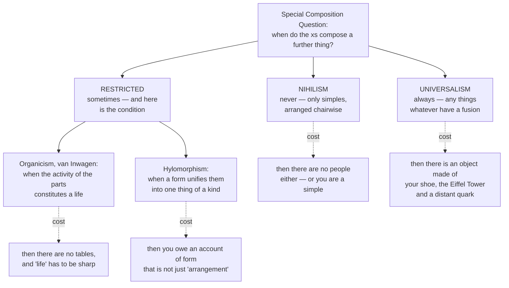

# Metaphysics · Lesson 2.3: Hylomorphism and composition

> ⏱ ~15 min · Module 2: Substance, change, and essence · Builds on: [2.2 Change, act and potency](02-02-change-act-and-potency.md) · Unlocks: [2.4 Essence and grounding](02-04-essence-and-grounding.md)

## Why this matters

[2.1](02-01-substance-and-accident.md) asked what has the properties. [2.2](02-02-change-act-and-potency.md) asked how a thing can change and still be itself. This lesson asks the question underneath both: what makes many things **one** thing at all? Your body is some atoms; a bicycle is some parts. Is there anything there over and above them?

The answer decides your inventory of the world — whether it contains organisms and artifacts or only particles — and it decides whether "substance" from 2.1 names a genuine unity or just a heap we have a word for. It is also where the neo-Aristotelian's **form** either earns its keep or is exposed as an empty word.

## The idea

Peter van Inwagen made the old question tractable by generalizing it. Don't ask "do chairs exist?" Ask:

> **The Special Composition Question (SCQ).** Take any things you like — call them the *xs*. Under what conditions is there a further thing, *y*, that the xs compose?

An answer fills the blank in: *the xs compose something if and only if* ___. Van Inwagen's discipline is what makes this productive: a good answer must be **general** (one condition, not a list) and **non-arbitrary** (no unexplained cut-off). Most first guesses fail on the spot. "When they're stuck together"? Glue two people's hands together and you do not get a new organism. "When they act as one"? Then a drilled choir is a thing and a sleeping dog is not.

Exactly two answers are trivially general: *never*, and *always*. Everything else is **restricted**, and owes a condition.

## The argument

**Nihilism.** Composition never occurs. Nothing has proper parts; there are only mereological **simples**. Talk of chairs is loose talk: strictly there are *simples arranged chairwise*.

In words: the atoms are there, the arrangement is there, and no extra object is there.

Nihilism pays nothing in description — every truth about the chair becomes a truth about the simples and their arrangement — and nothing in arbitrariness, since there is no line to draw. Its bill comes due on **us**. If composition never occurs, then either you are a simple or you do not exist; you seem to have parts, and the second option has to be asserted by someone. The serious nihilist replies that "I exist" is loosely true the way "the chair exists" is, and that loose truth is all anyone ever meant — a real position, and a large one to swallow while swallowing it.

**Universalism (unrestricted composition).** Any things whatever compose something. Your left shoe, the Eiffel Tower and a quark in Andromeda compose an object.

In words: for any collection at all, however scattered, there is a thing made of exactly those.

The best argument for it is an **argument from vagueness**, pressed by Lewis and Sider:

> **P1.** If composition were restricted, there would be borderline cases — series of situations shading from clearly composing to clearly not (assemble a chair one fibre at a time).
> **P2.** In a borderline case it would be vague whether a further object exists.
> **P3.** If it is vague whether a further object exists, then it is vague *how many things there are* — and that is a vagueness in counting, in existence and identity themselves, not in our words.
> **P4.** Existence and identity are not vague. (Either there is a further thing or there isn't; "how many things are here" has a number as its answer.)
> **∴ C.** Composition is not restricted: it is either never or always. And since the chair-fibre series clearly ends with something, it is always.

Its bill: **arbitrary scattered objects**, an inventory bloated beyond anything science or common sense tracks. The universalist's reply is that this is a cost in taste, not in theory — objecthood is cheap, *interestingness* is what is scarce. The complaint is that this makes "object" do no work, and pushes the real work onto an unanalyzed notion of which fusions are natural.

**Restricted answers.** Van Inwagen's own: **the xs compose something when the activity of the xs constitutes a life.** In words: parts make a whole when they are caught up together in the self-maintaining process of a living thing. So organisms and simples exist; chairs and tables do not. The criterion is not arbitrary because a life is a real, independently studied kind of unity: the parts are not merely adjacent, they are continuously produced, replaced and regulated by the very process they sustain. The cost is that it keeps the nihilist's verdict about every artifact, and that "constitutes a life" must be sharp enough to survive P2 above.

**The hylomorphic answer.** Parts compose a whole when they are unified by a **form** — a principle of organization that makes them one thing *of a kind*. Matter (*hulē*) is what a thing is made of; form (*morphē*) is what makes that matter *this thing*. A substance is therefore not a heap: it has its parts *as* parts of it, organized so as to constitute one member of a kind, and the kind comes with a characteristic way of behaving. Notice that the SCQ then gets no single answer in terms of arrangement, since the unifying condition *is* the form and forms differ by kind. That is either the view's chief virtue (it stops pretending one formula covers dogs, water and statues) or its chief evasion (it answers "when?" with "when they are unified," which was the question).

**Prime matter.** In substantial change (2.2) one substance ceases and another begins, so what underlies cannot be the old form; press the question and you reach matter with no form of its own — **prime matter**, pure potency, never met on its own. It is the most contested piece of classical hylomorphism, and most contemporary hylomorphists drop it, taking matter to be whatever lower-level structured stuff there happens to be.

**Contemporary hylomorphism is a live research programme, not a period piece.** Four strands worth keeping distinct:

| Who | The move | What it denies |
|---|---|---|
| **Kit Fine** | Objects have a *principle of composition* built into them: a ham sandwich is not the sum of bread and ham, it is those parts *in a certain arrangement*, and two objects can share all their material parts and still differ | **Mereological reductionism** — that a whole is fixed by its parts alone |
| **Kathrin Koslicki** | **Structure is a proper part** of the whole: the object has material parts *and* a formal part | That only material parts compose; keeps a mereology, changes what goes into it |
| **Mark Johnston** | A thing is its parts *under a principle of unity*; the principle is what the thing's kind supplies | That "parts" and "whole" can be related without a unifying principle |
| **Michael Rea** | Hylomorphism as the best solution to the **material-constitution** puzzles (statue and lump) | That constitution puzzles can be solved with mereology alone |

Add Koons and Jaworski, who put structure to work in physics and biology respectively. None of them is doing exegesis of Aristotle; they are arguing that mereology alone under-describes the world.

**The homonymy principle.** Aristotle's consequence, at *Politics* I.2 and again in the *Meteorology*: a severed hand is a hand in name only. A hand is defined by what it does, and what it does it can only do attached — so the thing on the table shares the word and not the nature, like a hand carved in stone.

- **What it buys.** A part is a part only as functioning in the whole. That blocks the objection "the parts existed before the whole, so the whole is just them rearranged" — the parts did not exist *as those parts* before the whole did. It also gives the organism priority over its organs, which is what lets the hylomorphist say there is one substance there and not a colony.
- **What it costs.** It sounds false. Something is on the table; surgeons reattach it. The hylomorphist must say that object is a mass of tissue that was a hand and is now homonymously so — coherent, but it leaves biology's part-talk either false or loose, exactly the charge hylomorphists press against nihilism.

**The obscurity objection, and the reply.** The standard anti-Aristotelian complaint is that form is obscure: an unexplained explainer wheeled in whenever unity is needed, with no place in physics. The standard reply is that **structure is precisely what the sciences quantify over** — molecular geometry, protein folds, crystal lattices, nucleotide sequence, circuit topology. Chemistry's basic explanatory claim is that the same atoms arranged differently are a different substance with different powers. If "formal cause" means *arrangement that explains behaviour*, science is drenched in it.

The Humean–Quinean counter-reply is the real crux: granted structure is real, but structure is a *relation among the parts*, a pattern in the mosaic, not a further constituent. On that reading hylomorphism is either trivially true or, in Koslicki's version, adds a part nobody needs. **The crux is not whether structure matters. It is whether structure is an ingredient of the object or an arrangement of its ingredients.**

## Map of positions

## Worked examples

**Example 1 (clean — run all four answers on one case).** Six bricks are stacked into a small cairn. Is there now a cairn, over and above the bricks?

- **Nihilism:** no. Strictly, simples arranged brickwise, arranged cairnwise. Nothing came into existence when you stacked them; the simples changed position.
- **Universalism:** yes — and the object was there before the stacking, since the fusion of those six bricks existed while they lay scattered in the yard. Stacking changed its shape, not its existence. (A feature, not a slip: on universalism, assembly is never creation.)
- **Organicism:** no. Nothing here constitutes a life — the condition is stated and not met.
- **Hylomorphism:** no *substance*. The classical hylomorphist is as strict as van Inwagen: artifacts have an imposed arrangement, not a substantial form, so a cairn is an accidental unity — bricks arranged by us for a purpose. (Koslicki and Fine are more generous to artifacts, since a structure is a structure whatever its origin.)

Three of the four say "no cairn," and the differences are entirely in the reasons.

**Example 2 (hard — where it strains: isomers).** Butane and isobutane are made of exactly the same atoms: four carbons and ten hydrogens. They differ only in connectivity — one a chain, one branched. They are different substances with different boiling points, roughly ten degrees Celsius apart. Now suppose a single molecule of butane isomerizes into isobutane, same atoms throughout.

- **Universalism** has a clean, uncomfortable answer. The fusion of those fourteen atoms is one object before and after, because a fusion is fixed by its parts. So chemical kinds are not kinds of *thing*: "being butane" is a property the fusion has in virtue of how its parts are arranged, and isomerization is a change *in* one lasting object. Clean — but it makes the deepest classification in organic chemistry a matter of a lump's passing states.
- **Nihilism** says there was never a molecule: simples arranged butane-wise became simples arranged isobutane-wise. Adequate as description — but notice what carries it. *Arranged butane-wise* does every bit of the work "butane" did, and it is not a property of any simple. The nihilist quantifies over simples and helps himself to arrangement.
- **Fine and Koslicki** take this as their case. If two things can consist of the same atoms and differ, a whole is not fixed by its parts, so something besides the parts is in the object — a principle of composition (Fine) or a formal part (Koslicki). Then isomerization destroys one thing and generates another: **substantial change** in 2.2's sense, not an accidental change in a lump.
- **Van Inwagen** says there is no molecule either way, since no life is constituted, and leans on the same arrangement-talk as the nihilist.

Everyone agrees the arrangement is real and explains the boiling point. The disagreement is whether the arrangement is *a way some things are* or *part of what a thing is* — and so whether isomerization changes a thing or replaces one.

## Watch out

- **Nihilism does not say nothing exists.** It says nothing has proper parts. Simples exist, and so do all the arrangements; what is denied is the extra object.
- **Universalism is not the claim that every fusion is interesting.** It is the claim that every fusion *exists*. Mockery of the shoe-plus-tower object misses; the argument to beat is the vagueness argument, and beating it means rejecting one of P1–P4.
- **Form is not a part, for Aristotle.** Koslicki's thesis that structure is a proper part is her contested departure from the tradition. Do not attribute it to Aristotle, or treat the two as one view.
- **Prime matter is not Locke's substratum.** Both are bare and uncharacterizable, which is why [2.1](02-01-substance-and-accident.md) flags the confusion. But the substratum is a *bearer of accidents* underlying an existing substance, while prime matter is what underlies the *replacement of one substance by another*. A hylomorphist can reject substrata and keep prime matter, or the reverse.
- **Composition is not constitution.** "Do these parts make a whole?" is this lesson. "Are the statue and the lump one thing or two?" is coincidence, which [5.3](05-03-coincidence-and-the-ship-of-theseus.md) owns.
- **The homonymy principle is not a denial that anything is on the table.** It denies that the thing there satisfies the definition of *hand*. Refuting it takes an argument that function is not definitional, not an appeal to the obvious.
- **"When they're unified" is not yet an answer to the SCQ.** If hylomorphism attracts you, the work is saying what a form is such that it can unify — [2.4](02-04-essence-and-grounding.md)'s business.
- **The four causes are a map of questions, not four forces.** What is it made of (material), what makes it this kind of thing (formal), what brought it about (efficient), what is it directed to (final). This lesson is about the second; the last two are Module 4's.

## One-liner

> The Special Composition Question turns "do chairs exist?" into "when do many things make one thing?" — and every answer pays: never (then not us either), always (then the shoe-and-Eiffel-Tower object), or *on this condition* — and the hylomorphist's condition is a form, which is powerful exactly to the degree that it is more than arrangement.

## Problems

**P1 (🟢) *(Exegetical.)*** For each case, say whether a further object exists according to (i) nihilism, (ii) universalism, (iii) van Inwagen's organicism, and (iv) a classical hylomorphist. One clause each; where two views agree, say briefly what separates their reasons.

(a) A swarm of bees moving as a unit.
(b) A functioning heart inside a living dog.
(c) The things consisting of your left shoe and the planet Neptune.

**P2 (🟡) *(Exegetical (a) · Evaluative (b).)*** An invented passage from a popular-science column:

> "A body is nothing but its molecules. That is why the fact that you replace most of your atoms over the years shouldn't trouble you: you were never the atoms in the first place. You are the pattern they keep making — and a pattern, of course, isn't an extra thing in the world, just a way things are arranged."

(a) Name the question actually doing the work in this paragraph, and state the tension between the passage's first sentence and its last two. 150 words or fewer. (b) Which answer to the SCQ makes the atom-turnover fact least puzzling? Say what that answer costs. 150 words or fewer, any verdict, provided you say what the cost is.

**P3 (🔴, optional) *(Evaluative.)*** State the strongest objection to the homonymy principle in 75 words, then the best hylomorphic reply in 75 more. The reply must say what it concedes.

Solutions

**P1** *(Exegetical — strict.)*

**Must hit, strict:**
- **(a) Swarm.** Nihilism: no — simples arranged beewise, and in any case no swarm over the bees. Universalism: yes — the fusion of those bees exists, and existed before they swarmed. Organicism: **no** — this is the standard test case; the activity of the *bees* does not constitute a single life, it constitutes many lives (each bee is an organism, the hive is not). Hylomorphism: no substance — the swarm is an accidental unity of many substances, however tightly coordinated. Credit for noting that (i), (iii) and (iv) agree on the verdict and disagree on the reason: no composites at all / no life here / no single substantial form.
- **(b) Heart in a living dog.** Nihilism: no heart. Universalism: yes, and also yes to countless other objects overlapping it. Organicism: **no heart** — only the dog is an organism; van Inwagen's condition is met by the dog's parts as a whole, and there are no proper parts of a dog that are themselves composites. Hylomorphism: **no heart as a substance** — the dog is the one substance, and the heart is a heart in the full sense only while functioning in it; severed, it is a heart homonymously. The convergence between (iii) and (iv) here is the point of the question.
- **(c) Shoe plus Neptune.** Nihilism: no. Universalism: **yes** — this is the commitment, and the universalist accepts it rather than explaining it away. Organicism: no (no life). Hylomorphism: no (no form unifies them; a scattered pair is not one thing of any kind).

**Wrong turns:** giving organicism a "yes" for the swarm because bees are alive — the criterion asks whether the parts' activity constitutes *one* life, and it does not; treating universalism's "yes" for (c) as a reductio rather than as the position; saying the heart exists on organicism because hearts are biological.

**Model answer:** as above.

---

**P2** *(a) exegetical — strict; (b) evaluative — any verdict.*

**Must hit, strict (a):** the question doing the work is the **Special Composition Question** — whether the molecules compose a further thing — together with its persistence corollary (what makes the later body the same thing as the earlier one, which is [5.4](05-04-endurance-perdurance-and-stages.md)'s). The tension: sentence one is nihilist in spirit ("nothing but its molecules" — no further object, the molecules are all there is), while the last two identify **you** with the *pattern* rather than with the molecules, and then deny the pattern is a thing. Taken together: you are the pattern, the pattern is not a thing, therefore you are not a thing. Either the writer wants the arrangement to be an object after all — which is closer to hylomorphism than to nihilism, since it makes structure what you are — or the reassurance collapses, because there is nothing left to be reassured.

**Must hit, any verdict (b):** name a specific answer and name its cost. Examples that pass: *nihilism* — turnover is unpuzzling because there was never a composite to persist, only simples, and the cost is that there is no one whom the turnover fails to trouble; *universalism* — but note this answer does badly here, since the fusion of your current atoms is not the fusion of your atoms a decade ago, so universalism must locate you in some other object (a temporal fusion, which is a commitment to be stated); *organicism or hylomorphism* — turnover is unpuzzling because you are an organism whose form persists *through* material exchange, and metabolic replacement is what a life does, and the cost is an account of form or of "constitutes a life" strong enough to fix identity and sharp enough to avoid the vagueness argument.

**Wrong turns:** answering (a) with "the Ship of Theseus" and stopping — naming the puzzle is not naming the question or the tension; treating (b) as settled by (a); asserting a verdict about whether patterns are real without saying what it costs.

**Model answer (b), one of several:** Organicism and hylomorphism make the turnover least puzzling, because both already hold that a living thing is a process-maintained unity rather than a stock of matter: replacing the matter is what the unity *does*, so persistence through turnover is predicted rather than accommodated. The cost is the whole burden of the restricted answer — saying what a life, or a form, is, precisely enough that there is always a fact of the matter about whether one is present. That is a real debt, and the vagueness argument is the bill. A nihilist gets the same result more cheaply, but pays for it by having no subject who persists at all; the column plainly wants one.

---

**P3** *(Evaluative — any verdict; the moves are graded.)*

**Must hit, any verdict:**
- **The objection stated precisely.** Not "but there is obviously a hand on the table." The strongest version: the principle makes function definitional of the part, but we individuate hands by anatomy in contexts where function is absent or impaired — a paralyzed hand, an anaesthetized hand, a hand in transport for reattachment. If those are all hands, function is not definitional; if they are not, the principle is committed to saying surgeons reattach something that is not a hand and it becomes one, which drains the principle's content or makes it verbal.
- **The reply must concede something.** Acceptable concessions: that there is an object on the table and it is materially continuous with the hand; that biology's part-talk is idiomatic rather than strict; that the principle is stated for the paradigm case and the borderline cases are genuinely borderline. Acceptable replies: distinguish *proximate capacity* from *exercise*, so the anaesthetized hand keeps the capacity while the severed one does not; or hold that the whole is prior, so the severed thing is a residue of a part rather than a part, which is what the hylomorphist needed the principle for in the first place.

**Wrong turns:** refuting the principle by restating it as absurd; defending it by asserting the priority of the whole without argument (that is the conclusion the principle is meant to support, so it cannot be the defence); treating the dispute as merely verbal without running the test for a verbal dispute — the parties disagree about whether the organism is one substance or many, which is not a fact about words.

**Model answer, one of several:** *Objection.* A hand under general anaesthetic performs no function, and we do not conclude that the patient has no hands. So function cannot be what makes a hand a hand; anatomical organization is enough, and anatomical organization survives severance. The principle therefore either misdescribes ordinary cases or is a stipulation about the word. *Reply.* Concede the object on the table, and concede that ordinary biological talk is not strict. Distinguish having the capacity from exercising it: the anaesthetized hand retains a proximate capacity, integrated into a living body that regulates it; the severed one has lost the integration that grounded the capacity, and begins decomposing precisely because nothing is maintaining it. What is conceded is that the line is not sharp — tissue kept viable on ice is a genuine borderline case, and the hylomorphist should say so rather than legislate.

## Flashback

**From Lesson 2.1 (substance and accident):** Consider one particular oak in a field. Four things are true of it: *it is an oak*, *it is fifteen metres tall*, *it is to the east of the barn*, *it is a tree*.

(a) Sort the four into those that say what the oak *is* and those that attribute an accident, and flag any that are relational. (b) State in one sentence what a bundle theorist says the oak *is*, and give one difficulty that account faces which a substratum account does not. 150 words or fewer.

Solution

*(Exegetical — strict.)*

**Must hit, strict:**
- **(a)** *Is an oak* and *is a tree* say what it is — substance-kind predications, the second a broader kind than the first, and nothing the oak could lose while remaining. *Is fifteen metres tall* is an accident (quantity), and one the oak acquires and changes over time. *Is to the east of the barn* is an accident and **relational** — it can change without any change in the oak, if the barn is moved. Credit for noticing that the last case shows accidents are not all intrinsic, which is why "accident" is not simply "changeable intrinsic property."
- **(b)** The bundle theorist says the oak *is* a bundle — a co-instantiated collection of properties, with no further subject underneath doing the having. **The difficulty:** change. If the oak just is its properties, then swapping a property gives you a different bundle, so the fifteen-metre oak and the sixteen-metre oak are distinct, and nothing persists through ordinary accidental change. The substratum account keeps a bearer that is not itself any of the properties, so it can say the same thing lost one and gained another. (Equally creditable: the bundle theorist owes an account of what co-instantiation *is* — a unifier by another name — or the difficulty that two indiscernible bundles must be one.)

**Wrong turns:** calling *is a tree* an accident because it is less specific than *is an oak* — generality is not accidentality; treating *to the east of the barn* as an intrinsic property of the oak; answering (b) by saying the bundle theory is false, which is a verdict and not the required difficulty.

**Model answer:** *Is an oak* and *is a tree* are what it is; *fifteen metres tall* and *east of the barn* are accidents, the latter relational, since moving the barn changes it without touching the oak. A bundle theorist says the oak is nothing but a co-instantiated bundle of properties. The difficulty is persistence through accidental change: change any property and you have a different bundle, so the tree that grew a metre is strictly a new object, whereas a substratum account has a bearer that survives the swap.

## Connections

- **Backward:** [2.1](02-01-substance-and-accident.md) asked what has the properties; this lesson asks what makes the haver one thing. [2.2](02-02-change-act-and-potency.md) supplies the machinery — form is the *act* of the matter, matter its potency, and the isomer case above is a live test of whether a given change is substantial or accidental. Module 2's boss problem (a log burning to ash, described twice) is exactly this lesson set against 2.2.
- **Forward:** [2.4](02-04-essence-and-grounding.md) asks what a form *is*, in the contemporary vocabulary of essence and grounding — the obvious next move if you think "unified by a form" is a placeholder. [5.3](05-03-coincidence-and-the-ship-of-theseus.md) runs the material-constitution puzzles that made Rea and Fine hylomorphists, and [5.4](05-04-endurance-perdurance-and-stages.md) shows the four-dimensionalist answer to the vagueness argument. [6.5](06-05-what-a-person-is.md) is this lesson applied to us: animalism is van Inwagen's answer worn as a theory of persons, and the hylomorphic account of a person is its rival.
- **Sideways:** `thomistic-synthesis` starts from this lesson rather than re-teaching it, and takes prime matter and substantial form much further. Jaworski's use of structure belongs to `philosophy-of-mind`. The vagueness argument's premise P4 — that existence and identity are never vague — is a claim about vagueness itself, and whether vagueness can be worldly rather than semantic is contested in `philosophy-of-language-and-logic`.
- **Method:** P2's diagnosis is the standard move from [`philosophical-method`](../../philosophical-method/syllabus.md) — find the question a passage is answering without saying so — and the crux identified at the end of "The argument" (ingredient versus arrangement) is a crux in that course's sense: the one premise the two sides must divide on.
