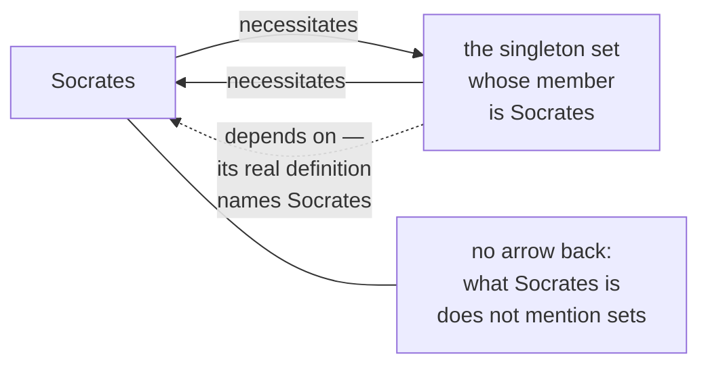

# Metaphysics · Lesson 2.4: Essence and grounding

> ⏱ ~15 min · Module 2: Substance, change, and essence · Builds on: [2.3 Hylomorphism and composition](02-03-hylomorphism-and-composition.md) · Unlocks: [2.5 Essence and existence](02-05-essence-and-existence.md)

## Why this matters

For most of the twentieth century "essential" was treated as shorthand for "necessary, given that the thing exists" — essence reduced to modality, and modality logicians already understood. That deal collapsed on a single example, which is why contemporary metaphysics talks about *real definition* and *grounding* at all. Both ideas do one job for the neo-Aristotelian: they let you say the world has structure — this is what a thing is, this holds in virtue of that — without adding entities to the inventory [1.1](01-01-existence-and-ontological-commitment.md) taught you to read off a theory. Whether that is structure or only a way of talking is the live fight. Downstream, [2.5](02-05-essence-and-existence.md) needs the essence half, Module 3 needs it again when modality gets explained *by* essence rather than the reverse, and [`thomistic-synthesis`](../../thomistic-synthesis/syllabus.md) is built on it.

## The idea

Take Socrates. Two questions that look like one:

- What could Socrates not have failed to be? (**necessity**)
- What is Socrates? (**essence**)

The first has a large, messy answer. Socrates could not have failed to be human; but he also could not have failed to be distinct from the Eiffel Tower, to be a member of the set whose only member is Socrates, or to be such that two and two make four. All are necessary of him. Only the first belongs in an answer to the second question — nobody writing down what Socrates *is* would mention a tower, a set, or arithmetic.

So the necessary properties of a thing are a grab bag. Its essence is a **real definition**: an answer to "what is it?" that stands to the thing as a definition stands to a word. Locke had the distinction under other names (*Essay* III.iii and III.vi). The **nominal essence** of gold is the abstract idea we attach to the word — yellow, heavy, malleable, fusible — and it is our workmanship, since we decide where the line falls. The **real essence** is the thing's internal constitution, from which those observable qualities flow. Locke's pessimism was that for substances we know only the nominal essence; the distinction survives the pessimism, and modern chemistry arguably supplied one real essence he thought unreachable.

A third strand, **sortal essentialism**, says a thing belongs essentially to a *kind*, and the kind is what fixes its identity and persistence conditions: what it takes for this to be the same one again, and what it can survive. A sortal answers "what is it?" with a count noun — *dog*, *statue*, *organism* — and hands you the rules. Flatten the bronze statue: if *statue* is the essential sortal, the thing is gone; if *lump of bronze* is, it survived a change of shape. That is not a side issue. It is the whole of Module 5 in embryo.

Then the second tool. Even once you know what things are, you want to say that some facts hold **in virtue of** others: the ball is red *because* it is scarlet, the act is wrong *because* of the suffering it causes, the party is legally dissolved *because* of what certain people signed. None of those "because"s is causal — no time passes, no law of nature is invoked, and the grounded fact is not a further event. That non-causal, explanatory determination is what **grounding** names.

## The argument

**The modal account of essence (the target).**

> **(MA)** *x* is essentially F if and only if, necessarily, if *x* exists then *x* is F.

In words: a thing's essential properties are the ones it could not have existed without.

**Fine's argument that (MA) fails.** Fine's route runs through one object nobody had thought to use: the set whose sole member is Socrates, written {Socrates}.

> **P1.** If (MA) is correct, then every property a thing could not have existed without is part of what that thing is.
> **P2.** Necessarily, if Socrates exists, then Socrates is a member of {Socrates}. *(Set theory gives you the singleton whenever you have the member.)*
> **P3.** Being a member of that set is no part of what Socrates is. A complete account of Socrates' nature — of what it is to be him — says nothing about sets.
> **∴ C1.** (MA) counts as essential something that is not essential.

In words: the modal account over-generates. It sweeps in every necessary fact about a thing, including facts about objects the thing has nothing to do with.

The knife goes in deeper at the next step, which is the part that changed the field:

> **P4.** It *is* part of what {Socrates} is that it has Socrates as a member. A singleton is defined by its member; that is what a singleton is.
> **P5.** But the modal facts here are symmetric: necessarily, if either exists, the other does and the membership holds. (MA) therefore delivers the same verdict in both directions.
> **∴ C2.** There is an asymmetry in essence that no modal account can mark. Essence is **finer-grained** than necessity.

In words: Socrates and his singleton are locked together by necessity in exactly the same way in both directions, yet the dependence plainly runs one way. Necessity cannot see the difference, so essence is not necessity.

**Fine's positive proposal.** Essentialist claims are claims of *real definition*, written as: it is true **in virtue of the identity of** *x* that so-and-so. That notion is taken as primitive rather than analysed away — and then the explanatory order is reversed. Instead of defining essence in modal terms, Fine proposes that metaphysical necessity be explained by essence: a truth is metaphysically necessary because it follows from the natures of things. Whether a primitive you cannot define is an advance or a retreat is exactly what the Quinean and the Humean will ask.

**Grounding, stated precisely enough to argue about.**

> **(G)** Some facts hold **in virtue of** others. Where they do, the grounded fact is *nothing over and above* its grounds, and the grounds **metaphysically explain** it: the explanation is non-causal, involves no lapse of time, and is not an inference we happen to find satisfying but a structural feature of the facts.

**Full and partial ground.** The Ps *fully* ground Q when they suffice on their own for Q; a single P *partially* grounds Q when it is part of some full ground. The true disjunct fully grounds the disjunction; each conjunct only partially grounds the conjunction, and the conjuncts together fully ground it. The distinction matters because almost every interesting claim in metaphysics — that the mental is grounded in the physical, that the moral is grounded in the natural — is a claim about *full* grounds, and is trivially true if read as partial.

**Its formal behaviour, taught informally — and every clause has been challenged.**

| Standardly assumed | In words | Challenged by |
|---|---|---|
| **Irreflexivity** | Nothing grounds itself | Cases of alleged self-grounding and "metaphysical interdependence"; some argue the fact that P grounds Q is itself grounded in P |
| **Asymmetry** | If A grounds B, B does not ground A | Proposed symmetric-dependence cases, where two facts each seem to hold in virtue of the other |
| **Transitivity** | If A grounds B and B grounds C, A grounds C | Schaffer has pressed counterexamples where the chain breaks, and proposes a *contrastive* grounding relation as the fix |
| **Well-foundedness** | Chains terminate in ungrounded, fundamental facts | Denied by anyone who allows infinite descent — "metaphysical infinitism", the analogue of gunk from [2.3](02-03-hylomorphism-and-composition.md) |

**Is grounding one relation or many?** Jessica Wilson's scepticism, at full strength: there is no single big-G Grounding relation doing explanatory work. What orders the world are the specific small-g relations metaphysicians already had — set membership, parthood, the determinable–determinate relation (scarlet to red), functional realization, constitution, type identity. These differ in their formal properties and in what they explain, so lumping them together loses information rather than adding any. Worse, she argues, Grounding cannot deliver what it was hired for: saying what is fundamental requires an independent notion of fundamentality, which Grounding presupposes rather than supplies. The reply from Fine and Schaffer is that the small-g relations have something in common — all are species of non-causal metaphysical determination — and that generalising over them is no more suspect than generalising over the many ways one event can cause another. Where the profession sits: grounding talk is now standard vocabulary, and the scepticism is a live minority position, not a settled defeat.

## Map of positions

The Socrates case, drawn. Solid arrows are necessitation, which runs both ways; the dashed arrow is essential dependence, which runs one way only.

And the four live positions on what all this comes to:

| Position | Essence is… | Grounding is… |
|---|---|---|
| **Modal essentialism** | necessity, given existence | at best a label for necessitation plus explanation |
| **Definitional essentialism** (Fine) | real definition, primitive; it *explains* necessity | a distinct, equally real primitive relation |
| **Grounding-first** (Schaffer) | often derivative; priority is what matters | the master notion — metaphysics asks what grounds what |
| **Small-g scepticism** (Wilson) | may be fine on its own | many specific relations, no unified one |

A Humean will add a fifth line: the mosaic contains local particular facts and nothing else, so "in virtue of" marks our explanatory habits rather than a joint in the world. A Quinean will ask the question from [1.1](01-01-existence-and-ontological-commitment.md) — what does grounding talk force into your domain? — and note, fairly, that the answer may be *nothing*, since grounding is a relation among facts you already had.

## Worked examples

**Example 1 (clean — sorting one object's properties).** Take a particular oak, call it Quercus. Six claims:

| Claim | Necessary of it? | Essential to it? |
|---|---|---|
| It is a tree | yes | **yes** — this is the real definition, the sortal that fixes what it takes to still be this thing |
| It is 12 metres tall | no | no — accidental; it was two metres once |
| It is distinct from the Eiffel Tower | yes (distinctness is necessary) | no — a tower has no place in what an oak is |
| It is a member of {Quercus} | yes | no — though it *is* essential to that set that it contains Quercus |
| It is such that two and two make four | yes (a necessary truth is necessary of everything) | no — nothing about this oak is involved |
| It grew from that particular acorn | yes, on Kripke's origin thesis | **disputed** — origin essentialism is a substantive claim, and Fine's framework is exactly what lets you say an origin is necessary without being part of the definition |

Rows 3, 4 and 5 are the argument in miniature: three properties the modal account calls essential and no real definition would mention. Row 1 is doing the work the others cannot — change what is true in row 1 and the thing is gone; change row 2 and it is the same oak, taller. That is the sortal handing you persistence conditions, which is the tool Module 5 uses on the Ship of Theseus.

**Example 2 (hard — a dispute only grounding can state).** Schaffer's **priority monism**: the cosmos as a whole is the one fundamental object, and its parts — galaxies, oaks, quarks — exist but are derivative, grounded in the whole. The standard view, priority pluralism, runs the arrow the other way: the parts are fundamental and the whole is built from them.

Now notice what is *not* in dispute. Both sides agree the cosmos exists. Both agree the parts exist. Both agree on the mereology: the parts compose the whole. Run Quine's criterion on the two theories and you get the same inventory. The entire disagreement is about the *direction of priority* — and there is no way to state it in the vocabulary of Module 1. That is the best case for grounding being a genuine addition to metaphysics rather than a florid way of saying "because".

The monist argues that the cosmos may be *gunky* — every part has proper parts, so there is no bottom level for the pluralist's fundamental parts to occupy — and that entangled quantum systems have states not fixed by their components' states, so at least sometimes the whole is prior. The pluralist replies that gunk is a bare possibility, that the physics turns on a contested interpretation, and that the burden sits on whoever reverses the obvious order of building. Wilson's question lands here with force: which specific relation is "priority" supposed to be, and would naming it settle the dispute or dissolve it?

## Watch out

- **Real definition is of the thing, not the word.** "Bachelor" has a nominal definition and no interesting essence. The question in a real definition is what *this object or kind* is, and it can be discovered rather than stipulated — which is why the chemistry of gold is a candidate answer to a question Locke posed.
- **Grounding is not causation.** No temporal gap, no laws of nature, no possibility of intervening. If you can ask "how long did it take?", you have a causal claim, not a grounding claim.
- **"Nothing over and above" is ambiguous between grounding and identity.** Grounding relates *distinct* facts — if A just *is* B, neither grounds the other. Many arguments trade quietly on the slide.
- **Do not define essence modally and then explain modality by essence.** That circle is the reason Fine takes the definitional notion as primitive, and it is a fair place to attack him: a primitive is not free.
- **"In virtue of" is the thing to be explained, not the explanation.** Saying the moral is grounded in the natural locates a debt; it does not pay it.
- **Necessity for a *thing* versus necessity of a *truth*.** "Socrates is necessarily such that two and two make four" is true only because the arithmetic is necessary full stop. Trivial necessities of this kind are what make the modal account look worst, and a modalist's first move is to try to rule them out.

## One-liner

> Necessity tells you what could not have been otherwise; essence tells you what a thing *is*; grounding tells you what holds in virtue of what — and the last two are questions an inventory of what exists cannot even ask.

## Problems

**P1 (🟢) *(Exegetical, with one evaluative step on (c).)*** Consider a particular pocket watch, Chronos, assembled in Geneva in 1910.

(a) For each of these, say whether the **modal account** counts it as essential and whether a **real definition** would include it: (i) being a timepiece; (ii) being distinct from the number 7; (iii) having been assembled from those particular components; (iv) being such that there is no largest prime; (v) running four seconds fast.
(b) Which of your answers, taken as a pair, shows that essence is finer-grained than necessity? One sentence.
(c) Someone says: "Chronos is essentially a timepiece, so if the mechanism is destroyed and the case is kept as a paperweight, Chronos no longer exists." Is that inference licensed by sortal essentialism as stated? One or two sentences.

**P2 (🟡) *(Exegetical (a) · Evaluative (b).)*** An invented passage from a magazine essay on cities:

> "A street's character is nothing over and above the habits of the people who work it. When the last of the old shopkeepers finally goes, the character goes with him — not later, and not because of anything he does on his way out. Which is why the preservation statute is confused: it protects shopfronts, when what makes the street what it is are the transactions behind them."

(a) Name the relation the author is asserting between the habits and the character, and quote the words that show it is not causal. (b) Does his argument need a general grounding relation, or would a specific small-g relation do the same work — and does "nothing over and above" commit him to more than he seems to intend? 150 words or fewer, any verdict.

**P3 (🔴, optional) *(Evaluative.)*** A modalist replies to Fine: keep (MA), but restrict the essential properties to the *sparse, intrinsic, non-trivial* ones, which throws out the singleton, the Eiffel Tower and the arithmetic in one stroke. In 150 words or fewer, state the crux between this repair and Fine's position, and say what would move it. Any verdict; the crux is what is graded.

Solutions

**P1** *(a)–(b) exegetical — strict; (c) evaluative, but with a strict component.*

**Must hit, strict (a):**

| | Modal account | Real definition |
|---|---|---|
| (i) being a timepiece | essential | **yes** — the sortal, and it fixes the persistence conditions |
| (ii) distinct from the number 7 | essential (distinctness is necessary) | no — numbers have no place in what a watch is |
| (iii) that particular origin | essential *if* origin essentialism holds | disputed — the point of Fine's framework is that you may affirm the necessity and deny the definitional status |
| (iv) no largest prime | essential (a necessary truth is necessary of everything) | no |
| (v) running four seconds fast | not necessary | no — accidental |

**Must hit, strict (b):** any pairing of (i) against (ii) or (iv): the modal account gives the same verdict for both, and only (i) belongs in an account of what Chronos is. Full credit also for naming the asymmetry version — (ii) and (iv) concern objects with no reciprocal dependence on Chronos at all.

**Must hit (c):** the inference is **not licensed as stated**, and the reason is the part that is graded strictly: sortal essentialism says the essential sortal fixes persistence conditions, but it does not by itself tell you what *being a timepiece* requires — whether a watch that has stopped is still a timepiece is precisely the question at issue, and it must be settled before the inference runs. Either verdict on the destroyed watch passes if that gap is named.

**Wrong turns:** calling (ii) or (iv) non-necessary because they feel irrelevant — irrelevance is the whole point, they are perfectly necessary and that is what sinks the modal account; treating (iii) as settled either way; answering (c) by asserting a view about artefacts without noticing that the sortal's content, not the framework, decides it.

---

**P2** *(a) exegetical — strict; (b) evaluative — any verdict.*

**Must hit, strict (a):** the relation is **grounding** (metaphysical dependence / constitution), not causation — the character holds *in virtue of* the habits. The words that show it: "nothing over and above", "not later", and "not because of anything he does on his way out". The first two rule out a temporal gap; the third explicitly denies that the shopkeeper's leaving *causes* the change, which is what a causal reading would require. Credit for noting that the change is synchronic: the character goes exactly when the habits do.

**Must hit, any verdict (b):** (1) name a candidate small-g relation and say whether it does the work — constitution or realization are the natural candidates, since the habits realize the character much as the microphysical realizes the functional; (2) address the ambiguity in "nothing over and above" — read as *identity*, the character just is the habits and no dependence relation is asserted at all (grounding needs distinct relata), which is a stronger and more deflationary claim than the essay's talk of "what makes the street what it is" suggests. Either verdict passes if both moves are made.

**Wrong turns:** reading "the character goes with him" as causal because a person's departure is an event — the passage explicitly blocks that; deciding the preservation-law question, which is not what was asked; assuming grounding claims are automatically reductive.

**Model answer (b), one of several:** A specific relation would do: the character is realized by the pattern of transactions in the way a functional property is realized by its base, and calling it Grounding adds no premise the argument uses. But "nothing over and above" is doing double duty. If it means identity, then the character *is* the habits, and the author cannot also say the habits are "what makes" the street what it is, since nothing makes itself what it is. If it means grounding, the character is a distinct fact that depends on the habits — which is enough for his conclusion about shopfronts and is the reading he should take. Either way the anti-preservation argument needs a further premise: that a statute protecting the grounds' usual setting does nothing to preserve them.

---

**P3** *(Evaluative — any verdict; the crux is what is graded.)*

**Must hit, any verdict:** (1) state the repair precisely — essential = necessary, given existence, *and* drawn from a restricted class (sparse, intrinsic, qualitative, non-trivial); (2) grant what it fixes: the arithmetic case and the distinctness case go, since neither is intrinsic or sparse; (3) name the residue, which is the asymmetry, not the over-generation. The restriction is a filter on which properties qualify, and it applies in both directions: *containing Socrates* is as extrinsic and as impure as *being a member of {Socrates}*, so the repaired account now wrongly says it is **not** essential to the singleton that it contains Socrates. Fixing the over-generation by that route breaks the case the account got right; (4) state the crux — whether the restricted class can be characterized without already appealing to essence. What would move it: a principled, essence-free criterion (from sparseness, naturalness, or a theory of intrinsicality) that yields the right verdict on the singleton in both directions. Produce that and the repair stands; fail to and the restriction is essence smuggled in under a modal coat.

**Wrong turns:** treating the repair as obviously ad hoc without showing *why* — the charge only sticks once you show the restriction needs the notion it was meant to replace; naming the crux as "whether sets exist", which neither party disputes; forgetting that the point of Fine's case is the asymmetry and answering only the over-generation half.

**Model answer, one of several:** The repair handles the trivial necessities cleanly, so the argument now turns on one case. Impurity is symmetric between Socrates and his singleton: a restriction strong enough to deny that Socrates is essentially a member of the set will also deny that the set essentially has him as a member, and that second verdict is plainly wrong — being the set of Socrates is all there is to that set. So the crux is whether the modalist can draw the restricted class in a way that discriminates between the two directions. Since the only obvious discriminator is that one object's definition mentions the other, the restriction looks like it needs Fine's primitive to do its filtering. A modalist who can supply an independent criterion — naturalness, say — is not yet refuted; that criterion is what the debate is waiting on.

## Flashback

**From Lesson 2.2 (change, act and potency).** A diamond is sealed in a vessel with no oxygen and heated past 1,500 °C. It slowly turns to graphite: same carbon, different arrangement, and the diamond is not recoverable.

(a) Give the three-part analysis of the change — what plays the role of substrate, what of form, what of privation — and say whether this is accidental or substantial change. Say what your answer turns on. (b) Before the heating, was there anything the diamond *could* become that it was not becoming? Answer in one sentence, in the vocabulary of act and potency. 150 words or fewer.

Solution

*(Exegetical, with one evaluative step in (a).)*

**Must hit, strict:**
- The three-part analysis: something **persists** through the change (the matter — carbon), something is **acquired** (the new form or arrangement), and before the change that form was **absent** — the privation. All three are needed: without the persisting substrate you have annihilation and creation rather than change, and that is the reply to Parmenides' argument that change would require being to come from non-being. Privation is not nothing; it is the absence *in a subject apt to receive the form*.
- Whether this is **substantial or accidental change turns on one question**: is a diamond a substance in its own right, or an aggregate of carbon atoms that are the substances? If the diamond is a substance, its substantial form is lost and a new one arises — substantial change, with prime matter or the carbon as substrate. If the carbon atoms are the substances and the diamond is their arrangement, then nothing ceases to be and the change is accidental, a rearrangement. Both answers are defensible; naming the fork is what is graded.
- (b) Yes: the unheated diamond had a **real but unactualized potency** to become graphite. It is in act a diamond and in potency graphite, and the potency is a feature of the diamond now, not merely of a possible future.

**Wrong turns:** calling the change substantial *because* the chemistry is dramatic — the Aristotelian question is about substance and form, not about energy; saying the privation is "just nothing", which loses the point that privation is an absence in a subject able to receive that form; answering (b) with "it was possible that it become graphite", which states a modal fact and skips the claim at issue, that the potency is something real in the object.

**Model answer:** Carbon persists as substrate; the diamond's lattice form is lost and graphite's acquired; the privation is the absence of that form in a subject apt to take it. Substantial change if the diamond is itself a substance; accidental if only the carbon atoms are, and which it is turns on where substancehood sits. And yes — the diamond was in potency to graphite while in act a diamond, a potency the Megarian must deny and the Aristotelian says was real all along.

*Written to 2.2's syllabus row: the lesson file was not on disk when this was written.*

## Connections

- **Forward:** [2.5](02-05-essence-and-existence.md) takes the essence half and asks whether *that* a thing is differs really from *what* it is. Module 3 reverses today's order of explanation — [3.1](03-01-kinds-of-necessity.md) and [3.2](03-02-what-possible-worlds-are.md) weigh possible-worlds accounts of modality against the essence-first account sketched here, and [3.3](03-03-brute-facts-and-necessary-existence.md) needs the causal/grounding distinction to ask which sort of explanation a brute fact is missing.
- **Module 5:** sortal essentialism is the hinge. [5.3](05-03-coincidence-and-the-ship-of-theseus.md) and [5.4](05-04-endurance-perdurance-and-stages.md) are arguments about which sortal a thing falls under essentially, and therefore what it can survive.
- **Back:** [2.3](02-03-hylomorphism-and-composition.md) gave you matter and form; essence is what form was supposed to supply, and the hylomorphist's claim that form grounds a thing's unity is a grounding claim in the strict sense. [1.1](01-01-existence-and-ontological-commitment.md) supplies the contrast that makes Example 2 sharp: two theories with identical quantifier commitments can still disagree about priority.
- **Downstream courses:** [`thomistic-synthesis`](../../thomistic-synthesis/syllabus.md) builds on this lesson and [2.5](02-05-essence-and-existence.md) directly; [`philosophy-of-religion`](../../philosophy-of-religion/syllabus.md) needs grounding-versus-causal explanation before it can weigh the principle of sufficient reason.
- **Method:** the small-g scepticism in P2 is a test for whether a dispute is verbal, which is [`philosophical-method`](../../philosophical-method/syllabus.md) 3.2; and "state the position so its defender would sign it" is why Wilson gets a full paragraph rather than a footnote.
