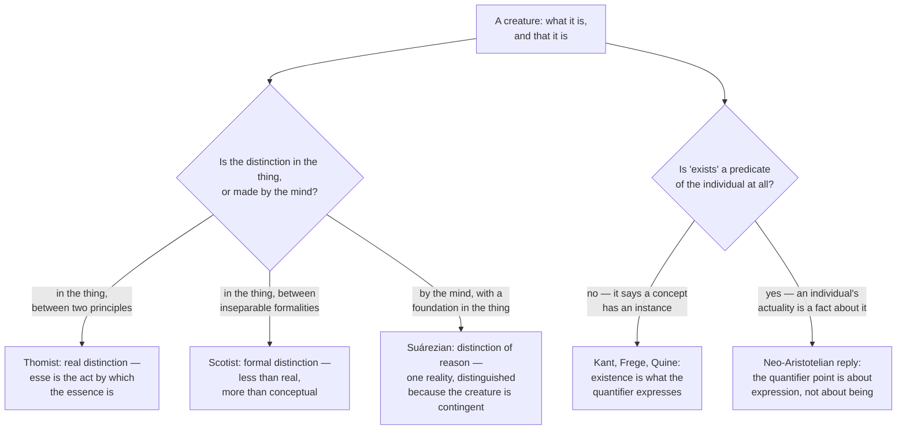

# Metaphysics · Lesson 2.5: Essence and existence

> ⏱ ~15 min · Module 2: Substance, change, and essence · Builds on: [2.4 Essence and grounding](02-04-essence-and-grounding.md) · Unlocks: [3.1 Kinds of necessity](03-01-kinds-of-necessity.md)

## Why this matters

Module 2 has been asking what a thing is: what bears its properties (2.1), how it changes (2.2), what it is made of (2.3), what belongs to its nature (2.4). Every one of those questions can be answered in full about a thing that isn't there. You can have the complete account of the kind and still not know whether a single specimen exists. That gap — between *what* and *that* — is the last question of the module, and it is where this course's neo-Aristotelian strand collides head-on with the Quinean strand from [1.1](01-01-existence-and-ontological-commitment.md). It also sets up Module 3: if a thing's existence is not read off its nature, then its existing is something that might need accounting for.

## The idea

Take a phoenix. You can say what one is — a bird of a certain kind, dying in fire and rising from its own ash — with enough precision to recognize one, argue about one, and rule out imposters. Nothing in that account tells you whether any exists. Avicenna made this the hinge of his metaphysics; Aquinas takes it over in *De Ente et Essentia* (chapter 4 in the usual modern division), where he observes that the intellect can grasp what a man is, or what a phoenix is, while leaving it open whether the thing has being in reality.

Two claims live in that observation, and they must be kept apart.

**The weak claim (almost nobody denies it).** For any creature, the concept of its essence does not settle whether it is instantiated. Grasping a nature and knowing something has it are different achievements.

**The strong claim (the disputed one).** In every creature, essence and existence are not merely distinguishable in thought but stand as two **principles** of the one thing: the essence is what it is, and its *esse* — its act of existing — is that by which the essence is at all. Existence here is not one more feature on the list of features. It is the actuality of the whole list. Lined up with [2.2](02-02-change-act-and-potency.md)'s vocabulary: essence is to existence as potency is to act, which is why a Thomist calls this a second, deeper composition than the matter-and-form composition of [2.3](02-03-hylomorphism-and-composition.md) — deeper, because it is supposed to hold even of a thing with no matter at all.

Getting from the weak claim to the strong one requires a further step, and that step is where the argument is.

## The argument

**The Avicennian argument, stated.**

> **P1.** I can grasp completely what an F is without knowing whether any F exists.
> *In words: the nature can be held in mind entire, with the existence question still open.*
>
> **P2.** If existence belonged to the essence of F, then grasping the essence completely would settle that an F exists.
> *In words: you can't fully grasp a nature and still be missing part of it.*
>
> **∴ C1.** Existence does not belong to the essence of F.
> *In words: for any ordinary kind, "what it is" and "that it is" come apart.*

C1 is the weak claim. To reach the strong one, the Thomist adds:

> **P3.** What a thing has but does not have from its own nature, it has from something else, as a received actuality.
> *In words: if existing isn't part of being that kind of thing, then the thing's existing is something it has been given, not something it supplies.*
>
> **∴ C2.** In every creature, essence and existence are distinct principles, the essence standing to the act of existing as potency to act.

**Where the pressure sits.** P1 and P2 concern *concepts*; C2 concerns *the thing*. Critics — Anthony Kenny's study of Aquinas on being is the sharpest modern version — press exactly there: from the fact that two things can be thought apart, nothing follows about principles in reality, on pain of proving that a triangle's three-sidedness and three-angledness are distinct principles too. The Thomist reply is that P3, not P1, carries the metaphysical weight, and that the phoenix only shows where to look.

**The three-way dispute over the distinction's status.** Everyone in this dispute agrees that creatures are contingent and that God, if there is one, is not. They disagree about what kind of distinction essence and existence is.

- **Thomist: a real distinction.** The distinction holds in the thing, prior to any act of mind, between two metaphysical principles — not two *things*. A creature is not an essence plus a second entity called existence, any more than a statue is a shape plus a lump; it is one being composed of what it is and its act of being.
- **Scotist: a formal distinction.** Less than real, more than conceptual. Two inseparable *formalities* of one reality, distinct in the thing but incapable of existing apart — the same tool Scotus uses for the divine attributes and for common nature and individuating difference. (How Scotus himself classified the essence–existence case is disputed by historians; what is not disputed is that his school denies the Thomistic real distinction.)
- **Suárezian: a distinction of reason with a foundation in the thing.** Suárez argues in his thirty-first *Metaphysical Disputation* that in the existing creature there is exactly one reality; the mind distinguishes its essence from its existence, and the distinction is not arbitrary — the creature's contingency is its foundation in the thing — but it is the mind's work, not a seam in the thing.

**Adjudicating this is not this course's job.** Which of the three is right, and what it does to the doctrine of God, belongs to [`thomistic-synthesis`](../../thomistic-synthesis/syllabus.md), which owns the real distinction's systematic role. What you owe here is the ability to state all three so a defender would sign it, and to say what turns on the choice.

**The Kantian and Fregean objection: existence is not a real predicate.** This is [1.1](01-01-existence-and-ontological-commitment.md) arriving from the other direction. Kant's point, in the attack on the ontological proof (A598/B626), is that being adds nothing to the concept of a thing: a hundred real coins contain no more *coin* than a hundred merely possible ones. Frege sharpened it: existence is a property of *concepts*, not of objects — to say tigers exist is to say the concept *tiger* has at least one instance. Quine inherited the machinery: existence is what the quantifier expresses, and to be is to be the value of a bound variable.

If that is right, the strong claim can look like a grammatical illusion. "Existence actualizes the essence" treats *exists* as a first-order predicate attaching to individuals, when its real job is to say that a concept is instantiated. Nothing is added to Socrates by his existing; rather, something is true of the concept *being Socrates*.

**The neo-Aristotelian reply.** The quantifier analysis is a thesis about how general existence claims are *expressed*, not about whether an individual's actuality is a fact about it. Three moves, usually made together:

1. The analysis *presupposes* a domain of things to quantify over. It tells you when "there is an F" is true, given the things there are; it does not touch the question of what it is for one of those things to be there.
2. Kant's target was the inference from a concept to the existence of its object. The Thomist rejects that inference too — indeed the real distinction is precisely the claim that no creature's existence can be read off its essence. Kant and Aquinas are not in the same fight.
3. The first-order reading has serious contemporary defenders — Barry Miller and Nathan Salmon argue in different ways that individuals have existence as a property of themselves — so the Fregean analysis is a position, not a settled result.

The Fregean's counter-reply is clean: there is no "what it is for a thing to be there," because being an object just *is* being in the domain. There are no merely possible objects waiting for actuality; that was 1.1's whole point about Meinong. Both sides are stating a live position. This course does not settle it.

**Why any of this matters.** If existence is not included in a thing's nature, then the thing's existing is a fact not explained by what the thing is. That is what makes contingent existence look like something that *calls for* explanation, and it is what generates a limit-case concept: a being whose essence just is to exist, for which the question would not arise. [3.3](03-03-brute-facts-and-necessary-existence.md) takes both up — whether every such fact has an explanation, and whether anything could exist necessarily. No argument for such a being is run here or there; those belong to [`philosophy-of-religion`](../../philosophy-of-religion/syllabus.md).

## Map of positions

## Worked examples

**Example 1 (clean case — the argument on a real kind).** Taxonomists know exactly what an ivory-billed woodpecker is: plumage, size, bill morphology, call, nesting habits, a place in the genus. Whether one exists is an open empirical question, argued over after every blurry sighting in a southern swamp.

Run the argument. P1 holds in the strongest possible way: the nature is not merely graspable but *published*, and the existence question is the thing people are actually fighting about. So C1 follows — existence is no part of that essence. Now watch the step to C2. The Thomist says: if a living ivory-bill is found, its existing is not one more diagnostic feature to add to the field guide; it is that by which everything in the field guide is realized in it. The Fregean describes the same situation without any such ingredient: the concept is determinate, and the open question is whether it has an instance — full stop. Notice that nothing in the *case* decides between them. Both descriptions fit it perfectly, which is why the dispute has lasted.

**Example 2 (hard case — where both sides strain).** Singular existence claims. "Vesuvius exists." "Socrates might not have existed."

This strains the Fregean. The analysis was built for general claims: "tigers exist" says the concept *tiger* is instantiated. But "Vesuvius exists" does not obviously say anything about a concept — it seems to say something about a mountain. The Fregean can manufacture a concept for the occasion (*being identical to Vesuvius*) and say that it has an instance; critics call this a repair rather than an analysis, and press the modal version: "Socrates might not have existed" appears to be about Socrates, de re, and to say of *him* that his existing was not guaranteed. That is close to what the real distinction says in its own idiom.

But it strains the other side too. If existence is a first-order act of the individual, the Thomist owes an account of how the act is individuated — my existing is not yours, so the act is somehow proportioned to the essence that receives it, which threatens circularity: the essence is said to be actualized by an act that is already *this* thing's act. Suárez's position gains much of its appeal here, by refusing the machinery and saying that the creature is one reality whose contingency the mind marks by distinguishing essence from existence. So: the hard case pulls toward the neo-Aristotelian on the semantics and toward the deflationist on the metaphysics, which is a fair picture of where the dispute actually stands.

## Watch out

- **The real distinction is not a distinction between two things.** No party holds that an unrealized essence is an item sitting somewhere waiting to be switched on. "Principles of one being," not "parts stuck together" — if your statement of the view lets the essence survive on its own, you have stated a caricature.
- **The Avicennian argument as stated is epistemic.** It establishes C1, about concepts. Anyone who slides from "thinkable apart" to "really distinct in the thing" is running an inference that has a standing counterexample (three-sidedness and three-angledness) and needs P3 to do the work.
- **"Distinction of reason with a foundation in the thing" is not "merely verbal."** Suárez is not saying the distinction is arbitrary or a trick of language. The foundation — the creature's not having to exist — is perfectly real; the disagreement is about whether that foundation is a seam in the thing.
- **Kant is not refuting the real distinction, and the real distinction does not violate Kant.** His target is the move from a concept to its object's existence, which the Thomist also rejects for every creature. Treating Kant's slogan as a knockdown here is the most common student error in this lesson.
- **Don't merge this with 2.4's distinction.** [2.4](02-04-essence-and-grounding.md) separates what belongs to a thing's essence from what is merely necessarily true of it. This lesson separates the essence, however analyzed, from the thing's existing. A Finean about essence can take any of the three positions here.

## One-liner

> You can know completely what a thing is and not know that it is — and the whole fight is over whether that gap is a seam in the thing, a formality in it, or a distinction the mind draws for good reason.

## Problems

**P1 (🟢) *(Exegetical.)*** Each claim below states, or rules out, one of the three scholastic positions. Say which, in one sentence each.

(a) "Before it exists, a thing's essence is already there, waiting for existence to be added to it."
(b) "In the creature there is one reality; the mind separates what it is from that it is, prompted by the fact that it need not have been."
(c) "Essence and existence are not two things but two principles of one thing, as potency is to act."
(d) "The distinction is in the thing and prior to the mind's work, yet not between separable realities — the nature and the being are distinct formalities of one inseparable reality."

**P2 (🟡) *(Exegetical (a) · Evaluative (b).)*** An invented passage from a science magazine's de-extinction feature:

> "We know exactly what a thylacine is — we have the genome, the skeletons, the film. The only question left is whether a lab can make one exist again. And that is a thin sort of question, because existence adds nothing to the description. It is just the world's way of ticking a box next to a definition that was already complete."

(a) Name the two distinct claims the passage runs together, and which strand of this lesson each belongs to. (b) Does the observation in the first sentence support the claim in the last? 150 words or fewer, any verdict, provided you say what the last sentence would have to assume.

**P3 (🔴, optional) *(Exegetical, then evaluative — find the crux.)*** A Thomist and a Suárezian agree that creatures are contingent, that no creature's existence follows from its essence, and that essence and existence are not two things. Name the single premise the Suárezian must deny, and say what kind of consideration could move either of them. 150 words or fewer. Any verdict; the crux is what is graded.

Solutions

**P1** *(Exegetical — strict.)*

**Must hit, strict:**
- (a) **Rules out all three.** No position holds that an unactualized essence is a real item awaiting existence; it misreads the real distinction as a distinction between two entities, one of which can hang around without the other. This is the caricature the Thomist most often has to disown.
- (b) **Suárezian** — a distinction of reason with a foundation in the thing: one reality, the distinction drawn by the mind, the creature's contingency supplying the foundation.
- (c) **Thomist** — the real distinction, stated the way its defenders state it (two principles, not two things; potency to act).
- (d) **Scotist** — the formal distinction: in the thing, prior to the mind, but between inseparable formalities rather than really distinct principles.

**Wrong turns:** reading (b) as "the distinction is merely verbal" — Suárez denies that; reading (c) as committing the Thomist to two entities, which is exactly what (a) gets wrong.

**Model answer:** as above.

---

**P2** *(a) exegetical — strict; (b) evaluative — any verdict.*

**Must hit, strict (a):** two claims. First, the **Avicennian** claim — a complete grasp of the nature leaves the existence question open (the genome, skeletons and film give the what; whether one is alive is separate). Second, the **Kantian/Fregean** claim that existence adds nothing and is not a genuine feature of the individual — the "ticking a box" line, which belongs to the quantifier strand. The passage treats the second as following from the first.

**Must hit, any verdict (b):** say what the last sentence needs beyond the first — that because existence is no part of the description, it is no fact *about the thing* at all. Note that the Avicennian claim is consistent with the opposite conclusion: the Thomist agrees existence is no part of the description and concludes it is the act by which the described nature is real. So an extra premise is required, and it should be named. Either verdict passes if the gap between the two claims is identified.

**Wrong turns:** answering by asserting that existence is or is not a real predicate without showing where the passage's inference needs help; treating "existence adds nothing to the description" as obviously false, when it is a claim both Kant and Aquinas accept in their own senses; missing that "the only question left" is doing rhetorical work — it frames a metaphysical question as an engineering one.

**Model answer (b), one of several:** The first sentence gives us only this: the description was complete before the existence question was settled. That is compatible with two very different readings of what remains. On the deflationary reading, nothing remains except whether the concept gets an instance, so "existence adds nothing" is just the observation restated. On the Aristotelian reading, what remains is the whole difference between a nature specified and a nature realized, and calling that thin is a conclusion, not an observation. The last sentence therefore assumes that a fact not captured in a description of *what* a thing is cannot be a fact about the thing. That assumption is exactly what the real distinction denies, so the passage helps itself to one side of a live dispute while sounding like it is reporting a platitude.

---

**P3** *(Exegetical, then evaluative — the crux is what is graded.)*

**Must hit, strict:** the premise is **P3 of the argument above** — that what a thing does not have from its own nature it has as a *received* actuality, distinct from the nature that receives it. The Suárezian grants everything about contingency and denies that contingency requires a composition of principles inside the creature; for him the creature's whole reality is one, and its dependence is a relation to a cause, not a seam within.

**Must hit, any verdict:** say what would move either party. Acceptable moves include: whether the Thomist can state the real distinction without treating esse as a quasi-entity (if not, the Suárezian gains); whether the Suárezian can explain the difference between a possible creature and an actual one without a distinction in the creature (if not, the Thomist gains); and what each position costs downstream in the doctrine of God, which is where the dispute is usually decided.

**Wrong turns:** naming contingency as the crux — both sides affirm it; naming "whether creatures depend on a cause" — both affirm that too; adjudicating the dispute, which is not asked and belongs to `thomistic-synthesis`.

**Model answer, one of several:** The Suárezian must deny that a thing's not having existence from its own nature requires existence to be a distinct principle received in it. He grants the premise's antecedent and blocks the inference: dependence is a relation to an efficient cause, and a cause produces the whole creature, essence-and-existence together, rather than conferring an act upon a pre-standing potency. The crux is therefore whether contingency has to be located *inside* the contingent thing. What would move them: a demonstration that the Thomist's "act of existing" either collapses into an entity (which both reject) or does no explanatory work the Suárezian account lacks; or, from the other side, a demonstration that without an internal composition there is no way to mark what distinguishes this creature's actuality from its mere possibility.

## Flashback

**F1 (🟡) *(Exegetical (a) · Evaluative (b).)*** From [2.3](02-03-hylomorphism-and-composition.md). A lichen is a fungus and an alga living as one organism; in a laboratory each partner can be cultured separately.

(a) Give the verdict of mereological nihilism, of universalism, and of organicism on whether there is a lichen *in addition to* its parts. (b) In one or two sentences, name the fact a hylomorphist points to in saying the lichen has a form of its own, and say whether laboratory separability counts against it. 80 words or fewer for (b).

Solution

**Must hit, strict (a):**
- **Nihilism:** no. There is no composite; there are fungal and algal cells arranged lichen-wise. The nihilist redescribes the phenomena rather than denying them, and the redescription pushes down to whatever the simples turn out to be.
- **Universalism:** yes — and the answer is uninformative, because composition is unrestricted. There is equally an object composed of the alga and the Eiffel Tower. Universalism never gives a *special* verdict about an interesting case.
- **Organicism:** it depends on whether the lichen constitutes a single life, which is the criterion. Either answer is defensible; what is not defensible is giving a verdict without naming the criterion.

**Must hit, any verdict (b):** point to a unified causal or functional profile the partners lack separately — one metabolism, one growth pattern, survival in conditions neither partner survives alone — and identify the form as the principle of that unity. On separability: a hylomorphist can run the homonymy principle here — the cultured fungus is not the same thing as the fungal component of a lichen, which exists in the whole in the way a hand exists in a body — but must say so rather than ignore the case. Any verdict passes if the criterion is stated.

**Wrong turns:** treating universalism as endorsing the lichen specifically; reading nihilism as denying that anything lichen-shaped is there; assuming organicism automatically counts a symbiosis as one life.

## Connections

- **Back:** the potency-and-act vocabulary is [2.2](02-02-change-act-and-potency.md)'s; the composition claim is a second composition alongside [2.3](02-03-hylomorphism-and-composition.md)'s matter and form; the notion of essence being distinguished from existence is whichever notion [2.4](02-04-essence-and-grounding.md) left you with. The quantifier criterion is [1.1](01-01-existence-and-ontological-commitment.md)'s, and this is the lesson where the two strands meet.
- **Forward:** [3.1](03-01-kinds-of-necessity.md) asks what kinds of necessity there are; [3.3](03-03-brute-facts-and-necessary-existence.md) asks whether a contingent thing's existing must have an explanation and whether anything could exist necessarily — the limit-case concept of a being whose essence is to exist comes from here.
- **Sideways:** the adjudication of Thomist, Scotist and Suárezian, and the real distinction's systematic role, belong to [`thomistic-synthesis`](../../thomistic-synthesis/syllabus.md). Arguments for a necessary being belong to [`philosophy-of-religion`](../../philosophy-of-religion/syllabus.md); none is run here. Kant's own system, including the critique of the ontological proof read historically, is [`modern-philosophy`](../../modern-philosophy/syllabus.md) 6.3; Frege's treatment of existence as a second-level concept belongs with `philosophy-of-language-and-logic`.
