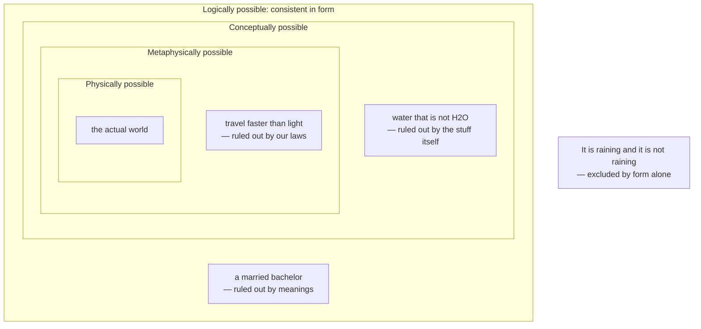

# Metaphysics · Lesson 3.1: Kinds of necessity and how we know them

> ⏱ ~15 min · Module 3: Modality and necessary existence · Builds on: [2.5 Essence and existence](02-05-essence-and-existence.md) · Unlocks: [3.2 What possible worlds are](03-02-what-possible-worlds-are.md)

## Why this matters

"That's impossible" is the most overloaded sentence in philosophy. It can mean *that contradicts itself*, or *that isn't what the word means*, or *nothing could be like that*, or *physics forbids it* — four different claims with four different burdens of proof. Almost every modal argument you will meet, in this course and in [`philosophy-of-religion`](../../philosophy-of-religion/syllabus.md), either trades on that ambiguity or has to defuse it. This lesson gives you three tools: a ladder of strengths, a scope distinction that shows what the necessity is attached to, and a checklist for the one piece of evidence people actually offer for possibility — that they can imagine it.

## The idea

Two questions come first, and they are independent.

**How strong?** Compare: "a married bachelor is impossible," "water that is not H2O is impossible," "faster-than-light travel is impossible." The first is a matter of what the words mean. The second, if true, is a fact about the stuff, not about us. The third is a claim about the laws of this universe — and it would be false in a universe with different laws. Three impossibilities, three different sources.

**Attached to what?** "The number of planets is necessarily greater than 7" can mean *the proposition* could not have been false, or it can mean *that number* — eight, as it happens — could not have failed to exceed seven. The first is false: there could have been five planets. The second is true: eight beats seven in every possible situation. Same sentence, two claims, opposite truth values. The medievals called these *de dicto* (of the saying) and *de re* (of the thing).

Then the twist that reorganized the whole subject. It is natural to assume that necessary truths are exactly the ones you can establish from the armchair: if it could not have been otherwise, no experiment should be needed to find out. Kripke argued that this is wrong. Water is H2O; if it is, it could not have been anything else — and yet it took chemistry to learn it. Necessity is a feature of the fact; a priori and a posteriori are features of the route you took to it. The two axes cross, and the pairing of necessary with a posteriori is occupied. (The epistemic side of that — what it does to the categories of knowledge — belongs to [`epistemology`](../../epistemology/syllabus.md) 4.1. Here we take only the metaphysical side: what makes such a truth necessary.)

## The argument

### The four strengths

Each strength is a range of possibilities. To say *P* is necessary in a given sense is to say *P* holds throughout that range.

| Strength | *P* is necessary when… | Reaches this rung | Does not (one rung down) |
|---|---|---|---|
| **Logical** (narrow) | *P* is true in virtue of its logical form alone — true under every reinterpretation of its non-logical words | It is raining or it is not raining | Every bachelor is unmarried |
| **Conceptual / analytic** | *P* is true in virtue of the meanings of its words | Every bachelor is unmarried; every vixen is a fox | Water is H2O |
| **Metaphysical** | *P* holds in every possible world, full stop — every way reality could have been | Water is H2O; Hesperus is Phosphorus; gold has atomic number 79 | Nothing travels faster than light |
| **Physical (nomological)** | *P* holds in every world with our laws of nature | Nothing accelerates past light speed; energy is conserved | There are eight planets |

They **nest**, from the most permissive range outward to the narrowest:

> physically possible ⊂ metaphysically possible ⊂ conceptually possible ⊂ logically possible

Read it in terms of necessity and the arrow reverses: every logical necessity is a conceptual one, every conceptual necessity a metaphysical one, every metaphysical necessity a physical one — and not conversely. Two consequences do most of the work.

**Metaphysical necessity is not logical necessity in the narrow sense.** "Water is H2O" has no logically valid form; you can reinterpret its terms and get a falsehood. It is still, if Kripke is right, true in every possible world. So "you have not derived a contradiction" does not show that something is possible; it shows only that it is *logically* possible, which is the cheapest grade there is.

**Physical necessity is weaker than metaphysical necessity.** The light-speed limit holds throughout our laws' reach and fails elsewhere — provided the laws could have been different. A dispositional essentialist (see [4.3](04-03-powers-dispositions-and-laws.md)) denies exactly that: if the laws flow from the essences of the properties, then a world with other laws has other properties, and the physical layer collapses into the metaphysical one. Whether the two layers are distinct is therefore a live dispute, not a definition.

### De re and de dicto: one formal step

This is the course's one piece of formal modality. Let $\Box$ mean "at every possible world," and let $n$ abbreviate the description "the number of planets" — a description that picks out whatever numbers the planets *at the world where you evaluate it*.

> **De dicto:** $\Box\,(n > 7)$
> In words: at every world, the number of planets there is greater than seven.
>
> **De re:** $\exists x\,(x = n \wedge \Box\,(x > 7))$
> In words: the thing that actually numbers the planets — that is, eight — is greater than seven at every world.

Now the inference. Its premises are unimpeachable:

> **P1.** $\Box\,(8 > 7)$ — eight exceeds seven at every world.
> **P2.** $n = 8$ — the number of planets is eight.
> **∴ C.** The number of planets is necessarily greater than seven.

**Valid on the de re reading.** P2 says the number in question *is* eight; P1 says that very number exceeds seven at every world; generalize and you have $\exists x\,(x = n \wedge \Box\,(x > 7))$.

**Invalid on the de dicto reading.** Here is the countermodel. Two worlds, $w_0$ (ours) and $w_1$. Arithmetic is the same at both, as arithmetic is. The planets are not.

| | $w_0$ | $w_1$ |
|---|---|---|
| Number of planets | 8 | 5 |
| Is $8 > 7$? | yes | yes |
| Is (number of planets) $> 7$? | yes | **no** |

Evaluate at $w_0$. P1 holds: the arithmetic row is "yes" at both worlds. P2 holds: the count at $w_0$ is eight. The de dicto conclusion $\Box\,(n > 7)$ fails, because the last row is "no" at $w_1$. True premises, false conclusion, so the inference is invalid on that reading.

The diagnosis is scope. A description that picks out different things at different worlds cannot be substituted inside the box; a term that picks out the same thing at every world can. What makes names and natural-kind terms behave like the second sort — rigid designation — is the property of `philosophy-of-language-and-logic`, which owns the theory of reference and the modal systems (K, S4, S5) this step is deliberately doing without.

### The necessary a posteriori

Why is "water is H2O" necessary at all? Because "water" and "H2O" both pick out the same stuff at every world, and an identity between two such terms, if true anywhere, is true everywhere: there is no world at which a thing fails to be itself. Kripke's move (a version of the necessity of identity had already been proved by Ruth Barcan Marcus) is then to separate two steps:

> **A priori:** *if* water is H2O, then necessarily water is H2O.
> **A posteriori:** water is H2O.
> **∴** Necessarily, water is H2O.

The conditional is armchair work. The antecedent took a laboratory. Experience was needed not to establish the necessity but to find out *which* necessity obtains — which of the many candidate essences the stuff actually has. The same shape runs on constitution and origin: this table is made of wood, and if it is, no possible world contains *this very table* made of ice. Which table you are pointing at, and what it was made from, are things you learn by looking.

Notice what this costs the old picture. You can no longer read necessity off your own concepts. The concept *water* does not contain hydrogen; the world supplies it. Modal knowledge becomes partly empirical, which is why the last section is not optional.

### Conceivability as evidence of possibility

The standard argument form: *I can conceive of S; therefore S is possible; therefore whatever entails S's impossibility is false.* It is the workhorse of modal argument, and it is defeasible. Three qualifications do the real work.

1. **Conceiving a description is not conceiving a scenario.** I can entertain "Goldbach's conjecture is false" — I understand it, nothing feels contradictory. I cannot construct a situation that verifies it. Yablo's distinction: to conceive that *P* is to imagine a world you take to verify *P*, not merely to fail to see a problem. "I can't see how it's impossible" is not evidence; it is the absence of evidence.
2. **Ideal versus prima facie conceivability.** Something can seem conceivable to you and be ruled out by reasoning you have not done — every refuted mathematical conjecture was once prima facie conceivable both ways. Chalmers's refinements (prima facie vs ideal, negative vs positive, primary vs secondary conceivability) are attempts to isolate a grade of conceiving that does entail possibility.
3. **The Kripkean misdescription move.** This is the one the necessary a posteriori generates. You think you have conceived water that is not H2O. What you actually conceived — a clear liquid, filling the lakes, tasteless, not H2O — is a genuine possibility; you have simply misdescribed it. That scenario is not one where water isn't H2O; it is one where some *other* stuff plays water's role. The conceiving was real; its object was not what you said.

**So, to assess any conceivability argument, in any subject:**

- **State what is claimed conceivable as a scenario**, in enough detail that it could be checked, not as a sentence you can mouth without contradiction.
- **Ask what the argument's conclusion needs.** Logical possibility is nearly free; metaphysical possibility is what the conclusion usually requires.
- **Run the misdescription test.** Is there a nearby scenario that is genuinely possible and that you could be mistaking for the target? If so, the argument must rule it out.
- **Ask whether the conceiving survives ideal reflection**, or only reflects what you happen not to know.
- **Check for symmetry.** If the opponent can conceive the negation just as vividly, the two conceivings cancel and neither side has produced evidence.

The most famous instance — conceiving a physical duplicate of you with no inner life, and concluding that physicalism is false — belongs to `philosophy-of-mind`, which owns the zombie argument and its replies. The checklist above is what you take there.

## Map of positions

Each ring is narrower than the one outside it, and each example sits in the shell where it is first excluded. Two boundaries are contested. The conceptual/metaphysical line depends on there being a workable analytic/synthetic distinction, which Quine attacked ([1.1](01-01-existence-and-ontological-commitment.md)); the metaphysical/physical line vanishes if the laws are metaphysically necessary ([4.3](04-03-powers-dispositions-and-laws.md)).

## Worked examples

**Example 1 (mechanical — running both tools on one sentence).** "No one under 35 is eligible for the presidency, so anyone who is president is necessarily at least 35."

First, *how strong?* The requirement is constitutional, so the necessity is neither logical nor metaphysical: it is a rule holding across the worlds where this constitution is in force — the legal analogue of nomological necessity. It is already a weaker claim than it sounded.

Second, *attached to what?* The de dicto reading — at every world where the rule holds, whoever is president there is at least 35 — is true, and is all the constitution gives you. The de re reading — the person who is in fact president has the property of being at least 35 at every world — is false: that individual was once a child. Someone who slides from the first to the second has substituted a description ("the president") into a modal context where it does not pick out the same person world to world. That is exactly the planets fallacy in civilian clothes, and the countermodel has the same shape: a world where the office is occupied by someone else, and one where the current occupant is younger.

**Example 2 (a hard case — assessing a conceivability argument).** Hume's claim, which [3.3](03-03-brute-facts-and-necessary-existence.md) will need: we can conceive of an object beginning to exist without any cause; therefore it is possible; therefore the causal principle is not necessary.

Run the checklist. *State the scenario.* A mental picture of an empty room and then a billiard ball in it is equally a picture of *a ball arriving from elsewhere* or *a ball whose cause I cannot see*. To conceive the target I must conceive the coming-to-be **and** the absence of anything it depends on — and absences do not show up in pictures. Elizabeth Anscombe pressed roughly this point: the imagery underdetermines the description.

*What does the conclusion need?* Metaphysical possibility. Logical possibility is not in dispute — "a thing begins to exist and nothing causes it" is no formal contradiction, and every party grants it.

*Misdescription test.* Two nearby possibilities: a world where the cause is undetectable, and one where the event is undetermined by prior conditions yet still produced by something (an agent, a power). Hume's defender has to say why the conceived scenario is the causeless one rather than either of these.

*Symmetry.* An opponent claims to conceive the opposite — that nothing ever comes from nothing — with equal vividness. Whether that is a conceiving of an impossibility or a report of a deep conviction is exactly what is disputed.

The checklist did not refute Hume; a Humean can answer every step, and the best versions do. It turned a one-line appeal into four specific burdens. That is the most a modal method should promise.

## Watch out

- **"Necessity of the consequence" is not "necessity of the consequent."** From "necessarily, if he knows you will sit, then you will sit" it does not follow that "if he knows you will sit, then necessarily you will sit." The box governs the whole conditional in the first and the consequent alone in the second — the de dicto/de re distinction wearing a scholastic name. The foreknowledge debate this belongs to is owned by [`philosophy-of-religion`](../../philosophy-of-religion/syllabus.md) 1.3, and the confusion is the single most common error in it.
- **A posteriori does not mean contingent, and a priori does not mean necessary.** The axes are independent; the necessary a posteriori occupies one of the surprising corners, and Kripke argued that the contingent a priori occupies another. The epistemology is [`epistemology`](../../epistemology/syllabus.md) 4.1's.
- **"Logically possible" is used in two ways.** Narrowly it means consistent in logical form; loosely it is a synonym for "metaphysically possible." Arguments equivocate between them constantly, so say which you mean and hold the other side to it.
- **Some cases resist the table.** "Nothing is red and green all over" is not true by logical form, and whether it is true by meanings alone is disputed — it is the standard candidate for a synthetic a priori truth. A boundary case does not refute the ladder; it does mean the ladder's rungs are positions, not measurements.
- **Conceivability is evidence, not proof — and its weight varies with the subject.** Nobody doubts that you can conceive the coffee cup an inch to the left; the disputes are all about cases far from experience, which is exactly where our imaginative track record is worst.

## One-liner

> Say which necessity you mean and what it is attached to — then ask whether the scenario you imagined is really the one your sentence described.

## Problems

**P1 (🟢) *(Exegetical.)*** For each claim, name the *strongest* rung it reaches — logical, conceptual, metaphysical, physical, or none (contingent) — in one line each.

(a) Nothing is both a proton and not a proton.
(b) Nothing that has mass reaches the speed of light.
(c) Every vixen is a fox.
(d) Gold has atomic number 79.
(e) Hesperus is Phosphorus.
(f) There are eight planets.

**P2 (🟡) *(Formal (a) · Exegetical (b).)*** Consider: "All bachelors are necessarily unmarried," and the inference

> **P1.** All bachelors are necessarily unmarried.
> **P2.** Jack is a bachelor.
> **∴ C.** Jack is necessarily unmarried — he could not have married.

(a) Write the de dicto and de re readings of P1 using $\Box$ and a quantifier, give the one-line English gloss of each, and say which reading is true.
(b) Say which reading makes the inference valid, and give a two-world countermodel for the other. Name the general moral in one sentence.

**P3 (🔴, optional) *(Evaluative.)*** An invented passage from a popular-science essay:

> "There is nothing necessary about the universe we got. I can picture perfectly well a cosmos in which the electron is heavier, or gravity falls off as the cube of the distance — no contradiction anywhere in the thought. The laws are simply how the dice landed, and could have landed otherwise."

In 150 words or fewer: state precisely what the writer has conceived and what the conclusion requires, then apply the checklist to say what a dispositional essentialist — who holds that the laws follow from the essences of the properties, so that they are metaphysically necessary — must say about the conceiving. Any verdict; you are graded on the moves.

Solutions

**P1** *(Exegetical — strict.)*

**Must hit, strict:**
- (a) **Logical.** True by form: no reinterpretation of "proton" makes "nothing is both F and not-F" false.
- (b) **Physical (nomological).** It follows from relativistic dynamics, not from meanings or essences — unless the laws are metaphysically necessary, in which case it climbs a rung. Naming that caveat earns the point; it is 4.3's dispute.
- (c) **Conceptual.** True by meanings ("vixen" just is "female fox"), but not by logical form alone.
- (d) **Metaphysical, and a posteriori.** Atomic number is what makes the stuff gold; the discovery took chemistry. Same shape as water and H2O.
- (e) **Metaphysical.** A true identity between two terms that each pick out the same object at every world is true at every world — discovered by astronomy.
- (f) **None — contingent.** Physically possible to be otherwise; this is P2 of the planets inference, and the 2006 reclassification of Pluto is a reminder that even the count is revisable.

**Wrong turns:** calling (c) logically necessary — it needs the meaning of "vixen," so its form is not valid; calling (d) or (e) contingent because it was learned by experiment, which is exactly the a posteriori/contingent conflation; calling (b) metaphysically necessary without flagging that this is a contested position rather than a classification.

**Model answer:** as above.

---

**P2** *(a) formal; (b) exegetical — strict.*

**Must hit (a):**
- De dicto: $\Box\,\forall x\,(Bx \rightarrow Ux)$ — at every world, everyone who is a bachelor there is unmarried there. **True**, and it is all the meaning of "bachelor" gives you.
- De re: $\forall x\,(Bx \rightarrow \Box\,Ux)$ — everyone who is in fact a bachelor is unmarried at every world. **False**: bachelors marry.
- The box moves across the quantifier; that is the whole difference.

**Must hit, strict (b):**
- The inference is valid only on the **de re** reading of P1: if every actual bachelor is unmarried at every world, and Jack is one, then Jack is unmarried at every world. But on that reading P1 is false, so the argument is valid and unsound.
- On the **de dicto** reading P1 is true and the inference is invalid. Countermodel: $w_0$, where Jack is an unmarried bachelor; $w_1$, where Jack is married and hence not a bachelor. At $w_0$, P1 holds (at both worlds, every bachelor there is unmarried there — vacuously or otherwise) and P2 holds. The conclusion $\Box\,Uj$ fails, because Jack is married at $w_1$.
- Moral: a term inside the scope of the box must pick out the same thing at every world, and "bachelor" applies to different people at different worlds — so an inference that is fine outside the box can fail inside it.

**Wrong turns:** reading the de dicto formula as making Jack's bachelorhood necessary; building a countermodel in which Jack is a married bachelor at $w_1$, which makes P1 false instead of the conclusion — the countermodel has to keep both premises true; concluding that the argument "commits a fallacy" without saying which reading is in play, since on one reading it is perfectly valid.

**Model answer:** as above.

---

**P3** *(Evaluative — any verdict; the moves are graded.)*

**Must hit, any verdict:**
- **State the conceiving as a scenario, and the conclusion's requirement.** What is imagined is a world described by different equations; what the writer needs is that such a world is *metaphysically* possible. "No contradiction anywhere in the thought" establishes only logical possibility — the cheapest rung, which the essentialist grants without loss.
- **Apply the misdescription test.** The essentialist's reply is available and must be stated: a property's dispositional profile is its essence, so a "heavier electron" world contains not an electron but a different particle, and an inverse-cube world contains not gravity but something else. The writer conceived a genuine possibility and described it using our words for our properties.
- **Say what each side then owes.** The essentialist owes an account of why the misdescription charge is not unfalsifiable — some independent reason to individuate properties by their laws. The writer owes a way of picking out the electron that is independent of its mass and behaviour, so that the scenario can be redescribed as being about the same property.

**Wrong turns:** treating "I can picture it, and there is no contradiction" as settling metaphysical possibility — that is the equivocation the lesson is built around; replying that the essentialist "just defines the problem away" without saying what would make that charge stick; arguing about whether the constants are in fact fine-tuned, which is a different question (and [`philosophy-of-religion`](../../philosophy-of-religion/syllabus.md) 3.1–3.2's).

**Model answer, one of several:** The writer has conceived a world whose equations differ from ours and has inferred metaphysical contingency from the absence of a formal contradiction — a jump of three rungs. The dispositional essentialist replies with the Kripkean move: since a property just is its dispositional profile, the imagined world contains a particle resembling the electron, not the electron, so what was conceived is possible but misdescribed. That reply is not free. It has to individuate properties by their laws without circularity, and it makes every law a necessary truth, which many find incredible. But it shows that the essay's argument, as stated, does no work: conceivability of this kind is compatible with the laws being necessary, so the conclusion needs an independent reason to think the scenario is about our properties.

## Flashback

**F1 (🟡) *(Exegetical (a) · Evaluative (b).)*** [2.4](02-04-essence-and-grounding.md) ended by reversing an order of explanation: rather than defining essence in modal terms, Fine proposes that a truth is metaphysically necessary *because* it follows from the natures of things.

(a) Apply that proposal to two of today's necessities — (i) necessarily, water is H2O; (ii) necessarily, every vixen is a fox. For each, say whose nature the necessity is supposed to flow from, and which rung of the ladder it reaches.
(b) In 100 words or fewer, give one thing the essence-first story buys in case (i) that the modal account cannot, and one cost it incurs. Any verdict.

Solution

**Must hit, strict (a):**
- (i) **Metaphysical**, and a posteriori. On Fine's proposal the necessity flows from the nature of **the stuff itself**: being H2O is water's real definition, so any world containing that stuff contains H2O. Crucially the nature is not our concept — which is why the discovery had to be empirical.
- (ii) **Conceptual.** Nothing was discovered about foxes; the necessity flows from the definition of *vixen* (the concept, or the kind as we have carved it). Credit for noticing that this forces Fine's proposal to allow natures for things other than concrete substances — concepts, sets, numbers, logical objects — if it is to cover the whole ladder.

**Must hit, any verdict (b):** name a genuine gain — the modal account can only *record* that water is H2O at every world, whereas the essence-first account says what makes it so and locates the maker in the stuff rather than in our concept, which is exactly what the necessary a posteriori requires; and name a genuine cost — the explanation bottoms out in a primitive that is not further analysed, and it must find a nature for every rung, including the logical one.

**Wrong turns:** answering (i) with "conceptual, because chemists now define water as H2O" — the definition followed the discovery, and the necessity does not depend on our adopting it; treating (ii) as reaching only the metaphysical rung, when the point is that it is settled by meanings and so reaches one rung higher; defending the modal account by saying necessity and essence coincide here, which is true of these cases and irrelevant, since Fine's argument was about cases where they come apart.

## Connections

- **Backward:** [2.4](02-04-essence-and-grounding.md) separated essence from necessity; this lesson supplies the necessity half in detail, and the Flashback runs the separation the other way. [2.5](02-05-essence-and-existence.md)'s question — whether anything's essence includes existing — is a modal question you can now state precisely: is there something that exists at every world?
- **Forward:** [3.2](03-02-what-possible-worlds-are.md) asks what the "worlds" in every formula above actually are, and whether the powers theorist can replace them with potencies in actual things. [3.3](03-03-brute-facts-and-necessary-existence.md) turns the conceivability checklist on the hardest case: whether an empty world is possible. [4.3](04-03-powers-dispositions-and-laws.md) decides whether the physical rung is a rung at all.
- **Sideways:** the modal systems (K, S4, S5, Kripke semantics) and rigid designation belong to `philosophy-of-language-and-logic`; the necessary a posteriori as a *category of knowledge* is [`epistemology`](../../epistemology/syllabus.md) 4.1; the zombie argument against physicalism is `philosophy-of-mind`'s, and this lesson's checklist is the tool to bring to it.
- **Downstream:** [`philosophy-of-religion`](../../philosophy-of-religion/syllabus.md) assumes this lesson throughout — its modal ontological argument turns on a de re claim about a being's possible existence, and its treatment of foreknowledge turns on the consequence/consequent confusion in Watch out.
