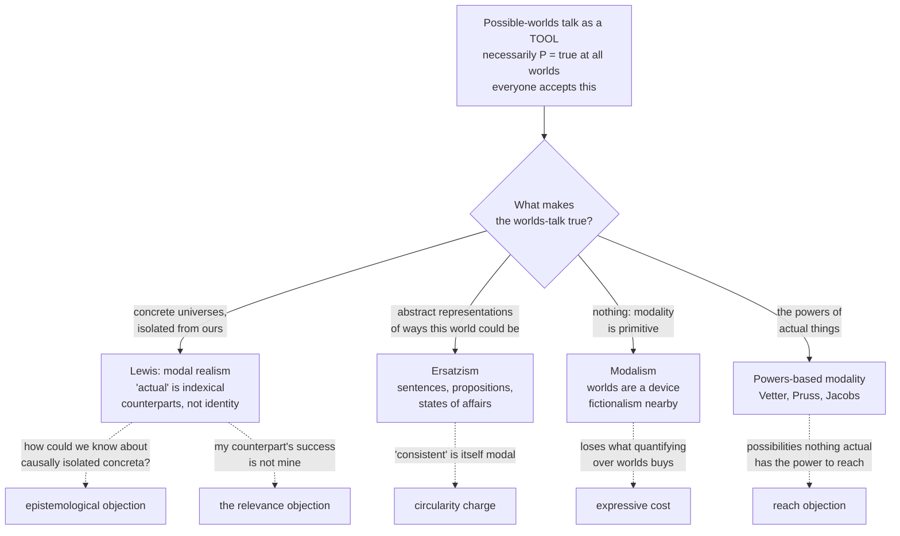

# Metaphysics · Lesson 3.2: What possible worlds are

> ⏱ ~15 min · Module 3: Modality and necessary existence · Builds on: [3.1 Kinds of necessity and how we know them](03-01-kinds-of-necessity.md) · Unlocks: [3.3 Brute facts and necessary existence](03-03-brute-facts-and-necessary-existence.md)

## Why this matters

[3.1](03-01-kinds-of-necessity.md) left you with modal claims sorted by strength and by scope, and with no account of what makes any of them true. Possible worlds are the standard instrument for stating the question sharply — and the moment you ask what the instrument is *made of*, you get four incompatible theories of what modal truth consists in. The answer carries downstream: it decides what "a necessary being" could even mean ([3.3](03-03-brute-facts-and-necessary-existence.md)), whether Lewis's analysis of causation ([4.2](04-02-counterfactual-causation.md)) is buying its closeness ordering on credit, and what a powers theorist ([4.3](04-03-powers-dispositions-and-laws.md)) thinks modality *is*.

## The idea

Separate two things that get run together, and the whole module gets easier.

**Possible worlds as a tool.** A world is a maximal way things could be — maximal meaning it settles every question, leaving nothing open. Once you have that notion, modal claims become quantifications:

- *Necessarily P* — P is true at every world.
- *Possibly P* — P is true at some world.
- *If it had been that P, it would have been that Q* — Q holds at the closest worlds where P holds.
- The de re / de dicto ambiguity of [3.1](03-01-kinds-of-necessity.md) becomes a difference in where the quantifier over worlds sits relative to the quantifier over objects.

This is an enormous gain in clarity and it commits you to nothing. It is notation.

**Possible worlds as an ontology.** Now the second question: *when we quantify over worlds, what are we quantifying over?* Say "sets of sentences" and you have a theory; say "concrete universes" and you have a very different one; say "nothing, the talk is a paraphrase" and you have a third. This is no longer notation — it is an answer to what makes it true that things could have gone otherwise.

Almost every philosopher accepts the tool. The disagreement is entirely at the second level, and it is a disagreement about whether modality gets explained by something else or is where explanation stops.

## The argument

**David Lewis's modal realism**, in four theses. Each formal line is followed by its plain-English translation.

> **T1 — plurality.** There are many worlds, and they are concrete individuals of the same kind as the one we inhabit: things with donkeys and dust in them, not representations of donkeys.
> *In words: other worlds are not stories about universes. They are universes.*
>
> **T2 — isolation.** Worlds are maximal spatiotemporally connected sums. Nothing in one world stands in any spatiotemporal or causal relation to anything in another; that isolation is what makes each one a separate world rather than a distant region of ours.
> *In words: you cannot travel there, see there, or be affected from there. That is not a limitation of our technology; it is what "another world" means.*
>
> **T3 — indexical actuality.** "Actual" is an indexical, like "here", "now" and "I". Our world is the actual one when *we* say it; the inhabitants of any other world say the same about theirs, and are equally right.
> *In words: actuality is not a special metaphysical status some world has and the others lack. It is a matter of which world the speaker is standing in.*
>
> **T4 — counterparts, not trans-world identity.** No individual exists at more than one world. "You could have been a sailor" is true because some world contains a **counterpart** of you — an individual resembling you enough in the relevant respects — who is a sailor.
> *In words: your other possibilities are not other stages of you. They are other people, enough like you to count.*

T4 is not a technicality. The counterpart relation is similarity, so it is inexact, context-sensitive and need not be transitive — a feature, for Lewis, since it lets one object count as possibly-F under one description and not another (useful for the statue and the clay in [5.3](05-03-coincidence-and-the-ship-of-theseus.md)).

**Why anyone would believe this.** Not because the worlds are observed. Lewis's case is a cost-benefit argument: **accept the ontology, and a great deal gets analyzed in non-modal terms** — modality as quantification over worlds, a property as the set of its instances across all worlds (so properties coextensive here come apart), a proposition as the set of worlds where it holds, counterfactuals by a similarity ordering, plus supervenience, content and chance. The ontology looks extravagant, but Lewis argues that the virtue that matters is *qualitative* parsimony — how many **kinds** of thing you posit — and he posits one kind, the kind we already believe in.

**Ersatzism.** One concrete world — this one. Other "worlds" are abstract objects that *represent* ways it could have been, and all of them are unactualized. Lewis's own taxonomy of the versions is still the useful one:

- **Linguistic:** a maximal consistent set of sentences, in some suitably rich language.
- **Propositional or state-of-affairs (abstractionist):** a maximal consistent set of propositions (Adams's world-stories), or a maximal possible state of affairs (Plantinga). "Maximal" means: for every proposition, it or its negation is in the set.
- **Pictorial:** an abstract structure that represents by isomorphism, as a scale model does. **Magical:** a simple abstract entity that represents, with no account of how.

The gain is obvious: the ontology is abstracta you probably already accept ([1.2](01-02-abstract-objects.md)), and Napoleon-in-the-other-world is *Napoleon*, described differently, not a stranger who resembles him.

**The standard problem: the modal notions come back.** A world is a maximal **consistent** set — and "consistent" cannot mean merely formally consistent, since *there is a talking donkey* conflicts with *everything is silent* only once you read the words. What is needed is *compossibility*: the members could all be true together. That is a modal notion, so possibility has been used to define what was to explain possibility. The circle is not vicious by itself, but it means ersatzism is no **reduction** of modality — and most ersatzists now say so openly, claiming only a clear semantics on a cheap ontology. Linguistic versions face a second problem: **alien** properties and individuals, ones nothing actual instantiates, have no names, so some possibilities cannot be written down.

**Modalism and primitivism.** Take the modal operators as basic: *it could have been that P* is a fundamental fact of the same standing as *P*, and worlds are a device — a paraphrase with no ontology behind it. Prior held a version of this; Fine's claim that essence is prior to modality ([2.4](02-04-essence-and-grounding.md)) puts the explanatory floor elsewhere, but agrees worlds are not the floor. **Modal fictionalism** (Rosen) is nearby: worlds-talk is shorthand for *according to the modal-realist fiction…*, keeping the convenience and paying no ontological bill. The price is expressive — comparative possibility, or "there could have been more things than there actually are," is easy by quantifying over worlds and awkward with operators alone.

**Powers-based modality (neo-Aristotelian).** The most direct denial that a plurality is needed at all. Possibility is grounded in what **actual things can do**.

> *Possibly P* is true because something actual has a **potentiality** for P — a power, or an iterated chain of powers, whose exercise would issue in P.

*In words: the possibilities are not elsewhere. They are in the salt that could dissolve, the acorn that could become an oak, the agents who could act otherwise.*

Vetter builds this from potentiality, an object-level property, and widens the possibility space by iterating potentialities (a thing has a potentiality to acquire a potentiality to…). Pruss grounds possibility in the causal powers of actual substances, with the chain tracing back to the powers of a necessary being — where [`philosophy-of-religion`](../../philosophy-of-religion/syllabus.md) 2.4 takes over; Jacobs develops a similar theory. All versions share two features: modality is **local and actual**, a matter of properties of things here rather than a global space, and there is no pretence of reduction, since powers are themselves modal in character.

## Map of positions

## Worked examples

**Example 1 (mechanical — one claim, four truthmakers).** *Napoleon could have won at Waterloo.*

At the level of the tool, all four theories say the same thing: there is a world at which Napoleon wins. Now make them pay.

- **Lewis:** somewhere in the plurality, a concrete battlefield with a concrete man who is not Napoleon but is his counterpart, and he wins. Napoleon himself — the one who lost — wins nowhere, since he exists at exactly one world.
- **Ersatzist:** among the maximal consistent sets of propositions, one contains *Napoleon wins at Waterloo*. Nothing concrete corresponds to it; it is abstract, unactualized, and it is about **Napoleon**, the very man.
- **Modalist:** it is simply true that he could have won. The worlds sentence restates that, and grounds nothing.
- **Powers theorist:** the truthmaker is local and historical — the powers of those armies, that ground, those officers, and the potentialities they had to be exercised otherwise.

The dispute is not about the verdict. All four say the same thing about Napoleon, and disagree about what its truth **consists in** — a disagreement invisible until you ask.

**Example 2 (where it strains — a possibility with no foothold).** *There could have been a fundamental physical property that nothing actual instantiates* — an alien property, not a rearrangement or combination of the ones we have.

Each theory strains in a different place.

- **Lewis** handles it, but not for free. His principle of recombination — anything can coexist with anything, in any arrangement, size and shape permitting — generates a vast space by *rearranging* what there is, and rearrangement never yields a new fundamental property. So he must add that the plurality contains alien properties outright. Consistent, but it shows plenitude is not delivered by recombination alone.
- **Linguistic ersatzism** strains hardest of the ersatz versions: an alien property has no name, so the set describing that possibility cannot be written. Workarounds exist (quantify over unnamed properties, use uninterpreted primitives), each costing something in how faithfully the set represents.
- **Magical ersatzism** answers instantly — an abstract entity simply represents an alien-property world — which is what makes Lewis call it magic: the representing relation does no work you can inspect.
- **Powers-based modality** meets the sharpest form of the reach objection: if nothing actual has any potentiality issuing in that property, the possibility is not merely unrealized but **absent**. Two honest replies: iterate potentialities until the space widens, or deny it was ever a genuine possibility — what looked like one was a failure of imagination. The second is a real position, and it shows this account is not a cheaper route to the same possibilities. It gets **fewer** of them, deliberately.

## Watch out

- **A world is not a planet, and not a physicist's universe.** It is a maximal way for things to be. Even on Lewis's view, where worlds are concrete, they are not far away — "far" is a spatiotemporal relation, and there are none between worlds.
- **Using the tool is not accepting the ontology.** Writing modal claims in worlds-notation commits you to Lewis exactly as much as drawing a Venn diagram commits you to circles. Very few philosophers are modal realists; nearly all use the notation.
- **The incredulous stare is not an argument.** Lewis named the reaction himself and conceded it was the main resistance his view met. Two objections do work: the **epistemological** one — the worlds are causally isolated, so no causal account of how we know about them is available, and Lewis must make modal knowledge a priori, by recombination — and the **relevance** objection Kripke pressed: if what happens over there happens to someone who merely resembles me, it is hard to see how it makes anything true of *me*.
- **A third, easy to miss and the deepest:** the plurality explains modal truth by non-modal facts about which concreta there are, and then owes an account of *why there are exactly those worlds*. If its extent is contingent, modality is not grounded; if necessary, a necessity is left unexplained. Hold that for [3.3](03-03-brute-facts-and-necessary-existence.md).
- **Don't accuse ersatzists of a failed reduction they never attempted.** Most grant that "consistent" is modal. The live question is whether a semantics that presupposes modality is worth having — and modalists and powers theorists both say a theory may presuppose modality honestly, provided it says so.
- **Counterpart theory is not notation; it changes what is true.** Claims about essential properties become sensitive to which similarity relation is in play, and puzzles about contingent identity get answers trans-world identity cannot give.

## One-liner

> Everybody uses possible worlds; the fight is over whether they are a map of modality or its foundation — made of other concrete universes, of abstract representations, or of nothing at all, because the possibilities were in the powers of actual things all along.

## Problems

**P1 (🟢) *(Exegetical.)*** For each claim, name the theory of worlds it belongs to and state the commitment it carries. One or two sentences each.

(a) "Our world is actual in just the sense that this room is here."
(b) "Every world but one is an abstract object, and not a single one of them has any donkeys in it — only propositions about donkeys."
(c) "You did not win, but someone sufficiently like you did, and that is the whole content of 'you could have won'."

**P2 (🟡) *(Exegetical (a) · Evaluative (b).)*** An invented passage from a popular-science column:

> "Cosmologists now take seriously that inflation produces endlessly many pocket universes with different physical constants. Philosophers have talked about 'possible worlds' for decades; physics has finally found them. So the old question of what makes something possible is settled empirically: a thing is possible if it happens in some pocket universe."

(a) Name the two distinct conflations in the passage, and say precisely what a Lewisian world has that a pocket universe does not, and vice versa. (b) Could a cosmological multiverse do the work Lewis's plurality does for modal truth? 150 words or fewer, any verdict, provided you state the requirement a plurality must meet to serve as the truthmaker for modal claims.

**P3 (🔴, optional) *(Evaluative.)*** A powers theorist says modality is grounded in the potentialities of actual things. A Lewisian objects: "Then your possibilities run out. Before there were any acorns, was it possible that there be an oak?" In 150 words, give the powers theorist's best reply, then name the crux — the single premise the two sides disagree about — and say what would move someone on it. Any verdict; the crux is what is graded.

Solutions

**P1** *(Exegetical — strict.)*

**Must hit, strict:**
- (a) **Lewis's indexical account of actuality (T3).** Commitment: actuality is not a metaphysical distinction between worlds; each world's inhabitants truly call theirs actual, so ours has no privileged status beyond being ours.
- (b) **Ersatzism**, in its propositional or abstractionist form (Adams, Plantinga). Commitment: exactly one concrete world; all other worlds are abstract representations, maximal and consistent, and all unactualized.
- (c) **Counterpart theory (Lewis, T4).** Commitment: individuals are worldbound, so de re modal claims about you are made true by a distinct individual related to you by similarity — which is why the relation is inexact and context-sensitive.

**Wrong turns:** calling (a) "modal realism" without naming the indexical thesis — the plurality thesis and the indexical thesis are separable, and an ersatzist could in principle accept neither; reading (b) as modal fictionalism, which says worlds-talk is a *fiction*, not that worlds are abstract objects that exist.

**Model answer:** as above.

---

**P2** *(a) exegetical — strict; (b) evaluative — any verdict.*

**Must hit, strict (a):** two conflations. **First, tool for ontology:** the column treats a semantics for modal claims as a hypothesis about physical cosmology. **Second, pocket universe for world:** Lewis's worlds are (i) spatiotemporally and causally isolated from ours, whereas inflationary pockets are parts of one spacetime with a common origin and are therefore, on Lewis's own criterion, regions of *this* world, not other worlds; and (ii) **plenitudinous** — every way things could be is a way some world is — whereas the pockets realize only whatever the inflationary dynamics actually produce. What the pockets have that Lewisian worlds do not: a causal relation to us, and therefore empirical evidence.

**Must hit, any verdict (b):** state the requirement — a plurality can serve as the truthmaker for modal claims only if it is exhaustive of the possibilities (every possibility is represented) and if what makes claims true is not itself hostage to contingent physical law. Then test the multiverse against it. Either verdict passes; asserting the multiverse "is" or "isn't" the space of possibilities without naming the requirement does not.

**Wrong turns:** treating the physics as the mistake — inflationary cosmology is not what the passage gets wrong; the inference from it is. Saying only "correlation is not identity" without saying which feature (isolation, plenitude) fails.

**Model answer (b), one of several:** No, and for a structural reason rather than a physical one. A plurality grounds modal truth only if it is exhaustive: if some way things could have been is realized in no pocket, then "possibly P" and "P holds in some pocket" come apart, and the analysis fails at exactly the point where it was supposed to do work. Whether the pockets are exhaustive is a contingent question about the inflationary dynamics, so the answer to "could things have been otherwise?" would depend on empirical physics rather than settling it — and the physics is itself something that could have been otherwise. The column's proposal also loses the isolation that made Lewis's worlds *worlds* rather than distant regions. A modest version survives: the multiverse might make many possibilities *actual*, which is interesting, but actuality was never what needed explaining.

---

**P3** *(Evaluative — any verdict; the crux is what is graded.)*

**Must hit:**
- The reply must locate the grounding in something actual *at that time*, not in the acorn: whatever the relevant matter and conditions then were had iterated potentialities — a potentiality to acquire a potentiality — issuing eventually in oaks. Bonus for noting that this is precisely the iteration Vetter's account uses to widen the space.
- Name the crux: whether a possibility requires a ground in something **actual**. The powers theorist says yes, which is why the possibility space is anchored and finite in reach; the Lewisian says no, and takes the space to be given independently of what any actual thing can do.
- Say what would move someone: a clear possibility that manifestly has no actual grounding (an alien fundamental property, a wholly different initial condition, or an empty world) presses the powers theorist; conversely, the epistemological question — how modal knowledge is possible if it is not knowledge of actual things' capacities — presses the Lewisian.

**Wrong turns:** answering that the oak was possible "because there is a world with oaks", which restates the Lewisian's view instead of replying; treating the case as an objection to powers theory *as such* rather than to its extensional adequacy — the dispute is about which possibilities the account reaches, not about whether powers exist; conceding the point by saying possibilities "emerge over time" without noticing that this makes what is possible change, which is a substantive and costly commitment (state it if you take it).

**Model answer, one of several:** The reply: potentialities iterate. Long before acorns, the actual materials had a potentiality to become things with a potentiality to become oaks, and that chain is the ground. Nothing requires the ground to resemble the outcome. The crux is whether every possibility must be grounded in something actual. The powers theorist affirms it, and accepts the consequence that the possibility space is no larger than the actual world's potentialities reach; the Lewisian denies it, and takes possibility to be settled by what worlds there are, with no dependence on actual powers. What moves someone: produce a possibility that is uncontroversial and has no actual ground — an alien fundamental property is the standard candidate — and the powers theorist must either find the ground, extend the iteration, or deny that it was a possibility. Push the other way by asking the Lewisian how we know anything about causally isolated concreta.

## Flashback

**From [2.5](02-05-essence-and-existence.md) (essence and existence):** A reader who has just met ersatzism argues:

> "An ersatz world is a maximal description, and a description always says what things would be, never that they are. Exactly one such description is instantiated, and we call it the actual world. So the old business about what a thing is versus that it is amounts to nothing more than the difference between a description and its being instantiated. World-semantics dissolves the scholastic dispute."

(a) *(Exegetical.)* Which treatment of existence does the argument assume, and which of the three scholastic positions on the distinction does it rule out by construction? (b) *(Exegetical, then a small evaluative step.)* Name the premise a defender of the **real** distinction must reject, and say in one sentence what Lewis's T3 does to the argument's middle step. 150 words or fewer for both.

Solution

**Must hit, strict (a):** it assumes the **Frege-style, second-order treatment**: to exist is for a description or concept to be instantiated, which is the quantifier's job and says nothing of the individual. By construction it rules out the **Thomist real distinction** and the **Scotist formal distinction**, both of which locate the distinction in the thing prior to any mind's describing; what survives is at most a distinction the mind draws — Suárezian in shape, though Suárez's foundation is the creature's contingency, not the semantics of descriptions.

**Must hit, strict (b):** the premise to reject is that **whatever is not part of a complete description of what a thing is cannot be a fact about the thing** — the defender holds existence is an act of this individual, so "instantiated" reports the fact without analyzing it. On T3: if "actual" is indexical, then "exactly one description is instantiated" marks no metaphysical difference between the actual world and the rest — each world's inhabitants say it of theirs — so the middle step loses the special status it was trading on, and the question of what actuality *is* returns rather than being dissolved.

**Must hit (the evaluative step):** say what rejecting the premise costs — a fact about the individual that no description of its nature captures — or, taking the other side, what accepting it costs: no way to mark the difference between a possible thing and an actual one except by which description happens to be ours. Either verdict passes.

**Wrong turns:** treating the argument as refuted simply by noting that ersatzism is one theory among four — it would still need answering if ersatzism were true; answering that the distinction is "merely verbal," which is nobody's position, Suárez's included; sliding from "thinkable apart" to "really distinct in the thing," which 2.5 flags as the standing error.

## Connections

- **Backward:** [3.1](03-01-kinds-of-necessity.md) sorted the necessities and drew the de re / de dicto line; this lesson supplies the semantics that makes the scope difference visible, and asks what pays for it. [2.4](02-04-essence-and-grounding.md)'s point that definitional essence is prior to modality is a standing reason to deny that worlds are the explanatory floor, and [2.5](02-05-essence-and-existence.md)'s distinction is what the Flashback tests against ersatz worlds.
- **Forward:** [3.3](03-03-brute-facts-and-necessary-existence.md) asks whether anything exists necessarily — a question whose content changes completely depending on which theory here you hold (true at all worlds, in every maximal set, or grounded in powers that cannot fail to be). [4.2](04-02-counterfactual-causation.md) runs Lewis's counterfactual analysis of causation, which is the single largest dividend of his ontology and inherits its bills; [4.3](04-03-powers-dispositions-and-laws.md) develops the powers that the neo-Aristotelian account of modality is built from. Counterpart theory returns in [5.3](05-03-coincidence-and-the-ship-of-theseus.md) and [5.4](05-04-endurance-perdurance-and-stages.md), where it does its best work.
- **Sideways:** modal logic as a formal system — K, S4, S5, frames and accessibility relations — belongs to `philosophy-of-language-and-logic`; this course stays at the conceptual level. [`philosophy-of-religion`](../../philosophy-of-religion/syllabus.md) 2.4 uses worlds machinery to state the modal-collapse objection to the PSR, and the theistic version of powers-based modality traces the grounding chain there.
- **Method:** P3 is [`philosophical-method`](../../philosophical-method/syllabus.md) 4.3's crux-finding applied to a dispute where both sides agree on every verdict and disagree only about truthmakers — the hardest kind of crux to locate, and the most common in metaphysics.
