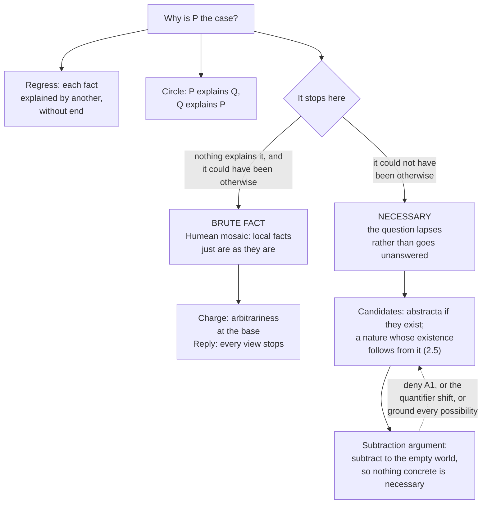

# Metaphysics · Lesson 3.3: Brute facts and necessary existence

> ⏱ ~15 min · Module 3: Modality and necessary existence · Builds on: [3.2 What possible worlds are](03-02-what-possible-worlds-are.md) · Unlocks: [4.1 Hume's challenge and the regularity theory](04-01-humes-challenge-and-the-regularity-theory.md)

## Why this matters

Every explanation you have ever given stops somewhere. The question this lesson asks is what a stopping point *is*: a fact that has no explanation and could have been otherwise, or a fact that could not have been otherwise and so leaves nothing to ask. That choice sets the terms for almost everything downstream — laws of nature (4.3), causation (Module 4), and the whole apparatus that [`philosophy-of-religion`](../../philosophy-of-religion/syllabus.md) (2.1–2.5) takes over when it runs arguments from contingency. This lesson supplies the parts and runs no such argument.

## The idea

Ask why something is the case, take the answer, and ask why of *that*. Three things can happen: the chain runs forever, it bends back on itself, or it stops. If it stops, the terminus is one of two very different things.

A **brute fact** is a terminus that has no explanation *and* could have been otherwise. Nothing whatever accounts for its obtaining rather than not. A **necessary** terminus is different in kind: the question lapses rather than goes unanswered, because there was no alternative for anything to account for.

Two distinctions keep this from blurring. First, "no cause" is not "no explanation": the fact that this vase is fragile is explained by its molecular structure, not caused by it — that is **grounding** explanation rather than **causal** explanation, and a principle demanding explanations can demand either. Second, "brute" is a claim about the world, not about us. That we have no explanation of dark energy is an epistemic report; that there *is* none is a metaphysical thesis, and only the second is bruteness.

The principle that forbids bruteness is the **Principle of Sufficient Reason** (PSR). It comes in strengths, and the strength is nearly the whole game.

## The argument

**The PSR, in its main forms.** Each line is a different principle, not a rephrasing.

| Version | Statement | In words |
|---|---|---|
| **Strong** (rationalist; Spinoza, Leibniz) | Every true proposition has an explanation | Nothing at all is brute, including necessary truths |
| **Contingency** | Every contingent fact has an explanation | Whatever could have been otherwise has a reason for being this way |
| **Causal** | Every contingent concrete thing has a cause of its existence | Restricted to things and to causes; says nothing about facts or grounds |
| **Restricted** | Every fact of kind K has an explanation | K is typically physical events, or non-fundamental facts |
| **Modest / defeasible** (Pruss, Koons) | Every fact *possibly* has an explanation, or: there is a standing presumption of explicability that a particular fact can defeat | Inexplicability is never the default; it has to be earned |

Two consequences of the table. An objection that sinks one row need not touch the rows below it — the modal-collapse objection, which alleges that the **strong** version makes every truth necessary, is aimed at the top of the table and is weighed in [`philosophy-of-religion`](../../philosophy-of-religion/syllabus.md) 2.4, not here. And a version weak enough to be uncontroversial may be too weak to carry the arguments people want from it. When someone says "the PSR," ask which row.

**The case for.** (1) *Practice.* No inquiry treats "there is no reason" as a finding. An unexplained residue is a research problem, and treating it otherwise would make inquiry optional at every step. (2) *Inference.* Inference to the best explanation presupposes that there is one to be had; if bruteness is always live, the inference has no grip. (3) *The restriction problem.* Rationalists press that once you admit one brute contingent fact you owe a principled account of why brute facts do not break out everywhere — why not brute appearances of objects, brute exceptions to regularities? Della Rocca's version of this is that the moves we all accept are explicability arguments (we reject a hypothesis *because* it would leave something inexplicable), and that you cannot run those and then stop. (4) *Arbitrariness.* A brute contingent fact is a joint in the world where things could have gone another way and nothing at all settled which.

**The case against.** (1) *The Humean mosaic.* On the picture Lewis calls Humean supervenience, the world is an arrangement of local qualities at points, and everything else supervenes on it. Local matters of particular fact do not explain one another in any deep sense; they are simply what there is. Asking why the mosaic is this one asks for something the picture has no room for — and a picture is not refuted by refusing to answer a question it declares ill-formed. (2) *The PSR's own credentials.* It is not analytic, and no observation confirms it over a weaker rival, since every explanation found is equally good evidence for the restricted version. (3) *The restriction can be principled.* The Humean allows bruteness only at the fundamental level — the distribution itself — and nowhere above it, so macroscopic coincidences remain as inexplicable as they always were. (4) *Whole and parts.* Even granting that every fact has an explanation, the further demand for an explanation of the *totality* may be a fallacy of composition: from "every part has F" it does not follow that the whole has F. (The rationalist's reply is that the totality is itself a fact, so the PSR already quantifies over it. That exchange, in its sharpest form as the Hume–Edwards objection to the argument from contingency, belongs to [`philosophy-of-religion`](../../philosophy-of-religion/syllabus.md) 2.1–2.5.) (5) *Physics.* Indeterministic decay gives a chance, not a reason why *this* atom decayed now — though whether a chance is an explanation is exactly what is at issue.

**Is admitting a brute fact a cost or honesty?** Both sides have a real answer. The Humean says every view terminates somewhere, so the only question is where, and a view that dresses its terminus in the word "necessary" has not explained anything — it has renamed the stop. The rationalist says the two termini differ in kind: a necessary terminus leaves nothing that could have been otherwise, while a brute one leaves the world arbitrary at its base, which is a defect and not merely a stopping place. Note the Humean's sharpest rejoinder: if one thing exists necessarily, why *that* one — has arbitrariness been removed or relocated?

**Necessary existence.** Using 3.2's machinery: *x* exists necessarily when *x* exists in every possible world. What that comes to depends on what worlds are. For Lewis's modal realist, worlds are spatiotemporally isolated concrete wholes, so no concrete thing is literally in two of them, and necessary existence has to be read through counterparts. For the ersatzist, every maximal consistent representation includes *x*. For the powers theorist, no way for reality to unfold leaves *x* out.

Three notes on candidates:

- **Abstracta are the cleanest case, conditionally.** If numbers exist, it is hard to say what could have removed the number 7 — no cause could destroy it, and no rearrangement of matter could prevent it. But the antecedent is doing heavy work: the nominalist of [1.4](01-04-nominalism-and-tropes.md) denies there is anything there to be necessary, and some platonists hold that at least some abstracta (sets of contingent things, singular propositions) exist contingently.
- **A necessary concrete being would be something stronger than you may think.** It is not merely everlasting, not merely indestructible, not merely uncaused. Those are all claims about this world. Necessary existence says no world lacks it — which is why the proposal, when it is made, takes the form of a nature whose existence follows from it ([2.5](02-05-essence-and-existence.md)).
- **The contingency intuition is the main obstacle.** Hume's Cleanthes puts it flatly: "Whatever we conceive as existent, we can also conceive as non-existent. There is no being, therefore, whose non-existence implies a contradiction." (*Dialogues Concerning Natural Religion*, Part IX.) Kant's related point is that existence is not a real predicate, so no amount of packing into a concept produces an existing instance of it ([2.5](02-05-essence-and-existence.md); read historically in [`modern-philosophy`](../../modern-philosophy/syllabus.md) 6.3). The standard reply comes from 3.1: conceivability is a fallible guide to possibility, and the necessary a posteriori is the proof — we can conceive the denial of truths that are nonetheless necessary. Whether that reply transfers to existence, where no a posteriori identity is on offer, is open.

**The subtraction argument** (Baldwin) turns the intuition into an argument that the empty world is possible — and so that nothing concrete exists necessarily.

> **A1.** There is a possible world with only finitely many concrete objects.
> **A2.** Each of those objects is such that it might not have existed.
> **A3.** The non-existence of any one of them does not require the existence of anything else.
> **∴ C.** There is a possible world with no concrete objects at all.

In words: start with a finite world, remove the objects one at a time, and nothing stops you before zero.

The standard replies, each attacking a different line. **Against A1:** perhaps every world contains infinitely many concreta — gunk all the way down, or a plenitude — in which case subtraction never terminates. **Against the inference:** the argument needs more than per-object possibility. From "each thing might not have existed," written $\forall x\, \Diamond \neg Ex$, you cannot infer "everything might jointly not have existed," $\Diamond \forall x\, \neg Ex$ — that is a quantifier shift, invalid in general, and A3 is precisely the independence premise added to license it. Whether A3 is more plausible than its conclusion is the live question. (Rodriguez-Pereyra reformulated the argument to tighten this step.) **Against the possibility itself:** a powers theorist holds that every possibility must be grounded in something actual, so a world in which nothing is actual has nothing to make it possible — on that view the empty "world" is not a world.

**A third answer.** Van Inwagen grants that the empty world is possible and argues that it is nevertheless unsurprising that something exists: there is exactly one empty world and infinitely many non-empty ones, so if no world is antecedently favored, the empty one gets probability zero. The standard reply is that there is no well-defined uniform probability over an infinite set of worlds, and no mechanism doing the selecting for a probability to describe.

## Map of positions

## Worked examples

**Example 1 (mechanical — running the versions on one fact).** A particular radium atom decays at 3:04. The laws give a half-life and nothing more: no antecedent condition distinguishes this atom from an identical one that did not decay.

Work down the table. The **strong** and **contingency** versions both demand an explanation of *this* fact, which is contingent — and the only candidate is "the law assigns it a chance," which explains why decay was to be expected in some atoms but not why it happened in this one at this time. That is the difference between an explanation and a **contrastive** explanation, and it is where the argument actually sits: the rationalist says a chance is a genuine explanation of a chancy outcome, so the PSR survives quantum mechanics untouched; the Humean says calling it an explanation drains the word, and that this is a clean, uncontroversial brute fact. The **causal** version is not engaged at all — it asks for a cause of the atom's *existence*, which the atom has. The **restricted** version passes trivially if fundamental physical facts are the exception it carves out, which shows how much work the choice of K is doing.

Notice what has been settled: nothing about whether the PSR is true. What has been settled is that the disagreement is about a single question — whether a chance explains an outcome — and that is the shape a well-run metaphysical dispute takes.

**Example 2 (a hard case — subtraction in a toy world).** Let *w* contain exactly three iron spheres and nothing else concrete. A1 is satisfied by construction. A2 looks safe: each sphere is an ordinary contingent object. Now subtract.

Remove sphere one: the world with spheres two and three seems plainly possible. Remove sphere two: likewise. Remove sphere three — and the argument says you get the empty world, since by A3 no sphere's departure required anything else to exist.

Where does each tradition stop this, and does the stop look principled?

- The **Lewisian** may deny A1 outright: on a plenitude of worlds, one can ask whether any world is finite in the required way, and Lewis's own commitments (unrestricted mereological composition, abundant recombination) make finite worlds scarce and may make the empty world simply one of the worlds — in which case A1 and C are both accepted and no concrete thing is necessary, exactly as the argument says.
- The **ersatzist** treats worlds as maximal consistent representations and asks whether a representation of *nothing concrete* is consistent. Nothing obvious rules it out, so ersatzism tends to accept C too. This is worth seeing: two rival theories of worlds agree here.
- The **powers theorist** attacks the last step and only the last step. Possibilities are grounded in the potencies of actual things ([3.2](03-02-what-possible-worlds-are.md)); each subtraction after the first is a possibility grounded in what remains; the final subtraction has nothing left to ground it. The Humean answers that this is not an objection but the disputed premise restated — that possibility needs an actual ground is precisely what a Humean denies, since on the mosaic view possibility is recombination, and recombining zero elements is permitted.

Both answers are available and neither is a trick. The crux is fixed and narrow: whether an unactualized possibility requires an actual ground.

## Watch out

- **Brute is not unexplained-so-far.** "We have no explanation" is epistemic; "there is none" is the thesis. Arguments constantly slide from the first to the second.
- **Brute is not fundamental.** A fundamental fact is one nothing further grounds; it may still be necessary, and then it is not brute.
- **No cause is not no explanation.** Grounding explains without causing, which is why the causal row of the table is far weaker than it looks — an abstractum can lack a cause without being brute.
- **Necessary existence is not everlastingness, indestructibility, or being uncaused.** Those are claims about this world; necessity quantifies over all of them.
- **Watch the quantifier shift.** "Each thing might not have existed" does not yield "everything might not have existed," any more than "everyone has a mother" yields "someone is everyone's mother." This is the de dicto / de re scope point from 3.1, and it is the pressure point of the subtraction argument.
- **Do not argue against "the PSR."** Name the row. Refuting the strong version leaves the modest version standing, and granting the modest version does not deliver what the strong one was wanted for.

## One-liner

> Every chain of explanation stops; the dispute is whether the stop is a fact that could have been otherwise and simply is, or one that could not have been otherwise — and whether existence itself is the kind of thing that can be necessary.

## Problems

**P1 (🟢) *(Exegetical.)*** For each claim, say (i) which version(s) of the PSR it would violate, if any, and (ii) whether what it asserts is metaphysical bruteness or only our present ignorance. One or two sentences each.

(a) "The cosmological constant has the value it has, and there is no reason why — it is simply one of the numbers the world came with."
(b) "Every event inside the universe has an explanation; the existence of the universe has none."
(c) "The number 3 exists, and nothing caused it to exist."

**P2 (🟡) *(Exegetical (a) · Evaluative (b).)*** The subtraction argument, as stated in this lesson.

(a) Identify the exact point where the argument moves from a claim about each object to a claim about all of them together, and name the premise that is supposed to license the move.
(b) The powers theorist blocks the final subtraction on the ground that every possibility needs an actual ground. Is that a genuine objection or a restatement of the disputed premise? 150 words or fewer, any verdict, provided you state what grounds possibility on the Humean view as well as on the powers view.

**P3 (🔴, optional) *(Diagnose — Exegetical (a) · Evaluative (b).)*** An invented post from a physicist's blog:

> "Once we have the final theory, the questions stop. A truly final theory is mathematically inevitable — there is exactly one consistent way to write the equations down — and a universe running those equations could not have been otherwise. So the constants are not brute after all. They are theorems. Nothing is left over to explain."

(a) Name the two distinct claims the passage runs together, and say which row of the PSR table it would satisfy if everything it asserts were true. (b) Has the passage eliminated the brute fact or relocated it? 150 words or fewer, any verdict, provided you say what would still be unexplained.

Solutions

**P1** *(Exegetical — strict.)*

**Must hit, strict:**
- (a) Violates the **strong** and **contingency** versions (the value is contingent and is said to have no explanation). It does not violate the **causal** version, which asks about things and causes, not values. The claim as *worded* asserts metaphysical bruteness ("there is no reason why"), though scientists usually mean the epistemic version; the strict point is that the sentence as written is the metaphysical thesis.
- (b) Consistent with a **restricted** PSR (K = events inside the universe) and with the **causal** version if the universe is not a thing with a cause; violates the **strong** and **contingency** versions, which quantify over the totality too. This is also where the whole/parts question arises — whether explaining every part explains the whole. Metaphysical, not epistemic.
- (c) Violates **nothing**. The causal version concerns contingent concrete things; an abstractum has no cause, and lacking a cause is not lacking an explanation — its existence may be necessary or grounded in its nature. Neither bruteness nor ignorance is asserted.

**Wrong turns:** treating (c) as a PSR violation by reading "cause" as "explanation"; saying (b) violates every version, missing that the restricted version was built for exactly this shape; calling (a) merely epistemic when the sentence states the metaphysical thesis.

**Model answer:** as above.

---

**P2** *(a) exegetical — strict; (b) evaluative — any verdict.*

**Must hit, strict (a):** the move is from A2, which says of each object that it might not have existed, to C, which says there is one world in which none of them exists — per-object possibility to joint possibility. Formally, from "for every x, possibly x does not exist" to "possibly, for every x, x does not exist," which is an invalid quantifier shift. **A3** is the premise that licenses it: each object's non-existence does not require anything else to exist, so the subtractions can be composed.

**Must hit, any verdict (b):** state both grounds for possibility — on the powers view a possibility is real only if something actual has the potency for it; on the Humean view possibility is recombination of the elements of the mosaic, with no requirement that anything ground the recombination. Then say whether the powers reply adds anything beyond that disagreement: it does add something if it can motivate the grounding requirement independently (e.g. from how modal claims about ordinary objects are made true); it does not if it simply asserts it against A3.

**Wrong turns:** declaring the argument invalid full stop and stopping there — A3 was added precisely to repair the shift, so the objection has to engage A3; treating "nothing exists" as self-refuting because someone has to conceive it, which confuses the content of a possibility with the conditions for entertaining it.

**Model answer (b), one of several:** It is closer to a restatement than to an independent objection, but not only that. The Humean grounds possibility in recombination: take the elements of the mosaic and rearrange them freely, and since recombination places no lower bound on how many elements you keep, the empty arrangement is automatically permitted. The powers theorist grounds possibility in actual potencies, so an arrangement with nothing in it has no truthmaker. Stated that way, each side's verdict on A3 falls straight out of its theory of modality, which is a sign the subtraction argument is not neutral machinery. It earns its keep anyway: it forces the powers theorist to accept that the grounding requirement, not the intuitive subtraction step, is doing all the work — and that requirement then has to be defended on its own, not by the argument it is blocking.

---

**P3** *(a) exegetical — strict; (b) evaluative — any verdict.*

**Must hit, strict (a):** the passage conflates (i) a claim about the *theory* — that exactly one consistent set of equations exists, a mathematical or epistemic uniqueness claim — with (ii) a claim about the *world*, that reality could not have failed to satisfy those equations, a metaphysical necessity claim. The uniqueness of a description does not entail that anything satisfies it, nor that whatever satisfies it had to. The step also upgrades physical (nomological) necessity to metaphysical necessity, which 3.1 keeps apart. If everything asserted were true, the passage would satisfy the **restricted** version for physical facts, and could claim the **contingency** version for the constants only if it had shown the constants are not contingent, which is what it assumed.

**Must hit, any verdict (b):** name what remains unexplained on the passage's own terms. At least two candidates: that there exists something obeying the equations at all, rather than the equations being true of nothing (Kant's point that existence is not a predicate the description can supply); and the mathematical inevitability itself, which the strong PSR would also demand an explanation of. Either verdict passes.

**Wrong turns:** rejecting the passage on physics — whether a final theory is unique is not the issue and is not yours to settle; treating "theorems" as automatically meaning necessary truths without asking necessary *given what*.

**Model answer (b), one of several:** Relocated, on the passage's own accounting. Grant the uniqueness claim entirely. What it delivers is conditional: *if* there is a universe at all, its constants take these values. The residue is the antecedent — that there is something rather than an empty world, and that it is this uniquely consistent system rather than no system that is instantiated. The passage does move the brute fact somewhere deeper and narrower, which is a real gain and the kind of gain physics regularly makes; a Humean should say so rather than deny it. But the last line overreaches. Whoever defends the strong PSR will ask why the equations are inevitable, and the passage has no resources left: mathematical necessity was its terminus, and a terminus is exactly what was under dispute.

## Flashback

*From [3.1](03-01-kinds-of-necessity.md) — the contingency intuition against necessary existence is a conceivability argument, so the machinery has to be sharp.*

**F1 (🟡) *(Exegetical.)*** For each claim, name the **strongest** kind of necessity it has — logical/conceptual, metaphysical, physical (nomological), or none — and give the one-line reason.

(a) Nothing accelerates from rest to beyond the speed of light.
(b) Gold has atomic number 79.
(c) No bachelor is married.

Then: (d) the denial of (b) is easy to imagine — someone could hold up a bar of gold and be told it is element 47. In one sentence, say why that does not show (b) is contingent.

Solution

**F1** *(Exegetical — strict.)*

**Must hit, strict:**
- (a) **Physical (nomological).** It follows from relativistic dynamics, and the laws could have been otherwise; there is no contradiction in a world with different laws.
- (b) **Metaphysical**, and *a posteriori*. Atomic number fixes what gold is, so nothing in any world is gold without having 79 protons — but the fact was discovered, not deduced.
- (c) **Logical/conceptual.** The denial is a contradiction once "bachelor" is unpacked; no empirical discovery could bear on it.
- (d) What is being imagined is a situation in which the *stuff we call gold* turns out to be silver — an epistemic possibility about which substance we are pointing at, not a possibility in which gold itself lacks its atomic number. Conceivability tracks how things might have turned out to be for all we knew, and that is not the same as how they might have been.

**Wrong turns:** calling (b) physical because chemistry is empirical — the way we learn a truth does not fix its modal strength; calling (a) metaphysical because it follows from the laws, which assumes the laws are necessary (that is 4.3's question, and dispositional essentialists do say so, which is the one live route to the answer being different).

**Model answer:** (a) physical; (b) metaphysical, a posteriori; (c) logical; (d) the imagined case redescribes our epistemic situation, not gold's nature.

## Connections

- **Backward:** [3.1](03-01-kinds-of-necessity.md) supplies the strengths of necessity and the limits of conceivability, both of which the contingency intuition leans on; [3.2](03-02-what-possible-worlds-are.md) supplies the three readings of "exists in every world," and the powers-based account is what blocks the subtraction argument's last step. [2.5](02-05-essence-and-existence.md) supplies the only shape a necessary concrete being has been given — a nature whose existence follows from it — and Kant's point that existence is not a real predicate. [1.2](01-02-abstract-objects.md) decides whether the cleanest candidates for necessary existence are there at all.
- **Forward:** [4.1](04-01-humes-challenge-and-the-regularity-theory.md) meets the Humean mosaic again, now as a theory of causation, and [4.3](04-03-powers-dispositions-and-laws.md) asks whether laws are brute regularities or flow from natures — the same disagreement one level down.
- **Sideways:** [`philosophy-of-religion`](../../philosophy-of-religion/syllabus.md) (2.1–2.5) takes everything here and puts it to work: the PSR weighed as a premise, the Hume–Edwards objection, the modal-collapse objection to the strong version (2.4), and the arguments themselves. None of that is run here. The discipline of naming the single premise a dispute turns on — used twice in this lesson, on the chance-as-explanation question and on the grounding of possibility — is [`philosophical-method`](../../philosophical-method/syllabus.md) 3.2's crux test.
