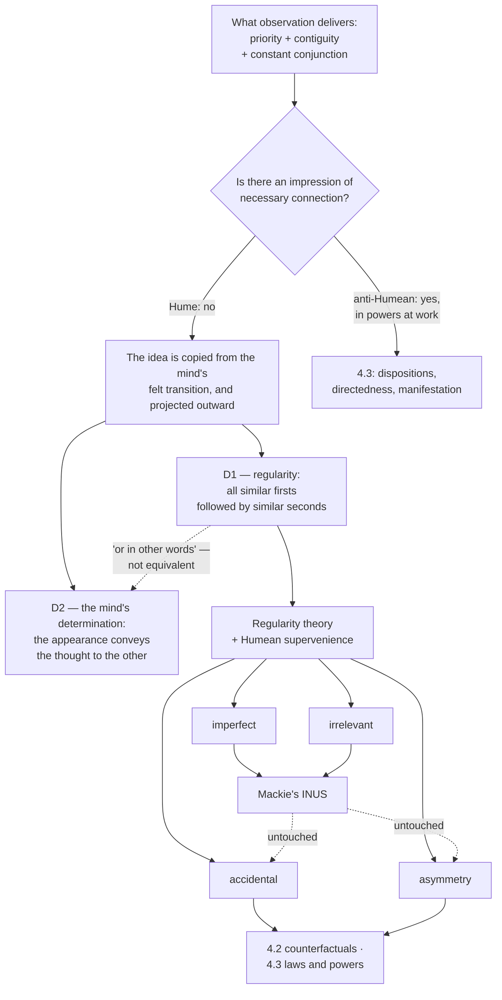

# Metaphysics · Lesson 4.1: Hume's challenge and the regularity theory

> ⏱ ~15 min · Module 4: Causation · Builds on: [3.3 Brute facts and necessary existence](03-03-brute-facts-and-necessary-existence.md) · Unlocks: [4.2 Counterfactual causation](04-02-counterfactual-causation.md)

## Why this matters

Everything in this module is downstream of one observation Hume made and nobody has been able to un-make: when you watch a cause produce an effect, you do not see the producing. You see one thing, then another thing, and — after enough trials — you expect the second. If that is all the evidence there is, then either causation *is* just that pattern, or we believe in something we have no direct warrant for. The three traditions in this course split almost exactly here. The Humean says the pattern is all there is and that this costs us nothing we should want; the neo-Aristotelian says the world contains powers that do the producing; the Quinean asks which of those our best theory has to quantify over. This lesson builds the Humean option at full strength, because the rest of the module is a series of attempts to break it.

## The idea

Take the clearest case of one thing making another happen: one billiard ball strikes a second, and the second moves. Inventory what your senses actually deliver.

- **Priority.** The first ball's motion comes before the second's.
- **Contiguity.** They touch — the cause is next to its effect in space and time (or is linked to it by a chain of contiguous steps).
- **Constant conjunction.** Balls struck like that have always moved like that.

Now look for the fourth thing, the one that separates *causing* from merely *preceding*: the necessity, the making-happen, the connection that guarantees the second event given the first. Hume's claim is that no sense-impression of it ever arrives. Not in the first collision, where you see only two motions. And not in the thousandth, because the thousandth collision looks exactly like the first — repetition adds nothing *to the individual cases* except that there are now more of them.

Something does change with repetition, though. It changes in **you**. After enough trials the mind slides from the idea of the first ball's motion to the idea of the second without being asked. Hume's diagnosis is that this felt slide is the missing impression, and that the idea of necessary connection is copied from it — then projected outward onto the pair of events, where it looks like a feature of the world.

This is a claim about the *source* of a concept, and its force depends on Hume's theory of ideas (that belongs to [`modern-philosophy`](../../modern-philosophy/syllabus.md) 4.2, which reads the argument inside his system). Our question here is different and blunter: **if necessary connection is not out there, what is causation?**

## Source

Hume answers at the end of *Enquiry Concerning Human Understanding*, Section VII, Part II — and gives, in one paragraph, two definitions:

> "Similar objects are always conjoined with similar. Of this we have experience. Suitably to this experience, therefore, we may define a cause to be *an object, followed by another, and where all the objects, similar to the first, are followed by objects similar to the second.* Or in other words, *where, if the first object had not been, the second never had existed.* … We may, therefore, suitably to this experience, form another definition of cause, and call it, *an object followed by another, and whose appearance always conveys the thought to that other.*"

Three things are worth noticing in that paragraph, and they are the seed of the next two lessons.

**D1 is about the world.** A cause is an event of a type whose instances are always followed by events of another type. No mind appears in it.

**D2 is about us.** A cause is an event whose appearance carries the thought to another event. No regularity appears in it.

**"Or in other words" is doing work it cannot do.** The counterfactual clause — *if the first had not been, the second never had existed* — is not a restatement of the regularity clause. A regularity can hold while the counterfactual fails (if something else would have produced the effect anyway), and Lewis built an entire rival theory out of taking that clause seriously ([4.2](04-02-counterfactual-causation.md)).

So the paragraph contains three candidate definitions and no two of them are equivalent. D1 and D2 come apart in both directions: an undiscovered regularity in a sealed cave satisfies D1 and moves no mind at all, and a superstition — every broken mirror followed by seven bad years, as the superstitious person's mind reliably anticipates — satisfies D2 with no regularity behind it. Whether Hume noticed, and which definition he meant to be primary, is the historical question owned by [`modern-philosophy`](../../modern-philosophy/syllabus.md) 4.2. Whether either is *true* is ours.

## The argument

**Hume's challenge, in premises.**

> **P1.** Every idea we have is copied from some prior impression.
> **P2.** In observing a causal sequence, the senses deliver priority, contiguity, and — over repeated instances — constant conjunction.
> **P3.** No impression of a necessary connection is delivered, in a single instance or in any number of them; repeated instances are just more instances.
> **P4.** We nonetheless possess the idea of necessary connection; it is what distinguishes causing from merely preceding.
> **∴ C.** The idea must be copied from an impression elsewhere — and the only new thing repetition produces is the mind's felt determination to pass from the one idea to the other.

In words: the necessity we think we see between cause and effect is a habit of ours read back into the world.

**The regularity theory** is D1 taken as a theory rather than a report about Hume. In its modern form: **c causes e when c is prior to e and the pair instantiates a law-like regularity — events of c's type are followed by events of e's type.** Its metaphysical backdrop is what Lewis called **Humean supervenience**: the world is a mosaic of local particular matters of fact, one little thing and then another, and laws, causes, chances and possibilities are all patterns in the arrangement. Nothing is added to the mosaic to hold it together.

**Four standard problems.** They have been the agenda for a century.

| Problem | Case | What goes wrong |
|---|---|---|
| **Imperfect regularities** | Smoking causes lung cancer; most smokers never get it | Real causes are not invariably followed by their effects, so the constant conjunction we need is almost never there |
| **Irrelevant regularities** | Salt hexed by a witch dissolves in water — every time | The conjunction is perfect and the hexing is causally idle; a mere pattern cannot tell the working part from the passenger |
| **Accidental regularities** | The Manchester hooter sounds at five, and the London workers stop work — always | Constant conjunction without causation. The hooter causes nothing in London; both are downstream of the clock |
| **Asymmetry** | The barometer falls, then the storm arrives | Regularity is symmetric — "Cs are followed by Ds" and "Ds are preceded by Cs" report the same pattern — so nothing in it makes causes run toward effects rather than back |

The last two are the deep ones. **Accidental regularities** come in two flavors worth keeping apart: the *common-cause* case, like the hooter, where a third thing explains both; and the pure accident, like "every gold sphere is less than a mile across," which happens to hold and supports nothing. The word "law-like" in the theory's statement is where all the weight sits, and the Humean owes an account of it that does not smuggle necessity back in ([4.3](04-03-powers-dispositions-and-laws.md) is where that debt is paid or defaulted on). **Asymmetry** is usually patched by the priority clause — causes precede effects — but that is a stipulation, not an explanation; it settles the direction by definition and rules out simultaneous causation before the question is asked ([4.4](04-04-ordered-causal-series.md)).

**Mackie's INUS account** is the regularity theory made sophisticated. The definition:

> A cause is an **i**nsufficient but **n**on-redundant part of an **u**nnecessary but **s**ufficient condition.

In words: the cause alone doesn't do it, and the whole package that does do it isn't the only package that would have — but take the cause out of that package and the package stops working.

## Argument map

## Worked examples

**Example 1 (mechanical — running INUS on the house fire).** Experts declare that a short circuit caused the fire. Build the analysis in four steps.

1. **Find a cluster that suffices.** The short circuit (A) by itself does nothing in a damp concrete room. What sufficed here was A together with inflammable material nearby (B) and the absence of a working sprinkler (C). Call it **A ∧ B ∧ C** — given that cluster, fire.
2. **Note that the cluster is unnecessary.** The house could have burned without any short circuit: an overturned oil heater with the same material and no sprinkler (**D ∧ E ∧ F**), or a lightning strike on the roof (**G ∧ H ∧ I**). So the condition that is both necessary and sufficient for fire is the whole disjunction, **(A ∧ B ∧ C) ∨ (D ∧ E ∧ F) ∨ (G ∧ H ∧ I)**, and A appears in only one disjunct.
3. **Check A's status inside its cluster.** A is **insufficient** — it needs B and C. It is **non-redundant** — delete A and B ∧ C alone does not suffice, since inflammable material next to a working-but-absent sprinkler does not ignite itself. So A is an insufficient but non-redundant part of an unnecessary but sufficient condition: an INUS condition of the fire.
4. **Explain why we said "the cause."** Oxygen is also a non-redundant conjunct of the cluster, and nobody blames the oxygen. Mackie's answer is the **causal field**: every causal claim is made against a background held fixed — here, a normally oxygenated house — and we cite the conjunct that varied. "The short circuit caused the fire" means: *relative to this house as it normally is*, the short circuit was the INUS condition that was present.

What this bought the Humean is real. **Irrelevance** is handled by non-redundancy: hexing the salt is redundant, since the rest of the cluster dissolves it without help, so hexing is no INUS condition of anything. **Imperfect regularities** are handled by the "insufficient" clause: smoking need not be followed by cancer, because smoking is one conjunct of clusters that are completed only occasionally — and the regularity that must hold is at the level of the *full cluster*, not the cause. No new ingredient was added to the world to do either job. The analysis is still pure pattern.

**Example 2 (where it strains — the Manchester hooter, and the arrow).** Stipulate the regularity as tightly as you like: for forty years, whenever the Manchester hooter sounds, the London workers down tools a moment later; there is not one exception.

Run INUS. Is the hooter's sounding an insufficient but non-redundant part of an unnecessary but sufficient condition for the London stoppage? Yes. Take the cluster: *hooter sounds* ∧ *London workers are at their benches* ∧ *the shift rules are in force*. That cluster is sufficient by stipulation; it is unnecessary (a fire alarm would also empty the benches); the hooter alone is insufficient; and delete it and the remaining conjuncts do not suffice, since the workers keep working until five. So the hooter is an INUS condition of the London stoppage, and Mackie's account says it is a cause. It is not. The clock causes both.

The Humean has a reply, and it is not weak: distinguish the *law-like* regularities from the merely accidental ones by whether they figure in the best overall system of the world — the simplest, strongest true description of the mosaic. A system that posited a Manchester-to-London law would carry a clause it could delete without losing any predictive strength, since the clock already covers both. That reply is developed in [4.3](04-03-powers-dispositions-and-laws.md); note here only that it is a promissory note, and that the anti-Humean's objection is precisely that "law-like" is doing anti-Humean work under a Humean name.

Asymmetry is worse, because it is not patchable from inside. Run the definition backwards: the London stoppage is just as good an INUS condition of the hooter's sounding, since the pattern reported in either direction is one pattern. Mackie can only exclude the backwards reading by writing *the cause comes first* into the account. That works, but it is the analysis being told the answer rather than finding it — and it forecloses simultaneous causation, which a hylomorphist will want ([4.4](04-04-ordered-causal-series.md)). Preemption breaks it from the other side: when Suzy's rock and Billy's rock are both in the air, each throw is an INUS condition of the breaking, and no regularity fact distinguishes the throw that did it from the throw that would have. That case is [4.2](04-02-counterfactual-causation.md)'s.

## Watch out

- **The Humean is not denying causation.** This is the most common misreading and it makes the position look absurd. The claim is reductive, not eliminative: causation is real, and it *consists in* a pattern of local matters of fact rather than in an extra ingredient linking them. "There is no necessary connection in the world" means "nothing over and above the mosaic," not "nothing happens because of anything."
- **Constant conjunction is not the same as a law.** Every sentence of the regularity theory leans on "law-like," and the theory does not by itself say what makes a regularity law-like. Watch for the word doing unearned work — in your reading and in your own answers.
- **INUS fixes the easy two, not the hard two.** Irrelevance and imperfection, yes. Accidental regularities and asymmetry, no: the hooter is an INUS condition, and the definition runs backwards as happily as forwards.
- **The non-redundancy test smells counterfactual.** "Delete A and the rest does not suffice" is naturally read as *if A had been absent, no fire*. Mackie meant the test to be cashed out in terms of what regularities hold, but the pull toward counterfactuals is real and is one route into [4.2](04-02-counterfactual-causation.md).
- **"Hume was a skeptic about causation" is contested exegesis.** A body of scholarship (the "New Hume") reads him as believing in real causal powers while denying we can form a contentful idea of them. Named, not settled, and not settled here — see [`modern-philosophy`](../../modern-philosophy/syllabus.md) 4.2.
- **D1 and D2 are not two halves of one theory.** They are two theories, and the second — a cause is what carries a mind to its effect — makes causation mind-dependent in a way almost no modern regularity theorist accepts. Modern regularity theories descend from D1 alone.

## One-liner

> If nothing in experience delivers the making-happen, then either causation is nothing but law-like pattern in a mosaic of local facts — and Mackie shows how much that pattern can do — or the pattern is the symptom of something the mosaic leaves out.

## Problems

**P1 (🟢) *(Exegetical.)*** A discarded cigarette starts a forest fire at the end of a dry summer.

(a) Give one sufficient cluster of conditions, say which conjunct is the INUS condition we would name as *the* cause, and say what the causal field is. (b) A crude regularity theory says c causes e when all events like c are followed by events like e. State in one sentence what that theory gets wrong about this case, and which of the four standard problems it is an instance of.

**P2 (🟡) *(Exegetical (a) · Evaluative (b).)*** An invented paragraph from a public-health agency's release:

> "Our cohort study establishes that the additive causes arrhythmia. Note that the association is not merely statistical: the compound *acts on* cardiac tissue, and it would have done so in any population we might have sampled. Until the mechanism is characterized we cannot say what the compound does, only how often the two occur together — but the regulatory case is already complete."

(a) Name the two places the paragraph claims more than constant conjunction, quoting the words that carry it, and name the one place it retreats to constant conjunction. (b) Is the retreat consistent with the rest? Say what a Humean can and cannot supply of what this paragraph wants. **150 words or fewer for (b).**

**P3 (🔴, optional) *(Evaluative.)*** A colleague proposes to fix the accidental-regularity problem this way: *a regularity is law-like when it supports counterfactuals — when, had the hooter not sounded, the workers would still have stopped, the regularity is accidental and no cause is present.*

State whether this rescues the regularity theory or costs it something it was trying to keep, and name the crux — the one thing a Humean and an anti-Humean must disagree about for the dispute to survive the fix. **150 words or fewer.** Any verdict; the crux is what is graded.

Solutions

**P1** *(Exegetical — strict.)*

**Must hit, strict:**
- (a) A sufficient cluster: *lit cigarette discarded* ∧ *dry litter present* ∧ *no rain or suppression* ∧ *oxygen* (and whatever else the fuel needs). It is unnecessary — lightning or a campfire would also have done it. The cigarette is insufficient alone and non-redundant in the cluster, so it is the INUS condition. The **causal field** is the forest as it normally stands in late summer: dryness, fuel and oxygen are held fixed as background, which is why we name the cigarette rather than the oxygen. Full credit requires naming the field explicitly, not just the conjunct.
- (b) Discarded cigarettes are *not* always followed by fires — most go out. So the crude theory delivers no cause here at all; this is the **imperfect regularities** problem, and the INUS move repairs it by placing the invariable connection at the level of the completed cluster rather than the cause.

**Wrong turns:** listing the cluster but calling the whole cluster "the cause" — INUS names one conjunct, and the field explains which; saying the problem is *accidental* regularity because the summer's dryness was accidental in the ordinary sense (the technical problem is constant conjunction without causation, which is not this case).

---

**P2** *(a) exegetical — strict; (b) evaluative — any verdict.*

**Must hit, strict (a):** two overreaches — **"acts on cardiac tissue"** (a power at work, a producing, not a pattern) and **"would have done so in any population we might have sampled"** (a modal claim covering unsampled cases, which no observed conjunction delivers). The retreat: **"we cannot say what the compound does, only how often the two occur together."** Both quotations must be identified as going beyond constant conjunction; either one alone is half credit.

**Must hit, any verdict (b):** separate the two overreaches, because the Humean treats them differently. The modal/counterfactual claim is the one a Humean has machinery for — if the generalization is law-like (a theorem of the best system rather than an accident of this cohort), it covers unsampled populations, and support for counterfactuals is a *consequence* of lawhood rather than evidence of a hidden power. The "acts on" claim is where the disagreement is real: the Humean can offer a finer-grained mosaic (a longer chain of local regularities down to ion channels) but nothing that is a *producing* rather than a further pattern. Then say whether that is a loss. Either verdict passes.

**Wrong turns:** treating "acts on" as harmless metaphor and stopping there — the question asks what the paragraph *claims*; asserting that the Humean cannot support any counterfactual, which concedes far too much and is not the Humean position; arguing about whether the additive really is dangerous.

**Model answer (b), one of several:** The retreat is only half consistent. The agency wants the generalization to cover populations it never sampled, and a Humean can have that: if the regularity is law-like — earning its place in the best systematization of the facts rather than holding by accident of this cohort — it projects, and supports the counterfactual, without any power being posited. What the Humean cannot supply is "acts on." Every replacement is another pattern: the additive is an INUS condition of arrhythmia relative to the field of ordinary human hearts, and characterizing the mechanism means finding shorter, tighter regularities between the compound and the ion channels. If the agency means the mechanism would tell us something the completed pattern does not, it has already left Hume's side — which is the substantive question, not a slip of drafting.

---

**P3** *(Evaluative — any verdict; the crux is what is graded.)*

**Must hit:**
- **Grant that the fix works extensionally on the case.** Had the hooter not sounded, the London workers would still have stopped (the clock was running), so the regularity is accidental and the hooter is excluded. The verdict is right.
- **Name the cost.** The regularity theory's selling point was that causation reduces to the actual arrangement of actual events. Counterfactuals are claims about non-actual situations, so the fix helps itself to modal facts that are not in the mosaic of local matters of fact — unless the Humean can ground counterfactuals in the pattern itself. That is exactly what a Humean best-system account tries to do, and exactly what the anti-Humean says cannot be done without powers.
- **Name the crux.** Whether modal facts (what would have happened) supervene on the totality of non-modal local facts. Humean: yes — lawhood is a feature of the best systematization of the mosaic, and counterfactual support falls out of it. Anti-Humean: no — nothing in a pattern of what *does* happen fixes what *would* have, so counterfactual support is evidence of a power, not a substitute for one.

**Wrong turns:** calling the fix circular because counterfactuals are "causal notions in disguise" without saying why — Lewis's whole program in [4.2](04-02-counterfactual-causation.md) is an analysis of counterfactuals in terms of similarity between worlds, with no causal vocabulary, so the circularity charge has to be argued rather than asserted; answering with a verdict on whether the hooter causes anything, which both sides already agree about.

**Model answer, one of several:** The fix gets the case right and gives up the theory's distinctive claim. Pure regularity theory promised causation as a pattern in what actually happens; the counterfactual test appeals to what would have happened under a situation that did not occur, which is not a local matter of particular fact. A Humean can still take the fix if counterfactuals reduce — if the best system of the mosaic settles which regularities support them. So the dispute survives, relocated: it is now about whether modal truths supervene on the non-modal arrangement. The anti-Humean holds that no distribution of actual events fixes what would have happened, and that the ability to support counterfactuals is the signature of a power rather than an alternative to one. That is the crux, and it is the same crux that returns in 4.3.

## Flashback

**F1 (🟡) *(Exegetical (a) · Evaluative (b).)*** From [3.2](03-02-what-possible-worlds-are.md). A reliability engineer writes in a safety case:

> "There is a possible world in which the primary valve sticks open and the backup relay fails in the same hour, and that world is close to ours."

(a) For each of three views — worlds as a *tool* only, with modality primitive (modalism); Lewis's modal realism; and abstractionist ersatzism — say what the sentence's truth requires, and which of the three makes "close to ours" hardest to cash out. (b) The engineer clearly means something the safety case depends on. Which view lets the sentence do that work at the lowest cost? **120 words or fewer for (b).**

Solution

**Must hit, strict (a):**
- **Tool only (modalism / primitivism).** No worlds exist; world-talk is a device for regimenting claims about what is possible, and the sentence comes to the operator claim *it could be that the valve sticks open and the relay fails together*, taken as basic. The debt: the modality is restated, not explained, and the expressive convenience of quantifying over worlds is given up.
- **Modal realism.** A concrete world, as real as ours and spatiotemporally disconnected from it, contains a counterpart of the valve that sticks open and a counterpart of the relay that fails. The sentence is literally an existential claim about a concrete object, true or false independently of us.
- **Ersatzism.** Worlds are abstract representations — maximal consistent sets of propositions, or states of affairs. The sentence says one such abstract object represents the joint failure.
- **Hardest for "close to ours":** the **tool-only** view, which has no worlds to stand in similarity relations, so comparative closeness has to be rebuilt with operators alone or inside the engineering model (fewer or less drastic departures from actual operating conditions) rather than read off a space of worlds — this is exactly the expressive cost 3.2 charged modalism. Lewis and the ersatzist each have an ordering ready: overall similarity among concrete worlds, or among representations.

**Must hit, any verdict (b):** identify the work — the sentence licenses an inference about what the system *would* do, which drives a design decision, so a bare logical-possibility reading is too weak. Then price at least two views against that: whether the view supplies a closeness ordering, and what it costs ontologically. Either verdict passes if the work is named first.

**Wrong turns:** treating "possible" here as bare logical possibility (then everything not self-contradictory is close, and the safety case says nothing); assuming modal realism is the only view that makes the sentence literally true — the ersatzist's abstract worlds make it literally true too, at lower ontological cost and with a harder problem about what the representing consists in.

**Model answer (b), one of several:** Ersatzism buys the most for the least. The engineer needs the claim to be literally true and to carry a closeness ordering, which rules out the bare tool reading as it stands; but nothing in the safety case needs the failing valve to be a concrete object somewhere, so modal realism's cost is unpaid-for. Abstract worlds give a truthmaker and an ordering over representations. A powers theorist would add that the ordering ought to track the actual dispositions of these components — which is what an engineer means anyway.

## Connections

- **Backward:** [3.3](03-03-brute-facts-and-necessary-existence.md) built the Humean mosaic and brute contingency; this lesson is what that mosaic implies about causation. [3.1](03-01-kinds-of-necessity.md)'s distinction between nomological and metaphysical necessity is what "law-like" has to be spelled out in.
- **Forward:** [4.2](04-02-counterfactual-causation.md) takes Hume's smuggled counterfactual clause seriously and runs it into preemption; [4.3](04-03-powers-dispositions-and-laws.md) is where the Humean pays the "law-like" debt (the best-system account) and the anti-Humean presents the bill (necessitation, dispositional essentialism); [4.4](04-04-ordered-causal-series.md) takes up the asymmetry that the priority clause stipulated rather than explained.
- **Historical source:** the argument from the copy principle to the two definitions, inside Hume's own system, is [`modern-philosophy`](../../modern-philosophy/syllabus.md) 4.2 — read it for the exegesis and the "New Hume" dispute; Kant's reply is that course's 5.5. Boss problem 4 of this course close-reads the same paragraph and then asks whether either definition is true.
- **Sideways:** the problem of induction — why past conjunctions license any expectation at all — is the other half of Hume's challenge, and belongs to [`epistemology`](../../epistemology/syllabus.md). Here we grant the expectation and ask what causation is.
