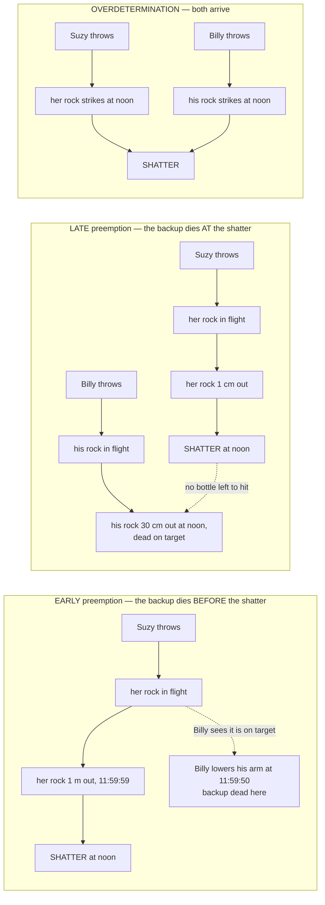

# Metaphysics · Lesson 4.2: Counterfactual causation

> ⏱ ~15 min · Module 4: Causation · Builds on: [4.1 Hume's challenge and the regularity theory](04-01-humes-challenge-and-the-regularity-theory.md) · Unlocks: [4.3 Powers, dispositions, and laws](04-03-powers-dispositions-and-laws.md)

## Why this matters

[4.1](04-01-humes-challenge-and-the-regularity-theory.md) ended with a clause Hume threw away inside an "or in other words" — *if the first object had not been, the second never had existed* — and with the observation that it is a rival to the regularity definition, not a restatement of it. Lewis took the rival seriously and built the most influential theory of causation of the last fifty years out of it. It fixes, without effort, the problems that sank the regularity theory, and then fails on a small family of cases so sharply drawn and so agreed upon that they became the test rig every later theory has had to pass.

So this is a *skill* lesson. You will not be asked whether Lewis is right. You will be handed a described case and asked to run the analysis and say what verdict it delivers — a question with a right answer, and one most people get wrong on the first try because they stop at the first counterfactual.

## The idea

Start with the test everyone already knows. A lawyer asks whether the defendant's negligence was a **but-for** cause of the injury: would the injury have happened anyway? A doctor asks whether the drug did anything: would the patient have recovered without it? The thought is that a cause is what made the difference.

Written as an analysis: **c causes e when, had c not occurred, e would not have occurred.**

Run it against 4.1's four problems and watch them go.

| 4.1's problem | What the counterfactual test says |
|---|---|
| **Imperfect regularities** | No invariable conjunction required. Ask only whether *this* patient would have been spared; that the answer varies is no embarrassment |
| **Irrelevant regularities** | Had the salt not been hexed, it would still have dissolved. Out — with no non-redundancy gymnastics |
| **Accidental regularities** | Had the hooter not sounded, the London workers would still have downed tools, because the clock was running. Out — this is 4.1's P3 repair, built into the foundations rather than bolted on |
| **Asymmetry** | Had the barometer not fallen, the storm would have come anyway. Out, *without* stipulating that causes come first |

The last row is the prize. Lewis's claim is that counterfactual dependence is itself asymmetric, because the present overdetermines the past and not the future: undo an event and its traces vanish with it, while its causes are recorded in a thousand places a small change cannot erase.

Two things have to be supplied before any of that is legitimate. **What makes a counterfactual true?** And **why does the test not run backwards** — "had Suzy not thrown, she would not have been angry, and so the argument would never have started"? Lewis answers both with one piece of machinery, and then adds a third ingredient that is the whole subject of this lesson: causation is not dependence but a *chain* of it.

## The argument

**L1 — Counterfactuals, by comparative similarity of worlds.** "If c had not occurred, e would not have occurred" is true at our world when some world in which c is absent and e is absent is more similar to ours, overall, than any world in which c is absent and e occurs anyway.

> In words: look at the nearest ways things could have gone without c, and see whether e is there.

**The similarity weights.** "Nearest" is not left to taste. In descending order of importance: avoid big, widespread violations of law; maximize the stretch of space and time over which particular fact matches ours exactly; avoid even small local violations of law; and count approximate similarity of particular fact for almost nothing.

> In words — and this is the recipe you will actually use: hold the actual past fixed exactly as it was until just before c, delete c with the smallest possible miracle, and let the laws run forward from there.

That recipe is what makes the counterfactuals **non-backtracking**. Because the past before the miracle is held fixed, "had Suzy not thrown" does not license "she would not have been angry." Her anger is in the protected past. The only things allowed to change are downstream.

**L2 — Causal dependence.** Where c and e are **distinct** actual events, e depends causally on c when: had c not occurred, e would not have occurred.

> In words: e hangs on c. (Lewis's official definition has a second clause — had c occurred, e would have — but both events actually occurred, so that clause is satisfied automatically and does no work.)

"Distinct" is load-bearing. c and e must not be identical, and neither may be a part of the other or otherwise logically tied to it. Otherwise saying hello loudly causes saying hello, and writing the second half of a letter causes writing the letter.

**L3 — Causation is the ancestral of dependence.** c causes e when there is a chain of actual events, starting at c and ending at e, each of which depends causally on the one before it.

> In words: causation is dependence, or dependence upon dependence, or dependence upon that — a relay, not a single link. Lewis's name for this is the **ancestral** (the transitive closure) of causal dependence.

**Why the ancestral?** Two reasons, and both matter.

1. **Transitivity.** Causation looks transitive: if the leak caused the puddle and the puddle caused the fall, the leak caused the fall. But counterfactual dependence is *not*, because counterfactuals do not chain. From "had the alarm not failed, the sprinkler would have run" and "had the sprinkler not run, the archive would have burned" nothing follows about the alarm and the archive. Defining causation as the ancestral makes transitivity true by construction, which is the only way Lewis can have it.
2. **Preemption.** There are cases where c plainly caused e and yet e does not depend on c, because something else was standing by. The chain is built to reach across that gap, and it is the rest of this lesson.

**What the ancestral costs.** Transitivity is now non-negotiable, so counterexamples to it must be swallowed rather than accommodated. A dog bites off a terrorist's right hand; he detonates the bomb with his left; the bite caused the left-handed detonation, which caused the explosion, so the bite caused the explosion (McDermott's case). A boulder rolls at a hiker; she ducks; she survives — so the boulder's fall caused her survival. Lewis bites: the chains are really there, and our reluctance to say "cause" tracks which links are worth mentioning, not which exist. Whether that reply is adequate is live; that it is *forced* is not.

## The case

One rig, four wirings. Billy and Suzy are throwing rocks at a bottle. Everything below turns on when the loser's process dies.

And the scorecard, which is the thing to memorize:

| Wiring | Does the shatter depend on Suzy's throw? | Is there a chain of dependence? | Lewis's verdict | The verdict wanted |
|---|---|---|---|---|
| **Suzy alone** | yes | trivially | cause | cause ✓ |
| **Early preemption** | no | **yes** — through her rock's late stages, after Billy's arm went down | cause | cause ✓ |
| **Late preemption** | no | **no** — every stage of her flight has Billy's rock standing behind it | not a cause | cause ✗ |
| **Trumping** | no | no | not a cause | cause ✗ |
| **Overdetermination** | no, and the same for Billy | no, for either | neither is a cause | disputed |

The textbook overdetermination case is two assassins firing at once, both bullets striking the heart, either shot sufficient on its own. Symmetry is the point: no counterfactual fact distinguishes them, so the analysis must say the same thing about both, and what it says is *neither caused the death*.

## Worked examples

**Example 1 (mechanical — running the analysis on early preemption).** Suzy throws at 11:59:45. Billy is the designated backup: at 11:59:50 he sees her rock is dead on target, lowers his arm, and never throws. Her rock strikes at noon and the bottle shatters. Four steps.

1. **Try simple dependence first.** Hold the past fixed to 11:59:44, delete the throw with a small miracle, run the laws forward: Billy sees no rock, keeps his arm up, throws, and the bottle shatters a moment later. So **the shatter does not depend on Suzy's throw**, and the simple but-for analysis delivers the verdict *not a cause*. That verdict is wrong, and this is where most people stop.
2. **Look for an intermediate.** Take d = *her rock one metre from the bottle at 11:59:59* — an actual event, distinct from both the throw and the shattering.
3. **Check both links.** Does d depend on the throw? Delete the throw and there is no rock in flight: yes. Does the shattering depend on d? Delete the rock at 11:59:59 and run forward: Billy's arm has been down for nine seconds, there is no second rock and no time to make one, and the bottle is standing at noon. Yes.
4. **Apply L3.** A chain — throw, rock near the bottle, shattering — with dependence at every link. **Verdict: Suzy's throw caused the shattering.** Correct.

Run the same test on Billy, to see the analysis exonerate as well as convict. Had he kept his arm up, he would have thrown and the bottle would have shattered anyway, so the shattering does not depend on his lowering it — and no intermediate on his side does better, since nothing he did is linked by dependence to anything on Suzy's line. **Verdict: Billy caused nothing.** Also correct.

What made this work is structural: Billy's process was killed *before* the shattering, which left a window of events on Suzy's line — everything after 11:59:50 — with no understudy behind them. The chain was built out of those.

**Example 2 (where it strains — late preemption, and the three repairs).** Change one detail. Billy throws too. Suzy's rock is faster; it strikes at noon and shatters the bottle; Billy's rock is thirty centimetres away at that instant, dead on target, and sails through the space where the bottle used to be.

Everyone agrees Suzy's throw caused the shattering and Billy's did not. Simple dependence fails as before, so look for an intermediate on Suzy's line — and now every candidate fails. Her rock one centimetre out: delete it, and Billy's rock arrives a heartbeat later and shatters the bottle. Her rock halfway: same. No stage of her process is one the shattering hangs on, because at every stage Billy's rock is thirty centimetres behind it, live and on target. **There is no chain, and Lewis's analysis says Suzy's throw did not cause the shattering.** The chain cannot help, because what killed the backup was the effect itself.

That is the diagnostic, and it is the distinction to carry out of this lesson: **early preemption cuts the backup off before e, which leaves un-understudied intermediates to chain through; late preemption cuts it off by means of e, which leaves none.**

Three repairs have been tried.

**Quasi-dependence.** In a postscript to "Causation," Lewis proposed that whether c causes e turn only on the *intrinsic* character of the process running from c to e, plus the laws — not on what is happening off to the side. Suzy's throw-flight-impact is intrinsically just like one in a Billy-free world, where the shattering does depend on the throw; so her process *quasi*-depends and counts, while Billy's flight through empty space resembles no process ending in a shattering. Right verdicts — but note the borrowing: "intrinsically alike process" is the central notion of the rival **process** theories (Salmon, Dowe), so a non-counterfactual ingredient has been imported to save the analysis. And the repair breaks on **trumping** (Schaffer): when two complete, uninterrupted processes both reach the effect and a *rule* decides which is obeyed — the major and the sergeant shout the same order and the soldiers follow rank — the loser's process is intrinsically just like the winner's, so quasi-dependence counts both. The difference between them is extrinsic by construction.

**Fragility of events.** Events have essences, and how fine-grained they are is a choice. Make the effect fragile — not *the bottle shatters* but *the bottle shatters at noon exactly, from the north, in that pattern* — and dependence returns: had Suzy not thrown, the bottle would have shattered later and differently, a *different* event, so this one would not have occurred. Late preemption solved. The cost is why the move is distrusted: fragility has no volume knob with a stop on it. Turned up, every event that shifted e's timing or manner becomes a cause of e — the slow waiter causes the diner's heart attack in the same sense the cholesterol does, and nearly everything upstream qualifies, since almost any change perturbs *something* about how e came off. At the limit, where an event essentially has every feature it actually has, the test is passed by anything that made any difference at all, *causing* e and merely *affecting* e collapse into one, and that is trivialization rather than analysis. Lewis's own last word was a disciplined version of the idea, **causation as influence**: c causes e when variation in whether, when and how c goes with variation in whether, when and how e. It handles late preemption and inherits the profligacy.

**Structural equations and interventions.** The third response changes the framework rather than patching the analysis (Woodward, Hitchcock; Halpern and Pearl). Represent the situation as **variables** — Suzy throws, her rock hits, Billy throws, his rock hits, the bottle shatters — with equations fixing each from the others (*the bottle shatters if either rock hits; Billy's rock hits if Billy throws and Suzy's rock has not already hit*).

An **intervention** on a variable is a surgical wiggle: an outside hand reaches in, sets that variable directly, snaps the arrows that ordinarily feed into it, and touches nothing else except downstream through the variable itself. No formalism is needed to see why that earns its keep — it is the difference between *reading* the barometer and *grabbing the needle*. Observing a falling barometer predicts a storm; intervening on the needle predicts nothing, and that asymmetry, not temporal order, is what points causation forward.

The clause that solves late preemption: c is an actual cause of e when some intervention on c changes e *while certain other variables are held fixed at the values they actually took*. Hold "Billy's rock hits" at its actual value — it did not hit — then wiggle Suzy's throw: no throw, no shattering. Suzy is in. Now Billy: hold "Suzy's rock hits" at its actual value and the bottle shatters whatever he does. Billy is out. Trumping falls the same way once the model has a variable for which order is obeyed.

Two costs. **Verdicts are relative to a model**: change the variables and the verdict can change, and nothing inside the machinery says which model is right — the literature offers conditions on when a model is *apt*, judgement added on top rather than an algorithm. And **this is not a reduction**: an intervention just is a cause of c that touches e only through c, so the vocabulary is causal throughout. Woodward says so openly — the aim is to say what causal claims are *for*, not to build causation from non-causal materials. Measured against Hume's project as 4.1 framed it, that is a retreat. The Humean replies that the reduction waits one level down, the equations being the best system's way of recording patterns in the mosaic ([4.3](04-03-powers-dispositions-and-laws.md)); the neo-Aristotelian replies that "what would happen if you wiggled it" is a fine description of what a thing has the *power* to do.

**One more pressure point: absences.** The gardener does not water the plant and it dies. The counterfactual is flawless, so the analysis hands down a cause — but the cause is not an event, it is the absence of one, and Lewis's relata are events. If absences count, the analysis is profligate: the Queen did not water your plant either. Something non-causal — normality, expectation, a duty to water — has to pick the gardener out, and it is not in the theory. If absences do not count, the theory owes an account of why "she killed it by not watering" is true. Lewis's late position, in "Void and Object," was that absence causation is not genuine causation, though the dependence is real and is what our explanations track. Interventionist models take absences in stride, since a variable can take the value *no watering*.

## Watch out

- **Do not stop at the first counterfactual.** "Had Suzy not thrown, the bottle would have shattered anyway, so Lewis says she is not a cause" is a half-answer and usually a wrong one. Lewis's analysis is L3, not L2. Look for the intermediate before delivering a verdict.
- **Early versus late is not about who threw first.** It is about whether the loser's process is cut off *before* the effect or *by* the effect. Killed early, it leaves intermediates to chain through; killed by the effect, it leaves none.
- **Preemption is not overdetermination.** In preemption one process delivers the effect and the other is beaten to it; in overdetermination both deliver it. Overdetermination is the *weaker* objection to Lewis, because philosophers disagree about the right verdict there (most say both are causes; Lewis held our intuitions are not firm enough to convict the analysis). Late preemption is the hard case precisely because nobody disputes the verdict it gets wrong.
- **Backtracking wrecks everything.** Read backwards, "had the effect not occurred, the cause would not have occurred" comes out true and the asymmetry is lost. Non-backtracking is not a convenience; it is what the similarity weights exist to enforce, and "hold the past fixed, smallest miracle, run forward" is how you enforce it in practice.
- **The miracle breaks a law, and that is allowed.** The recipe presupposes laws are the sort of thing a world can violate — nomological necessity, not metaphysical ([3.1](03-01-kinds-of-necessity.md)). A dispositional essentialist who holds that laws flow from the natures of things says there is no such world to look at, which is one route by which [4.3](04-03-powers-dispositions-and-laws.md) reaches back and unsettles this lesson's foundations.
- **Interventionist accounts answer a different question.** They sort causes from non-causes inside a model, and say nothing about whether causation is anything over and above the mosaic. Citing Woodward for or against a Humean without saying which question is at issue is the standard confusion here.

## One-liner

> Causation is not counterfactual dependence but a chain of it — and the chain is exactly long enough to reach across early preemption and exactly too short to reach across late preemption, which is why every repair since has been an argument about what an event is or about what a model is.

## Problems

**P1 (🟢) *(Exegetical.)*** Two saboteurs, working for the same client and unaware of each other, want a satellite launch scrubbed. Ana cuts the fuel line at 6:00; the tank drains slowly. Ben intends to pull the ignition relay at 6:30 — but at 6:10 he sees the fuel telemetry go flat, concludes the job is already done, and leaves the site. At 7:00 the empty tank is discovered and the launch is scrubbed.

(a) Does the scrub depend counterfactually on Ana's cut? Answer, and say what verdict the simple but-for analysis therefore delivers.
(b) Give one intermediate event that lets Lewis's full analysis deliver the opposite verdict, and check both links of the chain explicitly.
(c) Is Ben's decision to leave a cause of the scrub, on Lewis's analysis? One sentence, with the counterfactual you used.
(d) Name the structure and say in one sentence what makes it that structure rather than the other kind.

**P2 (🟡) *(Exegetical (a), (b) · Evaluative (c).)*** A spacecraft takes attitude commands from two independent radio channels. At 04:00 both channels transmit the same command — roll 90 degrees — and both signals arrive intact and undamaged at the flight computer. The computer's rule is that when two commands arrive in the same cycle, the one on the **primary** channel is executed and the one on the backup channel is discarded unread. The spacecraft rolls 90 degrees.

(a) Run Lewis's analysis on the primary channel's transmission: check dependence, then check whether any chain of stepwise dependence runs from it to the roll, and state the verdict the analysis delivers.
(b) Name the structure, and say in one sentence how it differs from the case in P1.
(c) An interventionist gets this case right by putting a variable in the model for which channel the computer reads. Is that a solution or a relabelling of the problem — and what does the answer turn on? **150 words or fewer.** Any verdict; the moves are what is graded.

**P3 (🔴, optional) *(Evaluative — find the crux.)*** A colleague proposes to rescue Lewis from late preemption by making events fragile: the effect is not *the bottle shatters* but *the bottle shatters at noon exactly, from the north, in that pattern*. Had Suzy not thrown, that event would not have occurred, so dependence is restored and no chain is needed.

Say what the fix buys and what it costs, and name the **crux** — the one thing that has to be settled before the fix counts as a repair rather than a fit to the data. **150 words or fewer.** Any verdict; the crux is what is graded.

Solutions

**P1** *(Exegetical — strict.)*

**Must hit, strict:**
- (a) **No.** Hold the past fixed to just before 6:00, delete Ana's cut, run forward: the telemetry stays normal, Ben does not leave, he pulls the relay at 6:30, and the launch is scrubbed. So the scrub does not depend on Ana's cut, and the **simple but-for analysis delivers the verdict that Ana's cut is not a cause** — the wrong verdict.
- (b) Any actual event on Ana's line that lies **after 6:10** will do: the tank being empty at 6:45, the fuel-pressure reading at 6:20, the last of the fuel leaving the line. Take *the tank's being empty at 6:45*. **Link 1:** had Ana not cut the line, the tank would not have been empty at 6:45 — dependence holds. **Link 2:** had the tank not been empty at 6:45 (smallest miracle, past held fixed), Ben is already gone and the relay is untouched, so the launch would have proceeded — dependence holds. Chain of two links, so by L3 **Ana's cut caused the scrub.** Both links must be checked; naming an intermediate without checking is half credit. An intermediate *before* 6:10 does not work, and saying so earns the point.
- (c) **No.** Had Ben not left at 6:10, he would have stayed and pulled the relay at 6:30, and the launch would have been scrubbed anyway — no dependence, and nothing on his side is linked by dependence to anything on Ana's line.
- (d) **Early preemption.** Ben's backup process was killed at 6:10, *before* the scrub, which leaves a window of events on Ana's line (everything after 6:10) with no understudy behind them — and those are what the chain is built from. In late preemption the backup is killed only by the effect itself, leaving no such window.

**Wrong turns:** answering (a) with "yes, because without the cut the tank would have been full" — that ignores Ben, who is the whole point of the case; picking an intermediate before 6:10 (Ben is still live then, so the second link fails); concluding from (c) that Ben caused *nothing at all* in the story — he is not a cause of the scrub, which is all that was asked.

---

**P2** *(a), (b) exegetical — strict; (c) evaluative — any verdict.*

**Must hit, strict (a):** **Dependence fails.** Had the primary channel not transmitted, the computer would have found only the backup's command in that cycle, executed it, and the spacecraft would have rolled. **No chain exists either**, and the answer must show this rather than assert it: take any intermediate on the primary's line — the signal in transit, the signal at the receiver, the decoded command in the buffer — delete it by the smallest miracle with the past held fixed, and the computer sees only the backup command and executes it, so the roll happens. Every stage has a live counterpart standing behind it. **Verdict: Lewis's analysis says the primary channel's transmission did not cause the roll** — the wrong verdict.
**Must hit, strict (b):** **Trumping preemption** (Schaffer). Unlike P1's case, the loser's process is not cut off at all: the backup signal arrives complete and undamaged, and is beaten by a *rule* rather than by an interruption. (Contrast also with late preemption, where the loser is at least stopped — by the effect.)

**Must hit, any verdict (c):** state what the added variable actually does — with "which channel is read" in the model, one can hold the backup's execution fixed at its actual value (not executed) and then wiggle the primary, so the roll varies with it. Then price it on both sides: the gain is the right verdict plus an account of *why* it is right (the rule is a real feature of the system, so a model that omits it is leaving out physics); the cost is **model-relativity** — a different variable set gives a different verdict, and nothing inside the machinery selects the model, so aptness conditions have to be supplied from outside. A complete answer also notes that "solution" is relative to the question: the account is not offering a reduction of causation to non-causal facts, so it can be a total success at sorting causes and no answer at all to Hume. Either verdict passes.

**Wrong turns:** calling the case late preemption because one signal "loses" — nothing is interrupted here, which is the point; claiming quasi-dependence saves it (the backup's transmit-and-arrive process is intrinsically just like the primary's, so quasi-dependence counts them both — this case was built to kill that repair); answering (c) by arguing about spacecraft engineering.

**Model answer (c), one of several:** It is a solution, but a conditional one. Adding a variable for the computer's selection rule is not a trick: the rule is a real part of the mechanism, and a model that omits it misdescribes the system, so including it is a correction rather than a rescue. With it in place, freezing the backup's execution at *not executed* and wiggling the primary makes the roll vary, and the right verdict falls out. The cost is that the verdict is now a verdict about a model, and nothing in the framework says which model is the right one — the aptness conditions are imported judgement. So the interventionist has a genuine advance on the question *which of these was the cause*, and has not touched the question 4.1 asked, since interventions are themselves causal. Whether that counts as solving the problem depends on which problem you were working on.

---

**P3** *(Evaluative — any verdict; the crux is what is graded.)*

**Must hit:**
- **What it buys.** The right verdict on late preemption, and on a range of cases, without any new machinery: it uses only the counterfactual test the theory already has, applied to a more finely individuated effect.
- **What it costs.** Fragility cannot be applied only where it is needed. Turned up, every event that shifted e's timing or manner becomes a cause of e — delayers and mere modifiers get counted, preventers can come out as causes, and nearly everything upstream of e qualifies, since almost any change perturbs something about how e came off. The distinction between *causing* e and merely *affecting* e collapses; at the limit the test is passed by anything that made any difference at all, which is trivialization, not analysis.
- **The crux.** Whether an event's degree of fragility — which of its actual features it could not have lacked — is settled by something **independent of the causal verdicts we want out of it**. If event essences have an independent source, the fix is legitimate and the remaining question is empirical about where the line falls. If the only reason to make the shattering fragile is that a coarse shattering gives the wrong preemption verdict, the analysis is being tuned to its test cases, and the counterfactual test has stopped doing the work — the event individuation is.

**Wrong turns:** rejecting the fix merely because it is "ad hoc" without saying what would make it non-ad hoc — that is the crux, and naming it is the task; treating fragility as obviously false because "the bottle would still have broken" — that is the coarse description, which is exactly what is at issue; claiming the fix also solves symmetric overdetermination without saying why (if both rocks strike at the same instant, a fragile shattering may well have occurred exactly as it did).

**Model answer, one of several:** The fix works and should not be taken. It buys late preemption with equipment already on the premises, which is real. But fragility has no volume knob with a stop on it: the more fragile the effect, the more of its past counts as causing it, and a shattering individuated by its exact time and pattern is caused by the breeze, the thrower's grip and the temperature of the glass as much as by the throw. Causing and affecting stop being different things. The crux is whether there is an independent account of how fine-grained events are — grounded in a theory of events, not read off the verdicts we wanted. With one, the fix is a discovery. Without one, the analysis has been fitted to its examples, and the counterfactual test is no longer what is delivering the verdicts.

## Flashback

*From [3.3](03-03-brute-facts-and-necessary-existence.md) — the module's Humean is about to be asked, in [4.3](04-03-powers-dispositions-and-laws.md), where his explanations stop. The discipline for hearing that claim correctly is 3.3's.*

**F1 (🟡) *(Diagnose — Exegetical (a) · Evaluative (b).)*** An invented paragraph from a lecture in evolutionary biology:

> "Why do tetrapods have five digits rather than six? There is no reason. Some Devonian lineage happened to fix on five, everything since inherited it, and that is the whole story — not an explanation we have yet to find, but the absence of one. Biology is the science of frozen accidents. Trace any trait back far enough and you reach a fact that could have gone the other way and simply went this way, and at that point explanation stops."

(a) The paragraph runs two distinct claims together and asserts bruteness of the wrong one. Name both claims, say which row or rows of the PSR table the second would violate if true, and say whether the bruteness asserted is metaphysical or epistemic.
(b) The last sentence infers bruteness from contingency. Does contingency, by itself, establish it? Give a verdict, and state what would have to be true for the inference to go through. **150 words or fewer.** Any verdict, provided you say what a defender of the modest PSR says about the passage's closing posture.

Solution

**Must hit, strict (a):**
- **The two claims.** (i) A claim about the **trait**: tetrapods have five digits — which the paragraph immediately *explains*, causally, by inheritance from a Devonian lineage. (ii) A claim about the **terminus**: that the Devonian fixation on five has no explanation. Only the second is a bruteness claim. The slide is that the paragraph announces "there is no reason" about (i) while the thing it can plausibly call brute is (ii) — the bruteness has been relocated one step back and the sentence does not say so. Naming the relocation is the point of the problem.
- **Rows.** If the Devonian fixation genuinely has no explanation, the **strong** and **contingency** versions are both violated. The **causal** version is untouched: it asks for a cause of a contingent concrete thing's existence, and the lineage and its mutations have causes. A **restricted** PSR that carves out chancy microevents passes trivially, which again shows how much work the choice of K does.
- **Metaphysical or epistemic.** As worded, **metaphysical** — the paragraph explicitly rules out the epistemic reading ("not an explanation we have yet to find, but the absence of one"). Credit requires quoting or paraphrasing that clause, since it is what settles the question.

**Must hit, any verdict (b):** state the inference and why it is not automatic — a fact can have been otherwise and still have a complete explanation, since a contingent cause explains a contingent effect perfectly well; contingency is a modal status and bruteness is the absence of an explanation, and nothing takes you from one to the other by itself. Then say what *would* license it: something more than contingency — that the fact in question is a *terminus* with nothing prior available to explain it, or that its explanation would have to be non-contrastive (nothing distinguishes five from six even given everything prior), or a stipulated restriction of "explanation" to necessitating explanation. Then the required move: a defender of the **modest / defeasible** PSR says inexplicability is never the default and has to be earned fact by fact, so "at that point explanation stops" is a methodological posture rather than a finding — and one that would, taken as a rule, license closing inquiry anywhere a fact looks contingent. Either verdict passes if the gap between contingency and bruteness is stated.

**Wrong turns:** treating the passage as merely epistemic when it explicitly denies the epistemic reading; arguing about the biology (whether digit number is in fact a frozen accident is not the question and is not yours to settle); concluding that the passage violates every row — the causal version is untouched, and a restricted PSR built for chancy microevents passes.

**Model answer (b), one of several:** No, not by itself. Contingency says the fact could have been otherwise; bruteness says nothing accounts for its being this way. A contingent cause explains a contingent effect without making it necessary, so the two come apart, and the passage needs a further premise: that at this particular point there is nothing prior left to do the explaining, or that no explanation could be contrastive — nothing that would have distinguished five from six even given the whole prior state. That premise is defensible for a genuinely chancy fixation, and if it is defended the conclusion follows. What is not defensible is the generalization in the last sentence. A defender of the modest PSR will say that inexplicability is never the default position, that it has to be earned case by case, and that a rule licensing "explanation stops here" wherever a fact is contingent would close inquiry at exactly the places biology has most often reopened it.

## Connections

- **Backward:** [4.1](04-01-humes-challenge-and-the-regularity-theory.md) is the setup — Hume's discarded counterfactual clause, the four problems this analysis inherits, and the fix floated in its P3, which is this lesson's foundation rather than a patch. [3.2](03-02-what-possible-worlds-are.md) supplies the worlds the similarity semantics quantifies over, and the question of what they are is not idle here: a modal realist, an ersatzist and a powers theorist will each say something different about what makes "had Suzy not thrown" true. [3.1](03-01-kinds-of-necessity.md) is what licenses the "small miracle" — the laws have to be breakable, so nomological rather than metaphysical.
- **Forward:** [4.3](04-03-powers-dispositions-and-laws.md) collects two debts. The similarity weights presuppose an account of laws, which Lewis supplies with the best-system theory — so the counterfactual analysis of causation rests on a Humean account of lawhood, and a dispositional essentialist who denies that laws are breakable pulls the floor out. And the powers theorist's own diagnosis of preemption goes there: Suzy's rock *manifested* its power and Billy's did not, which is a difference in the actual world that the counterfactual facts are merely a symptom of. [4.4](04-04-ordered-causal-series.md) is where the chain metaphor gets examined — a Lewisian chain is accidentally ordered, and the per se ordering is a different relation entirely.
- **Boss problem:** part (b) of this course's Boss 4 is exactly the Billy-and-Suzy comparison, run against both the regularity theory and the *simple* counterfactual analysis. Note what that phrasing implies — the boss problem asks for the L2 verdict, and the honest answer says what L3 does to it.
- **Sideways:** but-for causation and its failures in the law (two fires, two polluters, market-share liability) belong to [`philosophy-of-law`](../../philosophy-of-law/syllabus.md), which inherits exactly these cases with money attached. Structural equations as a working tool of causal inference — what the machinery does in statistics and epidemiology rather than what it says causation is — belongs to [`philosophy-of-science`](../../philosophy-of-science/syllabus.md). The method of building a case that separates two analyses by one feature, used four times in this lesson, is [`philosophical-method`](../../philosophical-method/syllabus.md)'s case-variation technique.
