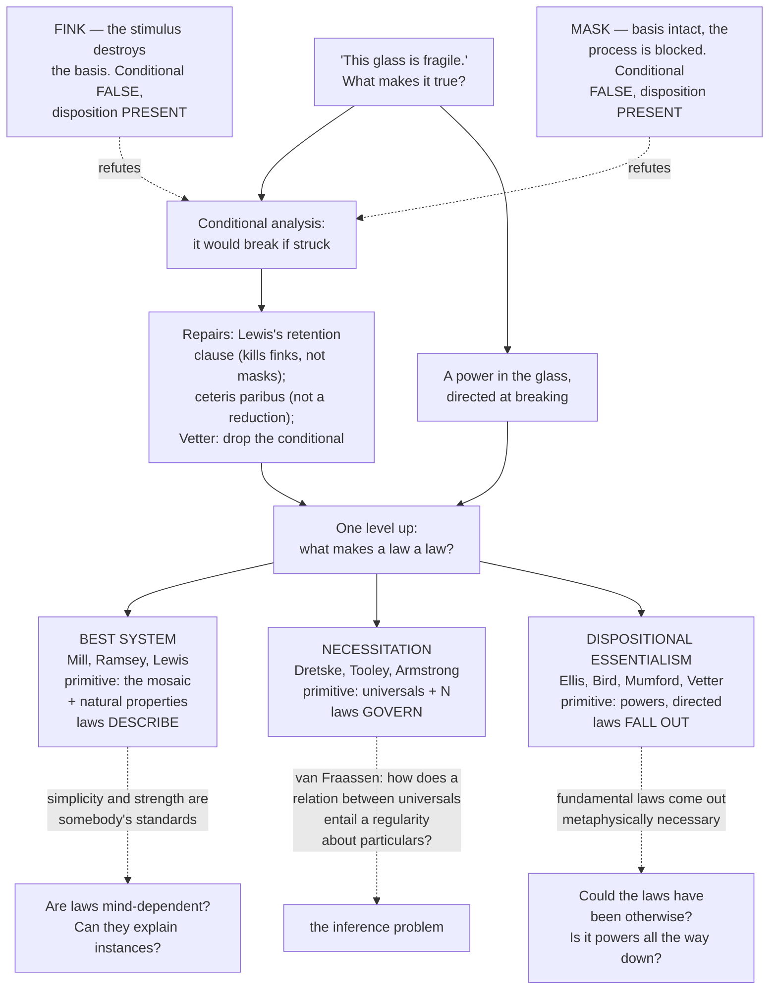

# Metaphysics · Lesson 4.3: Powers, dispositions, and laws

> ⏱ ~15 min · Module 4: Causation · Builds on: [4.2 Counterfactual causation](04-02-counterfactual-causation.md) · Unlocks: [4.4 Ordered causal series](04-04-ordered-causal-series.md)

## Why this matters

Two promissory notes come due. [4.1](04-01-humes-challenge-and-the-regularity-theory.md) left the regularity theory leaning its whole weight on the word *law-like* without saying what makes a regularity law-like; the Humean's answer is here, and so is the bill the anti-Humean presents. And [2.2](02-02-change-act-and-potency.md) left the conditional analysis of capacity — *x is fragile* means *x would break if struck* — standing, with a note that the counterexamples were coming. They are the sharpest thing in the module: two small, precisely statable cases that have kept the analysis under repair for thirty years.

The two debts are one debt, asked at two altitudes: whether "this glass is fragile" reports a power in the glass, and whether "like charges repel" reports something that *governs*. One answer gives a mosaic of qualities with patterns laid over it. The other gives properties that carry the modality themselves — in which case the boundary [3.1](03-01-kinds-of-necessity.md) drew between physical and metaphysical necessity is not a boundary at all.

## The idea

A **disposition** is a property an object has in virtue of which it *would* do something in *some* circumstance: fragile, soluble, elastic, magnetized, radioactive, irascible. Three parts, and it pays to keep them apart:

- the **bearer** — the glass;
- the **stimulus** (or triggering condition) — being struck;
- the **manifestation** — breaking.

Set against them are **categorical** properties: being cubical, having such-and-such crystal lattice, being 3 cm across. Roughly, a categorical property says how the thing *is*, a dispositional one what it *would do*. Nobody in this dispute denies that objects have dispositions; the fight is over what having one consists in.

The Humean answer is a reduction. Fragility is not an extra ingredient sitting in the glass alongside its lattice; there is the lattice (categorical, actual, local) and there is what would happen given the laws, and "fragile" reports the second. The **causal basis** of a disposition is whatever categorical property does the work — the lattice, the wiring, the isotope — and on this view the basis is real and the disposition is a shadow it casts through the laws.

The neo-Aristotelian answer is the reverse. Powers are basic furniture, and the fundamental ones have no categorical basis at all, because at that level there is nothing else for a property to be. Charge is not a quality that happens to attract; attracting is what charge *is*.

## The argument

### The conditional analysis, and its two counterexamples

**The conditional analysis (CA).** Generalizing from the fragility case:

> *x* is disposed to manifest **M** in response to stimulus **S** if and only if: were *x* to undergo **S**, *x* would **M**.

In words: to have a disposition is for a counterfactual to be true of you. Nothing more.

This is the Humean's reduction made explicit, which is why the counterexamples matter. If CA holds, the disposition adds nothing to the categorical facts plus the laws, since they settle the counterfactual. If CA fails, the Humean owes another reduction or the disposition is doing work of its own.

**Fink (C. B. Martin, "Dispositions and Conditionals").** A fink is a device or circumstance causally hooked to the *stimulus itself*, which removes the disposition's causal basis in the instant the stimulus occurs.

> *x* has the disposition to **M** on **S**, and the occurrence of **S** would itself cause *x* to lose the basis of that disposition, fast enough that **M** does not occur. **The conditional is false; the disposition is present.**

Martin's case: a wire is **live** just in case it is disposed to conduct current to any conductor touching it. Attach an *electro-fink*, a machine that senses an approaching conductor and switches the wire dead within the instant of contact. The wire is live right now — connected to the supply, basis intact — but it is false that *if a conductor touched it, current would flow*. CA says the wire is not live. CA is wrong.

Run the machine the other way and you get the **reverse-cycle fink**: a dead wire made live on contact. The conditional is true and the disposition absent, so CA wrongly ascribes it. The analysis fails in both directions, which rules out patching from one side.

**Mask, or antidote (Mark Johnston's "masking"; Alexander Bird's "antidotes").** A mask leaves the object completely untouched and interferes downstream, with the *process* that runs from stimulus to manifestation.

> *x* has the disposition to **M** on **S** and **retains its causal basis throughout**, but a further factor blocks the process between **S** and **M**, so **M** does not occur. **The conditional is false; the disposition is present and intact.**

The case: a fragile wine glass, carefully packed in styrofoam. Strike the package; the glass does not break, because the packing absorbs the energy. Nothing in the glass has changed — unpack it, tap it, and it shatters as it always would. It was fragile the whole time, and *if it were struck it would break* was false the whole time. Bird's version: a lethal poison, and a fast-acting antidote administered after ingestion blocks the mechanism. The poison keeps its lethality; nobody dies.

A fourth case runs the other way. A **mimic** (Johnston) lacks the disposition while something else produces the manifestation on cue — an inert ceramic bar rigged to a charge that ignites when a flame approaches.

| Case | Disposition present? | Basis retained through S? | Conditional true? | CA's verdict |
|---|---|---|---|---|
| **Fink** (removing) | yes | no — S destroys it | false | wrongly **denies** it |
| **Reverse-cycle fink** | no | — S creates it | true | wrongly **ascribes** it |
| **Mask / antidote** | yes | **yes** | false | wrongly **denies** it |
| **Mimic** | no | — | true | wrongly **ascribes** it |

**The one line to hold on to: a fink changes the object; a mask changes the circumstances.** That is the whole distinction, and it is what the repairs turn on.

**Repairs, and what they cost.**

1. **Lewis's reformed analysis** ("Finkish Dispositions"). Build the basis in and require that it survive: *x* is disposed to **M** on **S** just in case *x* has some intrinsic property **B** such that, if *x* underwent **S** and **retained B for long enough**, **S** together with **B** would cause *x* to **M**. The retention clause disarms both finks by construction, since a fink works precisely by destroying or installing **B**. Bird's objection: it does nothing against antidotes, because the packed glass retains its lattice and the poisoned patient the poison's chemistry. Masks are the residue.
2. **A ceteris paribus clause.** *x* would **M** if **S**, other things being equal. True — but the only accurate filling of the clause seems to be *unless something finks or masks it*, which uses dispositional vocabulary to analyse dispositions. The analysis survives as a truth and stops being a reduction, which is what the Humean wanted from it.
3. **Give up conditionals** (Barbara Vetter). Relocate the modality in the object: *x* has a graded **potentiality** to **M**, with no stimulus clause at all — "the glass can break" rather than "would break if struck." Masks and finks stop being counterexamples, since nothing was promised about any particular occasion. The price is that potentiality is primitive.

### One level up: what makes a law a law?

Same dispute, bigger stage. Three positions, each stated with what it takes as **primitive**, because that is where they really differ.

**1. The best-system account (Mill, Ramsey, Lewis).** Consider the deductive systems you could axiomatize the world's complete true description with. Some are simple and say little ("everything is self-identical"); some are strong and say everything, as a list with no structure. The **laws are the generalizations appearing as axioms or theorems in the true system that best balances simplicity and strength** — with a third criterion, *fit*, where the system assigns chances.

*Primitive:* the Humean mosaic — local, categorical, intrinsic qualities distributed across spacetime — plus, in Lewis's version, an objective distinction between natural and gerrymandered properties. Lawhood is a status a regularity earns. **Laws describe. Nothing governs.** This pays 4.1's debt exactly: a Manchester-to-London axiom could be deleted with no loss of strength, since the clock covers both, so it is no law.

*The standard objection: laws would depend on our standards.* Simplicity is relative to a vocabulary and strength to what is worth stating, and those are standards **someone** holds — which inverts the order of explanation, since planets orbited before anyone found anything simple. Lewis replies that natural properties fix a privileged vocabulary not of our choosing, and that if nature is kind one system wins by a wide enough margin that the standards decide nothing. The counter-reply: naturalness is a structural primitive imported quietly, and "if nature is kind" is a hope, not a theory. Armstrong adds that such a law **cannot explain its instances**, being constituted by them.

**2. Nomic necessitation — the DTA view (Dretske, Tooley, Armstrong).** A law is not a regularity at all. It is a state of affairs in which a second-order relation of **nomic necessitation**, $N$, holds between two universals: $N(F,G)$. The regularity follows from the law; it is not the law.

*Primitive:* universals (from [1.3](01-03-universals-the-realists-case.md)) and the relation $N$. Laws are **contingent** — $N(F,G)$ holds at some worlds and not others — but within a world they **govern**: every F is a G *because* $N(F,G)$ obtains. That buys both things the best-system account struggles for. Accidental regularities are excluded outright, since no relation between universals underwrites them, and laws explain their instances, being distinct from them.

*The standard objection: van Fraassen's inference problem.* $N(F,G)$ is a fact about two universals; $\forall x\,(Fx \to Gx)$ is a claim about every particular. How does the first entail the second? Armstrong answers that $N$ is a primitive relation whose obtaining just *is* a state of affairs from which the regularity follows — that is what makes it necessitation. Lewis's reply, paraphrased: you cannot name a relation "necessitation" and thereby confer on it the power the name describes. Bird adds a companion **identification** problem — the universals being bare quiddities, what makes $N$ the *nomic* relation rather than another second-order relation they stand in? — and that quidditism has its own price: the very same property could have been governed by entirely different laws, so a property's nature never tells you what it does.

**3. Dispositional essentialism (Ellis, Bird, Mumford, Vetter; Shoemaker is the ancestor).** The fundamental natural properties are **essentially powers**, individuated by what they dispose their bearers to do. Charge is not a quality that obeys Coulomb's law; being so disposed is what charge is. Then laws are not a further ingredient at all: **they are consequences of what the properties are.** Nothing has to be added to the world to make Fs be Gs, and nothing has to govern, because the property brought the law with it.

*Primitive:* the powers and their **directedness** — a power points beyond itself to a manifestation it may never produce, which George Molnar called *physical intentionality*. That is efficient causality with a whiff of finality (the power is *for* something): [2.2](02-02-change-act-and-potency.md)'s active potency in modern dress, and what makes [4.4](04-04-ordered-causal-series.md)'s per se ordering intelligible. Martin adds that manifestation is typically **mutual** — not a stimulus acting on a passive bearer but **reciprocal disposition partners** producing one manifestation jointly, salt's solubility and water's solvent power being one event described from two ends. Mumford and Anjum build causation itself from this: powers compose like vectors and **tend toward** their manifestations, so causation carries a modality stronger than pure contingency and weaker than necessity. Masking is their evidence — a power can be fully present, fully operative, and defeated.

*The headline consequence:* the **fundamental laws come out metaphysically necessary**, since a world where "charge" obeys an inverse-cube law does not contain charge. This is what [3.1](03-01-kinds-of-necessity.md) flagged: if it is right, the physical rung of the necessity ladder collapses into the metaphysical one and the boundary was an artifact. A second consequence: wherever masking is possible, the laws come out **ceteris paribus** rather than strict.

*The standard objections.* (a) **The laws seem contingent** — an inverse-cube world is conceivable, and modal intuition says the laws could have been otherwise. Bird accepts the cost and denies the intuition's authority, on 3.1's grounds: conceivability is a poor guide to possibility where essences are at stake. (b) **The regress.** If every property is a disposition to produce properties that are themselves only dispositions, nothing is ever actual — Armstrong's complaint that we are forever packing and never travelling. Bird's answer is structural: the graph of powers can be asymmetric and non-circular, so it is grounded with no member being categorical. Critics say a network of pure potency has still not reached an act. (c) **Mumford's internal challenge:** if powers do all the work, strictly there are **no laws**, only powers, with law-talk as a summary — the view may abolish lawhood rather than explain it.

## Map of positions

| | Best system | DTA necessitation | Dispositional essentialism |
|---|---|---|---|
| **Primitive** | local categorical facts; natural properties | universals; the relation $N$ | powers, individuated by manifestations |
| **A law is** | a generalization in the best systematization | a state of affairs $N(F,G)$ | a consequence of what properties are |
| **Laws…** | describe | govern | fall out |
| **Modal status** | contingent | contingent | fundamental ones necessary |
| **Explains its instances?** | no — constituted by them | yes, if the inference works | yes |
| **Standard objection** | depends on standards of simplicity | the inference problem | laws seem contingent; regress |

## Worked examples

**Example 1 (mechanical — sorting the interference).** A magnesium ribbon is **flammable**: disposed to ignite when a flame is applied. It sits in a laboratory cabinet fitted with a safety system. Three configurations of that system, three diagnoses.

1. **The system detects an approaching flame and floods the cabinet with argon in the same instant.** The ribbon does not ignite. A fink? No — ask the diagnostic question, *was the causal basis removed?* The basis is the ribbon's chemistry, and argon does not touch it; pull the ribbon out afterwards and it is as flammable as ever. The interference sits in the surroundings, between stimulus and manifestation. **Mask.** Note what this rules out: a clever device hooked to the stimulus does not make a case a fink. Only loss of the basis does.
2. **The system instead flash-passivates the ribbon with a dense oxide layer when a flame approaches.** Again no ignition — but the sample itself has been altered, and afterwards it is no longer flammable. The stimulus caused the loss of the basis. **Fink.**
3. **An inert ceramic bar in the same cabinet is rigged to a thermite charge that fires when a flame approaches.** The bar glows and burns. It is not flammable; something else produced the manifestation on the same cue. **Mimic.**

Score the analyses. CA calls the object in (1) and (2) not flammable and the bar in (3) flammable — wrong three times. Lewis's reformed analysis fixes (2) outright, since the passivation is exactly the loss of B that the retention clause excludes. It does not fix (1): the ribbon retains B through the argon flood and still does not ignite. That residue is why masking, not finking, is the live problem.

**Example 2 (where it strains — the sphere pair, then a thin world).** Two true universal generalizations:

> **(G)** Every gold sphere is less than a mile in diameter.
> **(U)** Every uranium-235 sphere is less than a mile in diameter.

Both are true; nobody thinks they have the same status. (U) is enforced — a sphere that size is many critical masses and cannot persist. (G) is an accident of how much gold there is and what anyone did with it. Each account marks the difference somewhere different.

- **Best system.** (U) is a theorem: it follows from the nuclear physics the system carries anyway, at no extra cost. (G) follows from nothing, and adding it as an axiom buys negligible strength for a real loss in simplicity. Verdict correct — and this is the note 4.1 promised would come due.
- **DTA.** Neither is itself a fundamental law; (U) is downstream of necessitation relations among the universals of nuclear physics, (G) of nothing. Verdict correct, with a wrinkle: most of what scientists call laws are laws only derivatively here, and the genuine ones are relations between fundamental universals we may never state.
- **Dispositional essentialism.** The relevant properties — the nucleus's instability, the neutron cross-section — *are* powers, and the mass limit follows from what they are. So (U) is not merely law-like but **metaphysically necessary**: a world where it fails is not a world containing U-235. (G) involves no powers; it is a fact about the arrangement.

Now the strain. Take a **thin world**: a single particle drifting uniformly, forever, and nothing else. What are its laws?

- **Best system:** the best systematization of that mosaic is something like "everything moves uniformly," so those are its laws. But it seems possible that a world governed by rich laws should contain almost nothing, so that the laws never get a chance to show. This account cannot allow that, because on it laws are answerable to how much actually happens — the mind-independence worry in its deepest form: laws hostage not to our standards but to the mosaic's generosity.
- **DTA** allows it straightforwardly, since $N(F,G)$ can obtain with almost no instances. But Armstrong holds that universals exist only as instantiated, so a law about uninstantiated universals is a law about nothing; he must deny such laws or buy transcendent universals, a cost [1.3](01-03-universals-the-realists-case.md) already priced.
- **Dispositional essentialism** allows it easily: properties carry their laws with them, so one charged particle brings all of electromagnetism. Its strain is elsewhere — masks make the generalizations powers underwrite non-strict. Bird replies that at the fundamental level there is nothing left to do the masking, so fundamental laws are strict and everything above is ceteris paribus by nature; Armstrong takes a similar exit with his own distinction between exceptionless laws and laws with exceptions, which tells you the difficulty is nobody's private property.

## Watch out

- **Fink versus mask, one test.** Did the *object* change? Stimulus removed or installed the basis: fink. Basis intact while something blocked the process: mask. A machine wired to the stimulus can do either, so the machine is not the diagnostic.
- **The conditional analysis is not the denial of dispositions.** It grants that the unstruck glass is fragile right now; it is a claim about the truthmaker, as [2.2](02-02-change-act-and-potency.md) put it. Refuting it does not establish powers, only that this reduction fails.
- **Masking is not "it turned out not to be fragile after all."** That reading makes the counterexample vanish by fiat and is the commonest way to miss the point. The packed glass has exactly the intrinsic properties the unpacked one has.
- **"Best system" does not mean "the system we would write."** It is the objectively best systematization, not scientific practice. The standards objection is not that scientists disagree; it is that simplicity and strength are defined only relative to a vocabulary, and a vocabulary is something a mind picks.
- **DTA's necessitation is contingent.** It necessitates the regularity *given that it obtains*, and whether it obtains is contingent. Reading $N$ as making the law metaphysically necessary conflates DTA with dispositional essentialism, which is where the two are opposed.
- **Dispositional essentialism makes only the fundamental laws necessary;** derived generalizations still depend on how things are arranged. Nor are laws thereby a priori — which properties exist is empirical, and 3.1's necessary a posteriori is the model.
- **"Powers are directed" is not "powers are conscious."** *Physical intentionality* borrows a term from philosophy of mind for a structural analogy: a power points at a manifestation the way a thought points at an object, without the manifestation ever having to occur.

## One-liner

> A fink takes the disposition away when you test it and a mask lets it survive being defeated — and one level up, the same choice returns as three answers about laws: the Humean's best summary of the mosaic, the necessitation relation added on top of it, and the powers that made it unnecessary to add anything.

## Problems

**P1 (🟢) *(Exegetical.)*** Three cases. For each, say whether it is a **fink**, a **mask/antidote**, a **mimic**, or none of these; say in one clause *why*, naming what happens to the causal basis; and say what the simple conditional analysis delivers as against the truth.

(a) A lithium cell is disposed to ignite when punctured. This one is submerged in an inert, non-conductive coolant that quenches the reaction the moment the casing is pierced; the cell's chemistry is unaltered and it ignites normally once drained and punctured on the bench.
(b) A superconducting coil carries current with zero resistance below its critical temperature. A monitoring circuit is set to inject a heat pulse the instant any measurement lead is attached, warming the coil above that temperature before any reading is taken.
(c) A wine glass is annealed rather than tempered and genuinely is fragile — disposed to break when struck a sharp blow. A curator lifts it, sets it down gently on a felt pad, and it does not break.

**P2 (🟡) *(Exegetical (a) · Evaluative (b).)*** An invented paragraph from a popular physics book:

> "It is tempting to think of the conservation of energy as a mere bookkeeping regularity — a tally that has always come out even. But the law is not a summary of what has happened; it is what *stops* the ledger from going out of balance. A hypothetical machine that produced energy from nothing is not merely unprecedented. It is forbidden, and it is forbidden by the same fact about the world that makes every past accounting come out even."

(a) Name the two distinct commitments the paragraph makes beyond a true universal generalization, quoting the words that carry each, and say which of the three accounts of law can take both at face value. (b) Pick the account you take to be strongest here and say what it must charge the paragraph for — what the author would have to give up, or pay for, to keep talking this way. **150 words or fewer for (b).**

**P3 (🔴, optional) *(Evaluative.)*** Van Fraassen's inference problem: from $N(F,G)$, a fact about two universals, how do we get $\forall x\,(Fx \to Gx)$, a fact about every particular?

Steelman Armstrong's reply in 100 words or fewer — the best version, not the sloganized one — then give the best response to it in 100 more. Your response must say what would count as *solving* the problem rather than restating it, and whether the dispositional essentialist faces a version of the same problem or genuinely escapes it. **200 words total.** Any verdict; the moves are what is graded.

Solutions

**P1** *(Exegetical — strict.)*

**Must hit, strict:**
- **(a) Mask (antidote).** The basis — the cell's chemistry and stored charge — is retained throughout; the coolant interferes with the *process* between puncture and ignition. The stated fact that it ignites normally once drained is the proof that the basis survived. CA says the cell is not disposed to ignite when punctured; the truth is that it is.
- **(b) Fink.** The stimulus (attaching the lead) itself causes the loss of the causal basis — the coil is warmed above its critical temperature, so the superconducting state, which *is* the basis, ceases to exist before manifestation. CA says the coil is not superconducting; the truth is that it is, until you test it.
- **(c) None of these.** The stimulus is a sharp blow, and no blow was struck. A disposition is neither masked nor finked by a stimulus that was never delivered: the conditional's antecedent simply failed, so CA delivers no verdict at all and is not embarrassed. Full credit requires saying that nothing interfered — the test was not run.

**Wrong turns:** calling (b) a mask because a device caused it — the device is not the test; ask about the basis. Calling (a) a fink because "the coolant stopped it" — the coolant never altered the cell. Calling (c) a mask on the grounds that "the felt pad masked the impact" — something that prevents the stimulus from occurring is not a mask; masking requires the stimulus to occur and the manifestation to be blocked downstream. (This is the commonest error of the three, and (c) is in the problem to catch it.)

---

**P2** *(a) exegetical — strict; (b) evaluative — any verdict.*

**Must hit, strict (a):** two commitments, and both quotations are required for full credit.
- **Governance:** "**it is what stops the ledger from going out of balance**" — the law does something, is prior to the instances, and constrains them. A regularity does not stop anything; it is the tally.
- **Modal force over the non-actual:** "**It is forbidden**" — a claim about a machine that has never existed and, the author says, could not. Universal generalizations about actual cases do not by themselves forbid anything.
- Also creditable, though secondary: "**by the same fact about the world that makes every past accounting come out even**" identifies the forbidding fact with the explaining fact, which is a claim that one thing does both jobs.
- **Which accounts take both at face value:** **DTA** and **dispositional essentialism** both can. DTA has a law distinct from and prior to its instances, which governs and excludes. Dispositional essentialism has the properties themselves excluding the machine — and more strongly, since on it the exclusion is metaphysically necessary rather than merely nomic. The **best-system account cannot take them at face value**: on it the law *is* the tally, promoted for its place in the best systematization, so "stops" and "forbidden" must be paraphrased away.

**Must hit, any verdict (b):** whichever account is chosen, name a specific cost, not a general unease.
- If **best system**: the charge is a paraphrase. "Forbidden" becomes "inconsistent with the best systematization of the actual mosaic," and "stops the ledger" becomes a description of what the ledger does. Then say what is lost — the author's asymmetry between law and instance — and whether the loss is bearable.
- If **DTA**: the account delivers governing and forbidding as advertised, but owes an account of how the second-order fact reaches particulars (P3's problem), and it delivers only nomic, not metaphysical, exclusion — the machine is forbidden here and permitted at worlds with other necessitation relations, which may be less than the author wants.
- If **dispositional essentialism**: it delivers the strongest reading of "forbidden," and the charge is the contingency of the laws — the author must accept that a world with a different conservation principle contains different properties rather than the same ones behaving differently.

**Wrong turns:** treating "stops" and "forbidden" as one commitment (they are separable: one is about explanatory priority, the other about modal reach over non-actual cases); saying the best-system account "cannot explain" conservation — it explains it as well as it explains anything, the dispute is over whether that kind of explanation is the kind the paragraph wants; arguing about whether energy is in fact conserved.

**Model answer (b), one of several:** The best-system account is strongest, and the charge is a paraphrase the author will not like. "Forbidden" survives as: no system that permitted the machine could be as simple and strong as the one that does not, so the machine's absence is not an accident to be recorded but a consequence of the system's axioms. That is enough to license the counterfactual and to explain why engineers stop looking. What does not survive is the asymmetry — the law does not stop anything, because the law is the balanced ledger under a description. The author wants the forbidding to be prior to the tally, and the Humean's whole position is that there is nothing for it to be prior to. If that asymmetry is indispensable, this account is refuted; if it is a manner of speaking, nothing has been lost.

---

**P3** *(Evaluative — any verdict; the moves are graded.)*

**Must hit:**
- **The steelman must not be "N is called necessitation."** The strong version: $N$ is a primitive relation, and primitives are not defined into their roles but posited for the work they do, exactly as the Humean posits natural properties or the counterfactual's similarity ordering. Armstrong's more specific move is that a law is a **state of affairs** — the universals are constituents of it, and particulars instantiating F are constituents of further states of affairs, so the entailment is not a bridge between two unrelated domains but a relation among states of affairs sharing constituents. Compare: nobody demands a proof that a whole's having a part entails the part's existing.
- **The response must say what a solution would be.** A solution shows the entailment from the theory's own resources without helping itself to it — i.e., derives $\forall x\,(Fx \to Gx)$ from the nature of $N$ rather than from its label. Lewis's charge is that no such derivation exists and that the theory has simply stipulated the transition; Armstrong's constituency story is a promising direction but must explain why *this* relation among universals reaches down when others (F and G's both being colour universals, say) do not.
- **Does dispositional essentialism escape?** Both answers pass if argued. **Yes:** there is no gap to cross, because the property is not a bare quiddity standing in an external relation — being disposed to G *is* what being F consists in, so a particular's being F already includes the disposition, and no second fact has to reach it. **No, only relocated:** the essentialist must still explain how an essence generates a true generalization over instances, and masking means the generalization is not strict, so what a particular F does is not settled by F's essence alone. Either verdict, if the reason is stated.

**Wrong turns:** presenting the steelman as "Armstrong stipulates it" and then knocking it over — the problem says *best version*; treating the inference problem as an objection to universals in general rather than to a second-order relation's reach; concluding that the problem shows laws must be Humean, which does not follow from either horn and is a verdict the rubric does not ask for.

**Model answer, one of several:** *Steelman.* $N$ is primitive, and every theory has primitives; the Humean's naturalness and similarity ordering are no better earned. More to the point, a law on Armstrong's view is a state of affairs having F and G as constituents, and the instances are states of affairs sharing those constituents. The entailment is internal to a single ontology of states of affairs, not a leap from one level to another. *Response.* Solving the problem means deriving the regularity from what $N$ *is*, not from what it is called, and the constituency story is a sketch of a derivation rather than one: it must say why necessitation reaches its instances when other second-order relations do not, and that looks like the original question. The dispositional essentialist has the better position here — with no external relation, there is no gap — but only partly, since masking leaves what any particular F does underdetermined by F's essence.

## Flashback

**F1 (🟡) *(Exegetical (a) · Evaluative (b).)*** From [4.1](04-01-humes-challenge-and-the-regularity-theory.md). A bakery's production log, three years long.

Every loaf baked on the Tuesday overnight shift comes out dense — no exceptions in three years. It is also true that a loaf comes out dense whenever the starter culture is under-active, the proof room runs below 22 degrees, and the baker does not extend the proof time to compensate. The Tuesday shift, as it happens, is the only one that draws from the older of the bakery's two starter cultures.

(a) Give a sufficient cluster of conditions for a dense loaf, name the conjunct that is the **INUS condition** we would cite as *the* cause, and state the **causal field**. Then say what the Tuesday regularity is an instance of among 4.1's four standard problems, and whether the INUS account by itself excludes it.
(b) A colleague proposes to exclude Tuesday by appeal to the best-system account taught in this lesson. Does that work here, and what does it assume? **120 words or fewer for (b).**

Solution

**Must hit, strict (a):**
- **A sufficient cluster:** *under-active starter* ∧ *proof room below 22 degrees* ∧ *no compensating extension of proof time* (∧ whatever the background requires — flour, yeast-viable dough, a working oven). It is **unnecessary**: over-kneading, or a dead oven-spring from another route, would also produce a dense loaf.
- **The INUS condition:** the **under-active starter**. It is insufficient alone (a warm room and a long proof rescue it) and non-redundant in the cluster (delete it and a cold room plus a short proof does not by itself give a dense loaf).
- **The causal field:** the bakery as it normally runs — the room's usual temperature band, the standard proof schedule, ordinary flour. That is why we cite the starter rather than the presence of flour or of yeast, both of which are equally non-redundant conjuncts.
- **Which problem:** the **accidental-regularity** problem, in its **common-cause** form. Tuesday and the dense loaf are both downstream of a third thing — the older culture, drawn only on that shift. Tuesday itself causes nothing.
- **Does INUS exclude it?** **No,** and saying so is required. *Tuesday shift* ∧ *the bakery operating* ∧ *the standard schedule* is a sufficient cluster by stipulation; it is unnecessary; Tuesday alone is insufficient; and delete Tuesday and the remainder does not suffice. So Tuesday is an INUS condition of the dense loaf, and Mackie's account as stated calls it a cause. This is the hooter over again in a new setting, which is exactly why 4.1 listed it among the two problems INUS does not fix.

**Must hit, any verdict (b):** state the best-system move precisely — a system carrying an axiom linking Tuesday to dense loaves could delete it with no loss of strength, since the axiom about under-active starter cultures already covers every case, so the Tuesday generalization is no law and supports no causal claim. Then name what it assumes: that simplicity and strength are settled objectively rather than by our choice of vocabulary (the standards objection), and, more locally, that the deletion test is run over the *whole* system rather than this log — in a world where Tuesday and the old culture were perfectly correlated forever, the Tuesday axiom and the culture axiom would be equally strong and the tie-breaker would have to come from elsewhere in the system. Either verdict passes if the move and the assumption are both stated.

**Wrong turns:** answering (a) with "Tuesday is not a cause because of correlation and causation," which is the verdict, not the analysis — the problem asks which of the four problems it instantiates and whether INUS excludes it, and the interesting answer is that it does not; treating the starter culture as the whole cluster rather than one conjunct; in (b), claiming the best-system account simply cannot handle common causes — it handles this one well, and the question is what it assumes in doing so.

## Connections

- **Backward:** [2.2](02-02-change-act-and-potency.md) introduced the conditional analysis of capacity and left the counterexamples for here; masking and finking are the bill it promised. [4.1](04-01-humes-challenge-and-the-regularity-theory.md) leaned on "law-like" without cashing it; the best-system account is the cash. [4.2](04-02-counterfactual-causation.md)'s similarity ordering among worlds is machinery a Humean must ground in the mosaic, and the powers theorist's alternative is on this page. [1.3](01-03-universals-the-realists-case.md) supplies the universals DTA needs, and [3.2](03-02-what-possible-worlds-are.md) supplies the modality a powers theorist wants to replace with potencies.
- **Forward:** [4.4](04-04-ordered-causal-series.md) takes directed powers and asks what ordering they impose on a causal series — per se versus per accidens, and the asymmetry 4.1's priority clause stipulated. The ceteris paribus character of powers-based laws also matters for how [5.4](05-04-endurance-perdurance-and-stages.md) treats intrinsic change.
- **Sideways:** [3.1](03-01-kinds-of-necessity.md) flagged the physical/metaphysical boundary as contested and named this lesson as the reason; if dispositional essentialism is right, the ladder has one rung fewer. Boss problem 2 of this course asks you to build a masking or finking counterexample against the conditional analysis and say whether the Humean can repair it; Boss problem 4 asks the powers theorist to diagnose a preemption case.
- **Ceded:** laws as they function in scientific practice — confirmation, explanation, induction, ceteris paribus laws in the special sciences — belong to [`philosophy-of-science`](../../philosophy-of-science/syllabus.md); this lesson takes only the metaphysics of what a law *is*. Symmetries, conservation principles and the laws of physics in particular are [`philosophy-of-physics`](../../philosophy-of-physics/syllabus.md)'s.
