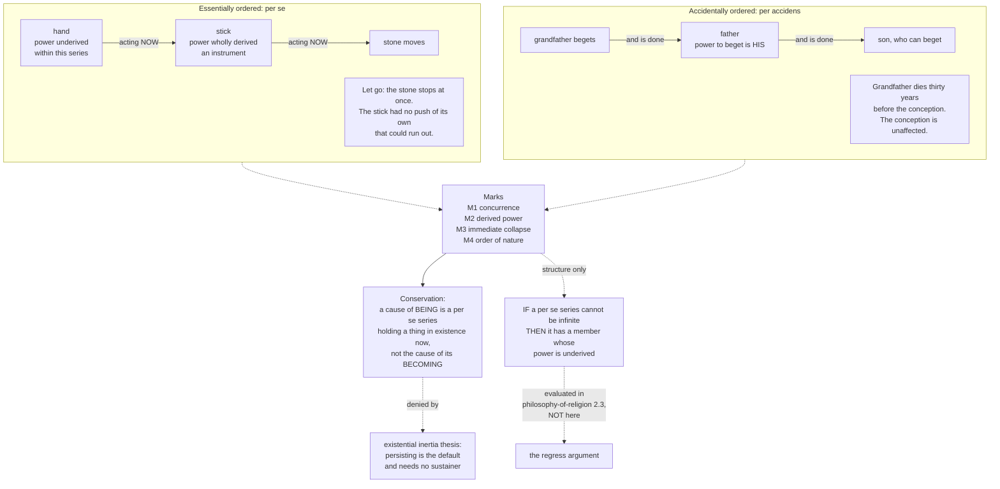

# Metaphysics · Lesson 4.4: Ordered causal series and conservation

> ⏱ ~15 min · Module 4: Causation · Builds on: [4.3 Powers, dispositions, and laws](04-03-powers-dispositions-and-laws.md) · Unlocks: [5.1 The A-theory and the B-theory](05-01-the-a-theory-and-the-b-theory.md)

## Why this matters

The module so far has asked what *one* causal relation is — a regularity, a counterfactual dependence, a power at work. This lesson asks a different question: what shapes can a *series* of causes have? The claim on the table is that chains of causes come in two structurally different kinds, and that the difference is not one of length, subject matter or grandeur but of where the causal power actually lives.

It matters for three reasons. It is the only place in the module where causal *structure* rather than the causal relation is the object of study, and structure is what the asymmetry problem from [4.1](04-01-humes-challenge-and-the-regularity-theory.md) was really about. It is the hinge on which a family of famous arguments turns, and you should see the hinge before anyone swings it. And it is the sharpest live test case for whether an old distinction survives modern physics.

**One thing this lesson does not do.** The distinction below is the engine of the *per se* regress argument — that an essentially ordered series cannot be infinite, so must have a first member with underived causal power, and that this first member must be such-and-such. **That argument is not run here and not evaluated here.** It belongs to [`philosophy-of-religion`](../../philosophy-of-religion/syllabus.md) 2.3, which takes this distinction as given and asks whether the argument built on it works; [`thomistic-synthesis`](../../thomistic-synthesis/syllabus.md) 3.2 and 5.1 take it into Aquinas's system. Our job is the machinery: what the two kinds of series are, what marks tell them apart, whether the marks mark anything real, and what *would* follow if a series of one kind could not regress.

## The idea

Put two series side by side.

**Series A.** A hand grips a stick; the stick pushes a stone across the ground. The stone moves because the stick pushes; the stick pushes because the hand moves it. Now ask: what is the stick contributing? Nothing of its own. It has no capacity to push stones that it exercises on its own account. It has a *borrowed* capacity, live only for exactly as long as the hand is gripping and moving. Let go and the stone stops — not eventually, not after the stick's own push runs out, but immediately, because there was never a push of the stick's own to run out.

**Series B.** A grandfather begets a father; the father begets a son. Here too each member owes something to the one before: the father would not exist but for the grandfather. But ask the same question — what is the father contributing? Everything. His power to beget is *his*. It was not lent to him and it is not held open by anyone. The grandfather may have been dead for thirty years when the son is conceived, and the conception is not affected in the slightest.

That is the whole distinction, and everything else is an attempt to state it precisely. Call Series A **essentially ordered**, or ordered *per se*; call Series B **accidentally ordered**, or ordered *per accidens*. The scholastic labels are unfortunate — "accidental" does not mean coincidental, and "essential" does not mean important. They mean: in Series A the order *among the causes* is essential to the causing, because each intermediate cause is causing *by* the earlier one's causing right now; in Series B the earlier cause is incidental to the later one's causing, having handed a power over rather than lending it.

The cleaner modern vocabulary, which most contemporary defenders now prefer, is **hierarchical** versus **linear**, or **synchronic** versus **diachronic** dependence. A *per se* series stacks, like a ladder standing on the ground: the causal work is done at every rung at once. A *per accidens* series strings out, like dominoes: each member does its work and is finished.

The stakes become visible the moment you notice that the two structures behave differently under the question "could this go on forever?" A line of dominoes stretching infinitely back is strange but not obviously incoherent — each domino is toppled by the one before, and nothing is left unexplained about any individual toppling. A hierarchy of borrowers is a different case: if every member is exercising a power it has only on loan, and there is no lender, then it is not clear anything is being lent. That is the intuition the regress argument tries to convert into a proof. Whether the conversion succeeds is [`philosophy-of-religion`](../../philosophy-of-religion/syllabus.md) 2.3's question. Whether the intuition even picks out a real distinction is ours.

## The argument

**Essentially ordered (per se) series.** A series of causes producing an effect *e* is essentially ordered when every member after the first exercises its causal power in producing *e* only in virtue of the member before it exercising its power at that very time.

In words: the middle members are instruments. Their causing is somebody else's causing running through them.

**Accidentally ordered (per accidens) series.** A series is accidentally ordered when each member exercises its own causal power in producing its effect, and its having that power is not sustained by the current activity of the member before it — though it may owe its existence, or its having acquired the power, to that earlier member.

In words: each member acts on its own account. The earlier member is part of the member's history, not part of its acting.

**The distinguishing marks.** Four tests are standardly offered. They are not independent, and which one is *fundamental* turns out to be the crux of the whole modern dispute.

| Mark | Essentially ordered | Accidentally ordered |
|---|---|---|
| **M1 — Concurrence** | Earlier members must still be acting while the effect is produced | Earlier members need not exist at all when the later cause acts |
| **M2 — Derived power** | Intermediate members exercise a power they do not have in their own right; they are instruments | Each member has its causal power underived from the one before, however it got it |
| **M3 — Immediate collapse** | Remove an earlier member *after* it has acted and the effect ceases at once | Remove an earlier member after it has acted and nothing follows for the effect |
| **M4 — Order of nature** (Scotus) | The higher cause is a cause of a different and more perfect kind, not another instance of the same kind | The members are typically of one kind — fathers begetting fathers |

Duns Scotus, in *De Primo Principio*, gives essentially the first three as joint conditions and adds M4, which is the one most often forgotten: in a *per se* series the members are not a row of equals but a hierarchy of kinds. The historical exegesis is [`ancient-medieval-philosophy`](../../ancient-medieval-philosophy/syllabus.md)'s; what matters here is that M4 makes the distinction harder to satisfy than the picture of hand-stick-stone suggests. Aquinas's version of the illustration is at *Summa Theologiae* I q.2 a.3, inside the First Way, where the staff is said to move only because it is moved by the hand; note that the illustration is doing work *in an argument we are not running*.

**The structural conditional.** Here is the part you should be able to state cold, without any commitment:

> **If** an essentially ordered series cannot have infinitely many members, **then** it has a first member, and that member's causal power is not derived from any prior member of the series.

In words: no lenders all the way down means somebody owns the money. The conditional is doing no work by itself — it is a piece of structure, not a conclusion, and its antecedent is exactly what is disputed. (The standard reply, that an infinite series of instruments might do collectively what no finite stretch does, is called the *infinite intermediaries* objection.) Nothing about what such a first member would be like follows from anything here. All of that — the antecedent's defence, the objections, and what a "first" gets you — is [`philosophy-of-religion`](../../philosophy-of-religion/syllabus.md) 2.3.

**Conservation: becoming versus being.** The second half of the lesson is a special case of the first. Distinguish two jobs a cause can have:

- A **cause of becoming** (*secundum fieri*) explains a thing's *coming to be*. The builder is the cause of the house's becoming. When the builder dies, the house stands.
- A **cause of being** (*secundum esse*) explains a thing's *continuing to be* at each moment it exists. The lamp is the cause of the lit room's being lit. Switch it off and the lighting stops now — a *per se* series with one intermediate step.

The **conservation claim** is that at least some things — on the strongest version, every contingent thing — require a cause of being and not merely a cause of becoming. Aquinas argues for it at *Summa Theologiae* I q.104 a.1, and uses exactly the builder and the illuminated air as his two examples. In premises:

> **C1.** That a thing began to exist at some earlier moment does not by itself entail that it exists now. "It was made" and "it is being sustained" are different claims.
> **C2.** For a thing whose essence does not include existing — where what it is and that it is come apart ([2.5](02-05-essence-and-existence.md)) — existing is not something it has of itself.
> **C3.** Whatever does not have existence of itself at a moment has it at that moment only if something is giving it existence then.
> **∴ C.** Such a thing's persisting is the standing effect of a cause of being, which the cause of its becoming need not be.

In words: if a thing does not hold itself in existence, something has to be holding it, and holding is a job done now rather than a job done once.

**C3 is the contested premise, and it is contested now, not only historically.** Its denial has a name: the **existential inertia thesis** — that continued existence is the default, that a thing persists unless something destroys it, and that persistence therefore requires no positive sustaining cause at all. Defenders of existential inertia (Beaudoin, Oppy, and at length Schmid) argue that the conservation claim treats persisting as an achievement when it is merely the absence of an event, and that C3 is a hidden appeal to the very framework it is supposed to establish. Defenders of conservation (Feser most prominently) reply that "default" is not a metaphysical category, that inertia in the physical sense is a state a thing has *by its nature* and so presupposes the nature's being actual, and that if essence and existence really come apart then nothing in a thing's essence can be doing the holding.

A **Humean** will say the dispute is malformed. On the mosaic, a thing's persisting is just the mosaic having a temporally extended patch; there is no ongoing act of existing that could need an agent, so the question "what keeps it in being?" has a false presupposition. Notice that this reply depends on views you have not taken yet: if eternalism is true ([5.2](05-02-presentism-growing-block-eternalism.md)) and things persist by having temporal parts ([5.4](05-04-endurance-perdurance-and-stages.md)), continuing to exist is not a process at all and the conservation question dissolves or relocates. A **Quinean** will ask which formulation our best theory quantifies over, and will be suspicious of "act of existing" as a posit no theory needs.

**Three contemporary challenges.** These are the live objections, and each has a real reply.

| Challenge | The objection | The standard reply |
|---|---|---|
| **Inertia** | *Omne quod movetur ab alio movetur* — whatever is moved is moved by another — is false as physics. A body in uniform motion needs no mover (Newton's first law); Kenny pressed this as fatal to the First Way's premise | The principle was never physics. Read "moved" as *reduced from potency to act*: it says any potentiality being actualized is actualized by something already actual. Uniform motion is then not a counterexample, because the coasting body's velocity is not a potency being actualized |
| **Simultaneity** | Simultaneity is frame-relative, and no influence outruns light, so "the whole series acts at once" is not a frame-invariant fact. Worse, the stick is not rigid: the push travels as a compression wave, so the stone moves microseconds *after* the hand | Two moves. (i) Contact causes are spatiotemporally coincident, and coincident events are simultaneous in every frame, so the marks do not need distant simultaneity. (ii) More radically: drop M1 as defining. The essential mark is M2, derived power, which is a dependence relation and need not be temporal at all |
| **Real category?** | Describe the stick microphysically and you get a linear chain of local interactions — molecule pushes molecule — which is *per accidens* in shape. The hierarchy, on this view, is an artefact of describing mid-sized artefacts with borrowed intentional vocabulary ("instrument") that fundamental physics has no use for | *Per se* order is not another causal chain laid alongside the first; it is synchronic ontological dependence, the same category grounding theorists study independently of Aristotle ([2.4](02-04-essence-and-grounding.md)). The claim is that the stick's *power to push* is grounded in the hand's acting, which no rearrangement of the microphysical chain either supplies or removes |

Feser, Koons and Oderberg each make some version of the "it was never physics" reply — Oderberg in a paper devoted to the principle, reading change throughout as the actualization of potency; Koons by recasting *per se* series as hierarchies of dependence. The honest scorecard: the reply defeats the crude version of the inertia objection, and the remaining dispute is whether the metaphysical reading still says anything falsifiable. That is P2's question.

## Argument map

## Worked examples

**Example 1 (clean — sorting one machine into both kinds).** A weight-driven tower clock. A descending weight turns a drum; the drum turns a gear train; the train turns the hands; an escapement releases the train tooth by tooth. A clockmaker built the whole thing in 1890 and has been dead since 1911.

Run the marks on the two series this object contains.

1. **Weight → drum → train → hands.** *M1:* the weight must still be descending while the hands move; stop it and the motion is not merely deprived of future input, it ceases. *M2:* the drum has no tendency to rotate of its own; its rotating is the weight's descent expressed in rotational form. Same for each gear. *M3:* remove the weight at 3:00 and the hands stop at 3:00 — not at 3:05 after the train's own impetus runs down. *M4:* the weight is a cause of a different kind from the gears, supplying the whole series' motive power rather than transmitting it. Verdict: **essentially ordered**, on all four marks.
2. **Clockmaker → clock → the time the clock shows.** *M1:* fails at once. The maker has been dead for over a century; the clock keeps time. *M2:* the clock's capacity to keep time is its own — it was given, not lent, and the giving was over in 1890. *M3:* the maker's removal in 1911 had no effect on the hands at all. Verdict: **accidentally ordered**.

Two lessons from one object. First, the same physical system contains both structures, so the distinction is not about *kinds of things* but about *how a given dependence runs*. Second, notice how much work M3 does in practice: it is the operational test, the one you can actually perform. It is not the *definition* — M3 follows from M1 and M2 together, and is evidence for them rather than a substitute. Treating it as the definition is the mistake P3 is about, and the clock shows why: the train has inertia and the gear teeth have backlash, so cutting the cable lets the hands creep for a fraction of a second. Strictly, M1 and M3 are false of the system as stated.

**Example 2 (where it strains — a probe, a stick, and what is left of the marks).** Two cases, pulling in opposite directions.

*The coasting probe.* A spacecraft burns its engine for ninety seconds and then coasts toward Jupiter for six years. During the burn there is a plausible *per se* series: combustion → thrust → acceleration, each stage's contribution live only while the one before is live. During the coast there is nothing of the kind. Newton's first law says a body in uniform motion continues without a mover — Buridan's impetus theory was already heading this way two centuries earlier — so the claim that *whatever is moved is moved by another*, read as a claim about local motion, is simply false, and Kenny concluded that the argument resting on it is unsound.

The neo-Aristotelian reply is not evasive, but it is a genuine reinterpretation, and you should see both halves. *The reply:* "motion" in the principle means any reduction of potency to act — a leaf turning brown, water warming — not displacement. Uniform velocity is not an actualization of anything; it is a state, and a state is not a change, so it falls outside the principle's scope. *The cost:* so read, the principle makes no prediction physics could falsify, and the critic's rejoinder is that immunity from physics was bought at the price of saying nothing about actual causal series either. Both halves are real; neither is decisive. This is an open dispute, and should be reported as one.

*The non-rigid stick.* Now the harder case, because it attacks the illustration itself. When your hand accelerates the stick, the far end does not move at the same instant — a compression wave crosses the stick at the speed of sound in wood, a few hundred microseconds. So M1, strict simultaneity, is false of the paradigm example of a *per se* series. And if you widen the picture to relativity, the trouble deepens: for events at spacelike separation there is no frame-invariant ordering, so "these two members are acting simultaneously" is not a fact about the world but a fact about a coordinate choice.

The reply has two stages, and the second is the one that matters. Stage one: at the *interface*, the hand's pushing the stick and the stick's being pushed are the same event at the same spacetime point, and coincident events are simultaneous in every frame — so the relativistic objection does not touch contact causation, only the picture of a long chain acting at a distance all at once. Stage two, the important one: **abandon M1 as constitutive and make M2 fundamental.** What makes the series essentially ordered is not that the members act at the same time but that the stick has no push of its own — that its causal power at each moment of the interaction is derivative. Understood that way, the microsecond lag is irrelevant: at each instant during the push, the stick is pushing only in virtue of being pushed, and the series is a hierarchy of dependence that happens to be spread over a few hundred microseconds rather than a hierarchy that is timeless.

That is, on its face, a good repair. It also has a price a critic will press: derived power is now doing all the work, and "derived" is not something you can read off a microphysical description. The Humean's challenge is exactly this — describe the stick as molecules pushing molecules and you have a linear chain of local interactions, each member as underived as any other, and the hierarchy has vanished into the vocabulary. The neo-Aristotelian answer is that derivation is a *grounding* relation, not a further causal link in the chain ([2.4](02-04-essence-and-grounding.md)), and that no amount of microphysical detail could either supply or remove a grounding relation, since grounding is not the kind of thing microphysics reports. Whether that is a rescue or a retreat is the live question — and it is the same crux as in [4.3](04-03-powers-dispositions-and-laws.md), where the Humean and the powers theorist disagreed about whether anything beyond the pattern is there to be found.

## Watch out

- **"Accidental" does not mean "coincidental."** A *per accidens* series can be perfectly lawful and utterly reliable — dominoes, a line of descent, a relay of messengers. The word marks how the causes are ordered with respect to one another, not how likely the sequence was.
- **The distinction is not about time, length, or simultaneity — it is about derived power.** M1 and M3 are diagnostics; M2 is the claim. This is the single most common misunderstanding, and it is also what makes the physics objections land or miss. If you find yourself saying "a *per se* series is one where everything happens at once," you have swapped a symptom for the disease.
- **One object can be the site of both orders at once.** The clockmaker and the weight stand in different relations to the same hands. Ask "which dependence?" before "which kind of series?"
- **A *per se* series need not be long or exotic.** Hand, stick, stone is three members. Most examples people reach for are two.
- **Do not confuse "cause of being" with "cause that came later."** The conservation claim is not that something re-creates the thing at each instant in a series of fresh acts (that is *occasionalism*, a distinct and stronger view). It is that one standing act of causing is going on throughout, in the way the lamp's lighting goes on throughout.
- **The regress premise is not part of the distinction.** You can accept that the two kinds of series are genuinely different and still deny that *per se* series need a first member — the infinite-intermediaries reply is exactly that combination. Keep the taxonomy and the argument apart; running them together is the error [`philosophy-of-religion`](../../philosophy-of-religion/syllabus.md) 2.3 is built to catch.
- **"Physics refuted this" and "physics is irrelevant to this" are both too quick.** The first ignores the potency-act reading; the second owes an account of why a thesis about causal structure never touches the sciences of causal structure. Hold both halves.

## One-liner

> A series is essentially ordered when its middle members are borrowers — pushing only while something else is pushing through them — and accidentally ordered when each member owns what it has; conservation is the claim that a thing's continuing to exist is the first kind of series, not a leftover from the second.

## Problems

**P1 (🟢) *(Exegetical.)*** For each of the three series below, say whether it is essentially or accidentally ordered, name the mark that decides it, and say in one clause what the middle member contributes.

(i) A magnet is stuck to a fridge door; a paperclip hangs from the magnet; a second paperclip hangs from the first.
(ii) A teacher taught a student, who years later teaches a student of her own.
(iii) An engine turns an alternator, which charges a battery, which lights a headlamp.

One of the three is not clean. Say which, and say what extra fact would settle it.

**P2 (🟡) *(Exegetical (a) · Evaluative (b).)*** An invented paragraph from a popular-science column:

> "The old schoolmen thought a moving thing needs something to keep it moving — every motion traced back to a mover currently doing the moving. Galileo and Newton put that to bed: a puck on frictionless ice coasts forever, moved by nothing at all. Physics has no place for sustainers. So the related idea — that a thing needs something to hold it in existence from moment to moment — goes the same way. Things simply keep going, in motion and in being alike, and nothing has to be doing anything about it."

(a) Name the two distinct claims the paragraph runs together, and identify the step where the argument moves from one to the other without support. Quote the words that carry the move. (b) The columnist could reply that the metaphysical reading of the old principle is a retreat: a version immunized against every experiment, and so idle. Is that a fair charge? **150 words or fewer for (b).**

**P3 (🔴, optional) *(Evaluative.)*** The stick is not rigid, so the stone moves a few hundred microseconds after the hand. A critic concludes that the paradigm case of an essentially ordered series fails mark M1, and that the category is a picture rather than a structure.

Say which mark you would make fundamental in response, state what that costs, and name the crux — the single thing a defender and a critic must disagree about for the dispute to survive the repair. **150 words or fewer.** Any verdict; the crux is what is graded.

Solutions

**P1** *(Exegetical — strict.)*

**Must hit, strict:**
- **(i) Essentially ordered.** Decided by **M3** (or M1): remove the magnet and the second paperclip does not hang there for a while and then drop — both fall at once. The middle member (the first paperclip) contributes no holding power of its own; it holds the second only in virtue of being held. Note this series involves no temporal succession at all, which is a useful corrective to the "causes come first" habit from [4.1](04-01-humes-challenge-and-the-regularity-theory.md).
- **(ii) Accidentally ordered.** Decided by **M2**: the student's power to teach is her own, not lent. The first teacher may be dead. The middle member contributes everything to her own teaching, and owes the earlier teacher only her having acquired the capacity.
- **(iii) The unclean one.** While the engine runs, engine → alternator → charging is essentially ordered (the alternator generates nothing on its own account). But battery → headlamp is not obviously in the same series as the engine, because the battery stores charge: kill the engine and the headlamp stays lit. **What settles it:** whether the lamp is drawing from stored charge or from the alternator's current output. If the battery is a buffer that is genuinely powering the lamp, the engine is a cause of the lamp's *becoming* lit and the series is accidentally ordered from the battery back; if the alternator is supplying the lamp directly and the battery is idle, the whole run is essentially ordered and the lamp dies with the engine. Credit requires naming the stored-charge fact, not just saying "it depends."

**Wrong turns:** calling (i) accidentally ordered because nothing is moving — *per se* order does not require motion or change, only derived power; calling (ii) essentially ordered because "the teaching tradition would collapse without the first teacher" — that is a claim about the series' history, which is what *per accidens* order is; deciding (iii) by whether the events are simultaneous rather than by where the power is stored.

---

**P2** *(a) exegetical — strict; (b) evaluative — any verdict.*

**Must hit, strict (a):** the two claims are (1) **whatever is in motion is moved by another** — a claim about change, which Newton's first law does bear on when "motion" is read as local motion; and (2) **whatever does not exist of itself is being held in existence by another** — the conservation claim, which is about existing, not moving. The unsupported step is **"So the related idea … goes the same way"**: relatedness is asserted and no bridge is given. Full credit needs the quoted words (or "goes the same way" / "in motion and in being alike") and the observation that no experiment about coasting pucks bears on whether existing needs a sustainer, because a coasting puck is not thereby shown to be self-existent — it is shown to need no *mover*. A further strict point available for full marks: the paragraph also assumes the medieval principle was a claim of physics, which is precisely the reading its defenders reject.

**Must hit, any verdict (b):** state the charge precisely — a principle that no physical result could disconfirm earns nothing from physics and may be empty. Then test it. The moves either side must make: say whether the potency-act reading has *any* consequences (for instance, it implies that no potentiality actualizes itself, which rules out uncaused changes and is not trivially true), and say whether unfalsifiability-by-experiment is a defect in a claim that was never offered as an empirical generalization — noting that plenty of metaphysical theses in this course, the Humean supervenience thesis included, are in the same position. Either verdict passes if the charge is stated in its strong form and then tested rather than waved off.

**Wrong turns:** answering (a) by saying the column is "wrong about Newton" — it is not; the physics is right and the inference is the problem. Treating the potency-act reading as obviously a dodge without stating what it claims. Arguing about whether anything actually does sustain things in being; the question is about the structure of the inference.

**Model answer (b), one of several:** The charge is fair as a demand and premature as a verdict. It is fair because the reinterpretation does purchase immunity: once "moved" means "reduced from potency to act," no result about coasting pucks can bear on it, and a defender who first advertised the principle with mechanical examples owes an account of what it now rules out. It is premature because the reading is not contentless. It says no potentiality actualizes itself, which forbids uncaused changes and does real work against, say, a brute-fact account of quantum transitions. And the standard of falsifiability-by-experiment would also retire Humean supervenience and the mosaic, which nobody proposes to test. The genuine question is narrower: whether "actualization of potency" can be specified without the mechanical examples that motivated it. That is where the argument should be had.

---

**P3** *(Evaluative — any verdict; the crux is what is graded.)*

**Must hit:**
- **Choose M2 and say why.** Derived power is the only mark that states the claim rather than a symptom. M1 (concurrence) and M3 (immediate collapse) are consequences of M2 in the clean cases and diagnostics elsewhere; M4 concerns the members' natures. With M2 fundamental, the microsecond lag is harmless: at every instant during the push, the stick pushes only in virtue of being pushed, so the hierarchy holds instant by instant even though it is spread over time. (A defensible alternative: keep M1 but restate it as coincidence at the causal *interface*, since coincident events are simultaneous in every frame. Full credit either way if the reasoning is given.)
- **Name the cost.** M2 is not observable. M3 is a test you can perform — cut the cable and watch. "The stick's power is derived" cannot be read off any microphysical description of molecules pushing molecules, so the repair trades an operational criterion for a metaphysical one, and the critic's "picture, not structure" charge survives the repair intact rather than being answered by it.
- **Name the crux.** Whether there are synchronic dependence relations — grounding, ontological dependence — over and above the totality of local causal interactions. Neo-Aristotelian: yes, and derived power is one of them, which is why no rearrangement of the microphysical chain settles the question. Humean: no, or none the mosaic does not already contain, in which case "derived" is a way of describing a chain rather than a feature of it. Answers that stop at "the lag doesn't matter" without locating the disagreement get half credit.

**Wrong turns:** defending M1 by insisting the lag is negligible — magnitude is irrelevant if simultaneity is constitutive, and the critic's point is structural. Concluding that relativity refutes the distinction outright: it bears on distant simultaneity, not on contact causation, whose events are coincident. Sliding into the regress argument; nothing here is about whether such a series has a first member, which is [`philosophy-of-religion`](../../philosophy-of-religion/syllabus.md) 2.3's question.

**Model answer, one of several:** Make M2 fundamental. The claim was never that the members act at one instant; it was that the intermediate members have no causal power of their own. During every microsecond of the push the stick pushes only in virtue of being pushed, so the hierarchy is preserved even though the wave takes time to cross. The cost is real: M3 was the mark you could test, and M2 is not testable in that way, so the category now rests on a dependence relation no physical description reports. That is where the disagreement actually lies. The defender holds that synchronic ontological dependence is a genuine relation, distinct from the causal chain and not exhausted by it; the critic holds that once every local interaction is described, nothing is left over for "derived" to name. Settle that and the rest follows.

## Flashback

**F1 (🟡) *(Exegetical (a) · Evaluative (b).)*** From [4.2](04-02-counterfactual-causation.md). At 02:00 a squirrel shorts a hospital's utility feed. The short trips the automatic transfer switch; the switch starts the backup generator; the generator powers a patient's ventilator, which runs without interruption through the night.

(a) Lewis's analysis makes *c* a cause of *e* when there is a chain of stepwise counterfactual dependence running from *c* to *e*. Check each link in this case, and state the verdict the analysis delivers about the squirrel and the ventilator's running at 02:05. (b) The verdict is uncomfortable. Does the case show that causation is not transitive, or is the verdict acceptable once properly understood? Say what dropping transitivity would cost the analysis. **150 words or fewer for (b).**

Solution

**Must hit, strict (a):** the links, each checked as a counterfactual between distinct actual events. Had the squirrel not shorted the feed, the transfer switch would not have tripped — holds. Had the switch not tripped, the generator would not have started — holds. Had the generator not started, the ventilator would not have been running at 02:05 — holds, given that the utility feed was already down. Each step is a genuine counterfactual dependence, so the ancestral relation runs the whole way, and the analysis delivers: **the squirrel caused the ventilator to be running at 02:05.** The verdict must be stated as the analysis's, not as the student's. Naming the structure is worth extra credit: this is a *short circuit* or double-prevention shape — the squirrel initiates a threat and also, through the same chain, initiates its removal.

**Must hit, any verdict (b):** identify the awkwardness precisely — the ventilator was running before 02:00 and the squirrel did nothing that made the running more likely; it threatened it and the threat was neutralized. Then note what transitivity was *for*: Lewis introduced the chain-of-dependence step to handle cases where the effect does not depend directly on the cause but does so through intermediaries, which is what rescues the analysis in preemption cases. Dropping transitivity therefore costs the analysis those cases and requires a replacement. Either verdict passes: accept the verdict and explain it away (the analysis tracks causal history, not benefit, and "the squirrel caused the ventilator to run on generator power" is defensible), or reject it and say what replaces transitivity.

**Wrong turns:** reporting a verdict about whether the squirrel *should* be blamed — the analysis is not a theory of responsibility, and moral discomfort is not a counterexample. Claiming the last link fails because "the ventilator would have run anyway" — it would not have, once the feed was down; the counterfactual must be evaluated holding the actual circumstances fixed, and forgetting this is the standard error. Treating the case as ordinary preemption; nothing here is a backup *cause* competing to produce the effect.

**Model answer (b), one of several:** The verdict is acceptable once read as a claim about causal history rather than benefit. What the chain establishes is that the squirrel caused the ventilator to be running *on generator power* at 02:05, and that is true. The discomfort comes from hearing "caused it to be running" as "is why it was still running," which imports a contrast the analysis does not make. Dropping transitivity would be expensive: the chain-of-dependence step is what lets the analysis reach effects that do not depend directly on their causes, and it is what saves the analysis in preemption. A theory that abandons it needs another route to those cases. Better to keep transitivity and accept that causal claims in ordinary speech carry contrastive freight — "rather than what?" — that the bare analysis was never trying to capture.

## Connections

- **Backward:** [4.1](04-01-humes-challenge-and-the-regularity-theory.md) left causal asymmetry stipulated by the priority clause, and noted that the stipulation forecloses simultaneous causation; this lesson is the case for taking simultaneous and hierarchical causation seriously, and the reason the foreclosure was not free. [4.3](04-03-powers-dispositions-and-laws.md) supplies the notion of a power doing work now, without which "derived power" has nothing to be derived from — the crux in P3 is the same crux as there. [2.5](02-05-essence-and-existence.md) supplies the distinction between essence and existence that premise C2 of the conservation argument needs; [2.4](02-04-essence-and-grounding.md) supplies grounding, which is the modern home of *per se* order. [2.2](02-02-change-act-and-potency.md) supplies act and potency, without which the reply to the inertia objection cannot even be stated.
- **Forward:** [5.2](05-02-presentism-growing-block-eternalism.md) and [5.4](05-04-endurance-perdurance-and-stages.md) decide whether "continuing to exist" is a process that could need a cause or an artefact of tensed description — the conservation dispute is partly hostage to them.
- **Downstream courses:** [`philosophy-of-religion`](../../philosophy-of-religion/syllabus.md) 2.3 takes this distinction as given and runs and evaluates the *per se* regress argument, including the infinite-intermediaries reply and what a "first member" would have to be. [`thomistic-synthesis`](../../thomistic-synthesis/syllabus.md) 3.2 reads the First and Second Ways with *per se* order assumed from here, and 5.1 takes the becoming/being distinction into creation and conservation. Neither should re-teach what is above; both should link to it.
- **Sideways:** the physics of inertia and of the relativity of simultaneity belong to [`relativity`](../../relativity/syllabus.md) and `philosophy-of-physics`; here they appear only as objections, and their strength is assumed from those courses rather than argued. The historical Aristotle, Scotus and Aquinas belong to [`ancient-medieval-philosophy`](../../ancient-medieval-philosophy/syllabus.md); this lesson takes the positions as live ones.
- **Boss problem 4** closes with exactly this distinction, part (d): explain the difference in order between the hand-stick-stone series and a line of fathers, then say whether a regularity theory has the resources to mark it. Everything you need is above; the answer to the second half is not.
