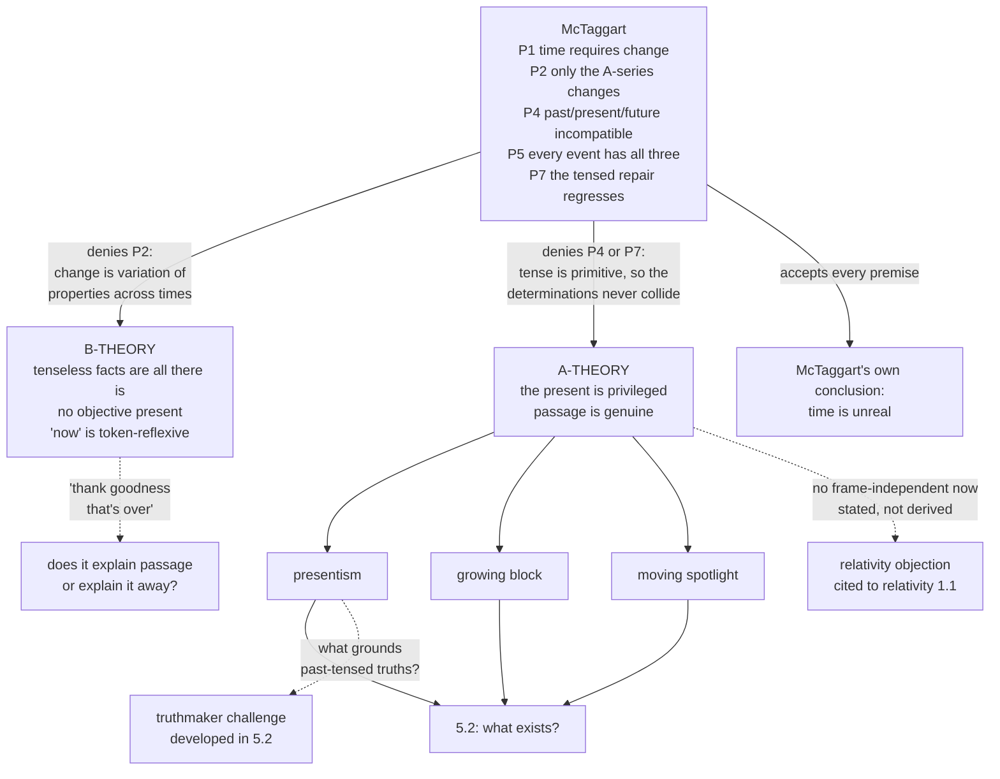

# Metaphysics · Lesson 5.1: The A-theory and the B-theory

> ⏱ ~15 min · Module 5: Time and persistence · Builds on: [4.4 Ordered causal series](04-04-ordered-causal-series.md) · Unlocks: [5.2 Presentism, the growing block, and eternalism](05-02-presentism-growing-block-eternalism.md)

## Why this matters

Everyone has the intuition that time *moves*: the future is coming, the present is where things happen, and what is happening now will shortly have happened. Almost nothing else in metaphysics feels this obvious. And there is a short argument, published in 1908, that the obvious picture is not merely false but **contradictory** — and that when you state the repair, you generate an infinite regress in which the contradiction is never removed, only postponed.

Nearly no one accepts McTaggart's conclusion that time is unreal. Nearly everyone accepts that his argument forces a choice, and the two live theories of time are the two ways of refusing it. Deny that change needs a moving present and you are a B-theorist; keep the moving present and block the regress and you are an A-theorist. [5.2](05-02-presentism-growing-block-eternalism.md) then asks what each side says *exists*, and [5.4](05-04-endurance-perdurance-and-stages.md) how a thing gets from one time to another in one piece.

## The idea

McTaggart's first move is a distinction, and it is worth more than the argument built on it. Positions in time — moments, and the events at them — can be ordered in two entirely different ways.

**The B-series** orders them by **earlier than**, **simultaneous with** and **later than**. Hastings is earlier than the Great Fire of London; that relation holds, has always held, and will always hold, whenever you ask.

**The A-series** orders them as **past**, **present** and **future**, with degrees: the far past, the near past, the present, the near future. The Great Fire is past. It has not always been past — it was once future — and you cannot read its pastness off a timetable without knowing when you are reading.

Same events, two kinds of fact about them, and the distinction is sharp:

| | B-series | A-series |
|---|---|---|
| Relations | earlier / simultaneous / later | past / present / future |
| Do the facts change? | No — fixed for all time | Yes — every event's A-position shifts |
| Perspective-dependent? | No | Apparently yes: which events are past depends on *when* |
| Direction? | Ordering only, no flow | Built-in flow, from future through present into past |

Now the observation that makes the distinction load-bearing — McTaggart's own example, the death of Queen Anne. Ask what about that event has ever changed. Not that it was a death, not that it was the death of Anne Stuart, not its causes or effects; and not a single B-relation, since it was, is and always will be later than her coronation. Exactly one thing has changed: it was once far in the future, then near, then present, and it has been receding into the past ever since.

So if there is any change *at all*, McTaggart says, it is A-series change. And time without change is not time. That is the pressure point, and the argument squeezes it.

## Source

McTaggart names the two series in "The Unreality of Time" (*Mind*, 1908) in a sentence worth having verbatim:

> "For the sake of brevity I shall speak of the series of positions running from the far past through the near past to the present, and then from the present through the near future to the far future, as the A series. The series of positions which runs from earlier to later I shall call the B series."

The labels are deliberately colourless — neither says which series is more fundamental — and the asymmetry they cover is what the contradiction exploits: A-determinations are *monadic* characteristics an event simply has, B-positions are *relations* between events.

The contradiction itself is stated compactly:

> "Past, present, and future are incompatible determinations. Every event must be one or the other, but no event can be more than one."

The other half McTaggart spells out at length: every event nevertheless has all three. If an event is past, it *has been* present and *has been* future; if present, it *has been* future and *will be* past; if future, it *will be* present and *will be* past. Nothing escapes. He also notes, drily, that the difficulty is hard even to state without seeming to answer it, since English has a verb form for each of the three and none neutral among them. That is the hinge: the reply everyone reaches for is already written into the grammar, and the question is whether the grammar is a solution or a disguise.

## The argument

**McTaggart's argument, in premises.**

> **P1.** Time essentially involves change: a series of positions with no change in it is not a temporal series at all.
> *In words: if nothing ever changed, nothing would be happening, and there would be no time for it to happen in.*
>
> **P2.** The B-series cannot supply change. Every B-fact is permanent — "Hastings is earlier than the Fire" was true, is true, and always will be true — and an event's intrinsic characteristics do not change either. The only respect in which anything varies is its position in the A-series.
> *In words: on a fixed map of earlier-and-later, nothing ever happens; the map just sits there.*
>
> **P3.** So the reality of time requires the reality of the A-series. *(From P1, P2.)*
>
> **P4.** Past, present and future are mutually incompatible determinations: nothing can have two of them.
>
> **P5.** Every event has all three.
>
> **P6.** So the A-series is contradictory — unless P4 and P5 can be reconciled.
>
> **P7.** The reconciliation on offer is that the determinations are had *successively*, at different times. But stating that requires attributing A-determinations to those times, which are themselves past, present and future; so the reconciliation reproduces the very problem it was called in to solve, at the next level up, and at every level after that. The contradiction is never dissolved, only deferred.
>
> **∴ C.** The A-series is contradictory; by P3, time is unreal.

P7 is the centrepiece, and Example 1 walks its ladder on a concrete case — run it there before going on. The move it turns on: once you relativize the determinations to moments, those moments have to be picked out *tensedly*, on pain of collapsing into a B-series in which nothing happens; and moments picked out tensedly are themselves past, present and future, so one contradiction has become three.

**Why this regress is vicious, precisely.** Not because it is infinite — plenty of infinite series are harmless (that *p* is true, that it is true that *p* is true, and so on, costs nothing). Two distinct reasons, easy to run together:

- **The debt is never discharged.** A benign regress has each stage complete in itself, with the next an idle consequence. Here each stage contains the original contradiction and is made consistent only by the next, which is in the same condition.
- **The circularity.** Explaining how a moment can be past, present and future assumes a series of moments that are already past, present and future. McTaggart's charge is that the account presupposes time in explaining how moments stand in time.

Anyone who wants time to be real must reject a premise, and there are exactly two good places to do it.

**The B-THEORY** rejects **P2**. There is no A-series in reality and none is needed, because change was never A-series change: to change is to have one property at one time and a different one at a later time — the poker is hot at noon and cold at one o'clock, and that *is* the change, stated tenselessly. Reality is a four-dimensional manifold of events in earlier-than relations, with no objective present and no passage. Its commitments:

> **Tenseless facts are all the facts.** There is no fact of the matter, over and above the B-relations, as to which time is *the* present one. "Now" is not a name for a privileged moment; every moment is "now" relative to itself.
>
> **Tensed talk gets token-reflexive truth conditions.** A particular utterance or thought — a *token* — of "The meeting is happening now" is true if and only if the meeting occurs at the time of that very token. "Now", "today" and the tenses are indexicals, like "here" and "I": their reference is fixed by the circumstances of the token, and no eternal fact is needed to settle it.

The second thesis is where the modern B-theory differs from its older form. The **old** version claimed tensed sentences could be *translated* into tenseless ones, and failed: "The meeting is now" and "The meeting is simultaneous with this utterance" are not synonymous, since they differ in what they tell you and what you can do with them. The **new** version (Smart, Mellor) concedes the translation and keeps the metaphysics — tensed sentences are ineliminable from thought and speech and have *tenseless truth conditions*. Tense is real in language and in belief; it is not an extra layer of fact in the world.

**The A-THEORY** rejects **P4**, or **P7**, or both. Tense is a real and irreducible feature of reality, not of our representations of it. Its commitments:

> **The present is metaphysically privileged.** One time is objectively present, and which one it is is not a matter of perspective. This is a claim about the world, not about where any speaker happens to stand.
>
> **Passage is genuine.** Events really do become present and then recede. Something changes that is not captured by any collection of B-facts, however complete.

Its answer to the regress is usually **primitivism about tense** (Prior's line): P7's opening move, converting tensed verbs into predications-at-moments, is simply refused. "E is present, was future, will be past" is not shorthand for anything; the tense operators *it was the case that* and *it will be the case that* are primitive, and the sentence is complete as it stands. P4 and P5 are then both true and never collide, because "E is past" and "E was present" are not two attributions of incompatible properties to one thing at one time — the second is not an attribution to a present E at all. No regress starts, because there is no first step into it. McTaggart's heirs answer that this is a refusal, not an explanation: it declares the incompatibility harmless without saying what makes it harmless, and still owes an account of what *changes* when an event's tense changes, given that no B-fact does.

A-theories then divide by **what exists**, which is [5.2](05-02-presentism-growing-block-eternalism.md)'s question: **presentism** (only present things exist), the **growing block** (past and present exist, the future does not, and the block grows), and the **moving spotlight** (all times exist, as the B-theorist says, but one is objectively lit, and the light moves). Note the spotlight — it shows the A-theory is not the same claim as presentism, the commonest conflation in this area.

**Two standing pressures on the A-theory,** named here and developed elsewhere.

- **The truthmaker challenge.** What makes "Queen Anne died in 1714" true *now*? Truth is naturally taken to be grounded in what there is; but if only present things exist, there is no Anne and no dying to do the grounding. This bites on the **presentist** version specifically — a moving-spotlight A-theorist has all the times and truthmakers to spare — and the presentist's answers are [5.2](05-02-presentism-growing-block-eternalism.md)'s to develop.
- **The relativity objection.** Special relativity makes simultaneity frame-relative: for two spacelike-separated events, whether they happen at the same time depends on the inertial frame, and no frame is physically privileged — so an objective, frame-independent present has no obvious place in the physics. **Stated here, not derived:** the physics is [`relativity`](../../relativity/syllabus.md) 1.1, the weighing is `philosophy-of-physics`. Carry away the shape of the replies — a privileged frame undetectable in principle, or presentness relativized to frames at the cost of what made it privileged.

## Map of positions

## Worked examples

**Example 1 (mechanical — running the regress on one bell).** A church bell rings at noon. It is now 12:05. Take E = *the bell's ringing*, and walk the ladder.

**Level 0 — the collision.** E is past (it happened five minutes ago). E was present (at noon). E was future (at 11:00). Past, present and future exclude one another, and E has all three.

**Level 1 — the repair.** Relativize: E is future at 11:00, present at 12:00, past at 12:05. Read those "at"s tenselessly — *later than 11:00*, *simultaneous with 12:00*, *earlier than 12:05* — and the contradiction vanishes instantly and completely. But look what bought it: three B-relations and no passage. Nothing in that triple distinguishes 12:05 from any other moment or says the ringing is *over*. The A-theorist cannot take this repair, because P2 said A-facts are the only changing ones and this repair has none left in it.

So the "at"s must be tensed: E is future **at a past moment**, present **at a past moment**, past **at the present moment**.

**Level 2 — the problem comes back.** Look at 12:00, the moment doing the work in "E is present at 12:00." Is it past, present or future? All three: past now, present at noon, future at 11:00. The very moment invoked to remove E's contradiction has the identical contradiction, and so do 11:00 and 12:05. One contradiction has become three.

**Level 3 — the repair, again.** 12:00 is past **in the present**, present **in the past**, future **in the further past** — and likewise 11:00 and 12:05. Nine compound determinations where there were three; twenty-seven at the next level. Every rung is made consistent by the rung above, which is in the same trouble, and each repair identifies the moments it relativizes to by their *tenses*, the very notion under challenge. The regress is not bad because it is endless. It is bad because the debt is refinanced at every level and never paid.

Each theory blocks it at Level 1. The **B-theorist** accepts the tenseless reading and denies anything was lost — there were never A-facts to lose. The **A-theorist** refuses to relativize at all: "E is past, was present, was future" is already complete, and the demand to rewrite it as predications-at-moments is what manufactures the contradiction.

**Example 2 (where it strains — the B-theory and the feel of passage).** A patient's migraine ends at 14:00. At 14:01 she thinks, with feeling: *thank goodness that's over.*

Run the token-reflexive truth conditions. Her thought is true if and only if the ending is earlier than that very thought — so what she is relieved about is *the migraine ends earlier than this token*. Prior's objection is that no one is relieved at a fact about their own thinking; nor is she relieved that it ends at 14:00, which was equally true at 13:00 when she had nothing to celebrate. The fact that it is **over** looks like a fact the tenseless inventory does not contain, and it is doing all the emotional work.

The B-theorist's reply separates **what is believed**, which can be a tenseless fact, from **how it is presented**, which is irreducibly indexical. Someone lost in a wood who realises "the road is *here*" learns no new geography but gains the belief in the form that lets her walk to it; modes of presentation explain action and feeling, and they are features of representations, not extra furniture in the world. Generalize this and you get the B-theory's account of **passage itself**: at each moment of a life there are records — memories, photographs, the whole asymmetric residue of the second law — of earlier events and none of later ones, so every momentary perspective represents its own time as present, the recorded times as past, and the rest as open. Line those perspectives along the B-series and each contains an experience exactly as of time flowing, with no flowing required.

The A-theorist's charge is that this **explains away** rather than explains. A debunking account — why we would believe *p* whether or not *p* — is the right treatment for an illusion, and passage is arguably the most direct datum experience gives us. The B-theorist answers that debunking is the ordinary fate of appearances the fundamental theory does not contain (colour, solidity, the sun's motion across the sky), and that the charge bites only if experience is evidence of *metaphysical structure* — which is exactly what is in dispute. Both moves are legitimate; the disagreement is over the evidential status of how things seem, which is the crux problem P3 asks you to name.

## Watch out

- **The A-theory is not presentism.** The A-theory is a thesis about tense and passage; presentism is a thesis about what exists. The moving spotlight holds the first and denies the second, which is why [5.2](05-02-presentism-growing-block-eternalism.md) is a separate lesson and not a restatement of this one. Equally, the B-theory is not automatically eternalism, though the pairing is natural.
- **"The B-theory says nothing changes" is a caricature.** It says nothing changes *A-theoretically*. Change, on the B-theory, is a thing's having incompatible properties at different times — ordinary change, and the only kind most sciences ever use. Attacking the B-theorist as though he denied that pokers cool attacks nobody.
- **The regress is not vicious merely because it is infinite.** Say what goes wrong: the contradiction is present at every level and removed at none, and each repair helps itself to the tenses it was supposed to explain. "It goes on forever, therefore it fails" would also refute the harmless truth regress.
- **Token-reflexive is not "subjective."** The truth conditions of "the meeting is now" depend on the token's time, not on anyone's opinion. The B-theorist denies that the present is a feature of *reality*, not that "now" has a determinate reference.
- **The old and new B-theories differ, and this is what gets missed.** The old one claimed a *translation* of tensed sentences into tenseless ones, and was refuted; the new one locates the thesis in truth conditions rather than synonymy. Attributing the translation thesis to a modern B-theorist is an exegetical error.
- **Don't run relativity as a derivation.** It is stated here on the authority of [`relativity`](../../relativity/syllabus.md) 1.1. An answer whose weight rests on a physics argument it has not made is not an answer.
- **McTaggart was not a sceptic about everything temporal.** Having argued time away, he held the series is real as a **C-series**: a fixed, directionless ordering that yields the B-series only when the A-series is laid over it. His idealist system is not taught here; the point worth keeping is that "earlier than" without passage was not enough to make time even for him.

## One-liner

> McTaggart showed that passage cannot be stated without contradiction unless tense is taken as primitive — so either the present is a real and privileged feature of the world and the regress is blocked at the first step, or there are only tenseless facts and the flow is what a fixed sequence of events feels like from inside one.

## Problems

**P1 (🟢) *(Exegetical.)*** For each claim, name the position it expresses and say which premise of McTaggart's argument it accepts or denies. One or two sentences each.

(a) "The only thing that ever really changes about the Battle of Hastings is how long ago it was."
(b) "'Now' means whatever time the person saying it is speaking at, and that exhausts its meaning."
(c) "Every time is equally real, but exactly one of them is lit, and the light moves."

**P2 (🟡) *(Exegetical (a) · Evaluative (b).)*** An invented passage from a seminar paper:

> "McTaggart's contradiction is an artefact of his grammar. The event is not past *and* present *and* future. It is past — full stop — and it merely *was* present and *was* future. English gives us three verb forms; McTaggart needs them to be three predicates of one subject, and he simply helps himself to the conversion. Keep the verbs as verbs and there is no contradiction on the table, and therefore nothing for a regress to get started on."

(a) Name the position the passage expresses, identify the exact step of the argument it blocks, and state McTaggart's best reply. (b) Does keeping the verbs as verbs dissolve the problem or relocate it? **150 words or fewer for (b).** Any verdict.

**P3 (🔴, optional) *(Evaluative.)*** The B-theorist explains our experience of passage from the asymmetry of records; the A-theorist says this explains it away rather than explains it. In **150 words or fewer**, name the crux — the single premise the two sides must disagree about for the dispute to be substantive — and say what would move someone on it. Any verdict; the crux is what is graded.

Solutions

**P1** *(Exegetical — strict.)*

**Must hit, strict:**
- (a) **The A-theory** (passage as the locus of change), and it is a statement of **P2** — the premise that the B-series supplies no change and that A-position is the only thing that varies. Full credit requires naming P2, not just "A-theory."
- (b) **The B-theory**, in its token-reflexive account of tensed language. It **denies P2** (and with it P3): there is no A-series in reality, so "now" cannot name a privileged moment; its reference is fixed by the time of the token. Naming it as a claim about *language* only, without the metaphysical denial, is half credit.
- (c) **The moving spotlight**, an A-theory with an eternalist ontology. It accepts P1–P3 — passage is real and objective — and must block the argument at **P4 or P7**, like any A-theory. The point being tested is that accepting an objective present does not commit you to denying that past and future times exist.

**Wrong turns:** calling (c) presentism — it explicitly says every time is equally real, which presentism denies; reading (a) as a B-theoretic claim because it mentions a fixed historical event (what is asserted is that its *only* change is A-change, which is precisely P2); treating (b) as a form of relativism about truth — token-reflexive truth conditions are perfectly objective.

---

**P2** *(a) exegetical — strict; (b) evaluative — any verdict.*

**Must hit, strict (a):**
- The position is **primitivism about tense** (Prior's line), the standard A-theoretic answer to the regress: tense operators — *it was the case that*, *it will be the case that* — are unanalysable, and a tensed sentence is a complete statement of the facts rather than shorthand for predications relative to moments.
- The step blocked is **P7's opening move** — Level 1 of the ladder in Example 1: the conversion of tensed verbs into attributions of A-determinations *at moments*. The regress is generated by that conversion together with the tensed identification of the moments it introduces, so blocking it means no first rung and therefore no ladder. Saying vaguely "it blocks the regress" without locating the conversion is half credit.
- **McTaggart's best reply:** the primitivist has declared the incompatibility harmless rather than explained why it is harmless, and still owes an account of *what changes* when an event's tense changes. Something must differ between the world at noon and the world at 12:05; B-facts are by hypothesis the same in both; so a difference has been asserted and not described. A second acceptable reply: the primitivist's "was" and "will be" have to be true of something, which is the truthmaker challenge arriving early.

**Must hit, any verdict (b):** say precisely what the primitivist is refusing (the rewriting of tense as relation-to-a-time) and what it costs him — he gives up the ability to *state* the passage in terms of anything else, so passage becomes a brute feature of reality. Then price that: brute primitives are not automatically illegitimate, and the question is whether this one earns its keep. Either verdict passes if the cost is named; "it is just grammar" as a bare assertion does not.

**Wrong turns:** claiming the passage is a *B-theoretic* move — it insists the event really is past and really was present, which is the A-theory; treating "it's just grammar" as settling the matter, when the disputed question is whether the grammar tracks a real feature of the world or generates the illusion of one; saying McTaggart can simply insist on the conversion, which is what he needs to argue for, not assert.

**Model answer (b), one of several:** It relocates it, and the relocation is respectable. Refusing the conversion does block the ladder: if no A-determination is ever predicated relative to a moment, no moment ever needs relativizing, and nothing regresses. But the refusal has a price. The A-theorist was claiming that something about the world genuinely changes as events recede, and the primitivist now has no way of saying what that something is except by using the tenses again. Passage becomes a brute feature: real, irreducible, and not further describable. That is not obviously worse than the B-theorist's brute indexicality, but it is not a dissolution either — the grammar was never the whole objection. McTaggart's question survives the move: what is different about the world at 12:05, if no tenseless fact differs?

---

**P3** *(Evaluative — any verdict; the crux is what is graded.)*

**Must hit:**
- **State both sides accurately first.** The B-theorist explains the appearance: at each time a subject has records of earlier events and none of later ones, so every momentary perspective represents its own time as present, and the sequence of such perspectives is indistinguishable from flow. The A-theorist grants that the explanation works and denies that it is the right kind — it is a *debunking* explanation, showing why we would believe in passage whether or not there is any.
- **Name the crux.** Whether the way time seems is evidence of how time *is* — i.e. whether the phenomenology of passage has evidential weight against a theory that entails its falsity. The A-theorist says an appearance this direct and this universal is a datum a theory must save; the B-theorist says appearances are systematically debunked by good theories and that this one has a full causal explanation, which is all that is owed.
- **Say what would move someone.** Toward the B-theorist: producing an appearance the A-theorist agrees is illusory but which is just as direct and universal (the sun's motion, the felt solidity of matter), so that directness alone is shown not to confer evidential weight. Toward the A-theorist: showing that the records story is not in fact sufficient — that it explains the belief in an ordering of experiences without explaining the felt *dynamism*, so that something in the explanandum is left over.

**Wrong turns:** answering with a verdict on whether time passes, which is not what is asked; treating the crux as "whether the B-theory can explain the experience," which both sides agree it can — the disagreement is about what a successful debunking explanation shows; invoking relativity as the tiebreaker, which is a different objection and is in any case cited rather than derived here.

**Model answer, one of several:** The crux is evidential, not explanatory. Both sides accept that a tenseless world plus an asymmetry of records predicts exactly the experience we have. They disagree over what follows: the A-theorist holds that the seeming is itself evidence, so a theory that entails it is systematically misleading pays a cost; the B-theorist holds that a causal explanation of why an appearance arises is a complete discharge of the obligation, and that treating phenomenology as a guide to fundamental structure is the mistake. What would move someone is a parity argument in either direction — produce a directly given appearance that both sides call illusory, and directness loses its evidential force; or show a residue in the experience of passage that the records asymmetry does not predict, and the debunking is incomplete. My own view is that the second is the harder thing to produce, but the dispute is genuine either way.

## Flashback

**F1 (🟡) *(Exegetical (a) · Evaluative (b).)*** From [4.3](04-03-powers-dispositions-and-laws.md). A battery manufacturer's technical note:

> "Cell type A is chemically identical to our standard cell, but each unit is filled with a suppressant gel: when the casing is punctured, the gel quenches the reaction and no thermal runaway occurs. Cell type B has no gel, but carries a management chip that detects a puncture and fully discharges the cell within two milliseconds, so that there is nothing left to run away. Neither cell type would run away if punctured. We therefore certify both as not disposed to thermal runaway."

(a) Classify each case — which is a **mask** and which is a **fink** — saying for each whether the cell retains the disposition at the moment of the stimulus, and state exactly which analysis of dispositions the pair refutes and why. (b) Name the crux between a Humean who takes disposition-talk to summarise regularities the best system already covers and a dispositional essentialist who takes the disposition to be essential to the cell's chemistry, and say what would move someone on it. **150 words or fewer for (b).**

Solution

**Must hit, strict (a):**
- **Cell A is a mask (an antidote).** The cell retains the disposition throughout: its chemistry is unchanged, the stimulus occurs, and an external interfering factor blocks the manifestation. The disposition is present and unmanifested.
- **Cell B is a fink.** The stimulus itself triggers the removal of the disposition — the chip discharges the cell, so by the time the manifestation would occur the cell no longer has the relevant chemistry. The disposition is *absent* at the moment it would have manifested, and absent because the stimulus occurred.
- **What the pair refutes:** the **simple conditional analysis**, *x is disposed to M when S if and only if x would M if S*. In both cells the counterfactual is false while the disposition is present (Cell A) or present right up to the stimulus (Cell B), so the counterfactual is not what the disposition consists in. The manufacturer's inference from "would not run away if punctured" to "not disposed to run away" is exactly the invalid step. Both classifications and the named analysis are required; getting the label right with the wrong reason (e.g. calling B a mask because "something intervened") is half credit.

**Must hit, any verdict (b):** name the crux as **whether the disposition is anything over and above the pattern of what actually happens** — equivalently, whether the counterfactual is what the ascription *consists in* (Humean) or a defeasible symptom of a property the cell has in its own right (dispositional essentialist). Then say what would move someone: for the Humean, showing that every repair of the analysis (adding "in the absence of masks and finks") is either circular, since "mask" is defined by reference to the disposition, or open-ended in a way that makes the analysis unstatable; for the essentialist, showing that the masked and finked cases can be redescribed with a finer-grained specification of the stimulus and the intrinsic base, so that a suitably careful counterfactual survives. Either verdict passes if the crux is stated as a claim about truthmakers rather than about verdicts on the cases — both sides agree that Cell A is dangerous.

**Wrong turns:** calling Cell A a fink because the gel "removes the hazard" — the gel does not change the cell's chemistry and does not act on the disposition, it blocks the manifestation; treating the manufacturer's certification as merely a safety-labelling question, which ducks the metaphysics the note is helping itself to; arguing that the two cells are equally safe in practice, which is true and not what is asked.

## Connections

- **Backward:** [4.4](04-04-ordered-causal-series.md) distinguished a cause of coming-to-be from a cause of continuing-to-be, and allowed simultaneous causation — both of which assume answers here, since a cause that must be sustaining its effect *now* leans on a notion of now. [2.2](02-02-change-act-and-potency.md) analysed change as the actualization of a potency; ask which theory of time that analysis needs, and note that a B-theorist can accept it with "at t" written into every clause, while an A-theorist reads the actualizing as happening. [1.1](01-01-existence-and-ontological-commitment.md)'s Quinean criterion becomes the sharp tool of [5.2](05-02-presentism-growing-block-eternalism.md): ask what a theory of time quantifies over.
- **Forward:** [5.2](05-02-presentism-growing-block-eternalism.md) turns the two theories into ontologies and takes up the truthmaker challenge left standing here. [5.3](05-03-coincidence-and-the-ship-of-theseus.md) and [5.4](05-04-endurance-perdurance-and-stages.md) show that the choice made here constrains, without settling, how a thing persists — a perdurantist's temporal parts are most at home on a B-theory, and whether a presentist can have them is Boss 5(d).
- **Boss problem 5** reconstructs McTaggart's argument in numbered premises including the regress step, then asks for the crux between McTaggart and a primitivist about tense. The ladder in Example 1 and problem P2 are the rehearsal; write the regress out in full at least once by hand before attempting it.
- **Sideways:** the relativity of simultaneity is [`relativity`](../../relativity/syllabus.md) 1.1, and its bearing on the A-theory is `philosophy-of-physics` — stated here, argued there. Divine eternity and foreknowledge turn on the same fork (a timeless God is a far more natural fit with a B-series), and belong to [`philosophy-of-religion`](../../philosophy-of-religion/syllabus.md).
- **Method:** P3 is [`philosophical-method`](../../philosophical-method/syllabus.md)'s crux-finding applied to a dispute in which both sides accept the same explanation of the same data and disagree only about what explaining it establishes — the hardest kind to locate, and the same shape as the truthmaker crux in [3.2](03-02-what-possible-worlds-are.md).
