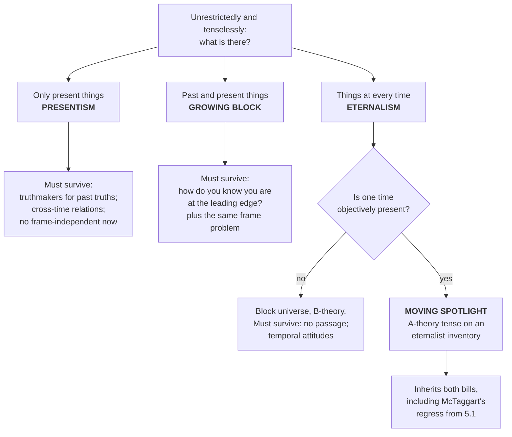

# Metaphysics · Lesson 5.2: Presentism, the growing block, and eternalism

> ⏱ ~15 min · Module 5: Time and persistence · Builds on: [5.1 The A-theory and the B-theory](05-01-the-a-theory-and-the-b-theory.md) · Unlocks: [5.3 Coincidence and the Ship of Theseus](05-03-coincidence-and-the-ship-of-theseus.md)

## Why this matters

[5.1](05-01-the-a-theory-and-the-b-theory.md) asked whether time *passes* — whether being present is a real feature of an event or a matter of where the speaker stands. This lesson asks a different question, and the first job is to see that it *is* different: not does time pass, but **what is on the inventory**. Are there dinosaurs? Not "were there" — are there, in the unrestricted sense of [1.1](01-01-existence-and-ontological-commitment.md)'s criterion, where you list everything and leave nothing out?

Almost every popular presentation runs the two questions together, and the running-together is why the debate looks easier than it is. There is a view that has the whole of time in its inventory *and* a real objective present. Once you see that view, you can never again treat "the past is real" and "time does not pass" as the same claim. Everything downstream — how a thing persists ([5.4](05-04-endurance-perdurance-and-stages.md)), what a cross-time cause could be, whether your death is a loss — depends on getting the two axes apart.

## The idea

Ask the Quinean question about time. When you quantify unrestrictedly — no tacit "now" narrowing the domain — what is in the range of the variable?

Three answers have serious defenders.

**Presentism:** only present things. The inventory of the world just is the inventory of now. There are no dinosaurs and no Mars colonists; there *were* some and there *will be* some, and those tensed truths have to be handled some other way.

**The growing block:** past and present things, but not future ones. Reality is a block that is getting bigger. Becoming is literally accretion: the sum total of existence grows at the leading edge, which is now.

**Eternalism:** past, present and future things, all of them, tenselessly. Dinosaurs are not nonexistent, they are *elsewhen* — related to us by the earlier-than relation exactly as Tokyo is related to us by a spatial one. "Now" is an indexical, like "here."

One warning before the arguments. Stated carelessly, presentism is trivial: if "exists" already means "exists now," then "only present things exist now" is a truism no one denies. Several critics have pressed exactly this — that presentism is either a triviality or an obvious falsehood — and the presentist's repair is to insist that the quantifier is unrestricted and tenseless, so that the claim "everything is present" is a substantive report about the size of the domain. Hold the tenseless quantifier fixed and the three views are genuinely incompatible.

## The argument

**Presentism.** Unrestrictedly and tenselessly: for every *x*, *x* is present. In words: nothing is past-but-not-present and nothing is future; the list of what there is contains exactly the things there are now.

**The growing block** (C. D. Broad, in the 1920s). Unrestrictedly: for every *x*, *x* is past or present; and the domain is not fixed — it has more members later than it had earlier. In words: the past is there, complete and settled; the future is not anything yet; and the difference between them is what temporal passage *is*.

**Eternalism.** Unrestrictedly: the domain contains things located at every time there is, and "is located at" attributes no privilege to any of them. In words: spacetime and its contents are all equally there; which time is *present* is a question about the speaker, not about reality.

Now the crucial structural point. The ontological question above is **not** the tense question of 5.1. They are two axes, and every cell is occupied:

| | **A-theory:** one time objectively present, passage real | **B-theory:** no objective present, only earlier-than |
|---|---|---|
| **Only present things exist** | **Presentism** | — (nothing left for a B-series to order) |
| **Past and present exist** | **Growing block** | — (the growing itself is the passage) |
| **All times exist** | **Moving spotlight** | **Eternalism / block universe** |

The **moving spotlight** is the proof the axes are independent: an eternalist inventory — everything is there — plus a genuine objective present that moves along it, lighting one time at a time. It is not a hedge; it is the position you get if you are convinced by the eternalist's answers to the objections below and convinced by the A-theorist's insistence that passage is real. It has been examined at book length by Bradford Skow. It also inherits both sets of problems, as you would expect.

Each ontology now has to survive a specific objection. That is the rest of the lesson.

### What presentism must survive

**1. Truthmakers.** "There were dinosaurs" is true. The truthmaker principle — used in this course to motivate universals in [1.3](01-03-universals-the-realists-case.md) and lurking behind grounding in [2.4](02-04-essence-and-grounding.md) — says every truth is made true by something that exists. But on presentism nothing that exists is a dinosaur, contains one, or ever was one. So what makes it true? Four answers, each with a bill attached:

- **Lucretian properties** (Bigelow): the present world has primitive backward-looking properties — *being such that there were dinosaurs*. Cost: these look like the truths re-badged as properties. They make the sentence true by construction and explain nothing.
- **Presently existing surrogates**: abstract ersatz times, or haecceities — individual essences of past things — existing now and ordered by an earlier-than relation (Crisp, Bourne, Zimmerman work this vein). Cost: abstracta as truthmakers for concrete truths, and the surrogates' own content needs grounding in turn.
- **Primitive tensed facts** (Prior): *WAS(there are dinosaurs)* is a primitive tensed fact. Tense operators are unanalysable and need no object at the far end. Cost: you have either given up truthmaking for tensed truths, or admitted facts into the ontology.
- **Deny the principle** (Merricks presses this): not every truth needs a truthmaker. Cost: the principle is load-bearing elsewhere, so a presentist who drops it has to say what replaces it in the arguments that used it.

**2. Cross-time relations.** A relation requires its relata. Yet the assassination in Sarajevo caused a war; you are taller than a great-grandmother you never met. If causation is a relation between distinct events, and on the regularity and counterfactual analyses of [4.1](04-01-humes-challenge-and-the-regularity-theory.md) and [4.2](04-02-counterfactual-causation.md) it is, then the presentist has a relation with nothing at one end.

The presentist replies by making the relation monadic: what is real is a present thing having the tensed property *being caused-to-be-so by such-and-such*. And there is a package here that is better than a patch. A powers theorist ([4.3](04-03-powers-dispositions-and-laws.md)) holds that causation *is* the exercise of a power — and an exercise is simultaneous with its manifestation, which means the causing happens entirely in the present. That presentist owes no cross-time relation at all. Whether the price — real powers, and causation that is not a relation between distinct events — is worth paying is exactly the Humean/neo-Aristotelian dispute of Module 4, and it is not settled here.

**3. Relativity.** *Stated, not derived.* In special relativity, whether two spatially separated events happen at the same moment depends on the inertial frame, and no inertial frame is privileged. The physics is [`relativity`](../../relativity/syllabus.md) 1.1; the argument from it to a block universe, due to Rietdijk and Putnam, and Stein's reply that relativity licenses at most a *point*-relative present, belong to `philosophy-of-physics` 4.3. The objection: presentism needs a global, frame-independent "now" to say what exists, and relativity does not supply one — so existence itself would come out frame-relative, which is absurd.

Presentist routes out, in one line each: accept a preferred foliation that is dynamically real but empirically undetectable (some quantum-gravity and Bohmian programmes want one anyway); or hold that relativity constrains what is *measurable*, not what *exists*. Note that the growing block needs a frame-independent leading edge and takes the same hit. How much damage the objection does is live, and the verdict on the physics is not this course's to give.

### What the growing block must survive

**The epistemic objection** (Braddon-Mitchell, Bourne). On the growing block, past people are *there* — as real as you, thinking their thoughts, each of them thinking "it is now." Your belief that you are at the leading edge is one of countless such beliefs, almost all of which are false, and you have no evidence distinguishing your case. So the view makes it irrational to believe the one thing it needs you to believe.

Three replies. **Forrest's dead past**: only the leading edge is alive and conscious; the past is real but causally inert and lightless — which concedes that the past lacks the properties that made including it attractive. **Primitive acquaintance**: presentness is primitive and one is directly aware of one's own — which is what the objector denies. **Bite it**: your confidence is lucky rather than justified.

Notice too that the block buys truthmakers for the past at the price of the mirror problem for the future: "there will be a sea battle," if true now, has no truthmaker in a domain that stops at the edge. Growing blockers usually embrace that and take the future to be open — a further commitment, not a free consequence.

### What eternalism must survive

**It eliminates passage.** If no time is objectively present, nothing about reality distinguishes the moment you are at, and time becomes a dimension along which things vary. The B-theorist's answer is that what needs explaining is the *experience* of passage, not passage: successive experiences are laid out in the block, each containing memory of the earlier ones, and that structure is what it is like to be a thing inside time. Whether explaining the appearance away is a success or a dodge is 5.1's question.

**It makes our temporal attitudes irrational.** Why dread next month's surgery, if the pain tenselessly exists either way? Why does Prior's "thank goodness that's over" feel like a report of something real? The eternalist answers that the attitudes track *temporal location*: relief is the appropriate attitude to a pain located earlier than one's present thought, and location is a real relation even if presentness is not. Two guardrails on this reply. First, eternalism is not fatalism — a future event's tenseless existence says nothing about whether it is causally necessitated, which is [6.1](06-01-determinism-and-the-consequence-argument.md)'s separate question. Second, the reply cuts both ways in the consolation business: the same move that makes your childhood "still there" makes next month's surgery still there too.

Reporting where the profession sits, not arguing it: surveyed philosophers favour B-theoretic and eternalist views over A-theoretic ones, without anything like consensus, and presentism retains able defenders.

## Map of positions

## Worked examples

**Example 1 (mechanical — one sentence, three ontologies).** Take: *Caesar's crossing the Rubicon caused the civil war.* Run each view on three questions — what exists, what makes the sentence true, and what the causal relation relates.

| | Does Caesar exist? | Truthmaker | The causal relation |
|---|---|---|---|
| **Presentism** | No | Owed. Pick one: a Lucretian property of the present world; an abstract surrogate for 49 BC; a primitive *WAS*; or no truthmaker | Owed. Either recast as a monadic tensed property of present things, or take causing to be a power exercised now with nothing past at either end |
| **Growing block** | Yes — he is in the block, just not at the edge | Free. Caesar and his crossing are there to do the job | Free for past-to-past and past-to-present; the problem moves to future-tensed truths |
| **Eternalism** | Yes, tenselessly | Free | Free: two events at different temporal locations, related as any two relata are |

Read the table as a bill, not a scoreboard. Eternalism's two blanks are why it is often said to win on cheapness; what it pays for them is the whole of the passage objection, and what presentism buys with its debts is a world where only what is happening is happening.

**Example 2 (where it strains — a star that may or may not be there).** A supernova is observed tonight from a galaxy 30 million light-years away. Ask the innocent question: *does that star exist now?*

The eternalist has an easy answer and a deflationary one: the star exists tenselessly, and "now" picks out a temporal location relative to a frame, so the question as asked has no frame-independent content. Nothing turns on it.

The presentist cannot be deflationary, because for her "exists now" is the whole of existence. She must say whether the star is on the inventory — and relativity gives her no frame-independent fact to appeal to. Worse, the astronomer's *claim* is a cross-time relation with a vengeance: the light now entering the telescope was emitted by an event 30 million years ago, and the emission is doing explanatory work tonight.

Watch how the two objections cooperate here rather than stacking. The cross-time problem has a presentist answer — the photon's present state carries the whole story, and the emission enters only as a tensed truth about how that state came to be. But that answer needs "the present state" to be a global fact, and it is precisely a global present that relativity declines to hand over. This is why presentists who take the relativity objection seriously usually reach for a preferred foliation: it is not stubbornness about physics, it is the repair their answer to the other objection requires.

## Watch out

- **"Eternalism" does not mean everything happens at once.** Events keep their temporal locations and their order; what they lose is a privileged one. Someone who pictures the block as a single simultaneous moment has pictured something no eternalist believes.
- **"The past is real" and "the past is fixed" are different claims.** All three views agree the past is unalterable. Presentism does not make the past *changeable*; it makes it *nonexistent*, which is a different and stranger thing.
- **Eternalism is not fatalism, and the block is not determinism.** That an event tenselessly exists at a later location says nothing about whether the laws plus earlier conditions necessitate it — see [6.1](06-01-determinism-and-the-consequence-argument.md).
- **Do not equate eternalism with the B-theory, or presentism with the A-theory.** They correlate; they are not the same axis. The moving spotlight is the standing counterexample, and any argument that slides from "all times exist" to "time does not pass" has skipped it.
- **The truthmaker objection is not "presentists cannot say true things about the past."** They can, and do. The question is what *grounds* those truths — a demand you can meet, or reject, but not answer by repeating the truths.
- **The growing block is not presentism plus a good memory.** Its past people are not records; they are people, standing in the same relation to reality you do. That is the whole force of the epistemic objection.

## One-liner

> How much of time is on the inventory, and whether one moment on it is lit, are two questions — and the moving spotlight exists to prove it.

## Problems

**P1 (🟢) *(Exegetical.)*** Answer each question for presentism, the growing block, and eternalism — one clause per view.

(a) Is there something identical to Socrates?
(b) Is there something identical to the first person born in the twenty-second century?
(c) Is being present a feature of reality itself, or an indexical matter like being here?

Then (d): give the moving spotlight's answers to (a)–(c), and say in one sentence what the pattern shows.

**P2 (🟡) *(Exegetical (a) · Evaluative (b).)*** "There were trilobites" is true.

(a) State the truthmaker objection to presentism as it applies to that sentence, naming the principle it uses, and give two of the standard presentist answers with the cost of each.
(b) A presentist replies by restricting the principle: only present-tense truths require truthmakers. Is that restriction principled or ad hoc? 150 words or fewer, any verdict, provided you say what the truthmaker principle is buying elsewhere in metaphysics and what the restriction costs there.

**P3 (🔴, optional) *(Exegetical (a) · Exegetical, then evaluative (b).)*** An invented paragraph from a science column:

> "Physics settled this a century ago. Relativity shows there is no universal now — whether two distant events happen at the same moment depends on how fast you are moving. So the past and the future are every bit as real as the present: the whole of spacetime is laid out at once, and the flow of time is a trick of consciousness. Which means, if you think about it, that nothing is ever really lost. Your childhood is still there, at its own address."

(a) Name the two distinct conclusions the passage runs together, say which axis each belongs on, and identify the step where it slides from the first to the second.
(b) Name the single premise a presentist must deny to block the argument, and say what would count as a reason to give it up. 150 words or fewer.

Solutions

**P1** *(Exegetical — strict.)*

**Must hit, strict:**
- (a) **Presentism: no** — Socrates is wholly past, so nothing is identical to him. **Growing block: yes** — he is in the block, at his own location, not at the edge. **Eternalism: yes**, tenselessly.
- (b) **Presentism: no. Growing block: no** — the future is not yet anything, so there is no such person to be identical to. **Eternalism: yes** — that person exists tenselessly at a later location. (Note that (b) is where the block sides with presentism, and (a) is where it sides with eternalism. That is the whole content of the view.)
- (c) **Presentism: a feature of reality** — indeed the only feature that confers existence. **Growing block: a feature of reality** — presentness is being at the leading edge, the boundary where the domain is growing. **Eternalism: indexical** — "present" picks out the time of the utterance, as "here" picks out its place.
- (d) **Moving spotlight:** (a) yes, (b) yes, (c) a feature of reality. It answers the existence questions with eternalism and the presentness question with the A-theorists. The pattern shows the two axes are independent: you can have the whole of time in your inventory and still hold that one moment on it is objectively lit.

**Wrong turns:** giving the growing block "yes" on (b) because the future is determinate or predictable — determinacy is not existence, and the block's whole point is that the future has not been added yet; giving eternalism "no" on (a) on the ground that Socrates is dead — "is dead" is a present-tense claim about a location, not a denial of existence.

**Model answer:** as above.

---

**P2** *(a) exegetical — strict; (b) evaluative — any verdict.*

**Must hit, strict (a):**
- The principle: **truthmaker** — every truth is made true by something that exists (or the weaker supervenience form: no difference in truth without a difference in being).
- The objection, applied: "There were trilobites" is true; on presentism nothing that exists is a trilobite, was a trilobite, or contains one; so there is nothing to make it true. The bite is that the presentist cannot locate the difference between this world and a world in which nothing ever lived, since the two can agree on every presently existing thing.
- **Two of the four**, each with its cost: Lucretian properties (the present world has the primitive property *being such that there were trilobites*) — cost: the property is the truth re-badged and explains nothing. Ersatz times or haecceities (presently existing abstract surrogates ordered by earlier-than) — cost: abstracta grounding concrete truths, and the surrogates' own content needs grounding. Primitive tensed facts (*WAS(there are trilobites)*, with unanalysable tense operators) — cost: truthmaking is abandoned for tensed truths, or facts enter the ontology. Denying the principle — cost: the arguments elsewhere that leaned on it.

**Must hit, any verdict (b):** say what the principle buys elsewhere — it is a main argument for universals or tropes in [1.3](01-03-universals-the-realists-case.md)–[1.4](01-04-nominalism-and-tropes.md) (what makes "this is red" true), it underwrites the demand for grounds in [2.4](02-04-essence-and-grounding.md), and it is what makes ontological cheating detectable at all. Then say what the restriction costs *there*: whether the presentist can still run those arguments once "some truths need no truthmaker" is admitted, and whether anything other than "it would be inconvenient for presentism" marks off the exempt class. Either verdict passes; a defence of the restriction must name a non-question-begging feature of tensed truths, and an attack must say why that feature is unavailable.

**Wrong turns:** answering (b) by asserting that presentism is false, which is not what was asked; treating the restriction as obviously ad hoc without checking whether tensed truths differ in kind — Prior's position is precisely that they do, since a tense operator is not a device for describing an object; conflating the truthmaker principle with a verification principle about how we *know* the past.

**Model answer (b), one of several:** The restriction is not ad hoc *by form* — principles get restricted all the time, and "tensed truths are not descriptions of objects, so they do not require objects" is a real distinction rather than an exemption written to fit. What makes it expensive is the company it must keep. The principle's work elsewhere is precisely to force a theory to say what in the world corresponds to its truths; that is how the case for universals gets traction and how grounding demands are made intelligible. A presentist who exempts a whole class must show why the exemption does not generalize to the nominalist who says "this is red" needs no property, and to any other position that would like its debts forgiven. So: principled in shape, and owing a demarcation it has not obviously paid for.

---

**P3** *(a) exegetical — strict; (b) exegetical, then evaluative.*

**Must hit, strict (a):**
- Conclusion 1, **ontological**: all times and their contents exist — eternalism. Conclusion 2, **about tense and passage**: there is no objective present and no real becoming — the B-theory. These sit on the two different axes of this lesson.
- The slide is at "**So** the past and the future are every bit as real as the present: the whole of spacetime is laid out at once, **and** the flow of time is a trick of consciousness." The relativity premise argues, at most, for the ontological conclusion; the passage conclusion is smuggled in by the conjunction. The moving spotlight is the counterexample — it grants the whole inventory and keeps objective passage — so even a fully successful relativity argument leaves the tense question open.
- Credit also for catching the second smuggle: "nothing is ever really lost / your childhood is still there" states a *tensed* consolation that the tenseless conclusion does not support. On eternalism the childhood exists at its location exactly as next month's surgery does; the sentence trades on hearing "still there" as "there now."

**Must hit (b):** name the premise, not the conclusion. The premise to deny is that relativity's lack of a frame-independent simultaneity relation is a fact about **existence** rather than about physical structure and measurement — equivalently, that what exists must line up with some frame's simultaneity class. Two ways to deny it: hold that there is a privileged foliation which relativity does not detect, or hold that relativity describes what is measurable and metrically structured while leaving the ontology of the present untouched. Then say what would move it: evidence that a foliation plays a dynamical role (some quantum-gravity and Bohmian programmes need one), or the precise result about what relativity does and does not license — Stein's reply to Rietdijk and Putnam, which is `philosophy-of-physics` 4.3's business, not this course's.

**Wrong turns:** answering (b) with "the presentist must deny relativity" — no presentist in the literature denies the empirical content of the theory, and saying so mistakes an interpretive dispute for a factual one; naming the conclusion ("all times exist") as the premise to be denied, which is the thing the argument was supposed to establish; treating (a) as a complaint about the column's tone rather than about its inference.

**Model answer:** (a) The ontological conclusion (eternalism: all times exist) and the tense conclusion (no objective passage) are run together at "so"; the relativity premise bears on the first, and the second needs a further argument that the moving spotlight blocks. The closing sentence slides once more, reading tenseless existence as present availability. (b) Deny that frame-relative simultaneity is a constraint on existence rather than on measurable structure. Reasons to give that up: a dynamically detectable preferred foliation, or a demonstration that the only present relativity supports is point-relative, which would cost the presentist the global "now" she needs.

## Flashback

*From 4.4 — the ontology of time bears directly on causal order, so the distinction has to be sharp.*

**F1 (🟡) *(Exegetical (a)–(b) · Evaluative (c).)*** A record cut in a studio in 1969 is playing tonight through an amplifier drawing current from a hydroelectric generator.

(a) Identify one **essentially ordered** (per se) series and one **accidentally ordered** (per accidens) series in that description, and for the per se one say which members exercise **derived** causal power.
(b) Which of the two series contains a member that does not exist, if presentism is true?
(c) In one sentence, say why a presentist finds one of the two series far easier to accommodate than the other.

Solution

**F1** *(a)–(b) exegetical — strict; (c) evaluative.*

**Must hit, strict (a):**
- **Per se:** falling water → turbine → generator → amplifier → speaker → the sound in the room, all acting **now** and **simultaneously**. Every member downstream of the water exercises **derived** power: the amplifier is driving the speaker only because it is being supplied with current at this instant, and it stops the instant the supply does. Take out any intermediate member and the effect ceases immediately — that is the mark of the order.
- **Per accidens:** the 1969 session → the master → the pressing → tonight's playing. Each member did its causal work and dropped out; the record goes on playing with the engineers long gone. The session is a cause of the record's **coming to be**, not of its **continuing to play** — that is the becoming/being distinction, and it is what makes the order accidental.

**Must hit, strict (b):** the per accidens one. The 1969 session is wholly past, so on presentism it is not on the inventory. Every member of the per se series exists now, because a per se series is simultaneous.

**Must hit, any verdict (c):** name the asymmetry — a per se series needs no cross-time relation at all, since all its members exist and act at once, while a per accidens series has to relate a present effect to a cause that no longer exists. Either verdict on whether that is a real advantage passes, so long as the asymmetry is stated. A strong answer adds that this is why the presentist powers theorist is comfortable: if causing is a power being exercised, the causing is always happening now.

**Wrong turns:** calling the whole chain from 1969 to tonight a single per se series because each step "led to" the next — leading to is not the test; the test is whether the earlier member is still doing the causing at the moment the effect occurs. Calling the per se series accidental because the water fell a moment before the sound arrived — the small transmission delays are not what the distinction is about; the members are jointly sustaining the effect, each in dependence on the one above it. Also: nothing here is an argument that either series must have a first member. That regress question belongs to [`philosophy-of-religion`](../../philosophy-of-religion/syllabus.md) 2.3 and `thomistic-synthesis`, not to the classification asked for.

## Connections

- **Backward:** [5.1](05-01-the-a-theory-and-the-b-theory.md) supplied the tense axis; this lesson supplies the ontological one, and the moving spotlight is where they cross. [1.1](01-01-existence-and-ontological-commitment.md)'s criterion is what makes the question askable at all — the dispute is about what an unrestricted, tenseless quantifier ranges over. The truthmaker demand comes from [1.3](01-03-universals-the-realists-case.md) and [2.4](02-04-essence-and-grounding.md); the cross-time-relation problem is sharp or blunt depending on which account of causation from [4.1](04-01-humes-challenge-and-the-regularity-theory.md)–[4.3](04-03-powers-dispositions-and-laws.md) you hold.
- **Forward:** [5.4](05-04-endurance-perdurance-and-stages.md) shows which persistence theories each ontology can support — temporal parts need other times to have parts at, so perdurance and presentism sit badly together, while hylomorphic endurance sits comfortably with presentism. [6.1](06-01-determinism-and-the-consequence-argument.md) keeps eternalism and determinism apart, which the "the future already exists, so why bother" slide constantly confuses.
- **Sideways:** the physics behind the relativity objection is [`relativity`](../../relativity/syllabus.md) 1.1; the argument from it to a block universe, and Stein's reply, are `philosophy-of-physics` 4.3, which hands the metaphysical verdict back here. Whether presentism and eternalism might be a *verbal* dispute is a question for the test in [`philosophical-method`](../../philosophical-method/syllabus.md) 3.2 — and note that the test is hard to pass here, since the parties disagree about the size of the domain, which is not a linguistic fact.
