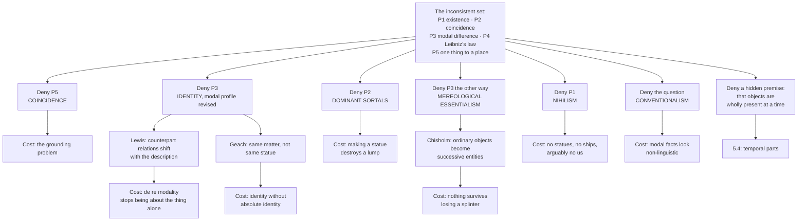

# Metaphysics · Lesson 5.3: Coincidence and the Ship of Theseus

> ⏱ ~15 min · Module 5: Time and persistence · Builds on: [5.2 Presentism, the growing block, and eternalism](05-02-presentism-growing-block-eternalism.md) · Unlocks: [5.4 Endurance, perdurance, and stages](05-04-endurance-perdurance-and-stages.md)

## Why this matters

The puzzles in this lesson look like party tricks and are not. They are the place where a theory of objects gets audited. Every position from Module 2 — hylomorphism, nihilism, universalism, bundle theory — makes a prediction here, and the predictions are checkable against cases anyone can follow. More importantly, the puzzles are **one puzzle wearing three costumes**. Once you see the shape, the Ship of Theseus stops being a riddle to be solved and becomes a bill to be paid: every consistent answer gives something up, and the philosophical work is pricing the options rather than picking a winner. Doing that pricing here is what makes [5.4](05-04-endurance-perdurance-and-stages.md)'s theories of persistence mean something — they arrive as answers, and you will already know what the question cost.

## The idea

Start with the engine. **Leibniz's law**, in the form that does all the work:

If $a = b$, then for every property $F$, $a$ has $F$ if and only if $b$ has $F$.

In words: one thing cannot differ from itself. This is the **indiscernibility of identicals**, and it is about as close to undeniable as metaphysics gets. Read it in contrapositive and it becomes a tool: **find one property that $a$ has and $b$ lacks, and you have proved $a \neq b$.**

Now the first costume. A sculptor buys a lump of clay and works it into a statue. Ask what is on the pedestal.

There is a clear sense in which there is one thing: one object, one mass, one place, one weight on the scale. And there is a clear sense in which there are two, because the lump and the statue come apart in their properties:

- **Historical.** The clay was in a crate last Tuesday. The statue was not; it did not exist yet.
- **Modal.** Squash the statue flat. The clay survives that — it is still the same lump, differently shaped. The statue does not.

Run Leibniz's law on the modal difference and the conclusion is immediate: the statue and the clay have different properties, so the statue is not the clay. But they are in the same place, made of the same particles, at the same time. That is **coincidence**: two distinct material objects sharing every part and every cubic millimetre.

**Constitution is the relation involved, and constitution is not identity.** The clay constitutes the statue the way the bricks constitute the wall — the statue is *made of* the clay without *being* it. Fine, so long as you notice the price: you now believe there are two things on the pedestal, and they weigh 12 kilograms together only if you count wrongly.

The puzzle generalizes instantly. Wherever some stuff makes up an object, the stuff and the object have different careers, so Leibniz's law splits them: a flag and its cloth, a river and its water, an organism and the matter passing through it, you and your body.

## Source

Hobbes gave the second costume its decisive twist. In *De Corpore*, Part II, Chapter XI, "Of Identity and Difference", he takes up the schoolroom puzzle about Theseus's ship and adds the move that turns it from a question about vagueness into a contradiction:

> "For if, for example, that ship of Theseus, concerning the difference whereof made by continued reparation in taking out the old planks and putting in new, the sophisters of Athens were wont to dispute, were after all the planks were changed, the same numerical ship it was at the beginning; and if some man had kept the old planks as they were taken out, and by putting them afterwards together in the same order, had again made a ship of them, this, without doubt, had also been the same numerical ship with that which was at the beginning; and so there would have been two ships numerically the same, which is absurd."

Three things to notice.

**The reassembly is the whole point.** Plank-by-plank replacement on its own is a sorites: at which plank does the ship stop being Theseus's? That is a question about a vague boundary, and vagueness is an old and manageable problem. Hobbes's addition produces a *second candidate* with an equally good claim — same planks, same arrangement, and nothing but a warehouse between them. Now the two natural answers do not merely blur, they collide.

**"Numerically the same" is the technical phrase.** Not *exactly similar*, which two ships can obviously be, but *one and the same ship*. Identity, not resemblance.

**Hobbes's own escape is to index the question to a name.** Earlier in the chapter he distinguishes principles of individuation — by matter, by form, by the aggregate of a thing's accidents — and says that which one applies depends on the name under which the thing is being considered. Consider it as *this matter* and the reassembled ship wins; consider it as *this form* and the repaired one does. That single move is the ancestor of two very different modern positions, sortal-relative identity and conventionalism, which we will meet below as rivals.

The third costume is the oldest. The Stoics told a version about Dion and Theon, where Theon is Dion minus a foot; Geach's twentieth-century retelling uses a cat. **Tibbles** is a cat; **Tib** is the large part of Tibbles that excludes her tail. Before the accident, Tib and Tibbles are plainly different — Tibbles has a tail as a part, Tib does not. Then Tibbles loses her tail. Tib is untouched by the loss; Tibbles survives it, as cats do. So now Tib and Tibbles occupy exactly the same region and share exactly the same parts. Either two cats sit on the mat, or two things that were distinct have become one — and nothing that was ever two can become one, since Leibniz's law would then have to be false of some past moment.

## The argument

Here is the one shape, stated for the statue and the clay. Each claim is plausible; the set is inconsistent.

> **P1. Existence.** There is a statue on the pedestal, and there is a lump of clay on the pedestal.
> *In words: both are among the things there are; neither is a mere façon de parler.*
>
> **P2. Coincidence.** At this moment the statue and the lump occupy exactly the same region and have exactly the same parts.
> *In words: there is no material difference between them to point at.*
>
> **P3. Modal difference.** The lump would survive being squashed flat; the statue would not.
> *In words: their careers can come apart, so their properties already differ now.*
>
> **P4. Leibniz's law.** If the statue is the lump, they share every property.
> *In words: nothing differs from itself.*
>
> **P5. One thing to a place.** Distinct material objects cannot occupy exactly the same region at the same time.
> *In words: no two things in one place at one time.*

P3 and P4 yield: the statue is not the lump. P1, P2 and P5 yield: the statue is the lump. Contradiction. **A position in this debate just is a choice of which premise to deny, plus an account of why that denial is bearable.**

The Ship has the same skeleton with the modal premise replaced by two rival continuity principles.

> **S1.** The original ship existed at the launch.
> **S2.** Gradual replacement of parts preserves identity — the repaired ship is Theseus's ship. *In words: continuity of form and function carries the name.*
> **S3.** Reassembly of all the original parts in their original arrangement preserves identity — the reassembled ship is Theseus's ship. *In words: same matter, same structure, same ship.*
> **S4.** Identity is one-one and transitive: at most one present thing is identical with the original, and the two candidates are in different harbours, so they are not each other.

S2 and S3 cannot both stand given S4. Hobbes's addition is exactly what forces the choice.

And Tibbles:

> **T1.** Before the accident, Tib is not Tibbles. *In words: they differ in parts, so Leibniz's law separates them.*
> **T2.** Tib survives the loss of the tail — nothing was removed from Tib.
> **T3.** Tibbles survives the loss of the tail — cats do.
> **T4.** After the loss, Tib and Tibbles coincide exactly.
> **T5.** Distinctness is permanent: nothing that was two becomes one.

Three puzzles, one engine.

## Map of positions

| View | Denies | Statue and clay | Hobbes's ship | The bill |
|---|---|---|---|---|
| **Coincidence** (Wiggins, Thomson, Baker, Fine, Koslicki) | P5 | Two objects, one region; constitution is not identity | No help by itself — the two candidates are not co-located, so a second continuity principle is still needed | **The grounding problem**: if they share every part, atom and surrounding, what makes it true that one could survive squashing and the other could not? |
| **Identity plus counterpart theory** (Lewis; Gibbard on contingent identity) | P3, as stated | One object; "could survive squashing" is true of it *as a lump* and false of it *as a statue*, because the description selects the counterpart relation | The name picks out a career; different naming practices pick different careers, and the object is whichever you were tracking | De re modal properties are no longer had by the thing full stop, only relative to how it is picked out |
| **Sortal-relative identity** (Geach) | P3 and the absoluteness of identity | Same lump as, not the same statue as — identity is always identity *under a sortal* | The repaired ship is the same ship as; the reassembled one is the same collection of planks as | Identity is no longer the single logical relation that Leibniz's law governs, and Leibniz's law needs restating |
| **Dominant sortals** (Burke) | P2 (and so P1 for one of them) | One object. When the clay took on statue-shape, the lump ceased to exist; only the statue is there | The dominant kind *ship* determines one winner, fixed by the criteria for being a ship | Rearranging matter destroys and creates objects without any physical event marking it |
| **Mereological essentialism** (Chisholm) | P3, by denying part change altogether | The lump has its parts essentially too; neither object survives losing a particle | Neither candidate is the original ship; the original ceased to exist at the first plank | Ships, tables and bodies become *entia successiva* — logical constructions from strictly momentary objects |
| **Nihilism** ([2.3](02-03-hylomorphism-and-composition.md)) | P1 | No statue, no lump: simples arranged statuewise | No ship at all — planks arranged shipwise, then other planks arranged shipwise | Everything said with ordinary object-talk is at best loosely true, including what you say about yourself |
| **Conventionalism** | That there is a fact to find | The question is about which practice governs "statue" and "lump" | Whichever ship the Athenians would have registered; settle it by deed poll | Historical and modal facts look like facts about the world, not about our naming |
| **Four-dimensionalism** | A hidden premise | Deferred to [5.4](05-04-endurance-perdurance-and-stages.md) | Deferred | Deferred |

## Worked examples

**Example 1 (mechanical — running the machinery on a fresh case).** A flag flies over a courthouse. It was cut in March from a bolt of cloth that had sat in a warehouse since January; in five years it will be cut up for rags.

1. **Find the property difference.** *Historical:* the cloth was in a warehouse in January; the flag was not, because there was no flag. *Modal:* cut the flag into rags and the cloth survives as cloth — cut into pieces, but the same material stuff, rearranged. The flag does not survive.
2. **Apply Leibniz's law.** The cloth has the property *was in a warehouse in January*; the flag lacks it. By the indiscernibility of identicals, the flag is not the cloth. Note that one difference suffices; the modal one is a bonus, and it is the more contested of the two.
3. **Notice the coincidence.** Yet every thread of the flag is a thread of the cloth, and they hang in exactly one region. P2 and P5 are now in play against the conclusion of step 2.
4. **Take the menu.** *Coincidence:* two objects on the flagpole, one constituting the other, and a debt to explain the modal difference. *Counterpart theory:* one object; "could survive being cut up" is true of it considered as cloth and false considered as a flag. *Dominant sortals:* one object, the flag; the bolt of cloth ceased to exist when it was sewn. *Mereological essentialism:* neither the flag nor the cloth survives a single frayed thread; what flies over the courthouse is a succession of short-lived objects we conveniently call one flag. *Nihilism:* threads arranged flagwise. *Conventionalism:* nothing here but two ways of talking.

Every option handles the case. None is free. That is the normal situation in this debate, and recognizing it is most of the skill.

**Example 2 (where it strains — why the Ship is harder than the statue).** The statue puzzle is driven by a **kind asymmetry**: statue and lump belong to different sorts with different persistence conditions, and most of the menu exploits that asymmetry. Hobbes's ship removes it, and watch what happens.

*Coincidence* has nothing to coincide. The repaired ship and the reassembled ship are in different harbours and share no planks at the moment of the question, so "there are two objects here" is not even the shape of an answer. The coincidence theorist must add an independent continuity principle — and at that point is choosing between S2 and S3 with the same resources as everyone else.

*Counterpart theory* gets traction, but not a verdict. Lewis's reply says that which career a name tracks depends on the counterpart relation the description invokes, so "Theseus's ship" can be made to pick out either candidate. That explains why the question feels underdetermined; it does not say which practice the Athenians had, and if you press for the answer independent of naming, the theory declines to supply one.

*Sortal relativity* splits the question rather than answering it — same ship as the repaired one, same planks as the reassembled one — which is genuinely clarifying, and leaves untouched the further question of which relation matters for ownership, insurance and reverence.

*Dominant sortals* needs the kind *ship* to determine a unique winner. But both candidates are ships, both are seaworthy, and nothing in the concept of a ship privileges continuity of hull over continuity of timber.

*Mereological essentialism* is the one view that gives a clean answer: neither is the original ship, which perished at the first plank; the reassembled object is the original *collection of planks* recomposed, and the repaired hull never was Theseus's ship at all. Clean, at a price most people find extortionate.

*Nihilism* dissolves it completely: there is no ship to be one or two of. Whatever we want to say about Theseus, we can say by describing planks and their arrangements at various times, and none of those descriptions face a choice.

And this is where **the conventionalist's best case lives**. Apply the verbal-dispute test from [`philosophical-method`](../../philosophical-method/syllabus.md) 3.2. Do the parties agree on every non-linguistic fact? In the ship case, yes, and exhaustively: both know which planks went where, in what order, at what dates, and what each hull can do. Eliminate the disputed term and put both spelled-out claims to both parties — *the continuously repaired hull stands in harbour A*, *the reassembled original timbers stand in harbour B* — and neither party denies either. The residue is which candidate gets the name, which is settleable by decision, the way a person settles a name by deed poll.

Then notice that the *same* test gives a different reading on the statue. There the parties do **not** agree on all the non-linguistic facts: one says the thing on the pedestal would survive squashing, the other says it would not, and what would happen under squashing looks like a fact about the world rather than about a word. So the dispute survives the substitution — which, by 3.2's own criterion, makes it substantive. The conventionalist has to reply that modal properties are themselves conventional, and that is a large thesis with the burden on the person asserting it. **A verbal diagnosis is not one thing you apply to a family of puzzles; it has to be earned case by case.**

Three of the puzzles, one engine, and no single verdict handles all three gracefully. That result is what motivates the move in [5.4](05-04-endurance-perdurance-and-stages.md): deny the hidden premise that an object is wholly present whenever it exists. If a ship is a spread-out-in-time object with temporal parts the way it has spatial parts, then the repaired ship and the reassembled ship are two four-dimensional wholes that *share their early temporal parts* — the way two roads can share a stretch of tarmac — and the statue and the lump are two wholes that overlap for a longer stretch. That reframing is the next lesson's, and so is the question of what it costs.

## Watch out

- **Leibniz's law is not the identity of indiscernibles.** The law used here says identicals share all properties, and it is nearly uncontested. Its converse — that things sharing all properties are identical — is a substantive and much-attacked thesis, and Black's two spheres are the standard counterexample ([2.1](02-01-substance-and-accident.md)). Citing "Leibniz's law" for the converse is the single most common error in this area.
- **Do not run Leibniz's law through an opaque context.** *Lois believes Superman can fly, and does not believe Clark Kent can* does not show Superman is not Clark Kent, because belief contexts do not report properties of the man. Whether **modal** predicates are opaque in the same way is precisely what is at issue between the coincidence theorist and Lewis — so you cannot settle that dispute by pointing at Lois, and you cannot assume the modal case is innocent either.
- **Constitution is not composition.** "Do these planks make up a further object?" is the special composition question, owned by [2.3](02-03-hylomorphism-and-composition.md). "Is the object they make up identical to them, or a second thing?" is this lesson. A universalist about composition still owes an answer here.
- **Coincidence means exact co-location of distinct things**, sharing all parts — not mere overlap. A hand overlaps an arm without coinciding with it, and overlap is not puzzling.
- **The bare replacement story is not yet the puzzle.** Without Hobbes's reassembly, "how many planks may be replaced?" is a vagueness question. The reassembly is what makes it an identity question, and answers that only handle the sorites have not addressed Hobbes.
- **Mereological essentialism does not say things cannot change.** Objects can change their accidents freely on Chisholm's view; what they cannot do is change their parts. The strangeness is not stasis, it is that ordinary persisting things become constructions out of strictly momentary ones.
- **Nihilism is not the claim that nothing exists**, and "planks arranged shipwise" is not a sly way of saying "a ship." It is a claim about simples and their arrangement; whether *arrangement* is doing work the nihilist has not paid for is the objection raised in [2.3](02-03-hylomorphism-and-composition.md).
- **"The statue is made of the clay, so they are the same thing" begs the question.** *Made of* is the relation whose identification with *identity* is under dispute.
- **Do not let the ship case set the price for the statue case.** The intuition that the ship question is merely verbal is widely shared; the intuition that the statue question is merely verbal is not, and the difference is diagnosable rather than a matter of taste.

## One-liner

> Leibniz's law plus two obvious truths about clay, ships and cats yields a contradiction, and every way out is a purchase: an extra object you cannot tell apart from the first, a modal profile that shifts with your description, a sortal that annihilates its rival, a world with no ships in it, or a question that was only ever about a name.

## Problems

**P1 (🟢) *(Exegetical.)*** A restorer strips a violin down and, over ten years, replaces its top, back, ribs, neck and fittings, one at a time, keeping every discarded piece. A rival luthier then assembles the discarded pieces into a playable violin.

(a) State the inconsistent set for this case in the form used in the lesson, using the ship skeleton S1–S4. (b) For each of **coincidence**, **mereological essentialism** and **nihilism**, say in one clause which claim the view rejects and what it says stands in the two workshops.

**P2 (🟡) *(Exegetical (a) · Evaluative (b).)*** An invented paragraph from a museum's acquisitions memo:

> "The instrument's identity is not in its wood. We have the conservation records; we know which pieces were changed and when; there is nothing further to find out. What remains is a decision, and the decision is ours to make: we shall catalogue the restored instrument as the 1721 violin, because that is the object our visitors come to see and the object the insurers have always covered. Naturally the restored instrument could not have been dismantled without ceasing to exist, whereas the timbers could — but that is just what it is to be the instrument rather than the wood."

(a) Name the position the memo takes, quote the words that commit it, and name the one sentence that sits badly with that position and say why. (b) Apply the verbal-dispute test from [`philosophical-method`](../../philosophical-method/syllabus.md) 3.2 to the memo's dispute with a curator who says the reassembled violin is the 1721 instrument: say what the two parties agree on, what survives the substitution, and whether the dispute is verbal. **150 words or fewer for (b).**

**P3 (🔴, optional) *(Evaluative.)*** The coincidence theorist says the statue and the lump are two objects that share every particle, every spatial property, every causal power and every surrounding, yet differ in what they could survive.

Name the crux between this view and a one-thinger who rejects P5's denial — the single question both sides must answer differently — and say what each side must hold about it. **150 words or fewer.** Any verdict; the crux is what is graded.

Solutions

**P1** *(Exegetical — strict.)*

**Must hit, strict:**
- (a) The set, instantiated: **S1** the 1721 violin existed before the restoration. **S2** gradual part replacement preserves identity, so the restored violin is the 1721 violin. **S3** reassembly of the original parts in their original arrangement preserves identity, so the rival's violin is the 1721 violin. **S4** identity is one-one and transitive, and the two instruments are in different workshops, so they are not each other. S2 and S3 cannot both stand given S4. Credit requires naming S4 (or transitivity/uniqueness) as the premise that converts two plausible answers into a contradiction — not merely observing that the answers conflict.
- (b) **Coincidence** rejects nothing in S1–S4 by itself; it is an answer to the *statue* puzzle and leaves this one open, so it must still choose between S2 and S3. Saying so is the correct answer; asserting that coincidence yields "two violins in one place" is wrong, because the two instruments are not co-located. **Mereological essentialism** rejects S2: nothing survives part replacement, so the 1721 violin perished at the first change; the restored instrument is a later object, and the rival's instrument is the original parts recomposed. **Nihilism** rejects S1: there never was a violin, only simples arranged violinwise; two workshops now contain simples in two arrangements, and no identity question arises.

**Wrong turns:** treating the case as a sorites about how many parts may be replaced — the rival's reassembly is what makes it an identity question; saying coincidence "solves" the case; giving mereological essentialism the verdict that the reassembled violin is the original *violin* rather than the original parts recomposed (Chisholm's view is that the original whole is gone, and strictly speaking the recomposed thing has a strong claim only on the collection).

---

**P2** *(a) exegetical — strict; (b) evaluative — any verdict.*

**Must hit, strict (a):** the position is **conventionalism** — the question is verbal and settled by decision. The committing words: **"there is nothing further to find out"**, **"what remains is a decision, and the decision is ours to make"**, and the grounds offered ("the object our visitors come to see", "the insurers have always covered"), which are reasons for a practice, not evidence about an object. The sentence that sits badly is the last one: **"the restored instrument could not have been dismantled without ceasing to exist, whereas the timbers could"**. That is a modal difference asserted flatly as a fact about the two things, and if it is a fact then there *is* something further to find out, and Leibniz's law delivers two objects rather than one decision. The memo helps itself to the modal premise it has just declared non-substantive. Both the position and the specific offending sentence must be identified; naming the position alone is half credit.

**Wrong turns:** calling the memo "nominalist" or "sortal-relativist" — it takes no stand on universals, and it explicitly denies there is a fact of the matter rather than relativizing the fact to a sortal; treating the insurance and visitor reasons as bad reasons (on the memo's own view they are exactly the right kind of reason, which is what makes the position coherent up to the last sentence).

**Must hit, any verdict (b):** run the test's steps. **Agreement on non-linguistic facts:** total, for the *historical* facts — both parties have the conservation records and agree which pieces went where and when. **Substitution:** replace "the 1721 violin" with the spelled-out claims — *the continuously restored instrument stands in workshop A*, *the original timbers reassembled stand in workshop B* — and both parties accept both. **What survives:** which instrument gets the catalogue entry, the insurance and the name. Then the verdict, and it must be argued rather than asserted: verbal, if the residue is only the name; substantive, if the disagreement is really about which properties an instrument has essentially, or about which concept deserves the name's authority — which by 3.2 is a normative question the test clarifies rather than dissolves. Either verdict passes provided the agreed facts and the residue are separated explicitly.

**Wrong turns:** declaring the dispute verbal without doing the substitution — the assertion is the conclusion, not the argument; overlooking 3.2's case where parties agree on the facts and still disagree about which sense the word should carry, which is plainly live here given the money and the visitors.

**Model answer (b), one of several:** Substantially verbal, with a non-verbal residue the memo hides. Both parties have the same records and agree on every event: this piece removed in 2014, that one fitted in 2016, these timbers reassembled last spring. Substitute the descriptions for the name and each accepts both claims — neither denies that a continuously restored instrument stands in one workshop and a reassembled original stands in the other. So the dispute over *which is the 1721 violin* passes 3.2's test for verbal. But it is a dispute about an honorific: the name carries the insurance, the catalogue and the visitors, so what remains is the normative question of which concept deserves it, and that is not dissolved by the test. And the memo's own modal claim, if true, is a fact the parties could disagree about — which would make it substantive after all.

---

**P3** *(Evaluative — any verdict; the crux is what is graded.)*

**Must hit:**
- **Name the crux precisely.** It is the **grounding problem**: can two objects differ in their modal or sortal properties — what they could survive, what kind they belong to — without differing in any of the properties that would normally ground such differences (parts, microphysical arrangement, causal powers, history, surroundings)? Answers that name only "can two things be in one place?" are not yet the crux: that is the disputed conclusion, and the grounding question is why the one-thinger finds the conclusion intolerable.
- **Say what each side must hold.** The **coincidence theorist** must hold that modal and sortal properties are not grounded in the microphysical base at all — they are had in virtue of what kind a thing is, and kind-membership is a further, irreducible fact about an object (a form, an essence, a sortal). The **one-thinger** must hold that everything about an object supervenes on how its matter is arranged, so two things that match microphysically cannot differ in what they could survive; hence one of the alleged differences must be redescribed — as a difference in description, in counterpart relation, or in which object exists at all.
- Note that the puzzle is at its sharpest when statue and lump are **created and destroyed together**, so that even their histories match. Then no difference whatever remains to ground the modal one. Full credit does not require this, but an answer that reaches it is stronger.

**Wrong turns:** saying the crux is "whether objects have essences" and stopping — true but too coarse, since both sides can allow essences and the dispute is over what grounds them; answering with a verdict on how many objects are on the pedestal, which both sides already know they disagree about; claiming the coincidence theorist can answer by pointing to the difference in *shape-history*, without noticing that Gibbard-style simultaneous cases remove that difference by construction.

**Model answer, one of several:** The crux is grounding: whether an object's modal profile is fixed by its physical constitution. The one-thinger says yes — everything true of a thing is settled by how its matter is arranged and what has happened to it, so if statue and lump match in all that, they cannot differ over squashing; the apparent difference must be linguistic, or one of the two must not exist. The coincidence theorist says no — what a thing could survive follows from what kind it is, and kind-membership is a primitive further fact, not read off the particles. That is a real disagreement and it has a real cost on each side. The one-thinger has to explain away a modal difference nearly everyone reports; the coincidence theorist has to accept properties with no base in the physical facts, which in the simultaneous-creation version have nothing else to lean on either.

## Flashback

**F1 (🟡) *(Exegetical (a) · Exegetical then evaluative (b).)*** From [5.1](05-01-the-a-theory-and-the-b-theory.md). An invented paragraph from the release notes of a scheduling tool:

> "Every entry is stored with a fixed timestamp, and we never alter one; the ordering of entries is therefore permanent. The banner is a different matter. An entry shows as *upcoming*, then as *in progress*, then as *completed*, and we rewrite the banner on every refresh — so the banner text for a given entry is never stable, though nothing about the entry has changed."

(a) Sort the paragraph's two kinds of description into the A-series and the B-series, say which the timestamps record, and say what a B-theorist claims the banner-rewriting tracks. (b) An A-theorist replies to the charge that one entry cannot be upcoming, in progress *and* completed by saying that it is not all three at once: it *will be* completed, *is* in progress, *was* upcoming. Say why McTaggart holds that this reply does not close the objection, and whether you think the regress it starts is vicious. **120 words or fewer for (b).**

Solution

**Must hit, strict (a):**
- **B-series:** the timestamps and the permanent ordering of entries — *earlier than*, *later than*, *simultaneous with*. These relations never change, which is why the stored data never needs rewriting. The timestamps record the B-series.
- **A-series:** *upcoming*, *in progress*, *completed* — future, present, past. These are the properties that every entry successively takes on, which is why the banner must be rewritten.
- **What the B-theorist says the rewriting tracks:** not a change in the entry, but a change in the relation between the entry and the moment of the refresh — the banner reports where the reader stands relative to a fixed ordering. The tenseless facts are complete; the banner is indexical, like "here." Credit requires the point that on the B-theory nothing about the entry changes, which the paragraph itself concedes ("though nothing about the entry has changed").

**Must hit, strict then evaluative (b):**
- **Why the reply does not close it (strict).** The three A-properties are mutually incompatible, yet every entry has all three. The tensed reply distributes them: it *was* upcoming, *is* in progress, *will be* completed. But those tensed qualifications are themselves A-determinations — they say the entry has the property at a moment that is itself past, present or future. So the same incompatibility recurs one level up, for the conjunction of second-level determinations (past-in-the-future, present-in-the-past, and so on), and the same manoeuvre is required again. Hence the regress.
- **Evaluative half.** Any verdict, provided you say what would make the regress vicious: whether each stage genuinely presupposes the next (vicious) or merely permits an infinite but harmless sequence of true statements, as with "it is true that p", "it is true that it is true that p" (benign). The A-theorist's usual reply — that tense is primitive and the tensed copula is not shorthand for a further A-determination — must be engaged rather than ignored.

**Wrong turns:** identifying the timestamps with the A-series because they carry dates — a date is a B-series position; treating the banner as simply a mistake in the software, which concedes the B-theory rather than stating it; asserting the regress is vicious with no criterion for viciousness.

**Model answer (b), one of several:** The reply restates the problem in tensed vocabulary. Saying an entry *was* upcoming and *is* in progress assigns it A-properties at moments, and those moments are themselves past, present or future — so the entry now has incompatible second-level determinations, and the same distribution has to be made again, without end. Whether that is vicious depends on whether each level is supposed to explain the one below it. If it is, no level ever does the explaining and the regress bites. If tense is primitive — if "is now" is not shorthand for anything further — then the levels are just more true tensed sentences, and the regress is as harmless as iterated truth. I take the second reading, but it costs the A-theorist any analysis of passage.

## Connections

- **Backward:** [2.3](02-03-hylomorphism-and-composition.md) asked when parts make a whole; this lesson asks whether the whole is a second thing alongside them, and the material-constitution puzzles here are what made Fine, Koslicki and Rea hylomorphists. [2.4](02-04-essence-and-grounding.md) supplies the vocabulary the coincidence theorist needs for the grounding problem, and [2.1](02-01-substance-and-accident.md) has the identity of indiscernibles that Leibniz's law is constantly confused with. [3.1](03-01-kinds-of-necessity.md)'s de re necessity is what premise P3 asserts, and Lewis's counterpart theory from [3.2](03-02-what-possible-worlds-are.md) is what his reply here runs on.
- **Forward:** [5.4](05-04-endurance-perdurance-and-stages.md) denies the hidden premise that an object is wholly present whenever it exists, and gives the four-dimensionalist verdicts on all three puzzles; the endurantist's rival answers and the problem of temporary intrinsics are there too. [6.6](06-06-personal-identity-over-time.md) is this lesson with you as the object: fission is the Ship with two candidates and a stake in the outcome, and the constitution view of persons is the coincidence answer applied to a human animal and a person.
- **Historical source:** Hobbes's *De Corpore* II.xi is read here for the puzzle and his indexing manoeuvre only; Locke's treatment of identity in the *Essay* II.xxvii is read historically in [`modern-philosophy`](../../modern-philosophy/syllabus.md) 3.3 and returns in [6.5](06-05-what-a-person-is.md).
- **Sideways:** the test for a verbal dispute, and the warning that some disputes survive it because the word is an honorific, is [`philosophical-method`](../../philosophical-method/syllabus.md) 3.2. It is the single most useful import in this lesson, and Example 2 is a worked case of both outcomes.
