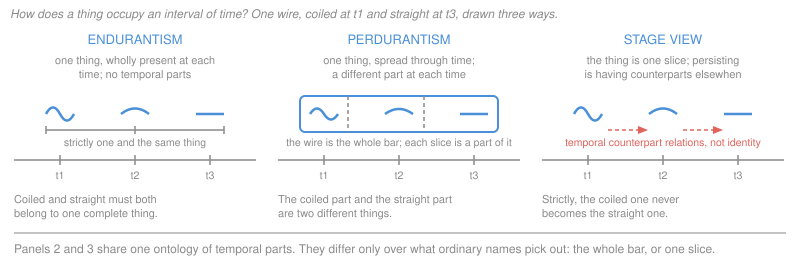

# Metaphysics · Lesson 5.4: Endurance, perdurance, and stages

> ⏱ ~15 min · Module 5: Time and persistence · Builds on: [5.3 Coincidence and the Ship of Theseus](05-03-coincidence-and-the-ship-of-theseus.md) · Unlocks: [6.1 Determinism and the consequence argument](06-01-determinism-and-the-consequence-argument.md)

## Why this matters

[5.3](05-03-coincidence-and-the-ship-of-theseus.md) left you with a bill. The statue and the lump of clay differ, so by Leibniz's law they are two — yet they share every particle. Each repair on offer cost something: deny that constitution is identity and you owe an account of what constitution *is*; take dominant kinds and you owe a ranking; take mereological essentialism and the ship stops surviving a single replaced plank.

There is a fourth answer that does not repair the puzzle but stops it being one, and it comes from changing the picture of how a thing occupies time — a change small to state and enormous to believe. Everything in Module 6 about persons is this lesson with the stakes raised: what you say here about a wire fixes what you may say about yourself.

## The idea

Start with space, where the answer is not controversial. How does a carpet occupy a room? Not by being wholly present in every square metre. It occupies the room by having a part here and a part there — the whole carpet is spread across the region, and no proper part of the region contains all of it.

Now ask the same question about time. A wire lasts from noon to two. How does it occupy that interval?

**Answer one — it endures.** At every instant in the interval the *whole wire* is there. Not a slice of it, not a phase: all of it. The wire has spatial parts but no **temporal parts**. Run your hand along it at 12:30 and you touch the entire object; come back at 1:30 and you touch the entire object again, the very same one. This is **endurantism**, or **three-dimensionalism**: things are extended in three dimensions and last through a fourth.

**Answer two — it perdures.** The wire occupies the interval exactly the way the carpet occupies the room: by having a different part at each part of the region. The wire is a four-dimensional object, a **spacetime worm**, and what is present at 12:30 is a momentary part of it — its 12:30 **temporal part**, or **stage**. This is **perdurantism** (the **worm view**). The labels *endure* and *perdure* became standard through David Lewis.

**Answer three — it is a stage.** Accept the four-dimensional ontology in full: spacetime is filled with momentary stages and with the long worms they compose. Then ask a separate question — which of those objects do our words pick out? The **stage view** (Theodore Sider's) answers: the momentary one. "The wire" names the stage present now, not the worm, so the wire is an object that lasts an instant. Persistence talk is then handled the way modal talk is handled on counterpart theory ([3.2](03-02-what-possible-worlds-are.md)): "the wire was coiled an hour ago" is true because a stage an hour ago, standing in the right relation of causal and qualitative continuity to this one, was coiled. That relation is a **temporal counterpart relation**, and it is not identity.

Note what the second and third views share and where they part. They agree completely about what exists — the same worms, the same stages. They disagree about **semantics**: what ordinary names and demonstratives refer to. That is why **four-dimensionalism**, the thesis that things have temporal parts, covers both.

## The argument

The engine of the debate is one objection to answer one, put in its modern form by Lewis in *On the Plurality of Worlds*, while comparing how a thing persists through time with how it exists across possible worlds: **the problem of temporary intrinsics**.

An **intrinsic** property is one a thing has in virtue of how it is in itself, not in virtue of how it relates to anything else. Being an uncle is extrinsic; being coiled is not a relation you bear to something, it is how you are, full stop.

> **P1.** Shape properties are intrinsic: a thing has them *simpliciter*, not relative to anything.
> **P2.** The wire is coiled at noon and straight at two.
> **P3.** An enduring thing is wholly present at noon and wholly present at two — the same complete thing, all of it, at each.
> **P4.** Nothing has incompatible intrinsic properties *simpliciter* (Leibniz's law, from [5.3](05-03-coincidence-and-the-ship-of-theseus.md)).
> **∴ C.** P1–P4 cannot all be true.

In words: if all of you is there at both times and shape is just a way you are, then you are both coiled and straight, which is a contradiction.

Lewis offered a trilemma, and a fourth option grew up alongside it. Each is a denial of a numbered premise.

**(i) Relativize the properties to times — deny P1.** There is no such property as *coiled*, only *coiled-at-noon*, a relation between an object and a time. No contradiction: the wire bears one relation to noon and another to two. Lewis's complaint is an appeal to intuition rather than a proof — shapes are not relations to anything, and on this view a lonely object at a single instant would have no shape at all.

**(ii) Modify the *having*, not the property — deny P4 as stated.** This is **adverbialism** (associated with Mark Johnston, and close to E. J. Lowe's time-indexed instantiation): the wire is coiled *noon-ly* and straight *two-ly*. The property stays intrinsic and unrelativized; what is indexed to a time is the instantiating, and P4 was only ever plausible for having in the same manner. The standard objection is that adverbial modification of instantiation is obscure, and that the obscurity may be (i)'s relationality hidden in the copula.

**(iii) Presentism — deny P2's presupposition.** If only the present is real ([5.2](05-02-presentism-growing-block-eternalism.md)), there is no other time at which the wire has the other shape. It has exactly one shape *simpliciter*, the present one, and the past-tensed truth that it was coiled is made true by something else — the truthmaker debt 5.2 charged presentism. The problem is not solved; it never arises. Lewis rejected this because he rejected presentism, not because the reply fails on its own terms.

**(iv) Perdurance — deny P3.** The thing that is coiled and the thing that is straight are **two different things**: two temporal parts of one worm. No single object has both properties, so there is nothing to contradict. The worm is coiled *at noon* derivatively — by having a noon part that is coiled *simpliciter*.

The stage view takes (iv)'s ontology and adds that "the wire" names the coiled stage. The neo-Aristotelian sits at (ii) with a reason: the substance is what has the accidents, and accidents are had *at a time* precisely because a substance is the kind of thing that stands under change ([2.1](02-01-substance-and-accident.md), [2.2](02-02-change-act-and-potency.md)). **Hylomorphic endurance** adds an independent objection to (iv): a temporal part of a dog is not a dog and not a substance, so the worm view replaces substances with aggregates of non-substances, and unity by form with unity by summation ([2.3](02-03-hylomorphism-and-composition.md)).

One more argument belongs on the four-dimensionalist's side, promised back in [2.3](02-03-hylomorphism-and-composition.md), whose **argument from vagueness** concluded that composition cannot be restricted without vagueness in existence itself. Sider extends it across time: accept unrestricted composition in the temporal direction too, so that *every* filled region of spacetime has an occupant. Then it is never vague whether some stages compose an object — they always do. The bill is an ontology of arbitrary objects.

## Map of positions

| | **Endurantism** | **Perdurantism (worm)** | **Stage view** |
|---|---|---|---|
| What is present now | the whole object | a temporal part of it | the object itself |
| Temporary intrinsics | relativize, adverbialize, or go presentist | different parts bear them | different objects bear them |
| Statue and lump on Wednesday | two coincident things, or one — the 5.3 menu | two worms sharing a part | one object, two counterpart relations |
| "I existed yesterday" | strictly true, of me | strictly true, of the worm | true by counterpart, not identity |
| Requires about time | compatible with all three ontologies | other times must be real (eternalism) | other times must be real (eternalism) |
| Change is | a subject acquiring a contrary | qualitative variation across parts | one stage, then a distinct counterpart |

The "requires" row is what [5.2](05-02-presentism-growing-block-eternalism.md) was for. If only the present exists, there are no non-present parts for a worm to be made of, so presentist perdurance looks unstable from the start; whether a present-tensed surrogate for temporal parts is a view or a relabelling is Boss 5's question. Endurance has no such constraint: an eternalist can hold that the block contains objects wholly present at each time they occupy. So the B-theory does not by itself deliver temporal parts — a common slide worth refusing.

## Worked examples

**Example 1 (the clean case — the statue and the lump as overlapping worms).** This is what four-dimensionalism does best, so run it slowly.

Set up 5.3's case with dates. A lump of clay is formed on Monday; on Tuesday a sculptor shapes it into a statue; on Thursday the statue is squashed back into a shapeless lump, which sits in the studio until Friday. Call them **Statue** and **Lump**.

1. **The puzzle.** Lump existed on Monday and Statue did not, so they differ and by Leibniz's law they are two. But on Wednesday they are in exactly the same place, made of exactly the same particles: two material objects, one place, one time.
2. **The perdurantist's redescription.** Lump is a worm stretching Monday to Friday. Statue is a worm stretching Tuesday to Thursday. Each has a temporal part at each moment of its career.
3. **Where the difference lives.** Lump has a Monday temporal part; Statue has none. Lump has a Friday part; Statue has none. So the two worms differ in their parts, and differing in parts is enough for being two. **Leibniz's law is satisfied without any special pleading** — the property Lump has and Statue lacks is a perfectly ordinary mereological one.
4. **Where the coincidence goes.** Between Tuesday and Thursday the two worms **share their temporal parts**. Sharing a part is not identity, and nobody finds shared parts mysterious: two roads that run together for six miles share that stretch of asphalt without being one road. So Wednesday's "two objects in one place" is really "one object that is a part of two longer objects," which no more threatens Leibniz's law than the six-mile stretch does.
5. **Check the predications.** Does Statue weigh ten kilograms on Wednesday? Yes — derivatively, because its Wednesday part does; and so does Lump, by the very same part. Does Lump survive the squashing? Yes, it has Friday parts. Does Statue? No. Every verdict falls out of the worms' extents. The question that generated the puzzle — *how can two things be in one place?* — turns out to be malformed once objects are spread through time. It is not answered; it dissolves.

Now the wrinkle that shows the price. Suppose the sculptor makes the statue by pressing two prepared halves together, so Statue and Lump begin at the same instant, and squashes it, so they end at the same instant. Now the worms coincide *entirely*, and step 3 has nothing to work with. The worm theorist must either say Statue is Lump — conceding that the statue could have survived squashing after all — or find the difference somewhere other than in parts. The usual route is **counterpart theory** ([3.2](03-02-what-possible-worlds-are.md)): one worm, described as a statue, has statue-counterparts in other worlds; described as a lump, lump-counterparts; and "the statue could not survive squashing" is true under the first description, false under the second. That works, and it makes modal properties description-relative — which many take to be where the cure becomes worse than the disease.

**Example 2 (where it strains — counting, and whether anything changes).** Two objections, one to each of the four-dimensionalist views.

*Counting under fission, against the worm view.* An amoeba, Amo, sits in a dish at eleven. At noon it divides cleanly into two daughters, Lefty and Righty, each continuous with what came before and neither favoured. How many amoebas were in the dish at eleven?

The worm theorist's ontology contains two worms: one running from Amo's origin through the eleven o'clock stage into Lefty, another through that same stage into Righty. They share every pre-noon part and diverge at noon. So counting by identity gives **two amoebas at eleven** — and there was plainly one in the dish. Lewis's reply, from his work on survival, is to count by *identity-at-a-time*: the two worms share their eleven o'clock part, so they are identical-at-eleven and that relation counts them as one. It works, at the price of making how many things there are depend on which relation you count by. The stage theorist needs no such device: at eleven there is exactly one amoeba stage, so exactly one amoeba, which has two noon-counterparts and so will survive twice over. Odd to say, but the question we asked comes out right the first time. (The human version, and whether identity is what matters in it, is [6.6](06-06-personal-identity-over-time.md)'s.)

*The "no change" objection, against both.* A poker is hot at one end and cold at the other. It is not therefore *changing*; it is merely varied across its length. On the perdurantist's account, the wire's going from coiled to straight is that same kind of variation taken in a different direction. So — the objection runs — four-dimensionalism does not analyse change, it abolishes it and leaves a static pattern in its place. The neo-Aristotelian sharpens this: change requires one subject that was in potency to what it is now in act ([2.2](02-02-change-act-and-potency.md)), and a series of qualitatively different parts is not a subject becoming different but a succession of things, which is replacement.

The perdurantist replies that the demand is incoherent — what is wanted is a single thing that both has and lacks a property, which no theory can supply. Change *is* qualitative variation along the temporal dimension of one continuant, and the worm is one continuant. The stage theorist's version is sharper and dearer: strictly, the coiled thing never becomes straight, since it is one object and the straight thing another; what is true is that it *has a straight counterpart later*, which is what we always meant.

Either way the crux is one premise: **whether change requires a numerically identical subject on both sides of it.** The neo-Aristotelian asserts it, the four-dimensionalist denies it, and no case settles it, because both sides agree on every observable fact about the wire. Both owe something further — the endurantist an account of having-at-a-time, the four-dimensionalist an account of why anyone should care about a counterpart.

## Watch out

- **Perdurantism is not the stage view.** The perdurantist says you are a worm and what is here now is a part of you. The stage theorist says you are what is here now. Getting these backwards is the most common error in the topic, and it is an exegetical error, graded strictly.
- **"Four-dimensionalism" is ambiguous**, meaning sometimes the temporal-parts thesis and sometimes eternalism about time ([5.2](05-02-presentism-growing-block-eternalism.md)). These are different claims — an eternalist can be an endurantist — so say which you mean. "Wholly present" is slippery in the other direction: it is usually cashed out as *having no temporal parts*, so it names the dispute rather than settling anything in it.
- **A temporal part is not a slice of a photograph.** It is as concrete as the thing it is a part of — a real object with mass and shape, just short-lived. The picture of thin abstract slices is what makes the view sound mad to people who have not seen it stated.
- **Perdurance does not settle the Ship of Theseus; it relocates it.** The view tells you there are many worms in the vicinity — the plank-replacement worm, the reassembled-planks worm — and exactly which sentences are true of each. What it does not tell you is which of them "the Ship of Theseus" picks out. The puzzle becomes a question about reference rather than about objects, and whether that is a dissolution or a relabelling is Boss 5(d)'s question, not one this lesson settles.
- **Lewis did not refute the relativizing reply.** He said shapes are not relations, which is an appeal to how things seem: a legitimate move in metaphysics, not a proof. An endurantist who bites the bullet is not making a mistake, and no rubric here rewards saying otherwise.
- **The stage view's cost is not weirdness but concern.** If I am a momentary stage, then strictly I did not exist yesterday and will not exist tomorrow — someone suitably related did and will. The objection (Kripke's against counterpart theory, in the temporal key) is that it is unclear why I should care about, or answer for, what a numerically distinct object does. That is [6.6](06-06-personal-identity-over-time.md)'s terrain.

## One-liner

> Ask how a thing occupies an interval of time — all of it at every instant, or a different part at each — and every verdict in this module follows: the statue and the clay stop competing for a place, and change stops being something a single subject undergoes.

## Problems

**P1 (🟢) *(Exegetical.)*** A copper wire is coiled at noon and straight at two o'clock.

(a) Write the problem of temporary intrinsics for this case as four claims that cannot all be true, one line each. (b) For each of four responses — relativizing shape to times, adverbialism, presentism, and perdurance — name the claim it rejects. (c) Which two of the four are available to a hylomorphic endurantist, and which one is not available to anyone who holds that other times are as real as this one?

**P2 (🟡) *(Exegetical (a) · Evaluative (b).)*** A bacterium, Bo, is in a dish at eleven. At noon it divides into two daughters, each fully continuous with what came before, neither favoured.

(a) How many bacteria were in the dish at eleven, according to (i) the worm theorist counting by identity, (ii) the worm theorist counting by identity-at-a-time, and (iii) the stage theorist? One line each, with the reason. (b) The stage view gets (a) right without a special counting relation, and pays for it by holding that nothing literally persists — no bacterium now existing was in the dish an hour ago. Say whether the counting advantage is worth that price, and name the one thing the two sides must disagree about for the dispute to be substantive rather than verbal. **150 words or fewer for (b).**

**P3 (🔴, optional) *(Exegetical (a) · Evaluative (b).)*** An invented paragraph from a museum conservator's report on a restored panel painting:

> "The panel we rehung last month is the same work the workshop delivered in 1745, though not one flake of the original pigment survives on its surface. What we conserve is never the stuff; it is the work, and the work is the whole career of the object. The 1745 surface is simply its earliest phase, and nothing is lost when a phase ends, because that phase is still there in 1745, where it always was. Critics who call the panel a replica are confusing the painting with one of its parts."

(a) Name the theory of persistence the paragraph assumes, quoting the words that carry it; then name the theory of time it needs and quote the clause that commits it. (b) A conservator who is an endurantist wants the same conclusion — that the restored panel is the same work — without temporal parts. What must she say instead, and what does it cost her? **150 words or fewer for (b).**

Solutions

**P1** *(Exegetical — strict.)*

**Must hit, strict:**
- (a) The four claims: **(1)** shape properties are intrinsic and had *simpliciter*, not relative to anything; **(2)** the wire is coiled at noon and straight at two; **(3)** the wire is wholly present — the same complete thing — at noon and at two; **(4)** nothing has incompatible intrinsic properties *simpliciter* (Leibniz's law). Full credit needs the word *intrinsic* doing work in (1) and the completeness of presence in (3); a version that only says "the wire has two shapes" has not stated the problem.
- (b) **Relativizing** rejects (1) — being coiled becomes a relation to a time. **Adverbialism** rejects (4) as stated, by indexing the *manner of having* rather than the property, so nothing has incompatible intrinsics in the same manner. **Presentism** rejects (2)'s presupposition that both times are there to host shapes; the wire has one shape simpliciter, the present one. **Perdurance** rejects (3) — the noon thing and the two o'clock thing are distinct temporal parts.
- (c) The hylomorphic endurantist can take **relativizing or adverbialism**, and adverbialism is the natural fit, since accidents are had by a substance at a time. **Presentism** is the one unavailable to anyone holding that other times are as real as this one.

**Wrong turns:** saying adverbialism rejects (1) — it is designed precisely to keep the property intrinsic and unrelativized, and the difference from relativizing is the whole point of the position; saying perdurance rejects Leibniz's law (it satisfies it, by supplying two bearers); listing presentism as an option for the eternalist endurantist.

---

**P2** *(a) exegetical — strict; (b) evaluative — any verdict.*

**Must hit, strict (a):**
- (i) **Two.** The worm theorist's ontology has two worms sharing every pre-noon part and diverging at noon, so counting objects by identity delivers two bacteria at eleven.
- (ii) **One.** Counting by *identity-at-eleven* — sharing an eleven o'clock temporal part — the two worms are identical-at-eleven, so they count as one. This is Lewis's move, and it must be named as a change in the counting relation, not as a change in the ontology.
- (iii) **One.** There is exactly one eleven o'clock stage, and on the stage view the bacterium *is* the stage. No special relation is needed; the price is paid elsewhere, in what "will divide" comes to (having two noon counterparts).

**Must hit, any verdict (b):** state the cost precisely — on the stage view persistence claims are true by counterpart, so strictly no presently existing bacterium was in the dish an hour ago — and then name a crux. Acceptable cruxes, any one stated clearly: whether counting-by-a-relation-other-than-identity is a legitimate primitive or an ad hoc repair; whether ordinary names refer to momentary or extended objects (a semantic question, which is what makes the worry that the dispute is verbal a live one); or whether a counterpart relation can support the practical attitudes — care, anticipation, responsibility — that persistence claims normally carry. Either verdict passes if the price is stated before it is weighed.

**Wrong turns:** treating the worm theorist's "two" as an outright refutation — Lewis's tensed counting is a stated reply and must be engaged; saying the stage view has no answer to "it will divide" (it has one: two noon counterparts); answering (b) with the biology of division rather than with the metaphysics.

**Model answer (b), one of several:** Worth it, but only because the two views do not really disagree about the world. Both posit the same stages and the same worms; they differ over which of those our count nouns pick out. Given that, the stage view's advantage is that it gets ordinary counting right without a second counting relation, and its "cost" is not an extra commitment but a consequence of the same semantics — persistence talk is counterpart talk. The crux is whether that is enough: whether a counterpart relation can carry the weight that identity carried, in caring about the future and in holding things answerable for the past. If it can, the dispute is verbal and the stage view wins on convenience; if it cannot, the worm theorist's extra counting relation is the cheaper of the two prices.

---

**P3** *(a) exegetical — strict; (b) evaluative — any verdict.*

**Must hit, strict (a):** the paragraph assumes **perdurantism**, the worm version specifically. The words that carry it: **"the work is the whole career of the object"** (the painting is a four-dimensional whole, not something wholly present now), **"its earliest phase"** (a temporal part), and **"confusing the painting with one of its parts"** (which only makes sense if the 1745 object is a proper part of the painting). It needs **eternalism** ([5.2](05-02-presentism-growing-block-eternalism.md)), and the clause that commits it is **"that phase is still there in 1745, where it always was"** — a worm needs its non-present parts to exist in order to have them, so the reassurance fails outright if only the present is real. Identifying the view without pointing at "the whole career" or "phase" is half credit; a fully correct answer must also see that eternalism is *required*, not merely congenial.

**Must hit, any verdict (b):** the endurantist has to locate sameness in something wholly present now — the same substance or form persisting through material replacement, or spatiotemporal and causal continuity of the object itself, or continuity of the artefact-kind under a sortal. She must then say what is doing the identifying, since the matter has all gone: form or organization rather than stuff (with the debt of saying how much reorganization is survivable), or a continuity relation (with the debt that continuity is a matter of degree while identity is not, which is where the Ship of Theseus returns — [5.3](05-03-coincidence-and-the-ship-of-theseus.md)). Credit requires naming both the replacement account and its debt.

**Wrong turns:** calling the paragraph a *stage* view — it says the opposite, that the painting is the whole career and the critics err by fixing on a part; treating "nothing is lost when a phase ends" as compatible with presentism because the past is "in the record"; answering (b) with conservation ethics rather than with a persistence condition.

**Model answer (b), one of several:** She has to say that one and the same work is wholly present now, and that what makes it the same is not its matter but its form — the arrangement, the design, the causal history of the artefact under the sortal *painting* — which the restoration preserved through the replacement of every particle. That is available, and it is the ordinary view of restoration. What it costs is a threshold: form-continuity comes in degrees, and she must say how much replacement and reinterpretation the work survives, or admit that identity here is vague in a way the four-dimensionalist's mereology is not. The Ship of Theseus is the same debt, and the reassembly case is the sharpest version of it: if someone recovers the original flakes and mounts them, her account has to say which panel is the work.

## Flashback

**F1 (🟡) *(Exegetical (a) · Evaluative (b).)*** From [5.2](05-02-presentism-growing-block-eternalism.md). A ship's log, itself long destroyed, once recorded that the anchor chain parted at 03:14 on a night in 1893. The claim *the chain parted at 03:14* is true today.

(a) For each of presentism, the growing block and eternalism, say in one line what makes that claim true now — what the truthmaker is, or why the view says no truthmaker at another time is needed. (b) One of the three faces the sharpest version of the truthmaker objection here. Name it, then say whether the standard escape — locating the truthmaker in a present-tensed feature of the world now, such as a property of having-been-such, or a primitive past tense — is an answer or a relabelling. **120 words or fewer for (b).**

Solution

**Must hit, strict (a):**
- **Presentism.** Only the present exists, so the 1893 parting does not exist to make anything true. The truth must be grounded in something existing now, and presentism owes the account — nothing at 03:14 is available to be the truthmaker.
- **Growing block.** The past exists (the block has grown to include it), so the 1893 event is there and is the truthmaker, exactly as an eternalist's is. The growing block's difficulty is at the other end — the unreality of the future, and the "how do you know you are at the leading edge?" objection — not here.
- **Eternalism.** All times are equally real; the 03:14 parting exists tenselessly at its own location in the block and makes the claim true, with tense handled as an indexical about where the utterance sits.

**Must hit, any verdict (b):** name **presentism** as the view in difficulty, and state the escape precisely before judging it — that the truthmaker is a present feature (a property the world now has of having-contained-such-an-event, or an irreducible past-tense fact). Then apply a test either way: does the posited present feature do explanatory work independent of the past truth it is introduced to underwrite, or is it individuated by that truth? Both verdicts pass. What fails is not stating the escape before rejecting it.

**Wrong turns:** answering that the log is the truthmaker — the problem is stated with the log destroyed for exactly that reason, and a surviving record would only push the question back to what makes the record accurate; treating the growing block as facing the same truthmaker problem, when it owns the past outright; saying eternalism needs a *present* truthmaker, which is the presentist's requirement, not the eternalist's.

**Model answer (b), one of several:** Presentism. The escape is to say that the world now has the property *having-been-such-that-the-chain-parted*, so the truthmaker is present after all. That is an answer only if the property is more than a shadow of the truth it grounds. A present property that can be specified in no other way than by the past-tense sentence it makes true is individuated by its job, which is what relabelling looks like. A presentist who can tie the property to present traces with independent structure — causal residue, current states that constrain which pasts are possible — has something better. Which of these the view actually offers decides it.

## Connections

- **Backward:** [5.3](05-03-coincidence-and-the-ship-of-theseus.md) generated the coincidence puzzle and priced the three-dimensional repairs; this lesson is the fourth answer and the only one that denies the question. [5.2](05-02-presentism-growing-block-eternalism.md) supplies the ontologies of time that the last row of the table depends on, and presentism is one of the four replies to temporary intrinsics. [2.1](02-01-substance-and-accident.md)'s contraries test and [2.2](02-02-change-act-and-potency.md)'s analysis of change are exactly what the "no change" objection is made of; [2.3](02-03-hylomorphism-and-composition.md) is where the vagueness argument was posed and this is the four-dimensionalist's answer to it. [3.2](03-02-what-possible-worlds-are.md)'s counterpart theory does double duty here — for the fully coincident statue and for temporal counterparts.
- **Forward:** [6.5](06-05-what-a-person-is.md) and [6.6](06-06-personal-identity-over-time.md) are this lesson with a person as the object: psychological continuity is a counterpart relation in all but name, animalism is endurantist about organisms, and Parfit's fission case is Example 2 with someone in the dish. Module 6 opens at [6.1](06-01-determinism-and-the-consequence-argument.md) with determinism, whose "the agent could have done otherwise" needs an agent that persists to have done it.
- **Sideways:** the argument from the relativity of simultaneity to a four-dimensional block — Rietdijk and Putnam's argument, and Stein's reply — is owned by `philosophy-of-physics` 4.3, which cites this course back for the metaphysics; the physics of simultaneity itself is [`relativity`](../../relativity/syllabus.md) 1.1. Two claims are often made in one breath and should be kept apart: that relativity threatens *presentism*, by removing a privileged global present, and that it favours *perdurance*, by making "the whole thing at an instant" frame-relative. Both are stated here and derived there. This course does not adjudicate the physics.
- **Method:** P3 is a diagnose problem in [`philosophical-method`](../../philosophical-method/syllabus.md)'s sense — a passage whose conclusion rides on a metaphysical commitment it never announces — and the crux at the end of Example 2 is crux-finding where both sides agree on every observable fact and divide on one premise about what change requires.
