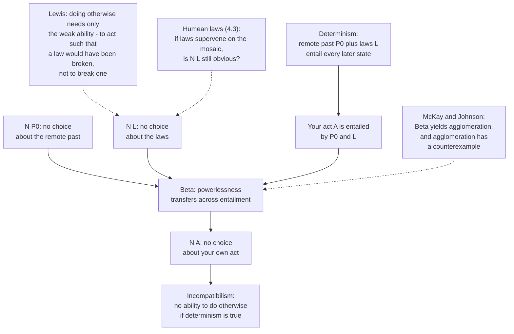

# Metaphysics · Lesson 6.1: Determinism and the consequence argument

> ⏱ ~15 min · Module 6: Free will and persons · Builds on: [5.4 Endurance, perdurance, and stages](05-04-endurance-perdurance-and-stages.md) · Unlocks: [6.2 Compatibilism](06-02-compatibilism.md)

## Why this matters

Almost everyone who argues about free will in a bar is arguing about something other than determinism — fate, or predictability, or the thought that the future is "already written." Those are four different theses, and only one of them generates a serious argument. This lesson isolates the serious one, then builds the best argument in the literature that it rules out free will: van Inwagen's **consequence argument**, from *An Essay on Free Will* (1983). It is the argument every later lesson in this module is answering. [6.2](06-02-compatibilism.md) gives the compatibilist's positive story, [6.3](06-03-frankfurt-cases-and-alternate-possibilities.md) asks whether responsibility even needs the ability to do otherwise, and [6.4](06-04-libertarianism-and-its-critics.md) asks what happens if you accept the argument. None of that is doable until the argument is on the table in premises you can attack one at a time.

## The idea

**Causal determinism** is a thesis about the world, stated like this. For any instant, there is a proposition giving the complete physical state of the world at that instant. Call the one for some instant in the remote past **P0**, and let **L** be the conjunction of the laws of nature. Determinism says: P0 together with L *entails* the complete state of the world at every later instant. One past, one set of laws, exactly one future.

Three things determinism is not.

**Not fatalism.** Fatalism says an outcome will occur no matter what you do — your deliberation is idle, because the outcome is insensitive to it. (The ancient "idle argument": if you are fated to recover, calling the doctor is pointless.) Determinism says the opposite. In a determined world your deliberation is a link in the chain that produces the outcome, and had you deliberated differently the outcome would have been different. Determinism makes what happens depend on what you do; fatalism denies that it depends on anything you do.

**Not predictability.** Predictability is about what a knower could find out. A world can be perfectly deterministic and wildly unpredictable — chaotic systems amplify any imprecision in the initial state, so no finite measurement fixes the outcome. Laplace's demon is a dramatization of determinism, not its content: the thesis says the later state *follows from* the earlier one, whether or not anyone could ever compute it. The converse fails too. In an indeterministic world, outcomes can be predictable to any practical standard, because near-certain chances are still chances.

**Not the truth of future-tensed propositions.** "There will be a sea battle tomorrow" is either true or false now — at least if bivalence holds, which is where Aristotle worried in *De Interpretatione* IX, and which every eternalist from [5.2](05-02-presentism-growing-block-eternalism.md) accepts flatly. But a proposition's being true in advance is not a cause of anything. Truth records how the world goes; it does not push it. The slide from "already true" to "already fixed" is a scope error, and [3.1](03-01-kinds-of-necessity.md) names it: *necessarily, if it is true now that you will sit, then you will sit* is a harmless logical truth, while *if it is true now that you will sit, then necessarily you will sit* is the strong claim, and it does not follow. Keep the "necessarily" where it belongs, on the whole conditional.

Strip those away and the real thesis is left, together with the question of what it costs. The taxonomy:

| View | Determinism | Free will | Holds |
|---|---|---|---|
| **Compatibilism** | silent | yes | free will is consistent with determinism |
| **Incompatibilism** | silent | silent | free will is not consistent with determinism (a conditional claim only) |
| **Libertarianism** | false | yes | incompatibilism, plus we are free ([6.4](06-04-libertarianism-and-its-critics.md)) |
| **Hard determinism** | true | no | incompatibilism, plus determinism, so no free will |
| **Hard incompatibilism** | silent | no | no free will whether or not determinism holds ([6.4](06-04-libertarianism-and-its-critics.md)) |

The PhilPapers surveys report a clear majority of professional philosophers leaning compatibilist. That is where the profession sits; it is not an argument, and this lesson does not treat it as one.

## The argument

Van Inwagen's informal version runs: if determinism is true, our acts are the consequences of the laws of nature and events in the remote past; but what went on before we were born is not up to us, and neither is what the laws of nature are; so the consequences of those things — including our present acts — are not up to us either. He gives two ways of making this rigorous.

### Route 1 — the modal version, using a transfer principle

Introduce an operator. Write **N p** for:

> *p is true, and no one has, or ever had, any choice about whether p.*

In words: p is a settled feature of reality that no agent has any power over. Two rules govern it.

> **Alpha.** If p is necessarily true, then N p.
> In words: nobody has a choice about a necessary truth.
>
> **Beta (the transfer principle).** If N p, and N (if p then q), then N q.
> In words: powerlessness transfers across entailment. If you have no choice about p, and no choice about the fact that p brings q with it, you have no choice about q.

Now let **A** be the proposition that you did what you did at noon today. The argument:

1. **If determinism is true, then necessarily: if P0 and L, then A.** *(Definition of determinism: the remote past plus the laws entail today's state, and your act is part of today's state.)*
2. **So necessarily: if P0, then (if L then A).** *(Same claim, re-bracketed — pure logic.)*
3. **N (if P0, then (if L then A)).** *(From 2, by Alpha: it is a necessary truth, so nobody has a choice about it.)*
4. **N P0.** *(Fixity of the past: nobody has any choice about the complete state of the world a million years before they were born.)*
5. **N (if L then A).** *(From 3 and 4, by Beta.)*
6. **N L.** *(Fixity of the laws: nobody has any choice about what the laws of nature are.)*
7. **N A.** *(From 5 and 6, by Beta.)*

Conclusion: no one has, or ever had, any choice about what they did at noon. Generalize over agents and times and you get: if determinism is true, no one ever could have done otherwise.

Note exactly what is concluded. The argument targets **alternative possibilities** — the ability to do otherwise — not moral responsibility directly. Whether responsibility needs that ability is a separate question, and [6.3](06-03-frankfurt-cases-and-alternate-possibilities.md)'s business.

### Route 2 — the direct version, about an agent

Van Inwagen's other route stays concrete. A judge, at noon, declines to raise her hand and so lets an execution proceed. She was not restrained, not drugged, not coerced; on any ordinary description she could have raised it. Suppose determinism.

1. Her not raising her hand is entailed by P0 and L.
2. So if she had raised her hand, then either P0 would have been false, or L would have been false. *(There is no third option: the entailment leaves no room for the same past, the same laws, and a different act.)*
3. She cannot bring it about that a proposition about the state of the world before her birth is false.
4. She cannot bring it about that a law of nature is false.
5. So she cannot raise her hand.

Same conclusion, no modal operator. The two routes fail and succeed together, and the two standard attacks hit them at the matching joints: the transfer principle in Route 1, and steps 3–4 in Route 2.

### Attack surface 1 — deny the transfer principle

Thomas McKay and David Johnson showed that Beta is not a modest principle. It implies **agglomeration**:

> If N p and N q, then N (p and q).

The derivation is three lines. *If p, then (if q, then (p and q))* is a necessary truth, so by Alpha nobody has a choice about it. Feed that and N p into Beta: you get N (if q, then (p and q)). Feed *that* and N q into Beta: you get N (p and q).

And agglomeration has a counterexample. A coin sits in my pocket all morning; I never toss it, though I easily could have.

- Let **p** = *the coin does not land heads this morning.* True. Do I have a choice about it? No: there is nothing I can do that ensures the coin lands heads. Tossing it certainly does not. So N p.
- Let **q** = *the coin does not land tails this morning.* By the identical reasoning, N q.
- Their conjunction is *the coin lands neither heads nor tails this morning* — which is true only because it was never tossed. And that I did have a choice about. Tossing it would have made the conjunction false. So not-N (p and q).

N p, N q, and not N (p and q): agglomeration fails, so Beta fails, so step 5 and with it step 7 are unsupported.

The defenders' repair is to weaken Beta into an entailment form — roughly, *if N p, and p strictly entails q, then N q* — which blocks the derivation, because while p entails *(if q then (p and q))*, q does not on its own entail *(p and q)*, so the second application never gets going. But the repaired argument now needs a single premise saying that no one has a choice about **the conjunction of the remote past and the laws** — you can no longer build it from N P0 and N L separately, since that build *is* agglomeration. Incompatibilists say the conjunctive premise is as obvious as its conjuncts. Compatibilists say obviousness is exactly what a counterexample to agglomeration has put in doubt. Note what has happened: the repair has relocated the dispute rather than settled it.

### Attack surface 2 — local miracles, and what "able to break a law" means

David Lewis's "Are We Free to Break the Laws?" (*Theoria*, 1981) is the most misread paper in this literature, so state it exactly.

Lewis distinguishes two theses about an agent who, in a determined world, did not raise her hand:

> **Weak thesis.** I am able to do something such that, if I did it, a law of nature would have been broken.
>
> **Strong thesis.** I am able to do something such that, if I did it, my act would itself be, or would cause, a law-breaking event.

Lewis **accepts the weak thesis and denies the strong one.** He does not claim we can break laws. He claims the opposite: no one can break a law, and his compatibilism does not need anyone to. What it needs is only that, had she acted otherwise, the actual laws would have been slightly different — with the divergence occurring *before* her act, caused by nothing she did. She is able to raise her hand; if she had, a small miracle relative to our laws would have preceded it; she would not have performed that miracle, and no law-breaking would be among her doings. The weak thesis, Lewis argues, is not even surprising: it is what the counterfactual semantics of [4.2](04-02-counterfactual-causation.md) delivers for any deterministic world, and it ascribes to her no remarkable power at all.

Two things to keep straight. First, from inside the nearby world there is no miracle — the laws there are simply somewhat different laws; "miracle" is a description relative to *our* world's laws. Second, the weak reading of "able" is precisely what an incompatibilist will refuse: van Inwagen's reply is that the ability to do something-such-that-a-law-would-have-been-false is not the ability the free-will debate was ever about, because it is compatible with there being, right now, nothing she can do. Whether the weak ability is the relevant one is the crux; it does not get settled by either side's re-description of it.

A third line runs through [4.3](04-03-powers-dispositions-and-laws.md). The premise N L looks unassailable if laws are governing necessities imposed on the world (Armstrong, Dretske, Tooley) or the essences of powers. But on a Humean best-system view, the laws are nothing over and above the total mosaic of local facts — including today's acts — so what the laws are is partly a matter of what agents do. Some compatibilists (Beebee and Mele among them) argue that on that view N L loses its obviousness. Your metaphysics of laws is doing work in a free-will argument, which is a good illustration of why Module 4 comes first.

## Argument map

## Worked examples

**Example 1 — run the argument on a clean case.** At 9:04 this morning you declined a job offer. Let P0 be the complete state of the world in 1,000,000 BC, L the laws, and A the proposition *you decline the offer at 9:04*.

Step 1 is not an extra assumption; it is what determinism *means*, applied to this instant. Step 2 is bookkeeping: "if both P0 and L, then A" and "if P0, then (if L then A)" say the same thing. Step 3 is where Alpha earns its keep — the conditional in step 2 is a necessary truth, so it is not the kind of thing any agent has leverage on. Step 4 is the premise that feels unarguable: nothing you do now makes any difference to the distribution of matter in 1,000,000 BC. Beta then delivers step 5: you have no choice about the fact that, given the laws, you decline. Step 6 says the laws are not up to you. Beta again gives step 7.

Notice how little the argument assumes about *you*. It says nothing about your motives, your character, your brain, or whether you were coerced. That is its strength — it would apply just as well to a deliberator of any design — and it is also why compatibilists find it suspicious: an argument that ignores everything that distinguishes a free act from a coerced one has concluded that there is no difference.

**Example 2 — a hard case: run both attacks on the judge.** Return to Route 2 and put pressure on step 2. Suppose the judge had raised her hand at noon. What would have had to be different?

The incompatibilist reads step 2 as an impossible menu: she would have to *falsify a law* or *change the past*. Evaluate the counterfactual Lewis's way instead. The most similar world in which she raises her hand is one where, shortly before noon, a small divergence from our world's history occurs — a local miracle, after which everything runs on. The divergence is **earlier** than her act; her raising her hand neither is it nor causes it. So step 2 comes out true on the weak reading (something she is able to do is such that, had she done it, a law would have been false) while steps 3 and 4 are obviously true only on the strong reading (she cannot *falsify* anything). The argument needs one reading throughout and it is not obvious it can have it — which is exactly the equivocation charge of attack surface 2.

Now the other attack, on the same case. Steps 3 and 4 are two separate no-choice claims: one about the past, one about the laws. Step 5 needs them to combine. With Beta repaired into its entailment form, they no longer combine on their own — the combination is agglomeration, which the coin case refutes — so the judge argument must simply assume that she has no choice about the past-and-laws *conjunction*.

Where this leaves things is instructive, and it is the honest state of the dispute. The incompatibilist has two strong replies available: that the weak ability is not an ability to do otherwise in any sense that matters, and that the conjunctive premise is no less evident for having to be assumed. Neither reply is a refutation, and neither attack is a refutation either. What both attacks have done is convert an argument that looked like a proof into an argument that trades on a contested analysis of "able" and a contested principle about conjunctions — which is the usual fate of a valid argument with an unwelcome conclusion.

## Watch out

- **"Determinism means my choices make no difference"** is fatalism, not determinism. In a determined world your choices make all the difference; the question is whether *they* were up to you.
- **"Determined" does not mean "compelled."** The argument nowhere says the laws force you against your will. Reading necessitation as coercion imports the conclusion.
- **Determinism is not the claim that everything has a cause.** A world in which every event has causes that raise its probability without fixing it is a world of universal causation and no determinism.
- **Incompatibilism is a conditional.** It says free will and determinism cannot both hold. It does not say determinism holds; the incompatibilist who is a libertarian denies it.
- **Lewis is not saying we can break the laws of nature.** He says the opposite. If a summary of Lewis has him giving us law-breaking powers, the summary has collapsed the weak thesis into the strong one.
- **Beta is not a logical truth.** It looks like one, and it is not. Any use of "powerlessness transfers" in your own writing should now come with a flag.
- **Not-N p is weaker than it sounds.** "It is not the case that no one has a choice about p" means someone, at some time, has some choice bearing on p — not that you, now, are free with respect to it.

## One-liner

> If determinism is true your acts follow from a past you never touched and laws you never wrote — so the whole fight is over whether powerlessness really transfers down that entailment, and over what "able to do otherwise" was asking for in the first place.

## Problems

**P1 (🟢) *(Exegetical.)*** Four invented one-liners. For each, name which thesis it actually states — causal determinism, fatalism, a claim about predictability, or a claim about the truth of future-tensed propositions — and say in one sentence what it would take to make it into a statement of determinism (or why it already is one).

(a) "Your cancer will either kill you or it won't, so the treatment decision changes nothing."
(b) "Given the exact state of the atmosphere at midnight and the equations, tomorrow's weather is fixed — even though nobody will ever measure well enough to say what it is."
(c) "If it's true today that you'll marry her, then there's nothing you can do about it."
(d) "With enough brain data we'll be able to predict every choice a person makes."

**P2 (🟡) *(Exegetical (a) · Evaluative (b).)*** (a) Show, in three lines, how agglomeration follows from Alpha and Beta, then state the coin counterexample precisely — including *why* both N-claims hold and why the conjunctive one does not. Say which numbered step of the modal argument is thereby left unsupported. (b) The repaired principle (from N p, plus p's strictly entailing q, infer N q) blocks the derivation but forces the argument to assume outright that no one has a choice about the conjunction of the remote past and the laws. Does the repair save the argument or merely relocate the dispute? **150 words or fewer**, any verdict.

**P3 (🔴, optional) *(Exegetical (a) · Evaluative (b).)*** An invented paragraph from a popular philosophy podcast's show notes:

> "Lewis's answer to the consequence argument is that we *can* break the laws of nature — in a small way. Every free choice involves a little miracle, which is why he calls it local-miracle compatibilism. Determinism is true, the laws hold almost everywhere, and human freedom is the exception."

(a) The paragraph misstates Lewis's position in at least two distinct ways. Name them, and give Lewis's weak thesis and strong thesis in his own terms, saying which he accepts. (b) Grant Lewis the weak thesis. Is the weak ability the ability that the consequence argument was denying us? Name the crux between Lewis and van Inwagen and say what would have to be shown to move it. **150 words or fewer for (b)**, any verdict.

Solutions

**P1** *(Exegetical — strict.)*

**Must hit, strict:**
- **(a) Fatalism** — specifically the idle argument. It asserts that the outcome is insensitive to what is done. To make it determinism you would have to say instead that the outcome follows from the total prior state *including* the treatment decision, which is compatible with the decision making all the difference.
- **(b) Causal determinism**, already correctly stated — and the second clause makes the right point, that the thesis is about entailment, not about anyone's epistemic access. Nothing needs fixing.
- **(c) A claim about the truth of a future-tensed proposition**, sliding into a modal conclusion. The slide is the scope error: *necessarily, if it is true that you will marry her then you will* is harmless; *if it is true that you will marry her then necessarily you will* does not follow. To get determinism you would need premises about the laws and the prior state; the truth of the proposition supplies neither.
- **(d) Predictability**, and a weaker claim than determinism: reliable prediction is consistent with an indeterministic world of high chances, and determinism is consistent with unpredictability in principle. To make it determinism, drop the predictor entirely and assert that the complete prior state plus the laws entail the choice.

**Wrong turns:** calling (b) fatalism because "fixed" appears — the sentence explicitly makes the fixing a matter of state-plus-laws entailment; calling (d) determinism because a successful prediction would be evidence for it. Evidence for a thesis is not the thesis.

---

**P2** *(a) exegetical — strict; (b) evaluative — any verdict.*

**Must hit, strict (a):**
- The derivation: (i) *if p, then (if q, then (p and q))* is a necessary truth, so by **Alpha**, N (if p, then (if q, then (p and q))); (ii) with N p, **Beta** gives N (if q, then (p and q)); (iii) with N q, **Beta** gives N (p and q). That is agglomeration.
- The counterexample: an untossed coin. N (*it does not land heads*) holds because nothing available to the agent ensures heads — tossing does not, since the landing is not up to her. N (*it does not land tails*) holds for the identical reason. But *it lands neither heads nor tails* is true only because the coin was never tossed, and tossing it was up to her — she can render that conjunction false. So the conjunction is one she has a choice about, while each conjunct is not.
- Therefore **Beta** is invalid, which leaves **step 5** (and hence step 7) of the modal argument unsupported — the two Beta inferences are the only places the argument moves.

**Must hit, any verdict (b):** state what the repair does (blocks the second Beta application, since q alone does not strictly entail *(p and q)*); state what it costs (the conjunctive premise N (P0 and L) must now be assumed, not derived); then give a reason bearing on whether that premise can be assumed. Either verdict passes if the exchange — a valid principle bought with a stronger premise — is named.

**Wrong turns:** claiming the coin case shows the agent has a choice about how the coin lands (it does not, and the counterexample does not need it); treating the repair as a refutation of the counterexample rather than a redesign around it; concluding that Beta's failure shows compatibilism is true — it shows one argument for incompatibilism is unsupported as stated.

**Model answer (b), one of several:** It relocates it. The entailment form of the transfer principle is defensible, so the incompatibilist has a valid argument again — but the work has moved into a premise that used to be a conclusion. Before, N (P0 and L) was *derived* from two premises each of which looked self-evident; now it is asserted. And the coin case is precisely a demonstration that a conjunction of no-choice facts can be something one has a choice about, so the intuition supporting the conjuncts no longer automatically supports the conjunction. That said, the conjunctive premise is not obviously false, and nobody has produced a case where an agent has a choice about the past-and-laws conjunction. The repair buys validity; whether it buys soundness now depends on an intuition that has been shown to be less general than it looked.

---

**P3** *(a) exegetical — strict; (b) evaluative — the crux is what is graded.*

**Must hit, strict (a):** at least two of the following misstatements, correctly identified.
- **"We can break the laws."** Lewis denies exactly this. He holds no one is able to break a law; that is the **strong thesis**, and he rejects it.
- **"Every free choice involves a little miracle."** No miracle occurs in the actual world on Lewis's view. The divergence miracle is a feature of the *counterfactual* world used to evaluate what would have happened had the agent acted otherwise, and in that world it occurs *before* the act and is neither caused by nor identical to it.
- **"The laws hold almost everywhere; freedom is the exception."** On Lewis's view the actual laws hold without exception, everywhere. Nothing is an exception to them.
- The two theses, stated correctly: **weak** — I am able to do something such that, if I did it, a law of nature would have been broken; **strong** — I am able to do something that would itself be, or would cause, a law-breaking event. Lewis **accepts the weak and denies the strong.**

**Must hit, any verdict (b):** name the crux — whether the weak ability is the ability at issue in the free-will dispute, i.e. whether "could have done otherwise" is correctly analysed by a counterfactual whose nearest world involves a pre-act divergence, or requires the ability to act otherwise *holding the actual past and laws fixed*. Then say what kind of consideration would move it (a defensible general analysis of ability; a case where the two abilities come apart in a way we have independent verdicts about). Either verdict passes if the crux is stated as a disagreement about the analysis of ability, not as a disagreement about whether laws can be broken.

**Wrong turns:** arguing that Lewis wins because he never says we break laws — van Inwagen's objection concedes that and attacks the weak ability's relevance; arguing that van Inwagen wins because a divergence miracle is "spooky" — it is a device of the counterfactual semantics, and its spookiness is not a premise.

**Model answer (b), one of several:** The crux is what "able" means when the past and laws are held fixed. Van Inwagen's ability is one you exercise against a fixed background: given exactly this past and these laws, is there something else you can do? Lewis's is a counterfactual ability: is there an act such that, had you performed it, things would have run coherently — with a prior divergence you did not bring about? They come apart only in deterministic worlds, which is why the dispute is hard to adjudicate from cases. Moving it takes a general account of ability that is motivated independently of the free-will debate and then applied. Until someone has one, each side can accuse the other of building its verdict into the analysis, and both accusations are fair.

## Flashback

**F1 (🟡) *(Exegetical (a) · Evaluative (b).)*** From [5.3](05-03-coincidence-and-the-ship-of-theseus.md). A survey office writes:

> The Kessler Glacier was first mapped in 1898. Ice enters it as snowfall at the head and leaves as meltwater at the snout; by 1974 not one crystal mapped in 1898 remained in it. In 1974 a rockfall split the tongue, and the lower portion, now stagnant, was renamed the Kessler Remnant.

(a) Set out, in numbered premises, the Leibniz's-law argument that the glacier is not identical to the ice that constitutes it at a given time, naming the property in which the two are alleged to differ. Then give the verdict on what the survey office is tracking — how many objects, and what happened to each — for each of: **constitution is not identity**, **dominant kinds**, **mereological essentialism**, and **sortal-relative identity**. (b) The office wants one entry in its register. Which verdict should it record, and what does that cost it to say elsewhere? **120 words or fewer for (b).**

Solution

**Must hit, strict (a):**

The argument (any equivalent numbering):
1. The glacier mapped in 1898 still exists in 1974.
2. The ice that constituted it in 1898 does not exist in the glacier in 1974 — every crystal has melted away.
3. If x is identical to y, then x and y share every property — Leibniz's law, the indiscernibility of identicals.
4. The glacier and the 1898 ice differ in a property: *being present in the valley in 1974*.
5. So the glacier is not identical to the ice that constituted it in 1898.

The differing property here is survival through total material turnover; a modal version works equally — this body of ice could be trucked away and dumped in the sea, and the glacier could not survive that. What makes the case a puzzle is that at any single moment the glacier is nothing over and above the ice then in the valley, occupying exactly its region.

The verdicts:
- **Constitution is not identity** (Wiggins, Baker): **two** objects at any moment, coinciding. The ice then present constitutes the glacier without being it; the glacier persists through total turnover, each body of ice does not. The cost is coincident objects and the question of what distinguishes them given identical matter.
- **Dominant kinds** (Burke): **one** object. The glacier is the dominant kind; there is no separate persisting body of ice in the valley to compete with it, only ice that comes to compose a glacier and ceases to. The cost is that the ice as such drops out of the inventory the moment it joins the glacier.
- **Mereological essentialism** (Chisholm): strictly, **an enormous number** of objects. Each addition or loss of a crystal yields a numerically different whole, so the 1898 object ceased to exist almost immediately. "The Kessler Glacier" names a loose-and-popular object tracked for practical purposes, not a strict one. The cost is that nothing in the landscape persists for long.
- **Sortal-relative identity** (Geach): identity questions take a sortal. What is in the valley now is **the same glacier** as the 1898 thing but **not the same body of ice**, and there is no sortal-free answer to "is it the same?" The cost is giving up absolute identity and, with it, the straightforward use of Leibniz's law in premise 3.

**Must hit, any verdict (b):** pick a verdict; name the concrete consequence the office must live with elsewhere in the register — e.g. dominant kinds forces it to deny that any body of ice in the valley is an object in its own right; constitution forces it to record two coincident things at every survey; mereological essentialism forces it to deny that today's glacier is the one mapped in 1898; relative identity forces it to refuse the bare question "is it the same?" without a sortal. Any verdict passes if the cost is named and is the right cost for that view.

**Wrong turns:** answering premise 4 by denying that the 1898 ice ever existed, without saying which view licenses that; treating the 1974 rockfall as the whole puzzle — the Leibniz's-law problem is already there in the ordinary turnover, with the glacier intact; reaching for temporal parts, which is a real answer but belongs to [5.4](05-04-endurance-perdurance-and-stages.md) and was not on the menu asked for.

**Model answer (b), one of several:** Record one continuous glacier from 1898, and take the constitution view. The register is tracking a glacier, not a body of ice, and constitution lets the office say the true things on both sides: the glacier is older than any ice now in it, it survived total turnover, and the ice that left is gone. The cost is a commitment to two coincident things at every survey — the glacier and the ice constituting it — which it must admit if pressed, rather than pretending one name covers a single thing under two descriptions.

## Connections

- **Forward:** [6.2](06-02-compatibilism.md) develops the compatibilist's positive account of freedom, which is what the local-miracle move above was clearing room for; [6.3](06-03-frankfurt-cases-and-alternate-possibilities.md) asks whether moral responsibility needs the ability to do otherwise at all, which would leave this argument's conclusion standing but defanged; [6.4](06-04-libertarianism-and-its-critics.md) takes the argument to be sound and asks what indeterminism could buy.
- **Back:** [4.3](04-03-powers-dispositions-and-laws.md) supplies the metaphysics of laws that the premise "no one has a choice about the laws" leans on; [4.2](04-02-counterfactual-causation.md) supplies the counterfactual semantics that Lewis's weak thesis is read off; [3.1](03-01-kinds-of-necessity.md) supplies the necessity distinctions and the scope fallacy that separates bivalence from fatalism; [5.2](05-02-presentism-growing-block-eternalism.md) is where "the past is fixed" gets its ontology, and it is worth asking whether the presentist and the eternalist can mean the same thing by it.
- **Sideways:** divine foreknowledge and human freedom — the theological analogue of this argument, with God's past belief in place of P0 — belongs to [`philosophy-of-religion`](../../philosophy-of-religion/syllabus.md); the Thomist and Molinist accounts of grace and freedom belong to `creation-grace-last-things`, and [6.4](06-04-libertarianism-and-its-critics.md) marks that bridge. Moral responsibility as a topic in ethics is cross-referenced from [`ethics`](../../ethics/syllabus.md), which cedes it here; theories of punishment go to `philosophy-of-law`.
- **Method:** the consequence argument is a case study in [`philosophical-method`](../../philosophical-method/syllabus.md)'s point that a valid argument with an unwelcome conclusion is an invitation to run it backwards — the compatibilist's confidence in her own freedom is itself evidence against a premise, and saying which premise is the whole difficulty.
