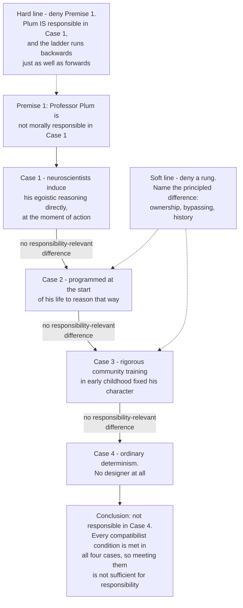

# Metaphysics · Lesson 6.2: Compatibilism

> ⏱ ~15 min · Module 6: Free will and persons · Builds on: [6.1 Determinism and the consequence argument](06-01-determinism-and-the-consequence-argument.md) · Unlocks: [6.3 Frankfurt cases and alternate possibilities](06-03-frankfurt-cases-and-alternate-possibilities.md)

## Why this matters

[6.1](06-01-determinism-and-the-consequence-argument.md) left you with an argument that looks airtight: your acts follow from the distant past plus the laws, neither is up to you, and nothing that follows from what is not up to you is up to you. The natural reaction is that compatibilism must be a verbal trick — redefining "free" until the problem disappears.

It is not, and the survey numbers 6.1 reported are one sign of it — but those are a fact about philosophers, not an argument, and this course takes no side. What should change is what you expect to find. The serious compatibilist is not watering freedom down. She claims that the conditions our excusing practices actually track — was he coerced, was he compelled, could he take in reasons, was the will that moved him his own — are the conditions that mattered all along, and that none of them is a condition about whether the universe is deterministic. 6.1 gave you one compatibilist move already, Lewis's local-miracle reply, aimed at a single premise of the consequence argument. This lesson gives the positive story: four accounts of what freedom and responsibility *are*, stated so their defenders would sign them, and then the one argument aimed at all four at once.

## The idea

Two questions have been running together since 6.1.

- **Leeway.** Could you have done otherwise? Were there genuine alternatives branching off the moment of choice?
- **Source.** Did the act come from *you*, in the right way — were you its origin rather than its conduit?

Incompatibilism in its classic form says determinism kills freedom by killing leeway. The history of compatibilism over the last century is a migration from the first question to the second. Classical compatibilists tried to hold the leeway ground, showing that "could have done otherwise" comes out true even under determinism. That project failed, and the failure is instructive enough to walk through. Everything after it gives up leeway and rebuilds freedom and responsibility out of the agent's own structure: what she identifies with, what her deliberation is sensitive to, and how we actually hold one another to account.

That migration is why this lesson sets up [6.3](06-03-frankfurt-cases-and-alternate-possibilities.md). Once you have an account on which responsibility never needed alternatives, the live question becomes whether alternatives were ever required — which is exactly what Frankfurt cases are built to test.

## The argument

### 1. The classical conditional analysis

The oldest compatibilist move, running from Hobbes and Hume through Moore and Ayer:

> **"S could have done otherwise" means: S would have done otherwise if S had chosen to.**

In words: to be free is for your action to depend on your choice — for no shackle, gun or paralysis to stand between what you decide and what you do. Freedom is the absence of *obstacles*, not of *causes*.

This gets something real. The prisoner in chains would not have walked out even if he had chosen to; the man who stays in an unlocked room because he prefers the company would have. Determinism does not erase that difference, because what makes the conditional true is a fact about the agent's own causal structure — so on this view the consequence argument fails exactly where it reads "could have done otherwise" as requiring an open future.

**It is satisfied by agents who are plainly unfree.** An agoraphobe cannot make herself leave the house. Would she have walked out if she had chosen to? Yes — her legs work, the door is unlocked, nothing physical intervenes. The conditional is true, so the analysis certifies her as free. The diagnosis is structural: it inspects only the link *from* choice *to* action, and never inspects the choice. The same goes for the compulsive, the addict mid-craving and the subject of a hypnotic suggestion. Their unfreedom lives upstream of where the analysis is looking. (Compare [2.2](02-02-change-act-and-potency.md): a conditional analysis of a *power* fails in the same shape, where conditional and capacity come apart.)

**The repair relocates the question.** Demand that the agent could also have *chosen* otherwise, and the same treatment unpacks it as *she would have chosen otherwise if she had chosen to choose otherwise* — unintelligible, or one step in a regress. This is Chisholm's objection, and it is fatal to the analysis as an analysis: push the "could" up a level and the conditional follows it, asking the same unhelpful question again.

**Do not conclude that compatibilism failed.** Almost no contemporary compatibilist defends this analysis. What failed was one strategy for keeping the leeway question — which is why the next three accounts are all about the source.

### 2. Hierarchical and mesh accounts

Frankfurt ("Freedom of the Will and the Concept of a Person," 1971) starts from a distinction the conditional analysis has no room for.

- A **first-order desire** is a desire to do something: to take the drug.
- A **second-order desire** is a desire about that desire: to want to want it less.
- A **second-order volition** is the one that matters: wanting a particular first-order desire *to be your will* — to be what actually moves you to act.

> **Your will is free when the desire that moves you is the desire you want to be moved by.** Call that relation **identification**: the agent is not a bystander to what moves him.

The case that does the work is a pair of addicts, both physiologically compelled, both taking the drug, neither able to do otherwise. The **unwilling addict** hates his craving, wants it not to be his will, and is overridden anyway; he watches his own hand. The **willing addict** has the same craving and the same compulsion but endorses it — if it weakened, he would want it back. Frankfurt's claim is that this is a genuine difference in freedom of the will, and that nothing in it turns on determinism. A third figure marks the floor: the **wanton** has first-order desires and no second-order volitions at all, acting on whichever desire is strongest without caring which — on this account not merely unfree, but not a person. Because what gets checked is a *structure* among present mental states, Fischer's name for the family is **mesh theories**.

**The regress objection.** Why does the second order have authority over the first? It is just another desire, and can be as alien to the agent as the craving was; a third order repeats the problem, and stopping at the second looks arbitrary. Frankfurt's reply is **decisive identification** — a wholehearted commitment the agent has no reservation about and no further question to raise about, which *constitutes* the self rather than reporting on it. Critics call that termination by fiat. Watson ("Free Agency," 1975) instead locates the self in the agent's **values**, what she judges good as an evaluating agent rather than what she happens to want at a higher order — which dodges the regress and buys a different problem, since people do act freely against their considered values.

**The manipulation objection.** A mesh can be installed. Nothing in the account mentions how the levels came to be arranged as they are, so an agent whose wholehearted endorsement was engineered last night satisfies it exactly. Hold that thought; it is the last section.

### 3. Reasons-responsiveness

Fischer and Ravizza (*Responsibility and Control*) begin by splitting one notion of control into two.

- **Regulative control** is the power to do otherwise: access to genuine alternatives. This is what determinism threatens.
- **Guidance control** is the power to guide your actual action by your own reasons-sensitive process. It requires no alternatives at all.

> **An agent has guidance control when (i) the action issues from a moderately reasons-responsive mechanism, and (ii) that mechanism is the agent's own.**

**Condition (i).** Hold fixed the actual mechanism that produced the action — ordinary practical deliberation, say — and vary the reasons across a range of possible scenarios. **Recognition:** does the mechanism, across a suitable range, register the reasons there are, in an intelligible pattern? **Reactivity:** is there at least one scenario in which sufficient reason to do otherwise actually produces doing otherwise?

"Moderately" is a specification, not a hedge. **Strong** responsiveness — reacting whenever there is sufficient reason — is too demanding, because it would excuse every weak-willed person, and weakness of will is a paradigm of responsible wrongdoing. **Weak** responsiveness — one point of reactivity, no demand on recognition — is too permissive, because a compulsive can be moved by a large enough incentive while his deliberation makes no sense at all.

Note that the theory is about the **mechanism**, not the person. That is what lets it say the same agent is responsible on Tuesday, acting on ordinary deliberation, and excused on Wednesday, acting on deliberation distorted by a tumour or a hypnotist.

**Condition (ii), ownership.** A reasons-responsive mechanism is not enough, precisely because one could be installed. It becomes the agent's own through **taking responsibility**: over a normal moral education he comes to see himself as an agent whose choices have effects in the world, to see himself as a fair target of the reactive attitudes for acting on that mechanism, and to hold both views on his evidence in the appropriate way. This is a **historical** condition — how you came to have the mechanism matters — and it is the part deliberately built to handle manipulation.

**What it buys:** responsibility with no requirement of alternate possibilities whatsoever. That is a large claim, and [6.3](06-03-frankfurt-cases-and-alternate-possibilities.md) is where it is tested.

### 4. Strawson's reactive attitudes

Strawson's "Freedom and Resentment" (1962) changes the subject rather than answering the question, and does so on purpose.

> **Our responsibility practices are not derived from a metaphysical thesis and then applied. They are constituted by the reactive attitudes — resentment, gratitude, indignation, guilt, love — which we take toward one another insofar as we regard each other as participants in interpersonal relationships, and which respond to the quality of will another person shows us.**

In words: holding someone responsible is not first of all a verdict we reach; it is a stance we take. Strawson calls it the **participant stance**, against the **objective stance**, in which we regard a person as something to be managed, treated or avoided rather than argued with and resented.

Inside the practice there are exactly two kinds of off-switch, and they are the only ones we ever actually use. **Excuses** cancel the attitude while leaving the person a full participant: he did not know the glass was there, he was pushed, it was an accident — the quality of will was not what it looked like. **Exemptions** move the person out of participant range, locally or wholly: a small child, someone in severe psychosis, someone under hypnosis.

Determinism appears in neither list. No excuse anyone has ever offered takes the form "my action had a sufficient causal antecedent." The sceptic's question — is anyone *really* responsible, given that everything is caused? — asks for an external license for the practice as a whole, and Strawson answers in two parts. First, abandoning the reactive attitudes wholesale is not something creatures like us could do, whatever we might conclude in the study. Second, even if it were a live option, whether to take it would be a practical question about the shape of human life, not one settled by the truth of determinism. There is no vantage point outside the practice from which the practice gets licensed, so the demand for one is confused rather than unmet.

**The standard objection.** This describes the practice; it does not justify it. That an attitude is unshakeable shows nothing about whether it is *fitting* — a prejudice can be both unshakeable and indefensible, and "we can't stop" is not a reason. And the excuse/exemption line looks as though it tracks something: we exempt the psychotic and the hypnotized for a reason, presumably about their capacities. If so, that reason can be stated, and stating it is a theory of responsibility rather than a refusal to give one. That is how Fischer and Ravizza read their own project — filling in the blank Strawson left, with reasons-responsiveness as the capacity exemptions track. Whether that completes Strawson or betrays him is itself disputed.

### The four accounts side by side

| Account | Freedom or responsibility consists in | Verdict on the unwilling addict | Cares about history? | Chief objection |
|---|---|---|---|---|
| **Conditional analysis** | Your action depending on your choice — no obstacle between will and deed | **Free** (his legs work) — the wrong answer | No | Satisfied by the plainly compelled; the repair regresses |
| **Hierarchical / mesh** | Being moved by the desire you want to move you | **Unfree** — his will is not his own | No | The regress of orders; a mesh can be installed |
| **Reasons-responsiveness** | Guidance control: a moderately reasons-responsive mechanism that is your own | **Not responsible** — the addicted mechanism recognizes reasons but cannot react | **Yes**, via taking responsibility | Ownership may be installable too; "moderate" needs sharp edges |
| **Reactive attitudes** | Being a fit object of the participant attitudes, with no excuse or exemption in play | **Exempt or excused** — compulsion is on the list | Only as evidence | Describes the practice rather than justifying it |

### 5. The manipulation argument

Pereboom's **four-case argument** is the strongest single challenge to all four, because it is aimed at what they have in common.

Professor Plum kills Ms. White for self-interested reasons. In each of four deterministic cases he satisfies *every* compatibilist condition on offer: uncoerced and uncompelled, acting on a first-order desire he identifies with by a second-order volition, deliberating in a moderately reasons-responsive way, with no excuse or exemption in play. The cases differ only in how his psychology came to be.

> **P1.** Plum is not morally responsible in Case 1, where neuroscientists induce his egoistic reasoning directly at the moment of action.
> **P2.** There is no responsibility-relevant difference between any two adjacent cases; the only difference is the route by which the psychology arose.
> **∴ C.** He is not responsible in Case 4, ordinary determinism — so satisfying the compatibilist conditions is not sufficient for responsibility.

In words: if being engineered into exactly this psychology excuses you, then arriving at it by any other route you did not control excuses you too. P2 rests on a best-explanation claim — the best account of why Plum is off the hook in Case 1, that his action traces back to factors beyond his control, holds just as well in Case 4.

**Hard-line reply: deny P1.** Plum *is* responsible in Case 1. A stipulation that he meets every compatibilist condition is a stipulation that he is not a puppet, and the contrary intuition comes from covertly picturing someone alienated, unresponsive or absent — someone the case has ruled out. McKenna adds a dialectical point worth keeping in hand: P2 is **symmetric**. If there really is no responsibility-relevant difference between adjacent cases, the ladder climbs upward from Case 4 as legitimately as it descends from Case 1 — start from the ordinary agent being responsible and conclude that Plum is responsible under direct manipulation. So the argument does no work unless the verdict on Case 1 is *more secure* than the verdict on Case 4, which is precisely what is in dispute.

**Soft-line reply: deny P2.** Accept that Plum is off the hook in Case 1, and find the rung that breaks. The candidates are all historical: Fischer and Ravizza's ownership (he never took responsibility for an installed mechanism), or Mele's **bypassing** condition (manipulation circumvents the agent's capacity to shape his own mental life, while ordinary development runs *through* that capacity). The pressure points are where the literature lives — the manipulators can simply install the taking-of-responsibility as well, and Case 3 has no manipulator at all, so "bypassing" must do real work rather than relabel an intuition.

Both replies answer one question: **can two agents with identical present psychologies differ in responsibility because of how they got there?** Mesh accounts must say no, which forces them to the hard line; historical accounts say yes, which licenses the soft line; Pereboom needs the answer to be no for the differences separating his cases. This lesson does not settle it, and neither has the profession.

## Map of positions

The ladder is the argument: each rung swaps one feature of Plum's causal history for a slightly more ordinary one, while the psychology at the moment of the killing stays fixed. Case 3 is the rung that matters most, because no one designed it.

## Worked examples

**Example 1 (mechanical — running all four accounts on a clean case).** Nadia, a claims adjuster, denies a legitimate insurance claim because her bonus depends on her denial rate. No one coerced her; she knew the claim was good.

- **Conditional analysis.** Would she have approved it if she had chosen to? Yes — a keystroke, no obstacle. So she is free and responsible. Right verdict; notice how little was checked, since the analysis never looked at the choice itself.
- **Hierarchical.** First-order desire: hit the quota. Does a second-order volition endorse it? Suppose so — she wants her ambition to be what moves her here, without reservation. Identification holds, so her will is free. Change one thing, so that she loathes her own careerism and it moves her anyway, and the verdict flips while nothing else about the case changes.
- **Reasons-responsiveness.** Hold her mechanism fixed — ordinary self-interested workplace deliberation — and vary the reasons. If the claimant were her sister, if an auditor were watching, if the penalty were prosecution rather than a memo, this mechanism registers each as a reason, in an intelligible pattern, and would plainly react to at least one. So it is moderately reasons-responsive, and it is hers: acquired over an ordinary working life, and she would not blink at being called a fair target of blame for acting on it. Guidance control present.
- **Reactive attitudes.** The claimant's resentment is fitting, because the denial expressed indifference to him — a quality of will. No excuse (she knew; she was not pushed), no exemption (adult, not psychotic, not hypnotized). The attitude stands.

Four routes, one verdict — and nobody consulted whether the universe is deterministic. That convergence, and that silence, is the compatibilist's central contention in a single case.

**Example 2 (where it strains — add a history).** Keep Nadia's psychology at the moment of the denial exactly as it was. Change only how it got there: the three-week "values alignment" programme her firm ran last spring was a covert neural intervention that installed the quota-dominated value set whole. She emerged wholeheartedly endorsing it, fully reasons-responsive within it, with no sense that anything had been done to her.

- **Conditional analysis.** Unchanged: free. It cannot even represent the new fact — the clearest demonstration that it is looking in the wrong place.
- **Hierarchical.** Unchanged: her will is her own, since the account asks only about the present mesh and the mesh is exactly as it was. The manipulation objection bites hardest here, and Frankfurt's own hard-line response is available: if she really is wholeheartedly identified, this really is her will, however it was produced.
- **Reasons-responsiveness.** The account built to catch the case catches it through ownership rather than the mechanism: she never took responsibility for an installed mechanism, because it was in place before any taking could occur. But the manipulators could have installed the taking too — the self-image of being an agent and a fair target of blame, along with everything else. Then either the taking must itself be non-manipulated, which threatens a regress of the hierarchical shape, or ownership needs cashing out some other way.
- **Reactive attitudes.** Our attitudes really do shift on learning the history, sliding toward the objective stance, and Strawson's framework *describes* that shift well. What it does not obviously supply is a reason: if the practice is bedrock, the shift is one more fact about the practice, and whether it is *correct* is the question he declared confused. The standard objection, in a concrete case.

Now walk Nadia down the ladder — intervention in infancy, then no intervention but a childhood where nothing except the quota was ever treated as real, then no designer anywhere. The soft-liner owes us the rung that breaks; the hard-liner says the ladder never needed climbing.

## Watch out

- **Compatibilism is not "freedom in a watered-down sense."** The claim is that the conditions doing real work in our excusing practices — compulsion, ignorance, coercion, incapacity to take in reasons — are what freedom and responsibility were always about. Treating the position as a consolation prize is the commonest misreading.
- **The conditional analysis is not compatibilism.** It is one dead compatibilist strategy; refuting it refutes nothing else on the list. Treating "the conditional analysis fails" as a refutation of compatibilism is an exegetical error.
- **Second-order desire is not second-order volition.** Wanting to want less is a second-order *desire*; wanting a given desire to be what actually moves you is a second-order *volition*. The willing addict case only works with the second.
- **Reasons-responsiveness is a property of mechanisms, not of people.** That is what lets the theory hold the same person responsible on one occasion and excuse her on another with no change in her character.
- **Strawson is not saying responsibility is whatever we happen to feel.** He is saying excuses and exemptions are internal to the practice and the demand for an external license is confused. Whether that is an answer or a refusal to answer is exactly the dispute — represent it as one.
- **Manipulation arguments are not aimed at compatibilism alone.** They press any view on which the agent's present structure settles responsibility. A libertarian who added indeterminism to Plum's deliberation without addressing the history would face a version of the same case — which is why [6.4](06-04-libertarianism-and-its-critics.md) is not simply the good news after this lesson's bad news.
- **Keep leeway and source apart.** "Could not have done otherwise" and "was not the source" are different complaints, and running them together makes both the consequence argument and the Frankfurt cases of [6.3](06-03-frankfurt-cases-and-alternate-possibilities.md) impossible to evaluate.

## One-liner

> Compatibilism's century was a migration from "could you have done otherwise?" to "was the will that moved you your own?" — and manipulation cases are the bill for the move, since a will can be made to be yours.

## Problems

**P1 (🟢) *(Exegetical.)*** Theo checks the stove compulsively. He knows it is off, he desperately wishes he could stop, and he misses his daughter's recital doing it.

(a) State what the classical conditional analysis says about "Theo could have left on time," and say in one sentence why that verdict is a problem for the analysis. (b) State Frankfurt's verdict on whether Theo's will is free, and identify the second-order volition doing the work. Two sentences each at most.

**P2 (🟡) *(Exegetical (a) · Evaluative (b).)*** An invented closing argument by a defense attorney:

> "Members of the jury, look at how Mr. Halloran got here. He did not choose his temper; it was built into him before he could weigh anything — not the neighbourhood, not the father, not twelve years of being told what he was worth. And by the night in question, every atom in that man was already on a course set long before he walked into that room; there was no other act that could have come out of him. So ask yourselves honestly: when he swung, was that *him*, or was that everything done to him, moving through him? This is not a man who weighed the options and chose wrong. This is a man to whom the options were never really open."

(a) Three of these sentences appeal to a condition some compatibilist account recognizes. Name the account for each, quoting the words that carry it. Then identify the **one** sentence that appeals to no compatibilist condition at all but to determinism as such, and say what Strawson would observe about it. (b) Which of the four accounts, if any, gives the defense what it actually wants, and at what cost? **150 words or fewer for (b).**

**P3 (🔴, optional) *(Evaluative.)*** The four-case argument splits compatibilists into a hard line (deny that Plum is non-responsible in Case 1) and a soft line (find a principled difference between two adjacent cases).

Give the strongest one-sentence version of each reply, then name the **crux** — the single claim the hard-liner, the soft-liner and Pereboom cannot all hold, so that settling it settles the dispute. Say what would count as evidence about it. **150 words or fewer.** Any verdict; the crux is what is graded.

Solutions

**P1** *(Exegetical — strict.)*

**Must hit, strict:**
- (a) The analysis says "Theo could have left on time" is true, because *if he had chosen to leave, he would have* — his legs work, the car is outside, no obstacle stands between choice and action. That is the wrong verdict: Theo is a paradigm of unfreedom, and the analysis misses it because it inspects only the link from choice to action and never inspects whether the choice itself was compelled. Credit requires naming the structural point, not just saying "the verdict feels wrong."
- (b) Frankfurt: Theo's will is **not** free. The second-order volition is his desire that his desire to stop checking, rather than his compulsion to check, be what moves him to act — and it is defeated. He is the unwilling addict in another costume: moved by a first-order desire he repudiates.

**Wrong turns:** saying the conditional analysis delivers "Theo could not have left," which reverses the case — the whole difficulty is that it delivers the permissive verdict; describing Theo's second-order state as a second-order *desire* ("he wants to want to stop") without the volitional element, which loses what Frankfurt's account turns on.

---

**P2** *(a) exegetical — strict; (b) evaluative — any verdict.*

**Must hit, strict (a):** three mappings plus the odd one out.
- **"He did not choose his temper; it was built into him before he could weigh anything"** — a **historical / ownership** appeal: the mechanism was not one he took responsibility for. This is Fischer and Ravizza's condition (ii), and it is Case 3 of the four-case ladder almost verbatim, since the shaping is done by an upbringing and not a designer.
- **"was that *him*, or was that everything done to him, moving through him?"** — the **hierarchical / identification** condition: the claim is that the desire that moved him was not one he was identified with, so the will that acted was not his own.
- **"not a man who weighed the options and chose wrong"** — **reasons-responsiveness**: the claim is that his deliberative mechanism did not recognize or react to the reasons there were.
- The odd sentence: **"every atom in that man was already on a course set long before he walked into that room; there was no other act that could have come out of him."** This appeals to **determinism as such**, not to any condition any compatibilist account recognizes. Strawson's observation: determinism appears in no excuse and no exemption we actually use. Every real excuse cites ignorance, accident, coercion or incapacity; none takes the form "his act was caused." The attorney has left the practice and is asking the jury to abandon it wholesale, which is a different and much larger request than the other three sentences make.

**Must hit, any verdict (b):** price at least two accounts against what the defense needs. The hierarchical reading is the cheapest to state and the easiest to defeat, since the prosecution need only show that Halloran endorsed his anger. Reasons-responsiveness is falsifiable in court and often false — if he would have stopped had a police officer been present, the mechanism reacts, and the defense loses. The historical/ownership reading is the strongest but the most expensive, because a childhood is not a manipulator and the same argument then generalizes to every defendant, which is the four-case ladder arriving in a courtroom. Any verdict passes if the generalization worry is named.

**Wrong turns:** treating the determinism sentence as just a vivid restatement of the others — it is the one sentence that no compatibilist account can accept as an excuse, which is the point of the question; assigning "was that him?" to reasons-responsiveness (it is about identification, not about sensitivity to reasons); arguing about whether Halloran did it.

**Model answer (b), one of several:** The historical reading is the only one that gives the defense what it wants, and it costs more than the defense can pay. Identification is too easy to rebut: the prosecution shows he endorsed his temper, was proud of it, would have wanted it back, and the hierarchical claim collapses. Reasons-responsiveness is worse for him — the mechanism plainly reacts, since he does not swing at police officers, and moderate responsiveness is all the theory asks. So the defense must say Halloran never owned the mechanism because it was installed by twelve years he did not choose. That is a real Fischer-and-Ravizza-shaped claim. But no childhood is chosen, so the argument acquits everyone or no one, and the attorney has smuggled in the four-case ladder while pretending to plead one case.

---

**P3** *(Evaluative — any verdict; the crux is what is graded.)*

**Must hit:**
- **Hard line, stated at strength:** Plum is responsible in Case 1, because a stipulation that he satisfies every compatibilist condition is a stipulation that he is not a puppet — and the intuition otherwise comes from covertly imagining an agent who is alienated, unresponsive or absent, which the case has ruled out. The symmetry point should appear somewhere: the no-difference premise runs the ladder upwards as well as downwards, so the argument works only if the Case 1 verdict is more secure than the Case 4 verdict, which is the very thing in dispute.
- **Soft line, stated at strength:** accept that Plum is not responsible in Case 1, and locate the difference in causal history — the mechanism in Cases 1 and 2 was not one the agent took responsibility for, or was installed by a process that bypassed his capacity to shape his own mental life, while ordinary development runs *through* those capacities rather than around them. Naming which rung breaks (1-to-2, or 2-to-3) counts for credit; naming none does not.
- **The crux:** whether a difference in **causal history** can make a difference to responsibility when the agent's **present structure** is identical. Structural (mesh) accounts say no, which forces them to the hard line. Historical accounts say yes, which is what licenses the soft line. Pereboom's argument requires that the answer be no for the relevant differences — that nothing in the history of Cases 2 to 4 restores what Case 1 lacks.
- **What would count as evidence:** cases that pull the intuitions apart rather than restating them — agents with identical psychologies and different histories where our judgments diverge stably, and an account of *why* bypassing matters that does not simply relabel the intuition. Saying "intuitions about cases" with no further specification is thin but passes; saying nothing does not.

**Wrong turns:** treating the hard line as obviously desperate — it is held by serious compatibilists and has the symmetry argument behind it; identifying the crux as "whether determinism is compatible with responsibility," which is the conclusion rather than the crux and could be said before reading the argument; treating Case 3 as easy for the soft-liner (it is the hardest rung, because no one designed it and the result is as fixed as in Case 2).

**Model answer, one of several:** Hard line: if Plum genuinely satisfies every compatibilist condition, then he is responsible in Case 1, and the ladder's symmetry means it can be climbed from Case 4 upwards just as legitimately as from Case 1 down — so nothing is proved unless Case 1's verdict was independently more secure, which is the disputed point. Soft line: Plum is not responsible in Case 1 because the mechanism was installed rather than taken up, and the break comes between Cases 2 and 3, where ordinary development works through his capacities rather than around them. The crux: can two agents with identical present psychologies differ in responsibility because of how they got there? Mesh accounts must say no; historical accounts must say yes; Pereboom needs no. Evidence would be pairs of cases matched in structure and divergent in history where intuitions hold steady under variation, plus a principled account of bypassing.

## Flashback

**F1 (🟡) *(Exegetical (a) · Evaluative (b).)*** From [5.4](05-04-endurance-perdurance-and-stages.md). Rosa signed a fraudulent contract ten years ago. She is in the dock today.

(a) For each of the three theories of persistence — endurantism, perdurantism, the stage view — say precisely what makes the sentence "Rosa signed that contract" true today, and name the theory on which today's defendant is *not* numerically identical to the signer. (b) A retributivist holds that punishment is deserved because **you** did it. On the theory you named in (a), can the counterpart relation carry that claim, or does desert need identity itself? **150 words or fewer for (b).** Any verdict.

Solution

**Must hit, strict (a):**
- **Endurantism.** Rosa is wholly present at every moment she exists. The very same thing, not a part of it, was at the table ten years ago and is in the dock today; "Rosa signed it" is true because *she*, the whole of her, did it. Identity across the decade is strict numerical identity.
- **Perdurantism.** Rosa is a four-dimensional whole extended in time, and what was at the table was a **temporal part** of her. "Rosa signed it" is true because a temporal part of her did, the way "the road is narrow at the bridge" is true because a spatial part of it is. The defendant and the signer are different temporal parts of one and the same worm, so the *worm* is identical and the parts are not.
- **The stage view.** Ordinary objects are momentary stages, and "Rosa" names the stage present now. Today's Rosa is a stage, the signer was a different stage, and they are **not numerically identical** — this is the theory (a) asks to be named. The past-tense sentence is made true by a **temporal counterpart** relation: today's stage stands in causal and qualitative continuity to a stage ten years ago that signed, and that is all "Rosa signed it" ever meant.
- Full credit requires the truthmaker in each case, not just a slogan, and requires the counterpart relation to be given as the stage view's *replacement* for identity rather than as a species of it.

**Must hit, any verdict (b):** the move that earns the marks is separating two questions that the word "you" runs together — whether the punished object is numerically identical to the wrongdoer, and whether it stands in the relation retribution actually cares about. The stage theorist keeps the second and gives up the first, so (b) has to say which one desert needs, and why. Either verdict passes if that separation is made before it is weighed. Naming what would be lost on the answer not chosen is what distinguishes a good answer from a bare assertion; noting the parallel with Parfit's claim that identity is not what matters ([6.6](06-06-personal-identity-over-time.md)) is a bonus, not required.

**Wrong turns:** saying perdurantism denies that Rosa is identical to the signer — it says the *worm* is identical and the temporal parts are not, which is a different claim and the most common slip; treating the question as one about whether Rosa has changed her mind or her character, which is psychology, not persistence; concluding that the stage view "refutes punishment" without noticing that the counterpart relation is available to do the work; answering (b) with this lesson's material, since whether Rosa acted freely is a separate question from whether she persists.

**Model answer (b), one of several:** It can carry it, and noticing why shows the metaphysics was never carrying the moral weight. The stage theorist does not lose the relation retribution cares about — the causal and qualitative continuity running from the signing to the dock is exactly as robust, and exactly as knowable, as before. She loses only the label "identity" for it. So the question is what desert was tracking all along. If it demands strict numerical identity between wrongdoer and punished, the stage view is a serious problem, and so is every theory on which persons are not strictly identical over time. If it tracks the continuity — the same plans, commitments and character running through, which is what makes punishment intelligible to the person punished — then nothing is lost, and the retributivist can be a stage theorist without embarrassment.

## Connections

- **Backward:** [6.1](06-01-determinism-and-the-consequence-argument.md) is what this lesson replies to; every account here is a way of denying that "up to you" requires an open future, and the conditional analysis is the only one that tries to keep the leeway ground. [2.2](02-02-change-act-and-potency.md) ran the same argument shape on powers — a conditional analysis of a capacity, and its failure where conditional and capacity come apart — so the objection to the classical analysis should feel familiar. [4.2](04-02-counterfactual-causation.md) supplies the semantics the conditional analysis would need if it were revived.
- **Forward:** [6.3](06-03-frankfurt-cases-and-alternate-possibilities.md) takes up the promise reasons-responsiveness makes — responsibility without alternate possibilities — and tests it with Frankfurt's counterfactual intervener, the flicker-of-freedom reply and the dilemma defense; the source-versus-leeway distinction drawn in "The idea" is the distinction that lesson turns on. [6.4](06-04-libertarianism-and-its-critics.md) is where Pereboom's own hard incompatibilism is stated as a position rather than as a challenge, alongside the libertarian accounts and the luck objection they share. Boss problem 6 asks for a manipulation case run past a hierarchical compatibilist, a libertarian and a hard incompatibilist at once, and then asks whether the manipulated agent is even the same person — which is [6.5](06-05-what-a-person-is.md) and [6.6](06-06-personal-identity-over-time.md).
- **Sideways:** 6.1 already routed the standing exports (foreknowledge to [`philosophy-of-religion`](../../philosophy-of-religion/syllabus.md), grace and freedom to `creation-grace-last-things`, punishment to [`philosophy-of-law`](../../philosophy-of-law/syllabus.md), responsibility as a moral topic ceded here by [`ethics`](../../ethics/syllabus.md)). This lesson adds one: the flashback's question — whether desert needs identity or only continuity — is where this module's metaphysics of persistence meets `philosophy-of-law`'s theories of punishment, and neither course settles it alone. Hume's and Hobbes's own versions of the conditional analysis, read inside their systems, are [`modern-philosophy`](../../modern-philosophy/syllabus.md)'s.
