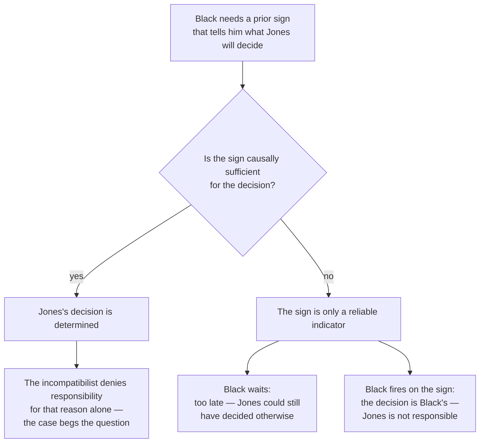

# Metaphysics · Lesson 6.3: Frankfurt cases and alternate possibilities

> ⏱ ~15 min · Module 6: Free will and persons · Builds on: [6.2 Compatibilism](06-02-compatibilism.md) · Unlocks: [6.4 Libertarianism and its critics](06-04-libertarianism-and-its-critics.md)

## Why this matters

[6.1](06-01-determinism-and-the-consequence-argument.md) gave you an argument that if determinism is true, no one could ever have done otherwise. By itself that is a conclusion about what we *can* do. To reach the conclusion everybody actually cares about — that no one is ever to blame — it needs a bridge: the principle that responsibility requires being able to do otherwise. Harry Frankfurt attacked the bridge rather than the argument, with a thought experiment that is probably the most worked-over case in the free-will literature. Decades of replies have produced no verdict on the case, but they produced something better: a clear view of what the dispute was always about, which is [6.4](06-04-libertarianism-and-its-critics.md)'s starting point.

## The idea

Why does anyone believe that responsibility requires alternatives? Because of cases like this: a cashier hands over the till at gunpoint. We excuse him, and the natural gloss is *he had no choice*. Generalize the gloss and you have the principle.

Frankfurt's move is to notice that the coercion case runs two things together:

1. The agent **lacked alternatives** — every route led to handing over the money.
2. The lack of alternatives **explains what he did** — it is *why* the money left the drawer.

Coercion always delivers both, so the cases that make the principle feel obvious never tell us which of the two is doing the excusing. Frankfurt's strategy is to build a case that has (1) without (2): the agent genuinely could not have done otherwise, yet the fact that he could not plays no part whatsoever in the story of why he acted. If your judgment of responsibility survives in that case, then it was (2), not (1), that mattered all along.

## The argument

**The principle, stated.**

> **PAP (the principle of alternate possibilities).** A person is morally responsible for what he has done only if he could have done otherwise.

In words: no exits, no blame. Note what it is and is not. It is a *necessary* condition on responsibility, not a sufficient one — nobody thinks that merely having an alternative makes you responsible. And it is a claim about *moral responsibility*, not about freedom, action or control.

**Why incompatibilists wanted it.** PAP is the bridge premise:

> **P1.** If determinism is true, no one could ever have done otherwise. *(The consequence argument, [6.1](06-01-determinism-and-the-consequence-argument.md).)*
> **P2 (PAP).** A person is morally responsible for what he has done only if he could have done otherwise.
> **∴ C.** If determinism is true, no one is ever morally responsible for anything.

In words: determinism closes the exits, closed exits mean no blame, so determinism means no blame. Knock out P2 and the argument stops one step short of the conclusion that gives it its force.

**Frankfurt's counterexample, as a schema.** Frankfurt published it in 1969, in "Alternate Possibilities and Moral Responsibility." The standard cast is an agent, Jones, and a counterfactual intervener, Black.

> **1.** Jones deliberates and decides, entirely on his own and for his own reasons, to do A; he then does A.
> **2.** Black wants Jones to do A and is prepared to see to it that he does.
> **3.** Black has access to a **prior sign** — some state of Jones that occurs before the decision and indicates which way the decision will go.
> **4.** Had the sign indicated a decision against A, Black would have intervened — by direct manipulation of Jones's brain, not by persuasion or threat — and made Jones decide on A and do it.
> **5.** In fact the sign indicated a decision for A, so **Black did nothing**. He is absent from the actual sequence of events entirely.
> **6.** From 2–4: Jones **could not have done otherwise**. Every branch of the case ends in A.
> **7.** From 1 and 5: what actually produced the action was Jones's own deliberation, unaltered. Delete Black from the world and the actual story is word for word the same.
> **∴ C.** Jones is morally responsible for doing A although he could not have done otherwise. **PAP is false.**

In words: a man standing by with a gun he never has to draw does not get you off the hook — and yet his standing there means there was no other way things could have gone.

**Frankfurt's replacement principle.** What the coercion cases really support, he suggests, is something narrower: a person is not responsible for what he did *if he did it only because he could not have done otherwise*. The work is done by "only because." The counterfactual intervener never enters the *because*.

**What the case is and is not meant to show.** Exactly one thing: that responsibility does not require alternate possibilities. It does **not** show that determinism is compatible with responsibility, that anyone in fact acts freely, or that alternatives are irrelevant to freedom of action. Its dialectical effect is negative and precise: the debate between compatibilists and incompatibilists cannot be settled by PAP alone, because the two questions — *are the exits open?* and *is he responsible?* — have been pried apart. Frankfurt himself was a compatibilist, but the case does not belong to compatibilism: one can accept the case and still deny that anyone is responsible, for reasons that have nothing to do with alternatives. Derk Pereboom, who does exactly that, is the standard example, and his manipulation arguments from [6.2](06-02-compatibilism.md) are where his denial comes from.

### Objection 1: the flicker of freedom

Look again at step 6. Is it true that *nothing* could have gone otherwise?

Jones could have exhibited the other prior sign. He could have begun to decide against A — that, after all, is what would have triggered Black. So an alternative survives, buried in the machinery. Call it a **flicker of freedom** (John Martin Fischer's label). If "could have done otherwise" is read broadly enough to include showing a different sign, PAP is simply untouched by the case.

**The reply: flickers must be robust.** The defender concedes the flicker and denies it can do the job. An alternative is only the sort of thing responsibility could rest on if it is **robust** — roughly, on Pereboom's version of the condition, if the agent could have voluntarily availed himself of it and could have grasped that doing so would make the difference to his blameworthiness. An involuntary neural pattern that Jones cannot produce at will, does not know about, and could not have understood as an exit is none of these. To say Jones is off the hook because he might have blushed differently is to locate his responsibility in something he never did.

**And the counter-reply.** The flicker theorist can deny the robustness condition. Why did we think alternatives mattered? If the answer is "because blame is unfair unless the agent had an escape route he could have taken," robustness follows and the flicker is worthless. If the answer is "because the agent's own contribution must have been capable of going another way," then a thin alternative is exactly the right size, and demanding robustness assumes the point at issue. Notice what has happened to the dispute: it is no longer about whether responsibility requires alternatives, but about **what kind** it requires. Both sides moved.

### Objection 2: the dilemma defence

This is the sharpest objection in the literature, pressed independently by David Widerker, Robert Kane and Carl Ginet. It attacks step 3, the prior sign.

Black must know, *before* Jones decides, which way the decision will go. So ask what the connection between the sign and the decision is. There are only two options, and the case fails on each.

**Horn 1 — the sign is deterministically connected to the decision.** If the sign's occurring is causally sufficient for the decision, then Jones's decision is causally determined by prior states of the world. But whether an agent whose decision is causally determined can be responsible is *precisely* what compatibilists and incompatibilists disagree about. The incompatibilist, presented with this case, will not say "he could not have done otherwise but he is responsible"; he will say "he is not responsible, and I said so before you introduced Black." So the case only draws the intended judgment from someone who already grants that determination does not defeat responsibility. As an argument against the incompatibilist, it **begs the question**.

**Horn 2 — the sign is not deterministically connected.** Then the sign is a reliable indicator and nothing more: there is a possible continuation in which Jones shows the sign and decides against A anyway. Two sub-cases, both bad.

- *Black waits for the decision.* Then he is too late. Right up to the moment of decision it remained open for Jones to decide otherwise, so Jones **did** have an alternative and PAP survives untouched.
- *Black fires on the sign, pre-emptively.* Then he has intervened before Jones decided, and the decision is Black's doing rather than Jones's — which destroys the other half of the case, the half where Jones is responsible.

**The dilemma, in one line:** to close the exits the case must build determinism into the agent's decision, and to move an incompatibilist it must not.

### Two ways out, both designed to escape both horns

**Blockage cases (Alfred Mele and David Robb).** Drop the prior sign altogether. Instead, a deterministic process started by the intervener runs in the agent's brain, set to produce the decision to do A at a particular moment; the agent's own, *indeterministic* deliberation may also produce that same decision at that moment. The case stipulates that if the agent's own process produces the decision, the intervener's process is pre-empted and contributes nothing; if it does not, the intervener's process produces it. No sign is needed, nothing determines the agent's own deliberation, and no alternative to the decision remains. The disputes are over whether the stipulated pre-emption is coherent, whether two processes can converge on the very same decision, and whether blocking alternatives this way differs from determining the actual sequence.

**Buffer cases (Eleonore Stump, Pereboom).** Keep a prior state, but change its logical role: make it a **necessary condition of the alternative decision** rather than a sufficient condition of the actual one. Suppose the agent can decide against A only by first passing through some mental state — attending to a certain reason with a certain vividness, say — and the device is triggered by that state. Horn 1 is escaped, because nothing in the story determines what the agent actually decides; horn 2 is escaped, because the device is nonetheless perfectly reliable, since no decision against A can be reached without crossing the buffer, and every crossing is caught. And the flicker that remains — crossing the buffer — is built by design to fail robustness. Worked example 2 runs one of these.

The dilemma defenders' answer is that crossing the buffer is still an alternative, and that whether its non-robustness matters is the very question at issue. Which is where the live dispute now sits: not on Frankfurt's case, but on the robustness condition.

## Map of positions

Two independent axes. **Leeway** views say responsibility requires open alternatives; **source** views say it requires the action to originate in the agent in the right way. Cross that with compatibilism, and the four corners are occupied:

| | **Leeway**: responsibility requires alternatives | **Source**: responsibility requires the right origin |
|---|---|---|
| **Compatibilist** | The conditional analysis and its modern dispositional descendants (Kadri Vihvelin, Michael Fara): determinism leaves the relevant ability intact ([6.2](06-02-compatibilism.md)) | Frankfurt's hierarchical view; Fischer and Ravizza's guidance control — **semicompatibilism**: even granting that determinism removes alternatives, responsibility survives |
| **Incompatibilist** | Classical **leeway incompatibilism**: the consequence argument plus PAP ([6.1](06-01-determinism-and-the-consequence-argument.md)) | **Source incompatibilism**: determinism defeats responsibility because it puts the origin of the action outside the agent — Pereboom's hard incompatibilism; Stump's libertarianism; Kane's ultimate responsibility |

Now read the Frankfurt debate off the table. A successful Frankfurt case knocks out the **left column only**. It does not deliver compatibilism, because the bottom-right corner is untouched — and that corner is where a great deal of contemporary incompatibilism has moved. Kane holds that what fundamentally matters is *ultimate responsibility*, that the agent be the origin of his own character-forming choices, and argues that alternatives follow from that rather than the reverse. Pereboom grants Frankfurt cases outright and argues from manipulation instead. Stump is a libertarian who accepts the cases. Symmetrically, a *failed* Frankfurt case does not deliver incompatibilism; it only leaves the old bridge standing.

That is what the literature settled: not whether the cases work, but that the interesting question is about sources. Which is exactly [6.4](06-04-libertarianism-and-its-critics.md)'s subject.

## Worked examples

**Example 1 (mechanical — run the schema, then locate the flicker and the horn).** Ravi sits on a hospital board voting whether to suppress a safety report. Unknown to him, Okonjo has installed a device that monitors a neural pattern preceding his decisions. Had the pattern indicated a vote to disclose, the device would have fired and produced in Ravi the decision to suppress. The pattern indicated suppression. Ravi deliberated about his bonus, decided to suppress, and voted that way. The device never fired.

*Could he have done otherwise?* No. Every branch ends in a vote to suppress.

*Is he responsible?* The judgment the case solicits is yes: delete Okonjo and the device from the world and the actual story — the bonus, the deliberation, the vote — is unchanged.

*Where is the flicker?* Ravi could have exhibited the other neural pattern. Robust? He cannot produce it at will, does not know it exists, and could not have grasped it as a way of avoiding blame — so it fails Pereboom's condition, and whether that settles anything depends on whether the condition is right.

*Which horn?* If the pattern is causally sufficient for the vote, Ravi's decision is determined and the incompatibilist withholds the responsibility judgment for that reason alone — horn 1. If it is merely a reliable correlate, the device can guarantee nothing: fire early and the vote is Okonjo's, wait and Ravi could have voted to disclose — horn 2. The clean case falls straight into the dilemma, which is why the literature builds stranger ones.

**Example 2 (a hard case — a buffer case, and where it strains).** Pereboom's tax-evasion case, in outline. Joe is deciding whether to evade his taxes and is strongly tempted by the money. Stipulate, as a fact about Joe's psychology, that he can decide *not* to evade only if he first attends to the moral reasons against evasion with a certain vividness — that attention is a necessary condition of any such decision, not a cause of any particular one. A neuroscientist who wants Joe to evade has arranged that if Joe's attention ever reaches that level, a device will intervene and produce the decision to evade. In fact Joe never attends that vividly. He decides on his own, for the money, to evade. The device stays idle.

*Horn 1?* Escaped. Nothing in the story causally determines Joe's actual decision; the case can be told about an agent in an indeterministic world whose deliberation could have gone several ways, so long as none of those ways reaches a decision to refrain without first crossing the buffer.

*Horn 2?* Escaped. The device does not need to predict Joe; it needs only to catch a crossing, and by stipulation no decision to refrain is reachable without one.

*Where it strains.* Three places, and they are the real state of the debate. First, is "Joe can decide to refrain only if he first attends vividly" something a case may stipulate, or a substantive psychological thesis a libertarian is free to deny? Second, if attending vividly is something Joe can do or fail to do, the flicker has come back wearing more voluntariness than a blush had. Third, the whole case leans on the robustness condition; a flicker theorist who rejects that condition finds the buffer case no better off than Frankfurt's original. The case escaped the dilemma by relocating the disagreement, which is progress but not victory.

## Watch out

- **A Frankfurt case is not a manipulation case.** In Pereboom's four-case argument ([6.2](06-02-compatibilism.md)) the intervener *acts*, and shapes the actual decision. In a Frankfurt case he never acts at all. If your intervener contributes anything to what actually happened, you have changed the subject — and you are now arguing about something everyone already disputes.
- **PAP is about responsibility, not about freedom.** Refuting it shows nothing about whether anyone acts freely, and nothing about whether free *action* requires alternatives. Keep the two senses of "free will" — the condition on blame, and open-futured control — apart.
- **"Could have done otherwise" than what?** Than *decide* as he did, *act* as he did, or *try* as he did? Some Frankfurt cases close off the action while leaving the decision open, and an objector can then say the agent is responsible for the decision, which was open. Say which item your case removes.
- **Refuting PAP does not touch the consequence argument.** The argument's own conclusion — that under determinism nobody could have done otherwise — is untouched. What is removed is one bridge from that conclusion to blame.
- **Accepting the case does not make you a compatibilist,** and rejecting it does not make you an incompatibilist. Both corners of the source column are live.
- **The dilemma is not "either determinism is true or it is not."** It is about the connection between the sign and the decision *inside the story*. A case set in an indeterministic world can still build local determination into the agent's decision, and that is enough to trigger horn 1.

## One-liner

> A bystander who never has to act cannot be part of why you acted — so if you judge the agent responsible anyway, responsibility was tracking the source of the action, not the exits he never had.

## Problems

**P1 (🟢) *(Exegetical.)*** Three miniature cases. For each, say whether it is a Frankfurt case *as Frankfurt needs it to be*, and if not, name what has gone wrong. One or two sentences each.

(a) A neuroscientist monitors Mara, and when she begins deliberating she activates the device, which forms in Mara the decision to lie. Mara lies.
(b) An employer would have hired a second assassin had the first refused the job. The first accepts and shoots.
(c) A device would have produced in Hal the decision to stay silent had he shown a certain prior sign. He shows the opposite sign, decides on his own to stay silent, and does. The device stays idle.

**P2 (🟡) *(Exegetical (a) · Evaluative (b).)*** Ines is deciding whether to sign a false affidavit. A neurologist has a device keyed to a hormonal marker that, in Ines, precedes decisions of this kind and indicates their direction correctly about 97 per cent of the time. Had the marker indicated refusal, the device would have produced in Ines the decision to sign. The marker indicated signing; Ines signed, for her own reasons; the device stayed idle.

(a) Which horn of the dilemma defence does this case fall on, and why? State the horn precisely, including what goes wrong in each of its sub-cases.
(b) Redesign the case as a buffer case that escapes both horns, then say what the redesign costs. 150 words or fewer for (b), any verdict, provided you say what the buffer is a necessary condition *of*.

**P3 (🔴, optional) *(Evaluative.)*** A defender of Frankfurt cases and a flicker theorist agree on every fact about the tax-evasion case — the buffer, the device, the decision — and still disagree about whether Joe's case refutes PAP. In 150 words or fewer: name the single premise they disagree about, in one line, and say what consideration or argument would actually move it. Any verdict; the crux and the mover are what is graded.

Solutions

**P1** *(Exegetical — strict.)*

**Must hit, strict:**
- (a) **Not a Frankfurt case.** The intervener acts, so the decision is the device's and not Mara's; the actual sequence is not her own deliberation. This is a manipulation case ([6.2](06-02-compatibilism.md)), and it invites the judgment Frankfurt needs to *avoid* — that the agent is off the hook.
- (b) **Not a Frankfurt case.** What is closed off is the *outcome* — the victim dies either way — not the agent's own action. The assassin could perfectly well have refused; PAP concerns what he could have done, not what would have happened. Credit for naming the confusion: an inevitable outcome is not an unavoidable action.
- (c) **Yes** — this is the schema: a counterfactual intervener, a prior sign, no intervention, and the agent's own deliberation producing the act. Full credit requires adding that it is still exposed to the dilemma defence, since nothing has been said about how the sign is connected to the decision.

**Wrong turns:** calling (b) a Frankfurt case because "the victim was going to die anyway" — that is PAP applied to the wrong relatum; accepting (c) without noticing that a bare prior sign is exactly what the dilemma attacks.

**Model answer:** as above.

---

**P2** *(a) exegetical — strict; (b) evaluative — any verdict.*

**Must hit, strict (a):** **Horn 2** — the indeterministic horn. A marker that is right 97 per cent of the time is a reliable indicator and not a causally sufficient condition, so there is a possible continuation in which Ines shows the marker and refuses. Both sub-cases must be given: if the device waits for the decision it is too late, and Ines could have decided to refuse, so she had an alternative and PAP is untouched; if it fires on the marker it fires before she has decided, so the decision is the neurologist's and Ines is not responsible for it. Credit for noting that raising the figure to 100 per cent does not help — it converts the case into horn 1, where the incompatibilist withholds the responsibility judgment on the ground of determination alone.

**Must hit, any verdict (b):** the redesign must change the *logical role* of the prior state — from a sufficient condition of the actual decision to a necessary condition of the alternative decision — and must say what the buffer is a necessary condition of (Ines's deciding to refuse). It must then check both horns explicitly: nothing now determines what Ines actually decides, and the device is reliable because no refusal is reachable without a crossing. The cost must be named: either the psychological stipulation is substantive and deniable, or the crossing is voluntary enough to be a robust alternative after all, or the case now depends entirely on the robustness condition. Any verdict on whether the redesign succeeds.

**Wrong turns:** answering (a) with "horn 1, because the marker causes the decision" — a 97 per cent correlation is precisely not causal sufficiency; building a redesign in which the device fires on the buffer *and* the buffer necessitates the actual decision, which reintroduces horn 1; treating "escapes both horns" as equivalent to "refutes PAP," when the flicker objection is still standing.

**Model answer (b), one of several:** Stipulate that Ines can decide to refuse only after forming a vivid representation of the people the affidavit will harm — a necessary condition of refusal, not a cause of signing. The device is triggered by that representation reaching a threshold, and would then produce the decision to sign. Horn 1 is escaped: Ines's actual decision is undetermined, and her deliberation could have run several ways short of the threshold. Horn 2 is escaped: the device does not predict her, it catches a crossing, and no refusal is reachable without one. The cost: the stipulated psychology is a real claim about how decisions are formed, and a libertarian may deny that any such gateway state exists. And if forming the representation is something Ines can do or omit, it is a more voluntary alternative than a hormone level, so the flicker objection reappears with better material.

---

**P3** *(Evaluative — any verdict; the crux and the mover are what is graded.)*

**Must hit:** the crux must be stated as the **robustness condition** — roughly, *an alternative possibility is relevant to responsibility only if the agent could have voluntarily availed himself of it and could have grasped that doing so would make the difference to his blameworthiness.* The Frankfurt defender affirms it; the flicker theorist denies it. Then a genuine mover must be named. The strongest kind is an account of *why* alternatives were thought to matter in the first place, since the two answers pull opposite ways: if PAP's appeal is the fairness of blame — that it is unfair to blame someone with no escape route he could have taken — robustness follows and the flicker is worthless; if its appeal is that the agent's own contribution must have been able to go another way, thin alternatives are exactly the right size and robustness is an added premise. Ordinary excuse cases in which a non-robust alternative does or does not seem to excuse also count as movers.

**Wrong turns:** naming the crux as "whether Joe could have done otherwise" — they agree on that, which is why the case is agreed on and the verdict is not; naming it as "whether PAP is true," which is the conclusion, not the premise; asserting that the flicker is "too small to matter" without saying what makes size matter, which is just the condition restated.

**Model answer, one of several:** The crux is whether an alternative must be robust — voluntarily available and recognizable by the agent as a way of avoiding blame — to be the sort of alternative PAP requires. What would move it is a story about why PAP was attractive before any of these cases existed. If the intuition behind the cashier at gunpoint is that blame is unfair when there was no exit the agent could have taken, robustness is built into the intuition and the buffer crossing does not count. If instead the intuition is that responsibility requires that the agent's contribution could have gone another way, a flicker is a genuine instance of that and robustness is a further demand needing its own defence. Note the shape of the deadlock: both sides can make their story fit the cases, so the argument has to be settled upstream, on what responsibility is for.

## Flashback

**F1 (🟡) *(Exegetical (a)–(b) · Evaluative (c).)*** At 7:40 one evening Tomas forwards an email disclosing a colleague's medical records. Nobody restrained him, drugged him or threatened him. Assume determinism, and use the notation of [6.1](06-01-determinism-and-the-consequence-argument.md): **P0** for the complete state of the world at some instant in the remote past, **L** for the conjunction of the laws.

(a) Run the *direct* version of the consequence argument on Tomas's forwarding the email — five numbered lines — and name the two steps a compatibilist has to attack.
(b) Tomas's brother says: "Determinism is probably false anyway — the physics is indeterministic. But that wouldn't make Tomas one bit freer." Which view in 6.1's taxonomy is he stating, and what does that view hold?
(c) Suppose the argument of (a) is sound, so Tomas could not have done otherwise. In 100 words or fewer, say what today's lesson implies about whether his *responsibility* follows, and what an incompatibilist needs in addition. Any verdict.

Solution

**Must hit, strict (a):** the five steps, with the right content in each:

1. Tomas's forwarding the email at 7:40 is entailed by P0 and L.
2. So had he not forwarded it, either P0 would have been false or L would have been false — there is no third option, since the entailment leaves no room for the same past, the same laws and a different act.
3. He cannot bring it about that a proposition about the world before his birth is false.
4. He cannot bring it about that a law of nature is false.
5. So he could not have refrained from forwarding it.

The two steps to attack are **3 and 4** — the fixity of the past and the fixity of the laws. Credit for noting that the conclusion is about *alternatives*, not about responsibility, and that on this route no transfer principle appears, so an attack on Beta does not touch it.

**Must hit, strict (b):** **hard incompatibilism** — the view that we lack free will and responsibility whether or not determinism is true, because indeterminism in the causal chain would not supply the agent with the right kind of control either. (Its best-known defender is Pereboom, who also accepts Frankfurt cases, which is why he is not a leeway theorist.) It is not hard determinism, which asserts determinism, and not libertarianism, which needs indeterminism to do positive work.

**Must hit, any verdict (c):** the responsibility conclusion needs **PAP** as a bridge, and this lesson put that bridge under attack; so an incompatibilist who wants the conclusion must either defend PAP against Frankfurt cases — via the flicker objection or the dilemma defence — or abandon the leeway route and argue from a **source** condition instead, that determinism puts the origin of the action outside the agent. Either verdict on whether the bridge holds, provided both available routes are named.

**Wrong turns:** writing step 2 as "he would have needed different laws, so the laws are not really necessary" — the step is a disjunction about what would have had to be false, not a claim about modal status; calling the brother in (b) a hard determinist because he is pessimistic, when he explicitly declines to assert determinism; answering (c) by re-arguing whether Frankfurt cases succeed instead of saying what the incompatibilist needs either way.

## Connections

- **Backward:** [6.1](06-01-determinism-and-the-consequence-argument.md) supplied the premise this lesson's bridge was supposed to carry to a conclusion about blame. [6.2](06-02-compatibilism.md) supplies two things to keep distinct: Frankfurt's *other* contribution, the hierarchical theory of identification, and Pereboom's manipulation cases, which are the mirror image of the case taught here — there the intervener acts, here he never does.
- **Forward:** [6.4](06-04-libertarianism-and-its-critics.md) takes over the source column of the map: Kane's ultimate responsibility and self-forming actions, agent causation, and the luck objection that falls on all of them. [6.5](06-05-what-a-person-is.md) and [6.6](06-06-personal-identity-over-time.md) ask what the thing is that persists to bear the responsibility at all.
- **Method:** this is the purest instance in the course of refutation by constructed counterexample — a principle, a case engineered to have one feature without the other, and a judgment elicited about it. The method, and the standard ways of resisting it, belong to [`philosophical-method`](../../philosophical-method/syllabus.md); the dilemma defence is worth studying there as a model of how to attack a thought experiment's *construction* rather than its verdict.
- **Sideways:** blame, excuse and the moral theory of responsibility belong to [`ethics`](../../ethics/syllabus.md); what any of this implies about punishment belongs to [`philosophy-of-law`](../../philosophy-of-law/syllabus.md). The theological analogue — how grace can determine a free act — is `creation-grace-last-things`, flagged at [6.4](06-04-libertarianism-and-its-critics.md).
