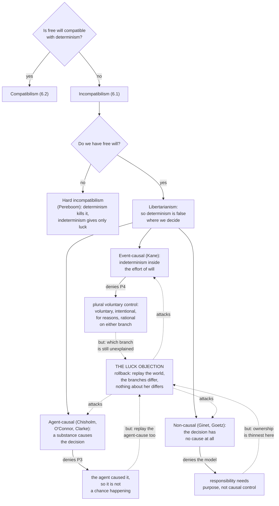

# Metaphysics · Lesson 6.4: Libertarianism and its critics

> ⏱ ~15 min · Module 6: Free will and persons · Builds on: [6.3 Frankfurt cases and alternate possibilities](06-03-frankfurt-cases-and-alternate-possibilities.md) · Unlocks: [6.5 What a person is](06-05-what-a-person-is.md)

## Why this matters

[6.1](06-01-determinism-and-the-consequence-argument.md) gave the argument that determinism leaves nothing up to you: your decisions follow from the past and the laws, and neither is your doing. The obvious repair is to deny determinism — to say that at the moment of decision the future is genuinely open. That is libertarianism, the one position in this module that takes the consequence argument at face value and pays its price.

The price is a second argument running in the opposite direction and landing in the same place. If nothing about you settled which way your decision went, then it was not settled *by you* either. Indeterminism starts to look less like control regained than like a coin flip inserted at the worst possible moment. That is the **luck objection**, the spine of this lesson: three quite different libertarian theories exist largely because there are three ideas about how to answer it.

## The idea

Libertarianism is a conjunction, not a single thesis:

> **L1.** Free will, of the kind moral responsibility requires, is incompatible with determinism. (The incompatibilism of [6.1](06-01-determinism-and-the-consequence-argument.md).)
> **L2.** We sometimes have free will.
> **∴ L3.** Determinism is false, at least where our decisions are made.

L3 is a claim about the world, which is why libertarians keep an anxious eye on physics. But the hard part is not L3. Indeterminism is cheap — radioactive decay is undetermined and no one thinks an atom is free. The hard part is what Kane calls the **intelligibility problem**: not *is there indeterminism?* but *could indeterminism, placed anywhere, be an ingredient of control rather than a subtraction from it?*

Set the difficulty out sharply, because everything else is a response to it. Suppose your decision is undetermined. Rewind the world to a moment before it with everything held fixed — history, character, reasons, deliberation, the state of every neuron — and let it run again. Sometimes you decide one way, sometimes the other. Nothing about you differs across those runs, so nothing about you accounts for the difference; and a difference nothing about you accounts for looks like a difference that happened *to* you.

The three libertarian families are three answers. **Event-causal** libertarianism keeps the ordinary picture in which events cause events and puts the indeterminism inside the agent's own effort of will. **Agent-causal** libertarianism adds an ingredient: the agent, a substance, causes the decision, and that causing is not one event causing another. **Non-causal** libertarianism subtracts one: a free decision has no cause at all.

## The argument

### Event-causal libertarianism: Kane's self-forming actions

Robert Kane (*The Significance of Free Will*; the course's source text is his *A Contemporary Introduction to Free Will*) opens with a concession that makes the rest workable: **not every free action needs to be undetermined.** Most of what you do flows predictably from the character you have. His condition is instead **ultimate responsibility (UR)**:

> An agent is ultimately responsible for an action only if she is responsible for anything that is a sufficient cause or motive of it — and that regress terminates in earlier voluntary actions of hers that were *not* determined by anything she was not responsible for.

In words: you may act from a settled character, provided the settling was at some point your doing. The terminating acts are **self-forming actions (SFAs)**, and that is where indeterminism has to live.

Kane's model of an SFA is the **torn decision** — his own case is a businesswoman on her way to an important meeting who sees an assault in an alley, with genuine reasons to stop and genuine reasons to go on. Three features. **Two efforts, not one:** she is not making one effort that might fail; she tries to do both things at once, each effort backed by its own reasons, because she is unwilling to let either set be foreclosed. **The indeterminism is in the effort:** each effort is indeterminate — the conflict in her will is, on Kane's hypothesis, reflected in an indeterminate brain process — so it is not a randomizer bolted on after deliberation, nor noise between decision and action, but a feature of the striving itself, functioning as an obstacle she must overcome. **Either outcome is a success:** whichever effort wins, she *did what she was trying to do*, and the other effort's failure is not an intrusion from outside her but the work of her own competing effort.

Now **plural rationality**, which is Kane's whole answer to luck. In a torn decision she acts **voluntarily** either way, having willed both; **intentionally** either way, since neither branch is a slip; **for reasons** either way, and they are her own; and **rationally** either way — there is no branch here she would, on reflection, disown as a lapse. So on either branch every condition we ordinarily require for responsible agency is met, and met by the agent rather than by the chance. Kane's conclusion: the outcome is hers whichever way it falls, because responsibility requires voluntary, intentional, rational authorship and not, in addition, that something about her explain why *this* branch rather than that. His analogy: an assassin whose hand may tremble indeterministically and who hits his target anyway has killed intentionally. Indeterminism subtracts from responsibility only when what happens is contrary to or independent of what the agent was trying to do, and an SFA is neither.

### Agent-causal libertarianism: a substance as a cause

The second family says the event-causal picture is itself the problem. On that picture, "she decided" is made true by certain *events involving her* — her having those desires, deliberating, making that effort — causing the decision; the agent figures only as the thing those events happen in. Agent-causalists (Roderick Chisholm, Timothy O'Connor in *Persons and Causes*, Randolph Clarke in *Libertarian Accounts of Free Will*) take that to describe something happening in a person rather than a person acting.

> **Agent causation.** A free decision is caused by the **agent** — a persisting substance — and this causal relation is not reducible to, or analysable as, causation by events or states involving that agent.

In words: the first term of the causal relation is a *thing*, not a happening. Chisholm labelled the two kinds **immanent** causation (a substance causing an event) and **transeunt** causation (event causing event), and said the agent's role in the first is the role Aristotle gave the unmoved mover — causing without being made to cause. Reasons still matter, in a different role: they make the decision intelligible as what she acted *for*, without determining which decision occurs. Clarke's **integrated** version has both kinds of causation operate on the same decision, so ordinary reasons-explanation is kept and something the event-causal view lacks is added. (He offers it as the strongest form a libertarian view can take while doubting anything in the world satisfies it.)

**What critics say it posits:** a sui generis causal relation, exercised by a substance, with no analysis in other terms and no clear empirical profile. C. D. Broad pressed the sharpest version: a continuant is not the kind of item that has a date, so how can one explain why the decision occurred *at this moment* rather than a moment later? Whatever answers the timing question will be a state or an event — and the event-causal picture is back doing the real work.

**What defenders reply — reported honestly, endorsed by nothing here.** In the neo-Aristotelian framework of Module 2, substance causation is not exotic but the default: [2.2](02-02-change-act-and-potency.md)'s principle of motion says what actualizes a potency is *something already in act* — the fire heats the water, the builder builds the house — so things are the causes and events are their causings, and on the powers ontology of [4.3](04-03-powers-dispositions-and-laws.md) a power is borne by a substance and manifested by it. The agent-causalist therefore claims he is not inventing a relation for the special case of freedom but applying the general form of causation to a substance whose distinctive power is *two-way*: a rational power, capable of opposites, rather than a nature determined to one outcome. Three qualifications keep that honest. It is cheaper only if you have bought the framework — to a Humean, for whom causation is pattern in a mosaic ([4.1](04-01-humes-challenge-and-the-regularity-theory.md)), it is not cheaper at all. Many contemporary neo-Aristotelians are not libertarians. And the same principle of motion says nothing passes from potency to act except through something already in act *in that respect*, with animal self-motion handled by letting one part actualize another — so an agent-causalist who needs a decision that is the agent's own actualizing, with no prior actualizer in the same respect, must either treat rational agency as a genuine exception or argue that the two-way power is already in act in the relevant sense. A real debt inside the framework, not a point scored against it from outside.

### Non-causal libertarianism, briefly

Carl Ginet and Stewart Goetz go the other way: a basic free action has *no* cause, neither an event nor an agent. What makes it free is intrinsic to it — Ginet points to the "actish phenomenal quality" of a simple mental act, the felt character of doing rather than undergoing — and reasons explain it **teleologically** rather than causally: it was made *in order to* achieve something, which Goetz argues is not a species of causal explanation. The attraction is that no obscure relation is posited and no question arises about where the indeterminism sits. The cost is why this family is the smallest: if nothing causes the decision, it becomes harder, not easier, to say in virtue of what it is the agent's doing.

### The luck objection

Now the argument all three must answer. Alfred Mele's *Free Will and Luck* develops it most carefully, as an objection about **present luck** — luck at the moment of decision, as distinct from luck in the character you were given.

> **P1.** In a free decision, on any libertarian view, the decision is not determined by anything prior to it.
> **P2.** So hold fixed the entire history of the world up to the moment of decision, including everything about the agent: character, reasons, deliberation, efforts, brain. Consistently with all of it she decides A; consistently with all of it she decides B.
> **P3.** Then nothing — in her or outside her — explains why she decided A rather than B. The *contrastive* explanation does not exist.
> **P4.** If nothing whatever explains why it went one way rather than the other, then which way it went is a matter of chance: luck.
> **∴ P5.** She had no more say over which branch occurred than she has over a die.
> **∴ C.** Indeterminism at the moment of decision does not secure responsibility; it undermines it.

In words: the libertarian added openness where control was wanted, and openness is not control.

Notice the shape this gives the module. [6.1](06-01-determinism-and-the-consequence-argument.md) argued that a determined decision traces to things never up to you; the luck argument says an undetermined one is settled by nothing about you. Together they are a dilemma, and **hard incompatibilism** (Derk Pereboom) accepts both horns: compatibilism fails for the reasons his manipulation cases give ([6.2](06-02-compatibilism.md)), event-causal libertarianism fails to luck, and agent causation would answer it but is not what the sciences suggest — so we lack the free will that basic-desert moral responsibility requires. He takes that to be livable, rebuilding our practices on forward-looking grounds.

### The rollback argument: the sharpest form

Peter van Inwagen's version ("Free Will Remains a Mystery") turns the worry into a procedure. Alice decided to tell a painful truth, and the decision was undetermined. Ask God to roll the world back to a moment shortly before it and let it run again — a thousand times. Some replays go one way, some the other, and as they mount the proportion settles towards a ratio. Say 726 truths, 274 lies.

That ratio is the whole argument. Alice was in exactly the same state at the start of every replay, so what settles a given replay is nothing but the ratio: the situation is *as if* a weighted die were thrown, with Alice's total state fixing the weights and nothing fixing the throw. In the actual case — one run — nothing about Alice made the difference between branches. Three features make this the sharpest version. **It fixes everything**, so no reply can appeal to a further feature of the agent. **It makes the chance concrete**: "undetermined" is vague, a frequency is not. And **it is indifferent to the causal story**, since nothing in the setup cares whether the decision is caused by events, by a substance, or by nothing — which is why it hits all three families at once. One thing about its author is easy to misread: van Inwagen is an incompatibilist who holds that we *do* have free will, and offers the argument to show that free will is a mystery we have not solved, not that libertarianism is refuted.

### The replies, side by side

| View | Premise attacked | The reply | The standard push-back |
|---|---|---|---|
| **Event-causal** (Kane) | **P4**, and with it P5 | No contrastive explanation is needed. She acts voluntarily, intentionally, for her own reasons and rationally *on either branch*; "luck" properly means what happens contrary to or independently of the agent's efforts, and neither branch is that. Plural voluntary control is control | It shows each branch is *hers*, not that she controlled *which*. And the assassin analogy breaks down: there the intention is fixed and only the execution is chancy, whereas in an SFA the chance settles the intention itself |
| **Agent-causal** (O'Connor, Clarke) | **P3** | Something *does* account for the decision: the agent caused it. Not a chance happening but the exercise of a substance's power, so P3 is false even with no contrastive explanation available. Clarke grants the contrastive gap and argues responsibility requires causal control, not contrastive explanation | Run the rollback: the agent-cause produces A in some replays and B in others, and nothing explains the difference. Agent causation relocates the luck rather than removing it — plus Broad's timing objection |
| **Non-causal** (Ginet, Goetz) | **P4/P5**, by denying the model | Responsibility needs no causal control at all. The decision is a simple act with an actish quality, explained teleologically by the agent's purpose; the luck argument presupposes the very model being rejected | Where the objection bites hardest: with no causing, the decision's "ownership" is thinnest, and an uncaused event in a person is just what the critic complained of |
| **Hard incompatibilism** (Pereboom) | — | Concedes the luck argument against the event-causal and non-causal views, and the manipulation argument against compatibilism; agent causation would answer it but is empirically unsupported | Whether "no basic desert" is livable, and whether the empirical case against agent causation is as strong as claimed |

One further exchange, because it is where the agent-causalist's reply to the rollback actually goes. The response (O'Connor-style): rollback *assumes* an agent-causal power has a probability distribution the way a chancy mechanism has propensities, but a frequency generated by repeating the replay is an artifact of the repetition, not a propensity that was in the agent beforehand fixing the odds. The critic's answer: either there are objective chances here, in which case the argument runs, or there are not, in which case the outcome is not even probabilistically connected to the agent's state — which is worse.

### Where indeterminism might enter

The libertarian needs L3 to be true of the world, and the only well-established candidate for fundamental indeterminism is quantum mechanics; Kane's hypothesis is that quantum indeterminacies could be amplified by chaotic processes in neural networks, so that a torn will is realized in an indeterminate brain process. Three cautions, and no physics is derived here.

1. **Whether quantum mechanics is indeterministic is interpretation-dependent, not settled by the formalism** — some interpretations are deterministic. That belongs to [`philosophy-of-physics`](../../philosophy-of-physics/syllabus.md); nothing in this course establishes it either way.
2. **Amplification is an open empirical question.** Whether microphysical indeterminacies survive to the scale of a decision rather than averaging out is not settled from an armchair.
3. **The point that matters: indeterminism at the microphysical level does not by itself deliver agency.** Grant 1 and 2 in full and what you have is noise in a brain — the luck objection's own picture of the situation, not an answer to it. Physics can supply the libertarian's necessary condition, never the sufficient one, because the difficulty was never "is anything undetermined?" but "how could being undetermined be a form of control?"

## Map of positions

## Worked examples

**Example 1 (mechanical — the three accounts and the rollback on one decision).** Tomás, a doctoral student, finds that a friend and co-author has fabricated a column of data. He has real reasons to report it (the result is about to be cited; he thinks of himself as someone who tells the truth about evidence) and real reasons not to (the friend carried him through a bad year; reporting ends the friendship and probably the friend's career). After an hour he reports it.

**Kane.** A candidate SFA: not an inclination overpowered by a duty, but two efforts, each backed by reasons Tomás endorses, neither foreclosed in advance. The effort to report succeeded as *his* effort, over the resistance of his own competing effort — and plural rationality holds, since staying silent would equally have been voluntary, intentional, done for his own reasons, and not something he would afterwards disown as a lapse of agency (regret is not disownment). Being an SFA, it also forms a character he is ultimately responsible for, which makes the routine honest acts flowing from it free in the derivative sense UR allows. **Agent-causal:** neither set of reasons determined the outcome; the cause was Tomás, exercising a two-way power, with the reasons causing it indeterministically alongside on Clarke's version. **Non-causal:** nothing caused it; it was a simple act explained by its purpose, keeping the record honest.

**Now the rollback.** Replay the hour a thousand times, everything identical: 610 report, 390 stay silent. Kane: no defect, since in every replay Tomás acts voluntarily, intentionally, rationally and for his own reasons, and in none does something happen *to* him. Agent-causal: in every replay Tomás caused it — the contrastive gap is granted, the cause is not. Non-causal: in every replay he acted with a purpose. The critic, to all three: you have told me what is the same across all thousand replays, and I asked what made *this* one different.

**Example 2 (where it strains — lopsided reasons and the deviant replay).** Now a case with no torn decision. Priya is an anaesthetist, twenty years in and entirely settled in her practice. During a routine procedure she feels a flicker of temptation to skip a verification step because she is tired. She does not skip it — but if the world contains the indeterminism the libertarian needs, there are replays in which she does, say 3 in 1000. Take replay 47.

**Kane cannot call this an SFA, and should not want to.** Plural rationality fails: skipping is not an option she has reasons for and would own on reflection, but the one she has spent twenty years training herself out of. This is indeterminism intruding on a settled will, and Kane's own criterion — luck is what happens contrary to or independently of the agent's efforts — classifies it correctly. That is the right verdict, and it exposes the account's shape: **indeterminism helps only in a narrow band of cases** and is a hazard everywhere else, so Kane must hold that the brain's indeterminism is *confined* to torn decisions, present when the will is divided and absent when it is settled — a strong and specific empirical bet, and the account's most exposed point. **The agent-causalist** answers more cleanly (in replay 47 Priya simply did not exercise her agent-causal power, so the skipping is not an action of hers) at the cost of letting an unobservable do all the sorting. **The non-causalist** is worst placed: if the skipping has no cause and freedom is the intrinsic character of an uncaused act, what distinguishes replay 47 from a free decision to skip?

Replay 47 looks like a seizure rather than a choice, and nobody would hold Priya responsible for it — yet the only thing producing it is the very indeterminism the libertarian relies on elsewhere for freedom, so if it degrades agency here we are owed an account of why the same feature enhances it there. This is also where the quantum hope does least work: amplified microphysical indeterminism would supply exactly what produces replay 47. Noise is symmetrical, and does not know which decisions are torn.

## Watch out

- **You might think libertarianism says our decisions are random.** No libertarian says that, and every theory here is a structure for denying it. Stating the objection as "so it's all random" concedes the interesting part without argument; the luck objection is the worked-out charge that the denial fails.
- **The luck objection is not the consequence argument with a sign flipped.** [6.1](06-01-determinism-and-the-consequence-argument.md) says your decision traces to things never up to you; the luck argument says nothing about you settles it. Different premises, different targets — they meet only in the dilemma hard incompatibilism exploits.
- **Agent causation is not "the agent's reasons cause the decision."** That is the event-causal view. If your statement of agent causation paraphrases without loss into a claim about states of the agent causing things, you have stated the other view. Related: **"undetermined" is not "uncaused"** — both causal families hold free decisions are caused and deny only that they are necessitated; only Ginet and Goetz say uncaused.
- **Kane is not claiming responsibility because the odds were even.** The ratio is irrelevant to him; his claim is that both branches meet every condition of responsible authorship, so the missing contrastive explanation is not a missing condition.
- **Don't run leeway and source together.** [6.3](06-03-frankfurt-cases-and-alternate-possibilities.md) separated them and libertarians divide on it: Kane wants alternative possibilities at the SFAs *and* a source condition (UR), while a source incompatibilist can accept Frankfurt cases and still demand an undetermined causal source. "Libertarian" does not by itself tell you which.
- **Where the profession sits, reported and nothing more.** Surveys of philosophers show compatibilism the most common view by a wide margin, libertarianism a clear minority, free-will skepticism smaller still. A fact about philosophers, not an argument; this lesson takes no side.

## One-liner

> Libertarianism buys openness at the moment of decision, and the luck objection is the bill: hold everything about the agent fixed, replay the world, and the branches still differ — so either authorship of *both* branches is enough (Kane), or a substance's causing is what a chancy event lacks (O'Connor, Clarke), or responsibility never needed causal control at all (Ginet, Goetz).

## Problems

**P1 (🟢) *(Exegetical.)*** Using the numbered luck argument from this lesson:

(a) For each of Kane, the agent-causal libertarian, and the non-causal libertarian, name the premise the view is designed to reject and say in one sentence how. (b) Which of the three *grants* P3 — that no contrastive explanation is available — and still claims the agent is responsible? Name it and give the reason offered. (c) In one sentence, why does the rollback version apply to all three?

**P2 (🟡) *(Exegetical (a) · Evaluative (b).)*** An invented paragraph from a neuroscientist's newspaper column:

> "We used to think the brain was a clock. It isn't. Synaptic transmission is stochastic at the vesicle level, and quantum effects are not obviously negligible at those scales. So the old worry that physics leaves no room for free will is obsolete: if your decisions are not fixed in advance by the state of your neurons, then they are, at last, genuinely yours to make."

(a) Name the two distinct claims the last sentence runs together, quoting the words that carry each, and say which one the luck objection targets. (b) Is there a version of the column's point that survives the objection? Say what the columnist would have to add. **150 words or fewer for (b).**

**P3 (🔴, optional) *(Evaluative.)*** It is often said that the rollback argument is neutral between event-causal and agent-causal libertarianism, since it targets the indeterminism rather than the causal story.

Give the agent-causalist's best reply (the strongest version is the one about frequencies and propensities, from "The replies, side by side"), then the critic's best response to it, then name the **crux** — the one claim the two sides must disagree about for the dispute to survive. **150 words or fewer.** Any verdict; the crux is what is graded.

Solutions

**P1** *(Exegetical — strict.)*

**Must hit, strict:**
- (a) **Kane rejects P4** (and with it P5): the inference from "no contrastive explanation" to "luck." He restricts responsibility-undermining luck to what happens contrary to or independently of the agent's efforts, and in an SFA neither branch is that — each is the success of one of her own competing efforts. **The agent-causalist rejects P3**: something *does* account for the decision, namely the agent's causing it, so the decision is not an unexplained happening even if the contrastive question goes unanswered. **The non-causalist rejects the model behind P4 and P5**: responsibility requires a purposive, teleologically explained simple act, not causal control, so showing there is no causal control shows nothing.
- (b) The **agent-causalist** — explicitly in Clarke's version. The reason offered: what responsibility requires is causal control (the agent causing the decision), not a contrastive explanation of why this branch rather than that.
- (c) Because the rollback holds fixed *everything* about the agent and the world and still gets differing branches, so it does not care what kind of causation, or whether any, connects the agent to the decision.

**Wrong turns:** saying Kane rejects P1 or P2 — he asserts both, since the indeterminism is his thesis; saying the non-causalist rejects P3 because "there is no cause" — that grants P3 rather than rejecting it, and the non-causalist's move is against the causal-control model in P4 and P5; answering (c) with "because all three are libertarian," which restates the claim instead of giving the reason.

---

**P2** *(a) exegetical — strict; (b) evaluative — any verdict.*

**Must hit, strict (a):** two claims are run together. The first is the **negative, metaphysical** one: **"your decisions are not fixed in advance by the state of your neurons"** — i.e. determinism is false at the relevant scale. The second is the **positive, agential** one: **"genuinely yours to make"** — i.e. the decisions are under your control and you are responsible for them. The column treats the second as following from the first. The **luck objection targets the second**: it grants the indeterminism (P1 and P2 of the argument assert it) and denies that it delivers control. Both quotations must be identified; either alone is half credit. Credit also for noting that the column's first premise is itself interpretation-dependent, but that is not the main answer.

**Must hit, any verdict (b):** identify what would have to be added — some account of *where* the indeterminism is located and why its being there is an ingredient of control rather than a subtraction from it. Then price at least one such account: Kane's (it must be inside the agent's own competing efforts, with plural rationality on both branches, and confined to torn decisions) or the agent-causal one (indeterminism alone is not the story; a substance's causing is). Then say whether the addition rescues the column. Either verdict passes if the gap between "undetermined" and "up to you" is named first.

**Wrong turns:** disputing the neuroscience — the question is about the inference, and the physics is cited to [`philosophy-of-physics`](../../philosophy-of-physics/syllabus.md), not settled here; treating the column as simply confused and stopping there, since the first claim is one every libertarian needs and the column is right that it matters; saying the luck objection shows the decisions are random, which is the misreading flagged in Watch out.

**Model answer (b), one of several:** Something survives, but much less than the column claims. Indeterminism is a necessary condition for any libertarian view, so if the brain really were a clock, one whole family of positions would be dead — the column is right that this is not nothing. What it needs to add is a location and a rationale: noise anywhere in the system is exactly what the luck objection describes, so the columnist must say that the indeterminism sits inside the agent's own effort of will, that the agent has reasons for and would own either branch, and that it is confined to decisions where the will is divided rather than spread through settled skilled action. With that added, he has Kane's view and inherits Kane's critics. Without it, "not fixed in advance" and "yours to make" are simply two different claims.

---

**P3** *(Evaluative — any verdict; the crux is what is graded.)*

**Must hit:**
- **State the reply precisely.** The rollback assumes that there is a fact about the *ratio* — that an agent's exercise of a two-way power has an objective probability distribution, the way a chancy mechanism has propensities. An agent-causal power need not be like that. Repeating the replay generates a frequency, but a frequency generated by repeating an experiment is an artifact of the repetition, not a propensity that was in the agent beforehand fixing the odds. So the die analogy is smuggled in rather than earned.
- **State the critic's best response.** A dilemma. Either there are objective chances governing the agent's causings, in which case the rollback runs exactly as stated; or there are not, in which case the decision is not even probabilistically connected to the agent's total state — and a decision whose relation to everything about the agent is not even probabilistic is *less* under her control, not more. Add, if you like, that the reply insulates agent causation from the argument only by making it empirically inert.
- **Name the crux.** Whether an undetermined exercise of an agent's power has objective chances attached to it — equivalently, whether "the agent caused it, and nothing fixed the odds" is a coherent description of a controlled act or just a refusal to answer the question. Everything else follows from that.

**Wrong turns:** answering that agent causation is "obscure" and stopping — the question asks for its best reply first, and obscurity is a different objection (Broad's timing objection is the sharp version of it); treating the crux as "does agent causation exist," which is the conclusion both sides are arguing towards rather than the premise they disagree about; offering the reply that the agent-causalist has a contrastive explanation after all ("she caused A rather than B because she chose to"), which either restates the explanandum or reintroduces a prior state as the explainer.

**Model answer, one of several:** The agent-causalist's best move is to attack the setup, not the verdict. Rollback works by turning the agent into a chance device with a stable output ratio; but a substance exercising a two-way power has no propensity distribution, and the frequency you get by replaying is produced by the replaying, not discovered in the agent. The critic's reply is a dilemma: with objective chances, the argument runs unchanged; without them, the decision is not even probabilistically tied to anything about the agent, which is a weaker connection than the libertarian wanted, not a stronger one. So the crux is whether an undetermined exercise of an agent-causal power has objective chances at all. I think the critic has the better of it, because the reply protects the theory by making it say nothing predictive — but that is a verdict, and the dispute is genuinely open at exactly that point.

## Flashback

**F1 (🟡) *(Exegetical (a) · Evaluative (b).)*** From [6.2](06-02-compatibilism.md). A squall hits at night. Jonas, the skipper, cuts the towline of the dinghy carrying the crew's gear to keep the boat trimmed, and the gear is lost. Ashore he says: "I could have kept it. If I'd chosen to, I would have — the knife was a choice, not a reflex."

(a) Say what the classical conditional analysis delivers about Jonas's claim, and state in one sentence the structural defect that makes the analysis unreliable in general. Then say what reasons-responsiveness asks instead: name the mechanism it holds fixed in this case, and give one reason-variation that would test whether that mechanism is moderately reasons-responsive.

(b) The crew is furious. Jonas answers that what drove him was panic, not indifference to their gear. Using the distinction between an excuse and an exemption, classify what he is offering, say whether it works, and say whether the reactive attitudes settle the question or only report our practice. **120 words or fewer.**

Solution

**Must hit, strict (a):**
- **Conditional analysis.** The conditional is true — nothing physical stood between his choosing to keep the dinghy and his keeping it — so the analysis certifies him as free and responsible. The **structural defect**: it inspects only the link *from* choice *to* action and never inspects the choice itself, which is why it also certifies the agoraphobe, the compulsive and the hypnotic subject, whose unfreedom lies upstream of where it is looking.
- **Reasons-responsiveness** asks instead whether the action issued from a moderately reasons-responsive mechanism that is the agent's own. The **mechanism held fixed** here is emergency deliberation under acute time pressure and fear — not Jonas's ordinary deliberation, since the theory is about mechanisms rather than people. A **reason-variation**: hold that mechanism fixed and suppose the dinghy had held a crew member rather than gear, or that the trim loss threatened nothing worse than a slow passage, or that thirty seconds were available rather than three. Recognition asks whether the mechanism registers such differences in an intelligible pattern; reactivity asks whether it would act differently in at least one of them.

**Must hit, any verdict (b):** classify precisely first. Panic is offered as an **excuse** — a plea that the act did not express the quality of will resentment answers to — and not as an **exemption**, which would take Jonas out of the participant stance altogether, as infancy, psychosis or hypnosis do; he is plainly still a member of the moral community. Then say whether it works, and take the methodological step: Strawson's framework says which pleas the practice accepts, and the standard objection is that describing the practice does not justify it, so the crew's anger (or its softening) is evidence about the practice rather than a verdict on responsibility. Either conclusion passes if both moves are made.

**Wrong turns:** treating panic as an exemption — exemptions are about the agent's standing, not about one episode; saying the conditional analysis returns "unfree" because he panicked, when the point is that it *cannot represent* the panic at all; running the reasons-responsiveness test on Jonas the man, which loses the mechanism-relativity that lets the theory hold him responsible on an ordinary day and excuse him here.

**Model answer (b), one of several:** Panic is an excuse, not an exemption: Jonas is not being removed from the community of people we hold to account, he is claiming this particular act did not express indifference to his crew. Whether it works turns on his quality of will, and I think it partly does — a skipper choosing trim over gear in three seconds is not displaying contempt, though a crew may reasonably resent the failure to warn them. What the attitudes cannot do is settle it. Strawson tells us the practice admits pleas of this shape; he does not tell us that admitting it is correct, and that gap is exactly the objection his critics press.

## Connections

- **Backward:** [6.1](06-01-determinism-and-the-consequence-argument.md) supplied L1 and the argument that makes libertarianism attractive; this lesson is the bill for taking it. [6.3](06-03-frankfurt-cases-and-alternate-possibilities.md)'s source/leeway distinction is what divides libertarians among themselves, and its dilemma defense is Widerker's, Kane's and Ginet's. [6.2](06-02-compatibilism.md) supplied the manipulation argument that is the other half of Pereboom's hard incompatibilism.
- **Forward:** [6.5](06-05-what-a-person-is.md) asks what the agent *is* — which matters directly here, since agent causation needs a persisting substance to be the cause, and the views that make persons bundles, or constituted objects, or four-dimensional worms, make that commitment easier or harder to sustain.
- **Sideways, within this course:** [2.2](02-02-change-act-and-potency.md) supplies the act-and-potency framework in which substance causation is the default and the principle of motion is the standing debt; [4.3](04-03-powers-dispositions-and-laws.md) supplies powers borne by substances, and a two-way rational power is a power of that kind; [4.1](04-01-humes-challenge-and-the-regularity-theory.md) is why a Humean will find agent causation no cheaper than anyone else does.
- **Sideways, other courses:** whether quantum mechanics is indeterministic at all belongs to [`philosophy-of-physics`](../../philosophy-of-physics/syllabus.md), which this lesson cites and does not anticipate; the moral-responsibility side — desert, blame, excuse — is [`ethics`](../../ethics/syllabus.md); and whether a created free act can be undetermined while God's grace is efficacious, the *de auxiliis* controversy between Thomists and Molinists, is owned by [`creation-grace-last-things`](../../creation-grace-last-things/syllabus.md), which uses this lesson's vocabulary and which nothing here settles.
