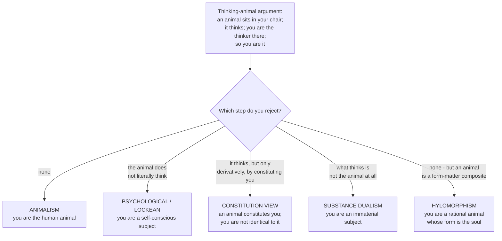

# Metaphysics · Lesson 6.5: What a person is

> ⏱ ~15 min · Module 6: Free will and persons · Builds on: [6.4 Libertarianism and its critics](06-04-libertarianism-and-its-critics.md) · Unlocks: [6.6 Personal identity over time](06-06-personal-identity-over-time.md)

## Why this matters

Module 6 has spent four lessons asking whether *you* could be free and responsible. It never asked what you are — and that is not a detail. If you are a human animal, then you existed before you had a thought and may exist after your last one, and the thing bearing your responsibility is an organism. If you are instead a thinking self the animal carries around, then "you" and the animal have different histories, and they can come apart in a hospital.

The question also fixes how the next lesson can be asked at all. "What makes a person at one time the same person as a person at another?" presupposes that **person** is the kind whose persistence you are tracking. If "person" is more like "student" than like "horse" — a phase something goes through — the question was mis-posed, and [6.6](06-06-personal-identity-over-time.md) has to be re-aimed at whatever the underlying thing is. This lesson decides which.

Two flags. What consciousness *is*, whether thought is physical, and whether a machine could think belong to `philosophy-of-mind` — cited here, never argued. The immortality of the soul as doctrine belongs to `creation-grace-last-things`; the soul appears here only as a philosophical posit about what unifies a living body.

## The idea

Olson's framing is the clarifying one. Separate two questions that get run together:

> **The personhood question.** What is it to *be* a person — what does a thing have to have (rationality? self-consciousness? a capacity to be held to a law?) to count as one?
>
> **The thing question.** What are *we* — what kind of thing is the entity now reading this sentence?

They come apart because an answer to the first does not settle the second: you can hold that personhood requires self-consciousness and still hold that the thing which is self-conscious is a biological organism. The traditional definitions — Boethius's, Locke's — answer the personhood question. Animalism answers the thing question and is nearly silent on the first.

And here is the pressure that organizes the debate. Whatever else is true, a **human animal** is sitting where you are sitting, with your brain and your history. If you are *not* that animal, it is sitting there too — and it has everything thinking requires. So it thinks. Then there are two thinkers in your chair, which is one too many.

That is the **too-many-thinkers** problem, and every view below is partly a strategy for handling it.

## Source

Two public-domain definitions, both of which answer the *personhood* question and neither of which settles the thing question.

**Boethius**, *Contra Eutychen et Nestorium* III, written to give Christological debate a precise vocabulary, argues that "person" belongs only to substances, only to rational ones, and only to individuals rather than universals, and so reaches the formula (Stewart and Rand, 1918): a person is **"the individual substance of a rational nature"** — *naturae rationabilis individua substantia*.

Three conditions, each doing work: **substance** (not a property, not a phase, not an event), **rational nature** (the *kind* carries the rationality, not the current exercise of it), and **individual** (this one, not the kind). The consequence: a sleeping or unconscious human is still a person, because what qualifies is the nature, not the performance.

**Locke**, *Essay* II.xxvii.9, deliberately moves the criterion from nature to activity:

> "...to find wherein personal identity consists, we must consider what person stands for;—which, I think, is a thinking intelligent being, that has reason and reflection, and can consider itself as itself, the same thinking thing, in different times and places..."

And at II.xxvii.26 he says what the concept is *for*:

> "It is a forensic term, appropriating actions and their merit; and so belongs only to intelligent agents, capable of a law, and happiness and misery."

*Forensic* means belonging to the courtroom. "Person," for Locke, is not primarily a biological or metaphysical classification but the concept we use to attach deeds to an agent for praise, blame, reward and punishment. Which is why he already pulls three things apart — the **substance**, the **man** (the living human body), and the **person** — and it is that separation, not the memory criterion, that makes every later transplant story thinkable. The exegesis of II.xxvii is [`modern-philosophy`](../../modern-philosophy/syllabus.md) 3.3's; what we do with it is ours.

## The argument

**1. Animalism.** *We are human animals* — each of us identical to a biological organism. "Person" is a status the animal holds while it has certain psychological capacities, not what the animal fundamentally is.

The central argument, due to Olson:

> **P1.** There is a human animal sitting in your chair.
> **P2.** That human animal is thinking. (It has a working human brain and nervous system; if any animal anywhere thinks, this one does.)
> **P3.** You are the thinking being sitting in your chair.
> **∴ C.** You are that human animal.

In words: something animal is doing the thinking there, and you are the thinker there, so you are it.

The argument is valid and every premise is hard to deny. Denying P1 means denying that human organisms exist — available to a mereological nihilist ([2.3](02-03-hylomorphism-and-composition.md)), expensive for anyone else. P3 is close to a tautology. So the weight falls on **P2**, and the price of denying it is high: you must say that the human animal, brain and all, does not think.

There is an **epistemic** version that bites harder. If there were two thinkers in your chair, the animal would have thoughts just like yours, including *I am a person, not an animal*. One of you would be wrong. How would you know which one you are? Animalism dissolves the worry by leaving one candidate.

**The bill animalism pays,** openly:

- **The fetus.** You were once an early fetus with no mental life. (How early depends on when the organism begins, which animalists dispute among themselves.) If you are the animal, you existed with no psychology whatever, and no psychological relation connects you to that thing.
- **The persistent vegetative state.** Destroy the cortex, leave the organism self-regulating, and the animal is still there — so you are, a living human being with no inner life. (Worked below.)
- **The transplant intuition.** Move your cerebrum into a debrained body. Almost everyone's intuition is that *you* wake up in the new body. But the animal goes nowhere: a detached cerebrum is not an animal, and the organism left behind is the one that was breathing and digesting all along. So animalism says you stay put and the waker is someone else — which Olson accepts, on the ground that an intuition is not an argument.

**2. The psychological, or Lockean, view.** *We are essentially psychological beings*: a person is a thinking, self-conscious subject, and you go where your psychology goes. Locke's definition points this way, and it delivers the transplant intuition directly — you are wherever the self-conscious thinking is.

Its problem is P2, and the neo-Lockean has three exits, each a real position:

- **Deny that the animal thinks.** Shoemaker's route: psychological states are individuated by functional roles, and those roles include persistence conditions; since the animal's persistence conditions are biological, nothing with biological persistence conditions literally has a belief. Cost: a very strong claim about what thinking is, one `philosophy-of-mind` has to underwrite.
- **Accept two thinkers, deny it is a problem.** There are two, but "I" picks out the person. Cost: the epistemic version above is unanswered.
- **Deny that the person is identical to the animal without making them two independent thinkers** — the constitution view.

**3. The constitution view (Baker).** *A person is constituted by a human animal, but is not identical to it.* The relation is the same one the statue bears to the lump of clay in [5.3](05-03-coincidence-and-the-ship-of-theseus.md): same matter, different persistence conditions, different kind, not two independent objects.

What constitutes a person, for Baker, is the **first-person perspective** — not the rudimentary perspective on the world from a location that many animals have, but the *robust* capacity to conceive of oneself as oneself, to think "I wonder whether I will still care about this next year." An animal constitutes a person when and while it has the capacity for that perspective.

That yields her answer to too-many-thinkers: the animal does think, but **derivatively** — it has the property in virtue of constituting something that has it non-derivatively. There are no more two independent thinkers than there are two independent weights when you weigh the statue.

**The bill.** Two things share your matter, a cost anyone who denies constitution-is-identity already pays in [5.3](05-03-coincidence-and-the-ship-of-theseus.md). And "derivative thinking" has to be explained. Olson's reply is blunt: either the animal thinks or it does not; if it does, however derivatively, the epistemic problem returns, because a derivative thinker with your thoughts is still a thinker who can wonder which one it is.

**4. Substance dualism.** *We are immaterial thinking substances.* The body is not a part of you, or not essentially. This denies P2 outright: the animal is not what thinks; the soul is, and it is not the animal.

Its contemporary defenders (Swinburne, Hasker, Lowe's non-Cartesian version) argue not from Cartesian doubt but from the unity or simplicity of the subject of experience, against interaction, causal closure and Kim's pairing problem — `philosophy-of-mind` 1.2's property, and a minority position in the profession today. The shape is what matters here: "person" is a substance sortal, the animal is at most an instrument, and the transplant intuition is easy.

**5. The hylomorphic view.** *We are rational animals whose substantial form is the soul.* This is the answer most often mistaken for dualism, and the mistake is worth killing carefully.

From [2.3](02-03-hylomorphism-and-composition.md): a **form** is not a thing sitting alongside the matter, but the principle of organization by which this matter is one thing of a kind, with that kind's powers. The *soul* here is just the substantial form of a living body — what makes this matter one organism rather than a heap of chemistry — and "rational soul" names the form of a body whose characteristic powers include understanding.

So the hylomorphist **accepts the thinking-animal argument's conclusion**: you are the animal, one substance, one thinker, no derivative-thinking machinery. The disagreement with animalism is not over the conclusion but over what an animal *is* — an organism is one thing in virtue of its form, and the rational powers belong to the whole composite, not to a part of it. Which is why this is not dualism: the dualist's soul is a *substance* that thinks and could in principle exist complete on its own; a form is not a thing that thinks. "The soul understands" is, on this view, as sloppy as "the eye sees" for "the animal sees with its eye."

**The bill.** First, 2.3's general one: form must be more than the arrangement of the parts, or the view collapses into a Humean description of structure. Second, an internal dispute it cannot dodge — if the rational soul persists without the body, is the separated soul *the person*, or does the person cease and await the body's restoration? **Survivalists** say the first, **corruptionists** the second, and corruptionism has the sharper claim to consistency, since a form is not a substance. The doctrinal side of that is `creation-grace-last-things`'s; nothing doctrinal is taught or presupposed here.

**The distinction that decides 6.6.** Wiggins's pair of terms:

> A **substance sortal** applies to a thing for as long as it exists and supplies its persistence conditions — *horse*, *human animal*.
> A **phase sortal** applies only during a stretch of a thing's career — *student*, *adolescent*, *caterpillar*.

Now ask: which is **person**?

If it is a *phase sortal*, a person coming into existence is not a thing coming into existence — it is an animal acquiring a capacity, the way a human becomes a student — and a person ceasing is not a death. That is Olson's view, and why he says there is strictly no such thing as *the* problem of personal identity: the persistence question must be asked about human animals, and "same person" rides along on "same animal."

If it is a *substance sortal*, the persistence question is a real question about a thing and a psychological criterion is in the running — which is where [6.6](06-06-personal-identity-over-time.md) starts. Boethius makes it one by definition. The hylomorphist does too, but harmlessly, since for him the person and the animal are the same substance under one form. Locke is the interesting case: he makes "person" a kind in its own right, but a *forensic* one, individuated by what we need for attributing deeds rather than by what biology or metaphysics tracks.

## Map of positions

| View | What you are | "Person" is a… | Who thinks in your chair | Transplant: where do you go? |
|---|---|---|---|---|
| **Animalism** | a human organism | phase sortal | one thinker: the animal | nowhere — you stay behind |
| **Psychological / Lockean** | a self-conscious subject | substance sortal, forensic kind | one thinker: the person; the animal does not think | with the cerebrum |
| **Constitution (Baker)** | a person constituted by an animal | substance sortal | one non-derivative thinker, one derivative | with the first-person perspective |
| **Substance dualism** | an immaterial subject | substance sortal | the soul | wherever the soul goes |
| **Hylomorphism** | a rational animal, form and matter | substance sortal, same substance as the animal | one thinker: the composite | disputed; the form goes with the living body |

## Worked examples

**Example 1 (clean run — the eight-week fetus).** Point at an ultrasound. Is that thing you?

- **Animalism:** yes, provided the organism has begun. You are that animal; it had no thoughts then and you have them now, exactly as it had no teeth then and you have them now.
- **Psychological view:** no. There was no self-conscious subject there, so there was no you. The organism that is now your body existed; you began when the psychological capacities did.
- **Constitution view:** no, and for a sharper reason. The animal existed and was *not yet* constituting a person, having no capacity for a first-person perspective. When it acquired one, a new thing — you — came to be, constituted by it, as the statue comes to be in clay that was already there.
- **Hylomorphism:** yes, if the form of a rational animal is present: an individual of a rational kind has that kind's powers whether or not it is exercising them — Boethius's *rational nature*, not rational performance.
- **Substance dualism:** depends entirely on when the soul is there, which the view does not settle on its own.

Every view agrees on the biology. They disagree about which thing the pronoun picks out.

**Example 2 (a hard case — the persistent vegetative state).** An invented case. Ilse suffers an anoxic injury. Her cortex is destroyed, her brainstem intact. She breathes without a ventilator, has sleep-wake cycles, heals cuts, and will never have another experience. Ten years on, the body is alive.

- **Animalism** gives the clean answer and the uncomfortable one at once: the animal persists, so **Ilse is lying in that bed**, alive and no longer capable of anything that mattered to her. Olson would say this is not a defect but a fact the view lets you state — the tragedy is not that Ilse is gone, it is that Ilse is there and gutted.
- **The psychological view** says Ilse ceased to exist ten years ago and the body is an organism that once constituted her. That gets the family's grief right and the chart wrong: someone is being fed, someone's name is on the wristband, and the view must call that a courtesy.
- **The constitution view** says the same and owes more: the capacity for a first-person perspective must be *destroyed*, not merely unexercised, so the line between a destroyed capacity and a dormant one (dreamless sleep, deep anaesthesia, reversible coma) has to be sharp enough to carry the weight.
- **Hylomorphism** says the animal is alive, so the form is present, so the substance is — Ilse is in the bed, her rational powers radically impeded by damage to the organs they require. Its cost is explaining how a power of the *form* is blocked by the *matter*, without the form turning out to be something that needed matter to think.

The strains run in opposite directions: the psychological family gets the transplant right and the bedside awkward, animalism the reverse. That symmetry is the state of the debate, and [6.6](06-06-personal-identity-over-time.md) presses it with fission, where *everyone* strains.

## Watch out

- **"Person" is not a synonym for "human being."** Both classical definitions leave room for non-human persons and for human beings that are not currently persons. Sliding between the two answers a different question from the one asked.
- **Do not read the hylomorphist's "soul" as the dualist's soul.** The dualist's soul is a substance that thinks; the hylomorphist's is the form of a substance, and forms do not think — composites do. Confusing them turns 2.3's apparatus into Cartesianism with new vocabulary, the commonest misreading in this area.
- **Animalism is not a criterion of persistence.** It answers the thing question. Add a view about when organisms persist and you get a persistence criterion; animalism alone does not say biological continuity is the criterion of personal identity, and not every animalist is a biological-continuity theorist.
- **Constitution is not composition, and not identity.** The animal does not have you as a part, and you are not "made of" it mereologically. If you catch yourself saying the constitution theorist posits two coincident *thinkers*, you have skipped the derivative/non-derivative distinction — which may be indefensible, but has to be attacked, not ignored. Too-many-thinkers is a problem, not a proof.
- **Keep the personhood question and the thing question apart.** You can be a full-blooded Lockean about what makes something a person and an animalist about what you are. Most arguments that look like they cross the gap have smuggled in the premise that "person" is a substance sortal.

## One-liner

> There is a human animal in your chair, and it thinks — so either you are it, or you owe an account of the other thinker; whether "person" names that animal's kind or merely one of its phases is what decides how the persistence question in 6.6 can even be asked.

## Problems

**P1 (🟢) *(Exegetical.)*** The thinking-animal argument as stated above has three premises. For each of (a) the psychological view, (b) the constitution view, (c) the hylomorphic view: name the premise the view denies, or say that it accepts all three and explain how it avoids two thinkers. One or two sentences each. Then, in one line, say which of the three treats "person" as a phase sortal.

**P2 (🟡) *(Exegetical (a) · Evaluative (b).)*** An invented paragraph from a hospital ethics committee's memo on advance directives:

> "By the time the dementia is advanced, the individual who signed the directive is no longer with us. What remains is a new person, with settled preferences of her own — she enjoys the music, she resists the feeding tube — and the document was signed by someone else entirely. A directive binds its author, not a stranger who inherits her body. Our obligation runs to the patient in front of us."

(a) Name the commitment about what a person is that the memo needs, and say which view of "person" as a sortal it presupposes. Then say what an animalist would have to change in the paragraph, sentence by sentence, while keeping the memo's practical conclusion open. (b) Does the memo's argument survive if "person" is a phase sortal? **150 words or fewer for (b)**, any verdict, provided you say what the practical conclusion would then have to rest on instead.

**P3 (🔴, optional) *(Evaluative — find the crux.)*** Baker says the human animal thinks, but derivatively, in virtue of constituting a person who thinks non-derivatively. Olson replies that a thinker is a thinker, and that the epistemic problem returns: if the animal has your thoughts at all, it can wonder which of the two it is, and so can you. **In 150 words or fewer**, name the single premise one side must deny, and say what would move it. Any verdict; the crux is what is graded.

Solutions

**P1** *(Exegetical — strict.)*

**Must hit, strict:**
- **(a) Psychological / Lockean:** denies **P2** — the human animal does not literally think. The standard support is Shoemaker's: psychological states are individuated by functional roles that include persistence conditions, and the animal's persistence conditions are biological, so the animal cannot literally have beliefs. (Accepting P2 and living with two thinkers is a different neo-Lockean option, but then the view is not denying a premise; it is denying that the conclusion's rivals matter. Either answer earns credit if labelled correctly.)
- **(b) Constitution view:** denies **P2** *as stated* — or, more precisely, accepts that the animal thinks only **derivatively**, in virtue of constituting a person who thinks non-derivatively, so that P2 is true only in a sense that does not deliver a second independent thinker. Credit either phrasing; what must appear is the derivative/non-derivative distinction.
- **(c) Hylomorphism:** **accepts all three premises** and the conclusion — you are the animal, and there is exactly one thinker. It disagrees with animalism not about the conclusion but about what makes an animal one thing (a substantial form, [2.3](02-03-hylomorphism-and-composition.md)) and about the rational powers belonging to the whole composite.
- **Phase sortal:** none of the three. Animalism is the view on which "person" is a phase sortal; all three of these treat it as a substance sortal.

**Wrong turns:** saying the hylomorphist denies P2 because "it is the soul that thinks" — that is the dualist's claim, and the hylomorphist's whole point is that the form is not a thinker; assigning the phase-sortal answer to the Lockean because Locke separates person from man — Locke makes person a kind in its own right, a forensic one.

**Model answer:** as above.

---

**P2** *(a) exegetical — strict; (b) evaluative — any verdict.*

**Must hit, strict (a):** the memo needs **person** to be a substance sortal on a **psychological** criterion — a person is a thinking self-conscious subject, and enough psychological discontinuity means one thing has ceased and another has begun. "No longer with us" and "a new person" are existence claims, not claims about change; "inherits her body" presupposes that the body is not the patient. This is the Lockean or constitution family.

The animalist rewrite, sentence by sentence: *one animal* has persisted throughout, so nobody ceased to exist and nobody is new; the same patient signed the directive and is now in the bed; her preferences have changed radically, as preferences can within a single life; "a stranger who inherits her body" is false, because the body is not something the patient has. Crucially, **the practical conclusion stays open**: the animalist can still argue that a directive loses authority when the interests it was written to protect have been replaced, which is a claim about what makes consent binding over time, not a claim about who is in the bed.

**Must hit, any verdict (b):** state what the memo loses if "person" is a phase sortal — the premise that the author of the directive no longer exists, which was doing the whole argumentative job. Then say what the conclusion would have to rest on instead: a normative claim about the authority of past consent over a radically altered later self (present interests vs prior autonomous choice), not a metaphysical claim about identity. Either verdict passes if that relocation is named.

**Wrong turns:** deciding the case by declaring a view of personal identity true, which is not what was asked; treating the animalist rewrite as automatically settling the ethics against the memo — it does not, it only moves the argument; overlooking that "she enjoys the music" already helps itself to a subject with preferences, which the memo simultaneously calls new.

**Model answer (b), one of several:** It survives, but as a different argument. On a phase-sortal reading, the author of the directive is the patient in the bed — one animal, one life, one signatory. So the memo can no longer say the document binds a stranger. What it can say is that the authority of prior consent is not unconditional: a directive derives its force from the autonomous interests it expresses, and when those interests are gone rather than merely thwarted, the case for enforcing it against present welfare weakens. That is a claim in ethics about the scope of precedent autonomy, and it needs defending on its own. The metaphysics was doing work it cannot do; whether the practical conclusion still stands depends on an argument the memo never made.

---

**P3** *(Evaluative — any verdict; the crux is what is graded.)*

**Must hit:** identify the premise. It is Olson's principle that **anything that thinks at all is a thinker in the sense relevant to the epistemic problem** — that there is no way of having thoughts that is real enough to be true of the animal and thin enough not to generate a second candidate for "I". Baker must deny it; Olson must hold it. Then say what would move it: an independent account of derivative property-possession that is already needed elsewhere and that has the right features — the statue and lump case in [5.3](05-03-coincidence-and-the-ship-of-theseus.md) is the natural test bed, since the lump derivatively has the statue's shape and value without being a second artwork. If derivative possession works there and transfers to thinking, Baker's reply is principled; if thinking turns out to be relevantly unlike shape — in particular if being a thinker, unlike being shaped, is a matter of being a subject rather than of instantiating a property — Olson's principle stands.

**Wrong turns:** restating both positions without naming a premise; answering that constitution is not identity, which both sides agree on and which is not the disputed step; treating the problem as merely verbal without running the test for a verbal dispute ([`philosophical-method`](../../philosophical-method/syllabus.md) 3.2) — that would require showing the two agree on every non-linguistic fact, and they do not agree on how many subjects there are.

**Model answer, one of several:** The crux is whether "thinks derivatively" names a way of thinking or a way of being described. Baker needs it to be genuine property-possession — the animal really does think — yet insufficient to make the animal a *subject*, because subjects are what "I" tracks. Olson's premise is that this distinction cannot be drawn: whatever has the thoughts can host the question. What would move me is the parity with constitution cases elsewhere. The lump derivatively has the statue's aesthetic properties and nobody counts two artworks, so derivative possession is not an invention for this debate. But shape and value are not perspectival, and thinking is: the worry is not that two things have a property, it is that two things would each be positioned to ask which they are. Until Baker gives a general account on which derivative possession fails to confer that position, the crux favours Olson.

## Flashback

**F1 (🟡) *(Exegetical (a) · Evaluative (b).)*** From [6.3](06-03-frankfurt-cases-and-alternate-possibilities.md). An invented passage from a professional-conduct arbitrator's ruling:

> "Dr Havel's defence is that the rota left him no option: given the shift he had been assigned, no other course was open to him that night. We accept that factual claim. A practitioner cannot be sanctioned for an outcome he was powerless to avoid, and the charge of negligence must therefore fail. Whether his conduct sprang from his own clinical judgment or from the rota is beside the point; what matters is that no alternative was available to him."

(a) Name the principle the ruling rests on and state it precisely; identify the sentence in which the ruling commits itself to **leeway** rather than **source** incompatibilism; and say why this is *not* a Frankfurt case. (b) Build, in three sentences, a case with the ruling's structure — an agent with no alternatives — in which you would nonetheless hold the agent responsible. Then name the horn of the dilemma defence your case is most exposed to, and why. **120 words or fewer for (b)**, any verdict.

Solution

**Must hit, strict (a):**
- **The principle is PAP:** a person is morally responsible for what he has done only if he could have done otherwise. Any accurate phrasing is fine, but it must be a necessary condition on *responsibility* (not on freedom, and not on action), and it must be about alternatives. The ruling uses it as the sole ground of acquittal: "cannot be sanctioned for an outcome he was powerless to avoid."
- **The leeway commitment** is the last sentence: "Whether his conduct sprang from his own clinical judgment or from the rota is beside the point; what matters is that no alternative was available." That explicitly rules the *source* question irrelevant and makes the availability of alternatives the entire test. A source incompatibilist reverses it: what matters is whether Havel is the origin of his conduct, and the absence of alternatives is at most evidence about that.
- **Why it is not a Frankfurt case:** in a Frankfurt case the factor that removes the alternatives plays **no role in the actual sequence** — the intervener never fires. Here the rota is part of the actual explanation of what Havel did; it constrained him in the actual sequence, not merely counterfactually. So Frankfurt's argument does not touch this ruling directly. What would undermine the ruling is showing PAP false in general, which then removes the acquittal's only premise and forces the arbitrator to ask a source question instead.

**Must hit, any verdict (b):** the constructed case must have all three structural features, and a horn named with a reason.
- No alternative possibilities for the agent.
- A factor that removes them but is **idle in the actual sequence** — a counterfactual intervener, or a buffer the agent never crosses.
- The agent acting on her own reasons, so that the responsibility judgment is about her and not about the intervener.
- Then the horn. **Horn 1:** if the prior sign the intervener watches is deterministically linked to the decision, the case presupposes that a prior state settles the choice, which is what the incompatibilist denies is compatible with responsibility — so it begs the question. **Horn 2:** if the link is merely probabilistic, the intervener cannot guarantee the outcome, so at the moment of decision the agent could have done otherwise and PAP survives. A student who builds a buffer case should say it aims at both horns and name what the buffer is a necessary condition *of*, plus what that stipulation costs.

**Wrong turns:** treating the ruling as already a Frankfurt case — the rota is doing actual work, which is exactly the difference; stating PAP as a condition on free action rather than on responsibility; building a case in which the intervener actually fires, which destroys the judgment the case was supposed to elicit; giving a verdict on whether Havel was negligent, which was not asked.

**Model answer (b), one of several:** An anaesthetist, Roo, decides whether to report a colleague's error. Unknown to her, the hospital's compliance system flags the incident automatically and would have filed the report itself had she shown any sign of staying silent; the flag never triggers, and she files it herself, for her own reasons. She could not have brought about non-reporting, yet the credit is hers, because the system played no part in what she actually did. My case is most exposed to horn 1: I needed the sign the system watches to be a reliable indicator, and reliability of that kind looks like determination — so an incompatibilist can refuse the responsibility judgment without ever discussing alternatives.

## Connections

- **Backward:** [6.1](06-01-determinism-and-the-consequence-argument.md)–[6.4](06-04-libertarianism-and-its-critics.md) asked whether you are free; this asks what the "you" is. [2.1](02-01-substance-and-accident.md) supplies *substance*, and [2.3](02-03-hylomorphism-and-composition.md) supplies *form* — without which the hylomorphic answer is unreadable. [5.3](05-03-coincidence-and-the-ship-of-theseus.md) supplies **constitution is not identity**, which the constitution view is a direct application of: a person is to an animal as a statue is to its clay.
- **Forward:** [6.6](06-06-personal-identity-over-time.md) asks what makes you the same over time, and its shape is set here. If "person" is a phase sortal, the Lockean memory criterion is answering a question about a phase, not a thing; if it is a substance sortal, the criterion is a real competitor. The transplant intuition, fission, and the too-many-thinkers problem in its diachronic form all belong there.
- **Sideways:** what consciousness is, whether the animal's thinking is physical, and whether a machine could be a thinker are `philosophy-of-mind`'s — 1.1–1.2 for the map of views and the contemporary case for substance dualism, and its Module 5 for the soul-as-form applied specifically to mind. That course cites this lesson for what a person is and adds only what is peculiar to consciousness (split brains, uploading).
- **Historical source:** Locke's *Essay* II.xxvii read as a system, including the man/person/substance triad and the prince and the cobbler, is [`modern-philosophy`](../../modern-philosophy/syllabus.md) 3.3; Boethius and the medieval use of his definition belong to [`ancient-medieval-philosophy`](../../ancient-medieval-philosophy/syllabus.md). Here both are read as live proposals.
- **Bridge, not taught:** the corruptionist/survivalist dispute has a doctrinal half — the separated soul, immortality, the resurrection of the body — which is `creation-grace-last-things`'s and is neither taught nor presupposed here. The moral status of persons, and what follows practically from P2's memo, belong to [`ethics`](../../ethics/syllabus.md).
