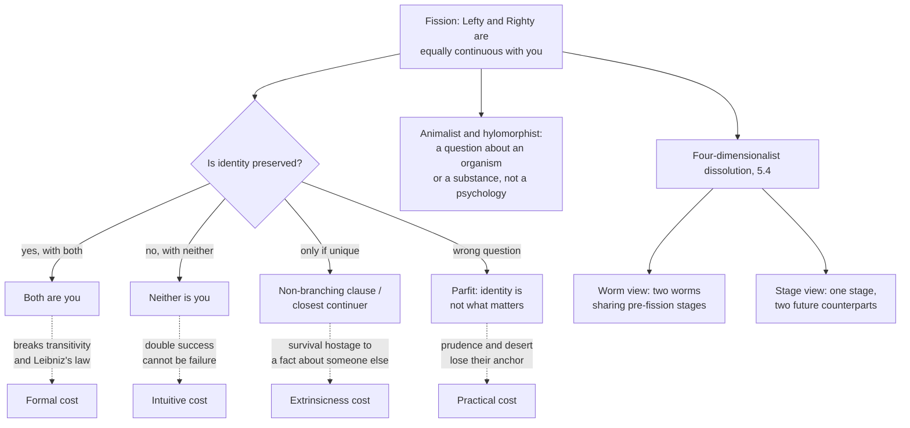

# Metaphysics · Lesson 6.6: Personal identity over time

> ⏱ ~15 min · Module 6: Free will and persons · Builds on: [6.5 What a person is](06-05-what-a-person-is.md), [5.4 Endurance, perdurance, and stages](05-04-endurance-perdurance-and-stages.md) · Unlocks: the course is complete

## Why this matters

Module 6 asked whether an agent acts freely. This lesson asks the question those four lessons were standing on: **what makes the thing that acts at noon the same thing as the thing that answers for it at midnight?** Without an answer, "you are responsible for what you did" has no subject, promises bind nobody, and prudence — caring now about a pain later — has no rational basis.

It also has the cleanest test cases in the course. Metaphysics usually argues about how to describe an agreed world; here we can build a case where every physical and psychological fact is agreed, and the identity question still has no obvious answer. That is either a genuine gap in our concepts or evidence that the question was never as deep as it looked. Which of those it is turns out to be the disagreement.

## The idea

Two questions, and running them together is the commonest failure here.

- **What are we?** A rational animal, a bundle of experiences, a thing constituted by an organism, an ensouled body? That was [6.5](06-05-what-a-person-is.md).
- **What is our criterion of identity over time?** Fill in: *x* existing at $t_1$ is the same person as *y* existing at $t_2$ **if and only if** ———. That is this lesson.

A constraint binds every candidate filling. From [5.3](05-03-coincidence-and-the-ship-of-theseus.md) and Leibniz's law, **identity is identity**: it is transitive (if *a* is *b* and *b* is *c*, then *a* is *c*), **one-one** (one thing at $t_1$ cannot be identical to two distinct things at $t_2$, since then those two would be identical to each other), and determinate. Almost every argument below is a collision between one of those formal facts and a relation — remembering, resembling, being continuous with — that lacks it. The relations we care about in persons are cheerfully non-transitive and one-many. Identity is not. Something gives.

## Source

Locke put the modern question in play in the *Essay Concerning Human Understanding* II.xxvii, "Of Identity and Diversity," where a person is defined as a thinking intelligent being that can consider itself as itself in different times and places (§9). The criterion arrives dramatized (§15):

> "For should the soul of a prince, carrying with it the consciousness of the prince's past life, enter and inform the body of a cobbler, as soon as deserted by his own soul, every one sees he would be the same person with the prince, accountable only for the prince's actions: but who would say it was the same man?"

And the point of the exercise (§26):

> "Person … is a forensic term, appropriating actions and their merit; and so belongs only to intelligent agents, capable of a law, and happiness and misery."

Three phrases decide it. **"Carrying with it the consciousness of the prince's past life"** — what travels is not the substance and not the body but the consciousness, and the criterion is *consciousness extended backwards*. **"Accountable only for the prince's actions"** — it is built to do forensic work, to fix whom you may punish. **"But who would say it was the same man?"** — Locke deliberately lets *person* and *man* come apart, claiming that the thing responsibility tracks is not the animal ([6.5](06-05-what-a-person-is.md) argues that as a view about what we are). Note what §15 does *not* say: not that the soul carries identity. Locke's next move is that the same soul without the prince's memories would not be the prince, and a different soul with them would be.

## The argument

### C1 — the memory criterion

> **Memory (Locke, as usually read).** *x* at $t_1$ is the same person as *y* at $t_2$ if and only if *y* is conscious of — remembers from the inside, as done or undergone by itself — some thought or action of *x*.

In words: you reach exactly as far back as your memory reaches, and no further.

**Butler: the criterion is circular.** From the dissertation "Of Personal Identity" appended to the *Analogy of Religion*:

> "consciousness of personal identity presupposes, and therefore cannot constitute, personal identity; any more than knowledge, in any other case, can constitute truth, which it presupposes"

> **P1.** Genuine memory is first-personal and factive: to remember doing *A* is to remember *oneself* having done *A*, and entails that one did it.
> **P2.** So "*y* remembers doing *x*'s action" already contains the claim that *y* is *x*.
> **P3.** A criterion of identity must not presuppose the identity it analyses.
> **∴ C.** Memory cannot constitute personal identity. It is excellent *evidence* of identity and no analysis of it.

The charge is not that memory is unreliable. It is that the concept is parasitic: you cannot build the thing it already contains.

The standard repair is **quasi-memory** — an apparent memory that represents a past experience roughly correctly and is caused by that very experience in whatever way ordinary memory is caused, with **no requirement that the experience was one's own**. Ordinary memory is then the special case whose source is oneself, and the circle is gone. The move is Shoemaker's, taken up by Parfit. It costs twice: specifying that cause without mentioning the person is hard, and a Butlerian can reply that q-memory is not our concept purged of an accident but a new relation invented to save a theory.

**Reid: the criterion is not transitive.** *Essays on the Intellectual Powers of Man*, Essay III, ch. 6:

> "Suppose a brave officer to have been flogged when a boy at school for robbing an orchard, to have taken a standard from the enemy in his first campaign, and to have been made a general in advanced life; suppose, also, which must be admitted to be possible, that, when he took the standard, he was conscious of his having been flogged at school, and that, when made a general, he was conscious of his taking the standard, but had absolutely lost the consciousness of his flogging."

> **P1.** (Locke) *x* is the same person as *y* iff *y* is conscious of *x*'s actions.
> **P2.** The officer is conscious of the boy's flogging; the general of the officer's capture; the general has no consciousness of the flogging.
> **P3.** From P1 and P2: officer = boy, general = officer, general ≠ boy.
> **P4.** Identity is transitive.
> **∴ C.** P1 is false: it makes the general both identical and non-identical to the boy.

Structural, not intuitive — and it is the objection that reshaped the field. Direct memory is not transitive; identity is; so no criterion can be *direct* memory.

### C2 — psychological continuity

Reid tells you how to repair the theory: replace the relation with its **ancestral**, which is transitive by construction.

- **Connectedness** is the direct relation: *y* q-remembers an experience of *x*; an intention formed by *x* is carried out by *y*; a belief, skill, value or trait of *x* persists in *y*.
- **Strong connectedness** holds when enough such connections hold — a threshold, set (as Parfit sets it) by the number holding in an ordinary person over an ordinary day.
- **Psychological continuity** is overlapping chains of strong connectedness: a series of stages from *x* to *y*, each strongly connected to the next.

> **Continuity.** *x* at $t_1$ is the same person as *y* at $t_2$ if and only if *y* is psychologically continuous with *x*, **the continuity has the right kind of cause**, and **no other candidate at $t_2$ is equally continuous with *x***.

In words: you survive as whoever is linked to you by an unbroken chain of overlapping mental connections — provided nobody else is equally well linked.

The general is now the same person as the boy: the officer-stage bridges them though no direct memory does. Reid is answered. The two extra clauses are live disputes, each decided by a case below.

- **The causal clause.** *Narrow*: only the normal cause counts (this brain, continuing to work). *Wide*: any reliable cause. *Widest*: any cause at all. Teletransportation turns entirely on the choice.
- **The non-branching clause.** It is there only because of fission. Without it the criterion is not one-one; with it, whether you survive can depend on what happens to someone else.

### C3 — the biological criterion

From the animalism of [6.5](06-05-what-a-person-is.md): if we *are* human animals, our persistence question is the persistence question for organisms.

> **Biological.** *x* at $t_1$ is the same person as *y* at $t_2$ if and only if *y*'s life is a continuation of *x*'s — the same ongoing self-maintaining biological event, the same metabolism holding the same organism in being.

In words: you go where your organism goes, and you last exactly as long as its life does. No psychology enters at any point.

Three consequences, which are its virtues or its refutation depending on whom you ask. **You were once a foetus** with no psychology at all — something the psychological criterion cannot say, since the foetus is mentally continuous with nobody. **You may survive in a permanent vegetative state**, the life continuing where the psychology has gone; the psychological theorist must say the patient in the bed is a living organism that is not you. And **a brain transplant does not move you**: your cerebrum goes into a new skull and someone there wakes with your plans, but your organism is still in the old bed, so you are. Olson accepts this without flinching — the sharpest bullet in the debate, and the psychological theorist's sharpest weapon.

The animalist's positive argument is the **too-many-thinkers problem**. Sitting where you sit is a human animal with a working brain; if thinking is what a working brain does, that animal thinks your thoughts. If you are not it, two thinkers are reading this sentence, each with equal warrant to call itself *me*, and you cannot know which you are. The cheapest escape is that there is one thinker and you are it. Constitution and psychological theorists reply by denying that the animal literally thinks, or by making "thinker" a status it has only derivatively.

The **hylomorphic** criterion from [6.5](06-05-what-a-person-is.md) agrees with the animalist about the foetus and the transplant for a different reason: what persists is a substance whose substantial form organizes this matter, not a metabolic process continuing. The difference shows at the edges — whether the person survives the organism's death (the corruptionist and survivalist positions), and whether a case describing one form informing two bodies describes anything possible.

## The case: fission

Everything above is stable until one case.

**The setup.** The hemispheres of a human cerebrum are broadly redundant; commissurotomy patients, whose hemispheres have been surgically disconnected, go on living apparently unified lives. Suppose the redundancy were complete. Your cerebrum is divided and the halves transplanted into two de-brained bodies, Lefty and Righty. Both wake with your memories, intentions, temperament and half-finished argument with your brother. Neither is damaged; neither has a better claim.

**Why this is structural, not merely hard.** Apply the psychological criterion without the non-branching clause: Lefty is continuous with you, so Lefty is you; Righty likewise; by transitivity Lefty is Righty — false, since they are in two rooms and one can be anaesthetized while the other reads. Continuity is one-many; identity is one-one. **Fission is a proof that continuity is not identity**, and it needs no intuition about what you should hope for on the table.

| Response | What it says | What it costs |
|---|---|---|
| **Both are you** | You are identical to Lefty and to Righty | Transitivity or one-one identity goes, and Leibniz's law with it: Lefty is anaesthetized and Righty is not, so you both are and are not anaesthetized |
| **Neither is you** | You ceased to exist on the table; two new people began | Double success is failure. Had the second transplant failed, you would have survived as the one that took — so adding a success cannot be what kills you, and nothing intrinsic to Lefty differs between the two scenarios |
| **Non-branching / closest continuer** | You survive as *y* only if *y* is continuous with you and no equal or better candidate exists; on Nozick's version you survive as the closest continuer when there is one | Identity depends on **extrinsic** facts. Wiggins's "only *x* and *y*" principle says whether *x* is *y* turns only on how things stand with *x* and *y*; here it turns on a stranger in another room. In symmetric fission it collapses into "neither" |
| **Identity is not what matters** | The question has no answer here and needs none: what we care about in survival is the continuity, present twice over | Gives up the assumption that concern for our own future is concern *for ourselves*, and with it the ordinary basis of prudence, desert and compensation |

**Parfit's response, at full strength.** Four steps, stated the way its author would state them.

1. **Reductionism.** A person's existence just consists in a brain, a body, and a long series of interconnected physical and mental events. There is no further fact — no Cartesian ego, no bare substance — over and above them whose presence settles identity.
2. **So some identity questions are empty.** In fission we know every fact there is. If an open question remained — *but which one is really me?* — it would have to concern a further fact, and reductionism says there is none. The question is not unanswerable; it is a question about how to describe what we already fully know.
3. **Identity is not what matters in survival.** What we care about in caring about our own future is **Relation R**: psychological connectedness and continuity, with the right kind of cause. Ordinarily R and identity travel together, which is why we mistake one for the other. Fission pulls them apart: identity fails, R holds twice. Parfit's claim is that R is what we actually cared about, so fission is about as good as ordinary survival. Losing uniqueness is not losing what you wanted.
4. **The upshots, which he presses rather than hides.** R comes in degrees; identity cannot. So the special weight we give our own future has no sharp thing to attach to: diminished reason to dread one's own death, weaker claims to compensation across a life, pressure on desert-based punishment of a self only faintly connected to the offender. He presents these as release from a mistaken picture rather than loss.

**The replies, at the same strength.** *Deny reductionism*: if we are substances — animals, or ensouled bodies — step 2's force evaporates, and the question is unanswerable rather than empty. *Deny that the case is about us*: the animalist says no organism fissions here; one animal is destroyed or damaged and two are repaired, and the answer is determinate if surprising. *Deny that R is what matters*: you cannot anticipate two mutually exclusive futures, so the attitude Parfit says survives fission does not. Nothing here settles which is right.

**The four-dimensionalist dissolution.** [5.4](05-04-endurance-perdurance-and-stages.md) gave two ways to be a four-dimensionalist, and they buy different things.

- **The worm view** (persons are four-dimensional wholes with temporal parts): fission contains **two worms sharing all their pre-fission stages**. Both existed before the operation, overlapping completely; the surgery separated them rather than made them. *It gets identity exactly right* — one-one and transitive throughout, no non-branching clause, nothing extrinsic, every post-fission person strictly identical to a pre-fission person. *It pays in counting*: how many people were in the pre-operative room? Two. Lewis's repair is to count by **identity-at-a-time** — two worms sharing a stage are "the same person at *t*" — which gives one person in the room, and is admitted to be a repair. Lewis also argues both identity and R matter, since in every non-branching case they coincide.
- **The stage view** (persons are momentary stages; persistence is having suitable temporal counterparts): you are the stage on the table, and "I will exist this afternoon" is true because this stage has a future counterpart. In fission it has **two**, so "I will be Lefty" and "I will be Righty" are both true while "Lefty is Righty" is false. *It gets counting exactly right* — one stage, one person in the room, by the ordinary rule, no patch. *It pays in tensed predication*: those future-tense claims are counterpart claims, and the counterpart relation is neither transitive nor one-one, so the oddity is relocated rather than removed, and strictly nothing persists at all.

The two trade the same problem back and forth: clean identity at the price of counting, or clean counting at the price of tensed talk. What both deliver, and the endurantist does not, is that no hidden fact is left over — the description is complete and the residue is bookkeeping. That is Parfit's step 2 without his step 3. The endurantist replies that a person is not the sort of thing with temporal parts to share, so "two overlapping worms" is a change of subject rather than a solution ([5.4](05-04-endurance-perdurance-and-stages.md) has the general argument).

## Worked examples

**Example 1 (clean — dense retrograde amnesia).** Ines, 44, is thrown from a horse. She wakes with intact language, skills, temperament and a normal capacity to form new memories, but no experiential memory of anything before the fall. Her sister is a stranger to her.

1. **Memory criterion.** She is conscious of no thought or action of the woman who mounted the horse. So on Locke's criterion as stated, that woman no longer exists and a person hours old is in the bed, accountable for nothing she did. Locke faces this in II.xxvii without blinking: the *man* may be punished for what the *person* did not do, and he appeals to the day of judgment, when nobody will answer for what they are not conscious of.
2. **Psychological continuity.** It depends on what else survives. If experiential memory is the only lost connection — beliefs, skills, values, temperament and standing intentions carrying across the fall — strong connectedness may still hold, and she is the same person by a chain that never runs through memory. If the fall severed *all* direct connections, there is no chain and the continuity theorist joins Locke. That is the payoff of moving from memory to connectedness: memory becomes one connection among several.
3. **Biological criterion.** One organism, one continuous life, no question. Ines is Ines; the amnesia is a misfortune that happened *to* her — which is what a court, a hospital and her sister all already assume.

Clean because the three are cleanly ordered: no; probably-yes, and here is what it turns on; yes. It shows what the shift from C1 to C2 buys, and why the animalist thinks a simple matter has been made complicated.

**Example 2 (where it strains — teletransportation, and Williams's reversal).** A scanner on Earth records the state of every cell in your body, destroys the original in the reading, and transmits the blueprint to Mars, where a replica is built from new matter. The person who steps out remembers stepping in.

This is fission's structure in different clothes, and it isolates the **causal clause**. Continuity holds: the Martian's states depend reliably and specifically on yours.

- **Wide or widest cause:** the Martian is you; teletransportation is travel.
- **Narrow cause:** only this brain's continued functioning counts; the Martian is a replica and you died in the scanner.
- **Biological:** your life ended when the organism was destroyed; whatever was assembled on Mars is a new organism. Clean, and independent of how the psychology travelled.
- **Hylomorphic:** what would have to travel is the form organizing this matter, and a blueprint is information *about* a form, not a form informing anything. Whether a substance can be reassembled is the Ship of Theseus ([5.3](05-03-coincidence-and-the-ship-of-theseus.md)) with a rational animal in the ship's role.

**The branch line.** The scanner now malfunctions: it reads you without destroying you, and the replica is built anyway. You stand in the booth with ruined organs and a few days to live, watching a Martian who remembers everything you do. Nothing about the Martian differs from the basic case — same states, same cause — yet there the psychological criterion called him you and here it cannot, since you are standing right there. That is the extrinsicness cost made vivid. Parfit's use is the mirror image: your relation to the Martian is R without identity, and the question is whether the days left in the booth are the loss they feel like.

**Williams's reversal.** Bernard Williams, in "The Self and the Future," describes one procedure twice and pumps opposite intuitions. *First*: A and B will have their psychological contents swapped, then one will be tortured, and you — as A — choose which body. Most people choose the A-body, protecting the body that will carry their psychology; that verdict is the psychological criterion. *Second*: you are told that tomorrow you will be tortured, that beforehand you will lose all your memories, and that you will then be given someone else's. Told this way the additions read as aggravations rather than escapes, and fear looks rational; that verdict is the bodily criterion. The two descriptions fit the same events. Williams presses the second as more honest; the load-bearing lesson is methodological and belongs to [`philosophical-method`](../../philosophical-method/syllabus.md) — a case-based argument here can be reversed by re-describing the case, so an intuition is evidence about a description as much as about the world.

## Watch out

- **The memory criterion is not psychological continuity.** Locke's criterion is direct consciousness of a past action, and Reid kills it. Continuity is the ancestral of a *family* of connections, memory being one. Objections to the first mostly miss the second, and attributing the second to Locke is an exegetical error.
- **Butler's objection and Reid's are different objections.** Butler: circular (memory presupposes identity). Reid: wrong formal shape (memory is not transitive). Quasi-memory answers Butler and does nothing about Reid; the ancestral answers Reid and does nothing about Butler. You need both repairs.
- **Fission's force is formal.** Continuity is one-many and identity is one-one. You cannot answer that by reporting what you would hope for.
- **"Neither is you" and the non-branching clause are not different verdicts in symmetric fission.** They differ only in asymmetric cases, where a closest-continuer view picks a winner and a strict non-branching clause still refuses.
- **Parfit is not saying you should not care about your future.** He says what you care about is R, that R is present in fission, and that R comes in degrees. Reading him as a nihilist about survival misstates the position and makes the replies too easy.
- **The four-dimensionalist does not answer the practical question.** "Two worms were always there" tells you how to count, not whom to punish, whom to compensate, or what to anticipate.

## One-liner

> Identity is one-one and transitive; everything we actually care about in surviving is neither — so either a clause is added that makes your survival depend on a stranger, or the identity question is conceded not to be the one that mattered.

## Problems

**P1 (🟢) *(Exegetical.)*** An invented advertisement:

> **SUNBEAM TRANSIT — arrive in minutes, not months.** Our scanner captures every cell of your body at atomic resolution, and our Mars terminal rebuilds you from local matter within four minutes. You will step out with every memory and plan intact. Ask yourself: what is a body, after all, but the pattern it holds? You are not your atoms — your atoms are replaced every seven years anyway. Sunbeam is safer per journey than the shuttle, and no passenger has ever reported feeling a thing.

(a) Name the criterion of personal identity the ad presupposes, and quote the two phrases that carry the assumption. (b) One sentence each: what is wrong with the seven-years argument as used here, and what does "no passenger has ever reported feeling a thing" quietly beg? (c) Name one criterion from the lesson on which the ad's central claim is false, and say in one sentence why.

---

**P2 (🟡) *(Exegetical (a) · Evaluative (b).)*** **Asymmetric fission.** Your cerebrum is divided as in the lesson's case, but the transplants do not go equally well. Righty wakes with your full psychology. Lefty wakes with roughly a third of your memories, a flattened temperament and no recollection of the last two years — but is unmistakably continuous with you, more so than most people are with their own childhood selves.

(a) Give the verdict on whether you survive, and as whom, for each of: the psychological criterion with a strict non-branching clause; Nozick's closest-continuer view; animalism; the worm view of [5.4](05-04-endurance-perdurance-and-stages.md). Four verdicts, one line each.

(b) The closest-continuer view gets the intuitively attractive answer here and pays by making your survival depend on how well a surgery on someone else went. Is that price worth paying? State the "only *x* and *y*" principle precisely, say whether the closest-continuer theorist can weaken it rather than abandon it, and give your verdict. **150 words or fewer.** Any verdict; the moves are what is graded.

---

**P3 (🔴, optional) *(Evaluative.)*** **Steelman and reply.** Parfit claims identity is not what matters in survival.

(a) State the claim at its strongest in your own words, including the role reductionism plays in it and why fission is the case that shows it. **150 words or fewer.**
(b) Give the single strongest reply, then name the **crux** — the one proposition the two sides must disagree about for the dispute to be substantive rather than verbal. **150 words or fewer.** Any verdict; the crux is what is graded.

Solutions

**P1** *(Exegetical — strict.)*

**Must hit, strict (a):** the **psychological criterion with a wide or widest causal clause** — identity carried by a pattern of mental states, not by matter or organism. The two phrases: **"what is a body, after all, but the pattern it holds?"** and **"you will step out with every memory and plan intact."** Both required; either alone is half credit. (Accept "rebuilds *you*" as a third — the pronoun does the arguing.)

**Must hit, strict (b):**
- *Seven years.* Gradual replacement of matter inside a continuously functioning organism is compatible with every criterion in the lesson, the biological one included, because the life is uninterrupted throughout. Sunbeam's process interrupts it. The argument equivocates between piecemeal replacement within a persisting thing and wholesale reassembly after destruction — the Ship of Theseus distinction of [5.3](05-03-coincidence-and-the-ship-of-theseus.md).
- *No passenger has ever reported.* The reporters are the people who stepped out on Mars. If the question is whether they are the people who stepped in, their testimony is the conclusion, not evidence for it — and it silently assumes there is nobody who failed to arrive to complain.

**Must hit, strict (c):** any one of — **biological/animalist**: the Earth organism's life ended in the scanner, so the Martian organism is numerically new; **psychological with a narrow causal clause**: the continuity has the wrong cause (a blueprint, not this brain continuing to function), so the Martian is a replica; **hylomorphic**: what is transmitted is information about a form, not the form informing this matter.

**Wrong turns:** calling the ad's view "the memory criterion" — it also transfers plans and character, which Locke's criterion as stated does not cover; objecting that the replica is "only a copy" without naming a criterion that delivers the verdict (that is the conclusion under dispute, and asserting it is what the ad does in reverse); treating the safety statistic as the main error.

---

**P2** *(a) exegetical — strict; (b) evaluative — any verdict.*

**Must hit, strict (a):**
- **Strict non-branching psychological criterion:** you do not survive. Both are psychologically continuous with you — continuity is a threshold relation and Lefty clears it — so the branching clause is violated and no candidate qualifies. Full credit requires noticing that Lefty's degradation does not stop him being continuous.
- **Nozick's closest continuer:** you survive as Righty, who is a continuer and closer than Lefty; a unique closest candidate wins. Lefty is then a distinct person who began on the table.
- **Animalism:** the question is about organisms and does not turn on the psychologies at all. You are wherever your life continued — on the standard telling the largely intact body you were wheeled in as, or, if the case stipulates that no original organism survives the division, neither. Credit requires that the verdict come from the fate of the organism, not from comparing memories.
- **Worm view:** two worms shared all their pre-operative stages; both existed before the surgery and both exist after. You — whichever worm the question picks out — survive, with no non-branching clause needed. Counting one person in the pre-operative room needs Lewis's count-by-identity-at-a-time.

**Must hit, any verdict (b):**
- **State the principle precisely:** whether *x* at $t_1$ is identical to *y* at $t_2$ depends only on facts about *x* and *y* and the relations between them, not on the existence or character of any third thing *z*.
- **State the cost concretely:** had Lefty's transplant failed outright, the closest-continuer verdict about Righty would be unchanged — but in symmetric fission Righty's fate flips because of Lefty. The principle is violated whenever a rival is good enough.
- **Test the weakening.** Say whether a restricted version survives — e.g. that identity may depend on extrinsic facts only about other *candidate continuers*, not about arbitrary third things — and what that concedes: principled-looking, but it still makes your survival hostage to a surgery you are not undergoing, and the objection was never that *any* third thing mattered.
- A verdict, stated separately from the reasoning.

**Wrong turns:** treating the closest-continuer view as identical to the strict non-branching criterion — the whole point of an asymmetric case is that they come apart; arguing that Lefty "isn't really continuous" because of the degradation, which misreads continuity as comparative rather than a threshold relation and dissolves the problem by fiat; answering (b) with intuitions about which person you would rather be.

**Model answer (b), one of several:** The only *x* and *y* principle says whether *x* at one time is *y* at another turns on *x*, *y* and the relations between them alone. Closest-continuer violates it: in symmetric fission Righty's status flips with how Lefty's surgery went, though nothing about Righty differs. The natural weakening restricts the extrinsic dependence to rival continuers — arguably principled, since identity is a matter of unique candidacy and candidacy is comparative by nature. But that restates the objection rather than answering it: the complaint was never that the weather on Mars might matter, it was that *another person's* existence should not decide whether I am here. I think the price is too high, and would rather pay the four-dimensionalist's counting cost, which at least leaves identity intrinsic.

---

**P3** *(Evaluative — any verdict; the crux is what is graded.)*

**Must hit, any verdict (a):** three parts, and a statement missing reductionism is not full strength.
- **Reductionism:** a person's existence consists in a brain, a body and a series of interrelated physical and mental events; there is no further fact over and above them.
- **Why fission shows it:** identity is one-one, continuity is not, so fission is a case where continuity holds twice and identity cannot. If reductionism is true, no hidden fact decides which one you are, so the question is empty — a choice of description, not a discovery.
- **The claim:** what we care about in caring about our own future is Relation R — connectedness and continuity with the right kind of cause — and R is fully present, twice. Identity and R normally coincide, which is why we mistook one for the other; where they part it is R that carries the concern. Credit for noting the consequence Parfit accepts rather than hides: R admits of degrees, so what matters does, and prudence, compensation and desert lose their sharp anchor.

**Must hit, any verdict (b):** one reply, stated so its target is unambiguous, plus a crux.
Acceptable replies (any one, developed): **reject reductionism** — if we are substances, there is a further fact and step 2 fails, so the question is unanswerable rather than empty; **reject the anticipation claim** — you cannot anticipate two mutually incompatible sets of experiences, so the future-directed attitude Parfit says survives fission does not, and R cannot do identity's work; **reject the description** — the animalist denies that fission is a case of *us* fissioning at all.
Acceptable cruxes (any one, stated as a proposition both sides address): whether there is a further fact about persons over and above physical and psychological events — i.e. whether reductionism is true (the deepest; the first and third replies both reduce to it); whether rational anticipation requires a unique future subject; whether concern for our own future is concern *for ourselves* or concern *for a relation*.

**Wrong turns:** stating the claim as "Parfit thinks personal identity doesn't exist" — he thinks identity is real, usually determinate, and simply not what we should care about; offering as the reply an appeal to the strength of the intuition that fission would be death, with no premise Parfit rejects (an intuition report is not a reply and names no crux); naming "whether fission is possible" as the crux — the argument that continuity is one-many and identity one-one does not need the case to be nomologically possible.

**Model answer (b), one of several:** The strongest reply attacks the anticipation claim. Parfit needs R to carry the whole load of future-directed concern, but anticipation is not a relation you can bear to two futures: expecting Lefty's afternoon and Righty's is not expecting anything, since there is no single course of experience to expect. Ordinary prudence is not "some continuer of mine will be comfortable" but "I will be." If that first-personal structure is essential, R is not what mattered after all — identity was, and fission is a real loss. The crux is whether rational anticipation requires a unique future subject. Parfit must say no and offer a reconstruction of concern that is impersonal in form; his critic must say yes and explain why the requirement is not the further-fact view smuggled in as a rule about expecting.

## Flashback

**F1 (🟡) *(Exegetical (a) · Evaluative (b).)*** From [6.4](06-04-libertarianism-and-its-critics.md).

Dr. Halvorsen has evidence that a senior colleague falsified a trial result. Reporting will end a friendship and probably her fellowship; staying silent will let a bad drug through. She is genuinely torn, has strong reasons on both sides, and deliberates for an hour. At the end she reports the colleague. Stipulate that the deliberation was **indeterministic**: given the entire state of the world an instant before she decided, there was a real chance she would have stayed silent.

(a) State what each of the two libertarian accounts requires for this to be a free choice for which Halvorsen is responsible — an **event-causal** account, on which the indeterminism lies inside the deliberative process, and an **agent-causal** account, on which the agent is a substance that causes the choice. Then state the **luck objection** precisely as it applies here, including how a rollback of the last instant is supposed to make the point.

(b) Does agent causation answer the luck objection, or relocate it? **150 words or fewer.** Any verdict; the moves are what is graded.

Solution

**Must hit, strict (a):**
- **Event-causal libertarianism.** The choice must be undetermined by prior events, with the indeterminism inside the deliberation rather than upstream of it: the decision is caused by her reasons, desires and efforts, but non-deterministically, so the same reasons could have issued in either choice. That is the shape of a self-forming action — the agent is torn, makes an effort toward each alternative, and however it resolves the outcome is hers because it flows from *her* reasons and *her* effort. Credit requires both halves: causation by the agent's own reason-states **and** the absence of determination by them.
- **Agent causation.** The choice must be caused by Halvorsen herself, a substance exercising a causal power, and not solely by any event or state in her. Her reasons incline and explain without determining; the agent is the terminus of the causal explanation, which is why the account needs a substance that can originate causal chains rather than only transmit them.
- **The luck objection.** Everything about Halvorsen up to the instant of choice — character, reasons, values, strength of effort — is consistent with either outcome, since the process is undetermined. So nothing about her explains why *this* outcome occurred rather than the other; the difference between reporting and staying silent is not attributable to her, and indeterminism has bought randomness where control was wanted. **The rollback version:** rewind to an instant before the decision and replay, holding everything fixed. She reports in some fraction of the replays and stays silent in the rest. Whatever the frequency, no fact about Halvorsen accounts for which replay you are watching — so how is she more in control than someone whose choice is settled by a coin?

**Must hit, any verdict (b):**
- **Name the agent-causalist's answer.** Not that prior events explain the outcome, but that the agent *causes* it — a kind of causation that is not the transmission of one event to another — so the explanation terminates in her and there is a fact about who settled it though no prior event settled it.
- **Press the objection's second form.** Ask why Halvorsen agent-caused the reporting rather than the silence. If the answer is "no reason — it was undetermined," the luck has moved one step up, from the choice to the exercise of the power. If the answer cites her reasons, say precisely what that citation does: whether reasons that incline without determining explain the *contrast*, or only the outcome that in fact occurred.
- Either verdict passes if both moves are made. Credit for noting that the two sides differ over what an explanation of a contrastive fact must look like, which is where the dispute bottoms out.

**Wrong turns:** treating "the agent causes it" as by itself an answer without showing what it adds — the question is whether *agent* causation explains the contrast, not whether the phrase is available; saying the luck objection assumes determinism (it assumes the opposite, which is why it bites); running it as "quantum events in the brain are random," a scientific claim the objection does not need, since it goes through on any indeterminism at the moment of choice; concluding that libertarianism is false without saying what a libertarian says next.

**Model answer (b), one of several:** It relocates it, but not trivially. The move is real: by making a substance rather than an event the cause, the agent-causalist can say there is a fact about who settled the matter though no prior state settled it, which the event-causal libertarian cannot say. But ask why she exercised the power toward reporting rather than silence and the options are the original two. If nothing explains the contrast, the luck has moved from the choice to the exercise. If her reasons explain it, they either determine it — and the libertarianism is gone — or incline without determining, which is exactly the position the objection targets. So the agent-causalist must argue that contrastive explanation is not required for control, and that is a substantive claim about explanation rather than a repair to the metaphysics.

## Connections

- **Backward:** [6.5](06-05-what-a-person-is.md) supplied the views this lesson turns into criteria — animalism becomes the biological criterion, Locke's forensic person the memory criterion, the hylomorphic account the persistence of a substantial form. [5.4](05-04-endurance-perdurance-and-stages.md) supplied the worm and stage views, and [5.3](05-03-coincidence-and-the-ship-of-theseus.md) the Leibniz's-law constraint and the reassembly puzzle that teletransportation reruns. [6.1](06-01-determinism-and-the-consequence-argument.md)–[6.3](06-03-frankfurt-cases-and-alternate-possibilities.md) supplied the reason any of it matters forensically.
- **Historical source:** the exegesis of Locke's chapter inside his own system — person, man and substance, and the consciousness-versus-memory reading — is [`modern-philosophy`](../../modern-philosophy/syllabus.md) 3.3. Boss problem 6 close-reads the same chapter and then asks whether the criterion is true.
- **Forward, to mind:** [`philosophy-of-mind`](../../philosophy-of-mind/syllabus.md) should cite 6.5 and this lesson for the persistence question and add what is specific to consciousness: what split-brain patients show about the unity of a subject, whether an uploaded psychology is conscious at all, and whether too-many-thinkers is a problem about thinking rather than counting.
- **Forward, to ethics:** [`ethics`](../../ethics/syllabus.md) is where Parfit's practical conclusions get tested — whether desert weakens as connectedness weakens, whether compensation across a life resembles compensation across persons, and what that does to the separateness of persons that anti-utilitarian arguments lean on.
- **Sideways, to theology:** the resurrection of the body is a persistence question with the hardest possible gap in the middle, owned by `creation-grace-last-things`; the corruptionist and survivalist positions of [6.5](06-05-what-a-person-is.md) are the two hylomorphic answers.

## Closing the course

Twenty-six lessons, six modules, one method underneath all of them: **state a position so its own defenders would sign it, find the case where it delivers a verdict, and name the premise its rival has to deny.**

**What you can now do.** Read the ontological commitments off a theory with Quine's criterion, and say what a Carnapian and a grounding theorist each think is wrong with the exercise ([1.1](01-01-existence-and-ontological-commitment.md)–[1.4](01-04-nominalism-and-tropes.md)). Run the one-over-many problem against realism, tropes and resemblance nominalism, naming the regress each must survive. Analyse change with act and potency, answer the special composition question from four directions, and tell a modal account of essence from a definitional one ([2.1](02-01-substance-and-accident.md)–[2.5](02-05-essence-and-existence.md)). Separate logical, metaphysical and physical necessity, say what a possible world is on three accounts, and state the principle of sufficient reason in a form its defenders actually hold ([3.1](03-01-kinds-of-necessity.md)–[3.3](03-03-brute-facts-and-necessary-existence.md)). Break the regularity theory on preemption, watch the counterfactual analysis break on the same case, say how a powers theorist diagnoses both, and tell an essentially ordered series from an accidentally ordered one ([4.1](04-01-humes-challenge-and-the-regularity-theory.md)–[4.4](04-04-ordered-causal-series.md)). Reconstruct McTaggart, place presentism, the growing block and eternalism against him, and give three verdicts on the Ship of Theseus ([5.1](05-01-the-a-theory-and-the-b-theory.md)–[5.4](05-04-endurance-perdurance-and-stages.md)). State the consequence argument, answer it twice as a compatibilist, say what a Frankfurt case does and does not show, and run three criteria of identity on fission ([6.1](06-01-determinism-and-the-consequence-argument.md)–6.6).

Three habits outlast the verdicts. **The disagreement is almost never where the slogans put it** — the Humean and the neo-Aristotelian do not disagree about whether causation is real, but about whether modal facts supervene on the non-modal arrangement. **A repair has a price, and the price is the argument** — the non-branching clause, the causal clause, count-by-identity-at-a-time, "law-like": each works, and each costs something a rival will name. And **a case varies one factor**; when the same case pumps opposite intuitions under two descriptions, as Williams's does, the intuition is evidence about the description.

**Where each thread goes.**

- [`thomistic-synthesis`](../../thomistic-synthesis/syllabus.md) continues Module 2 and [4.4](04-04-ordered-causal-series.md). It assumes substance, act and potency, hylomorphism, essence and existence, and ordered causal series from here, and builds the system on them: pure act, participation, analogy, divine simplicity, and the real distinction's role in the Five Ways.
- [`philosophy-of-religion`](../../philosophy-of-religion/syllabus.md) continues Module 3 and [4.4](04-04-ordered-causal-series.md). You supplied the modality, the brute facts, the PSR stated in its forms and the structure of causal series; that course weighs the PSR as a premise and runs the arguments this one refused to run.
- [`philosophy-of-mind`](../../philosophy-of-mind/syllabus.md) continues Module 6's last two lessons, plus the conceivability question left open in [3.1](03-01-kinds-of-necessity.md) — where the zombie argument finally gets run against physicalism rather than merely cited.
- [`ethics`](../../ethics/syllabus.md) is where Module 6 stops being theoretical: responsibility, desert and the reactive attitudes, with the free-will results as background rather than subject.
- [`philosophy-of-physics`](../../philosophy-of-physics/syllabus.md) is where Module 5 meets the relativity objection to presentism as physics rather than as a citation, and where the laws of [4.3](04-03-powers-dispositions-and-laws.md) and the metaphysics of spacetime are argued with the equations in hand.
- And [`epistemology`](../../epistemology/syllabus.md) is the other half of Hume's challenge: this course granted that past conjunctions license expectation and asked what causation is. That course asks whether the granting was warranted.
