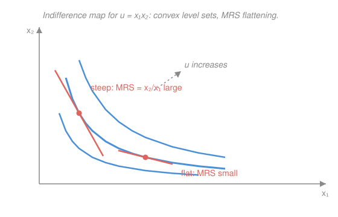

# Mathematical Microeconomics · Lesson 1.1: Preferences, utility, and rational choice

> ⏱ ~15 min · Module 1: Consumer theory · Builds on: [`calc-refresher`](../../calc-refresher/syllabus.md) · Unlocks: 1.2 (utility maximization)

## Why this matters

Every result in consumer theory — Marshallian demand, the Slutsky equation, the welfare theorems — is built by *maximizing a utility function*. But a person doesn't come equipped with a utility function; they come with **preferences**: they can look at two baskets and say which they'd rather have. This lesson answers the foundational question the rest of the course quietly assumes: *when is it legitimate to replace "he prefers $x$ to $y$" with "$u(x) > u(y)$" and hand the problem to calculus?* The answer — a short list of axioms — is also where the theory is honest about its own limits, which is exactly the seam grad micro (MWG Ch. 1–3) pries open.

## The idea

Start with the primitive object: a person who can **compare**. Give them any two bundles and they'll tell you $x$ is at least as good as $y$, or the reverse, or both (indifference). That's a *relation*, written $\succeq$ — no numbers yet, just a ranking.

Two demands make a ranking *sensible* (rational): you can compare **any** two bundles (completeness), and your comparisons don't cycle — if $x$ beats $y$ and $y$ beats $z$, then $x$ beats $z$ (transitivity). A cyclic ranker is a money pump: someone will trade them $x \to y \to z \to x$ collecting a fee each round.

The magic is that a merely-ranking preference, once it's rational and doesn't jump around (continuity), can be **replaced by a number** $u(x)$ that rises exactly when the ranking says "better." The catch — and it's the whole philosophy of the subject — is that *only the order of those numbers means anything*. Utility is a thermometer with no fixed zero and no fixed degree size: relabel it by any increasing function and it describes the identical person. Preferences are the reality; $u$ is a convenient chart of them.

## The formal version

Fix a **consumption set** $X \subseteq \mathbb{R}^n_+$ (bundles of $n$ goods; we'll usually draw $n=2$). A **preference relation** $\succeq$ on $X$ reads "$x \succeq y$" as "*$x$ is at least as good as $y$.*" From it: *strict* preference $x \succ y$ (means $x \succeq y$ but not $y \succeq x$) and *indifference* $x \sim y$ ($x \succeq y$ and $y \succeq x$).

**Rationality axioms.**
- *Completeness:* for all $x,y\in X$, $x \succeq y$ or $y \succeq x$ (or both).
- *Transitivity:* $x \succeq y$ and $y \succeq z \implies x \succeq z$.

In words: you can rank any pair, and your rankings never form a loop. Call $\succeq$ **rational** when both hold.

**Regularity axioms** (the ones that make $\succeq$ smooth enough for calculus):
- *Continuity:* the sets $\{y : y \succeq x\}$ and $\{y : y \preceq x\}$ are closed. In words: no sudden preference reversals — if a sequence of bundles you like sits arbitrarily close to a limit, you like the limit too.
- *Monotonicity:* more is better — $x \geq y$ (coordinatewise, $x\neq y$) $\implies x \succ y$. Its weaker cousin, **local nonsatiation**, only asks that every bundle have a strictly preferred bundle arbitrarily nearby (no thick indifference bands, no bliss point).
- *Convexity:* if $x \succeq z$ and $y \succeq z$, then $\lambda x + (1-\lambda) y \succeq z$ for all $\lambda\in[0,1]$. In words: *averages are (weakly) better than extremes* — a taste for balanced bundles.

**Proposition 1 (Representation — Debreu).** *If $\succeq$ on $X$ is rational and continuous, there exists a continuous function $u : X \to \mathbb{R}$ with*
$$x \succeq y \iff u(x) \geq u(y).$$
*Moreover $u$ is unique only up to a strictly increasing transformation: $v$ represents the same $\succeq$ if and only if $v = f \circ u$ for some strictly increasing $f:\mathbb{R}\to\mathbb{R}$.*

In words: a well-behaved ranking can always be turned into a number, and *any* increasing relabeling of that number is just as valid — utility is **ordinal**. *Why the uniqueness half holds:* if $v = f\circ u$ with $f$ increasing, then $v(x)\geq v(y) \iff f(u(x))\geq f(u(y)) \iff u(x)\geq u(y) \iff x\succeq y$, so $v$ represents $\succeq$. Conversely if both $u,v$ represent $\succeq$, then $u(x)=u(y)\Rightarrow x\sim y\Rightarrow v(x)=v(y)$, so $v$ depends on $x$ only through $u(x)$; write $v=f\circ u$, and $u(x)>u(y)\Rightarrow x\succ y\Rightarrow v(x)>v(y)$ makes $f$ strictly increasing. (Existence — building the actual number — is the harder Debreu construction; we take it as given.)

**Indifference curves.** An indifference curve is a **level set** of $u$: $\{x : u(x) = \bar u\}$ — precisely the level-curve/gradient object from [`calc-refresher` 4.1](../../calc-refresher/lessons/04-01-partial-derivatives-and-gradient.md). The gradient $\nabla u$ points in the direction of steepest preference increase and is **orthogonal** to the indifference curve through each point.

**Marginal rate of substitution.** In two goods, differentiate $u(x_1,x_2)=\bar u$ implicitly along the curve: $u_1\,dx_1 + u_2\,dx_2 = 0$, where $u_i \equiv \partial u/\partial x_i$. Hence the curve's slope is $\dfrac{dx_2}{dx_1} = -\dfrac{u_1}{u_2}$, and we name its magnitude the
$$\mathrm{MRS}_{12} \;=\; \frac{\partial u/\partial x_1}{\partial u/\partial x_2} \;=\; \left|\frac{dx_2}{dx_1}\right|.$$
In words: the MRS is how many units of good 2 you'd sacrifice for one more unit of good 1 while staying exactly as happy — the willingness-to-trade, read off as the slope of the indifference curve. Because both marginal utilities carry the *same* factor $f'(u)$ under a relabeling $v=f\circ u$, that factor cancels in the ratio: **the MRS is ordinal (invariant), even though each marginal utility $u_i$ is not.**

**Proposition 2 (Convexity $\iff$ quasi-concavity).** *$\succeq$ is convex $\iff$ every representing $u$ is **quasi-concave**, i.e. $u(\lambda x + (1-\lambda) y) \geq \min\{u(x), u(y)\}$ for all $\lambda\in[0,1]$ $\iff$ every upper contour set $U(\bar u)=\{x : u(x)\geq \bar u\}$ is convex.*

In words: convex preferences, indifference curves that bow toward the origin, quasi-concave $u$, and convex "at-least-as-good" sets are four names for one thing — a taste for variety. *Proof of the equivalence:* $U(\bar u)$ is exactly the set $\{x:u(x)\geq\bar u\}$; quasi-concavity says any convex combination of two points in $U(\bar u)$ (both with $u\geq\bar u$) has $u\geq\min\geq\bar u$, i.e. stays in $U(\bar u)$ — which *is* convexity of $U(\bar u)$. And $U(\bar u)$ being convex for the bundle $z$ (take $\bar u=u(z)$) is the axiom's statement. $\square$

For differentiable quasi-concave $u$, moving right along an indifference curve makes it *flatter*: **diminishing MRS**. (Careful: with $n>2$ goods, diminishing MRS is necessary but the honest criterion is a bordered-Hessian condition — quasi-concavity is the general statement; two-good "MRS falls" is its special case.)

## Picture

## Worked examples

**Example 1 (the MRS is ordinal — computed).** For Cobb–Douglas $u = x_1^{a} x_2^{b}$ ($a,b>0$),
$$\mathrm{MRS}_{12} = \frac{a x_1^{a-1} x_2^{b}}{\,b\, x_1^{a} x_2^{b-1}} = \frac{a x_2}{b x_1}.$$
Now relabel with the strictly increasing $f=\ln$: $v=\ln u = a\ln x_1 + b\ln x_2$, so $v_1 = a/x_1$, $v_2=b/x_2$, and $\mathrm{MRS}_{12}=\dfrac{a/x_1}{b/x_2}=\dfrac{a x_2}{b x_1}$ — *identical*. The marginal utilities changed completely ($x_1^{a-1}x_2^b$ became $a/x_1$); their ratio did not. This is Proposition 1's ordinality made concrete, and it's why demand (built next lesson from $\mathrm{MRS}=$ price ratio) never depends on which representation you picked.

**Example 2 (quasi-concave but not concave — why utility only needs the weaker property).** Take $u=x_1x_2$ on $\mathbb{R}^2_{++}$. Its Hessian is $\begin{pmatrix}0&1\\1&0\end{pmatrix}$, with eigenvalues $\pm 1$ — **indefinite**, so $u$ is *not concave*. Yet its upper contour sets $\{x_2 \geq \bar u/x_1\}$ are epigraphs of the convex function $x_1\mapsto \bar u/x_1$, hence convex — so $u$ *is quasi-concave* (Prop 2), and the preferences are perfectly well-behaved. The relabeling $\ln u = \ln x_1+\ln x_2$ *is* concave (Hessian $\operatorname{diag}(-x_1^{-2},-x_2^{-2})\prec 0$). Concavity is a cardinal accident that a monotone transform can create or destroy; **quasi-concavity is the ordinal, transform-proof property**, which is exactly why the axioms ask for convexity and not the stronger concavity.

## Watch out

- You might think a bigger $u$ means "more happiness" you can add or compare across people. No — $u$ is ordinal: $u=10$ vs $u=5$ says only "preferred," never "twice as good." Ratios and differences of utility are meaningless until Module 2 pins down a *cardinal* index for choice under risk.
- You might think diminishing marginal utility causes convex indifference curves. Different animals: marginal utility is cardinal (killed by relabeling), the MRS and convexity are ordinal. You can have diminishing MRS with *increasing* marginal utility along the curve.
- You might think transitivity is obviously true of real people. It's an *idealization* — framing and menu effects violate it empirically. The axiom is what we assume to unlock calculus, and grad micro is largely the study of what breaks when it (or completeness) fails.

## One-liner

> Rational + continuous preferences *are* a utility function — but only up to relabeling, so trust the MRS (the ordinal slope), never the number.

## Problems

**P1 (🟢)** For Cobb–Douglas $u = x_1^{a} x_2^{b}$, compute $\mathrm{MRS}_{12}$, then verify it is unchanged under the strictly increasing transform $g(u)=u^{2}$. Explain in one line why this had to happen for *any* strictly increasing $g$.

**P2 (🟡)** Take $u(x_1,x_2)=x_1^{1/2}+x_2^{1/2}$ on $\mathbb{R}^2_{++}$. Show the preferences are convex by proving each upper contour set $\{u\geq \bar u\}$ is convex, and confirm the MRS diminishes as $x_1$ rises along an indifference curve.

**P3 (🔴, optional)** The two extreme cases. Write utilities for **perfect substitutes** and **perfect complements**, $u^S = a x_1 + b x_2$ and $u^C=\min\{a x_1, b x_2\}$ ($a,b>0$). For each: sketch/describe the indifference map, compute the MRS (where it exists), and say precisely where convexity holds and how it is "weak" or "kinked."

Solutions

**P1** With $u=x_1^a x_2^b$: $u_1 = a x_1^{a-1}x_2^b$, $u_2=b x_1^a x_2^{b-1}$, so
$$\mathrm{MRS}_{12}=\frac{u_1}{u_2}=\frac{a x_1^{a-1}x_2^b}{b x_1^a x_2^{b-1}}=\frac{a x_2}{b x_1}.$$
Under $g(u)=u^2$, i.e. $w=(x_1^a x_2^b)^2 = x_1^{2a}x_2^{2b}$: this is Cobb–Douglas with exponents $2a,2b$, so $\mathrm{MRS}_{12}=\dfrac{2a\,x_2}{2b\,x_1}=\dfrac{a x_2}{b x_1}$ — identical. *Why it had to happen:* for any differentiable strictly increasing $g$, $\dfrac{\partial(g\circ u)/\partial x_1}{\partial(g\circ u)/\partial x_2}=\dfrac{g'(u)\,u_1}{g'(u)\,u_2}=\dfrac{u_1}{u_2}$; the common factor $g'(u)>0$ cancels, so the MRS is an ordinal object.
*Check:* $\dfrac{a x_2}{b x_1}$ appears from both $u$ and $u^2$. ✓

**P2** Fix $\bar u>0$; the upper contour set is $C=\{(x_1,x_2)\in\mathbb{R}^2_{++} : x_1^{1/2}+x_2^{1/2}\geq \bar u\}$. The function $u(x)=x_1^{1/2}+x_2^{1/2}$ is a sum of two concave functions ($t\mapsto t^{1/2}$ is concave, $u''=-\tfrac14 t^{-3/2}<0$), hence $u$ is **concave**, therefore quasi-concave, so every upper contour set is convex — preferences are convex. (Direct check of convexity of $C$: for $x,y\in C$ and $\lambda\in[0,1]$, concavity gives $u(\lambda x+(1-\lambda)y)\geq \lambda u(x)+(1-\lambda)u(y)\geq \lambda\bar u+(1-\lambda)\bar u=\bar u$, so $\lambda x+(1-\lambda)y\in C$.)
MRS: $u_1=\tfrac12 x_1^{-1/2}$, $u_2=\tfrac12 x_2^{-1/2}$, so
$$\mathrm{MRS}_{12}=\frac{u_1}{u_2}=\frac{x_1^{-1/2}}{x_2^{-1/2}}=\sqrt{\frac{x_2}{x_1}}.$$
Along an indifference curve $x_1^{1/2}+x_2^{1/2}=\bar u$, raising $x_1$ forces $x_2$ down, so $\sqrt{x_2/x_1}$ falls: **diminishing MRS**. ✓
*Check:* at $x_1=x_2$, $\mathrm{MRS}=1$ (symmetry demands slope $-1$ on the diagonal); moving to $x_1>x_2$ gives $\mathrm{MRS}<1$, flatter, as drawn. ✓

**P3**
*Perfect substitutes* $u^S=a x_1+b x_2$. Indifference curves are the straight lines $a x_1 + b x_2 = \bar u$, slope $-a/b$; the goods trade at a fixed rate. $u^S_1=a$, $u^S_2=b$, so $\mathrm{MRS}_{12}=a/b$ — **constant everywhere**, no diminishing. Upper contour sets $\{a x_1+b x_2\geq\bar u\}$ are half-planes, which are convex, so preferences *are* convex — but only **weakly**: the boundary is linear, never strictly bowed, so mixtures are *equally* good (not strictly better) than extremes. (Elasticity of substitution $=\infty$.)

*Perfect complements* $u^C=\min\{a x_1,b x_2\}$. Indifference curves are **L-shaped**, with corners on the ray $a x_1=b x_2$ (i.e. $x_2=\tfrac{a}{b}x_1$). For level $\bar u$ the corner is at $(\bar u/a,\ \bar u/b)$; the horizontal arm ($a x_1<b x_2$: good 1 binds, extra $x_2$ useless) has slope $0$ so $\mathrm{MRS}=0$, the vertical arm ($b x_2<a x_1$) has infinite slope so $\mathrm{MRS}=\infty$, and at the corner $u^C$ is **not differentiable** — the MRS is undefined and jumps from $\infty$ to $0$. Upper contour sets $\{x_1\geq \bar u/a\}\cap\{x_2\geq \bar u/b\}$ are intersections of two half-planes, hence convex — so preferences are convex, but the convexity is **kinked**: it holds because a box is a convex set, yet the indifference curve has a non-smooth corner rather than a smooth bow. (Elasticity of substitution $=0$.)

Together these bracket Cobb–Douglas: substitutes (straight, $\sigma=\infty$) and complements (right-angled, $\sigma=0$) are the two limits, with the smooth diminishing-MRS case in between.
*Check:* both extremes give convex upper contour sets (consistent with the convexity axiom), and their MRS behavior — constant vs. $\{0,\infty\}$ with a kink — matches the $\sigma=\infty$ and $\sigma=0$ endpoints. ✓

## Connections

- **Backward:** indifference curves are [`calc-refresher` 4.1](../../calc-refresher/lessons/04-01-partial-derivatives-and-gradient.md)'s level sets, and the MRS is the implicit-function slope $-u_1/u_2$; $\nabla u \perp$ (indifference curve) is that lesson's gradient-orthogonality fact wearing an economics label.
- **Forward:** [1.2](01-02-utility-maximization-marshallian-demand.md) maximizes $u$ on a budget line — the optimum is where $\mathrm{MRS}=$ price ratio, i.e. the steepest indifference curve the budget can touch, so today's slope object *is* tomorrow's first-order condition. Quasi-concavity is what makes that tangency a genuine maximum.
- **Sideways (the whole course):** quasi-concavity recurs as the shape assumption everywhere — [3.1](03-01-technology-production.md)'s isoquants and MRTS are indifference curves for a firm, and [2.1](02-01-expected-utility.md) will *add* cardinal structure (the vNM index) precisely because today's ordinal utility can't price risk.
