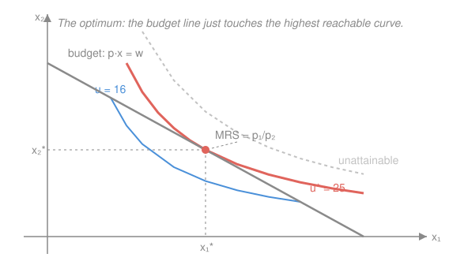

# Mathematical Microeconomics · Lesson 1.2: Utility maximization and Marshallian demand

> ⏱ ~15 min · Module 1: Consumer theory · Builds on: [1.1 Preferences, utility, and rational choice](01-01-preferences-utility.md), [`calc-refresher` 4.2](../../calc-refresher/lessons/04-02-multivariable-optimization-lagrange.md) · Unlocks: 1.3 (duality and Hicksian demand)

## Why this matters

Lesson 1.1 turned a preference ranking into a utility function $u$. That was the *what*. This lesson is the *how much*: given prices and a budget, which bundle does the consumer actually buy? The answer — **Marshallian demand** $x(p,w)$ — is the single most-used object in applied micro: every demand curve, every comparative-static, every welfare calculation downstream is a slice of it. And the tool is one you already own. The consumer's problem is a constrained optimization, so it is [`calc-refresher` 4.2](../../calc-refresher/lessons/04-02-multivariable-optimization-lagrange.md)'s Lagrangian wearing an economics uniform — right down to the multiplier $\lambda$, which will turn out to be the *marginal utility of wealth*.

## The idea

You have $w$ dollars and a wall of prices. Utility rises as you buy more, but the budget pins you to an affordable region — everything on or below the **budget line** $p\cdot x = w$. Push toward higher and higher indifference curves ([1.1](01-01-preferences-utility.md)) until you hit the highest one the budget still lets you touch. You can't cross it (that's unaffordable) and you shouldn't stop short of it (money left on the table). So the best bundle sits exactly where an indifference curve is **tangent** to the budget line.

Tangency has a crisp meaning. The indifference curve's slope is the **marginal rate of substitution** $\mathrm{MRS}_{12}$ — how many units of good 2 you'd trade for one more of good 1 and feel no different. The budget line's slope is the **price ratio** $p_1/p_2$ — how many units of good 2 the market *makes* you give up for one more of good 1. At the optimum these agree: your internal exchange rate equals the market's. If they didn't, you could trade along the budget line toward the good whose bang-per-buck is higher and climb to a better curve.

## The formal version

A consumer chooses a bundle $x=(x_1,\dots,x_L)\in\mathbb{R}^L_+$ (quantities of $L$ goods) facing a price vector $p=(p_1,\dots,p_L)\gg 0$ and wealth $w>0$. The **utility maximization problem (UMP)** is

$$\max_{x\ge 0}\ u(x)\quad\text{subject to}\quad p\cdot x\le w.$$

In words: pick the most-preferred affordable bundle. We assume $u$ is continuous and — following [1.1](01-01-preferences-utility.md) — **locally nonsatiated** (near any bundle there is always a slightly preferred one) and, for the calculus, differentiable and quasi-concave. Continuity plus the compact budget set (Weierstrass) guarantees a solution exists.

**Walras' law.** Local nonsatiation forces the budget constraint to **bind**: any solution satisfies $p\cdot x(p,w)=w$. If money were left over, a nearby bundle would be both affordable and preferred — contradiction. So $\le$ becomes $=$, and we may attach a Lagrangian to the equality.

**The Lagrangian and first-order conditions.** Form (with multiplier $\lambda$ on the constraint)

$$\mathcal{L}(x,\lambda)=u(x)+\lambda\,(w-p\cdot x).$$

At an **interior** optimum ($x_i^*>0$ for all $i$), $\nabla_x\mathcal{L}=0$ gives, for each good $i$,

$$\frac{\partial u}{\partial x_i}=\lambda\,p_i,\qquad\text{equivalently}\qquad \frac{\partial u/\partial x_i}{p_i}=\lambda\ \ \text{for every }i.$$

In words: at the optimum the **marginal utility per dollar** is equalized across all goods, and their common value is $\lambda$ — the *bang-per-buck* rule from [`calc-refresher` 4.2](../../calc-refresher/lessons/04-02-multivariable-optimization-lagrange.md), now read good-by-good. Take the ratio of the condition for goods $i$ and $j$ and $\lambda$ cancels:

$$\mathrm{MRS}_{ij}=\frac{\partial u/\partial x_i}{\partial u/\partial x_j}=\frac{p_i}{p_j}.$$

In words: the tangency condition — the slope of the indifference curve equals the price ratio. These $L$ conditions plus the constraint $p\cdot x=w$ are $L+1$ equations in the $L+1$ unknowns $(x^*,\lambda)$.

**The multiplier is the marginal utility of wealth.** Let $v(p,w)$ be the optimized value (defined below). The envelope theorem ([`calc-refresher` 4.2](../../calc-refresher/lessons/04-02-multivariable-optimization-lagrange.md), where $\lambda=df^*/dc$) gives

$$\lambda=\frac{\partial v(p,w)}{\partial w}\ >0.$$

In words: $\lambda$ is the **shadow price of the budget** — the extra utility one more dollar of wealth would buy. The budget's "price of relaxation," exactly as in the calculus lesson.

**Marshallian (Walrasian) demand.** The solution correspondence

$$x(p,w)=\arg\max_{p\cdot x\le w}u(x)$$

is **Marshallian demand** (single-valued when $u$ is strictly quasi-concave, since the optimum is unique). Two structural properties fall out for free:

- **Homogeneity of degree 0:** $x(tp,tw)=x(p,w)$ for all $t>0$. Scaling all prices and wealth together leaves the budget *set* unchanged, so the choice cannot move — only *relative* prices and *real* wealth matter. No money illusion.
- **Walras' law:** $p\cdot x(p,w)=w$ — restated from above; the consumer spends everything.

**Indirect utility.** Substituting the optimal bundle back gives the **indirect utility function**

$$v(p,w)=u\bigl(x(p,w)\bigr)=\max_{p\cdot x\le w}u(x).$$

In words: the best utility *achievable* at prices $p$ and wealth $w$ — utility as a function of the market environment rather than the bundle. Its properties:

1. **Homogeneous of degree 0** in $(p,w)$ (inherited from demand).
2. **Nonincreasing in each $p_i$**, **strictly increasing in $w$** (richer, or facing lower prices, can't hurt; $\partial v/\partial w=\lambda>0$).
3. **Quasi-convex in $p$**: the lower-contour sets $\{p: v(p,w)\le \bar v\}$ are convex — averaging two price vectors never makes the consumer better off than the worse of the two.
4. **Continuous** in $(p,w)$.

**Corner solutions.** The tangency $\mathrm{MRS}_{ij}=p_i/p_j$ presumes an interior optimum. If it would call for some $x_i^*<0$, that good is dropped: $x_i^*=0$ and the Kuhn–Tucker condition softens to an inequality,

$$\frac{\partial u/\partial x_i}{p_i}\ \le\ \lambda\qquad(\text{with equality only if }x_i^*>0).$$

In words: at a **corner** a good is bought only if its marginal utility per dollar can match the common $\lambda$; if even the first unit is too dear, you buy none, and the indifference curve is *steeper or flatter* than the budget line rather than tangent to it. Tangency is a theorem about interiors, not a law of nature — Problem 3 hits a corner head-on.

## Picture

The optimum $(x_1^*,x_2^*)$ is the one point where the budget line and an indifference curve *kiss*. The blue curve $u=16$ is affordable — the budget line cuts through it — but you can do better by sliding to a higher curve. The dashed grey curve is unattainable at this budget. Only $u^*=25$ is both reachable and un-improvable, and there the slopes match: $\mathrm{MRS}_{12}=p_1/p_2$. This is [`calc-refresher` 4.2](../../calc-refresher/lessons/04-02-multivariable-optimization-lagrange.md)'s "highest level curve still in contact with the fence," with utility as $f$ and the budget as $g$.

## Worked examples

**Example 1 (mechanical — solving the UMP for two goods).** $u(x_1,x_2)=x_1 x_2$, prices $p_1,p_2$, wealth $w$. Lagrangian $\mathcal{L}=x_1x_2+\lambda(w-p_1x_1-p_2x_2)$. FOCs: $x_2=\lambda p_1$ and $x_1=\lambda p_2$. Divide to kill $\lambda$: $\mathrm{MRS}_{12}=x_2/x_1=p_1/p_2$, i.e. $p_1x_1=p_2x_2$ — spend equally on the two goods. Feed into $p_1x_1+p_2x_2=w$: $2p_1x_1=w$, so

$$x_1(p,w)=\frac{w}{2p_1},\qquad x_2(p,w)=\frac{w}{2p_2}.$$

Homogeneity: replacing $(p,w)$ by $(tp,tw)$ leaves each $w/(2p_i)$ unchanged. ✓ Walras: $p_1\frac{w}{2p_1}+p_2\frac{w}{2p_2}=w$. ✓ (This is the Cobb–Douglas of Problem 1 with $\alpha=\tfrac12$ — the tangency in the Picture.)

**Example 2 (why you'd care — reading $\lambda$ as a price).** Continue Example 1. Indirect utility $v=x_1^*x_2^*=\dfrac{w}{2p_1}\cdot\dfrac{w}{2p_2}=\dfrac{w^2}{4p_1p_2}$. Then $\partial v/\partial w=\dfrac{w}{2p_1p_2}$. Check against the multiplier: from $x_2=\lambda p_1$, $\lambda=x_2^*/p_1=\dfrac{w}{2p_1p_2}$ — identical. ✓ So one extra dollar of wealth buys $\dfrac{w}{2p_1p_2}$ additional utils, and $v$ is (as promised) homogeneous of degree 0: $\dfrac{(tw)^2}{4(tp_1)(tp_2)}=\dfrac{w^2}{4p_1p_2}$. This $\lambda$ is the same shadow price Problem 3 of [`calc-refresher` 4.2](../../calc-refresher/lessons/04-02-multivariable-optimization-lagrange.md) computed by hand.

## Watch out

- You might think $\lambda$ is bookkeeping. It is a *rate with units*: utils per dollar, the marginal utility of wealth. Its size measures how badly the budget binds — double $w$ under Cobb–Douglas and each remaining dollar is worth less, so $\lambda$ falls (diminishing marginal utility of income).
- You might think tangency $\mathrm{MRS}=p_1/p_2$ always holds. It is the interior condition only. At a **corner** ($x_i^*=0$) it becomes an inequality; blindly imposing tangency there yields a nonsensical negative quantity. Always check the interior solution is actually nonnegative.
- You might think $v(p,w)$ is convex or concave in $p$. It is **quasi**-convex — a weaker shape. And it is decreasing in $p$, increasing in $w$: raising a price can never raise attainable utility, so any "welfare gain from higher prices" claim is a sign error.

## One-liner

> The consumer climbs to the indifference curve tangent to the budget line, where marginal utility per dollar is equal across goods and equal to $\lambda$ — the marginal utility of wealth; the resulting bundle $x(p,w)$ is homogeneous of degree 0 and spends every dollar.

## Problems

**P1 (🟢)** For Cobb–Douglas $u(x_1,x_2)=x_1^{\alpha}x_2^{1-\alpha}$ with $0<\alpha<1$, prices $p_1,p_2$, wealth $w$: set up the Lagrangian, derive Marshallian demand, and show the expenditure shares are constant. Verify Walras' law and homogeneity of degree 0.

**P2 (🟡)** For the same Cobb–Douglas utility, derive the indirect utility function $v(p,w)$. Confirm it is homogeneous of degree 0 in $(p,w)$ and strictly increasing in $w$.

**P3 (🔴)** Quasilinear utility $u(x_1,x_2)=\ln x_1 + x_2$, prices $p_1,p_2$, wealth $w$. Solve the UMP. Show demand for $x_1$ is independent of $w$ (no income effect on good 1), and find the wealth threshold below which the solution is a corner with $x_2^*=0$. Handle that corner explicitly.

Solutions

**P1** Local nonsatiation ⇒ budget binds. Lagrangian $\mathcal{L}=x_1^{\alpha}x_2^{1-\alpha}+\lambda(w-p_1x_1-p_2x_2)$. FOCs:

$$\alpha x_1^{\alpha-1}x_2^{1-\alpha}=\lambda p_1,\qquad (1-\alpha)x_1^{\alpha}x_2^{-\alpha}=\lambda p_2.$$

Divide (this is $\mathrm{MRS}_{12}=p_1/p_2$):

$$\frac{\alpha}{1-\alpha}\cdot\frac{x_2}{x_1}=\frac{p_1}{p_2}\ \Longrightarrow\ p_2x_2=\frac{1-\alpha}{\alpha}\,p_1x_1.$$

Substitute into $p_1x_1+p_2x_2=w$: $\ p_1x_1\bigl(1+\tfrac{1-\alpha}{\alpha}\bigr)=\dfrac{p_1x_1}{\alpha}=w$. Hence

$$\boxed{x_1(p,w)=\frac{\alpha w}{p_1},\qquad x_2(p,w)=\frac{(1-\alpha)w}{p_2}.}$$

**Constant shares:** $\dfrac{p_1x_1}{w}=\alpha$ and $\dfrac{p_2x_2}{w}=1-\alpha$ — spending on each good is a fixed fraction of income, independent of prices and wealth (the Cobb–Douglas signature). **Homogeneity:** $x_i(tp,tw)=\dfrac{\alpha(tw)}{tp_1}=\dfrac{\alpha w}{p_1}=x_i(p,w)$. ✓ **Walras:** $p_1x_1+p_2x_2=\alpha w+(1-\alpha)w=w$. ✓

*Check:* FOCs consistent — $\dfrac{\partial u/\partial x_1}{p_1}=\dfrac{\alpha x_1^{\alpha-1}x_2^{1-\alpha}}{p_1}$ and $\dfrac{\partial u/\partial x_2}{p_2}=\dfrac{(1-\alpha)x_1^{\alpha}x_2^{-\alpha}}{p_2}$ are equal at the solution (both equal $\lambda$), since their ratio is $\tfrac{\alpha}{1-\alpha}\tfrac{x_2}{x_1}\tfrac{p_2}{p_1}=\tfrac{p_1}{p_2}\tfrac{p_2}{p_1}=1$. ✓

**P2** Substitute the P1 demands into $u$:

$$v(p,w)=\Bigl(\frac{\alpha w}{p_1}\Bigr)^{\alpha}\Bigl(\frac{(1-\alpha)w}{p_2}\Bigr)^{1-\alpha}=\alpha^{\alpha}(1-\alpha)^{1-\alpha}\;\frac{w^{\alpha+(1-\alpha)}}{p_1^{\alpha}p_2^{1-\alpha}}=\underbrace{\alpha^{\alpha}(1-\alpha)^{1-\alpha}}_{\;K\;}\;\frac{w}{p_1^{\alpha}\,p_2^{\,1-\alpha}}.$$

**Homogeneity of degree 0:**

$$v(tp,tw)=K\,\frac{tw}{(tp_1)^{\alpha}(tp_2)^{1-\alpha}}=K\,\frac{tw}{t^{\alpha+1-\alpha}\,p_1^{\alpha}p_2^{1-\alpha}}=K\,\frac{tw}{t\,p_1^{\alpha}p_2^{1-\alpha}}=v(p,w).\ \checkmark$$

**Increasing in $w$:** $\dfrac{\partial v}{\partial w}=\dfrac{K}{p_1^{\alpha}p_2^{1-\alpha}}>0$. ✓ (And this equals $\lambda$, the marginal utility of wealth: linear in $w$ because Cobb–Douglas indirect utility is proportional to real income. Also $\partial v/\partial p_1=-\alpha K w\,p_1^{-\alpha-1}p_2^{-(1-\alpha)}<0$, decreasing in price, as required.)

**P3** Interior first. Budget binds (local nonsatiation), $\mathcal{L}=\ln x_1+x_2+\lambda(w-p_1x_1-p_2x_2)$. FOCs:

$$\frac{1}{x_1}=\lambda p_1,\qquad 1=\lambda p_2\ \Longrightarrow\ \lambda=\frac{1}{p_2}.$$

The second FOC pins $\lambda=1/p_2$ (constant — good 2 has constant marginal utility 1, so its marginal utility per dollar *is* the marginal utility of wealth). Then $\dfrac{1}{x_1}=\dfrac{p_1}{p_2}$, giving

$$\boxed{x_1(p,w)=\frac{p_2}{p_1}}\qquad\text{— independent of }w.$$

All income beyond the fixed spend $p_1x_1=p_2$ on good 1 goes to good 2. From the budget $p_1x_1+p_2x_2=w$: $\ p_2+p_2x_2=w$, so

$$x_2(p,w)=\frac{w}{p_2}-1=\frac{w-p_2}{p_2}.$$

**No income effect on $x_1$:** $\partial x_1/\partial w=0$ — extra wealth is absorbed entirely by good 2 ($\partial x_2/\partial w=1/p_2>0$), the hallmark of quasilinearity.

**Corner.** The interior $x_2^*=\dfrac{w-p_2}{p_2}\ge 0$ requires $w\ge p_2$. If $w<p_2$, spend everything on good 1:

$$x_1^*=\frac{w}{p_1},\qquad x_2^*=0.$$

This is the Kuhn–Tucker corner: at $x_2=0$ the marginal utility per dollar of good 2 is $\dfrac{1}{p_2}$, while for good 1 it is $\dfrac{1/x_1}{p_1}=\dfrac{1}{p_1x_1}=\dfrac{1}{w}$. The corner is optimal precisely when good 2 can't keep up, $\dfrac{1}{p_2}\le\dfrac{1}{w}\iff w\le p_2$ — the same threshold, from the other side. Tangency $\mathrm{MRS}=p_1/p_2$ *fails* here; the inequality condition governs.

*Check (interior, $w\ge p_2$):* Walras $p_1\!\cdot\!\dfrac{p_2}{p_1}+p_2\!\cdot\!\dfrac{w-p_2}{p_2}=p_2+(w-p_2)=w$ ✓; $\lambda=1/p_2>0$ ✓; both FOCs hold. *Check (corner, $w<p_2$):* $p_1\!\cdot\!\dfrac{w}{p_1}=w$ ✓, and $x_2^*=0$. ✓

## Connections

- **Backward:** the tangency $\mathrm{MRS}_{ij}=p_i/p_j$ is [1.1](01-01-preferences-utility.md)'s marginal rate of substitution meeting the market price ratio; quasi-concavity of $u$ (1.1) is what makes the interior FOCs sufficient, not just necessary. The whole apparatus is [`calc-refresher` 4.2](../../calc-refresher/lessons/04-02-multivariable-optimization-lagrange.md)'s constrained optimization — $u$ is $f$, the budget is $g$, and $\lambda$ is the shadow price.
- **Forward:** [1.3](01-03-duality-expenditure-hicksian.md) runs the *dual* — minimize spending to hit a target utility — producing the expenditure function $e(p,\bar u)$ and Hicksian demand $h(p,\bar u)$; Roy's identity will recover today's $x(p,w)$ from $v(p,w)$ by differentiation, and [1.4](01-04-slutsky-comparative-statics.md)'s Slutsky equation splits $\partial x/\partial p$ into the two demand systems.
- **Sideways (the recurring bridge):** **Lagrange multiplier ↔ constrained utility maximization ↔ shadow price of the budget.** The identical structure returns in [3.2](03-02-cost-minimization.md) (the firm minimizing cost to hit an output target — same math, $\lambda$ becomes marginal cost) and in choice under uncertainty ([2.1](02-01-expected-utility.md), maximizing expected utility subject to a wealth constraint).
