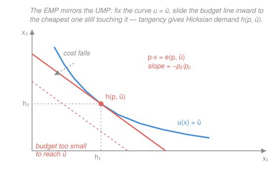

# Mathematical Microeconomics · Lesson 1.3: Duality — expenditure minimization and Hicksian demand

> ⏱ ~15 min · Module 1: Consumer theory · Builds on: [1.2 Utility maximization and Marshallian demand](01-02-utility-maximization-marshallian-demand.md) · Unlocks: 1.4 (the Slutsky equation)

## Why this matters

In [1.2](01-02-utility-maximization-marshallian-demand.md) you asked: *given wealth $w$, how much happiness can I buy?* Now flip it: *given a target happiness $\bar u$, how cheaply can I buy it?* That second question — the **expenditure-minimization problem (EMP)** — is not a curiosity. It hands you **Hicksian demand**, the demand curve that holds utility (not wealth) fixed, which is exactly the object that isolates the pure substitution effect in the Slutsky equation next lesson. It also delivers the **expenditure function**, the analytical backbone of welfare measurement (compensating variation, deadweight loss). And it exposes the deep symmetry of consumer theory: the two problems are mirror images, and one two-line envelope argument — used twice — connects all four objects $v$, $e$, $x$, $h$.

## The idea

Two ways to describe the same tangency between a budget line and an indifference curve.

- **UMP (last lesson):** pin the *budget line*, push the indifference curve out as far as it will go. The contact point is Marshallian demand $x(p,w)$; the height of the curve you reach is indirect utility $v(p,w)$.
- **EMP (this lesson):** pin the *indifference curve* at level $\bar u$, slide the budget line inward until it's the cheapest one that still touches. The contact point is Hicksian demand $h(p,\bar u)$; the cost of that line is the expenditure function $e(p,\bar u)$.

Same tangency, read from opposite sides. So the answers had better agree — and the identities below say precisely how they translate into each other. The single most useful consequence: differentiating a *value function* with respect to a *price* just spits back a quantity (the envelope theorem). Do it to $e$ and you get Hicksian demand (Shephard's lemma); do it to $v$ and you get Marshallian demand (Roy's identity). One trick, two payoffs.

## The formal version

Throughout, $x=(x_1,\dots,x_n)\ge 0$ is a consumption bundle, $p=(p_1,\dots,p_n)\gg 0$ a price vector, $w>0$ wealth, and $p\cdot x=\sum_i p_i x_i$ the cost of a bundle. Utility $u:\mathbb R^n_+\to\mathbb R$ is continuous, increasing, and strictly quasi-concave (so tangencies are unique interior points). From 1.2: the UMP is $\max_x u(x)$ s.t. $p\cdot x\le w$, with solution $x(p,w)$ (Marshallian demand) and value $v(p,w)=u(x(p,w))$ (indirect utility).

**The dual problem (EMP).** For a required utility level $\bar u$ in the range of $u$,
$$e(p,\bar u)=\min_{x\ge 0}\; p\cdot x \quad\text{s.t.}\quad u(x)\ge \bar u.$$
In words: the smallest wealth that still lets you reach happiness $\bar u$ at prices $p$. The minimizer is **Hicksian (compensated) demand** $h(p,\bar u)=\arg\min$, and the minimized value is the **expenditure function** $e(p,\bar u)=p\cdot h(p,\bar u)$. "Compensated" because as $p$ moves, $h$ is the bundle you'd buy if someone kept adjusting your wealth to hold utility exactly at $\bar u$.

At an interior optimum the constraint binds ($u(h)=\bar u$ — you never overpay for surplus utility) and the Lagrangian $L=p\cdot x-\lambda\bigl(u(x)-\bar u\bigr)$ gives $p_i=\lambda\,\partial u/\partial x_i$, i.e. the same tangency $\text{MRS}=p_i/p_j$ as the UMP.

**Proposition 1 (properties of $e$).** Fix $\bar u$. The expenditure function is (i) homogeneous of degree 1 in $p$; (ii) strictly increasing in $\bar u$ and nondecreasing in each $p_i$; (iii) **concave in $p$**; (iv) continuous.

*Proof of (i) and (iii)* — the two that carry weight.
(i) The constraint set $\{x:u(x)\ge\bar u\}$ doesn't depend on $p$, and scaling the objective $p\mapsto tp$ ($t>0$) scales every feasible cost by $t$, so the min scales by $t$: $e(tp,\bar u)=t\,e(p,\bar u)$. Hence $h(tp,\bar u)=h(p,\bar u)$ — Hicksian demand is homogeneous of degree 0 in $p$.
(iii) Fix $\bar u$ and take two price vectors $p',p''$, a weight $t\in[0,1]$, and $p^t=tp'+(1-t)p''$. Let $h^t=h(p^t,\bar u)$ be the minimizer at $p^t$; it satisfies $u(h^t)\ge\bar u$, so $h^t$ is *feasible* (not necessarily optimal) at both $p'$ and $p''$. Therefore $p'\cdot h^t\ge e(p',\bar u)$ and $p''\cdot h^t\ge e(p'',\bar u)$, and
$$e(p^t,\bar u)=p^t\cdot h^t=t\,(p'\cdot h^t)+(1-t)\,(p''\cdot h^t)\ge t\,e(p',\bar u)+(1-t)\,e(p'',\bar u).\qquad\square$$
In words: because the optimal bundle at the averaged price is only *feasible* elsewhere, the value function bends downward — a price index that rewards substitution is concave. This concavity (property iii) is not decoration: its Hessian is the Slutsky substitution matrix of 1.4, and its negative-semidefiniteness *is* the law that compensated demand slopes down.

**Duality identities.** Assuming $u$ continuous and increasing, the two problems interlock:
$$
\boxed{\,e\bigl(p,v(p,w)\bigr)=w\,}\qquad
\boxed{\,v\bigl(p,e(p,\bar u)\bigr)=\bar u\,}
$$
$$
\boxed{\,x(p,w)=h\bigl(p,v(p,w)\bigr)\,}\qquad
\boxed{\,h(p,\bar u)=x\bigl(p,e(p,\bar u)\bigr)\,}
$$
In words, top row: the cheapest way to reach the utility your wealth buys costs exactly that wealth; and the most utility you can get on the minimum budget for $\bar u$ is exactly $\bar u$. So $e(p,\cdot)$ and $v(p,\cdot)$ are inverses in their scalar argument — invert one and you have the other. Bottom row: **the Marshallian and Hicksian bundles coincide once you line up wealth and utility.** Hold $\bar u=v(p,w)$ and the two demand systems are the *same point*; they differ only in what you hold fixed as $p$ varies — wealth (Marshallian) versus utility (Hicksian).

**Proposition 2 (Shephard's lemma).** If $h(p,\bar u)$ is single-valued and differentiable at $p$, then
$$\frac{\partial e(p,\bar u)}{\partial p_i}=h_i(p,\bar u).$$
In words: nudging price $i$ up raises your minimum bill at exactly the rate of the quantity you were buying — the envelope theorem, because the re-optimization of the bundle contributes nothing to first order.

*Proof (direct, exhibiting the envelope cancellation).* Differentiate $e(p,\bar u)=\sum_j p_j\,h_j(p,\bar u)$:
$$\frac{\partial e}{\partial p_i}=h_i(p,\bar u)+\sum_j p_j\frac{\partial h_j}{\partial p_i}.$$
The sum vanishes. From the FOC $p_j=\lambda\,\partial u/\partial x_j$ (at $x=h$), $\sum_j p_j\frac{\partial h_j}{\partial p_i}=\lambda\sum_j \frac{\partial u}{\partial x_j}\frac{\partial h_j}{\partial p_i}$. But the binding constraint $u\bigl(h(p,\bar u)\bigr)=\bar u$, differentiated in $p_i$, gives $\sum_j \frac{\partial u}{\partial x_j}\frac{\partial h_j}{\partial p_i}=0$: you stay on the same indifference curve, so utility can't move. Hence the whole sum is $\lambda\cdot 0=0$. $\square$ (This is the general envelope theorem: $\partial e/\partial p_i=\partial L/\partial p_i|_{\text{opt}}=x_i=h_i$, since only the explicit $p_i$ in $p\cdot x$ counts.)

**Proposition 3 (Roy's identity).** If $v$ is differentiable and $\partial v/\partial w\ne 0$, then
$$x_i(p,w)=-\frac{\partial v/\partial p_i}{\partial v/\partial w}.$$
In words: Marshallian demand is the price-gradient of indirect utility, normalized by the marginal utility of wealth — the envelope theorem again, now on the primal.

*Proof.* Apply the envelope theorem to the UMP with Lagrangian $L=u(x)+\lambda\,(w-p\cdot x)$. Only the explicit appearances of the parameters count at the optimum:
$$\frac{\partial v}{\partial p_i}=\left.\frac{\partial L}{\partial p_i}\right|_{\text{opt}}=-\lambda\,x_i,\qquad \frac{\partial v}{\partial w}=\left.\frac{\partial L}{\partial w}\right|_{\text{opt}}=\lambda.$$
Here $\lambda>0$ is the marginal utility of wealth. Divide: $-\dfrac{\partial v/\partial p_i}{\partial v/\partial w}=-\dfrac{-\lambda x_i}{\lambda}=x_i$. $\square$

**The symmetry to carry away.** $e$ and $v$ are conjugate value functions; the envelope theorem turns each into a demand system — $\nabla_p e=h$ and (up to the wealth normalization) $\nabla_p v\propto x$. Two problems, one engine.

## Picture

## Worked examples

**Example 1 (mechanical — get $e$ and $h$ by inverting $v$).** Take Cobb–Douglas $u(x_1,x_2)=x_1^{a}x_2^{1-a}$, $0<a<1$. From [1.2](01-02-utility-maximization-marshallian-demand.md), Marshallian demand is $x_1=aw/p_1$, $x_2=(1-a)w/p_2$, giving indirect utility
$$v(p,w)=\Bigl(\tfrac{aw}{p_1}\Bigr)^{a}\Bigl(\tfrac{(1-a)w}{p_2}\Bigr)^{1-a}=\frac{a^a(1-a)^{1-a}}{p_1^{a}p_2^{1-a}}\;w.$$
The top-row identity $e(p,v)=w$ says: **to invert, set $v=\bar u$ and solve for $w=e$.** Because $v$ is linear in $w$, this is immediate:
$$\boxed{\,e(p,\bar u)=\frac{p_1^{a}p_2^{1-a}}{a^a(1-a)^{1-a}}\;\bar u\,}$$
Homogeneous of degree 1 in $p$ ✓ (exponents $a+(1-a)=1$), linear and increasing in $\bar u$ ✓. Now Shephard's lemma hands you Hicksian demand for free:
$$h_1=\frac{\partial e}{\partial p_1}=a\,\frac{e}{p_1}=\bar u\Bigl(\frac{a\,p_2}{(1-a)p_1}\Bigr)^{1-a},\qquad
h_2=\frac{\partial e}{\partial p_2}=(1-a)\frac{e}{p_2}=\bar u\Bigl(\frac{(1-a)p_1}{a\,p_2}\Bigr)^{a}.$$
Note what changed from Marshallian demand: $h$ depends on $\bar u$ and on the price *ratio* — no wealth term. That is the whole point of "compensated."

**Verify Shephard directly:** $p_1 h_1+p_2 h_2 = a\,e/1 + (1-a)\,e = e$ ✓ (cost adds back up, by Euler's theorem since $h$ is degree-0 and $e$ degree-1). And each $h_i$ is exactly $\partial e/\partial p_i$ by construction. ✓

**Example 2 (why you'd care — Shephard *is* the cost of a price rise).** Shephard's lemma is the exact statement that $h_i$ measures how many dollars a price bump costs you at fixed utility — the seed of **compensating variation**. Take $a=\tfrac12$, so $e(p,\bar u)=2\sqrt{p_1p_2}\,\bar u$ and $h_1=\bar u\sqrt{p_2/p_1}$. Suppose $p=(1,1)$, $\bar u=10$: current expenditure $e=2\sqrt{1}\cdot10=20$, and $h_1=10$. Now $p_1$ rises to $1.21$. The *exact* extra wealth needed to stay on $\bar u=10$ is
$$e\bigl((1.21,1),10\bigr)-e\bigl((1,1),10\bigr)=2\sqrt{1.21}\cdot10-20=22-20=2.00.$$
The first-order (Shephard) estimate is $h_1\cdot\Delta p_1=10\times0.21=2.10$ — close, and it *over*states the cost because you substitute away from the dearer good, exactly the concavity of $e$ (Proposition 1(iii)) bending the true cost below the tangent line. This gap, integrated, is the substitution effect you'll formalize in 1.4.

## Watch out

- **You might think $h$ and $x$ are different demand curves — but at a matched point they're the *same bundle*.** The identity $h(p,\bar u)=x(p,e(p,\bar u))$ says they coincide when $\bar u=v(p,w)$; they diverge only in their *response to price changes*, because Hicksian compensates wealth to hold $\bar u$ while Marshallian lets purchasing power erode. That divergence is the income effect.
- **You might think $e$ is convex in $p$ "because cost."** It's **concave** — the ability to substitute toward whatever got cheaper bends the minimum bill downward. (Contrast the firm's cost function in $w$, also concave for the same reason, versus the *convex* profit function in prices in 3.3.)
- **Sign slips in Roy's identity.** The minus sign is not optional: $\partial v/\partial p_i<0$ (dearer goods hurt) and $\partial v/\partial w>0$, so the ratio is negative and the leading minus makes $x_i>0$. Forget it and demand comes out negative.
- **Don't confuse "constraint binds" with an assumption.** $u(h)=\bar u$ is *derived* from monotonicity (buying strict surplus utility is wasteful), and it's what makes the envelope cancellation in Shephard's proof work.

## One-liner

> The EMP is the UMP read backwards; the envelope theorem, applied once to $e$ and once to $v$, turns both value functions into demand — $\nabla_p e=h$ (Shephard) and $x=-\nabla_p v/\,v_w$ (Roy).

## Problems

**P1 (🟢)** For $u(x_1,x_2)=x_1^{1/3}x_2^{2/3}$, set up the EMP with a Lagrangian and derive $e(p,\bar u)$ and Hicksian demand $h(p,\bar u)$ *directly* (not by inverting $v$). Then verify Shephard's lemma: confirm $\partial e/\partial p_1=h_1$.

**P2 (🟡)** Using the general Cobb–Douglas results in Example 1, verify the duality identity $h(p,\bar u)=x\bigl(p,e(p,\bar u)\bigr)$ symbolically for good 1. (Substitute $w=e(p,\bar u)$ into Marshallian $x_1=aw/p_1$ and check you land on $h_1$.)

**P3 (🔴, optional)** Cobb–Douglas again, $u=x_1^{a}x_2^{1-a}$, with $v(p,w)=a^a(1-a)^{1-a}\,w\,p_1^{-a}p_2^{-(1-a)}$.
(a) Recover Marshallian demand $x_1(p,w)$ from $v$ via Roy's identity, and confirm it equals $aw/p_1$.
(b) Show $e(p,\bar u)$ is concave in $p$ by computing its $2\times2$ price-Hessian and proving it is negative semidefinite. Identify the zero eigenvalue and say which property of $e$ forces it.

Solutions

**P1** Minimize $p_1x_1+p_2x_2$ s.t. $x_1^{1/3}x_2^{2/3}\ge\bar u$. The constraint binds; Lagrangian $L=p_1x_1+p_2x_2-\lambda\bigl(x_1^{1/3}x_2^{2/3}-\bar u\bigr)$. FOCs:
$$p_1=\lambda\cdot\tfrac13 x_1^{-2/3}x_2^{2/3},\qquad p_2=\lambda\cdot\tfrac23 x_1^{1/3}x_2^{-1/3}.$$
Divide to kill $\lambda$: $\dfrac{p_1}{p_2}=\dfrac{\tfrac13 x_2/x_1\cdot(x_1^{1/3}x_2^{-1/3})^{-1}\cdots}{}$ — cleanest is the MRS directly, $\dfrac{p_1}{p_2}=\dfrac{\partial u/\partial x_1}{\partial u/\partial x_2}=\dfrac{(1/3)x_2}{(2/3)x_1}=\dfrac{x_2}{2x_1}$, so $x_2=\dfrac{2p_1}{p_2}x_1$. Substitute into the binding constraint $x_1^{1/3}x_2^{2/3}=\bar u$:
$$x_1^{1/3}\Bigl(\tfrac{2p_1}{p_2}x_1\Bigr)^{2/3}=x_1\Bigl(\tfrac{2p_1}{p_2}\Bigr)^{2/3}=\bar u\ \Rightarrow\ h_1=\bar u\Bigl(\tfrac{p_2}{2p_1}\Bigr)^{2/3}.$$
Then $h_2=\dfrac{2p_1}{p_2}h_1=\bar u\,\dfrac{2p_1}{p_2}\Bigl(\tfrac{p_2}{2p_1}\Bigr)^{2/3}=\bar u\Bigl(\tfrac{2p_1}{p_2}\Bigr)^{1/3}$. Expenditure:
$$e=p_1h_1+p_2h_2=\bar u\Bigl[p_1\Bigl(\tfrac{p_2}{2p_1}\Bigr)^{2/3}+p_2\Bigl(\tfrac{2p_1}{p_2}\Bigr)^{1/3}\Bigr].$$
Factor $p_1^{1/3}p_2^{2/3}$: first term $=p_1^{1/3}p_2^{2/3}\,2^{-2/3}$, second $=p_1^{1/3}p_2^{2/3}\,2^{1/3}$. Sum of numeric factors $2^{-2/3}+2^{1/3}=2^{-2/3}(1+2)=3\cdot2^{-2/3}$. So
$$\boxed{\,e(p,\bar u)=3\cdot2^{-2/3}\,p_1^{1/3}p_2^{2/3}\,\bar u\,}=\frac{p_1^{1/3}p_2^{2/3}}{(1/3)^{1/3}(2/3)^{2/3}}\,\bar u,$$
matching the general formula with $a=\tfrac13$. **Shephard check:** $\dfrac{\partial e}{\partial p_1}=\tfrac13\cdot3\cdot2^{-2/3}p_1^{-2/3}p_2^{2/3}\bar u=2^{-2/3}\Bigl(\tfrac{p_2}{p_1}\Bigr)^{2/3}\bar u=\bar u\Bigl(\tfrac{p_2}{2p_1}\Bigr)^{2/3}=h_1$. ✓

**P2** From Example 1, $e(p,\bar u)=\dfrac{p_1^{a}p_2^{1-a}}{a^a(1-a)^{1-a}}\bar u$ and $x_1(p,w)=aw/p_1$. Set $w=e$:
$$x_1\bigl(p,e(p,\bar u)\bigr)=\frac{a}{p_1}\cdot\frac{p_1^{a}p_2^{1-a}}{a^a(1-a)^{1-a}}\bar u=\frac{a^{1-a}}{(1-a)^{1-a}}\,p_1^{a-1}p_2^{1-a}\,\bar u=\bar u\Bigl(\frac{a\,p_2}{(1-a)p_1}\Bigr)^{1-a}.$$
This is exactly $h_1(p,\bar u)$ from Example 1. ✓ The Marshallian bundle, evaluated at the compensated wealth $e(p,\bar u)$, is the Hicksian bundle — duality confirmed.

**P3** (a) Roy: $x_1=-\dfrac{\partial v/\partial p_1}{\partial v/\partial w}$. With $v=C\,w\,p_1^{-a}p_2^{-(1-a)}$, $C=a^a(1-a)^{1-a}$:
$$\frac{\partial v}{\partial p_1}=-a\,C\,w\,p_1^{-a-1}p_2^{-(1-a)},\qquad \frac{\partial v}{\partial w}=C\,p_1^{-a}p_2^{-(1-a)}.$$
Ratio: $-\dfrac{-a\,C\,w\,p_1^{-a-1}p_2^{-(1-a)}}{C\,p_1^{-a}p_2^{-(1-a)}}=a\,w\,p_1^{-1}=\dfrac{aw}{p_1}$. ✓ Matches Marshallian demand from 1.2.

(b) Write $e=k\,\bar u\,p_1^{a}p_2^{1-a}$ with $k=1/\bigl(a^a(1-a)^{1-a}\bigr)>0$. Second derivatives:
$$e_{11}=a(a-1)\frac{e}{p_1^2},\quad e_{22}=(1-a)(-a)\frac{e}{p_2^2},\quad e_{12}=e_{21}=a(1-a)\frac{e}{p_1p_2}.$$
Factor out $e\,a(1-a)>0$ (note $0<a<1$):
$$H=e\,a(1-a)\begin{pmatrix}-1/p_1^2 & 1/(p_1p_2)\\[2pt] 1/(p_1p_2) & -1/p_2^2\end{pmatrix}.$$
For the bracketed matrix $M$: $\operatorname{tr}M=-\tfrac1{p_1^2}-\tfrac1{p_2^2}<0$ and $\det M=\tfrac1{p_1^2p_2^2}-\tfrac1{p_1^2p_2^2}=0$. Two real eigenvalues (symmetric) multiplying to $0$ and summing to a negative number: eigenvalues are $0$ and $\operatorname{tr}M<0$. So $M$ is negative semidefinite, and since $e\,a(1-a)>0$, $H$ is NSD — **$e$ is concave in $p$**. ✓ The zero eigenvalue is forced by **homogeneity of degree 1** (Proposition 1(i)): Euler's theorem differentiated once more gives $\sum_j e_{ij}p_j=0$, i.e. $Hp=0$, so the price vector $p$ is an eigenvector with eigenvalue $0$. (Check: $M\,(p_1,p_2)^\top=(-1/p_1+1/p_1,\,1/p_2-1/p_2)^\top=0$. ✓)

## Flashback

**From Lesson 1.2 (Utility maximization and Marshallian demand):** A consumer has *quasilinear* utility $u(x_1,x_2)=\ln x_1+x_2$, prices $p=(1,4)$, wealth $w=20$. Solve the UMP for Marshallian demand and indirect utility, then confirm demand is homogeneous of degree 0 in $(p,w)$ and satisfies Walras' law.

Solution

Lagrangian $L=\ln x_1+x_2+\lambda(w-p_1x_1-p_2x_2)$. FOCs: $1/x_1=\lambda p_1$ and $1=\lambda p_2$, so $\lambda=1/p_2$ and
$$x_1=\frac{p_2}{p_1},\qquad x_2=\frac{w-p_1x_1}{p_2}=\frac{w-p_2}{p_2}\quad(\text{interior when }w>p_2).$$
Numerically $x_1=4/1=4$, $x_2=(20-4)/4=4$. Budget: $1\cdot4+4\cdot4=20=w$ — **Walras' law** ✓. Indirect utility $v=\ln(p_2/p_1)+(w-p_2)/p_2=\ln 4+16/4=\ln4+4\approx5.386$.

**Homogeneity of degree 0:** scale $(p,w)\to(tp,tw)$. Then $x_1=tp_2/(tp_1)=p_2/p_1$ (unchanged) and $x_2=(tw-tp_2)/(tp_2)=(w-p_2)/p_2$ (unchanged). ✓ Note the quasilinear signature: good 1's demand is wealth-independent — the entire income effect lands on good 2, which is exactly why quasilinear preferences make consumer-surplus welfare analysis clean in Module 4.

## Connections

- **Backward:** this is the mirror of [1.2](01-02-utility-maximization-marshallian-demand.md)'s UMP — same tangency, dual objective. Indirect utility $v$ and expenditure $e$ are inverse value functions; Marshallian $x$ and Hicksian $h$ are the same bundle at matched $(w,\bar u)$.
- **Forward:** [1.4](01-04-slutsky-comparative-statics.md) differentiates the identity $h_i(p,\bar u)=x_i\bigl(p,e(p,\bar u)\bigr)$ in $p_j$ to get the **Slutsky equation** $\partial x_i/\partial p_j=\partial h_i/\partial p_j-x_j\,\partial x_i/\partial w$ — substitution (Hicksian slope) minus income effect. The concavity of $e$ proved here (Prop 1(iii)) becomes the negative-semidefinite Slutsky matrix.
- **Sideways (producer theory):** the firm's cost-minimization problem in [3.2](03-02-cost-minimization.md) is *this exact problem* with utility→output and prices→factor prices; Shephard's lemma reappears verbatim as $\partial c/\partial w_i=x_i^{\text{cond}}$ (conditional factor demand). The envelope theorem you learned once serves consumer duality, cost duality ([3.2](03-02-cost-minimization.md)), and profit duality/Hotelling's lemma ([3.3](03-03-profit-maximization-supply.md)).
- **Sideways (methods):** the envelope theorem here is the same statement used for the Hamiltonian's value in optimal control and for Lagrange-multiplier shadow prices throughout constrained optimization.
