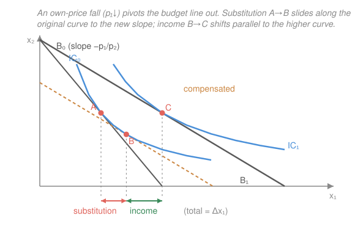

# Mathematical Microeconomics · Lesson 1.4: The Slutsky equation and comparative statics

> ⏱ ~15 min · Module 1: Consumer theory · Builds on: [1.3 Duality — expenditure minimization and Hicksian demand](01-03-duality-expenditure-hicksian.md) · Unlocks: Module 2 (choice under uncertainty)

## Why this matters

When a price falls, demand moves for two entirely different reasons, and a good analyst never conflates them. First, the good got *relatively* cheaper, so you tilt toward it even holding welfare fixed — pure substitution. Second, your money now stretches further, so you're effectively richer — an income effect whose sign depends on whether the good is a luxury or a poor-man's staple. The Slutsky equation is the exact bookkeeping that separates the two, and it is the single most-used comparative-statics identity in all of price theory. It also delivers the deepest structural fact about rational demand: the substitution matrix is symmetric and negative semidefinite — the *integrability conditions* that say a demand system could have come from a maximizing consumer at all.

## The idea

Picture the standard two-good diagram and drop the price of good 1. The budget line pivots outward around its vertical intercept: same income, same $p_2$, but you can now reach farther along the $x_1$ axis. The optimum jumps from an old tangency $A$ to a new one $C$.

Split that jump with a thought experiment. First, *rotate* the budget line to the new, flatter slope but slide it back until it just kisses the **original** indifference curve — as if we taxed away exactly enough income to keep the consumer on their old welfare level. The optimum slides from $A$ to an intermediate point $B$. That slide along one indifference curve is the **substitution effect**: it's the response to the changed *relative* price with utility held fixed, and for the good's own price it always points the "right" way (cheaper → buy weakly more). Then hand the income back — shift the compensated line out, parallel, to the true new budget line. The optimum moves from $B$ to $C$. That parallel shift is the **income effect**: the response to the extra purchasing power at fixed prices.

Total change $A\to C$ = substitution $A\to B$ + income $B\to C$. The substitution piece is a law; the income piece is a wild card whose sign is an empirical property of the good.

## The formal version

Fix a utility target $\bar u$ and let $p=(p_1,\dots,p_n)$ be prices, $w$ wealth. Recall the four objects from [1.2](01-02-utility-maximization-marshallian-demand.md)–[1.3](01-03-duality-expenditure-hicksian.md): Marshallian demand $x_i(p,w)$ (solves the utility-max problem), Hicksian demand $h_i(p,\bar u)$ (solves the dual expenditure-min problem), and the expenditure function $e(p,\bar u)=\min\{p\cdot x : u(x)\ge\bar u\}$. The bridge is the **duality identity**: the cheapest way to reach $\bar u$ buys exactly what a consumer with just that much money would buy,

$$x_i\big(p,\,e(p,\bar u)\big)=h_i(p,\bar u).$$

*In words:* compensated demand is ordinary demand evaluated at income "topped up" to hit $\bar u$. Now differentiate both sides with respect to $p_j$, holding $\bar u$ fixed. The left side is a composition ($w=e(p,\bar u)$ depends on $p_j$), so the chain rule gives

$$\frac{\partial x_i}{\partial p_j}+\frac{\partial x_i}{\partial w}\,\frac{\partial e}{\partial p_j}=\frac{\partial h_i}{\partial p_j}.$$

By **Shephard's lemma** $\partial e/\partial p_j=h_j=x_j$ (evaluated at the matched point $w=e(p,\bar u)$). Substitute and rearrange to get the **Slutsky equation**:

$$\boxed{\ \frac{\partial x_i}{\partial p_j}=\underbrace{\frac{\partial h_i}{\partial p_j}}_{\text{substitution}}-\underbrace{x_j\,\frac{\partial x_i}{\partial w}}_{\text{income}}\ }$$

*In words:* the observable Marshallian response splits into a compensated (utility-held-fixed) response minus an income-effect correction scaled by how much of good $j$ you were buying.

**Signing the own-price effect** ($i=j$). Because $e$ is **concave in prices**, its Hessian is negative semidefinite, and Shephard's lemma makes that Hessian the matrix of Hicksian slopes; in particular the diagonal entry satisfies $\partial h_i/\partial p_i\le 0$. So the substitution effect on own price is *always* non-positive. The income term is $-x_i\,\partial x_i/\partial w$:

- **Normal good** ($\partial x_i/\partial w>0$): income term $<0$, reinforcing substitution — demand falls, unambiguously. This is the law of demand.
- **Inferior good** ($\partial x_i/\partial w<0$): income term $>0$, *opposing* substitution.
- **Giffen good**: inferior *and* the income term outweighs the substitution term, so $\partial x_i/\partial p_i>0$ — demand rises when price rises. The law of demand's one loophole, and it needs both a strongly inferior good and a large budget share (so $x_i$ is big enough to amplify the income term).

**The Slutsky matrix.** Collect the substitution terms $s_{ij}=\partial h_i/\partial p_j$ into a matrix $S(p,\bar u)$. Since $h_i=\partial e/\partial p_i$, we have $s_{ij}=\partial^2 e/\partial p_j\,\partial p_i$, i.e. $S=D^2_{pp}\,e$ is the Hessian of the expenditure function. Two structural facts follow immediately:

- **Symmetric** ($s_{ij}=s_{ji}$): $e$ is $C^2$, so its mixed partials commute (Young's theorem). Cross-substitution effects are reciprocal.
- **Negative semidefinite**: $e$ concave in $p$ $\Rightarrow$ $D^2_{pp}e$ is NSD. In particular $v^\top S v\le 0$ for all $v$, and $s_{ii}\le0$.

Also $S\,p=0$ (Hicksian demand is homogeneous of degree 0 in $p$, so Euler's theorem kills the price direction), making $S$ singular. Symmetry + NSD are the **integrability conditions**: a demand system satisfying them (plus homogeneity and Walras' law) is exactly one that could have been generated by a rational, maximizing consumer.

## Picture

## Worked examples

**Example 1 (mechanical — the identity, term by term, for Cobb–Douglas).** Let $u=x_1x_2$, so Marshallian demand is $x_1=\dfrac{w}{2p_1}$, $x_2=\dfrac{w}{2p_2}$ (from [1.2](01-02-utility-maximization-marshallian-demand.md)). Then

$$\frac{\partial x_1}{\partial p_1}=-\frac{w}{2p_1^{2}},\qquad \frac{\partial x_1}{\partial w}=\frac{1}{2p_1}.$$

Hicksian demand (from [1.3](01-03-duality-expenditure-hicksian.md)) is $h_1=\sqrt{\bar u\,p_2/p_1}$, so $\partial h_1/\partial p_1=-\tfrac12\sqrt{\bar u}\,p_2^{1/2}p_1^{-3/2}$. Evaluate at the matched utility $\bar u=x_1x_2=\dfrac{w^2}{4p_1p_2}$, i.e. $\sqrt{\bar u}=\dfrac{w}{2\sqrt{p_1p_2}}$:

$$\frac{\partial h_1}{\partial p_1}=-\tfrac12\cdot\frac{w}{2\sqrt{p_1p_2}}\cdot p_2^{1/2}p_1^{-3/2}=-\frac{w}{4p_1^{2}}.$$

Income term: $-x_1\dfrac{\partial x_1}{\partial w}=-\dfrac{w}{2p_1}\cdot\dfrac{1}{2p_1}=-\dfrac{w}{4p_1^{2}}$. Add them:

$$\frac{\partial h_1}{\partial p_1}-x_1\frac{\partial x_1}{\partial w}=-\frac{w}{4p_1^{2}}-\frac{w}{4p_1^{2}}=-\frac{w}{2p_1^{2}}=\frac{\partial x_1}{\partial p_1}.\ ✓$$

For Cobb–Douglas the substitution and income effects turn out *equal* — each is exactly half the total. That's special to the $1/2$ expenditure shares, not a general fact.

**Example 2 (why you'd care — reading a demand estimate).** Suppose an empirical study reports $\partial x_1/\partial p_1=+0.3$ for some staple among poor households — demand *rising* in own price. Before crying "Giffen," decompose. The substitution slope $\partial h_1/\partial p_1$ must be $\le0$ (it's a theorem, not data). So the whole positive sign lives in the income term $-x_1\,\partial x_1/\partial w$, which is positive only if $\partial x_1/\partial w<0$ (inferior). And it must be *large*: big $x_1$ (large budget share) times a strongly negative income response, enough to overcome substitution. The Slutsky split converts a surprising number into a testable story — inferior good, dominant budget share — and tells you which coefficient to go measure next.

## Watch out

- You might think the substitution effect could go either way like the income effect. It can't for **own** price: $s_{ii}=\partial h_i/\partial p_i\le0$ is forced by concavity of $e$. Only *cross* substitution terms ($i\ne j$) are sign-free.
- You might think Slutsky symmetry means $\partial x_i/\partial p_j=\partial x_j/\partial p_i$. It's the **Hicksian** (compensated) cross-effects that are symmetric: $s_{ij}=s_{ji}$. The Marshallian cross-partials are generally *not* symmetric — the income terms $x_j\,\partial x_i/\partial w$ and $x_i\,\partial x_j/\partial w$ differ.
- You might think any inferior good is Giffen. Inferiority is necessary but not sufficient — the income effect must *dominate* the substitution effect. Every Giffen good is inferior; almost no inferior good is Giffen.
- You might drop the evaluation point. The Slutsky equation holds where the two demands coincide, $w=e(p,\bar u)$ — Marshallian objects at $(p,w)$, Hicksian at $(p,\bar u)$ with $\bar u=v(p,w)$. Mixing base points corrupts the identity.

## One-liner

> A price change is a substitution effect (always along the law of demand, because $e$ is concave) plus an income effect (a wild card scaled by budget share) — and rational demand is exactly demand whose substitution matrix is symmetric and negative semidefinite.

## Problems

**P1 (🟢)** For $u=x_1x_2$ with prices $p_1,p_2$ and wealth $w$, verify the Slutsky equation for the *cross* effect: compute $\partial x_1/\partial p_2$, $\partial h_1/\partial p_2$ (evaluated at the matched $\bar u$), and $x_2\,\partial x_1/\partial w$, and show they satisfy $\partial x_1/\partial p_2=\partial h_1/\partial p_2-x_2\,\partial x_1/\partial w$. What does your answer say about whether goods 1 and 2 are gross vs. net substitutes here?

**P2 (🟡)** (a) Prove that for a normal good, own-price demand is strictly decreasing, i.e. $\partial x_i/\partial p_i<0$, stating exactly which sign facts you use. (b) List the two conditions a good must satisfy to be Giffen, and explain why *homothetic* preferences (Cobb–Douglas, CES) can never produce a Giffen good.

**P3 (🔴)** For $u=x_1x_2$, form the Slutsky substitution matrix $S=\big[\partial h_i/\partial p_j\big]$ from the Hicksian demands $h_1=\sqrt{\bar u\,p_2/p_1}$, $h_2=\sqrt{\bar u\,p_1/p_2}$. (a) Show $S$ is symmetric by direct computation. (b) Show $S$ is negative semidefinite by computing its trace and determinant. (c) Explain why $\det S=0$ was inevitable — what property of Hicksian demand forces it — and why symmetry would follow for *any* $C^2$ expenditure function without computing anything.

Solutions

**P1** Marshallian: $x_1=\dfrac{w}{2p_1}$, so $\dfrac{\partial x_1}{\partial p_2}=0$ and $\dfrac{\partial x_1}{\partial w}=\dfrac{1}{2p_1}$; and $x_2=\dfrac{w}{2p_2}$.

Hicksian: $h_1=\sqrt{\bar u}\,p_1^{-1/2}p_2^{1/2}$, so $\dfrac{\partial h_1}{\partial p_2}=\tfrac12\sqrt{\bar u}\,p_1^{-1/2}p_2^{-1/2}$. Evaluate at $\bar u=\dfrac{w^2}{4p_1p_2}$, i.e. $\sqrt{\bar u}=\dfrac{w}{2\sqrt{p_1p_2}}$:

$$\frac{\partial h_1}{\partial p_2}=\tfrac12\cdot\frac{w}{2\sqrt{p_1p_2}}\cdot p_1^{-1/2}p_2^{-1/2}=\frac{w}{4p_1p_2}.$$

Income term: $-x_2\dfrac{\partial x_1}{\partial w}=-\dfrac{w}{2p_2}\cdot\dfrac{1}{2p_1}=-\dfrac{w}{4p_1p_2}$. Slutsky right-hand side:

$$\frac{\partial h_1}{\partial p_2}-x_2\frac{\partial x_1}{\partial w}=\frac{w}{4p_1p_2}-\frac{w}{4p_1p_2}=0=\frac{\partial x_1}{\partial p_2}.\ ✓$$

Interpretation: the Marshallian cross-effect is $0$ (Cobb–Douglas spending on good 1 is independent of $p_2$ — the hallmark of unit-elastic, separable shares), so goods 1 and 2 are neither gross substitutes nor gross complements. But the *compensated* cross-effect $\partial h_1/\partial p_2=w/(4p_1p_2)>0$ is strictly positive: they are **net (Hicksian) substitutes**. The gross neutrality is an exact cancellation of a positive substitution effect against a negative income effect.

*Check:* $\partial h_1/\partial p_2>0$ is consistent with symmetry — by the same computation $\partial h_2/\partial p_1=\tfrac12\sqrt{\bar u}\,p_1^{-1/2}p_2^{-1/2}=w/(4p_1p_2)$, equal to $\partial h_1/\partial p_2$. ✓

**P2** (a) The Slutsky own-price equation is $\dfrac{\partial x_i}{\partial p_i}=\dfrac{\partial h_i}{\partial p_i}-x_i\dfrac{\partial x_i}{\partial w}$. Two facts: (i) $\dfrac{\partial h_i}{\partial p_i}\le0$ always, because it is a diagonal entry of $S=D^2_{pp}e$ and $e$ is concave in prices (NSD Hessian ⇒ non-positive diagonal); in fact it is strictly $<0$ whenever the good has any curvature/substitutability. (ii) Normal means $\dfrac{\partial x_i}{\partial w}>0$, and quantities are positive, $x_i>0$, so the income term $-x_i\,\partial x_i/\partial w<0$. A non-positive substitution term plus a strictly negative income term gives $\dfrac{\partial x_i}{\partial p_i}<0$. ∎

(b) Giffen requires **(1) inferiority**, $\partial x_i/\partial w<0$ (so the income term $-x_i\,\partial x_i/\partial w$ is positive), and **(2) dominance**, that this positive income term exceed the magnitude of the (non-positive) substitution term, so the sum is $>0$. For homothetic preferences, demands are linear in wealth: $x_i(p,w)=w\,g_i(p)$ for some functions $g_i>0$. Hence $\partial x_i/\partial w=g_i(p)>0$ for every good — all goods are normal, condition (1) fails, and no Giffen good can exist. (Cobb–Douglas $x_i=\alpha_i w/p_i$ and CES demands are special cases: income expansion paths are rays through the origin, so nothing is inferior.)

*Check:* Consistency with (a) — homothetic ⇒ all normal ⇒ law of demand holds for every good, matching "no Giffen." ✓

**P3** Compute the four partials of $h_1=\sqrt{\bar u}\,p_1^{-1/2}p_2^{1/2}$ and $h_2=\sqrt{\bar u}\,p_1^{1/2}p_2^{-1/2}$:

$$s_{11}=\frac{\partial h_1}{\partial p_1}=-\tfrac12\sqrt{\bar u}\,p_1^{-3/2}p_2^{1/2},\qquad s_{22}=\frac{\partial h_2}{\partial p_2}=-\tfrac12\sqrt{\bar u}\,p_1^{1/2}p_2^{-3/2},$$
$$s_{12}=\frac{\partial h_1}{\partial p_2}=\tfrac12\sqrt{\bar u}\,p_1^{-1/2}p_2^{-1/2},\qquad s_{21}=\frac{\partial h_2}{\partial p_1}=\tfrac12\sqrt{\bar u}\,p_1^{-1/2}p_2^{-1/2}.$$

(a) **Symmetry:** $s_{12}=s_{21}=\tfrac12\sqrt{\bar u}\,(p_1p_2)^{-1/2}$ by inspection. ✓

(b) **NSD:** the diagonal entries $s_{11},s_{22}<0$, so $\operatorname{tr}S=s_{11}+s_{22}<0$. The determinant:

$$\det S=s_{11}s_{22}-s_{12}s_{21}=\tfrac14\bar u\,(p_1^{-3/2}p_2^{1/2})(p_1^{1/2}p_2^{-3/2})-\tfrac14\bar u\,(p_1^{-1/2}p_2^{-1/2})^2$$
$$=\tfrac14\bar u\,p_1^{-1}p_2^{-1}-\tfrac14\bar u\,p_1^{-1}p_2^{-1}=0.$$

A symmetric $2\times2$ matrix with $\operatorname{tr}S<0$ and $\det S=0$ has eigenvalues $\{0,\ \operatorname{tr}S\}=\{0,\ \text{negative}\}$ — both $\le0$, so $S$ is negative semidefinite (and singular, not definite). ✓

(c) $\det S=0$ was inevitable because Hicksian demand is **homogeneous of degree 0 in $p$**: $h_i(\lambda p,\bar u)=h_i(p,\bar u)$. Euler's theorem gives $\sum_j s_{ij}p_j=0$, i.e. $S\,p=0$, so $p\ne0$ is a null vector and $S$ is singular. Symmetry needs no computation for *any* rational consumer: $s_{ij}=\partial h_i/\partial p_j=\partial^2 e/\partial p_j\,\partial p_i$, and since $e$ is $C^2$, mixed partials commute (Young/Clairaut), forcing $s_{ij}=s_{ji}$. Symmetry and NSD are precisely the integrability conditions distinguishing rational demand.

*Check:* $S\,p=0$ verified directly: $s_{11}p_1+s_{12}p_2=-\tfrac12\sqrt{\bar u}\,p_1^{-1/2}p_2^{1/2}+\tfrac12\sqrt{\bar u}\,p_1^{-1/2}p_2^{1/2}=0$. ✓

## Flashback

**From Lesson 1.3 (Duality — expenditure and Hicksian demand):** For $u=x_1x_2$ with prices $p_1=4$, $p_2=1$ and a target utility $\bar u=9$, solve the expenditure-minimization problem for the cheapest bundle and the expenditure $e(p,\bar u)$; then confirm Shephard's lemma for good 1 numerically.

Solution

EMP: $\min\ 4x_1+x_2$ s.t. $x_1x_2=9$. The tangency condition (MRS = price ratio) is $\dfrac{x_2}{x_1}=\dfrac{p_1}{p_2}=4$, so $x_2=4x_1$. Substitute into the constraint: $x_1(4x_1)=9\Rightarrow x_1^2=9/4\Rightarrow h_1=1.5$, and $h_2=4(1.5)=6$. Expenditure:

$$e=4(1.5)+1(6)=6+6=12.$$

Cross-check with the closed form $e(p,\bar u)=2\sqrt{\bar u\,p_1p_2}=2\sqrt{9\cdot4\cdot1}=2\cdot6=12$. ✓

Shephard's lemma says $\partial e/\partial p_1=h_1$. From $e=2\sqrt{\bar u p_2}\,\sqrt{p_1}$, $\dfrac{\partial e}{\partial p_1}=2\sqrt{\bar u p_2}\cdot\tfrac12 p_1^{-1/2}=\sqrt{\bar u p_2/p_1}=\sqrt{9\cdot1/4}=1.5=h_1$. ✓

## Connections

- **Backward:** this is [1.3](01-03-duality-expenditure-hicksian.md) put to work — the duality identity and Shephard's lemma are the *only* inputs, differentiated once. The Marshallian side comes from [1.2](01-02-utility-maximization-marshallian-demand.md), the Hicksian side from [1.3](01-03-duality-expenditure-hicksian.md); Slutsky is the hinge that welds all four objects ($v,e,x,h$) into one comparative-statics machine.
- **Forward:** the same concavity-of-a-value-function logic returns in producer theory — the cost function is concave in input prices, so [3.2](03-02-cost-minimization.md)'s conditional factor-demand matrix is symmetric NSD by *exactly* this argument (Shephard's lemma again), and [3.3](03-03-profit-maximization-supply.md)'s supply responses are its convex twin (Hotelling). The NSD substitution matrix also underwrites welfare and deadweight-loss measurement in [4.1](04-01-competition-welfare.md).
- **Sideways (choice under uncertainty, Module 2):** the trick of decomposing a response into a "curvature" piece and a "wealth" piece reappears as the [2.2](02-02-risk-aversion.md) split of risk attitudes into the concavity of $u$ (the substitution-like force) and the level of wealth (Arrow–Pratt absolute vs. relative risk aversion) — same anatomy, different arena.
- **Sideways (math):** symmetry of $S$ is Young's theorem on the Hessian of $e$; singularity $S p=0$ is Euler's theorem on a degree-0 homogeneous map. Comparative statics is multivariable calculus with an economic accent.
